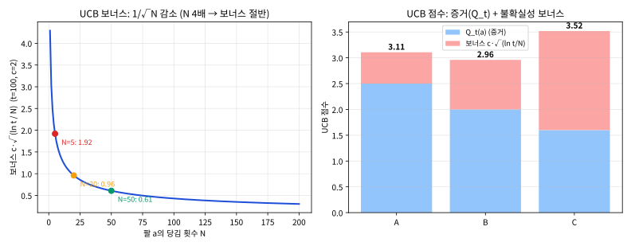

# 2.2 낙관적 초기화와 UCB: 불확실성을 이용한 탐험

[](https://colab.research.google.com/github/SuminHan/book-ml/blob/main/notebooks/ml2/chapter02_2_ucb_optimistic_init.ipynb)

### 이 절에서 무엇을 만들 것인가

2.1절에서는 \\(\varepsilon\\)-greedy를 배웠다 — 탐험과 활용의 비율을
**정해진 확률 \\(\varepsilon\\)**로 정하는, "외부에서 조종하는" 방식이다.
이 절에서는 정반대의 철학을 쓰는 전략 두 가지를 배운다 — **탐험을
알고리즘 내부에서 자동으로 유도하는** 방식이다:

- **낙관적 초기화**(optimistic initialization): "모든 팔을 처음엔 과대평가한다"는
  시작값 하나로, 순수 탐욕적 선택만으로도 초반 탐험이 자동 생성된다.
- **UCB**(Upper Confidence Bound): "아직 덜 당겨본 팔의 추정치는 그만큼
  불확실하다"는 점을 **매 스텝마다** 계산에 반영한다.

왜 이런 "내부 유도형" 전략이 필요할까? \\(\varepsilon\\)-greedy의
탐험은 **정보와 무관하게** 발생한다 — 이미 "이 팔은 최악"이라고 거의
확신한 팔도 \\(\varepsilon\\)의 확률로 계속 당기게 된다. 반면 이 절의
두 전략은 탐험을 **불확실성(아직 모르는 것)에 비례해서만** 쓴다.
이 "모르는 곳만 골라 확인한다"는 원리는, 이 절이 끝날 때쯤이면
**수식 한 줄(UCB 공식)로 완전히 구현**되어 있는 것을 확인할 수 있다.
실습에서는 세 전략(\\(\varepsilon\\)-greedy, 낙관적 초기화, UCB)을
같은 문제에서 붙여 싸워 "탐험에도 비용이 있다"는 감각을 숫자로 만든다 —
이 감각은 Chapter 5(몬테카를로)에서 본격적으로 다룰
**후회(regret)** 개념의 출발점이다.

### 낙관적 초기화: 시작값 하나로 탐험을 유도한다

\\(\varepsilon\\)-greedy는 탐험을 완전히 무작위로 한다 — 이미 나쁘다고
거의 확신하는 팔도 똑같은 확률로 다시 시도한다. **낙관적
초기화**(optimistic initialization)는 다른 트릭을 쓴다: 모든
\\(Q\_0(a)\\)를 실제 가능한 보상보다 훨씬 크게(낙관적으로) 초기화한다.
그러면 탐욕적 선택만으로도, 아직 안 당겨본 팔은 "과대평가된" 상태이므로
자연스럽게 먼저 시도하게 된다 — 시도해서 실망하면(실제 보상이 초기값보다
낮으면) 추정치가 내려가고, 그다음 팔로 넘어간다. 초반 몇 번의 강제적인
탐험을 낙관적인 시작값 하나로 만들어내는 셈이다.

구체적으로 어떤 일이 일어나는지, 팔 3개(A, B, C)에 초기값
\\(Q\_0 = 5.0\\)을 걸고 실제 평균이 \\([1.0, 1.5, 2.0]\\)인 밴딧에서
몇 스텝을 손으로 따라가보자(보상은 매번 표준편차 1의 잡음이 섞임). 증분
갱신식 \\(Q \leftarrow Q + \frac{1}{N}(R - Q)\\) — 2.1절 연습문제 3번에서
"온라인 평균 갱신"과 같음을 이미 확인했다 — 는 **항상** 추정치를 실제
관찰 \\(R\\) 쪽으로 당긴다. 초기값 5.0은 모든 실제 보상보다 위에
있으므로, 어떤 팔을 당겨도 그 추정치는 **반드시 내려간다**.

| 스텝 | 선택(탐욕) | 관찰 보상 \\(R\\) | 갱신 \\(Q \leftarrow Q + \frac{1}{N}(R-Q)\\) | 갱신 후 \\(Q\_A, Q\_B, Q\_C\\) |
|---|---|---|---|---|
| 1 | A (모두 5.0, 동점이면 첫 팔) | 0.64 | \\(Q\_A \leftarrow 5 + \frac{1}{1}(0.64-5)\\) | \\(0.64,\ 5.00,\ 5.00\\) |
| 2 | B (B, C가 여전히 5.0) | 0.94 | \\(Q\_B \leftarrow 5 + \frac{1}{1}(0.94-5)\\) | \\(0.64,\ 0.94,\ 5.00\\) |
| 3 | C (C만 5.0) | 1.33 | \\(Q\_C \leftarrow 5 + \frac{1}{1}(1.33-5)\\) | \\(0.64,\ 0.94,\ 1.33\\) |
| 4 | C (1.33이 최대) | 2.47 | \\(Q\_C \leftarrow 1.33 + \frac{1}{2}(2.47-1.33)\\) | \\(0.64,\ 0.94,\ 1.90\\) |
| 5 | C | 1.35 | \\(Q\_C \leftarrow 1.90 + \frac{1}{3}(1.35-1.90)\\) | \\(0.64,\ 0.94,\ 1.72\\) |

핵심은 스텝 1~3에 있다 — **탐험 확률 0**(매 스텝 \\(\max Q(a)\\)만
고르는 순수 탐욕)인데도, A → B → C 순서로 **모든 팔이 정확히 한 번
씩** 당겨졌다. 낙관적 초기값 5.0이 "한 번도 안 당겨본 팔은 5.0짜리
팔"이라는 가짜 믿음을 만들어두었고, 그 가짜 믿음이 실제 보상(2.0
근처)보다 위에 놓여 있어, 각 팔이 한 번만 당겨지고 추정치가 2.0 아래로
떨어지는 순간 "다음으로 낙관적으로 보이는 팔"이 자동으로 다음 선택이
되었다. 스텝 4부터는 진짜 탐욕적 경쟁으로 넘어가 — 현재 최대 추정치
\\(Q\_C\\)가 유지되는 동안 C에 집중한다. 만약 스텝 4~5에서 C의 보상이
연속적으로 높게 나와 \\(Q\_C\\)가 2.5까지 올랐다면, B(0.94)는 한동안
다시 선택되지 못한다 — **낙관적 초기화의 "탐험"은 초기값이 실제
보상분포를 벗어날 때까지만 지속**된다는 뜻이다.

"왜 초기값을 5.0처럼 **크게** 잡아야 할까?" — 반대로 작은 값(예: 0,
실제 평균보다 아래)으로 초기화하면 증분 갱신식이 추정치를 **올리는**
방향으로만 움직이게 되어, 어떤 팔이든 한 번 당겨보고 "0보다 낫네"라고
판정받은 순간 나머지 팔이 영원히 외면당할 수 있다. 과대평가(상단에서
시작)만이 "모든 팔에 한 번씩의 기회를 주되, 기회는 실망하면 회수한다"는
올바른 방향의 탐험을 만든다.

### UCB: 불확실성 자체를 이용한다

**UCB**(Upper Confidence Bound)는 한 걸음 더 나아간다 — "지금까지 별로
안 당겨본 팔일수록, 그 추정치가 얼마나 정확한지 자체가 불확실하다"는
점을 직접 활용한다. 각 팔을 고를 때, 평균 추정치에 "불확실성 보너스"를
더해서 비교한다:

\\[a\_t = \arg\max\_a \left[Q\_t(a) + c\sqrt{\frac{\ln t}{N\_t(a)}}\right]\\]

\\(N\_t(a)\\)가 작을수록(그 팔을 적게 당겨봤을수록) 제곱근 항이 커져서
보너스가 커진다 — 그 팔이 사실 최선일 수도 있다는 가능성에 정당한
만큼의 기회를 준다. 많이 당겨볼수록(\\(N\_t(a)\\)가 커질수록) 보너스는
줄어들어, 결국 진짜 평균 \\(Q\_t(a)\\)의 크기가 선택을 지배하게 된다.

```python
import math

def ucb_bandit(true_means, c, steps):
    k = len(true_means)
    Q = [0.0] * k
    N = [0] * k
    for t in range(1, steps + 1):
        unplayed = [i for i in range(k) if N[i] == 0]
        if unplayed:
            a = unplayed[0]  # 아직 안 당겨본 팔을 먼저 시도
        else:
            a = max(range(k), key=lambda i: Q[i] + c * math.sqrt(math.log(t) / N[i]))
        r = random.gauss(true_means[a], 1.0)
        N[a] += 1
        Q[a] += (r - Q[a]) / N[a]
    return Q
```

공식이 **왜** 이 형태인지, 세 조각으로 분해해서 각각의 역할을 확인해
두자. (a) \\(Q\_t(a)\\) — "지금까지의 **증거**(utilization)": 많이
당겨보며 쌓아온 평균 추정치. (b) \\(\sqrt{\ln t}\\) — **시간**이
지날수록(전체 스텝이 늘수록) "아직 확인 못 한 팔"의 중요성은 조금씩
올라가야 하는데, \\(\ln t\\)는 느리게 증가하므로 "탐험을 점점 줄이되
**완전히** 끊지는 않는다"는 절충을 만든다(\\(t\\) 자체를 쓰면 탐험이
너무 강해진다). (c) \\(\sqrt{1/N\_t(a)}\\) — **표본 수에 따른 추정치
변동**: 같은 팔을 \\(n\\)번 독립 관찰한 평균은 표준편차 \\(\sigma\\)일
때 \\(\sigma/\sqrt{n}\\)의 불확실성을 가지므로(Chapter 4(회귀)의
편차-분산 논쟁에서 이미 본 "√n의 법칙"), \\(N\_t(a)\\)가 4배가 되면
보너스는 정확히 **절반**으로 준다.

**역사적 일화**: 이 식은 통계학의 "구간추정" 전통에서 온다 — "평균
\\(\mu\\)의 \\((1-\delta)\\)-신뢰구간 상한은
\\(\hat{\mu} + \sigma\sqrt{\frac{2\ln(1/\delta)}{n}}\\) 근처"라는
정규분포 기반의 표준 결과를, "\\(\delta = 1/t\\)(지금까지 t스텝 중
한 번이라도 최선 팔을 놓치지 말자)" 정도로 정하면 정확히
\\(Q\_t(a) + c\sqrt{\ln t / N\_t(a)}\\) 모양이 된다. 즉 UCB는
"**각 팔이 얼마나 좋을 **가능성**(상한)을 최대화하는 팔을 고른다**"는
원칙을, 탐험을 "확률로 우연히 섞는" 것이 아니라 **불확실성의 크기
그 자체에 비례해** 계산하는 알고리즘으로 번역한 것이다. 이름의
"Upper Confidence Bound" — **상한** 신뢰 **계** — 가 정확히 이를
가리킨다.

### 손으로 한 번: UCB 보너스가 실제로 얼마나 차이 나는지 계산하기

\\(t=100\\), \\(c=2\\)인 시점에서, 팔 하나는 지금까지 5번만
당겨봤고(\\(N=5\\)) 다른 팔은 50번 당겨봤다면(\\(N=50\\)), 두 팔의
"불확실성 보너스" \\(c\sqrt{\ln t / N}\\)는 각각:

\\[N{=}5: \quad 2\sqrt{\frac{\ln 100}{5}} = 2\sqrt{\frac{4.605}{5}}
\approx 2\times0.960 \approx 1.919\\]

\\[N{=}50: \quad 2\sqrt{\frac{\ln 100}{50}} = 2\sqrt{\frac{4.605}{50}}
\approx 2\times0.303 \approx 0.607\\]

5번밖에 안 당겨본 팔은 보너스가 **약 1.92**로, 50번 당겨본 팔의 보너스
(**약 0.61**)보다 3배 넘게 크다 — 만약 두 팔의 평균 추정치
\\(Q\_t(a)\\) 자체는 비슷하다면, UCB는 이 보너스 차이 때문에 "덜
당겨본" 팔 쪽을 우선적으로 골라 더 확인해보려 한다. \\(N\\)이
커질수록(분모가 커질수록) 이 보너스는 점점 작아져서, 충분히 많이
당겨본 팔에서는 결국 평균 추정치 \\(Q\_t(a)\\) 자체가 선택을 지배하게
된다 — "잘 모르는 것부터 확인해본다"는 직관이 정확히 이 수식 하나로
구현된 것이다.

이제 보너스가 **선택 결과를 실제로 뒤집는지** 확인하자. 같은 시점
(\\(t=100, c=2\\))에서, 추정치가 서로 **다르는** 세 팔의 UCB 점수를
계산해본다:

| 팔 | \\(Q\_t(a)\\) (평균 추정) | \\(N\_t(a)\\) | 보너스 \\(2\sqrt{\ln 100/N}\\) | UCB 점수 \\(Q\_t + \\)보너스 |
|---|---|---|---|---|
| A | 2.50 | 50 | 0.607 | **3.107** |
| B | 2.00 | 20 | 0.960 | **2.960** |
| C | 1.60 | 5 | 1.919 | **3.519** |

순수 탐욕(\\(Q\_t\\)만 비교)이면 A(2.50)가 확실히 1위다. 그런데 UCB
점수 순위로 보면 **C(3.52) > A(3.11) > B(2.96)** — C는 추정치가 세 팔
중 **최하**(1.60)인데도, "5번밖에 안 당겨봤으니 사실은 최선일 수도
있다"는 보너스 1.92 덕분에 1위가 된다. A와 B를 비교하면, A의
추정치(2.50)가 B(2.00)보다 0.50 높지만 B가 덜 당겨봐서(\\(N=20\\)
vs \\(50\\)) 보너스가 0.35 더 크고, 그래서 UCB에서는 **여전히** A가
B보다 앞선다(0.50 > 0.35, 활용이 이김). 한눈에 들어오는 구조는 이렇다:

- \\(Q\_t\\) 차이(예: A와 B의 0.50)가 **보너스 차이(0.35)보다 크면** →
  UCB도 순수 탐욕과 같은 팔을 고른다(활용이 이김).
- \\(Q\_t\\) 차이가 **보너스 차이보다 작으면** → UCB가 "덜 당겨본"
  팔을 고른다(탐험이 이김). C vs A를 보라: \\(Q\_t\\) 차이는 A가 0.90
  앞서는데, 보너스 차이는 C가 1.31 앞서므로 **탐험이 이겨** C가
  1위가 된다.

즉 UCB는 "탐험을 0이나 1로만 하는" 것이 아니라, **보너스 크기와
추정치 차이를 매 스텝마다 비교**해서, 둘 중 어느 쪽이 더 중요할
때만 탐험을 우선시키는 **연속적인** 절충이다. \\(N\\)이 커지면 보너스가
\\(1/\sqrt{N}\\)로 감소하므로, 결국 \\(Q\_t\\)가 지배하는 영역으로
자연스럽게 넘어간다 — "탐험의 양"을 하이퍼파라미터로 고정하는
\\(\varepsilon\\)-greedy와 본질적으로 다른 부분이다.



### 자주 하는 실수: 아직 안 당겨본 팔을 UCB 공식에 그대로 대입하기

`ucb_bandit` 코드가 `unplayed`(아직 \\(N=0\\)인 팔) 목록을 따로 확인해서
**먼저 강제로** 시도하게 만드는 이유를 숫자로 보면 명확해진다 —
\\(N(a)=0\\)을 UCB 공식 \\(c\sqrt{\ln t/N(a)}\\)에 그대로 대입하면
0으로 나누기 오류가 난다(수학적으로도 "한 번도 안 당겨본 팔의
불확실성"은 무한대에 가까워야 자연스럽다). 이걸 놓치고 그냥 공식부터
적용하는 코드를 짜면 프로그램이 첫 스텝부터 에러로 멈춘다 — UCB를
구현할 때 "아직 아무도 안 당겨본 팔이 남아있으면 그것부터 시도한다"는
초기화 단계를 절대 빼먹으면 안 되는 이유다. 이 초기화 자체가 사실
"모든 팔의 불확실성 보너스가 무한대인 상태에서 시작해서, 당겨볼수록
그 무한대가 유한한 값으로 줄어든다"는 UCB의 논리를 자연스럽게
확장한 것이기도 하다.

### 확인 문제: 이 전략의 "탐험"은 어디서 오는가?

2.1의 \\(\varepsilon\\)-greedy와 이 절의 두 전략을 구분하는 기준을
정리하자 — **"탐험이 정보(지금까지의 \\(Q, N\\))에 의존하는가, 아니면
그냥 고정 확률인가?"** 세 전략을 이 기준으로 분류해보자(답은 각
문항 아래에 있다):

- **(a)** 매 스텝에서 확률 \\(\varepsilon=0.1\\)으로 무작위 팔,
  나머지 0.9로 현재 최대 \\(Q\\) 팔을 고른다.
  > 답: **외부 조종형(\\(\varepsilon\\)-greedy)** — 정보와 무관하게
  > 고정 확률로 탐험한다. 이미 "최악"이라고 확신한 팔도 계속 당긴다.
- **(b)** 모든 \\(Q\_0(a)\\)를 5.0으로 초기화하고, 그 뒤로는 매 스텝
  \\(\max Q(a)\\)만 고른다.
  > 답: **내부 유도형(낙관적 초기화)** — 탐험은 "초기값 5.0이 실제
  > 보상보다 위에 있어 추정치가 내려올 때까지" 자연스럽게 일어난다.
  > 초반 이후로는 추가 탐험 장치가 **없다**.
- **(c)** 매 스텝마다 \\(Q\_t(a) + c\sqrt{\ln t / N\_t(a)}\\)가 최대인
  팔을 고른다(아직 안 당겨본 팔이 있으면 그것부터).
  > 답: **내부 유도형(UCB)** — 매 스텝마다 **현재의** \\(N\_t(a)\\)를
  > 보너스에 반영하므로, 환경이 계속 바뀌어도(아래 "비정상 환경"
  > 참조) 계속 적응적으로 탐험한다.

세 분류를 한 줄로 요약하면: (a)는 "탐험의 **양**을 고정 확률로
조종", (b)는 "탐험을 **초기값** 하나로 예약", (c)는 "탐험을 **매
스텝 재계산**"이다. 같은 "탐험"이라도 그 **동작 방식**이 완전히
다르다 — 이 차이는 이 절 후반의 비정상 환경 예에서 실전적 의미를
가진다.

### 자주 묻는 질문

**Q. \\(c\\)는 어떻게 정하나요?** \\(c\\)가 클수록 불확실성 보너스가
커져서 탐험을 더 적극적으로 하고, 작을수록(0에 가까울수록) 순수
탐욕적 선택에 가까워진다 — Chapter 5.2의 SVM \\(C\\), Chapter 6의
\\(\lambda\\)와 마찬가지로 검증(또는 시뮬레이션) 성능으로 튜닝해야
하는 하이퍼파라미터다. 이론적으로 후회(regret)를 최소화하는 \\(c\\)의
범위가 증명되어 있지만(이 책 범위를 넘는다), 실전에서는 \\(c=1\\)이나
\\(c=2\\) 근처에서 시작해 조정하는 경우가 흔하다.

**Q. 낙관적 초기화와 UCB 중 뭐가 더 나은가요?** 낙관적 초기화는
구현이 훨씬 간단하지만(그냥 초기값만 크게 잡으면 끝), 초반 탐험이
끝나고 나면 더 이상 탐험을 유도할 장치가 없다 — 비정상(non-stationary)
환경(2.1절 FAQ)처럼 진짜 평균이 시간에 따라 바뀌는 문제에서는 취약하다.
UCB는 매 스텝마다 불확실성을 다시 계산하므로 계속 적응적으로
탐험하지만, 그만큼 계산이 조금 더 필요하다. 실전에서는 문제의
성격(환경이 고정적인가, 계속 바뀌는가)에 따라 골라 쓴다.

**Q. 세 전략을 한 줄로 비교하면 어떤가요?** \\(\varepsilon\\)-greedy는
"탐험의 **양**을 확률로 조종한다" — 간단하지만 정보와 무관하게
탐험한다. 낙관적 초기화는 "탐험을 **초기값** 하나로 예약한다" —
구현이 가장 간단하지만, 초기값이 실제 보상을 벗어날 때까지만 탐험이
일어난다. UCB는 "탐험을 **매 스텝의 불확실성**에 비례해 자동
계산한다" — 가장 정교하고, 비정상 환경에도 적응한다.

**Q. UCB 보너스가 보상의 "스케일"과 잘 맞나요?** 보너스
\\(c\sqrt{\ln t/N}\\)의 스케일은 **보상의 변동성(표준편차
\\(\sigma\\))**에 비례해야 자연스럽다(실제 이론에서는 \\(\sigma\\)가
계산에 직접 들어가 있다). 이 책의 예에서는 보상이 표준편차 1인
정규분포로 나오므로(\\(random.gauss(\cdot, 1.0)\\)), \\(c=1,2\\)가
"보너스가 보상 잡음과 같은 스케일"이라는 직관으로 해석할 수 있다.
만약 실제 보상의 표준편차가 10이라면(예: 광고 클릭률 변동이 큰 편차로
벌어지는 경우), \\(c=2\\)의 보너스는 잡음에 비해 너무 작아 탐험이
거의 일어나지 않는다 — \\(c\\)를 보상 스케일에 맞춰 조정해야 한다는
뜻이다.

### 실습: 세 전략의 누적 보상 비교

세 가지 탐험 전략(ε-greedy, 낙관적 초기화, UCB)을 같은 밴딧 문제에서
직접 겨뤄보자 — "추정치가 얼마나 정확한가"가 아니라 "그 과정에서 실제로
얼마나 많은 보상을 벌었는가"를 비교하는 것이 핵심이다(탐험 자체에도
비용이 있다는 뜻이다: 나쁜 팔을 시도해보는 동안 그만큼 보상을 손해
본다).

```python
def total_reward_epsilon_greedy(true_means, epsilon, steps):
    k = len(true_means)
    Q, N, total = [0.0] * k, [0] * k, 0.0
    for _ in range(steps):
        a = random.randrange(k) if random.random() < epsilon \
            else max(range(k), key=lambda i: Q[i])
        r = random.gauss(true_means[a], 1.0)
        N[a] += 1
        Q[a] += (r - Q[a]) / N[a]
        total += r
    return total

def total_reward_optimistic(true_means, initial_q, steps):
    k = len(true_means)
    Q, N, total = [initial_q] * k, [0] * k, 0.0  # 실제 보상보다 훨씬 큰 초기값
    for _ in range(steps):
        a = max(range(k), key=lambda i: Q[i])  # 탐욕적 선택뿐이지만
        r = random.gauss(true_means[a], 1.0)   # 낙관적 초기값 덕에 자동 탐험됨
        N[a] += 1
        Q[a] += (r - Q[a]) / N[a]
        total += r
    return total

def total_reward_ucb(true_means, c, steps):
    k = len(true_means)
    Q, N, total = [0.0] * k, [0] * k, 0.0
    for t in range(1, steps + 1):
        unplayed = [i for i in range(k) if N[i] == 0]
        a = unplayed[0] if unplayed else \
            max(range(k), key=lambda i: Q[i] + c * math.sqrt(math.log(t) / N[i]))
        r = random.gauss(true_means[a], 1.0)
        N[a] += 1
        Q[a] += (r - Q[a]) / N[a]
        total += r
    return total

true_means = [1.0, 1.5, 2.0]
steps = 2000
# 각 전략마다 seed를 다시 걸면 세 전략이 같은 무작위 시퀀스를
# 독립적으로 경험하게 되어 공정한 비교가 된다:
random.seed(0); print("ε-greedy 총 보상:    ", round(total_reward_epsilon_greedy(true_means, 0.1, steps), 1))
random.seed(0); print("낙관적 초기화 총 보상:", round(total_reward_optimistic(true_means, 5.0, steps), 1))
random.seed(0); print("UCB 총 보상:         ", round(total_reward_ucb(true_means, 2.0, steps), 1))
```

세 전략 모두 결국 진짜 최선의 팔(평균 2.0)을 찾아내지만, **총 보상**
기준으로는 순위가 갈린다 — 무작위로 나쁜 팔을 계속 찔러보는
ε-greedy보다, "불확실성이 큰 곳"이나 "아직 낙관적으로 보이는 곳"만
골라서 찔러보는 UCB·낙관적 초기화가 대체로 더 높은 누적 보상을 낸다.
이 "탐험에도 비용이 있다"는 감각은 Chapter 5(몬테카를로)부터 등장하는
**후회(regret)** 개념의 직관적 출발점이다.

### 실습에서 실제로 나오는 숫자: seed=0, \\(k=3\\), 2000스텝

위의 코드에서 세 전략 함수를 각각 \\(random.seed(0)\\)의
**새로운 상태**로 실행하면(\\(\varepsilon=0.1\\), 초기값 \\(5.0\\),
\\(c=2.0\\)) 다음 결과가 나온다(노트북 4번 섹션에서 이 실행을 직접
확인한다):

| 전략 | 총 보상 (2000스텝) | \\(N = (N\_A, N\_B, N\_C)\\) | \\(Q = (Q\_A, Q\_B, Q\_C)\\) |
|---|---|---|---|
| \\(\varepsilon\\)-greedy (\\(\varepsilon=0.1\\)) | **3893.9** | (82, 50, 1868) | (0.978, 1.315, 2.006) |
| 낙관적 초기화 (\\(Q\_0=5.0\\)) | **4007.7** | (3, 1, 1996) | (1.099, 0.103, 2.006) |
| UCB (\\(c=2.0\\)) | **3940.2** | (35, 72, 1893) | (1.150, 1.476, 2.004) |

세 가지 관찰. (1) **낙관적 초기화가 총 보상 1위**(4007.7) — "초기값
5.0이 실제 보상(2.0)보다 위에 있어, 각 팔이 **최소 한 번**은 당겨진
뒤 가장 좋은 팔(C)에 집중"한 효율이 가장 높다. (2) **\\(\varepsilon\\)
= 0.1이 3위**(3893.9) — "탐험 확률 0.1"이 정보와 무관하게 나쁜 팔
(A: 82회, B: 50회)을 계속 다시 당기며 보상을 낭비한다. (3)
**UCB는 중간**(3940.2) — "불확실성이 큰 팔"만 골라 다시 확인하므로
\\(\varepsilon\\)-greedy보다 낭비가 적지만, 낙관적 초기화처럼 "각 팔을
정확히 한 번씩"이라는 최소 비용 보장은 해주지 않는다.

세 전략의 **누적 보상 곡선**(위)과 **각 팔의 당김 횟수**(아래)를
그림으로 보면 이 차이가 한눈에 들어온다:

![세 전략의 누적 보상 곡선(위)과 각 팔의 당김 횟수(아래) — 같은 3팔 밴딧(true means [1.0, 1.5, 2.0], seed=0, 2000스텝). 낙관적 초기화가 총 보상 1위(약 4008), UCB 2위(약 3940), ε-greedy 3위(약 3894). 아래 그래프에서 ε-greedy만 나쁜 팔(A, B)을 대량으로 다시 당긴 것이 보인다](../../images/ch02_2_ucb_h2h.svg)

### 팔 개수가 늘어나면: \\(k=10\\) 예

\\(k=3\\)에서는 세 전략이 모두 "최선 팔 찾기"에 성공했다. 그런데 팔이
10개면(평균이 0.5부터 1.3까지 0.1 간격으로 9개에, 마지막 10번째
팔만 2.0인 경우) 같은 비교가 **더 극적으로** 벌어진다. 같은 seed=0,
2000스텝, \\(k=10\\)에서:

- **낙관적 초기화**(\\(Q\_0=5.0\\)): 각 팔이 **정확히 1번**만
  당겨진 뒤, 가장 좋게 나온 팔(10번째, 평균 2.0)에 집중. 결과:
  10번째 팔이 1991회, 나머지 9개 팔이 각 1회. 총 보상 4001.3.
- **UCB**(\\(c=2.0\\)): "불확실성이 큰 팔"을 계속 골라 다시
  확인. 결과: 10번째 팔이 1786회, 나머지 팔이 10~53회 범위
  (합계 214회). 총 보상 3802.1.

\\(k\\)가 커질수록 **\\(\varepsilon\\)-greedy의 낭비**는 선형으로
자란다 — \\(\varepsilon=0.1\\)의 무작위 탐험이 10개 팔 중 골라지면
나쁜 9개 팔에 떨어질 확률이 높고, 그 낭비는 \\(k\\)에 비례해
늘어난다. 반면 **낙관적 초기화**는 "각 팔 1회"라는 최소 비용으로
모든 팔의 평균을 **한 번씩만** 확인하므로, 탐색 비용이 \\(k\\)에
그친다(여기서 9회). UCB는 \\(\sqrt{\ln t/N}\\)가 \\(N\\)이 작을수록
크므로 \\(k\\)개 팔 모두에 어느 정도 기회를 주되, \\(N\\)이 커지는
팔은 자연스럽게 줄인다 — "탐험 비용을 \\(k\\)에 대해 **서브선형**으로
억제"하는 것이다. 팔이 수천 개(예: 온라인 광고의 수천 개 배너)인
실전 문제에서는 바로 이 차이가 전략 선택을 가른다.

### 비정상 환경: 환경이 바뀌면 누가 살아남나?

2.1절 FAQ에서 "비정상(non-stationary) 환경"이라는 말을 한 번
봤다 — 진짜 평균 보상 \\(q^\*(a)\\)가 **시간에 따라** 바뀌는
환경이다. 슬롯머신 예로 말하면, 카지노 운영자가 중간에 "이 슬롯의
당첨 확률"을 몰래 바꿔놓는 경우다. 이런 환경에서는 "한 번 최선
팔을 찾으면 끝"이라는 전제가 **깨진다** — 예전 최선이 더 이상
최선이 아닐 수 있다. 세 전략이 이런 환경에서 어떻게 다른지
구체적인 예로 확인해보자.

**시나리오**: \\(k=3\\), 팔 A·B·C. 처음 1500스텝 동안
\\(q^\* = [1.0, 1.5, 2.0]\\)으로 **C가 최선**, 그 뒤 500스텝 동안
**순위가 바뀌어서** \\(q^\* = [0.5, 2.0, 1.0]\\)로 변한다(이제
**B가 최선**, C는 중간으로 하락). 같은 seed=0, 2000스텝 전체를
돌리고 **마지막 500스텝(환경이 바뀐 구간)의 평균 보상**을 비교하면:

| 전략 | 마지막 500스텝 평균 보상 | 마지막 \\(Q\\) (추정치) | 마지막 \\(N\\) |
|---|---|---|---|
| \\(\varepsilon\\)-greedy (\\(\varepsilon=0.1\\)) | +0.97 | (0.89, 1.41, 1.75) | (82, 50, 1868) |
| 낙관적 초기화 (\\(Q\_0=5.0\\)) | +1.02 | (1.10, 0.10, 1.76) | (3, 1, 1996) |
| UCB (\\(c=2.0\\)) | **+1.86** | (1.13, 1.91, 1.96) | (34, 492, 1474) |

진짜 최선(B)의 평균 보상이 2.0인 구간에서, **UCB가 1.86으로 거의
최선**을 잡는다 — 환경이 바뀌면서 "예전 최선"이던 C의 보상이 1.0으로
떨어지자, B의 보너스(\\(N\_B = 492\\)로 작지는 않지만
\\(N\_C = 1474\\)보다 훨씬 작으므로)가 C보다 **여전히 크고**, B의
\\(Q\\)가 서서히 1.91까지 올라오며 다시 **활용**으로 넘어간다.
반면 **낙관적 초기화**는 1.02로 **새 최선을 놓친다** — 초기값 5.0이
"모든 팔 한 번"을 보장한 뒤에는 **추가 탐험 장치가 없으므로**, 환경이
바뀌어도 예전 최선이던 C(1996회)에 계속 매달린다(B는 \\(N\_B = 1\\)로
거의 안 당겨져서, B의 \\(Q\\)가 0.10으로 **완전히** 틀린 추정치를
유지한다). \\(\varepsilon\\)-greedy는 0.97로 UCB보다 낮지만, 낙관적
초기화와 비슷하다 — 고정 확률 0.1이 "환경이 바뀌었는지 확인하는"
약한 탐험 역할을 하기 때문이다.

이 예가 보여주는 **핵심 구분**: **낙관적 초기화의 "탐험"은 초반에
일괄 예약**(각 팔 1회)인 반면, **UCB의 "탐험"은 매 스텝 재계산**
(\\(N\\)이 작은 팔에 계속 보너스 부여)이다. 고정(stationary) 환경
에서는 둘 다 "최선 팔 찾기"에 성공하지만, **비정상 환경**에서는 UCB의
"계속 재계산"이 **환경 변화를 감지하고 적응**하는 사실상 유일한
전략이다. 이 차이는 Chapter 6(TD 학습)의 "고정 \\(\alpha\\) vs
\\(1/N\\)" 논쟁과 정확히 같은 구조다 — **정보의 "신선도"를 유지**
하는지가 비정상 환경에서 성패를 가른다.

### 자주 하는 실수: "초반 몇 번만 탐험하면 끝"이라고 UCB를 낙관적 초기화로 대체하기

낙관적 초기화와 UCB는 **초반에는** 거의 같은 일을 하는 것처럼
보일 수 있다 — 둘 다 "아직 안 당겨본 팔"을 먼저 시도한다.
그러나 이 둘은 **초반 이후**가 완전히 다르다(위의 "비정상
환경" 예가 그 증거다). 실전에서 이 둘을 혼동하는 흔한 패턴은
둘이다:

1. **"초반 k회만 무작위로 당기고, 이후엔 순수 탐욕"**을 UCB로
   착각. 이 방식은 **탐험을 k회로 고정**하므로, k 이후에 환경이
   바뀌어도 **전혀** 적응하지 못한다 — 낙관적 초기화(각 팔 1회가
   보장된다면)보다도 더 위험할 수 있다(k가 작으면 "각 팔 1회"
   보장조차 안 됨).
2. **UCB의 보너스를 "한 번만 계산"**하고(예: 초기 시점의 보너스를
   그대로 사용), 이후에는 \\(Q\_t\\)만 비교. 이 경우 \\(N\\)이
   커져도 보너스가 **감소하지 않아서** UCB의 "탐험이 점점
   줄어든다"는 메커니즘이 **완전히** 사라진다 — 사실상 "불확실성
   보너스까지 붙인 고정 탐험"이 되어버린다.

UCB를 구현할 때는 반드시 **매 스텝마다 갱신된 \\(N\_t(a)\\)로
보너스를 재계산**해야 한다. 이 "재계산"이 UCB의 **본질**이며,
빼먹으면 UCB가 아니다.

**낙관적 초기화는 "탐험을 초기값 하나로 예약"하고, UCB는 "탐험을
매 스텝의 불확실성으로 재계산"한다 — 고정 환경에서는 둘 다
일하지만, 환경이 바뀌는 문제에서는 UCB의 "계속 재계산"만이
살아남는다. 이 둘은 둘 다 \\(\varepsilon\\)-greedy의 "정보와
무관한 고정 탐험"보다 나은 방향(불확실성에 비례하는 탐험)을
가리킨다.**
