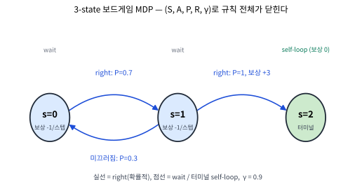

# 3.1 MDP의 다섯 요소와 마르코프 성질

[](https://colab.research.google.com/github/SuminHan/book-ml/blob/main/notebooks/ml2/chapter03_1_mdp_elements.ipynb)

### 이 절에서 무엇을 만들 것인가

이 절은 두 가지를 만든다. 첫째, 강화학습 문제를 **수학적으로 한 줄에[^suttonbarto]
쓰는 법**을 얻는다 — MDP는 다섯 가지 요소 \\((\mathcal{S}, \mathcal{A}, P,
R, \gamma)\\) 하나로 "게임의 규칙 전체"를 닫는 형식이다. 둘째, 그 형식이
성립하려면 필요한 **마르코프 성질**의 정확한 의미와, 그것이 실제로는
언제 깨지는지(그리고 깨졌을 때 어떻게 다시 성립시키는가)를 다룬다. 이 두
것은 앞으로 16개 챕터에서 매일 쓰게 될 언어의 사전이다 — 벨만방정식
(3.3), 정책평가(4.1), Q-learning(6)의 모든 수식이 결국 \\(\mathcal{S},
\mathcal{A}, P, R\\) 위에서 쓰인 것이라, 여기의 표기가 헷갈리면 뒤의
모든 것이 흐릿해진다.

### MDP의 다섯 요소

MDP는 다섯 가지로 정의된다: \\((\mathcal{S}, \mathcal{A}, P, R, \gamma)\\)

- \\(\mathcal{S}\\): 가능한 상태들의 집합
- \\(\mathcal{A}\\): 가능한 행동들의 집합
- \\(P(s'|s,a)\\): 상태 \\(s\\)에서 행동 \\(a\\)를 했을 때 상태 \\(s'\\)로
  전이될 확률
- \\(R(s,a)\\): 상태 \\(s\\)에서 행동 \\(a\\)를 했을 때 받는 즉시 보상
- \\(\gamma \in [0,1)\\): 할인율(discount factor)

Chapter 2의 밴딧과 비교하면 정확히 무엇이 추가됐는지 보인다 — 밴딧에는
\\(\mathcal{S}\\)도 \\(P\\)도 없었다(팔을 당겨도 "다음 상태"가 없었다).
MDP는 지금 한 행동이 다음 상태 \\(P(s'|s,a)\\)를 통해 미래 전체에 영향을
준다는 사실을 명시적으로 담는다.

"이 다섯 개면 충분한가?"가 바로 이 절의 핵심 질문이다. MDP의 정의를
읽으면 "상태"가 모든 정보의 화폐(currency)로 등장한다 — 보상은
\\((s,a)\\)에서, 다음 상태는 \\((s\_t, a\_t)\\)에서 결정된다. 즉 **상태만
알면 앞으로 일어날 것의 전체 확률법칙이 결정된다**. 이 문장이 바로
"마르코프 성질"이라고 부르는 것의 정확하고 강한 형태다(다음 섹션에서
정식화한다). 다섯 요소가 "게임의 규칙 전체"를 담는다는 뜻이 바로 이것
이다 — 초기 상태 분포는 알고리즘에 필요한 정보가 아니다(학습은 어떤
시작점에서든 똑같이 진행되며, 그 점은 연습문제 4에서 확인한다).

### 역사: 이름이 붙은 두 수학자, 반세기의 드라마

**"마르코프"는 안드레이 마르코프(Андрей Марков, 1856–1922)** — 확률론과
수론을 오가던 러시아 수학자다. 그의 1906년 논문은 당시 수학계의 "금기"를
부순 것이었다. 그 무렵 확률의 대명사 **베르누이 법칙**(독립 반복 시행의
상대빈도가 확률로 수렴)이 확률론의 왕좌를 차지하고 있었는데, 마르코프는
**시행들이 서로 의존하는** 경우에도 수렴하는 구조를 발견했고 — "이번 결과
가 직전 결과만 기억하고 이전은 잊는" 의존성이라면, 즉 지금의 마르코프
체인의 경우에도, 베르누이 법칙이 여전히 성립한다는 것을 보였다. 의존성이
들어와도 법칙이 살려면 그 의존성은 **1단계만**이어야 한다는 발견이,
120년 뒤의 강화학습에서 "상태 하나만 기억하면 된다"는 설계 원칙으로
직접 이어진다.

**"벨만"은 리처드 벨만(Richard Bellman, 1920–1984)** — 2차전지 중
미공군 폭격 편성 문제를 풀면서 "최적 전략은 부분 문제의 최적 전략을
재귀적으로 조합할 수 있다"는 원리(최적성의 원리)를 발견한 수학자다.
그가 1957년 저서 *Dynamic Programming*에서 세운 프레임워크가 바로 MDP의
정식화다. 흥미로운 우연 — 마르코프 성질을 발견한 논문(1906)과 MDP의
정식화(1957) 사이는 50년, 그런데 두 사람의 문제는 **정확히 같은 문제의
양쪽 끝**이다: 마르코프는 "이 의존 구조가 어떤 확률법칙을 결정하는가"
(기술, description), 벨만은 "그 법칙 위에서 최적 행동을 어떻게 찾
는가"(최적화, optimization). 이번 학기의 구조 — 이번 장(정식화) →
Chapter 4~6(최적화) — 이 드라마의 둘째막이다.

### 한 편의 MDP를 통째로 쓰기: 3칸 보드게임

추상적으로 다섯 요소를 나열하는 것만으로는 "게임의 규칙 전체"가 어떤
형태인지 체감되지 않는다. 아주 작은 MDP 하나를 **통째로** 써보자. 3칸
(상태 0, 1, 2)으로 된 보드게임을 생각한다: 에이전트는 상태 0에서 시작
하고, 매 스텝 "오른쪽으로 한 칸" 또는 "자리참기" 중 하나를 고르며, 상태
2에 도착하면 에피소드가 끝난다. 이동은 확률적이라 "오른쪽"을 골라도
0.3의 확률로 제자리에 미끄러진다.

- **\\(\mathcal{S} = \\{0, 1, 2\\}\\)** — 보드의 세 칸. 2는 **터미널
  상태**(terminal state, 게임 종료 상태)다.
- **\\(\mathcal{A} = \\{\text{right, wait}\\}\\)** — 두 행동.
- **\\(P\\)** (전이확률): 상태 0에서 right면 1(확률 0.7)로, 0(미끄러
  짐, 확률 0.3)로; wait이면 0으로 확률 1. 상태 1에서 right면 2로 확률
  1, wait이면 1로 확률 1. 터미널 상태 2에서는 어디를 가도 자기 자신으로
  확률 1(self-loop).
- **\\(R\\)** (보상): 터미널로 들어갈 전이(1에서 right)는 **+3**을 주고,
  그 외 모든 스텝은 **-1**(한 스텝 움직이는 데 드는 "시간 벌금").
- **\\(\gamma = 0.9\\)**.

이 다섯 개(5-tuple)가 쓰이는 순간, 이 게임의 "규칙"은 **완전히**
정해졌다. 어떤
시작점에서든, 어떤 정책(상태마다 행동을 고르는 규칙)으로 놀든, 받을
보상 시퀀스의 **전체 확률분포**가 이 다섯 요소만으로 계산된다 — 게임에
"보이지 않는 상태"가 없어야 한다는 전제(= 마르코프 성질)를 붙이면
정확하다. 다음 장에서 벨만방정식으로 \\(V^\\pi(s)\\)를 계산하면, 여기
쓰인 \\(P\\)와 \\(R\\)가 그대로 수식에 대입된다 — 형식과 계산이 분리
되지 않고 정확히 이어지는 것을 확인하게 된다.



 [^gym]

### 각 요소 하나씩: "왜"를 붙여서

**\\(\mathcal{S}\\), 상태 공간.** 상태는 "에이전트의 관점에서의 세계의
완전한 기술"이어야 한다. CartPole의 상태
\\([x, \dot{x}, \theta, \dot{\theta}]\\)가 4차원인 이유는, 위치 두 개만
알고 속도 두 개를 모르면 "막대가 아직 기울어지고 있는가, 멈춰 있는가"를
분간할 수 없기 때문이다. **상태에 빠진 정보는 에이전트에게 영구히
사라진 정보**다 — 보상이나 전이를 통해 돌아올 통로가 없기 때문이다. 이
"상태 설계"가 MDP를 세울 때 가장 많은 시간이 드는 일이며, 실제로 마르
코프 성질이 "깨진" 문제의 대증요법도 전부 상태 설계다(아래
"마르코프 성질이 성립하지 않을 때" 참고). 연속 상태 공간(벡터)도 흔
하다 — CartPole처럼 \\(\mathcal{S} \subset \mathbb{R}^n\\)인 경우, 이
학기에서는 표가 아니라 신경망으로 함수를 표현하게 된다(Chapter 9~11).

**\\(\mathcal{A}\\), 행동 공간.** 이산(CartPole의 left/right, FrozenLake의
4방향)과 연속(Pendulum의 \\([-2, 2] \subset \mathbb{R}\\) — 힘의 크기
그 자체를 고른다)이 있다. 이산/연속의 차이는 곧 "어떤 함수를 표현할
가"의 문제다 — 이산이면 상태×행동 크기의 표, 연속이면 연속 출력의
신경망(Chapter 9 vs 10~11의 분기가 여기서 나온다).

**\\(P\\), 전이확률.** \\(P(s'|s,a)\\)는 "이 게임의 물리 법칙"이다.
Gymnasium[^gymnasium] 환경에서는 이 함수가 `step()` 함수의 내부 구현으로 감춰져
있고, 우리는 **샘플**(실제 전이)만 관찰할 수 있다. 두 가지 사용 방식이
있다: **모델 기반**(model-based, Chapter 4~5의 동적계획법)은 \\(P\\)를
(추정해서) 명시적으로 써서 계획을 세우고, **모델 없는**(model-free,
Chapter 6~11)은 \\(P\\)를 전혀 쓰지 않고 경험(실제 전이 샘플)에서만
가치를 배운다. 같은 \\(P\\)라도 "정식적 표"로 줄 것이냐 "샘플 공급
원"으로 둘 것이냐가 알고리즘의 가족을 갈라놓는 첫 번째 갈림길이다.

**\\(R\\), 보상.** 보상은 \\(R(s,a)\\)이 아니라 **전이** \\(R(s,a,s')\\)
에 붙는 것이 수학적으로 더 정확하다(같은 \\((s,a)\\)에서도 다음 상태가
다르면 보상이 다를 수 있기 때문 — "목표에 도착했다/아직이다"는 \\(s'\\)
를 봐야 알 수 있다). Gymnasium은 \\(R(s,a,s')\\)을 돌려주지만, 많은 문제
에서 보상이 다음 상태에 의존하지 않아(모든 \\(s'\\)에서 같은 값)
\\(R(s,a)\\)로 간단히 쓴다. 보상의 **단위·스케일**은 알고리즘에 직접
영향을 준다 — 보상을 10배 키우면 가치함수 전체가 10배가 되지만 **최적
정책은 변하지 않는다**(모든 Q값에 같은 상수를 더하거나 같은 양수
스케일로 곱해도 argmax는 보존된다, 연습문제 5). 그러나 보상의 스케일이
**다른 행동/상태 사이에서 불균일**하게 들쭉할 수 있는 상황은 조심해야
한다 — Chapter 5에서 보상이 스케일에 따라 탐험 균형이 깨지는 사례를
본다.

**\\(\gamma\\), 할인율.** \\(\gamma\\)의 역할(무한급수의 수렴을 보장하고,
"지금 보상"과 "미래 보상"의 교환 비율을 정하는 것)은 3.2에서 자세히
다룬다. 여기서는 MDP **정의**의 관점에서 한 가지만 짚어둔다:
\\(\gamma < 1\\)은 "에이전트가 영원히 살지 않는 세계"를 뜻하며, 이것이
\\(V^\\pi, Q^\\pi\\)가 유계 함수로 존재하게 하는 **수학적 필요 조건**이다.

### 마르코프 성질

**마르코프 성질**(Markov property)[^suttonbarto]: 다음 상태는 오직
**현재** 상태와 행동에만 의존한다 — 어떻게 지금 상태에 도달했는지(과거 전체 이력)는
상관없다:

\\[P(s\_{t+1} | s\_t, a\_t, s\_{t-1}, a\_{t-1}, \ldots, s\_0) = P(s\_{t+1} | s\_t, a\_t)\\]

예: 체스판의 현재 배치만 알면, 거기까지 어떤 수순을 거쳐왔는지는 다음
수를 정하는 데 필요 없다. 이 성질이 성립한다는 가정 덕분에, "지금까지의
전체 이력"이 아니라 "현재 상태" 하나만 기억하면 충분해진다 — 뒤에서
배울 알고리즘들이 상태 하나만 보고 결정을 내릴 수 있는 이유가 여기서
나온다.

이 정의에서 "상관없다"가 **확률적으로 정확히** 무엇을 뜻하는지 한 번만
정식적으로 열어보자. 조건부 확률의 정의와 사건의 독립성으로부터:

\\[P(s\_{t+1}=s' \mid s\_t, a\_t, s\_{t-1}, a\_{t-1}, \ldots) = P(s\_{t+1}=s'
\mid s\_t, a\_t)\\]

가 **모든** 과거 이력 \\((s\_{t-1}, a\_{t-1}, \ldots, s\_0)\\)과 **모든**
다음 상태 \\(s'\\)에 대해 성립할 때, \\(s\_t\\)가 (\\(a\_t\\)를 준 상태에서
의) 마르코프 성질을 가른다고 한다. "상관없다"는 직관이 이 식으로 번역
되는 순간, **검증 가능한 주장**이 된다 — 실습 노트북에서 실제로
샘플링해서 양변의 확률추정치가 일치하는지 확인할 것이다.

### 왜 이 성질이 알고리즘의 모든 것을 결정하는가

마르코프 성질이 "좋은 가정"을 넘어서 **필요 불가결**인 이유가 있다.
성질이 없다면:

- **상태가치가 정의되지 않는다.** \\(V^\\pi(s)\\)는 "상태 \\(s\\)에서
  시작"의 리턴 기댓값인데, "같은 \\(s\\)"에 과거 이력이 다른 두 경로
  가 존재하고 그 미래 분포가 다르면, \\(s\\)에만 인자화한 하나의 함수
  \\(V(s)\\)로 그 둘을 동시에 설명할 수 없다 — 같은 자리에 "두 개의
  다른 가치"가 공존하게 되는데, 표 기반 알고리즘은 한 칸에 한 값만
  쓸 수 있다.
- **학습이 수렴하지 않는다.** 같은 상태 \\(s\\)를 매번 다른 "진짜
  상황"의 대리인으로 쓰면, 추정치는 서로 다른 답을 향해 계속 튀어
  다닌다. Chapter 6~11에서 보는 모든 수렴 증명은 "같은 \\(s\\)는 같은
  미래 분포를 갖는다"는 이 동일성 위에 서 있다.

반대로 성질이 성립하면, 상태 하나가 **과거 전체를 압축하는 무손실
요약**이 된다 — 통계학의 표현을 빌리면, 상태는 미래에 대한 과거 이력의
**충분 통계량(sufficient statistic)** 역할을 하는 것이다. 이 성질
덕분에 "기억의 길이"가 문제에서 빠져나가고, **현재 관측** 하나로
의사결정이 닫힌다.

### 마르코프 성질이 성립하지 않을 때: hidden state와 상태 재설계

현실은 대부분 **부분관측**(partially observed)이다 — 에이전트가 보는
"관측"이 진짜 상태의 완전한 투영이 아니다. 자율주행의 예(아래 FAQ에서
다시 나온다)가 대표적이다: 카메라 한 장만 관측으로 쓰면, "지금 얼마나
빠르게 움직이고 있었는가"라는 정보가 빠져 있어, 같은 화면에서 "속도가
높은 상황"과 "속도가 낮은 상황"이 구별되지 못한다 — 이 둘은 같은
\\(s\_{\text{obs}}\\)이지만 미래 분포가 **달라** 마르코프 성질이
깨진다.

이를 해결하는 표준 전략은 두 가지다.

1. **상태에 정보를 직접 넣는다.** 최근 \\(k\\)프레임
   \\((o\_t, o\_{t-1}, \ldots, o\_{t-k+1})\\)를 하나의 "확장 상태"로 묶어
   \\(s\_t\\)로 재정의한다. \\(k\\)가 충분하면 속도 정보가 (프레임 차이
   로) 복원되어 성질이 다시 성립한다. 이 방법은 해석이 쉬우나, \\(k\\)를
   몇으로 할지라는 **손으로 고르는 하이퍼파라미터**가 생긴다는 단점이
   있다.
2. **학습된 은닉 상태로 요약한다.** 신경망(예: RNN의 은닉 상태
   \\(h\_t\\), Chapter 11)이 과거 관측 시퀀스를 \\(h\_t\\)로 압축하고,
   \\((o\_t, h\_t)\\)를 상태로 쓴다. "요약에 충분한 정보를 담았는지"는
   수학적으로 검증할 수 없고 **경험적으로** 판단한다 — 이것이 "부분관측
   MDP(POMDP)"라는, 이번 학기에서 직접 다루지는 않지만 이름은 꼭 알아
   둘 문제 영역이다.

**핵심:** 마르코프 성질은 "자연이 주는 성질"이 아니라 **우리가 상태를
어떻게 정의하는가의 설계 선택**이다. 성질이 "깨져" 보이면, 그건
우리의 상태 정의가 부족했다는 신호일 뿐, 강화학습 자체를 포기해야 할
이유가 아니다.

### 확인 문제: MDP인가, 마르코프인가?

다음 네 시나리오 각각에 대해 (a) MDP로 모델링할 수 있는가, (b) 가능하다
면 \\(\mathcal{S}, \mathcal{A}, P, R\\)를 한 줄씩 쓰라:

- **(a)** 5층 건물의 엘리베이터 호출 제어. 호출이 쌓이고(상태),
  "위/아래/열기"를 고른다(행동).
  > 답: **MDP** — \\(\mathcal{S}\\)=(각 층의 상/하 호출 버튼 상태
  > \\(2^{10}\\) 조합) × (엘리베이터 현재 층 5) = 5120개 이하,
  > \\(\mathcal{A}\\)=\\{up, down, open\\}, \\(P\\)=버튼 상태 + 층 이동,
  > \\(R\\)=-1(매 스텝 벌금) 또는 "누락 호출" 페널티.
  > 마르코프 성질은 성립(현재 호출 상태가 미래의 모든 것을 결정).
- **(b)** 사용자가 "오늘 기분"을 몰라서, 어제 몇 시간을 폰을 봤는
  것만 관측으로 가지고 추천을 해야 하는 문제.
  > 답: **마르코프 성질이 깨진** 문제 — "기분"이 hidden state다.
  > 어제 폰 사용 시간만으로는 같은 관측 아래 "피곤한 날"과 "재밌는
  > 날"을 구별 못 해 추천의 결과 분포가 달라진다. 해결: 최근 며칠의
  > 관측을 확장 상태로 묶거나(전략 1), 사용자 모델의 은닉 상태로
  > 요약(전략 2).
- **(c)** 슬롯머신(Chapter 2의 밴딧).
  > 답: **MDP이지만 특수한 경우** — \\(\mathcal{S} = \\{s\_0\\}\\) (상태
  > 1개), \\(P(s\_0|s\_0, a)=1\\) for all \\(a\\). 밴딧은 "전이 없는
  > MDP"로, 이 절의 모든 정의가 퇴화된 형태로 적용된다(FAQ 참고).
- **(d)** 체스에서 다음 수를 고르는 문제(중반).
  > 답: **MDP** — \\(\mathcal{S}\\)=합법적인 모든 판 배치(크기
  > \\(\sim 10^{40}\\) 이상),
  > \\(\mathcal{A}\\)=그 배치에서의 합법 수, \\(P\\)=행동 후 판 배치
  > (결정적이라 확률 1), \\(R\\)=매 스텝 0, 체크메이트 시 ±1.
  > 체스는 마르코프 성질이 **정확히** 성립하는 희귀한 예다 —
  > "어떤 수순을 거쳐왔는지"가 다음 선택지에 영향을 주지 않으므로.

네 문항의 공통 기준은 항상 같다 — **"현재 상태(관측)만 알면, 앞으로
일어날 것의 전체 확률분포가 결정되는가?"** 아니라면 hidden state가
있다는 뜻이고, 상태 재설계(전략 1 또는 2)가 필요하다.

### 자주 하는 실수: "관측"과 "상태"를 같은 것으로 생각하기

실습 코드에서 가장 흔한 에러는 `obs`(환경이 돌려주는 관측)를
\\(\mathcal{S}\\)의 원소인 **상태**로 그대로 쓰고 마는 것이다. 두
개는 같은 환경에서 같은 길이를 가진 벡터일 수 있지만, **역할이
달르다.**

- **관측(observation)** = 에이전트가 **볼 수 있는** 것. 마르코프
  성질을 **보장하지 않는다** — Partially Observed MDP에서는
  \\(o\_t \neq s\_t\\)다.
- **상태(state)** = 에이전트가 **알아야 하고, 알고리즘이 실제로
  사용하는** 완전한 정보. 마르코프 성질이 **성립해야** 한다.

이번 학기의 Gymnasium 환경(CartPole, FrozenLake, Pendulum)은 관측이
상태와 **같다**(완전관측) — 그래서 `obs`를 \\(s\\)로 써도 된다.
하지만 부분관측 환경(Pendulum에서 카메라만 보는 설정, 실제 로봇에서
센서 노이즈가 있는 경우)에서는 `obs`를 \\(s\\)로 쓰면 마르코프 성질이
깨져 **학습이 수렴하지 않거나, 수렴해도 잘못된 값**으로 수렴한다.
"왜 내 에이전트가 수렴하지 않는가"를 debug할 때 가장 먼저 확인해야 할
것은, **현재 `obs`가 마르코프 성질을 만족하는가**다.

두 번째 흔한 실수: **\\(P\\)를 "한 번의 샘플"로 혼동하는 것.**
\\(P(s'|s,a)\\)는 확률 **분포**이지 한 번의 결과가 아니다. (0에서 right)
을 100번 반복하면 70번 1로, 30번 0으로 갈 것이지만, 100번 중 한 번의
샘플이 "1로 갔다"는 사실은 \\(P=0.7\\)을 **증명하지 않는다** —
추정치일 뿐이다. 모델 기반 알고리즘(Chapter 4~5)은 이 추정치의 정확도
에 민감하므로, 샘플 수와 추정 오차의 관계를 Chapter 5에서 자세히 다룬다.

### 실습: MDP의 요소를 실제로 읽기 — Gymnasium에서 \\(\mathcal{S},
\mathcal{A}\\)를 확인하기

이론의 다섯 요소를 실제 환경의 API와 대응시키자. `FrozenLake-v1`[^gym]
(얼음 위를 미끄러지지 않게 건너는 문제)와 `CartPole-v1`을 만들고,
각각의 \\(\mathcal{S}\\)와 \\(\mathcal{A}\\)를 출력한다:

```python
import gymnasium as gym

# --- FrozenLake: 이산 상태·행동 공간 ---
fl = gym.make("FrozenLake-v1", is_slippery=True)
obs, info = fl.reset(seed=0)
print("FrozenLake 상태 공간 S:", fl.observation_space)   # Discrete(16)
print("FrozenLake 행동 공간 A:", fl.action_space)         # Discrete(4)
print("초기 상태:", obs, "(4x4 격자 16칸 중 하나)")
fl.close()

print()

# --- CartPole: 연속 상태, 이산 행동 ---
cp = gym.make("CartPole-v1")
obs, info = cp.reset(seed=0)
print("CartPole 상태 공간 S:", cp.observation_space)    # Box(4,)
print("CartPole 행동 공간 A:", cp.action_space)          # Discrete(2)
print("초기 상태:", obs, "[x, x_dot, theta, theta_dot]")
cp.close()
```

FrozenLake는 **16개 이산 상태**(4×4 격자의 칸), **4개 이산 행동**
(상/하/좌/우) — \\(\mathcal{S}, \mathcal{A}\\) 모두 유한이므로 \\(P\\)를
16×4 크기의 표로 쓸 수 있다. CartPole은 **연속 상태**(\\(\mathbb{R}^4\\)
의 제한된 범위), **2개 이산 행동** — \\(P\\)를 표로 쓸 수 없고,
`step()` 함수의 내부 물리 시뮬레이션(이산 시간 적분)으로만
정의된다. 이 차이는 Chapter 4~6(표 기반)과 Chapter 9~11(신경망 기반)의
분리를 **환경 수준에서** 보여주는 것이다.

### 실습: 마르코프 성질을 샘플링으로 직접 검증하기

마르코프 성질이 "성립한다"는 말이 **검증 가능한 수학적 주장**인지
직접 확인한다. 간단한 결정적 환경(2-경로 환경: 상태 0에서 행동 0이면
1로, 행동 1이면 2로 전이)을 만들고, 같은 상태 1에 **다른 경로**
(0→1 vs 0→2→1)로 도달한 뒤, 다음 상태 분포가 같은지 샘플링으로
확인한다.

```python
import numpy as np

class TwoPathsEnv:
    """상태 0 -> {1, 2} -> 1 -> 1(self-loop) 구조의 결정적 MDP."""
    def __init__(self, seed=0):
        self.rng = np.random.default_rng(seed)
        self.s = 0

    def reset(self, seed=None):
        if seed is not None:
            self.rng = np.random.default_rng(seed)
        self.s = 0
        return self.s

    def step(self, a):
        # 상태 0: a=0 -> 1, a=1 -> 2
        # 상태 1: 어디서 오든 self-loop (마르코프: 경로 무관)
        # 상태 2: a=0 -> 1, a=1 -> 2(self)
        if self.s == 0:
            self.s = 1 if a == 0 else 2
        elif self.s == 1:
            self.s = 1  # self-loop, 경로 무관
        else:
            self.s = 1 if a == 0 else 2
        return self.s, 0.0, False, False, {}

# 마르코프 검증: 상태 1에 두 경로로 도달, 다음 전이 분포 비교
rng = np.random.default_rng(42)
dist_via_01 = []  # 0 -> 1 경로를 거쳐 1에 도달
dist_via_021 = [] # 0 -> 2 -> 1 경로를 거쳐 1에 도달
N = 10000

for _ in range(N):
    env = TwoPathsEnv(seed=rng.integers(0, 2**31))
    env.reset()
    env.step(0)  # 0 -> 1
    env.step(0)  # 1 -> 1, 다음 전이 샘플
    dist_via_01.append(env.s)

for _ in range(N):
    env = TwoPathsEnv(seed=rng.integers(0, 2**31))
    env.reset()
    env.step(1)  # 0 -> 2
    env.step(0)  # 2 -> 1
    env.step(0)  # 1 -> 1, 다음 전이 샘플
    dist_via_021.append(env.s)

p1 = np.mean(dist_via_01 == 1)
p2 = np.mean(dist_via_021 == 1)
print(f"경로 0->1    : P(다음=1 | s=1) ≈ {p1:.4f}")
print(f"경로 0->2->1 : P(다음=1 | s=1) ≈ {p2:.4f}")
print(f"차이: {abs(p1-p2):.4f}  (마르코프 성질: 0이어야 함)")
assert abs(p1 - p2) < 0.01, "마르코프 성질 위반!"
print("✓ 두 경로에서 다음 상태 분포가 일치 — 마르코프 성질 확인")
```

결정적 환경에서는 차가 정확히 0이나, 확률적 환경에서는 샘플링 오차
(\\(\sim 1/\sqrt{N}\\))가 있다. \\(N=10000\\)이면 오차는 약 0.003
정도로, 0.01 임계값 안에 들어온다. **이 패턴(같은 상태, 다른 경로,
다음 분포 비교)이 마르코프 성질 검증의 표준 절차**다 — 실습 노트북에서
이산/연속 환경 모두에서 더 자세히 한다.

### 실습: FrozenLake에서 \\(P\\)를 실제로 추정하기

Gymnasium 환경의 \\(P\\)는 내부 구현으로 감춰져 있지만, **샘플링으로
추정**할 수 있다. \\(P(s'|s,a) \approx N(s,a,s') / N(s,a)\\)
(\\((s,a)\\)에서 \\(s'\\)로 전이한 횟수 / \\((s,a)\\) 총 시도 횟수)
로, 무작위 행동을 많이 하면 경험적 전이확률에 수렴한다.

```python
import gymnasium as gym
import numpy as np

env = gym.make("FrozenLake-v1", is_slippery=True)
env.action_space.seed(0)
n_states = env.observation_space.n   # 16
n_actions = env.action_space.n       # 4
# count[s][a][s'] = (s,a)->s' 전이 횟수
count = np.zeros((n_states, n_actions, n_states), dtype=int)

for ep in range(2000):
    s, _ = env.reset(seed=ep)
    done = False
    while not done:
        a = env.action_space.sample()
        s2, r, term, trunc, _ = env.step(a)
        if s != 15 and s2 != 15:  # 터미널 상태 전이 제외
            count[s, a, s2] += 1
        s = s2
        done = term or trunc

# 각 (s,a)에서 경험적 분포 (행 합이 1)
P_est = count / count.sum(axis=2, keepdims=True)
print("P_est shape:", P_est.shape, " (16 상태 × 4 행동 × 16 다음 상태)")
print("P_est[0, 0] (상태0에서 left):", np.round(P_est[0, 0], 3))
print("  -> nonzero:", np.nonzero(P_est[0, 0])[0],
      "prob:", np.round(P_est[0, 0][np.nonzero(P_est[0, 0])[0]], 3))
env.close()
```

2000에피소드의 무작위 탐색으로 추정된 \\(P\\)는, 실제 FrozenLake
구현(`is_slippery=True`일 때 intended 방향 2/3, 좌/우 1/6씩)에
수렴한다. 이 \\(P\_{\text{est}}\\)를 Chapter 4의 동적계획법에 그대로
대입하면 **모델 기반** 알고리즘을 돌릴 수 있고, \\(P\\)를 무시하고
경험만 쓰면 **모델 없는** 알고리즘(Chapter 6~)을 돌릴 수 있다 —
**같은 환경, 같은 샘플, 다른 "P의 사용 방식"이 알고리즘의 가족을
나눈다.**

### 이 절을 마무리하며: 다섯 요소 + 마르코프 성질 = 강화학습의 "문법"

이 절에서 만든 것을 한 줄로 요약하면: **강화학습 문제 =
\\((\mathcal{S}, \mathcal{A}, P, R, \gamma)\\) + 마르코프 성질**이다.
이 형식이 성립하면, (1) 가치를 \\(V^\\pi(s)\\)와 같은 "상태에만
인자화된 함수"로 정의할 수 있고(3.3), (2) 벨만방정식이라는 한 스텝
재귀식으로 가치를 계산할 수 있고(3.3), (3) 정책평가·Q-learning·
DQN[^dqn]·PPO[^ppo]까지 — **이 형식 위에서 쓰인 모든 알고리즘**을
도출할 수 있다.


마르코프 성질이 "깨진" 문제(POMDP)는 이 문법의 전제가 깨진 것이므로,
"상태를 재설계해서 성질을 다시 성립시키는 것"이 항상 첫 번째
해결책이다. 이 주제를 더 깊이 보려면 [^cs234], [^silvercourse]

### 자주 묻는 질문

**Q. 마르코프 성질이 실제 문제에서 항상 성립하나요?** 엄밀하게는
거의 항상 근사다 — 예를 들어 자율주행에서 "카메라 한 장"만 상태로
쓰면 속도나 가속도 같은 정보가 빠져 마르코프 성질이 깨진다(다음
상태를 예측하려면 "지금 얼마나 빠르게 움직이고 있었는가"가 필요한데,
정지 이미지 한 장에는 그 정보가 없다). 실전에서는 최근 몇 프레임을
함께 묶어 "상태"로 재정의하거나(연습문제 2번), 신경망이 과거 정보를
요약한 은닉 상태를 상태의 일부로 쓰는 방식(Chapter 11의 RNN 은닉
상태와 같은 아이디어)으로 마르코프 성질을 다시 성립시킨다.

**Q. 밴딧(Chapter 2)도 MDP의 특수한 경우인가요?** 그렇다 — 밴딧은
상태가 정확히 하나뿐이고(\\(|\mathcal{S}|=1\\)), 그 하나뿐인 상태에서
어떤 행동을 해도 항상 같은 상태로 "전이"하는(\\(P(s'|s,a)=1\\) for the
same single \\(s'=s\\)) 특수한 MDP로 볼 수 있다. Chapter 2.3에서
밴딧과 MDP를 별개로 소개했지만, 이렇게 보면 이번 장에서 배우는 모든
정의(가치함수, 벨만방정식)가 밴딧에도 (퇴화된 형태로) 그대로
적용된다.

**Q. 보상을 10배 키우면 최적 정책이 바뀌나요?** 바뀌지 않는다.
모든 \\(Q^\\pi(s,a)\\)가 10배가 되지만, \\(\arg\max\_a Q^\\pi(s,a)\\)는
변하지 않으므로 최적 정책 \\(\pi^\*\\)는 그대로다. **그러나** 보상의
**상수 offset**(모든 보상에 같은 상수 \\(c\\)를 더하기)도 최적 정책
을 바꾸지 않는다(모든 Q에 \\(c/(1-\gamma)\\)가 균일하게 더해져 argmax
보존). 반면 **상태/행동별로 불균일하게** 보상을 조정하면(예: 한
상태에만 벌금 추가) 정책이 바뀔 수 있다 — 보상의 "스케일"은 안전,
"형태"는 위험하다.

**Q. \\(\gamma\\)가 MDP의 "다섯 요소" 중 하나인데, 왜 3.2에서
다루지 이번 절에서 자세히 안 다루나요?** \\(\gamma\\)의 **수학적
역할**(무한급수 수렴 보장, 가치함수 유계 보장)은 이번 절의
정의에서 이미 고정되어 있다 — \\(\gamma \in [0,1)\\)로 써둔 것
이 그 전부다. \\(\gamma\\)의 **실무적 의미**(할인율, "지금 vs
미래" 교환 비율, 0.9~0.99로 고르는 기준)는 3.2에서 누적 보상
\\(G\_t\\)의 정의를 세울 때 자연스럽게 나온다 — 거기서 "왜 \\(\gamma\\)
가 필요한가"의 두 가지 이유(수학적 수렴 + 직관적 시간 선호)를
완전하게 다룬다.

**Q. 터미널 상태(terminal state)는 MDP의 다섯 요소에서 어디에
들어가는가?** 터미널 상태는 \\(\mathcal{S}\\)의 원소지만, **전이
행동이 제한된** 특수한 상태다 — 보통 self-loop(자기 자신으로
확률 1 전이)로 표현하고, 보상 0을 준다. "종료"의 의미를 MDP 형식
안에 넣는 표준 방식이 바로 이것이다. Chapter 4의 정책평가 코드에서
볼 수 있듯, 터미널 상태를 self-loop으로 표현하면 벨만방정식이
터미널에서도 같은 형태(\\(V(s\_{\text{term}})=0\\))를 유지해
코드 분기가 필요 없다.

**Q. Gymnasium의 `terminated`와 `truncated`는 MDP의 어떤 것에
해당하나요?** `terminated`=**진짜 종료**(터미널 상태 도달, 게임
끝) → MDP의 터미널 상태와 정확히 대응. `truncated`=**시간 한도
도달**(게임은 계속됐을 것이지만 학습 편의상 끊음) → MDP 형식에는
직접 대응하지 않는 **학습 장치**(학습 시에만 쓰는 잘라내기).
가치함수 업데이트 시 `terminated`는 "미래 가치 0"로, `truncated`는
"다음 상태의 가치를 그대로"로 처리해야 한다는 차이(1.3절에서 봤
듯)가 여기에서 온다.

---

## 연습문제

**1. (코딩)** `FrozenLake-v1`(`is_slippery=False`) 환경의
\\(P\\)와 \\(R\\)를 **표로** 직접 쓰라(16×4×16 크기 — sparse라
nonzero만 쓰면 된다). `is_slippery=True`일 때와 \\(P\\)가 어떻게
다르는지 한 문장으로 비교하라.

```python
import gymnasium as gym
# ADD ADDITIONAL CODE HERE!!
# is_slippery=False: 각 (s,a)에서 전이가 결정적(확률 1, 한 방향으로만)
# is_slippery=True:  intended 2/3, 좌/우 1/6씩 — sparse 표로 비교
```

**2. (개념 서술)** 마르코프 성질이 실제로는 성립하지 않을 것 같은
상황을 하나 떠올려보라(예: 자율주행에서 "지금 화면 한 장"만으로 판단하는
경우, 안개 속에서 방금 지나간 표지판 정보가 필요할 수 있다). 그런
경우에도 마르코프 성질을 다시 성립시키려면 상태를 어떻게 다시 정의해야
할지(예: 최근 몇 프레임을 함께 상태에 포함시키는 등) 한 문단으로
제안하라.

**3. (판단)** 다음 두 문장 중 어느 쪽이 마르코프 성질의 **정확한**
수학 정의인가? 각각 "왜"를 한 문장으로 설명하라.

> (i) "상태 \\(s\_t\\)만 알면, 다음 상태 \\(s\_{t+1}\\)를 **확정적으로**
> 예측할 수 있다."
>
> (ii) "상태 \\(s\_t\\)(과 행동 \\(a\_t\\))만 알면, 다음 상태 \\(s\_{t+1}\\)
> 의 **확률분포**가 결정된다 — 과거 이력에 의존하지 않는다."

**힌트**: 마르코프 성질은 확률적 전이(\\(P\\)가 확률 1이 아닌 경우)도
허용한다. 결정적 MDP(\\(P \in \\{0,1\\}\\))는 마르코프 MDP의 **특수한
경우**다.

**4. (개념)** MDP의 다섯 요소에 "초기 상태 분포 \\(\rho\_0(s)\\)"를
**여섯 번째 요소로 추가**해야 하는가? 논하라. (힌트: 가치함수
\\(V^\\pi(s)\\)의 정의는 어떤 시작점에서든 \\(s\\) 자체에 인자화되어
있다 — "어떤 \\(s\\)에서 시작할 확률이 얼마인가"는 \\(V^\\pi\\)를
**계산하는 데** 필요한 정보가 아니다. 하지만 "에이전트의 **기대
성능** \\(\mathbb{E}\_{s\_0 \sim \rho\_0}[V^\\pi(s\_0)]\\)"을 평가할
 때는 \\(\rho\_0\\)가 필요하다 — 이 차이를 설명하라.)

**5. (계산, Tier B — 힌트 제공)** 3.1절의 "3칸 보드게임" MDP에서,
"항상 right" 정책(모든 상태에서 right)의 기대 리턴 \\(V(0)\\)을
\\(\gamma=0.9\\)로 직접 계산하라.
(힌트: 0에서 right면 0.7 확률로 1로, 0.3 확률로 0으로(미끄러짐).
1에서 right면 터미널 2로 확률 1 — 이 전이는 +3을 준다(별도의 -1은
아님). 터미널 2는 self-loop, 보상 0. 이 구조를 **벨만방정식**으로
써라: \\(V(1) = 3 + 0.9 \cdot V(2)\\),
\\(V(0) = -1 + 0.9\big(0.7\\, V(1) + 0.3\\, V(0)\big)\\),
\\(V(2)=0\\). 세 식을 풀어 \\(V(0)\\)를 구하라.)

> **정답 확인**: \\(V(1) = 3\\),
> \\(V(0) = -1 + 0.9(2.1 + 0.3\\,V(0)) = 0.89 + 0.27\\,V(0)
> \Rightarrow 0.73\\,V(0) = 0.89 \Rightarrow V(0) \approx 1.219\\).
> 비교: 미끄러짐이 없는(0에서 right 시 항상 1로) 버전에서는
> \\(V(0) = -1 + 0.9 \times 3 = 1.7\\)이다 — 미끄러짐 확률 0.3이
> 기대 가치를 1.7에서 1.219로 낮춘 것을 확인하고, "미끄러짐이
> 자주 일어나면 기대 리턴이 작아진다"는 직관이 맞는지 한 문장으로
> 논평하라.

[^dqn]: Mnih, V. et al. (2015). "Human-level control through deep reinforcement learning." Nature 518, 529–533. (Earlier preprint: Mnih, V. et al. (2013). arXiv:1312.5602.)
[^ppo]: Schulman, J. et al. (2017). "Proximal Policy Optimization Algorithms." arXiv:1707.06347.
[^suttonbarto]: Sutton, R. S., Barto, A. G. (2018). "Reinforcement Learning: An Introduction" (2nd ed.). MIT Press. 저자 공식 무료 공개: http://incompleteideas.net/book/the-book-2nd.html — MDP의 다섯 요소와 마르코프 성질은 이 표준 교과서 3장(기본 모델)에서 체계적으로 다뤄진다.
[^cs234]: Stanford CS234: Reinforcement Learning. https://web.stanford.edu/class/cs234/
[^gym]: Brockman, G., Cheung, V., Pettersson, L., Schneider, J., Schulman, J., Tang, J., Zaremba, W. (2016). "OpenAI Gym." arXiv:1606.01540.
[^gymnasium]: Towers, M. et al. (2024). "Gymnasium: A Standard Interface for Reinforcement Learning Environments." arXiv:2407.17032.
[^silvercourse]: Silver, D. (2015). "UCL Course on Reinforcement Learning." https://www.davidsilver.uk/teaching/ — MDP와 마르코프 성질을 이 절과 같은 수준에서 다루는 표준 강의자료다.
