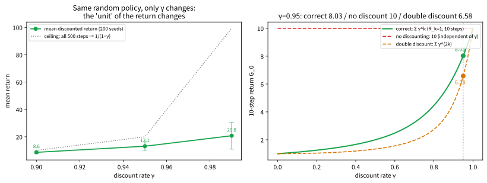

# 3.2 누적 보상, 할인율, 그리고 실습

[](https://colab.research.google.com/github/SuminHan/book-ml/blob/main/notebooks/ml2/chapter03_2_discounted_return.ipynb)

3.1절에서 MDP의 다섯 요소를 정의할 때 \\((\mathcal{S}, \mathcal{A}, P, R,
\gamma)\\)를 "나열"하기만 했다. 이 절은 그중 \\(R\\)과 \\(\gamma\\) —
**보상**과 **할인율** — 에 집중해서, 강화학습이 실제로 최대화하는
대상 — **리턴** — 을 손으로·코드로 계산할 수 있게 만드는 절이다.
수업의 흐름은 이렇다: (1) 리턴(할인된 누적 보상)의 정의와 유한/무한
경우의 계산법, (2) "할인율 0.95"가 실제로는 "몇 스텝짜리 시야"를 뜻하는지 —
**유효 시계(effective horizon)** — 로 바꾸는 법, (3) \\(\gamma\\)를 바꾸면
"같은 환경에서 다른 행동을 최적으로" 만드는 예 — 할인율이 단순한
정규화 장치가 아니라 **목표를 바꾸는** 매개변수임을 직접 확인, (4)
Gymnasium에서 CartPole로 할인된 리턴을 실제로 누적해보는 실습.[^gym]

### 누적 보상과 할인율

강화학습의 목표는 한 스텝의 보상이 아니라, 앞으로 받을 보상들의 합 —
**리턴**(return) \\(G\_t\\) — 을 최대화하는 것이다:[^suttonbarto]

\\[G\_t = R\_t + \gamma R\_{t+1} + \gamma^2 R\_{t+2} + \cdots = \sum\_{k=0}^\infty \gamma^k R\_{t+k}\\]

**왜 할인율 \\(\gamma\\)가 필요한가**: (1) 수학적으로, \\(\gamma < 1\\)이면
보상이 유계(bounded)인 한 이 무한급수가 항상 수렴한다(기하급수). \\(\gamma=1\\)
이면 끝나지 않는 과업에서 리턴이 무한대로 발산할 수 있다. (2) 직관적으로,
"지금 당장의 보상 1"이 "10스텝 뒤의 보상 1"보다 더 가치 있다고 보는
경우가 많다 — 사람의 시간 선호나, 금융의 이자율 개념과 같은 방향이다.
\\(\gamma\\)가 0에 가까우면 에이전트는 "근시안적"(당장의 보상만 중시)이고,
1에 가까우면 "장기적"(먼 미래의 보상까지 충분히 고려)이 된다.[^cs234]

이 무한합은 실제로는 **닫힌 형태로** 잘 풀린다. \\(\gamma < 1\\)이면
기하급수의 합 공식을 그대로 쓸 수 있다. 보상이 매 스텝 같은 값 \\(R\\)으로
고정된 간단한 경우부터:

\\[G\_t = R + \gamma R + \gamma^2 R + \cdots = \frac{R}{1-\gamma}\\]

\\(\gamma=0.9\\), \\(R=1\\)이면 \\(G\_t = \frac{1}{0.1} = 10\\)이다. "매
스텝 1을 무한히 받는 환경"의 리턴이 10이라는 뜻이다 — \\(\gamma\\)가 1에
다가갈수록 이 값은 \\(\frac{1}{1-\gamma}\\)처럼 **무한대로** 올라간다.
이것이 (1)의 "발산"이 구체적으로 어떤 모양인지다.

보상이 매 스텝마다 다른 일반적인 경우에도, **한 에피소드가 유한한
스텝 \\(T\\) 뒤에 끝난다면**(터미널 상태에 도달하면 그 뒤의 보상은 모두 0)
무한합은 유한합으로 잘린다:

\\[G\_0 = \sum\_{k=0}^{T} \gamma^k R\_k = R\_0 + \gamma R\_1 + \gamma^2 R\_2 + \cdots +
\gamma^T R\_T\\]

"무한합"이라는 모양만 무서울 뿐, 실제로는 **마지막 보상 \\(R\_T\\)의 계수
\\(\gamma^T\\)가 아주 작으므로** 유효한 항은 앞에 몇 개뿐이다 — 이
"몇 개쯤이 유효한지"를 숫자로 잡는 것이 바로 다음 절의 **유효 시계**다.

매 스텝 보상 \\(R=1\\)일 때, 유한합 \\(G\_N = \sum\_{k=0}^{N-1} \gamma^k\\)
이 닫힌 형태 \\(\frac{1}{1-\gamma}\\)로 어떻게 다가가는지 표로 보면:

| \\(N\\) | \\(G\_N\\) (\\(\gamma=0.9\\)) | \\(G\_N\\) (\\(\gamma=0.99\\)) |
|---|---|---|
| 5 | 4.10 | 4.90 |
| 10 | 6.51 | 9.56 |
| 20 | 8.78 | 18.21 |
| 50 | 9.95 | 39.50 |
| 100 | 10.00 | 63.40 |
| \\(\infty\\) | **10** | **100** |

\\(\gamma=0.9\\)는 20스텝이면 이미 닫힌 형태의 87.8%, 100스텝이면
99.997%다 — 유효 시계(28)의 3배쯤을 더하면 사실상 수렴한다. 반면
\\(\gamma=0.99\\)는 100스텝이 돼도 63.4%에 불과하다. **\\(\gamma\\)가
클수록 합산해야 하는 항의 수가 늘어** "더 장기적"이라는 말의 구체적
수학적 의미다.

**연결**: 이 \\(G\_t\\)는 3.3절의 가치함수 \\(V^\pi(s) =
\mathbb{E}[G\_t \mid s\_t=s]\\)가 정의에서 쓰는 리턴 그 자체다. 오늘 "리턴
계산"을 익히면, 3.3절의 "벨만방정식"은 그 리턴을 재귀적으로 한 스텝만
풀어 쓴 것에 불과해진다.

### 유효 시계: \\(\\gamma = 0.95\\)는 실제로 몇 스텝짜리 시야인가

할인율을 "몇 %씩 깎는 비율"로만 이해하면, "0.95와 0.9의 차이가 실제로
크는가"를 느끼기 어렵다. 여기서는 **"할인 계수 \\(\gamma^k\\)가
\\(\epsilon\\) 아래로 *떨어지는* 첫 스텝 \\(k\\)를 \\(H\\)라 하자"**고
정의를 바꿔보자. 이 \\(H\\)를 **유효 시계**(effective horizon)라고
부른다 — 에이전트가 \\(\gamma^k\\)가 \\(\epsilon\\)보다 작은 먼 미래의
보상을 사실상 0으로 취급한다는 뜻이므로, "이 에이전트는 대략 \\(H\\)
스텝까지의 미래를 볼 수 있다"고 읽을 수 있다.

\\(\gamma^H = \epsilon\\) 양변에 로그를 취하면:

\\[H = \frac{\log \epsilon}{\log \gamma}\\]

\\(\epsilon = 0.05\\)로 잡으면(= 5% 이하로 깎인 보상부터 "무시"한다),
각 \\(\gamma\\)에 대해 \\(H\\)는 다음과 같다:

| \\(\gamma\\) | 유효 시계 \\(H\\) (\\(\epsilon=0.05\\)) | 해석 |
|---|---|---|
| 0.5 | 4.3 → **약 4스텝** | 5스텝 뒤 보상은 이미 3% — "당장 4스텝"만 본다고 보면 됨 |
| 0.9 | 28.4 → **약 28스텝** | 약 28스텝 뒤 보상은 5% 이하 |
| 0.95 | 58.4 → **약 58스텝** | CartPole의 한 에피소드(최대 500스텝)의 약 1/9 |
| 0.99 | 298.1 → **약 298스텝** | 500스텝 에피소드에서도 60% 구간까지 "보임" |

**반대로 쓰는 법(실전 팁)**: 유효 시계 공식을 뒤집으면
\\(\gamma = \epsilon^{1/H}\\)다. "에이전트가 \\(H\\)스텝을 볼 수 있게
하라"고 정하면 \\(\gamma\\)가 **자동으로** 결정된다 — 500스텝짜리
에피소드를 다 보려면 \\(\gamma = 0.05^{1/500} \approx 0.994\\),
100스텝짜리 환경이면 \\(\gamma = 0.05^{1/100} \approx 0.97\\)이
적절하다. "환경의 수명에 \\(\gamma\\)를 맞춘다"는 실전 관행이 바로
이 식에서 온다.[^silvercourse]

**"5%로 깎였다"가 왜 "사실상 무시"인가?** — \\(H\\)스텝 **이후**에
들어오는 모든 보상의 합은, 그 직전 스텝의 보상에
\\(\frac{\epsilon}{1-\gamma}\\)를 곱한 것 이상으로 클 수 없다.
\\(\gamma=0.9\\), \\(\epsilon=0.05\\)이면 28스텝 이후의 **모든**
미래 보상의 합이 28스텝째 보상의 \\(0.05/0.1 = 0.5\\)배를 넘지
못한다는 뜻이다. "무한히 먼 미래"가 실제로는 "한 스텝짜리 상한"에
압축되는 것이다.

아래 그림은 이 세 가지를 한눈에 보여준다.


### 할인율은 "목표"를 바꾼다: 근시안과 장기적의 선택

"할인율은 발산을 막기 위한 수학 장치"라는 설명은 반쪽이다. **유한한
에피소드에서는 \\(\gamma=1\\)이어도 발산하지 않는다** — 그런데도
\\(\gamma < 1\\)을 쓰는 이유는, \\(\gamma\\)가 **어떤 정책을 "최적"으로
만드는지**를 실제로 바꿀 수 있기 때문이다. 다음 예가 이 차이를 보여준다.

**예 1 (당장 1 vs 5스텝 뒤 3)**: 매 스텝 보상이 \\(R\_0=1, R\_1=R\_2=R\_3=0,
R\_4=3\\)인 환경이 있다고 하자. \\(\gamma=1\\)이면 \\(G\_0 = 1+3 = 4\\).
\\(\gamma=0.9\\)이면 \\(G\_0 = 1 + 0.9^4 \times 3 = 1 + 1.9683 =
2.9683\\) — 5스텝 뒤의 3이 1.97로 "깎였다". \\(\gamma=0.5\\)로
하면 \\(G\_0 = 1 + 0.5^4 \times 3 = 1 + 0.1875 = 1.1875\\) — 5스텝 뒤의 3은
0.19로 **사실상 사라졌다**. 같은 환경인데, \\(\gamma\\)만 달리면
"5스텝 뒤의 3을 위해 지금을 견디는 것"의 가치가 1.97에서 0.19로
줄어든다. 어느 시점(\\(3\gamma^4 = 1\\), 즉 \\(\gamma \approx 0.76\\))
이후에는 "당장의 1만 챙기는 행동"이 "5스텝을 버텨서 3을 받는 행동"보다
리턴이 커진다 — **같은 환경에서, \\(\gamma\\)만 바꿔도 최선의 행동이
바뀌는** 것이다.

**예 2 (3상태 MDP에서 두 정책 비교)**: 아래는 3.1절의 MDP 정의로
직접 그려볼 수 있는 작은 예다. 상태 0, 1, 2가 있고, 각 상태에서 두
행동 A·B가 가능하다.

| 현재 상태 | 행동 A | 행동 B |
|---|---|---|
| 0 | → 1, 보상 +1 | → 1, 보상 +1 |
| 1 | → 2(50%), 0(50%), 보상 +2 | → 0(확정), 보상 0 |
| 2 (터미널) | 자기 자신으로, 보상 −10 | 자기 자신으로, 보상 −10 |

**정책 A**(항상 A): 상태 1에서 A를 하면 50% 확률로 상태 2로 넘어가,
그 뒤 **매 스텝 −10을 영구히** 받는다(상태 2는 "게임 종료"가 아니라
"−10을 계속 주는 루프"로 모델링했다 — 터미널이었다면 \\(V(2)=0\\)이
되어 "구덩이가 \\(\gamma\\)에 의해 얼마나 할인되는지"를 볼 수 없기
때문이다). **정책 B**(항상 B): 상태 1에서 보상을 0으로 받고 상태 0으로
돌아가 — "0 →(+1)→ 1 →(0)→ 0 → …"의 안전하지만 보상이 낮은 루프다.

\\(\gamma=0.9\\)로 두 정책의 가치함수를 반복 대입(3.3절의 벨만방정식
고정점)으로 풀어보면:

\\[V^A = [-63.36,\\; -71.51,\\; -100], \qquad V^B(0) = \frac{1}{1-\gamma^2}
= \frac{1}{0.19} \approx 5.26\\]

(코드로 검산: \\(V^A(0)=-63.3613\\). 벨만방정식 세 등호
\\(V(0)=1+0.9\\,V(1)\\), \\(V(1)=2+0.9\\,(0.5\\,V(2)+0.5\\,V(0))\\),
\\(V(2)=-10\\)이 정확히 성립함을 확인한다. \\(V^A(2)=-10/(1-0.9)=-100\\)
— "한 번 −10 루프에 빠지면 그 상태의 가치는 −100"이라는 뜻이다.)
\\(\gamma=0.9\\)에서는 **정책 A의 상태 0 가치(−63.36)가 정책 B
(5.26)보다 훨씬 나쁘다** — "50% 확률로 −100짜리 구덩이"가 2스텝짜리
+2 보상의 기대를 훨씬 넘는다는 뜻이다.

그런데 **\\(\gamma\\)를 낮추면 답이 뒤집힌다**. \\(\gamma=0.1\\)이면
\\(V^A(0)=1.15 > V^B(0)=1.01\\) — **정책 A가 오히려 좋다**.
\\(\gamma \to 0\\) 극한에서는 "앞으로 1스텝만" 보므로 상태 1에서 +2를
즉시 주는 A가 불리하지 않다. \\(\gamma\\)를 0에서 1 사이로 계속 올리며
계산하면, **\\(\gamma \approx 0.27\\)라는 "크로스오버" 지점**에서 두
정책의 상태 0 가치가 같아지고, 그 이상(\\(\gamma \gtrsim 0.27\\))에서는
정책 B가 일관되게 좋아진다.

**같은 환경, 같은 두 정책인데 \\(\gamma\\)만 바꾸면 "어느 정책이
옳은가"의 답이 뒤집힌다**(\\(\gamma \lesssim 0.27\\)에서 A,
\\(\gamma \gtrsim 0.27\\)에서 B). 이것이 "할인율은 목표를 바꾼다"의
구체적 의미다 — \\(\gamma\\)는 단순 정규화 상수가 아니라, **어떤
행동을 "옳은" 행동으로 만드느냐**를 정하는 설계 변수이기도 한다.

**역사적 맥락**: 이 "현재 보상을 미래 보상의 기댓값에 더해 재귀적으로
정의한다"는 관점은 1950년대 벨만(Richard Bellman)의 **동적계획법**
(dynamic programming)[^bellman]에서 나왔다. 벨만이 "복잡한 문제를 한 번에
풀지 말고, 한 스텝만 보고 나머지는 부분 문제로 위임하라"고 한 통찰
이 바로 3.3절의 벨만방정식인데, 그 식의 "한 스텝"을 **지금**과
**미래**로 나누어 가중하는 비율이 바로 \\(\gamma\\)다. 할인율은
"수학의 편의"가 아니라, **결정 이론의 시간 가중(time
discounting)**을 MDP에 이식한 것이다.

### 실습: CartPole에서 할인된 리턴 직접 누적하기

이론을 Gymnasium[^gymnasium]의 실제 환경으로 옮겨보자. CartPole은 매 스텝 살아
있으면 \\(+1\\)을 주므로(1.3절), **보상이 전부 1**인 특수한 경우다 —
이때 리턴은 "얼마나 오래 버텼는가"의 **할인된 버전**이 된다.

```python
import gymnasium as gym

env = gym.make("CartPole-v1")
obs, info = env.reset(seed=0)

# 이 환경에서 MDP의 다섯 요소를 실제로 확인해보자
print("상태 공간 S:", env.observation_space)   # 4차원 연속 벡터
print("행동 공간 A:", env.action_space)         # 2개의 이산 행동 (왼쪽/오른쪽 밀기)

total_return, gamma, discount = 0.0, 0.95, 1.0
for _ in range(10):
    action = env.action_space.sample()
    obs, reward, terminated, truncated, info = env.step(action)
    total_return += discount * reward   # G_t를 직접 누적
    discount *= gamma
    if terminated or truncated:
        break
print("10스텝 동안의 할인된 리턴 G_0:", round(total_return, 3))
env.close()
```

이 코드에서 `reward`가 매 스텝 즉시 보상 \\(R(s,a)\\)이고, 환경이
내부적으로 다음 상태로 전이시키는 규칙이 곧 \\(P(s'|s,a)\\)다 —
Gymnasium 환경은 이 전이확률을 코드로 감춰두고 `step()` 함수 하나로
캡슐화한 것뿐, MDP의 정의와 정확히 대응된다. \\(\gamma=0.95\\),
시드 0이면 10스텝 모두 살아서 매 스텝 +1을 받으므로
\\(G\_0 = 1 + 0.95 + 0.95^2 + \cdots + 0.95^9 = \frac{1-0.95^{10}}{1-0.95}
\approx 8.02\\) — 실제로 출력되는 **8.025**가 이 값이다(10스텝째
보상의 계수 \\(0.95^9 \approx 0.63\\)이므로, "10스텝"을 다 더한 10보다
꽤 작다 — 이미 10스텝 만에 "할인의 효과"가 눈에 보인다).

**베이스라인 잡기**: 무작위 정책으로 200개 시드를 돌려, **\\(\gamma\\)의
크기가 "같은 환경"의 베이스라인 리턴을 어떻게 바꾸는지**를 확인하자.

```python
import gymnasium as gym
import numpy as np

env = gym.make("CartPole-v1")
for gamma in [0.9, 0.95, 0.99]:
    returns = []
    for seed in range(200):
        s, _ = env.reset(seed=seed)
        env.action_space.seed(seed)
        total, discount = 0.0, 1.0
        while True:
            a = env.action_space.sample()
            s, r, term, trunc, _ = env.step(a)
            total += discount * r
            discount *= gamma
            if term or trunc:
                break
        returns.append(total)
    returns = np.array(returns)
    print(f"gamma={gamma}: 무작위 정책 평균 리턴 = {returns.mean():.2f}  "
          f"(500스텝 다 버틸 때 최대: {(1-gamma**500)/(1-gamma):.2f})")
env.close()
```

```
gamma=0.9:  무작위 정책 평균 리턴 = 8.62   (500스텝 다 버틸 때 최대: 10.00)
gamma=0.95: 무작위 정책 평균 리턴 = 13.07  (500스텝 다 버틸 때 최대: 20.00)
gamma=0.99: 무작위 정책 평균 리턴 = 20.77  (500스텝 다 버틸 때 최대: 99.34)
```

**버틴 스텝 수는 \\(\gamma\\)와 무관하게 평균 24.1스텝**(1.3절의
베이스라인)인데, **리턴의 숫자는 \\(\gamma\\)에 따라 8.62 → 13.07 →
20.77로 크게 바뀐다**. 이는 "할인율이 보상의 총량이 아니라, **언제의
보상을 얼마나 헤아리는가**를 정한다"는 뜻이다. \\(\gamma=0.9\\)의
"평균 8.62"와 \\(\gamma=0.99\\)의 "평균 20.77"을 **같은 스케일로
비교하면 안 된다** — 서로 다른 화폐 단위(할인 기준)의 숫자이기
때문이다. **같은 \\(\gamma\\) 안에서만** 리턴의 크기를 비교하는
것이 정석이다. (이 "화이트라벨" 같은 주의는 Chapter 5~7에서
**리플레이 버퍼**[^dqn]에 여러 환경·다른 \\(\gamma\\)로 모은 전이를 함께
쓸 때 실제로 문제가 된다.)

아래 그림은 이 절의 두 실전 결과를 한 장에 모은 것이다. (왼쪽)
**베이스라인**: 같은 무작위 정책을 돌려도 \\(\\gamma\\)를 0.9 → 0.99로
올리면 평균 리턴이 8.62 → 13.07 → 20.77로 단조 증가한다(에러 막대는
200시드의 표준편차, 점선은 500스텝 상한 \\(1/(1-\\gamma\\)).
(오른쪽) **할인 실수 두 가지**: 매 스텝 보상이 1인 10스텝 에피소드에서
“할인 없이 더함”은 \\(\\gamma\\)와 무관하게 10, “\\(\\gamma=0.95\\)의
정확한 할인”은 8.03, “두 번 할인”은 6.58이다 — 두 번 할인은 사실상
\\(\\gamma^2\\)를 할인율로 쓰는 것과 같으므로 곡선이 가장 빨리
0으로 곤두박질한다.



### 자주 하는 실수: 할인율을 빼먹고 그냥 보상을 다 더하기

매 스텝 보상이 1씩 5번 들어온다고 하자(\\(R\_0=\cdots=R\_4=1\\)).
할인율 없이 그냥 더하면 \\(G\_0 = 5\\)지만, \\(\gamma=0.9\\)를 제대로
적용하면:

\\[G\_0 = 1 + 0.9 + 0.81 + 0.729 + 0.6561 = 4.0951\\]

**4.0951**로, 단순 합(5)보다 항상 작다 — 할인율이 "미래 보상을
깎아서" 계산하기 때문이다. 코드에서 `total_return += reward`처럼
`discount`를 곱하는 걸 빼먹으면, 먼 미래의 보상과 당장의 보상을
동등하게 취급하게 되어 (1) 값 자체가 실제 \\(G\_t\\)의 정의와
달라지고, (2) \\(\gamma=1\\)인 것과 같아져서 끝나지 않는 과업에서는
무한대로 발산할 위험까지 생긴다 — 강화학습 코드를 디버깅할 때
"리턴이 이상하게 크다"면 가장 먼저 할인율 곱셈이 빠지지 않았는지
확인하는 것이 좋다.

**실수 2: 할인을 두 번 적용하기** — 위 실수와 정반대다.
`total_return += discount * reward`를 쓰면서 **동시에**
`reward = reward * gamma`로 보상을 먼저 깎아놓으면, **두 번** 깎인
\\(\gamma^{2k}\\)이 적용된다. \\(\gamma=0.95\\)이면 10스텝째 보상의
계수가 \\(0.95^{10} \approx 0.60\\)이 아니라 \\(0.95^{20} \approx
0.36\\)으로, **두 배 이상** 빨리 0에 가까워진다. "왜 에이전트가
이상하게 근시안적으로 느껴지는가?" — 의문이 들면 할인 곱셈이 두
군데에 있는 것은 아닌지 코드 전체를 grep해보는 것이 좋다. (위
CartPole 예에서 10스텝 리턴이 8.025 대신 6.58로 나온다면,
이 "두 번 할인" 실수의 전형적 신호다.)

### 확인 문제

1. \\(\gamma=0.9\\), \\(\epsilon=0.05\\)일 때 유효 시계 \\(H\\)를
   \\(H < \log(0.05)/\log(0.9)\\)로 직접 계산하라(로그를 쓰지 않고
   \\(0.9^{28}\\), \\(0.9^{29}\\)를 직접 곱해서도 검증). 이 \\(H=28\\)이
   "에이전트는 28스텝 이후의 보상을 5% 이하로 취급한다"는 뜻과
   일치하는지 확인하라.
2. 매 스텝 보상 \\(R=1\\)인 환경에서, \\(\gamma=0.9\\)와 \\(\gamma=0.99\\)
   일 때 각각 "한 에피소드에서 받을 수 있는 **최대** 리턴"
   (\\(1/(1-\gamma)\\))을 계산하라. 이 차이가 "왜 \\(\gamma=0.99\\)를 쓰면
   \\(\gamma=0.9\\) 때보다 **상대적으로** 더 먼 미래의 보상이 중요하다"는
   뜻인지 한 문장으로 설명하라.
3. (개념) "할인율 0.95는 '5% 이자율'"이라는 비유가 자주 쓰인다.
   금융에서 "1년 뒤 1원"의 현재가치가 \\(1/(1+r)\\)인 것과 비교해,
   강화학습의 \\(\gamma\\)가 "이자율"과 **같은 방향**의 역할을 하는지,
   **다르다**는 점(예: 강화학습에서는 \\(\gamma=1\\)이 "이자율 0"이 아니라
   "미래 보상을 무한히 중시"하는 극단)을 각 한 문장으로 설명하라.

### 자주 묻는 질문

**Q. \\(\gamma\\)는 보통 얼마로 설정하나요?** 0.9~0.99 사이가 흔하다 —
CartPole처럼 한 에피소드가 몇백 스텝 이내로 짧은 문제는 0.95~0.99,
아주 긴 호흡의 문제(수천 스텝 이상)는 0.99~0.999처럼 1에 더 가까운
값을 써서 먼 미래의 보상도 무시되지 않게 한다. 위 손 계산에서 봤듯,
\\(\gamma\\)가 작을수록 몇 스텝 뒤의 보상은 사실상 0에 가깝게
깎여서 에이전트가 그 보상을 거의 신경 쓰지 않게 된다. 실전
하이퍼파라미터 튜닝에서는 \\(\gamma\\)를 **학습률만큼이나** 중요한
변수로 취급한다 — 같은 알고리즘을 같은 환경에 돌려도
\\(\gamma=0.9\\)와 \\(\gamma=0.99\\)의 **최종 정책**이 다를 수 있기
때문이다(위 "할인율은 목표를 바꾼다"의 예 2가 극단적 사례).

**Q. 에피소드가 유한하게 끝나는 문제(CartPole처럼 넘어지면 끝)에서도
할인율이 꼭 필요한가요?** 유한한 에피소드라면 \\(\gamma=1\\)이어도
리턴이 발산하지는 않는다(합이 유한 개 항이므로). 다만 \\(\gamma<1\\)을
쓰면 "당장의 보상을 더 중시한다"는 실용적인 효과가 있고, 학습 알고리즘의
분산을 줄여 안정성을 높이는 부수 효과도 있어 유한 에피소드 문제에서도
관례적으로 1보다 살짝 작은 값을 쓰는 경우가 많다.

**Q. \\(\gamma=0\\)는 무슨 뜻인가요?** "당장의 스텝 **하나**의 보상
뿐"을 본다는 뜻이다. \\(G\_t = R\_t\\)로 리턴이 즉시 보상과 같아지고,
에이전트는 "다음 상태가 어떻게 되는지"를 전혀 고려하지 않는
**근시안의 극단**이 된다. MDP는 퇴화하여 **다중팔 밴딧**(각 상태가
별개의 밴딧)이 된다. 실전에서 \\(\gamma=0\\)를 쓰는 경우는 드물지만,
**"보상이 이미 누적된 값으로 주어지는" 환경**(예: 매 스텝
"지금까지의 총점"을 보상으로 주는 게임)에서는 \\(\gamma=0\\)로
"최종 총점"을 한 번만 세는 것이 이중 계산을 막는 **정석**이기도
한다.

**Q. \\(\gamma\\)를 0.999처럼 아주 작게(1에 아주 가깝게)하면
"더 좋은" 것 아닌가, 왜 1로 안 하나?** 두 가지 이유.
(1) **수학**: \\(\gamma=1\\)이면 끝나지 않는 과업에서 리턴이
발산할 수 있다(무한히 살아 있으면 보상의 합이 무한대).
\\(\gamma<1\\)은 **수렴을 수학적으로 보장**한다. (2) **실용**:
\\(\gamma\\)가 1에 가까울수록 리턴의 **분산**(variance)이 커진다 —
먼 미래의 보상이 리턴에 크게 기여하므로, 학습 알고리즘이 "어느
스텝의 보상이 오늘 가치를 바꿨는가"를 추측하기가 어려워진다.
\\(\gamma=0.999\\)를 쓰면 **수렴이 느려지고**, **분산이 커져**
학습이 불안정해질 수 있다. "1에 가까울수록 좋은가"는 **환경의
수명**(에피소드 길이에 비해 \\(\gamma\\)가 적절한지)과 **알고리즘의
분산**을 함께 저울질해야 정해지는 **설계 판단**이다.

**Q. "할인된 리턴"을 코드로 계산할 때, `discount *= gamma`를
`step()` **이후에** 해야 하는 이유가 무엇인가?** \\(G\_0 = R\_0 +
\gamma R\_1 + \gamma^2 R\_2 + \cdots\\)의 정의에서, \\(R\_k\\)의 계수는
\\(\gamma^k\\)다. `step()` **직후**에 받는 `reward`는
**이번 스텝의** \\(R\_t\\)이므로, 그 **당시**의 `discount`(=
\\(\gamma^t\\))를 곱한 뒤, **다음** 스텝을 위해 `discount *= gamma`를
해야 한다. 이 순서를 바꾸면(보상을 먼저 할인하고 `discount *= gamma`
를 하면) \\(R\_t\\)에 \\(\gamma^{t+1}\\)이 걸려 **모든 보상이 한
스텝 더 할인**된다 — "할인을 두 번" 실수와는 다른, **오프바이원
(off-by-one)** 버그다. 위 실습 코드가 `total_return += discount *
reward` → `discount *= gamma` 순서인 것이 이 때문이다.

**리턴 \\(G\_t\\)는 "한 스텝의 보상이 아니라, 앞으로 받을 보상의
할인된 합"이고, 할인율 \\(\gamma\\)는 그 합을 수렴시키는 **수학
장치**이면서 동시에, **어떤 보상을 중시하는지**를 정하는
**목표 변수**다 — 같은 환경에서도 \\(\gamma\\)를 바꾸면 "최적인
행동"이 바뀔 수 있다는 점(예 2)이, 할인율을 "단순 정규화
상수"가 아니라 **설계 결정**으로 봐야 하는 이유다.**

---

## 연습문제

**1. (코딩)** 위 CartPole 베이스라인 코드를 수정해, **같은 시드
200개**로 \\(\gamma \in \\{0.5, 0.7, 0.9, 0.95, 0.99\\}\\)의 각 경우에
무작위 정책의 평균 할인된 리턴을 계산하고, \\(\gamma\\)를 x축,
평균 리턴을 y축으로 그리는 그래프를 그려라. 이 곡선이 \\(\gamma\\)
에 대해 **단조 증가**하는 이유(같은 스텝 수를 버텨도, \\(\gamma\\)가
클수록 먼 스텝의 보상이 덜 깎여 총합이 커지기 때문)를 한 문장으로
설명하라.

**2. (손계산, Tier B — 힌트 제공)** 매 스텝 보상 \\(R=1\\)인 환경에서,
\\(\gamma=0.9\\)일 때 \\(G\_0\\)를 (a) **유한합** \\(G\_0 = \sum\_{k=0}^{99}
0.9^k\\)으로 직접 계산(코드 또는 반복 곱셈)하고, (b) **닫힌 형태**
\\(\frac{1}{1-0.9} = 10\\)로 계산한 뒤, (a)와 (b)의 차이(절대값)가
얼마인지 구하라. 이 차이가 \\(0.9^{100} \approx 2.66 \times 10^{-5}\\)
과 일치하는지 확인하라.

**힌트**: \\(\sum\_{k=0}^{N} \gamma^k = \frac{1-\gamma^{N+1}}{1-\gamma}\\)
(유한 기하급수 합 공식)을 이용하면 (a)는 \\(\frac{1-0.9^{100}}{0.1}\\)로
바로 구해진다.

**정확성 확인**: \\(N=100\\)에서 (a)와 (b)의 차이가 \\(\gamma^{100}\\)
크기(\\(\approx 10^{-5}\\))라는 것은, "100스텝짜리 유한 에피소드에서
할인된 리턴을 계산할 때 **무한합 근사**의 오차가 얼마 이하인가"를
뜻한다 — 이 오차 크기가 \\(\gamma=0.99\\)에서는 얼마인지(\\(\approx
\gamma^{100} = 0.366\\)) 계산하고, "왜 \\(\gamma\\)가 1에 가까울수록
**무한합 근사**가 위험해지는가"를 한 문장으로 설명하라.

**3. (개념 서술)** "할인율 \\(\gamma\\)를 0.9에서 0.99로 올리면
에이전트가 '더 장기적으로' 된다"는 말이 **정확히** 무엇을 의미하는지,
위 "유효 시계"의 표(\\(\epsilon=0.05\\) 기준 \\(H=28\\) → \\(H=298\\))를
참고해 한 문단으로 설명하라. "28스텝"과 "298스텝"이 에이전트의
**의사결정**에 구체적으로 어떤 차이를 주는지(예: 50스텝 뒤에 오는
큰 보상을 "볼 수 있는가") 포함하라.

**4. (코딩 + 개념)** 위 "예 2"의 3상태 MDP를 코드로 구현해,
\\(\gamma \in \\{0, 0.1, 0.5, 0.9, 0.99\\}\\)에 대해 정책 A와 정책 B의
상태 0 가치 \\(V^A(0)\\), \\(V^B(0)\\)를 반복 대입으로 계산하고,
**"어느 \\(\gamma\\) 이상부터 정책 B가 정책 A보다 좋은가"**를
숫자로 찾아라. 이 "크로스오버 \\(\gamma\\)"가 0과 1 사이에 존재하는
이유(\\(\gamma=0\\)에서는 A가 좋고, \\(\gamma\\to 1\\)에서는 B가
좋기 때문)를 한 문장으로 설명하라.

**힌트**: \\(\gamma=0\\)이면 \\(V^A(0)=1, V^B(0)=1\\)(같음),
\\(\gamma=0.9\\)이면 \\(V^A(0)=-63.36 < V^B(0)\approx 5.26\\)(B가
좋음). \\(\gamma\\)를 0에서 1 사이로 늘리며 \\(V^A(0)\\)와
\\(V^B(0)\\)의 **부호 차이**가 바뀌는 지점을 찾으면 된다.

[^gym]: Brockman, G., Cheung, V., Pettersson, L., Schneider, J., Schulman, J., Tang, J., Zaremba, W. (2016). "OpenAI Gym." arXiv:1606.01540.
[^suttonbarto]: Sutton, R. S., Barto, A. G. (2018). "Reinforcement Learning: An Introduction" (2nd ed.). MIT Press. 저자 공식 무료 공개: http://incompleteideas.net/book/the-book-2nd.html — 리턴(할인된 누적 보상)의 정의와 할인율의 역할은 이 표준 교과서 3장(유한 MDP)에서 체계적으로 다뤄진다.
[^cs234]: 이 주제를 더 깊이 보려면 — Stanford CS234: Reinforcement Learning. https://web.stanford.edu/class/cs234/ — 이 절의 리턴·할인율 정의와 유효 시계(할인율 선택)는 CS234의 MDP·할인된 보상 강의 주제와 직접 겹친다.
[^silvercourse]: Silver, D. (2015). "UCL Course on Reinforcement Learning." https://www.davidsilver.uk/teaching/ — 할인율을 에피소드 길이(유효 시계)에 맞추는 이 절의 실전 관행은 이 강의자료의 표준 참조자료 중 하나다.
[^gymnasium]: Towers, M., Kwiatkowski, A., Terry, J., Balis, J. U., De Cola, G., Deleu, T., Goulão, M., Kallinteris, A., Krimmel, M., KG, A., Perez-Vicente, R., Pierré, A., Schulhoff, S., Tai, J. J., Tan, H., Younis, O. G. (2024). "Gymnasium: A Standard Interface for Reinforcement Learning Environments." arXiv:2407.17032.
[^dqn]: Mnih, V. et al. (2015). "Human-level control through deep reinforcement learning." Nature 518, 529–533. (Earlier preprint: Mnih, V. et al. (2013). arXiv:1312.5602.) — 리플레이 버퍼(replay buffer)를 제안한 원 논문이다.
[^bellman]: Bellman, R. E. (1957). "Dynamic Programming." Princeton University Press — 동적계획법의 원전. 본 절의 "역사적 맥락" 단락이 소개하는 벨만의 통찰(복잡한 문제를 한 스텝만 보고 나머지는 부분 문제로 위임)이 바로 이 책에서 나온다.
