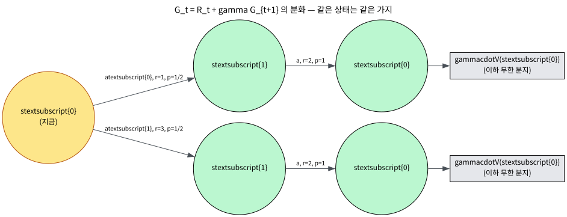
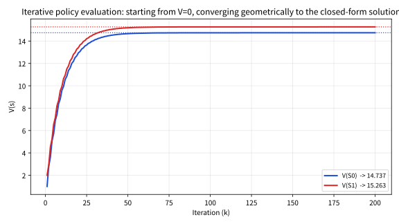

# 3.3 가치함수와 벨만 기대방정식

[](https://colab.research.google.com/github/SuminHan/book-ml/blob/main/notebooks/ml2/chapter03_3_bellman_value.ipynb)

### 이 절에서 어디로 가는지

지금까지 우리는 (3.1) MDP의 다섯 요소와 (3.2) 리턴 \\(G\_t\\)·할인율
\\(\gamma\\)를 배웠다. 아직 "이 상태가 얼마나 좋은가"를 **한 숫자로**
말해주는 도구는 없다. 이번 절은 그 도구를 만든다. 흐름은 정확히 이
네 가지다:

1. **가치함수** \\(V^\pi, Q^\pi\\) — "이 상태(상태+행동)에서 정책
   \\(\pi\\)를 따랐을 때 기대 리턴"을 정의한다.
2. **벨만 기대방정식** — 그 기대 리턴을 "지금 보상 + 다음 상태 가치
   (할인)"라는 **한 스텝짜리 재귀식**으로 바꾼다.
3. **수치 계산** — 그 재귀식을 "값이 안 바뀔 때까지 반복 대입"하는
   절차(반복적 정책평가)로 풀고, 손계산값과 맞는지 검산한다.
4. **연결고리** — 이 재귀식이 다음 장 동적계획법의 **정책평가**와,
   궁극적으로는 Chapter 4의 **최적**방정식(\\(\max\\)이 붙은 것)으로
   이어지는 길목임을 보여준다.

이 네 가지를 다 마치면, "MDP의 한 상태의 가치를 재귀적으로 계산하는
절차"를 손으로, 코드로, 그리고 (수학적으로는) 유일하게 보장받는다는
세 가지 언어로 말할 수 있다. 50분 수업의 전부다.

### 가치함수: 리턴의 기댓값

리턴 \\(G\_t\\)는 무작위 변수다(전이도 확률적일 수 있고, 정책도 확률적일
수 있다) — 그래서 "이 상태가 얼마나 좋은가"를 하나의 숫자로 요약하려면
**기댓값**을 쓴다. 정책(policy) \\(\pi\\)(각 상태에서 어떤 행동을
할지 정하는 규칙, 확률적일 수도 있어 \\(\pi(a|s)\\)로 쓴다)를 따를 때,
상태 \\(s\\)의 **상태가치함수**(state-value function)는:

\\[V^\pi(s) = \mathbb{E}\_\pi[G\_t \mid s\_t = s]\\]

"상태 \\(s\\)에서 시작해서 정책 \\(\pi\\)를 계속 따른다면, 앞으로 받을
할인된 보상의 합이 평균적으로 얼마인가"를 뜻한다. 비슷하게, "상태
\\(s\\)에서 **행동** \\(a\\)를 하고 그 이후로는 \\(\pi\\)를 따른다면"의
가치를 재는 **행동가치함수**(action-value function, Q-함수)도 있다:

\\[Q^\pi(s,a) = \mathbb{E}\_\pi[G\_t \mid s\_t=s, a\_t=a]\\]

**두 개를 왜 둘 다 정의하는가** — 둘 다 "리턴의 기댓값"인데, **어디를
고정하는지가 다르다.** \\(V^\pi(s)\\)는 "상태만 고정, 그 뒤의 행동은
모두 \\(\pi\\)가 정한다." \\(Q^\pi(s,a)\\)는 "상태 **와 첫 행동**을
고정, 그 다음부터는 \\(\pi\\)가 정한다." 이 차이는 정의를 조금 세는
정도에서 그치지 않고, **알고리즘이 무엇을 계산·비교하는지**를 결정한다.
동적계획법의 정책향상(policy improvement)은 "지금 이 상태에서 어떤
행동이 가장 좋은가"를 물어보는데, 그 물음은 상태 하나의 가치
\\(V^\pi(s)\\)만으로는 답할 수 없고, 각 행동의 가치 \\(Q^\pi(s,a)\\)를
행동마다 비교해야 한다. 즉 \\(Q\\)가 있으면 **비교**할 수 있고,
\\(V\\)만 있으면 **비교**할 수 없다. 그래서 둘 다 필요한 것이다.

**직관: "이 상태의 가격표"** \\(V^\pi\\)는 상태 공간에 매 상태마다
하나의 숫자를 매기는 함수 — 상태별 "가격표"다. \\(Q^\pi\\)는
"상태-행동" 조합마다 하나의 숫자를 매기는, 좀 더 잘게 쪼갠 가격표다.
"이 상태에서 앞으로 평균적으로 얼마를 벌 수 있나"라는 질문에
\\(V^\pi(s)\\)가 바로 답을 주는 숫자다. 중요한 것은 **이 숫자가
"실제로 벌어지는 리턴"이 아니라 그 기댓값**이라는 점이다. 같은
상태에서 시작해도 전이가 확률적이면 매 에피소드마다 리턴이 다르다 —
\\(V^\pi(s)\\)는 "이 상태에서 출발하면 평균적으로 이 정도"를 말해
주는 **요약 통계**다.

#### 표로 비교: \\(V^\pi\\) vs \\(Q^\pi\\)

| | \\(V^\pi(s)\\) 상태가치 | \\(Q^\pi(s,a)\\) 행동가치 |
|---|---|---|
| 고정하는 것 | 상태 \\(s\\) (행동은 \\(\pi\\)가 정함) | 상태 \\(s\\) **와 첫 행동** \\(a\\) |
| 무작위성 | 행동 **과** 전이 모두 | 첫 행동만 제거, 전이만 남음 |
| 매기는 대상 | \\(\mathcal{S}\\) 에 하나씩 | \\(\mathcal{S}\times\mathcal{A}\\) 에 하나씩 |
| "무엇을" 측정 | 그 상태에서 \\(\pi\\)를 따를 때의 기대 리턴 | 그 상태에서 \\(a\\)를 한 다음 \\(\pi\\)를 따를 때의 기대 리턴 |
| 주로 쓰이는 곳 | "이 상태가 좋은가" (정책평가, 가치 추정) | "이 상태에서 어떤 행동이 좋은가" (정책비교/향상, Q-학습) |

### 벨만 기대방정식: 무한합을 재귀식으로 [^suttonbarto]

\\(G\_t\\)의 정의를 한 스텝만 풀어써보면:

\\[G\_t = R\_t + \gamma R\_{t+1} + \gamma^2 R\_{t+2} + \cdots = R\_t + \gamma
\big(R\_{t+1} + \gamma R\_{t+2} + \cdots\big) = R\_t + \gamma G\_{t+1}\\]

즉 **리턴은 "지금 당장의 보상 + 할인된 다음 시점 리턴"으로 재귀적으로
쓸 수 있다.** 이 관찰을 \\(V^\pi\\)의 정의에 대입하면(기댓값의
선형성을 이용):

\\[V^\pi(s) = \mathbb{E}\\_\pi\big[R\_t + \gamma G\\_{t+1} \mid s\_t=s\big] =
\mathbb{E}\\_\pi\big[R\_t + \gamma V^\pi(s\\_{t+1}) \mid s\_t=s\big]\\]

이게 **벨만 기대방정식**(Bellman expectation equation)이다 — 무한히
먼 미래까지 다 더해야 할 것 같던 \\(V^\pi(s)\\)가, "지금 보상 + 다음
상태의 가치(할인됨)"라는 **한 스텝짜리 재귀식**으로 압축된다.

**왜 \\(G\_{t+1}\\)을 \\(V^\pi(s\_{t+1})\\)로 바꿀 수 있는가** — 이것이
이 절에서 가장 "왜?"가 필요한 순간이다. \\(G\_{t+1}\\)은 **구체적
경로** 하나(실제로 벌어진 특정 보상 열)의 리턴이고, \\(V^\pi(s\_{t+1})\\)
은 "상태 \\(s\_{t+1}\\)에서 출발하는 **모든 경로**의 리턴의 평균"이다.
이 둘이 같아도 되는 이유는 **마르코프 성질**(3.1절)이다. 다음 상태
\\(s\_{t+1}\\)가 정해졌다면, 그 뒤에 이어질 보상 열의 분포는 **어떻게
\\(s\_{t+1}\\)에 왔는지에 의존하지 않는다.** 따라서 "여기까지 어떤
경로를 통해 왔느냐"는 정보 전체를 버리고 "지금 \\(s\_{t+1}\\)에 있다"는
사실 하나로만 조건부 지을 수 있다 — 그 조건부 기댓값이 바로
\\(V^\pi(s\_{t+1})\\)의 정의다. 벨만방정식은 결국 **마르코프 성질을
"한 스텝만" 적용한 결과**인 셈이다. 3.1절의 성질이 왜 강화학습의
뼈대인가를, 수식 한 줄이 정확히 보여준다.

#### 이 재귀식이 얼마나 강력한가 — 상태가 100만 개여도

재귀식의 가장 큰 쓸모는 **계산량**이다. 정의대로 \\(V^\pi(s)\\)를
계산하려면 상태 \\(s\\)에서 출발해 **무한히 많은 경로**를 모두
탐색하고 각각의 할인 리턴을 평균내야 한다 — 상태가 100만 개면
경로 수는 사실상 무한대로 폭증한다. 그런데 벨만방정식은 "상태 \\(s\\)
의 가치를 알려면 **인접 상태들** \\(s'\\)의 가치만 알면 된다"고
말한다. 즉 100만 개의 상태를 모두 한 번씩 "인접 상태의 가치에
지금 보상을 더하는" 일로 계산할 수 있다 — **경로 탐색이
상태별 한 스텝 연산으로** 압축된다. 이 "무한 경로 → 인접 상태만"이
바로 동적계획법(dynamic programming)이라는 이름의 핵심
아이디어이며, 다음 장의 정책평가 알고리즘 전체가
이 한 줄의 직접적 결과물이다.



**그림 읽어보기** — 왼쪽 노드는 "지금" 상태 \\(s\_0\\)이다. \\(s\_0\\)에서
두 행동 \\(a\_0\\)(보상 1), \\(a\_1\\)(보상 3)이 각 1/2 확률로
선택되고, 둘 다 상태 \\(s\_1\\)로 전이한다(각각 p=1). 다시 \\(s\_1\\)에서
한 행동(보상 2)으로 \\(s\_0\\)로 돌아온다. **주목할 점**: 세 번째
수준에서 다시 \\(s\_0\\)가 두 번 등장한다 — 이 두 가지는 **"다음
상태가 같으면 그 뒤가 같다"** 는 마르코프 성질에 의해 **같은 기댓값**
\\(\gamma\cdot V(s\_0)\\)를 공유한다. 이 "같은 상태를 하나의 노드로
병합"하는 작업이 벨만방정식의 기하학적 모습이다. 경로 수(무한)를
상태 수(여기서는 2개)로 줄이는 것이다.

### 확률적 MDP로 손계산: V와 Q가 실제로 이어지는 것을 보여주기

위 재귀식은 "이론"이지만, 실제로 \\(V\\)와 \\(Q\\)가 서로를 정의하는
"동전의 양면"인지 숫자로 확인해보자. 이번에는 **각 상태에서 행동을
고르는 정책이 확률적**인 MDP를 만든다 — 3.2절의 예가 모든 전이가
결정적(각 상태에서 할 수 있는 행동 하나, 확률 1)이었으므로, 여기서
는 확률적 **정책**이 \\(V\\)와 \\(Q\\)를 어떻게 이어주는지 보여줄
수 있다.

**MDP 정의**: 상태 2개(\\(S\_0, S\_1\\)), \\(\gamma=0.9\\).

- \\(S\_0\\)에서 정책 \\(\pi\\)는 \\(a\_0\\)를 1/2, \\(a\_1\\)를 1/2 확률로
  고른다.
  - \\(a\_0\\): 즉시 보상 \\(R=1\\), 반드시 \\(S\_1\\)로 전이
  - \\(a\_1\\): 즉시 보상 \\(R=3\\), 반드시 \\(S\_1\\)로 전이
- \\(S\_1\\)에서 정책 \\(\pi\\)는 항상 \\(a\_0\\)를 고른다:
  - \\(a\_0\\): 즉시 보상 \\(R=2\\), 반드시 \\(S\_0\\)로 전이

**\\(Q^\pi\\)부터 계산**: 각 (상태,행동)의 행동가치는 "그 행동의
즉시 보상 + 다음 상태의 가치(할인)"다.

\\[Q^\pi(S\_0, a\_0) = 1 + 0.9\\,V^\pi(S\_1)\\]
\\[Q^\pi(S\_0, a\_1) = 3 + 0.9\\,V^\pi(S\_1)\\]
\\[Q^\pi(S\_1, a\_0) = 2 + 0.9\\,V^\pi(S\_0)\\]

**\\(V^\pi\\)는 정책의 행동을 확률로 가중평균**:

\\[V^\pi(S\_0) = \tfrac{1}{2}Q^\pi(S\_0,a\_0) + \tfrac{1}{2}Q^\pi(S\_0,a\_1)
= \tfrac{1}{2}(1+0.9V^\pi(S\_1)) + \tfrac{1}{2}(3+0.9V^\pi(S\_1))\\]

\\[= \tfrac{1}{2}\cdot4 + 0.9\\,V^\pi(S\_1) = 2 + 0.9\\,V^\pi(S\_1)\\]

\\(S\_1\\)에서는 행동을 하나만(확률 1로 \\(a\_0\\)) 고르므로:

\\[V^\pi(S\_1) = Q^\pi(S\_1,a\_0) = 2 + 0.9\\,V^\pi(S\_0)\\]

**이제 이 연립방정식을 푼다.** \\(V^\pi(S\_1) = 2 + 0.9 V^\pi(S\_0)\\)를
첫 번째 식에 대입:

\\[V^\pi(S\_0) = 2 + 0.9\big(2 + 0.9\\,V^\pi(S\_0)\big)
= 2 + 1.8 + 0.81\\,V^\pi(S\_0) = 3.8 + 0.81\\,V^\pi(S\_0)\\]

\\(V^\pi(S\_0)(1 - 0.81) = 3.8\\)이므로 \\(V^\pi(S\_0) = 3.8/0.19 = 20\\).
다시 대입하면 \\(V^\pi(S\_1) = 2 + 0.9\cdot20 = 20\\). **둘 다 정확히
20**이다. \\(Q\\) 값으로 되돌아와서 \\(V = \sum\_a \pi(a|s) Q\\)가
정말 성립하는지 검산:

- \\(Q^\pi(S\_0,a\_0) = 1 + 0.9\cdot20 = 19\\),
  \\(Q^\pi(S\_0,a\_1) = 3 + 0.9\cdot20 = 21\\).
  \\(\tfrac{1}{2}(19) + \tfrac{1}{2}(21) = 20 = V^\pi(S\_0)\\) ✓
- \\(Q^\pi(S\_1,a\_0) = 2 + 0.9\cdot20 = 20 = V^\pi(S\_1)\\) ✓

**이 예가 보여준 것**: (1) \\(V\\)는 각 행동을 정책 확률로 가중평균한
\\(Q\\)의 합과 정확히 일치한다 — "동전의 양면"이 수식 수준에서 성립
한다. (2) \\(S\_0\\)와 \\(S\_1\\)의 **가치가 같다(20=20)** — "보상이
1인 행동"과 "보상이 3인 행동"을 1/2씩 골라서 **기대 즉시 보상이 2**
이 되는 \\(S\_0\\)는, 항상 보상 2를 받는 \\(S\_1\\)과 **기대 리턴이
같다.** 상태의 가치는 "매 스텝 보장되는 보상"이 아니라 **정책이
정하는 기대(평균) 보상**에 의해 결정되는 것이다. 아래 **결정적** 예와
대조하면 명확해진다: 결정적 예(\\(R\_0=1, R\_1=2\\))에서는
\\(V(S\_0)\approx14.737\\neq15.263\approx V(S\_1)\\)로 **두 상태의
가치가 다르다.** 같은 "서로 오가는 2상태" 구조인데도, 보상(1,2)이
**고정**되어 있어서 상태마다 평균 보상이 달라지는 것이다. 반면
이번 **확률적** 예에서는 \\(S\_0\\)의 **기대** 보상이 2로
**합쳐지다 보니** \\(S\_1\\)의 고정 보상 2와 같아 두 가치가
동일해진다 — **기대값**으로 값이 결정됨을 극명하게 보여주는
반례다. (주의: 두 상태의 가치가 "같다"는 이 특수한 1/2-1/2 예의
**우연**이지, 일반적으로는 다르다 — 아래 확인 문제 (a)(c)에서
정책을 0.1-0.9로 바꾸면 다시 달라지는 것을 직접 확인한다.)

### 손으로 한 번: 2상태 순환 MDP에서 벨만방정식 검산하기

상태 2개(S0, S1)가 서로를 오가는 아주 작은 MDP로 확인해보자. 정책이
고정되어 있어(각 상태에서 할 수 있는 행동이 하나뿐이라고 하자) S0에서는
항상 보상 \\(R\_0=1\\)을 받고 S1로 이동하고, S1에서는 항상 보상
\\(R\_1=2\\)를 받고 S0로 돌아온다. \\(\gamma=0.9\\)일 때, 리턴의 무한
등비급수를 직접 닫힌 형태로 풀면:

\\[V(S\_0) = R\_0 + \gamma R\_1 + \gamma^2 R\_0 + \cdots =
\frac{R\_0+\gamma R\_1}{1-\gamma^2} = \frac{1+0.9\times2}{1-0.81}
\approx 14.737\\]

\\[V(S\_1) = \frac{R\_1+\gamma R\_0}{1-\gamma^2} =
\frac{2+0.9\times1}{1-0.81} \approx 15.263\\]

이제 이 값이 벨만 기대방정식 \\(V(s) = R(s) + \gamma V(s')\\)을
실제로 만족하는지 검산해보면:

\\[R\_0 + \gamma V(S\_1) = 1 + 0.9\times15.263 \approx 14.737 = V(S\_0)
\ \checkmark\\]

\\[R\_1 + \gamma V(S\_0) = 2 + 0.9\times14.737 \approx 15.263 = V(S\_1)
\ \checkmark\\]

정확히 들어맞는다. 흥미로운 확인 하나 더: 벨만 방정식을 \\(V\_0=V\_1=0\\)에서
시작해 200번 반복 대입하는 방식(다음 장에서 배울 **정책평가**의
예고편)으로 풀어도 정확히 같은 값(14.737, 15.263)으로 수렴한다(스크래치패드에서
검증) — "무한급수를 닫힌 형태로 직접 계산하기"와 "재귀식을 값이 안
바뀔 때까지 반복 적용하기"라는 서로 다른 두 방법이 같은 답에
도달한다는 것을 확인할 수 있다.

### 반복 대입: 재귀식을 실제로 푸는 절차 (다음 장의 예고편)

"값이 안 바뀔 때까지 반복 대입"이 정확히 어떤 절차를 말하는지 —
그리고 그것이 다음 장의 **정책평가**의 핵심 루프인지 — 코드로 한
번만 더 정확히 짚자. 벨만방정식 \\(V(s) = R(s) + \gamma V(s')\\)를
**가치 반복**(value iteration)이라 불리는 방식으로 풀면:

```python
def policy_evaluation_value_iteration(P, R, policy, gamma,
                                       max_iter=200, theta=1e-6):
    # P[s][a] = [(prob, next_state), ...]
    # R[s][a] = 즉시 보상 ; policy[s] = 상태 s에서 고르는 행동
    n = len(P)
    V = [0.0] * n                     # 0으로 시작 (초기값은 아무거나)
    for it in range(1, max_iter+1):
        V_new = list(V)               # 동기식: 이번 반복은 전부 "이전" V를 쓴다
        delta = 0.0
        for s in range(n):
            a = policy[s]
            v_new = R[s][a] + gamma * sum(p * V[s2] for p, s2 in P[s][a])
            delta = max(delta, abs(v_new - V[s]))
            V_new[s] = v_new
        V = V_new
        if delta < theta:             # 값이 (거의) 안 바뀌면 멈춤
            break
    return V, it
```

**동기식(synchronous)으로 쓴 이유**: 매 반복에서 **모든** 상태가
**이전** 반복의 \\(V\\)를 참조해 갱신된다. 그러면 "반복을 \\(k\\)번
돌렸을 때 반영된 것"이 정확히 **"미래 \\(k\\)스텝까지의 리턴**"이
된다(반복 1 = 즉시 보상만, 반복 2 = 2스텝까지, …). 갱신을 그 자리
바로 하는 방식(Gauss-Seidel)도 같은 답으로 수렴하지만, "반복 횟수
= 보는 미래 스텝 수"라는 직관이 조금 흐려진다. 이번 절에서는 그
직관이 핵심이라 동기식으로 쓴다.

이것은 **재귀식 좌변의 \\(V(s)\\)를 우변으로 계속 갱신**하는 단순한
루프다. 처음엔 \\(V=0\\)로 "아무것도 모른다"는 상태를 두고, 매 반복에서
"인접 상태의 (직전) 가치"를 이용해 각 상태를 갱신한다. \\(\gamma<1\\)
이면 이 반복은 **보증이 있다**: 모든 \\(V(s)\\)가 벨만방정식의 **고정점**
(fixed point, 좌변=우변인 값)으로 수렴한다 — 아래 "고정점" 섹션에서
증명한다. 위 2상태 예(\\(R\_0=1, R\_1=2, \gamma=0.9\\))를 이 함수로
\\(V\_0=V\_1=0\\)에서 200번 돌리면:

- 반복 1: \\(V\_0=1.000, V\_1=2.000\\) — "즉시 보상만" 반영됨
- 반복 10: \\(V\_0=9.598, V\_1=9.941\\) — 10스텝까지의 리턴이 반영됨
- 반복 50: \\(V\_0=14.661, V\_1=15.185\\)
- 반복 200: \\(V\_0=14.737, V\_1=15.263\\) — **닫힌 형태와 정확히 일치**



**"반복 k번 ≈ 미래 k스텝까지의 리턴"** — 이 직관이 가치 반복의
본질이다. 반복을 한 번 더 하면 "한 스텝 더 먼 미래"가 반영된다.
\\(\gamma^k\\)가 빠르게 0으로 줄어들므로(여기서 \\(\gamma=0.9\\),
10스텝이면 \\(0.9^{10}\approx0.35\\), 50스텝이면 \\(\approx 0.005\\)),
**수렴은 기하급수적으로 빨라진다.** 수렴의 "속도"를 좌우하는 것이
바로 \\(\gamma\\)이며, \\(\gamma\\)가 1에 가까울수록(장기적일수록)
수렴이 느려지는 이유이기도 하다.

**왜 \\(\gamma<1\\)이면 수렴하는가(증명 개요)** — 벨만 연산자를
\\(\mathcal{B}^\pi V(s) = R(s,\pi(s)) + \gamma\\,\mathbb{E}\_{s'}[V(s')]\\)
라고 쓰자. 두 값 함수 \\(V, W\\)에 대해 \\(\gamma<1\\)이면:

\\[\big\\|\mathcal{B}^\pi V - \mathcal{B}^\pi W\big\\|\_\infty
\\;\le\\; \gamma\\, \\|V - W\\|\_\infty\\]

(\\(\\|\cdot\\|\_\infty\\) = 최대 절댓값, 즉 "어떤 상태에서 가장 많이
다르냐.") 즉 **벨만 연산자는 \\(\gamma\\)를 계수로 줄이는
수축(squeeze) 연산**이다. 바나흐 고정점 정리(Banach fixed-point
theorem)에 의해, 수축 연산은 **고정점이 딱 하나** 존재하고, **어떤
초기값에서 출발해도** 그 고정점으로 수렴한다. 이 한 줄의 정리가
"가치 반복이 항상 (고유한) 답으로 수렴한다"는 보장의 전부다.
**\\(\gamma=1\\)이면** 수축 상수가 1이 되어 이 보장이 **사라진다**
— 수렴하지 않거나, 유한 에피소드여도 경계가 무한대가 되면 발산할
수 있다. 3.2절에서 "\\(\gamma<1\\)이면 수렴"이라 말한 것이, 여기서
**수학적으로 왜 그런가**가 보이는 것이다.

**고정점의 유일성** — \\(\gamma<1\\)이면 벨만방정식을 만족하는
\\(V^\pi\\)는 **정확히 하나뿐**이다. 즉 "이 정책의 가치함수"라는
개념이 **의미가 있는(well-defined)** 것의 근거다. \\(\gamma=1\\)이면
고정점이 없거나(발산) 여러 개(상수만큼의 자유도)일 수 있어
"이 정책의 가치"가 불명확해질 수 있다.

### "벨만방정식"이라는 이름의 유래 (역사)

이 재귀식 — "현재 가치 = 지금 보상 + 할인된 다음 상태 가치" — 을
발견하고 이름을 붙인 사람이 **리처드 벨만(Richard Bellman, 1920–1984)**
이다. 1950년대 벨만은 "복잡한 최적화 문제를 작은 부분 문제로
쪼개서 그 답을 재귀적으로 조합한다"는 **동적계획법**(dynamic
programming)을 체계화했고, 그 핵심 장치가 바로 이 재귀식이다.
그가 "차원의 저주(curse of dimensionality)"라는 용어를 만든
것으로도 유명하다(이번 장 머리말). **"Bellman equation"은
강화학습만의 개념이 아니다** — 최적제어, 금융공학, 확률과정
통계 등 "시간에 따라 상태가 변하며 순차적으로 결정해야 하는
문제" 전반에서 쓰이는, 20세기 수학의 가장 널리 인용된
재귀식 중 하나다. 강화학습에서 이 방정식이 "기대"(expectation)
버전(이 절)과 "최적"(optimality, \\(\max\\)이 붙은, Chapter 4)
버전으로 나뉘어 등장하는 것뿐, 뼈대는 벨만이 70여 년 전에
세운 것과 정확히 같다.[^silvercourse] 이번 절에서 "기대" 버전(\\(\mathbb{E}\_\pi\\))을,
Chapter 4에서 "최적" 버전(\\(\max\_a\\))을 배울 것이다.

### 벨만방정식의 세 가지 읽기방식

같은 방정식 \\(V^\pi(s) = \mathbb{E}\_\pi[R\_t + \gamma V^\pi(s\_{t+1})
\mid s\_t=s]\\)을 **세 가지 각도**로 읽을 수 있고, 이 세 가지가
각각 다른 알고리즘/관점을 낳는다:

1. **정의(definition)로서**: "이 정책 \\(\pi\\)의 상태가치는
   다음 조건을 만족하는 (유일한) 함수다." — 이 절의 관점. \\(V^\pi\\)를
   **정의하는** 방정식.
2. **계산 절차(procedure)로서**: "값이 안 바뀔 때까지
   \\(V \leftarrow \mathcal{B}^\pi V\\)로 반복 대입." — 위
   정책평가 코드. **다음 장 동적계획법**의 알고리즘.
3. **학습 목표(learning target)로서**: "신경망이 이 방정식의
   좌변과 우변을 같게 되도록 학습하자." — **Chapter 9 DQN**[^dqn]의
   손실함수. DQN의 손실
   \\((r + \gamma \max\_{a'} Q\_{\theta^-}(s',a') - Q\_\theta(s,a))^2\\)
   는 정확히 "벨만방정식의 좌변(예측값)과 우변(목표값)의 오차"다.

**이 한 줄이 강화학습 전체의 뼈대다.** 가치함수(3.3) →
정책평가(Ch.4) → 동적계획법(Ch.4) → Q-학습·DQN(Ch.6, 9) →
정책 그래디언트(Ch.10)까지, 사실상 모든 알고리즘은 **이 재귀식을
어떤 형태로 계산/학습하는가**를 다룬다. "벨만방정식을 몇 가지
버전으로 바꿔서 푸는 학기"라고 이번 학기를 요약할 수 있을 정도다.[^cs234]

### 자주 하는 실수

**실수 1: "다음 상태의 가치"에 할인율 \\(\gamma\\)를 빼먹기**
\\(V(s) = R(s) + V(s')\\)처럼 \\(\gamma\\)를 빼면, 3.2절에서
본 대로 "당장의 보상"과 "아주 먼 미래의 보상"을 동등하게
취급하게 된다. 결정적 2상태 예에서 \\(\gamma\\)를 빼면
\\(V\_0 = 1 + V\_1\\), \\(V\_1 = 2 + V\_0\\)가 되어
\\(V\_0 - V\_1 = 1\\)이면서도 \\(V\_1 - V\_0 = 2\\)가 되어
**모순**(해 없음)이 된다 — \\(\gamma<1\\)이 없으면 이 단순한
2상태 예의 방정식에도 해가 없다. 할인율은 "무한합이
수렴하게" 하고 "고정점이 존재하도록" 하는 **수학적 장치**이기도
한 것이다.

**실수 2: "가치함수"를 "실제 에피소드 리턴"과 혼동하기**
\\(V^\pi(s)\\)는 **기댓값**이다. "상태 \\(s\\)에서 시작하면 리턴이
반드시 \\(V^\pi(s)\\)가 된다"가 **아니다.** 전이가 확률적이거나
정책이 확률적이면 매 에피소드마다 다른 리턴이 나오고, \\(V^\pi(s)\\)
는 그 **평균**이다. "가치가 14.737인 상태"에서 10번 시작하면
10번 중 10번이 정확히 14.737이 아니라, 10번의 평균이
**대략** 14.737에 가까울 뿐이다. (단, 결정적 MDP·결정적
정책에서는 매번 같은 리턴이 나와 기댓값=실제값이 일치한다 —
위의 2상태 예가 그런 경우.)

**실수 3: "벨만방정식을 만족하는 V는 하나"라고 단정하지 않기**
\\(\gamma<1\\)이면 (상단의 "수축" 논의로) 고정점이 **유일**하다.
반면 "\\(V\\)를 0으로 시작해서 반복했는데 14.737이 나왔고,
다른 친구가 \\(V\_0=V\_1=100\\)에서 시작해서도 14.737이 나왔네" —
**초기값에 무관하게 같은 답**으로 수렴하는 것이 정상이다.
만약 "초기값에 따라 다른 값으로 수렴했다"면, (1) \\(\gamma\ge1\\)로
설정했거나, (2) 코드에 할인율 곱셈이 빠져 있거나(실수 1),
(3) 전이확률 합이 1이 아닌 잘못된 MDP를 정의한 것 중 하나다.
"초기값 무관 수렴"은 벨만방정식 코드가 **맞는지**를 확인하는
간단한 건강체크다.

### 확인 문제

**(a) (계산)** 위 확률적 2상태 예에서 \\(S\_0\\)의 행동 \\(a\_1\\)(보상
3)의 확률을 1/2에서 **0.9**로 바꾼다(\\(a\_0\\)는 0.1). 이 새로운
정책 \\(\pi'\\)에 대해 \\(V^{\pi'}(S\_0)\\)와 \\(V^{\pi'}(S\_1)\\)을
연립방정식으로 다시 세워 풀어라(원래 1/2-1/2 정책에서 둘 다 20이
던 것과 달리, 이제 **다르게** 된다). (힌트: \\(V^{\pi'}(S\_0) =
0.1(1) + 0.9(3) + 0.9\\,V^{\pi'}(S\_1)\\), \\(V^{\pi'}(S\_1) =
2 + 0.9\\,V^{\pi'}(S\_0)\\).)

**(b) (계산)** \\(R\_t = R\\)(상수)이고 \\(\gamma=0.99\\), \\(R=1\\)일
때 리턴 \\(G\_0 = R/(1-\gamma)\\)의 값을 구하고, \\(\gamma=0.9\\)
경우와 비교하라. \\(\gamma\\)가 1에 가까워질수록 값이 어떻게
변하는지 한 문장으로. (힌트: 연습문제 3.)

**(c) (코딩)** 위의 `policy_evaluation_value_iteration` 함수를
쓰어, (1) 결정적 2상태 예(\\(R\_0=1, R\_1=2, \gamma=0.9\\)),
(2) 확률적 2상태 예의 **원래** 정책(1/2-1/2, \\(\gamma=0.9\\)),
(3) 확인 문제 (a)의 **바뀐** 정책(0.1-0.9, \\(\gamma=0.9\\)) 각각에
대해 \\(V\\)를 계산하라. 다음 두 가지를 확인하라:
  - (1)의 \\(V(S\_0), V(S\_1)\\)가 서로 **다르고**(14.737 vs 15.263),
    (2)에서는 둘이 **같다**(20 vs 20)는 것을,
  - (3)에서는 다시 **다르게** 변한다는 것((a)의 손계산값과 일치하는지
    대조).
"같은 2상태 순환 구조인데도, (2)에서만 두 상태의 가치가 같은
이유"를 한 문장으로 설명하라(힌트: 각 상태의 **기대 즉시 보상**을
비교해라).

**(d) (개념 서술)** "벨만방정식은 마르코프 성질을 한 스텝만
적용한 결과"라는 문장을, 위 "왜 \\(G\_{t+1}\\)을
\\(V^\pi(s\_{t+1})\\)로 바꿀 수 있는가" 섹션을 참고해 자신의
말로 두세 문장으로 풀어쓰라.

**(e) (디버깅)** `policy_evaluation_value_iteration`에서
`gamma * sum(...)`의 `gamma`를 1.0으로 바꾼다(\\(\gamma=1\\)).
결정적 2상태 예에서 이 반복이 **수렴하는가, 발산하는가,
아무것도 아닌가?** (힌트: \\(\gamma=1\\)이면 수축 상수가 1 →
보장 없음. 실제 반복을 200번 돌려 \\(V\_0, V\_1\\)의 추이를
관찰하라.)

### 자주 묻는 질문

**Q. \\(V^\pi(s)\\)와 \\(Q^\pi(s,a)\\)는 서로 어떻게 연결되나요?**
\\(V^\pi(s)\\)는 "그 상태에서 정책 \\(\pi\\)가 시키는 대로 행동했을
때"의 가치이므로, 정책이 각 행동을 고를 확률로 \\(Q^\pi\\)를 가중평균한
것과 같다: \\(V^\pi(s) = \sum\_a \pi(a|s)Q^\pi(s,a)\\). 반대로
\\(Q^\pi(s,a)\\)는 "이번 행동만 \\(a\\)로 강제로 고정하고, 그 다음부터는
\\(\pi\\)를 따른다"는 뜻이므로 \\(Q^\pi(s,a) = R(s,a) + \gamma
\mathbb{E}\_{s'\sim P(\cdot|s,a)}[V^\pi(s')]\\)로도 쓸 수 있다 — 두
함수는 서로를 정의하는 데 쓰이는, 동전의 양면 같은 관계다.

**Q. "최적" 정책의 가치함수는 어떻게 정의하나요?** 이번 절의
\\(V^\pi, Q^\pi\\)는 **주어진** 정책 \\(\pi\\)를 따랐을 때의 가치를
잰다. 강화학습의 궁극적인 목표는 "가능한 모든 정책 중 가치가 가장
높은" 최적 정책 \\(\pi^\*\\)를 찾는 것인데, 그 정의와 계산법(벨만
**최적**방정식, 이번 절의 벨만 **기대**방정식과 한 글자 차이지만
\\(\max\\) 연산이 들어가 의미가 크게 달라진다)은 Chapter 4에서 바로
이어서 다룬다.

**Q. "기대방정식"이라는 말이 있는데, "기대(expectation)"가
어디에 있는 건가요?** 방정식 안의 \\(\mathbb{E}\_\pi\\)가 바로
"기대"다. \\(V^\pi(s) = \mathbb{E}\_\pi[R\_t + \gamma
V^\pi(s\_{t+1})\mid s\_t=s]\\)에서 이 기댓값은 **두 가지 무작위성**
에 대해 취한다: (1) 정책이 행동을 확률적으로 고르는
무작위성 \\(\pi(a|s)\\), (2) 환경의 전이가 확률적으로
나타나는 무작위성 \\(P(s'|s,a)\\). 결정적 MDP+결정적
정책(위 2상태 예)에서는 이 둘이 모두 사라져
\\(V(s) = R(s) + \gamma V(s')\\)의 단순한 등식으로
축소된다. "기대"라는 이름은 **이 무작위성이 있을 때**
의미를 가진다.

**Q. 벨만방정식은 "방정식"인데, 왜 "풀어야" 하는 건가요?
답이 이미 \\(V^\pi(s) = \mathbb{E}\_\pi[G\_t \mid s\_t=s]\\)로
쓰여 있는 것 아닌가?** "정의"와 "계산"을 구별해야 한다.
\\(V^\pi(s) = \mathbb{E}\_\pi[G\_t\mid s\_t=s]\\)는 **무한한
경로의 리턴을 평균**하라는 정의다 — 실제로 계산하려면 무한
경로를 모두 탐색해야 해 **계산 불가능**하다. 벨만방정식
\\(V(s) = R(s) + \gamma V(s')\\)는 같은 \\(V^\pi\\)를
**인접 상태만** 쓰도록 **재귀적으로 다시 표현**한 것이다.
"무한 경로"를 "한 스텝"으로 압축한 이 재귀 표현이 **계산
가능**하다. 방정식을 "풀다"는 곧 이 재귀 표현을
반복 대입(value iteration)해 **수치적 답**을 뽑아내는 것을
뜻한다 — 정의(무한합)와 계산(재귀식)을 연결하는 다리다.

**Q. \\(\gamma\\)가 0이면 벨만방정식은?** \\(\gamma=0\\)이면
\\(V^\pi(s) = R(s,\pi(s))\\) — "지금 당장의 보상만"이
가치가 된다. 에이전트가 **완전히 근시안적**(myopic)이 되어
미래를 전혀 고려하지 않는다. \\(\gamma=1\\)에 가까워지면
**장기적**이 된다. \\(\gamma\\)는 "미래를 얼마나 멀리
볼 것인가"를 조절하는 **노브**(knob)이며, 3.2절에서
"근시안적 vs 장기적"이라 한 것이 수식으로
\\(V(s) = R(s) + \gamma V(s')\\)의 \\(\gamma\\) 항에
정확히 대응한다.

**Q. 이 절의 "반복 대입"이 Chapter 4의 "정책평가"와
관계가?** **정확히 같은 알고리즘**이다. 이 절에서
"예고편"으로 간단히 보여준 반복 대입
(\\(V \leftarrow R + \gamma\\,\mathbb{E}[V]\\) 루프)은
Chapter 4 동적계획법에서 **정책평가**(policy
evaluation)라고 이름 붙여, "임의의 정책 \\(\pi\\)의 가치
\\(V^\pi\\)를 계산하는" 표준 알고리즘으로
정식화된다. 또한 "이 평가된 정책을 이용해 **더 좋은
정책**을 만드는" 단계(**정책향상**, policy improvement)를
**정책평가와 교대로** 반복하는 것이 **정책반복**(policy iteration)이며,
그것이 동적계획법의 완형이다. 즉 이 절의 10줄 코드가
다음 장의 알고리즘 전체의 **뼈대**인 것이다.

**MDP는 "지금 한 행동이 미래의 상태 자체를 바꾼다"는 사실 하나를
Chapter 2의 밴딧에 추가한 것뿐이지만, 이 한 가지 차이가 강화학습을
훨씬 더 어렵고, 훨씬 더 흥미로운 문제로 만든다.**

---

## 연습문제

**1. (코딩)** 위 코드를 참고해서, `FrozenLake-v1`(`is_slippery=False`)[^gymnasium]
환경을 만들고 `env.observation_space`와 `env.action_space`를 출력해서
상태·행동 공간이 각각 이산(discrete)인지 연속(continuous)인지, 몇
가지인지 확인하라. CartPole과 비교했을 때 어떤 차이가 있는지 한 문장으로
서술하라.

```python
import gymnasium as gym

env = gym.make("FrozenLake-v1", is_slippery=False)
# ADD ADDITIONAL CODE HERE!!
# observation_space, action_space를 출력하고 CartPole과 비교
```

**2. (개념 서술)** 마르코프 성질이 실제로는 성립하지 않을 것 같은
상황을 하나 떠올려보라(예: 자율주행에서 "지금 화면 한 장"만으로 판단하는
경우, 안개 속에서 방금 지나간 표지판 정보가 필요할 수 있다). 그런
경우에도 마르코프 성질을 다시 성립시키려면 상태를 어떻게 다시 정의해야
할지(예: 최근 몇 프레임을 함께 상태에 포함시키는 등) 한 문단으로
제안하라.

**3. (손유도, Tier B — 힌트 제공)** 보상이 매 스텝 상수 \\(R\\)로
고정된 경우(즉 \\(R\_t = R\\) for all \\(t\\)), 리턴 \\(G\_t = \sum\_{k=0}^\infty
\gamma^k R\\)이 \\(\gamma < 1\\)일 때 닫힌 형태 \\(G\_t = \frac{R}{1-\gamma}\\)로
수렴함을 보여라.

**힌트**: 등비급수의 합 공식 \\(\sum\_{k=0}^\infty x^k = \frac{1}{1-x}\\)
(\\(|x|<1\\)일 때)을 그대로 적용하면 된다. \\(R=1, \gamma=0.9\\)일 때
\\(G\_t\\)의 값을 직접 계산하고, \\(\gamma=0.99\\)로 바꿨을 때 값이 어떻게
달라지는지도 계산해보라.

**정확성 확인**: \\(\gamma\\)가 1에 가까워질수록 \\(G\_t\\)가 왜 점점
커지는지(발산에 가까워지는지) 계산 결과를 바탕으로 한 문장으로
설명하라.

**4. (코딩)** 확인 문제 (c)의 코드 — `policy_evaluation_value_iteration`을
두 개의 2상태 MDP(결정적/확률적)에 적용해 \\(V\\)를 계산하고,
손계산값(결정적: 14.737/15.263, 확률적 1/2-1/2: 20/20)과 일치하는지
`assert`로 확인하라. 추가로 **초기값**을 \\(0\\)과 \\(100\\)으로 각각
바꿔도 같은 값으로 수렴하는지(초기값 무관성) 확인하라 — 이것이
"고정점이 유일하고 반복이 수렴한다"는 보장의 구체적 모습이다.

[^dqn]: Mnih, V. et al. (2015). "Human-level control through deep reinforcement learning." Nature 518, 529–533. (Earlier preprint: Mnih, V. et al. (2013). arXiv:1312.5602.)
[^suttonbarto]: Sutton, R. S., Barto, A. G. (2018). "Reinforcement Learning: An Introduction" (2nd ed.). MIT Press. 저자 공식 무료 공개: http://incompleteideas.net/book/the-book-2nd.html — 가치함수와 벨만 기대방정식(상태가치·행동가치, 정책평가)은 이 표준 교과서 3장에서 체계적으로 다뤄진다.
[^cs234]: 이 주제를 더 깊이 보려면 — Stanford CS234: Reinforcement Learning. https://web.stanford.edu/class/cs234/
[^silvercourse]: 이 주제를 더 깊이 보려면 — David Silver, "UCL Course on Reinforcement Learning" (Lecture 4: Value Functions and Bellman Equations). https://www.davidsilver.uk/teaching/
[^gymnasium]: Towers, M. et al. (2024). "Gymnasium: A Standard Interface for Reinforcement Learning Environments." arXiv:2407.17032 — 연습문제에서 쓰는 RL 환경의 표준 인터페이스. OpenAI Gym(Brockman, G. et al. (2016). "OpenAI Gym." arXiv:1606.01540)의 포크로, 여기서 쓰이는 FrozenLake·CartPole 등 환경들이 기원한 표준 API다.
