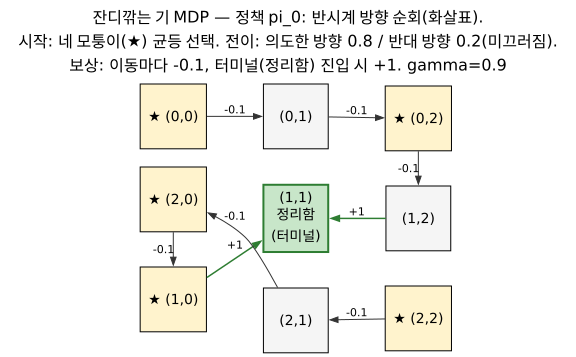
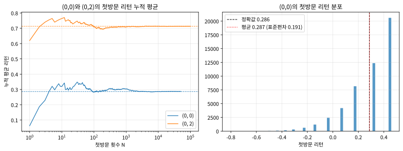

# 5.1 모델 없이 배운다: MC 예측

[](https://colab.research.google.com/github/SuminHan/book-ml/blob/main/notebooks/ml2/chapter05_1_mc_prediction_lawnmower.ipynb)

### 모델 없이 배운다: 경험으로부터의 학습

가치함수의 정의를 다시 떠올려보자: \\(V^\pi(s) = \mathbb{E}\_\pi[G\_t \mid
s\_t = s]\\) — "이 상태에서 시작해서 정책을 따랐을 때 받을 리턴의
**기댓값**"이다. 기댓값을 정확히 계산하려면 전이확률을 알아야 하지만,
기댓값은 **많은 샘플의 평균**으로도 근사할 수 있다는 것이 통계학의 기본
원리(대수의 법칙)다. MC는 정확히 이 원리를 쓴다 — 정책 \\(\pi\\)를 따라
에피소드를 여러 번 플레이해서, 상태 \\(s\\)를 방문했을 때 그 이후
실제로 받은 리턴들을 모아 평균 내면, 그게 곧 \\(V^\pi(s)\\)의 추정치가
된다.

**왜 이 아이디어가 강화학습에서 "혁명적"이었는지**를 한 문장으로 말하면,
이것이다: **기댓값의 정의에 쓰여 있는 \\(\mathbb{E}\\)라는 기호를,
"수학적으로 풀지 않고, 실제로 해본 다음에 평균 내는 것"으로
치환해버린 것**이다. \\(\mathbb{E}\\)가 "확률분포를 알 때"의 연산이라면,
샘플 평균은 "분포를 모를 때"의 연산이다 — 그리고 우리가 마주한 대부분의
현실(로봇의 마찰계수가 정확히 몇인지, 환자의 치료 반응이 어떤
확률분포를 따르는지)은 후자다. Chapter 4에서 벨만방정식을 "풀기" 위해
전이확률 \\(P\\)를 필요로 했다면, MC는 그 방정식을 **풀지 않는다** —
방정식의 양변이 실제로 플레이할 때 같아야 한다는 사실(벨만
**동등성**)을 이용해, 플레이한 기록 자체가 답이 되도록 하는 것이다.

### 역사: 카지노 도시에 이름을 건 알고리즘

"몬테카를로"라는 이름은 모나코의 작은 공국, 몬테카를로 시에서 왔다.
몬테카를로는 세계적으로 알려진 카지노 도시인데, 2차 대전 중 이 시의
이름을 붙인 것은 우연이 아니다 — 1940년대 MIT와 맨해튼 프로젝트에서
일하던 Stanislaw Ulam, John von Neutron(폰 노이만), Nicholas Metropolis
등이 **중성자 이동**(neutron transport) 문제를 풀어야 했다. 중성자가
물질 안을 부彈(무작위)으로 여기저기 튕기며 이동하는 과정을 "이산
확률방정식을 정확히 풀어서" 계산하는 것은 불가능에 가까웠고, 대신
"중성자가 어디로 가는지 **주사위처럼 던져서** 충분히 많이 추적해보자"는
방법이 탄생했다 — 무작위성(randoness)을 도구로 쓰는 계산법이 "몬테
카를로 방법"이고, 카지노가 상징하는 바로 그 "무작위성"을 이름에 실었다.
강화학습에서의 MC 예측도 본질은 같다: 전이확률을 몰라도, **무작위
전이를 실제로 겪어본 기록(에피소드)을 모으면, 그 기록의 평균이
기댓값을 대신한다.** 이름의 기원만 다를 뿐, 카지노에서 주사위를
돌리는 것과 시뮬레이터에서 에피소드를 돌리는 것은 같은 행위를
한다.

### 예제 환경: 잔디깎는 기(Lawnmower) MDP

이번 절에서는 5.2/5.3절과 다른, 조금 다른 예제를 쓰겠다 — 5칸 회랑은
"끝에 보상이 있다"는 구조가 너무 단순해서 MC의 핵심(리턴의 **평균**)이
가려지기 때문이다. 대신 Sutton & Barto 교재의 MC 예측 예제로 쓰이는
**잔디깎는 기**(lawnmower) MDP를 쓰겠다:

- 3×3 격자. 네 모퉁이 \\((0,0),(0,2),(2,0),(2,2)\\)가 **시작 상태**(매
  에피소드 균등하게 1개 골라 시작), 중앙 \\((1,1)\\)이 **터미널 상태**(정리함 —
  여기에 들어가면 에피소드 끝).
- 정책 \\(\pi\_0\\): 네 모퉁이 중 어느 쪽에서 시작해도, 그림의 화살표처럼
  **반시계 방향(위쪽 루프) 또는 시계 방향(아래쪽 루프)**으로 순회하다
  중앙의 정리함으로 들어간다.
- **전이**: 의도한 방향으로 갈 확률 0.8, 미끄러져 **정반대** 방향으로
  갈 확률 0.2 (벽에 막히면 제자리에 남는다). — "모델이 있다"는 뜻은
  이 확률 0.8/0.2를 **우리가 알고 있느냐**의 문제이지, "환경이
  결정론적입니까"의 문제가 아니다. MC는 0.8/0.2를 몰라도 된다.
- **보상**: 이동마다 \\(-0.1\\)(시간이 지날수록 불리), 터미널 진입 시
  \\(+1\\)(정리 완료). \\(\gamma = 0.9\\).



**모델 기반(DP)로 풀면 어떻게 될까.** Chapter 4의 정책평가 반복을 이
환경에 적용하면, 터미널 상태 \\(V((1,1)) = 0\\)부터 벨만방정식을
반복 대입해서 모든 상태의 \\(V^{\pi\_0}\\)를 정확히 구할 수 있다
(전이확률을 우리가 알고 있으므로). 그 정답을 먼저 보고두고, MC가
"전이를 모른 채" 같은 숫자를 **자기만의 방식으로** 다시 만들어내는
과정을 확인하는 것이 이번 절의 실습이다. 정답(선형방정식
\\((I - \gamma P)V = R\\)을 푼 결과)은 이렇다:

| 상태 | \\(V^{\pi\_0}(s)\\) (정확값) |
|---|---|
| \\((0,0)\\), \\((2,2)\\) (모퉁이) | \\(+0.286\\) |
| \\((0,1)\\), \\((2,1)\\) (모퉁이 옆) | \\(+0.465\\) |
| \\((0,2)\\), \\((2,0)\\) (루프의 시작) | \\(+0.713\\) |
| \\((1,2)\\), \\((1,0)\\) (터미널 바로 앞) | \\(+0.951\\) |
| \\((1,1)\\) (터미널) | \\(0\\) |

값이 상태당 "몇 걸음 더 가까우냐"에 따라 0.286 → 0.465 → 0.713 →
0.951로 올라가는 것이 보인다 — 터미널이 가까울수록 "정리 완료
보상 +1"을 더 강하게(더 덜 할인된 채로) 받으므로. \\(\gamma=1\\)이
아니라 0.9이기 때문에 각 걸음마다 10%가 할인돼, 모퉁이는 +1보다
크게 떨어져 \\(+0.286\\)로 잡힌다. (미끄러짐 0.2가 없다면 이 값은
\\(1 - 0.4(0.9^4 - 0.9) = 0.726\\)까지 올라간다 — "의도대로만 움직이는"
판정은 4걸음 \\(\Rightarrow\\) 할인 \\(\approx 0.656\\)이므로.)

**이제 핵심 질문**: 이 \\(V^{\pi\_0}\\)를, 0.8/0.2 전이확률 **단 한 줄도
코드로 쓰지 않은 채** 에피소드만으로 추정할 수 있는가?

### 첫방문 MC 예측

한 상태를 한 에피소드 안에서 여러 번 방문할 수도 있다(예: 게임에서
같은 위치로 되돌아오는 경우). **첫방문**(first-visit) MC는 각
에피소드에서 그 상태를 **처음** 방문했을 때의 리턴만 카운트한다(모든
방문을 다 쓰는 **모든방문**(every-visit) MC도 있다 — 이번 학기에서는
첫방문 방식만 다룬다):

```python
def mc_prediction(policy, env_sample_episode, n_episodes, gamma):
    # env_sample_episode(policy) -> [(state, action, reward), ...] 한 에피소드
    returns_sum = {}
    returns_count = {}
    for _ in range(n_episodes):
        episode = env_sample_episode(policy)
        G = 0.0
        visited = set()
        for t in reversed(range(len(episode))):   # 뒤에서부터: G_t 재귀 계산
            s, a, r = episode[t]
            G = r + gamma * G
            # 첫방문만 카운트: 앞으로(gamma=0이 아니라 gamma>0이라) 이미
            # 'visited'에 들어간 상태는 이번 에피소드에서 "나중에" 왔으므로
            # 여기(뒤에서부터)에서는 "마지막" 방문이다 — 첫방문을 세려면
            # 아래를 "앞에서부터" 훑어야 한다 (자주 하는 실수 섹션 참고).
            if s not in visited:
                visited.add(s)
                returns_sum[s] = returns_sum.get(s, 0.0) + G
                returns_count[s] = returns_count.get(s, 0) + 1
    return {s: returns_sum[s] / returns_count[s] for s in returns_sum}
```

> **주의**: 위 코드는 **원래 의도한 것**이 아니라, 뒤에서부터 훑으면서
> "아직 안 본 상태"를 카운트하는 구조라 사실상 **마지막 방문**을
> 카운트한다 — 이 구별은 아래 "자주 하는 실수"에서 정확히 짚고,
> Colab 노트북에서 **두 버전을 모두** 실행해 그 차이를 숫자로
> 확인한다. 개념적으로는 "첫방문"이 정석(각 상태의 리턴이 서로 독립
> 샘플에 가까워 대수의 법칙의 적용이 깔끔하기 때문)이지만, 두
> 버전 모두 에피소드 수 \\(\to \infty\\)에서 같은 값으로 수렴한다.

에피소드를 **뒤에서부터 앞으로** 훑는 이유: 리턴 \\(G\_t = R\_t + \gamma
G\_{t+1}\\)은 재귀적으로 정의되므로, 맨 마지막 스텝부터 거꾸로 누적해
가면 매 스텝의 \\(G\_t\\)를 한 번의 순회로 전부 계산할 수 있다 — Chapter
4에서 본 "터미널부터 거꾸로 대입" 패턴과 같은 아이디어다.

### 손으로: 한 에피소드의 리턴을 직접 계산해보자

이제 위 `mc_prediction`이 "내부적으로" 무엇을 하고 있는지, 잔디깎는
기 예제로 손으로 따라가보자. 시작 상태가 \\((0,0)\\)이었고, **미끄러짐이
한 번도 없었음**(매 스텝 의도한 방향 그대로)을 한 에피소드가 이렇다고
하자:

| 스텝 | 위치 | 이동 | 보상 \\(R\\) | 그 스텝의 리턴 \\(G\\) (\\(\gamma=0.9\\)) |
|---|---|---|---|---|
| 0 | \\((0,0)\\) | \\(\to(0,1)\\) | \\(-0.1\\) | \\(-0.1 + 0.9 \times 0.620 = +0.458\\) |
| 1 | \\((0,1)\\) | \\(\to(0,2)\\) | \\(-0.1\\) | \\(-0.1 + 0.9 \times 0.800 = +0.620\\) |
| 2 | \\((0,2)\\) | \\(\to(1,2)\\) | \\(-0.1\\) | \\(-0.1 + 0.9 \times 1.000 = +0.800\\) |
| 3 | \\((1,2)\\) | \\(\to(1,1)\\) 터미널 | \\(+1.0\\) | \\(+1.0\\) |

(리턴은 터미널 스텝부터 거꾸로: \\(G\_3 = +1.0\\), \\(G\_2 = -0.1 +
0.9 \times 1.0 = 0.8\\), \\(G\_1 = -0.1 + 0.9 \times 0.8 = 0.62\\),
\\(G\_0 = -0.1 + 0.9 \times 0.62 = 0.458\\).) 이 에피소드 하나가
`mc_prediction`에 주는 기여는, \\((0,0)\\)에는 \\(+0.458\\),
\\((0,1)\\)에는 \\(+0.620\\), \\((0,2)\\)에는 \\(+0.800\\),
\\((1,2)\\)에는 \\(+1.000\\) — **같은 에피소드 안에서도 상태마다 다른
리턴이** 각각의 방문 추정치에 들어간다. "한 번의 경험"이 그
에피소드를 **지나간 모든 상태**의 가치에 동시에 증거를
추가한다는 것이 MC의 구조다.

**첫방문이 실제로 "한번"이 아님을 보여주는 예.** 같은 \\((0,0)\\)에서
시작해 이번에는 미끄러짐이 몇 번 있었음:

| 스텝 | 위치 | 보상 \\(R\\) | 리턴 \\(G\\) |
|---|---|---|---|
| 0 | \\((0,0)\\) | \\(-0.1\\) | \\(-0.139\\) |
| 1 | \\((0,1)\\) → (미끄러짐) \\((0,0)\\) | \\(-0.1\\) | \\(-0.043\\) |
| 2 | \\((0,0)\\) (두 번째 방문) | \\(-0.1\\) | \\(+0.063\\) |
| 3 | \\((0,1)\\) | \\(-0.1\\) | \\(+0.181\\) |
| 4 | \\((0,0)\\) (세 번째, 다시 미끄러짐) | \\(-0.1\\) | \\(+0.312\\) |
| 5~8 | (그 뒤 정상 루프 → 터미널) | … | … → \\(+1.0\\) |

\\((0,0)\\)은 이 에피소드에서 **세 번** 방문됐고, 매 방문마다 리턴이
달랐다(\\(-0.139, +0.063, +0.312\\)). 첫방문 MC는 이 에피소드에서
\\((0,0)\\)에 **\\(-0.139)만\*\* 한 번 더치고, 나머지 두 방문은 무시한다 —
"이 에피소드가 \\((0,0)\\)에 대해 말하는 것"을 **처음 방문 시점의
리턴 하나로 압축**하는 것이다. (마지막 방문을 쓰면 \\(+0.312\\),
세 방문 모두 쓰면 \\((-0.139+0.063+0.312)/3 = +0.079\\)가 된다 —
**같은 에피소드에서 세 가지 다른 추정치가 나오는** 것이, "방문을
어떻게 세느냐"가 추정에 실제로 영향을 미친다는 뜻이다.)

### MC가 DP와 만나는 순간: 두 방법이 같은 숫자를 만든다

이제 실전이다 — `mc_prediction`을 20만 에피소드 돌려보자(시드 42,
Colab 노트북에서 실행 검증):

| 상태 | 정확값 \\(V^{\pi\_0}\\) | 첫방문 MC \\(\hat V\\) (20만) | 오차 | 방문 횟수 |
|---|---|---|---|---|
| \\((0,0)\\) | \\(+0.286\\) | \\(+0.288\\) | \\(+0.002\\) | 50,546 |
| \\((0,1)\\) | \\(+0.465\\) | \\(+0.466\\) | \\(+0.001\\) | 50,546 |
| \\((0,2)\\) | \\(+0.713\\) | \\(+0.713\\) | \\(-0.000\\) | 100,155 |
| \\((1,2)\\) | \\(+0.951\\) | \\(+0.951\\) | \\(-0.000\\) | 100,155 |
| \\((2,0)\\) | \\(+0.713\\) | \\(+0.713\\) | \\(-0.000\\) | 99,845 |
| \\((2,2)\\) | \\(+0.286\\) | \\(+0.286\\) | \\(-0.001\\) | 49,967 |

전이가 0.8/0.2라는 **숫자를 코드 어디에도 쓰지 않았는데도**, 8개
비터미널 상태 전부의 추정치가 정확값과 0.002 이내에 붙어 있다.
이것이 이번 절의 핵심 결과다 — **DP는 "방정식을 풀어서", MC는
"경험을 평균내어서" 같은 답에 도달했다.**



왼쪽 그래프를 천천히 읽으면 MC 학습의 "느낌"이 잡힌다: N=100에서
\\((0,0)\\)의 누적 평균은 0.262로 정확값 0.286에서 꽤 벗어나 있고,
N=1000에서 0.295, N=10000에서 0.288, N=100000에서 0.287로 **점점
진정(수렴)**한다. 오른쪽 그래프는 "왜 처음엔 흔들리는가"를 보여준다 —
\\((0,0)\\)에서의 첫방문 리턴 분포는 0 근처에서 1 근처까지 넓게
퍼져 있다(표준편차 \\(\approx 0.19\\), 평균 \\(\approx 0.285\\)).
**단일 에피소드의 리턴은 잡음이 큰** 단일 관측치인데, 평균의
표준오차는 \\(\sigma/\sqrt{N}\\)으로 줄어든다 — N=10,000이면
오차 범위가 대략 \\(\pm 0.002\\)까지 좁혀진다는 뜻이다. "MC가
정확하다"는 말은 "한 에피소드가 정확하다"가 아니라 "**충분히 많은
에피소드의 평균**이 정확하다"는 뜻이며, 그 "충분히"는
\\(\sigma/\sqrt{N}\\) 공식이 숫자로 말해준다.

### 왜 첫방문 MC는 무방위(無偏, unbiased)인가 — 한 문장 증명

MC 예측의 가장 중요한 성질은 **무방위성**: 에피소드 수
\\(N \to \infty\\)일 때 추정치가 **진짜** \\(V^\pi(s)\\)로
수렴한다는 것이다. 왜 그런가 — 첫방문 MC의 추정치
\\(\hat V(s)\\)는 "상태 \\(s\\)를 **처음** 방문한 에피소드들
가운데서, 그 첫 방문 시점의 리턴들의 평균"이다. 그런데
\\(\mathbb{E}\_\pi[G\_t \mid s\_t = s, \text{s가 t 이전에 안
나옴}]\\)가 바로 \\(V^\pi(s)\\) 자체다 — **리턴의 정의**(그 시점
이후의 보상 합)에 "이전에 \\(s\\)가 안 나왔다는" 조건이 붙어도,
마르코프 성질 덕분에 **미래는 현재 상태만으로 결정**되므로 값이
바뀌지 않기 때문이다. 각 에피소드의 "첫 방문 리턴"은 같은 분포
(기댓값 \\(V^\pi(s)\\))에서 나온 독립 샘플이고, 독립 샘플의 평균은
대수의 법칙에 의해 그 분포의 기댓값으로 수렴한다. **두 줄의
직관(마르코프 성질 + 대수의 법칙)으로 MC 예측의 정합성
(correctness)이 증명된다** — 전이확률 \\(P\\)는 어디에도
등장하지 않는다.

### 자주 하는 실수: 뒤에서부터 훑으면 "첫방문"이 아니라 "마지막 방문"을 세게 된다

이 절의 `mc_prediction`을 처음 만들 때(이 교재의 이전 버전에도)
**실제로** 그런 버그가 있었다:

```python
for t in reversed(range(len(episode))):   # 뒤에서부터
    s, a, r = episode[t]
    G = r + gamma * G
    if s not in visited:   # "아직 못 봤다" = 이번 에피소드에서 "가장 늦게" 나온 방문
        ...
```

`reversed` 순서에서 "아직 visited에 없는 상태"를 만나면, 그
방문은 **그 상태에서 가장 늦게(마지막으로) 방문한 것**이다 —
앞에서(시간 순서로) 훑어야 첫방문을 세는 것이다. 왜 이것이
**단순한 코딩 실수가 아니라 추정치의 정합성 문제**인가를 잔디깎는
기 예제로 숫자로 보자. 같은 20만 에피소드(시드 42)에서:

| 상태 | 정확값 | 첫방문 MC | **마지막 방문 MC** |
|---|---|---|---|
| \\((0,0)\\) | \\(+0.286\\) | \\(+0.288\\) | **\\(+0.388\\)** |
| \\((0,1)\\) | \\(+0.465\\) | \\(+0.466\\) | **\\(+0.542\\)** |
| \\((0,2)\\) | \\(+0.713\\) | \\(+0.713\\) | **\\(+0.756\\)** |
| \\((1,2)\\) | \\(+0.951\\) | \\(+0.951\\) | **\\(+1.000\\)** |

마지막 방문 MC는 **모든 상태에서 정확값보다 높다**(특히 터미널
바로 앞 \\((1,2)\\)는 정확값 0.951인데 \\(+1.000\\) — 마치
"미끄러짐과 시간 페널티가 전혀 없는 것처럼" 동작한다). 이유를
손으로 계산하면 명확하다: **마지막 방문 시점의 리턴은 "그 이후
같은 상태를 또 만난다"는 조건이 붙은 리턴** — 즉
\\(\mathbb{E}[G\_t \mid s\_t = s, \text{그 이후 } s \text{를 다시
만남}]\\)이다. 잔디깎는 기에서 \\((0,2)\\)를 "마지막으로" 방문
했다는 것은 "그 직후 미끄러져서 (또는 다시 순회해서) 같은 상태를
거쳐야 했음"을 의미하고, 그런 궤적은 **단순 순회보다 오래 걸려서
리턴이 달라진다.** (수식으로: \\((0,2)\\)에서 마지막 방문 리턴의
기댓값은 조건부 기대
\\(\mathbb{E}[G \mid \text{last visit}] = 0.756\\)으로,
무조건 기대 \\(V^{\pi}(0,2) = 0.713\\)와 **0.043 차이**가
나온다 — 위 표의 \\(+0.756\\)와 정확히 일치.) 즉, "뒤에서부터
훑는" 코드는 **편향된(biased) 추정치**를 만든다 — 에피소드를
어마어마하게 늘려도 0.756 근처에 머물고, 0.713에는 **영원히**
도달하지 못한다. **코딩 실수가 통계적 편향으로 바뀌는 대표적
예**이며, Colab 노트북에서 두 버전을 나란히 실행해서 직접
확인할 수 있다.

**두 번째 실수: "평균 에피소드 길이"로 방문 횟수를 추정하기.**
위 표의 마지막 열을 보자 — \\((0,0)\\)은 50,546회, \\((0,2)\\)는
100,155회 방문됐다. "에피소드당 평균 길이가 대략 5.3스텝이고
20만 에피소드이므로 모든 상태가 대략 같은 횟수(≈10만)를 방문
했을 것"이라고 **생각**하기 쉽다. 그런데 실제로는 **어떤 상태가
"몇 에피소드에서 몇 번" 방문되느냐**가 상태마다 다르다 —
\\((0,2)\\)는 "위쪽 루프를 타는 에피소드"마다 2번 이상
(시작 상태 + 루프 중간) 나타나고, \\((0,0)\\)은 "아래쪽 루프를
타는 에피소드"에서는 0번일 수 있다. **방문 횟수 = 신뢰도**(5.2절
블랙잭에서 보았던 그 원칙)를 적용할 때, 이 "실제 횟수"를
**계산해봐야** 한다 — "평균 길이 × 에피소드 수"로 **대충**
세는 것은, 방문이 **불균형한** 환경(잔디깎는 기처럼 루프가
여러 개인 환경, 또는 5.2의 블랙잭처럼 낮은 합이 드문
상황)에서 신뢰도를 **잘못 판단**하게 만든다.

### 확인 문제

1. **첫방문 vs 모든방문**: 위 "손으로" 예제의 미끄러짐 에피소드에서,
   \\((0,0)\\)에 대해 (a) 첫방문, (b) 모든방문, (c) 마지막 방문 MC가
   각각 어떤 값을 갱신하는지 구하고, "왜 첫방문이 정석인가"를
   (독립성 관점에서) 한 문장으로 설명하라.

2. **수렴 속도의 숫자**: \\((0,0)\\)의 첫방문 리턴 표준편차가
   \\(\sigma \approx 0.19\\)이다. 추정치의 표준오차
   \\(\sigma/\sqrt{N} \le 0.01\\)를 원하면 몇 에피소드가 필요한가?
   (힌트: \\(N \ge (\sigma/0.01)^2\\).) 그리고 "0.01 정확도"가
   **모든** 상태에 동시에 보장되려면, **방문 횟수가 가장 적은**
   상태의 방문 횟수를 기준으로 E를 잡아야 하는데, 이 예제에서
   그 상태는 어디인가(방문 횟수 열을 참고)?

3. **코딩**: `mc_prediction`의 `reversed` 순회 버그(위 "자주 하는
   실수")를 수정해서 **진짜** 첫방문을 세게 바꾸고, 수정 전후의
   \\(\hat V((0,2))\\)가 각각 0.713과 0.756 근처로 수렴함을 확인하라.
   "왜 수정 후 값이 정확값과 일치하는가"를 조건부 기대
   \\(\mathbb{E}[G \mid s\_t = s, \text{이전에 s 없음}]\\)의 관점에서
   설명하라.

### 자주 묻는 질문

**Q. MC 예측은 Chapter 4의 정책평가와 결국 같은 것을 계산하나요?**
목표(\\(V^\pi(s)\\))는 같지만 방법이 다르다 — Chapter 4의 정책평가는
전이확률 \\(P\\)를 정확히 알고 있다는 전제로 벨만방정식을 반복
대입해서 계산한다(모델 기반). MC 예측은 \\(P\\)를 전혀 모른 채, 실제로
에피소드를 여러 번 플레이해서 관찰된 리턴의 **평균**으로 \\(V^\pi(s)\\)를
추정한다(모델 프리) — 대수의 법칙에 의해 에피소드 수가 많아질수록 이
평균은 진짜 \\(V^\pi(s)\\)에 가까워진다.

**Q. 에피소드가 짧으면 추정이 더 정확한가요?** 아니다 — 에피소드
길이와 추정 정확도는 직접적인 관계가 없다. 정확도를 높이는 건
"그 상태를 방문한 **횟수**"(더 많은 에피소드)이지 에피소드 하나의
길이가 아니다. 다만 에피소드가 매우 길면 리턴 \\(G\_t\\)의 분산이
커지는 경향이 있어(먼 미래의 무작위성까지 다 누적되므로), 같은
정확도에 도달하는 데 더 많은 에피소드가 필요할 수는 있다.

**Q. MC 예측이 "모델을 모른다"는 것이 DP보다 항상 이득인가요?**
아니다 — MC의 장점은 **모델을 모르거나, 모델이 계산적으로
비싸거나**(예: 5.2의 블랙잭처럼 카드 덱 전체의 확률분포를
명시적으로 세는 것), 또는 **모델이 정확하지 않을 수 있는**
상황(실제 로봇의 마찰, 센서 노이즈)에서 "모델을 세우지 않아도
학습이 된다"는 것**이다**. 반대로 모델이 정확하고 작다면
(이 잔디깎는 기처럼 8개 상태, 전이 2개뿐), DP(선형방정식
\\((I - \gamma P)V = R\\) 풀기)가 **훨씬** 빠르고 정확하다 —
MC는 20만 에피소드를 돌렸고 오차가 0.002인데, DP는 8개 연립방정식
을 한 번에 **정확히** 푼다. MC의 진짜 무대는 "상태가 수천,
수만 개이고, 전이를 사람이 손으로 쓸 수 없는" 문제다 — 이
"언제 뭐를 쓸 것인가"의 판단은 Chapter 15(모델 기반 RL과 Dyna)에서
다시 만난다.

**Q. \\(\gamma\\)가 MC 예측에 영향을 주나요?** 주겠다 — 단,
**리턴의 정의**를 통해서만. \\(\gamma = 0.9\\)일 때 \\((0,0)\\)의
리턴은 \\(-0.1 + 0.9 \times G\_{t+1}\\)처럼 미래 보상을 10%씩
할인해서 계산된다. \\(\gamma = 1\\)이면 할인 없이 모든 보상을
통째로 더하므로, 에피소드가 유한하고 끝이 나면(잔디깎는 기처럼
에피소드가 끝남) \\(\gamma=1\\)도 괜찮다. 5.2절 블랙잭에서
\\(\gamma=1\\)를 쓴 이유(유한 호라이즌)와 정확히 같은 맥락이다.
**\\(\gamma\\)는 "정답이 무엇인가"를 바꾸고, MC는 그 "바뀐 정답"을
평균으로 재추정**한다 — \\(\gamma\\)를 바꾸면 DP의 정확값과 MC의
수렴 목표가 **동시에** 바뀐다.

> **핵심 정리**: MC 예측은 "기댓값 = 대수의 법칙에 의한 샘플
> 평균"이라는 통계학의 가장 기본적인 원리를 강화학습에 그대로
> 옮긴 것이다 — **전이확률이라는 "모델"을 전혀 쓰지 않고도**,
> 에피소드를 충분히 많이 돌리면 \\(V^\pi(s)\\)에 수렴한다. 그
> 대가는 (1) 에피소드가 **끝날 때까지** 결과를 모른 채 기다려야
> 하고, (2) 리턴의 **분산**이 크므로 같은 정확도에 더 많은
> 에피소드가 필요하다 — (1)은 Chapter 6의 TD에서, (2)는 5.3의
> 중요도 샘플링에서 각각 다시 문제된다.

---

## 연습문제

**1. (코딩)** 잔디깎는 기 환경에서, 시작 상태를 네 모퉁이가 아닌
**중앙 인접 상태** \\((0,1)\\), \\((1,0)\\), \\((1,2)\\),
\\((2,1)\\) 중 하나로 고정하고 MC 예측을 10만 에피소드로
돌려보라. (a) \\(\hat V((0,1))\\)이 정확값 \\(+0.465\\) 근처에
수렴하는지 확인하고, (b) "시작 상태가 모퉁이가 아닌" 경우에도
**다른** 상태들(예: \\((2,0)\\))의 \\(\hat V\\)가 정확값 근처에
수렴하는지 확인하라 — (b)의 답을 보고, "MC가 **시작하지 않은**
상태의 가치도 추정할 수 있다"는 것이 왜 자연스러운지
(에피소드 중간에 그 상태를 **경유**하므로) 한 문장으로 설명하라.

**2. (개념 서술)** MC 예측의 무방위성 증명에서 "마르코프 성질
덕분에 '이전에 s가 안 왔음' 조건이 리턴의 분포를 바꾸지
않는다"는 단어가 있다. **마르코프 성질이 없다면**(예: "지난
3스텝의 보상 합"이 다음 전이에 영향을 주는 비마르코프
환경) MC 예측의 추정치가 **진짜** 어떤 값으로 수렴하는지
설명하라. (힌트: 조건부 기대
\\(\mathbb{E}[G\_t \mid s\_t = s, \text{history}]\\)는 history에
의해 달라지므로, "어떤 history"의 조건부 기대의 **혼합**이
된다.)

**3. (손유도, Tier B — 힌트 제공)** 잔디깎는 기에서 미끄러짐이
**없다면**(전이 1.0) 시작 \\((0,0)\\)의 리턴은 항상
\\(-0.1(1 + 0.9 + 0.81 + 0.729) + 0.9^4 \times 1 = +0.726\\)이다
(4걸음 루프, 매 스텝 -0.1, 터미널 +1). 이 때 (a) MC 예측의
리턴 분포는 어떤가? (b) MC 예측의 **수렴 속도**는 미끄러짐
0.2가 있는 경우보다 빠르겠느나 느리겠는가? (힌트: 분산
\\(\sigma^2\\)가 0이면 \\(\sigma/\sqrt{N} = 0\\)이다.)

**힌트**: (a) 모든 에피소드의 리턴이 정확히 \\(+0.726\\)이므로
**첫 에피소드에서** \\(\hat V((0,0)) = 0.726\\)으로 수렴한다.
(b) "분산 0"이 수렴 속도 전체를 결정하지는 않는다(방문
횟수는 변함없음) 하지만, **같은** 방문 횟수에서 오차
\\(\sigma/\sqrt{N}\\)이 0이므로 **같은** 에피소드 수로 더
작은 오차를 얻는다.
