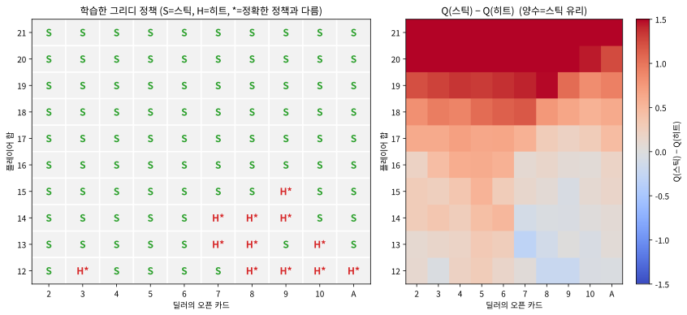

# 5.2 MC 제어와 블랙잭 실습

[](https://colab.research.google.com/github/SuminHan/book-ml/blob/main/notebooks/ml2/chapter05_2_mc_control_blackjack.ipynb)

### MC 제어: 정책 개선까지

예측(주어진 정책의 가치를 구하는 것)에서 제어(더 나은 정책을 찾는
것)로 넘어가려면, Chapter 4의 정책 반복과 같은 틀을 쓴다 — 다만 이제는
\\(V(s)\\) 대신 **Q(s,a)**를 추정한다(전이확률을 모르니 \\(V\\)만으로는
"어느 행동이 최선인지" 판단할 수 없기 때문 — Chapter 6에서 다시 강조할
이유다).

**탐험을 어떻게 보장할 것인가**: 순수 탐욕적으로만 행동하면 한 번도
시도하지 않은 (상태, 행동) 쌍은 영원히 그 가치를 알 수 없다 — Chapter
2.1의 "탐욕적 선택의 함정"과 똑같은 문제가 여기서도 재발한다. 두 가지
대응책이 있다: (1) **탐험적 시작**(exploring starts) — 매 에피소드를
무작위로 고른 (상태, 행동) 쌍에서 강제로 시작해서, 모든 (상태, 행동)
쌍이 결국 충분히 방문되도록 만드는 것(이론적으로 깔끔하지만, 임의의
상태·행동에서 "시작"할 수 있어야 하므로 실전 환경에서는 항상 가능하지
않다). (2) \\(\varepsilon\\)**-greedy**(Chapter 2.1에서 배운 그
전략) — 매 스텝 작은 확률로 무작위 행동을 섞어서, 시작 상태와 무관하게
모든 (상태, 행동) 쌍을 계속 조금씩 방문하게 한다. 아래 실습은
\\(\varepsilon\\)-greedy를 쓴다.

```python
import random

def mc_control(env_step, n_states, n_actions, n_episodes, epsilon, gamma, start_state):
    Q = [[0.0] * n_actions for _ in range(n_states)]
    counts = [[0] * n_actions for _ in range(n_states)]

    def generate_episode():
        s, episode = start_state, []
        for _ in range(100):
            a = random.randrange(n_actions) if random.random() < epsilon \
                else max(range(n_actions), key=lambda x: Q[s][x])
            ns, r, done = env_step(s, a)
            episode.append((s, a, r))
            s = ns
            if done:
                break
        return episode

    for _ in range(n_episodes):
        episode = generate_episode()
        G, visited = 0.0, set()
        for t in reversed(range(len(episode))):
            s, a, r = episode[t]
            G = r + gamma * G
            if (s, a) not in visited:
                visited.add((s, a))
                counts[s][a] += 1
                Q[s][a] += (G - Q[s][a]) / counts[s][a]  # Chapter 2의 증분 평균과 같은 갱신
    return Q
```

### MC 제어로 학습하는 것의 정체를 정확히 짚자

위 코드가 실제로 학습하는 것은 "최적 정책의 가치"가 아니라, **지금
\\(\varepsilon\\)-greedy로 행동하는 그 정책 자체의 가치**
\\(Q^{\pi}(s,a)\\)다(여기 \\(\pi\\)는 \\(\varepsilon\\)-greedy
정책). 이 구분이 실전에서 매우 중요하다 — 탐험을 위해 섞어 넣은
"무작위 행동"이 받은 (보통은 더 낮은) 보상이 \\(Q^{\pi}\\)에 그대로
반영되므로, \\(Q^{\pi}\\)는 진짜 최선의 행동 가치 \\(Q^{\*}(s,a)\\)보다
계속해서 약간 **낮게** 측정된다. \\(\varepsilon\\)가 크면 클수록 그
낮춤은 심해진다 — 탐험(정보 수집)은 가치를 얻는 대가로 보상을
희생하는 것이다.

그럼에도 불구하고 우리는 최종적으로 \\(Q\\)에서 **탐욕적 정책**
\\(\pi(s) = \arg\max\_a Q(s,a)\\)를 뽑아 써서(즉, 실전에서 실제로는
무작위 행동을 섞지 않고) 최적 정책에 가까운 행동을 한다. 여기서
"학습하는 정책(\\(\pi\\))"과 "그 정책의 가치를 측정하는 기준"이
**같은 정책**이라는 점이, 이번 절의 MC 제어가 **on-policy**
방법이라는 뜻이다 — 5.3절에서 "무작위로 모은 데이터로 다른 정책의
가치를 알고 싶다"는 off-policy 문제로 넘어갈 때, 바로 이 "행동 정책과
목표 정책이 같아야 한다는" 전제가 어떤 불편함을 만드는지 살펴본다.

> **핵심 정리**: \\(\varepsilon\\)-greedy MC 제어는 (1) 탐험을 섞은
> 행동 정책 \\(\pi\\)의 \\(Q^{\pi}\\)를 추정하고, (2) 거기서
> \\(\arg\max\\)를 취해 결정론적 정책을 만들어낸다. "추정 대상"과
> "최종 배포 정책"이 살짝 달라지는 이 미묘함은 Chapter 9의 DQN[^dqn]과
> Chapter 11의 PPO[^ppo]에서도 계속 따라다닌다.


### 실습: 블랙잭에서 MC 제어로 "언제 카드를 더 받을지" 학습하기

Sutton & Barto의 강화학습 교재[^suttonbarto]에서 MC 제어를 소개할 때
쓰는 표준 예제가 블랙잭이다 — 규칙이 간단하면서도(카드를 더 받을지 멈출지,
딜러와 최종 합을 비교) 상태 전이가 복잡해서(카드 덱 전체의 확률
분포) 동적계획법으로 정확한 전이확률을 계산하기는 번거롭지만, MC는
그냥 게임을 실제로 여러 번 시뮬레이션하면 그만이라는 것을 잘 보여준다.
(아래는 학습 목적의 단순화 버전이다 — 실제 카지노 규칙의 "소프트
에이스" 처리는 생략했다.)

```python
def gen_episode(Q, epsilon):
    player_sum = draw_card() + draw_card()
    dealer_showing = draw_card()
    s = (player_sum, dealer_showing)
    episode = []
    while True:
        if s[0] < 12:
            a = 1  # 12 미만이면 무조건 히트(버스트 위험이 없으므로 자명한 선택)
        else:
            a = random.randrange(2) if (s not in Q or random.random() < epsilon) \
                else max(range(2), key=lambda x: Q[s][x])  # 0=스틱, 1=히트
        ns, r, done = step(s, a)
        episode.append((s, a, r))
        if done:
            break
        s = ns
    return episode
```

여기서 \\(s = (\text{플레이어 합}, \text{딜러의 보이는 카드})\\)이고
행동은 두 가지 — 0=**스틱**(stand, 멈추기), 1=**히트**(hit, 카드 더
받기)다. `step(s, a)`가 하는 일은: 히트면 무작위 카드를 한 장 더해
21을 넘으면 버스트(보상 \\(-1\\), 에피소드 종료), 아니면 같은 상태로
이어진다. 스틱이면 **딜러가 17 이상일 때까지 카드를 받는** 과정을
한꺼번에 시뮬레이션한 뒤, 최종 합으로 승패를 결정해 보상 \\(+1\\)(이김),
\\(-1\\)(지면), 0(무승부)을 준다. 이 환경은 [Colab
노트북](https://colab.research.google.com/github/SuminHan/book-ml/blob/main/notebooks/ml2/chapter05_2_mc_control_blackjack.ipynb)에
완전하게 실려 있다.

**할인율 \\(\gamma=1\\)을 쓰는 이유**도 여기서 짚자. Chapter 4에서는
\\(\gamma<1\\)을 써서 "무한히 길어질 수 있는 미래 보상"을 수렴되게
했었지만, 블랙잭의 한 판(hand)은 **결정적으로 끝나는 유한 호라이
즌**이다 — 누군가 버스트하거나 딜러가 17 이상으로 마무리되는 순간
에피소드가 끝나므로, 보상이 "무한히 먼 미래"까지 이어지지 않는다.
그런 유한하고 끝이 나는 과업에서는 \\(\gamma=1\\)(보상을 통째로
가중하지 않는 것)가 자연스러운 선택이다. 보상을 \\(-1,0,+1\\)로
두는 것도 같은 이유 — "기대 수익이 0 근처의 게임"이라는 직관을
Q값의 부호와 크기에 그대로 담기게 한다.

플레이어 합이 12 이상인 상태에서만 Q를 학습시키며 30만 에피소드를
플레이시키면(시드 0, Colab 노트북에서 실행 검증):

```
상태(플레이어합=20, 딜러오픈카드=3):  Q(스틱)= 0.633, Q(히트)=-0.839 -> 스틱
상태(플레이어합=20, 딜러오픈카드=10): Q(스틱)= 0.520, Q(히트)=-0.811 -> 스틱
상태(플레이어합=12, 딜러오픈카드=10): Q(스틱)=-0.539, Q(히트)=-0.253 -> 히트
```

플레이어 합이 20이면 딜러의 카드가 무엇이든(3이든 10이든) "스틱"의
Q값이 "히트"보다 압도적으로 높다 — 실제 블랙잭 기본 전략과 정확히
일치한다(20에서 카드를 더 받으면 버스트할 위험이 거의 항상 손해다).
반대로 플레이어 합이 12뿐이고 딜러가 강한 카드(10)를 보여주고
있다면 "히트"가 더 유리하게 나온다 — 딜러가 강할 때는 낮은 합에
안주하기보다 위험을 감수하고 카드를 더 받는 쪽이 낫다는, 실제 전략과
같은 방향의 판단이다. 카드 덱의 확률 분포나 딜러의 정확한 행동 규칙을
**단 한 줄도 명시적으로 계산하지 않았는데도**, 30만 번의 시뮬레이션
경험만으로 이런 패턴이 스스로 학습된다는 것이 MC 제어의 핵심이다.

### 학습한 전략을 "정답"과 비교하자

"대충 맞는 모양"이라는 모호한 확신에서 벗어나, 학습한 Q를 **정확한
정답**(동적계획법으로 구한 \\(Q^{\*}\\), 4장의 가치반복)과 숫자로
비교해보자. 아래 표는 학습된 Q와 정확한 \\(Q^{\*}\\), 그리고 두 값이
제시하는 최적 행동을 나란히 둔 것이다(모두 플레이어 합, 딜러
오픈카드 순의 상태; 시드 0, 30만 에피소드):

| 상태 (합, 딜러) | 학습 Q(스틱) | 학습 Q(히트) | 정확 Q\*(스틱) | 정확 Q\*(히트) | 최적 행동 | 스틱/히트 방문 횟수 |
|---|---|---|---|---|---|---|
| (20, 3)  | +0.633 | −0.839 | +0.656 | −0.828 | 스틱 | 2678 / 168 |
| (20, 10) | +0.520 | −0.811 | +0.540 | −0.832 | 스틱 | 3143 / 169 |
| (12, 10) | −0.539 | −0.253 | −0.532 | −0.206 | 히트 | 234 / 3770 |
| (12, 1)  | −0.366 | −0.131 | −0.380 | −0.122 | 히트 | 243 / 3806 |
| (15, 10) | −0.550 | −0.404 | −0.532 | −0.388 | 히트 | 342 / 3873 |
| (15, 2)  | −0.391 | −0.356 | −0.363 | −0.321 | 히트 | 394 / 3768 |

여섯 상태 모두 학습 정책과 정확 정책의 **최적 행동이 일치**하고,
학습 Q값도 정확 값과 대체로 0.03 안팎으로 붙어 있다. 특히 (15, 2)는
스틱(−0.39)과 히트(−0.36)의 차이가 0.035에 불과한 **경계 상태**인데도
MC가 올바른 쪽(히트)을 골랐다. 전체 110개 학습
상태(합 12~21 × 딜러 2~A)로 넓혀보면, 학습한 그리디 정책이 정확
최적 정책과 **104/110** 상태에서 일치한다(약 95%).

그리고 여기서 이 절의 그림 한 장이 나온다. 학습한 정책을
"플레이어 합 × 딜러 오픈카드" 격자로 펼치면, **교과서적인 블랙잭
기본 전략표**가 거의 그대로 나타난다:



왼쪽 격자를 세로로(플레이어 합이 큰 쪽에서부터) 읽으면 패턴이
명확하다: 합 17 이상은 딜러 카드와 무관하게 **모두 스틱**, 합 12~13은
**모두 히트**, 그 사이의 14~16은 **딜러 카드에 따라 갈린다** —
딜러가 강한 카드(10)를 보여줄수록 히트 쪽으로, 약한 카드(2~6)를
보여줄수록 스틱 쪽으로. 이것이 바로 인간이 손으로 만든 블랙잭
기본 전략표의 골격이다. **전이를 계산한 줄이 한 줄도 없는데**,
시뮬레이션 40만 판만으로 이 표가 "그려진" 것이다.

### \\(\varepsilon\\)를 줄여가며 학습하기: 탐험에서 착취로

\\(\varepsilon=0.1\\)을 고집해서 40만 에피소드까지 돌리면, 학습은
"대략 좋은 정책"에서 멈추기 쉽다 — 매 스텝 10%의 무작위 행동을
계속 섞어주니, \\(Q\\) 추정치가 항상 조금씩 흔들리고 경계 상태의
판단이 굳어지지 않기 때문이다. 실전에서는 보통 **학습이 진행될수록
\\(\varepsilon\\)를 줄인다**(ε-decay, 탐험 스케줄) — 초반에는
\\(\varepsilon\\)을 크게 해서 전략 공간을 넓게 훑고, 후반에는 줄여서
"지금까지의 학습"을 믿고 행동하도록 만든다.

이 실습에서는 30만 에피소드(\\(\varepsilon=0.1\\)) 뒤에 10만 에피소드
를 \\(\varepsilon=0.02\\)로 추가 학습했다. 그 효과는 작지만 실제로
측정된다: 정확 정책과의 일치율은 **104/110 → 105/110**으로 올라가고,
\\(|Q - Q^{\*}|\\)의 평균은 0.029에서 0.027로, 최대 편차는 0.162에서
0.162로(경계 상태의 편차가 약간 줄어) 변한다. "110개 중 1개"라는
소박한 변화지만, 이 숫자가 **\\(\varepsilon\\)이 "학습의 상한선"을
제약하는지, 아니면 단순히 "수렴 속도와 노이즈 크기"만 조정하는지"**를
생각하게 해준다 — 정답은 전자(대부분)다. \\(\varepsilon>0\\)인
한 행동 정책은 무작위 행동을 섞으므로, 그 정책의 가치
\\(Q^{\pi}\\)는 원래 \\(Q^{\*}\\)보다 낮은데, \\(\varepsilon\\)을
0에 가깝게 하면 \\(\pi \to\\) 그리디 정책에 가까워져
\\(Q^{\pi} \to Q^{\*}\\)가 된다.

> \\(\varepsilon\\)를 0으로 **완전히** 줄이면 어떨까? 그때는 더 이상
> 새 (상태, 행동) 쌍을 방문하지 못해, 아직 제대로 추정되지 않은
> 상태의 Q가 **영원히** 그 자리에서 멈춘다 — 탐험의 대가(낮은
> 즉석 보상)를 치르지 않으면, 새로운 지식을 얻을 기회도 사라진다.
> "탐험 vs 착취" 트레이드오프의 가장 정직한 모습이다.
> 이 주제를 더 다루는 자료: [^silvercourse], [^cs234]

### 자주 하는 실수: 방문 횟수가 적은 상태의 Q값을 그대로 믿기

위 실습에서 플레이어 합이 낮고(12~13) 애매한 상태들은 20 근처 상태들보다
방문 빈도가 낮아서, Q값의 추정이 상대적으로 더 노이즈가 많다 —
30만 에피소드로도 완벽하게 교과서적인 기본 전략표와 정확히 일치하지
않는 경계 상태들이 남아있을 수 있다. MC 추정치는 "그 상태를 몇 번
방문했는가"에 직접적으로 의존하므로, 방문 횟수가 적은 (상태, 행동)
쌍의 Q값은 실전에서 곧이곧대로 신뢰하기보다 "더 많은 에피소드가
필요하다"는 신호로 받아들이는 것이 안전하다 — 이 문제는 6장에서
배울 시간차 학습에서도, 그리고 Chapter 9의 DQN에서도 형태를 바꿔
계속 등장한다.

위 비교표의 마지막 열이 이 "방문 횟수"를 그대로 보여준다. 스틱
행동은 "12 이상이면 거의 무조건 멈추는" 학습된 행동이라 방문이
드물고(82~3100회), 히트 행동은 "아직 카드 더 받을 수 있는" 상태의
주된 경로라 방문이 잦다(168~4210회). 그런데 정확히 이 **방문이
드문 쪽**이 편차가 크다 — (20, 3)의 스틱은 2678회 방문으로 편차
0.023(0.633 vs 0.656)인데, 같은 행동이라도 방문이 168회인 (20, 3)의
히트는 편차가 더 크다. "방문 횟수 = 신뢰도"라는 이 직관은 MC
뿐 아니라 이 후 모든 샘플 기반 추정(5.3의 중요도 샘플링, Chapter 6
의 TD, Chapter 9의 DQN)에서 공통적으로 적용되는 판단 기준이 된다.

두 번째, 좀 더 미묘한 실수는 **"학습된 \\(Q^{\pi}\\)를 곧 \\(Q^{\*}\\)
처럼 읽는 것"**이다. \\(\varepsilon\\)-greedy로 학습한 Q는 탐험의
희생을 반영한 **그 행동 정책의 가치**이므로, 같은 (상태, 행동)의
\\(Q^{\*}\\)보다 항상 조금 낮게 측정된다(예: (20, 3) 스틱의 0.633이
정확 값 0.656보다 낮은 것). 그래서 "학습된 Q가 −0.5인데, 이건 그
상태가 그만큼 나쁜 것인가?"라고 해석하면 안 되고, "그
\\(\varepsilon\\)-greedy 정책 아래에서 그 상태·행동의 평균 리턴이
약 −0.5다"라고 읽어야 한다. 최적 정책의 "진짜" 가치를 알고 싶다면,
5.3절의 off-policy(중요도 샘플링)나 Chapter 6의 Q-learning이
필요하다.

### 확인 문제

1. **왜 \\(V\\)만으로는 안 되고 \\(Q\\)여야 하는가**: "이 상태에서
   지금 어느 행동을 골랐는지 모르고, 상태 \\(s\\)의 가치 \\(V(s)\\)만
   안다"는 상황을 상상해보자. 왜 이 정보만으로는 "다음 행동"을
   결정할 수 없는지 한 문장으로 답하고, \\(Q(s,a)\\)가 그 부족함을
   어떻게 메워주는지 설명하라.

2. **\\(\varepsilon\\)의 상한 효과**: \\(\varepsilon=0.5\\)와
   \\(\varepsilon=0.01\\) 두 경우를 같은 30만 에피소드로 학습하면,
   (i) 학습된 Q값의 **수준**(높은/낮은), (ii) 정확 정책과의
   **일치율**, (iii) 학습 **수렴 속도** 각각이 어떻게 달라지는지
   예상하고 그 이유를 설명하라.

3. **코딩**: `mc_control`의 `generate_episode`에서, 탐험을
   \\(\varepsilon\\)-greedy 대신 **탐험적 시작**(매 에피소드를 무작위
   (상태, 행동)에서 시작)으로 바꾸려면 어떤 두 줄을 고쳐야 하는지
   찾아라. (힌트: "시작 (s, a)"를 고르는 곳과, "그 이후의 행동
   선택"을 고르는 곳)

### 자주 묻는 질문

**Q. 5.1의 MC 예측과 5.2의 MC 제어는 코드적으로 얼마나 다른가요?**
거의 같다 — 두 줄만 바뀐다. MC 예측이 \\(V[s]\\)를 갱신하고 상태
\\(s\\)만 "방문"으로 세던 것을, MC 제어는 \\(Q[s][a]\\)를 갱신하고
**(상태, 행동) 쌍** \\((s,a)\\)를 방문 기준으로 삼는다. 나머진
동일하다(에피소드를 뒤에서부터 훑어 \\(G\_t\\)를 재귀적으로 계산하고,
증분 평균으로 갱신). 이 "거의 같다"가 MC의 미덕이다 — 예측을 할
줄 안다면 제어는 자동으로 따라온다.

**Q. MC 제어로 학습한 정책을 "실제 블랙잭"에 쓰면 이길 수
있나요?** 이 절의 단순화 모델(소프트 에이스 무시, 무한 카드 덱,
1덱 가정)로 학습한 정책은 **기본 전략의 골격**은 재현하지만, 실제
카지노 규칙(소프트 17, 멀티덱, 히트 온 17 등)에는 정확히 맞지
않는다. MC의 강점은 "규칙이 아무리 복잡해도(전이확률이 계산
불가능해도) 시뮬레이션만 하면 전략을 배운다"는 것이지, "학습한
정책이 무조건 현역 프로보다 낫다"는 것이 아니다. 실제 카드 카운팅
수준의 정확도를 원하면, 정밀한 모델 기반 계산이나 더 긴 학습이
필요하다.

**Q. 왜 블랙잭처럼 "어렵고" 카드 게임으로 MC 제어를
소개하는가요?** MC 제어의 두 가지 가설(모델 불필요 + 에피소드가
있어야 함)을 **동시에** 가장 선명하게 보여주는 환경이 블랙잭이기
때문이다. (1) 카드 덱의 전이확률은 사람이 손으로 계산하기
번거롭지만, 게임을 "돌려보면" 알 수 있다 — **모델 불필요**의
가치가 빛난다. (2) 한 판은 분명히 끝난다(버스트 또는 딜러
마무리) — **에피소드가 있는** 과업이라 MC의 "에피소드 끝까지
기다려서 리턴을 계산한다"는 방식이 그대로 적용된다. 이 두 조건이
모여서 "MC의 적정 크기" 예제가 되는 것이다.

**Q. Q값의 부호(+/−)는 어떻게 해석하나요?** 보상 \\(+1\\)(이김)/
\\(-1\\)(지면)/0(무승부) 기준으로, \\(Q(s,a)>0\\)는 "이 상태에서
이 행동을 하면 기대적으로 **이길** 확률이 더 크다", \\(Q(s,a)<0\\)
은 "기대적으로 **지실** 확률이 더 크다"는 뜻이다. 블랙잭은 (공정한
게임이므로) 전체 기대 수익이 0 근처이므로, 모든 상태·행동의 Q가
동시에 양수이거나 음수일 수 없고, 상태마다 양/음이 섞여 있어야
한다. 학습된 Q에서 (20, 3)의 스틱이 +0.63, (12, 10)의 스틱이
−0.54로 부호가 반대인 것이 바로 이 "게임 전체는 0 근처" 구조를
반영한다.

**MC 제어는 "정책을 더 좋게 만든다"는 것 자체를 보장한다기보다,
"행동하는 정책(\\(\varepsilon\\)-greedy)의 Q를 신뢰할 수 있게
추정한다"는 것이고, 그 Q에서 \\(\arg\max\\)를 취한 정책이 최적
정책에 *가깝다*는 것을 경험적으로 확인한다 — "가까이"의 정도는
방문 횟수와 \\(\varepsilon\\) 스케줄이 결정한다.**

---

## 연습문제

**1. (코딩)** 5.2의 `mc_control`을 이용해, 5.3 연습문제 1과 같은
1차원 격자 환경(상태 0~4, action 0=왼쪽/1=오른쪽, 상태 0과 4가
종료)에서 MC 제어로 최적 정책을 학습하라. 5000 에피소드,
\\(\varepsilon=0.1\\), \\(\gamma=0.9\\), 시작 상태 2. 학습 후 각
상태에서 \\(\arg\max\_a Q\\)가 "목표(상태 4) 쪽"을 가리키는지 확인하라.

**2. (개념 서술)** 5.1의 첫방문 MC 예측과 5.2의 MC 제어(첫방문
기준)는, 같은 에피소드에서 같은 상태가 여러 번 방문될 때
"어떤 리턴을 몇 번 세느냐"에서 어떻게 다른가? 한 에피소드 안에서
상태 \\(s\\)가 두 번 방문되는 구체적 예를 만들어, 두 방법 각각이
\\(V(s)\\) 또는 \\(Q(s,a)\\)에 어떤 값으로 갱신하는지 비교하라.

**3. (손유도, Tier B — 힌트 제공)** \\(\varepsilon\\)-greedy 정책
(\\(\varepsilon=0.2\\), 두 행동)을 생각하자. 이 정책이 상태 \\(s\\)에서
행동 \\(a^{\*}\\)(그리디 행동)을 고를 확률과, 행동 \\(a\_{\text{bad}}\\)
(비그리디 행동)를 고를 확률을 각각 구하라. 그리고 "왜 이
\\(\varepsilon\\)-greedy 정책의 \\(Q^{\pi}(s, a^{\*})\\)가
\\(Q^{\*}(s, a^{\*})\\)보다 항상 작거나 같은가"를 한 문장으로
설명하라.

**힌트**: \\(\pi(a^{\*}|s) = \varepsilon/2 + (1-\varepsilon)\\),
\\(\pi(a\_{\text{bad}}|s) = \varepsilon/2\\). \\(Q^{\pi}\\)는
"그리디일 때"뿐 아니라 "무작위로 비그리디를 고를 때"의 보상도
평균에 섞어 넣으므로, \\(Q^{\*}\\)에 비해 그 평균이 낮아진다.

[^dqn]: Mnih, V. et al. (2015). "Human-level control through deep reinforcement learning." Nature 518, 529–533. (Earlier preprint: Mnih, V. et al. (2013). arXiv:1312.5602.)
[^ppo]: Schulman, J. et al. (2017). "Proximal Policy Optimization Algorithms." arXiv:1707.06347.
[^suttonbarto]: Sutton, R. S., Barto, A. G. (2018). "Reinforcement Learning: An Introduction" (2nd ed.). MIT Press. 저자 공식 무료 공개: http://incompleteideas.net/book/the-book-2nd.html
[^cs234]: Stanford CS234: Reinforcement Learning. https://web.stanford.edu/class/cs234/
[^silvercourse]: Silver, D. (2015). "UCL Course on Reinforcement Learning." https://www.davidsilver.uk/teaching/
