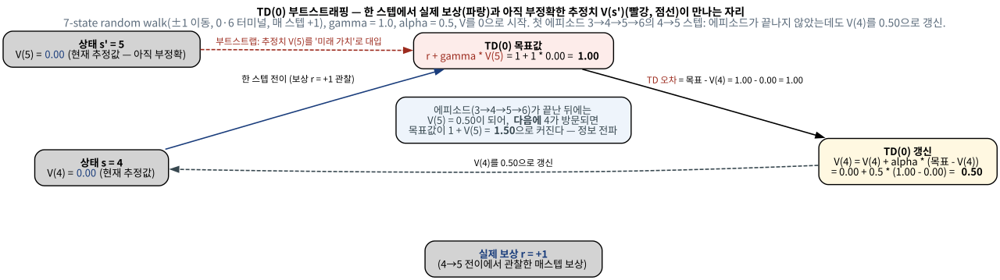

# 6.1 TD(0): 한 스텝만 보고 갱신한다, TD vs MC

[](https://colab.research.google.com/github/SuminHan/book-ml/blob/main/notebooks/ml2/chapter06_1_td0_bootstrap.ipynb)

### TD(0): 한 스텝만 보고 갱신한다

Chapter 4의 벨만방정식 \\(V^\pi(s) = R(s,\pi(s)) + \gamma V^\pi(s')\\)를
다시 보자. 정책평가(모델 기반)는 이 식의 우변을 **모든** 다음 상태에
대한 기댓값으로 계산했다. TD(0)는 그 기댓값을, 실제로 한 번 관찰한
**샘플 하나**로 대체한다:

\\[V(s) \leftarrow V(s) + \alpha\big[r + \gamma V(s') - V(s)\big]\\)[^suttonbarto]

대괄호 안을 **TD 오차**(TD error)라 부른다. MC와 비교하면 핵심 차이가
분명해진다: MC는 실제 리턴 \\(G\_t\\)(에피소드 끝까지의 실제 보상 합)를
목표로 쓰지만, TD는 \\(r + \gamma V(s')\\)(한 스텝의 실제 보상 + 다음
상태 가치의 **추정치**)를 목표로 쓴다 — "아직 확실하지 않은 추정치를
가지고 스스로를 갱신한다"는 뜻에서 **부트스트래핑**(bootstrapping)이라
부른다. 이 부트스트래핑 덕분에 에피소드가 끝나지 않아도, 심지어 끝이
없는 과업에서도 매 스텝 학습이 가능해진다.

**위치: TD(0)는 DP와 MC의 "정가운데"에 있다.** Chapter 4와 Chapter 5의
방법을 한 줄씩 요약하면, DP는 "벨만방정식의 기댓값을 **정확히** 계산
(모델 \\(P, R\\) 필요)"하고, MC는 "기댓값을 계산하지 않고 **에피소드
끝의 실제 리턴**을 평균(모델 불필요, 그러나 끝까지 기다림)"하는 것이었다.
TD(0)는 이 둘의 장점을 한 식 안에 합친다 — 모델은 쓰지 않으면서
(MC처럼), 기댓값도 "전체 리턴"이 아니라 "한 스텝 보상 + **다음 상태의
현재 추정치**"로만 대체해서(DP처럼 한 스텝만 본 구조) 매 스텝 즉시
갱신한다. "정확한 기댓값"(DP)과 "완전한 샘플"(MC) 사이에서, **덜
정확하지만 훨씬 빨리 도착하는 추정치**를 중간 목표로 쓰는 것이
부트스트래핑이다. 이 "중간 목표"가 좋고 나쁨을 가르는 핵심이라, 아래에서
7-state random walk[^suttonbarto]를 가지고 손으로 한 에피소드를 처음부터
끝까지 풀어본다.

### 손계산: 7-state random walk의 첫 에피소드

**환경.** 상태가 0부터 6까지 일렬로 놓여 있고, 매 스텝 확률 1/2씩
하나씩 왼쪽 또는 오른쪽으로 이동한다. 0과 6은 **터미널**(에피소드
종료)이고, **매 스텝마다 보상** \\(+1\\)을 받는다("아직 끝나지 않은
시간" 자체가 가치에 반영되도록). 할인율 \\(\gamma = 1\\), 정책은
"동전던지기"로 고정이다(고를 행동이 하나뿐이라 정책 개선은 6.2절 이후의
이야기 — 이번 절은 5.1절의 MC 예측과 같은 **예측** 문제다).

이 환경의 참값은 예쁘게 닫힌 형태로 구해진다. \\(V^\*(i)\\)는
"\\(i\\)에서 출발해 0이나 6을 만날 때까지 걸리는 **보상 총합**"이고,
매 스텝 \\(+1\\)이므로 곧 **기대 흡수 시간**이다. 대칭적 무작위 유랑의
표준 결과로, 양 끝(0과 6)에서 0인 이차함수 \\(T\_i = i(6 - i)\\)가
나온다:

\\[V^\* = \big[0,\ 5,\ 8,\ 9,\ 8,\ 5,\ 0\big]\\]

(직접 검산: 벨만방정식 \\(V\_i = 1 + \tfrac{1}{2}V\_{i-1} +
\tfrac{1}{2}V\_{i+1}\\)에 대입하면, 예컨대 \\(V\_3 = 1 +
\tfrac{1}{2}(8 + 8) = 9\\)로 성립한다.) 직관도 정확히 맞는다 —
가장 멀리서도 3스텝, 양 끝으로 가장 빠르게 "빨려가는" 상태 3이
가장 높은 가치 9를 가진다.

**첫 에피소드를 손으로 TD(0)로 갱신해본다.** \\(\alpha = 0.5\\),
초기값 \\(V = [0,0,0,0,0,0,0]\\), 그리고 운이 좋게(또는 나쁘게)
**\\(3 \to 4 \to 5 \to 6\\)으로** 한 번에 오른쪽 끝에 닿는
에피소드가 나왔다고 하자. 실제 리턴은 \\(G = +3\\)(3스텝, 스텝당
\\(+1\\)). 이제 TD(0) 갱신식을 스텝마다 적용한다(매 스텝
\\(r = 1\\), \\(\gamma = 1\\)):

- \\(t\\): 상태 3에서 4로. 목표 \\(r + \gamma V(4) = 1 + 0 = 1\\)
  → \\(V(3) \leftarrow 0 + 0.5 \times (1 - 0) = \mathbf{0.5}\\)
- \\(t+1\\): 상태 4에서 5로. 목표 \\(1 + V(5) = 1\\)
  → \\(V(4) \leftarrow \mathbf{0.5}\\)
- \\(t+2\\): 상태 5에서 6(터미널, \\(V(6) = 0\\) 고정).
  목표 \\(1 + V(6) = 1\\) → \\(V(5) \leftarrow \mathbf{0.5}\\)



세 가지를 짚자.

**첫째, 한 에피소드 만에 "방향"은 맞췄지만 "크기"는 틀어져 있다.**
참값은 9·8·5인데, 첫 에피소드 뒤에는 0.5·0.5·0.5다. MC라면 이 한
에피소드에서 \\(V(3) = V(4) = V(5) = G = 3\\)로 **한 번에** 갱신
했을 것이다(매방문, \\(\alpha = 1\\)의 일평균). 둘 다 참값(9)과는
멀지만, MC는 " unbiased한 큰 점프"를, TD는 "biased한 작은 점프"를
했다 — 그 차이의 대가는 다음 절의 실측 숫자로 확인한다.

**둘째, "정보 전파"가 일어난다.** 에피소드가 끝난 직후 V(5) = 0.5가
"알려진 사실"이 되자, **다음에** 상태 4가 방문되면 목표값이
\\(1 + V(5) = 1.5\\)로 **자동으로** 커진다. 5의 갱신된 정보가 4의
다음 목표값에, 4의 갱신된 정보가 3의 목표값에, 이렇게 **한 스텝씩,
시간차로** 전파되어간다 — "Temporal-Difference"라는 이름의 본체가
바로 이 현상이다. MC는 이런 전파가 불필요하다(에피소드 끝에서 G를
**일괄** 알려주기 때문) — 대신 그 대가로 "에피소드 끝"을 매번
기다려야 한다.

**셋째, 갱신 목표는 에피소드와 무관하다.** 4→5 스텝의 목표값
\\(1 + V(5) = 1\\)은 "이 에피소드가 끝내 얼마의 리턴을 주느냐"를
**아무것도** 반영하지 않는다. 그 스텝에서 관찰된 r과, 그 순간의
추정치 V(5)만으로 정해진다. 이 "로컬성"이 부트스트래핑의 힘이자
약점이다 — 약점(편향)이 어떻게 "분산이 작음"으로 환원되는지 아래
"TD vs MC"에서 숫자로 확인한다.

### TD vs MC: 편향과 분산의 트레이드오프

| | 몬테카를로 | 시간차 학습(TD) |
|---|---|---|
| 목표값 | 실제 리턴 \\(G\_t\\)(에피소드 끝까지) | \\(r + \gamma V(s')\\)(한 스텝 + 추정치) |
| 갱신 시점 | 에피소드가 끝난 뒤 | 매 스텝 즉시 |
| 편향/분산 | 편향 없음(불편), 분산 큼 | 편향 있음(추정치를 씀), 분산 작음 |

MC의 목표값 \\(G\_t\\)는 실제로 관찰된 보상들의 합이라 편향이 없지만
(장기적으로 평균 내면 정확히 \\(V^\pi\\)에 수렴), 에피소드 하나하나가
무작위성(긴 시퀀스에 걸친 모든 확률적 전이·보상)을 통째로 담고 있어
분산이 크다. TD의 목표값 \\(r+\gamma V(s')\\)는 \\(V(s')\\)이
**아직 부정확한 추정치**이므로 편향이 있지만, 한 스텝의 무작위성만
반영하므로 분산이 훨씬 작다 — Chapter 4.1의 편향-분산 트레이드오프가
여기서도 다른 형태로 등장한다.

**이 "분산의 차이"는 목표값의 분산 이야기다 — 숫자로 확인.** 위 표의
"분산 큼/작음"이 추상적으로 들린다면, 방금의 7-state random walk에서
두 방법의 **목표값 분포**를 실제로 펼쳐보자(노트북, 시드 42, 상태 3에서
1000에피소드):

| 방법 (시드 42, 1000에피소드) | \\(V(3)\\) 추정 | 쓴 목표값 | 목표값의 산포 |
|---|---|---|---|
| MC(매방문) | ≈ 9.3 | 리턴 \\(G\\) | 평균 9.3, 표준편차 ≈ 7.3, **범위 3~51** |
| TD(0), \\(\alpha = 0.1\\) | ≈ 10.0 | \\(r + \gamma V(s')\\) = \\(1 + V(s')\\) | 평균 7.6, 표준편차 ≈ 3.0, 범위 1~11.7 |
| 참값 \\(V^\*(3)\\) | 9 | — | — |

MC의 각 목표값(리턴)은 **에피소드 전체의 운**을 담는다 — 이 유랑이
3스텝에 끝날 수도, 51스텝을 방황하다 끝날 수도 있다(범위 3~51,
표준편차 7.3). 반면 TD의 각 목표값은 "보상 1 + 옆 상태의 현재
추정치"뿐이라, \\(V\\)가 어느 정도 자리를 잡으면 대략 5~10의 좁은
범위 안에서만 다닌다(초반에 \\(V(s')=0\\)이라 목표값이 1로 시작해
범위가 1~11.7까지 벌어지지만, 표준편차는 MC의 절반 이하). 표의
"TD의 분산이 작다"는, **갱신 한 번에 사용되는 목표값이 얼마나
흔들리느냐**의 이야기인 것이다. (최종 추정치 전체의 산포는 학습률
\\(\alpha\\)와 샘플 수의 문제가 되는데, 아래 "자주 하는 실수"의
세 번째 항목에서 계속한다.)

편향 쪽도 숫자로 보면 명확하다. 첫 에피소드에서 상태 4의 목표값
\\(1 + V(5) = 1\\)이었던 것 기억나나 — 참값 8과 **크게** 어긋나
있다. \\(V(s')\\)가 부정확한 한, TD의 목표값은 참값을 **체계적으로
어긋나 있는**(= 편향된) 상태다. MC의 목표값 \\(G\\)는 어떤 한
에피소드가 아무리 운이 없어도 **평균**으로는 정확하다(불편).
"작은 분산"을 얻는 대가로 "임시적인 편향"을 쓴다는 것 — 이것이
부트스트래핑의 가격표다. 그리고 그 편향은 \\(V\\)가 수렴할수록
자동으로 사라진다(FAQ 두 번째 항목).

### TD 오차: "예측 오차"로 읽는 갱신식

갱신식 \\(V(s) \leftarrow V(s) + \alpha \underbrace{\big[r +
\gamma V(s') - V(s)\big]}\_{\text{TD 오차 } \delta}\\)을 "예측"의
언어로 다시 쓰면, 기계학습 전반의 핵심 패턴과 정확히 같은 모양이
된다. 에이전트는 상태 \\(s\\)에 도착했을 때 "여기서부터는 대략
\\(V(s)\\)의 가치가 있을 거다"라고 **예측**하고 있다. 한 스텝을
진행한 뒤, 관찰한 보상 \\(r\\)과 도착한 상태 \\(s'\\)의 가치 추정
\\(V(s')\\)를 합치면 "사후적으로" 더 그럴듯한 평가
\\(r + \gamma V(s')\\)가 생긴다. 두 것의 차이

\\[\delta = \underbrace{r + \gamma V(s')}\_{\text{사후 평가}}
- \underbrace{V(s)}\_{\text{사전 예측}}\\]

가 바로 예측 오차(prediction error)다. \\(\delta > 0\\)이면
"예상보다 좋았다" → 추정치를 올리고, \\(\delta < 0\\)이면
"예상보다 나빴다" → 내리는 것이다. 손계산의 첫 에피소드에서
세 스텝 모두 \\(\delta = 1 - 0 = +1\\)이었으니, "0으로 예측하고
있었는데 실제 목표값이 1이라 전부 기대 이상"이라는 뜻이다 —
처음엔 모든 상태가 "낙관적으로" 갱신당하고, 이후 방문에서
"실망"하는 갱신(\\(\delta < 0\\))이 섞이면서 참값을 향해
수렴한다.

이 시점에 **TD 오차가 0이 되는 지점**이 어디인지 확인하는 것은
중요하다. \\(\delta = 0\\) ⇔ \\(V(s) = r + \gamma V(s')\\)(확률적
환경에서는 기댓값으로) — 이 바로 **벨만 기대방정식**이다. 즉
"TD 오차가 계속 0이 되는 상태"가 곧 벨만방정식의 해, 곧 참값
\\(V^\pi\\)라는 뜻이다. Chapter 4.3의 바나흐 고정점 정리가
"해는 유일하고, 이 반복은 그 해로 수렴한다"를 **모델 기반**
반복에 대해 보장했던 것과 같은 원리가, 여기서는 "샘플로 추정치
갱신을 반복하면 고정점으로 수렴한다"는 형태로 다시 나온다
(수렴 조건, Robbins-Monro의 \\(\alpha\\) 스케줄링은 6.3절과
Chapter 7에서 다룬다). 그리고 이 "예측 오차 신호"는 이 책의 마지막
까지 따라온다 — Chapter 11의 액터-크리틱에서 배우는 **크리틱의
오차**(어드밴티지)는 TD 오차의 일반화다.

### 실습 코드: 7-state random walk에서 TD(0) 학습시키기

노트북(본문 상단의 Colab 배지에서 실행)의 핵심은 다음
함수 하나다:

```python
import random

def td0_random_walk(seed=42, n_episodes=1000, alpha=0.1, gamma=1.0, start=3):
    rng = random.Random(seed)
    V = [0.0] * 7                     # V(0)=V(6)=0은 터미널이라 항상 0 (고정)
    for _ in range(n_episodes):
        s = start
        while s not in (0, 6):        # 0 또는 6에 도착하면 에피소드 종료
            sp = s + rng.choice([-1, 1])
            r = 1.0                   # 매 스텝 +1
            # 터미널로 가는 스텝: V(sp)는 쓰지 않음 (0이 고정값)
            V[s] += alpha * (r + gamma * (0.0 if sp in (0, 6) else V[sp]) - V[s])
            s = sp
    return V

V = td0_random_walk()
print([round(v, 2) for v in V])   # 참값 [0, 5, 8, 9, 8, 5, 0]에 가깝게 수렴
```

세 줄의 코드가 전부다. (1) `sp = s + rng.choice([-1, 1])`이
"환경"의 유일한 무작위성(모델이 없다는 뜻은 이 확률을 우리가
알지 못한다는 것이 **아니고** — 여기서는 알고 있다 — "이 확률을
사용하지 않고" 배운다는 것이다), (2) `V[s] += alpha * (...)`이
TD(0) 갱신식 자체, (3) `(0.0 if sp in (0, 6) else V[sp])`이
**터미널 처리**다. 두 번째에서 "모델을 쓰지 않는다"는 점을
주의하자: \\(P(s' \mid s)\\)를 **우리가** 알고 있느냐는 이 예제
에서는 부차적이며, 알고리즘이 갱신식에 사용하는 것은 **실제로
관찰된** \\((s, r, s')\\) 한 줄뿐이다. (환경의 확률이 알려졌다면
Chapter 4의 DP로 바로 계산하는 것이 이 예제에서는 더 효율적이다 —
TD의 가치는 "확률을 **모를** 때"에 있다. 그 "모를 때"의 표준
예제인 CliffWalking[^suttonbarto]은 6.2절에서 바로 만난다.)

### 고정점: TD(0)는 어디로 수렴하나

\\(V\\)가 더 이상 움직이지 않는(고정점) 지점에서 갱신식의 목표값
\\(r + \gamma V(s')\\)가 \\(V(s)\\)와 **항상** 같아야 하므로,
고정점은 정책 \\(\pi\\)의 벨만 **기대**방정식의 해 — 즉
\\(V^\pi\\) — 다. (여기서는 정책이 동전던지기 하나뿐이므로
"그 정책의 가치"가 곧 목표다. "더 나은 정책으로의 개선"은
6.2절 이후.) 수렴을 위한 조건은 MC보다 한 가지 더 까다롭다:[^suttonbarto]

- MC: 에피소드가 **유한**히 끝나고, 모든 상태가 충분히 방문되면
  수렴(불편한 샘플 평균이므로).
- TD(0): 에피소드가 유한한 것 + 모든 상태가 **무한히** 방문되는 것
  + 학습률 \\(\alpha\\)가 **적절히 줄어**가는 것(Robbins-Monro
  조건: \\(\sum\_k \alpha\_k = \infty\\)이고
  \\(\sum\_k \alpha\_k^2 < \infty\\)).

마지막 조건의 이유는 Chapter 2의 증분 평균으로 직관된다 —
\\(\alpha\\)가 계속 크면(예: 항상 0.5) 잡음이 섞인 목표값이 계속
들어오므로 추정치가 참값에 "착지"하지 못하고 **주위를 맴돈다**.
노트북에서 \\(\alpha = 0.5\\)와 \\(\alpha = 0.1\\)를 비교하면,
\\(0.5\\)의 추정치가 참값 9 근처에서 더 크게 흔들리는 것을
볼 수 있다. (실제 구현에서는 \\(\alpha\\)를 고정해도 동작하지만,
"수렴한다"는 명제의 말장난을 피하려면 이 조건이 필요하다.)

### 자주 하는 실수

- **터미널 상태로 들어가는 마지막 스텝을 갱신하지 않는다.**
  "종료 상태에서는 갱신 안 한다"는 것을 `if sp in (0, 6): break`
  로 **갱신 앞에서** 처리하면, 보상을 실제로 준 마지막 전이
  (예: 5→6)의 상태 5가 **영원히** 갱신되지 않는다. "끝이 어디
  인가"가 가장 강하게 알려지는 전이인데도. 정답은 갱신을 **먼저**
  하고 종료 판단을 하는 것이다(6.2절 SARSA 코드도
  `갱신 → break` 순서):
  `done = (sp in (0,6)); V[s] += ...; if done: break`.
- **\\(\alpha = 1\\)을 "가장 빠르니까" 쓴다.** \\(\alpha = 1\\)이면
  \\(V(s)\\)가 목표값으로 **통째** 대체된다 — "증분 평균"이
  아니라 "마지막 관찰 기억"이 되는 것이다. 잡음이 큰 목표값(리턴
  범위가 3~51인 MC, 추정치가 흔들리는 TD의 목표값)을 쓰는 상황
 에서는 추정치가 마지막 한 번의 운에 끌려다닌다. "분산이 작다"는
  표의 결론은 **\\(0 < \alpha < 1\\)의 증분 평균**이 전제일 때
  성립한다.
- **"TD가 MC보다 정확하다"로 "분산이 작다"를 기억한다.**
  고정 \\(\alpha\\)의 TD는 위에 설명한 대로 참값에 정확히
  착지하지 않는다(편향 + 주위의 떨림). MC는 불편하고, 샘플이
  무한히 모이면 정확히 \\(V^\pi\\)에 수렴한다. "TD의 목표값
  분산이 작다" = "같은 수의 스텝을 버는 동안 **갱신 한 번의
  흔들림**이 작다",이지 "최종 오차가 반드시 작다"는 뜻이
  **아니다** — 최종 품질은 \\(\alpha\\) 스케줄과 방문 횟수의
  문제다.
- **\\(V(s')\\)를 "아직 갱신 전" 값으로 쓰겠다며 에피소드 중
  업데이트 순서를 걱정한다.** 위 코드는 **in-place**(갱신된
  \\(V(s')\\)를 곧바로 다음 목표값에 쓰는, 더 정확히는
  "에피소드 내 이미 갱신된 값이 있으면 그것을 쓰는") 방식이다.
  수렴 정리는 보통 "synchronous"(한 라운드 전체를 갱신 전
  복사본으로 계산)로 서술되지만, 실장에서는 in-place가 표준이고
  수렴에 해가 되지 않는다. "어떤 쪽을 써야 정확한가"를 묻지
  말고, **한 가지를 고르고 일관되게** 쓰면 된다.

### 확인 문제

1. (손계산) 7-state random walk에서 \\(\alpha = 0.5\\),
   \\(V\_0 = 0\\). 첫 에피소드가 \\(3 \to 4 \to 5 \to 6\\)였다.
   (a) 갱신 직후 \\(V(3), V(4), V(5)\\)는 얼마인가? (b) **다음
   에피소드에서** 상태 4가 다시 방문되어 5로 이동할 때, 목표값은
   얼마로 바뀌는가? (a)의 첫 에피소드에서 쓴 목표값(1)과
   비교하며, 이 차이가 "정보 전파"의 어떤 방향(5→4? 4→5?)
   을 보여준다고 설명하라. (c) 같은 에피소드를 MC(매방문,
   \\(\alpha=1\\))로 처리했으면 어떤 갱신이 되었는가?

2. (개념) "TD의 분산이 작다"는 표에서, "분산"의 대상이 **목표값**
   임을 방금의 숫자(MC 리턴의 범위 3~51, 표준편차 ≈ 7.3 vs TD
   목표값의 표준편차 ≈ 3.0)를 들어 설명하라. 그렇다면 "MC는
   편향이 없다"는 주장의 **정확한** 조건(무엇의 평균, 언제
   성립)을 한 문장으로 적어라.

3. (코드 진단) 아래 루프의 문제를 찾아, 그것이 **어떤 상태의
   학습**을 빼먹게 되는지 설명하라:

```python
while s not in (0, 6):
    sp = s + rng.choice([-1, 1])
    r = 1.0
    if sp in (0, 6):
        break                         # ← 갱신 전/후 어디에 두었는가?
    V[s] += alpha * (r + gamma * V[sp] - V[s])
    s = sp
```

4. (개념) \\(\gamma = 0\\)로 바꾸면 TD(0) 갱신식은
   \\(V(s) \leftarrow V(s) + \alpha(r - V(s))\\)로
   줄어든다. 이것이 "부트스트래핑"이 **사라진** 것이라는
   직관(\\(V(s')\\)이 목표값에 들어오지 않음)을 바탕으로, 이
   환경에서 \\(\gamma = 0\\)의 참값 \\(V^\*(i)\\)가 모든 내부
   상태에서 몇이 되는지 구하고, 이것이 "내다보기가 0스텝"이라는
   표현과 어떻게 일치하는지 설명하라.

### 역사: "시간차(Temporal-Difference)"라는 이름의 유래

TD라는 단어는 갱신식의 구조를 그대로 번역한 것이다 — 추정치가
**시간 방향**(스텝 방향)으로 **차이**(difference)를 만드는
점, 즉 \\(V(s')\\)(시간 \\(t+1\\)의 추정치)과
\\(V(s)\\)(시간 \\(t\\)의 추정치)의 **차이**가 갱신을
이끌기 때문이다. MC는 "현재 추정치"와 "에피소드 끝의 실제
리턴"을, DP는 "현재 추정치"와 "정확한 기댓값"을 비교하지만,
TD는 "현재 추정치"와 **한 스텝 앞의 추정치**를 비교한다 —
"시간의 차이"가 목표값의 재료가 되는 유일한 방법이다.

이 방법은 1983년, Barto, Sutton, Anderson의 논문
(*Neural learning of the optimal way to climb a mountain
car*)에서 처음 제안됐다. 제목의 **mountain car** 문제는
"계곡 바닥에 있는 자동차가 모멘텀을 만들어 양쪽 언덕 중
어느 쪽이든 올라가게 하자"는 과업으로, 물리 모델이 복잡해서
DP처럼 정확히 풀기 어렵고, MC처럼 에피소드(끝까지의 리턴)를
기다리면 학습이 너무 느린, **정확히 TD가 필요한** 종류의
환경이었다. 1984년 Sutton의 박사논문(*Temporally-Difference
Learning of Real-Time Policies*, CMU, 지도교사 A. Barto)이
이 방법을 체계화했고, 1989년 Watkins의 Q-learning[^watkins] (6.3절)과
2013년의 DQN(Chapter 9)[^dqn]으로 이어지는 **모든** 표지
(off-policy TD) 학습의 뼈대가 이 "한 스텝의 차이"에
놓여 있다. MC가 "기다림"을 없앴다면, TD는 "모델"도 함께
없앤 것 — 그리고 이 절의 갱신식은, 6.2절의 SARSA와
6.3절의 Q-learning이 "같은 뼈대에 \\(\max\\)과 다음
행동의 선택을 다르게 채우는" 출발점이다.

### 자주 묻는 질문

**Q. TD(0)에서 "(0)"은 무엇을 뜻하나요?** 한 스텝만 앞을 내다보고
바로 부트스트래핑한다는 뜻이다(0-step lookahead 이후 부트스트랩).
Chapter 7에서 배울 n-step TD는 이걸 일반화해서, \\(n\\) 스텝만큼
실제 보상을 관찰한 뒤에 부트스트랩하는 방법을 다룬다 — \\(n=1\\)이면
TD(0), \\(n=\infty\\)(에피소드 끝까지)면 사실상 MC와 같아진다는 것을
보게 된다.[^cs234]

**Q. TD(0)가 부정확한 추정치 \\(V(s')\\)를 쓰는데도 왜 결국 정확한
값에 수렴하나요?** 처음엔 \\(V(s')\\)이 부정확하지만, 매 갱신마다
그 오차가 조금씩 줄어들고(TD 오차만큼), 그 줄어든 값이 다시 다음
갱신의 목표값에 쓰이면서 오차가 전체적으로 계속 줄어드는 방향으로
수렴한다 — Chapter 4.3의 바나흐 고정점 정리와 같은 원리가 여기서도
(샘플 기반이라는 차이만 두고) 성립한다.

**Q. 에피소드 안에서 갱신 순서(in-place)가 학습 결과에 영향을
주나요?** 단기적으로는 조금(같은 에피소드에서 이미 갱신된
\\(V(s')\\)가 곧바로 다음 목표값에 반영되느냐의 차이)이지만,
수렴 결과(고정점)에는 영향을 주지 않는다. 수렴 정리는 보통
synchronous(전체 복사를 갱신에 사용)로 서술되지만, 실장에서는
in-place가 표준이며 둘 다 같은 고정점(\\(V^\pi\\))으로
수렴한다. "순서를 어떻게 해야 정확한가"는 걱정할 필요가 없다 —
**일관되게** 한 방식을 쓰면 된다.

**Q. "Temporal difference"가 실제로 차이를 이루는 양은 무엇
인가요?** 갱신 방향을 정하는 TD 오차
\\(\delta = r + \gamma V(s') - V(s)\\) 안에서, \\(V(s') -
V(s)\\)가 "시간 \\(t+1\\)의 추정치와 시간 \\(t\\)의 추정치의
차"라는 점이다. 관찰된 보상 \\(r\\)에 더해, **인접한 두 시점의
가치 추정치의 차**가 학습 신호를 만든다 — MC(리턴과 추정치의 차)
와 DP(정확한 기댓값과 추정치의 차)는 이 "차"의 한쪽을
**추정치**가 아닌 것으로 채우는 것이라, "temporal difference"
라 부르지 않는다.

**Q. 정책이 하나뿐인 이 예제에서는 "예측"만 하고 "개선"은
안 하는 것 아닌가?** 그렇다 — 이번 절(과 5.1절의 MC 예측)은
**정책 예측** 문제다. "더 나은 정책으로 갈아타기"는 6.2절에서
\\(V(s)\\)를 \\(Q(s,a)\\)로 바꾸고, 행동 선택이
\\(\arg\max\_a Q(s,a)\\)로 읽히는 순간부터 시작된다. TD의
갱신식 뼈대는 **전혀** 바뀌지 않는다 — 바뀌는 것은 "어떤
가치함수를 갱신하느냐"뿐이다.

[^suttonbarto]: Sutton, R. S., Barto, A. G. (2018). "Reinforcement Learning: An Introduction" (2nd ed.). MIT Press. 저자 공식 무료 공개: http://incompleteideas.net/book/the-book-2nd.html — TD(0) 갱신식과 부트스트래핑, TD vs MC의 편향-분산 비교는 이 표준 교과서 5장 "Temporal-Difference Learning"에서 체계적으로 다뤄진다. 본문의 7-state random walk 예제(참값 \\(i(6 - i)\\))도 이 장의 표준 예제(원본 예제에서는 매 스텝 보상이 \\(-1\\))를 따르고 있다.
[^dqn]: Mnih, V. et al. (2015). "Human-level control through deep reinforcement learning." Nature 518, 529–533. (Earlier preprint: Mnih, V. et al. (2013). arXiv:1312.5602.)
[^cs234]: 더 깊이 보려면 — Stanford CS234: Reinforcement Learning. https://web.stanford.edu/class/cs234/
[^watkins]: Watkins, C. J. C. H. (1989). "Learning from Delayed Rewards." PhD Thesis, King’s College, Cambridge. Formal paper: Watkins, C. J. C. H., Dayan, P. (1992). "Q-learning." Machine Learning 8, 279–292.
