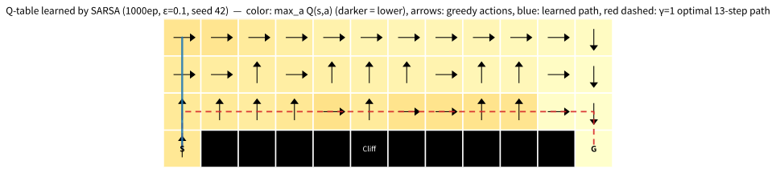
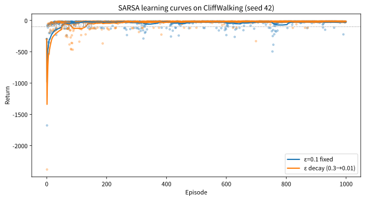

# 6.2 SARSA와 CliffWalking 실습

[](https://colab.research.google.com/github/SuminHan/book-ml/blob/main/notebooks/ml2/chapter06_2_sarsa_cliffwalking.ipynb)

### \\(V(s)\\)에서 \\(Q(s,a)\\)로: "상태 가치"만으로는 행동을 고를 수 없다

Chapter 4의 \\(V(s)\\)는 "상태의 가치"였다. 이것만으로는 다음 행동을
고를 수 없다 — 어느 행동이 좋은 다음 상태로 이어지는지 알려면 전이확률
\\(P\\)가 필요하기 때문이다(Chapter 5.2에서 이미 짚은 이유). 그래서
TD도 \\(V(s)\\) 대신 한 걸음 더 세분화한 **Q-함수** \\(Q(s,a)\\) — "상태
\\(s\\)에서 행동 \\(a\\)를 한 뒤, 그 이후 정책을 따랐을 때의 기대 누적
보상" — 를 학습한다.

정책 \\(\\pi\\)에 따른 Q-함수는 Chapter 4의 벨만방정식과 같은 방식으로
정의된다 — "지금 행동의 보상 + 다음 상태의 가치"에서, 다음 상태를
**행동 \\(a\\)로** 이동한다는 것만 다르다:

\\[Q^{\pi}(s,a) = R(s,a) + \gamma \sum\_{s'} P(s' \mid s,a)\\, V^{\pi}(s')\\]

이걸 다시 \\(V\\) 없이, \\(Q\\)만으로 쓰면(\\(V^{\pi}(s') =
\sum\_{a'} \pi(a' \mid s') Q^{\pi}(s',a')\\)를 대입하면) 이렇게 된다:

\\[Q^{\pi}(s,a) = R(s,a) + \gamma \sum\_{s'} P(s' \mid s,a)
\sum\_{a'} \pi(a' \mid s')\\, Q^{\pi}(s',a')\\]

\\(V\\)와 \\(Q\\)의 관계는 "상태 가치는 그 상태의 행동 가치들의
정책가중 평균"이라는 한 줄로 정리된다:

\\[V^{\pi}(s) = \sum\_a \pi(a \mid s)\\, Q^{\pi}(s,a)\\]

\\(Q\\)를 알면 \\(V\\)는 이 평균으로 바로 얻어지지만, 그 반대(\\(V\\)
에서 행동을 고르는 것)는 앞서 본 대로 \\(P\\)가 필요하므로 \\(Q\\)가
이득이다. 게다가 "어떤 행동을 고를지" 자체도 Q표에서 바로 읽을 수
있다 — **탐욕 정책**(greedy policy)

\\[\pi(s) = \arg\max\_a Q(s,a)\\]

다. Q를 학습한다는 것은 곧 "가치 평가"와 "행동 선택"을 **한 표로**
모두 해결한다는 뜻이다.

> **작은 예 — Q표의 모양을 잡자.** 상태가 셋인 장난감 MDP를
> 상상하자: \\(A\\)(출발), \\(B\\), \\(G\\)(도착, 터미널). \\(A\\)
>에서는 `right` 하면 보상 \\(-1\\)로 \\(B\\)로, `down` 하면 절벽을
> 밟아 \\(-100\\)을 받고 \\(A\\)로 돌아온다. \\(B\\)에서 `right`
> 하면 \\(G\\)에 도착(보상 0, 종료). \\(\gamma=1\\). 거꾸로 계산
> (backward induction)하면:
> \\(Q^\*(B,\text{right}) = 0\\),
> \\(Q^\*(A,\text{right}) = -1 + 1 \times 0 = -1\\),
> \\(Q^\*(A,\text{down}) = -100 + Q^\*(A,\text{right}) = -101\\)
> (절벽에서 \\(A\\)로 돌아와서 다시 최선의 `right`를 고른다는 것
>까지 포함). \\(A\\)의 두 행동은 \\(-1\\) 대 \\(-101\\) — **어떤
> 행동이 좋은지가 표의 한 행에 그대로 적혀 있다.** \\(V\\)만 있었다면
> "어느 행동이 나은지"를 알기 위해 각 행동을 \\(P\\)로 시뮬레이션
> 해야 하는데, Q는 바로 그 비교의 결과를 미리 계산해 둔 것이다.
> 이 장난감에서 \\(A\\)에 서 있는 "절벽 바로 위"의 처지가, 이번
> 절의 CliffWalking에서 SARSA가 학습할 처지와 정확히 같은 구조임을
> 기억해 두자.

### SARSA: 실제로 고른 행동을 쓴다

**SARSA**(State-Action-Reward-State-Action, 이름 자체가 갱신에 필요한
다섯 요소를 그대로 나열한 것이다)는 실제로 다음에 **고른** 행동
\\(a'\\)의 Q값을 목표로 TD 갱신을 한다:

\\[Q(s,a) \leftarrow Q(s,a) + \alpha \left[r + \gamma Q(s',a') -
Q(s,a)\right]\\]

다섯 요소는 한 줄의 궤적에서 온다. \\(s, a\\)는 현재 상태와 거기서
**행동 정책(behavior policy, 여기서는 \\(\varepsilon\\)-greedy)으로
고른** 행동, \\(r, s'\\)는 환경이 **관찰되게** 주는 보상과 다음
상태, 그리고 \\(a'\\)는 **\\(s'\\)에 도착한 뒤에** 다시 같은 행동
정책으로 고르는 행동이다. 앞의 네 개는 "경험"이고 마지막 \\(a'\\)
는 "다음에도 지금 같은 방식으로 행동하겠다"는 선택이 갱신식에
반영되는 지점이다 — 이 "실제로 고른 것을 쓴다"는 점이 SARSA를
정의한다.

```python
import random

def epsilon_greedy(Q, s, epsilon, n_actions):
    if random.random() < epsilon:
        return random.randrange(n_actions)
    return max(range(n_actions), key=lambda a: Q[s][a])

def sarsa_train(env_step, n_states, n_actions, n_episodes, alpha, gamma, epsilon, start_state):
    Q = [[0.0] * n_actions for _ in range(n_states)]
    for _ in range(n_episodes):
        s = start_state
        a = epsilon_greedy(Q, s, epsilon, n_actions)
        for _ in range(200):
            ns, r, done = env_step(s, a)
            na = epsilon_greedy(Q, ns, epsilon, n_actions)
            Q[s][a] += alpha * (r + gamma * Q[ns][na] - Q[s][a])  # 실제로 고른 na를 사용
            s, a = ns, na
            if done:
                break
    return Q
```

SARSA는 지금 실제로 따르고 있는 정책(탐험을 포함한
\\(\varepsilon\\)-greedy 그 자체)의 가치를 학습한다 — **on-policy**다
(6.3절에서 다룰 Q-learning과의 핵심 차이가 바로 여기서 나온다).

**무엇에 수렴하나.** TD 오차가 0이 되는 지점을 찾으면, SARSA 갱신식의
고정점은 행동 정책 \\(b\\)의 벨만 **기대**방정식이다 — \\(Q^{\pi}\\)
의 기대방정식(위 \\(Q(s,a)\\) 정의식)에서 정책이 \\(\varepsilon
\\)-greedy인 경우:

\\[Q(s,a) = R(s,a) + \gamma \sum\_{s'} P(s' \mid s,a)
\sum\_{a' \sim b} Q(s',a')\\]

즉 SARSA가 수렴하는 곳은 **\\(b\\) 정책 자체의 Q-함수
\\(Q^{b}\\)**이지, 최적의 \\(Q^\*\\)가 아니다. "내가 지금 이렇게
(탐험까지 포함해) 행동할 때의 가치"를 배우는 것이 SARSA다. 이
구분이 CliffWalking에서 어떤 경로 차이로 이어지는지 아래 실습에서
구체적으로 본다.

### 실습: CliffWalking 환경에서 SARSA 학습시키기

Gymnasium의 `CliffWalking-v1`은 4×12 격자에서, 출발점 바로 옆
한 줄이 전부 절벽(밟으면 보상 -100을 받고 출발점으로 되돌아감)인
환경이다 — 목표까지 가는 가장 짧은 길이 정확히 그 절벽 바로 옆을
스치는 길이라, "짧지만 위험한 길"과 "길지만 안전한 길" 사이의
선택이 극명하게 드러난다.

```python
import gymnasium as gym

env = gym.make("CliffWalking-v1")
n_states, n_actions = env.observation_space.n, env.action_space.n

def sarsa_train_gym(env, n_episodes, alpha, gamma, epsilon):
    Q = [[0.0]*n_actions for _ in range(n_states)]
    for ep in range(n_episodes):
        s, _ = env.reset(seed=ep)
        a = epsilon_greedy(Q, s, epsilon, n_actions)
        for _ in range(500):
            ns, r, term, trunc, _ = env.step(a)
            na = epsilon_greedy(Q, ns, epsilon, n_actions)
            Q[s][a] += alpha*(r + gamma*Q[ns][na] - Q[s][a])
            s, a = ns, na
            if term or trunc:
                break
    return Q
```

환경의 정확한 규칙(노트북에서 직접 확인): 48개 상태(번호 0~47,
\\((\text{row}, \text{col}) = \text{divmod}(s, 12)\\)), 4개 행동
(0=위, 1=오른쪽, 2=아래, 3=왼쪽). 출발은 \\((3,0)\\)=36, 목표
\\((3,11)\\)=47(터미널, 보상 0). 절벽 칸은 \\((3,1) \sim (3,10)\\) —
밟으면 보상 \\(-100\\)과 함께 \\((3,0)\\)로 회귀. 벽에서 벗어나는
이동은 **그 자리에 남고** 보상 \\(-1\\). 이동 자체에도 매 스텝
\\(-1\\)(시간 벌점)이 붙는다.

이 환경에는 후보 경로가 딱 두 가지의 모양을 가진다:

- **짧은 길(\\(\gamma=1\\)에서의 최적 경로)**: \\((3,0) \to (2,0)
  \to (2,1) \to \cdots \to (2,11) \to (3,11)\\), **13스텝**, 리턴
  \\(-12\\). 절벽(3행)의 **바로 위**(2행)를 통째로 스친다.
- **안전한 길**: 절벽에서 두 칸 이상 떨어질 정도로 위쪽(0~1행)을
  돌아가는 **17스텝**, 리턴 \\(-16\\).

참고로 "절벽 자체가 최선이라는" 정책은 존재하지 않는다 — \\(\gamma=1\\)
의 최적 Q값에서 절벽 바로 위 칸 \\((2,1)\\)의 Q(위,오른쪽,아래,왼쪽)
를 계산해보면 \\(-12, -10, -112, -12\\)로, `down`(절벽)은 여전히
압도적으로 나쁘다. \\(\gamma=0.99\\)로 바꾸면 같은 칸에서
\\(-11.4, -9.6, -111.3, -11.4\\)로 — 수치는 조금 달라지되
"절벽 행동을 고르는 Q가 \\(\approx -111\\)로 벌어진다"는 구조는
동일하다. 즉 **모든** 합리적인 정책은 절벽 위를 밟지
않되, "절벽 옆을 스치느냐, 멀리서 돌아가느냐"가 유일한 선택지다 —
그리고 이 선택이 on-policy(SARSA)와 off-policy(Q-learning)에서
다르게 풀린다.

500 에피소드(\\(\alpha=0.5\\), \\(\gamma=1.0\\),
\\(\varepsilon=0.1\\), 시드 42) 학습시킨 결과: 마지막 100 에피소드
평균 리턴은 대략 **\\(-31\\)** 수준이고, 학습이 끝난 Q표로
**탐욕적으로**(\\(\varepsilon=0\\)) 롤아웃하면 **17스텝** — 절벽을
피하는 안전한 경로가 나온다. (이 500 에피소드 결과는 6.3절 실습에서
Q-learning과 나란히 비교한다.)



**왜 SARSA는 안전한 경로를 고르는가 — 두 가지 메커니즘.**

첫째, **\\(\varepsilon\\)-greedy 정책의 "가치"에 탐험 위험이 이미
가격에 포함되어 있다.** SARSA는 \\(Q^{b}\\)(행동 정책 \\(b\\)의
Q-함수)를 학습하는데, 절벽 옆 칸에서 "오른쪽으로 가자"는 행동의
기대값은 그 다음 칸에서 \\(\varepsilon\\)-greedy가 실제로 무엇을
고를지 **기대값으로** 반영해야 한다. 절벽 바로 위 칸에서는 그
기대에 "무작위로 `down`을 고르고 추락한다"는 시나리오가
\\(\varepsilon \times \tfrac{1}{4}\\)만큼 섞여 들어간다.

이를 숫자로 계산해보자(4개 행동, \\(\varepsilon=0.1\\),
\\(\gamma=1\\), 추락 후의 이어지는 리턴은 무시한 근사):

- 한 스텝에서 추락할 확률 = \\(0.1 \times \tfrac14 = 0.025\\)
  (무작위 행동을 고를 확률 0.1에, 무작위 행동이 `down`일
  확률 1/4).
- 짧은 길 13스텝 중 **10스텝**은 바로 아래가 절벽인 칸
  \\((2,1) \sim (2,10)\\)이다(\\((2,0)\\) 아래는 출발,
  \\((2,11)\\) 아래는 목표). 한 에피소드에서 **최소 한 번**
  추락할 확률 \\(\approx 1 - (1-0.025)^{10} \approx 0.22\\).
- 따라서 짧은 길을 걷는 \\(\varepsilon\\)-greedy 에이전트의 한
  에피소드 기대 리턴 \\(\approx 13 \times (-1) + 0.22 \times
  (-100) \approx \mathbf{-35}\\). 안전한 길은
  \\(\approx 17 \times (-1) \approx \mathbf{-17}\\)에 가깝다.

**같은 "짧은 길"을 걸어도, 탐험이 섞인 정책으로 걸으면 기대 리턴이
\\(-35\\)로 안고, 안전 길을 걸으면 \\(-17\\)로 안는다.** SARSA가
"탐험 포함 정책의 리턴"을 평가하는 알고리즘이므로, \\(-17\\)을
\\(-35\\)보다 큰 가치로 판단하고 안전하게 돌아가는 경로를 배우는
것이 **버그가 아니라 정석**이다.

둘째, **실제 추락이 일어난 그 스텝이 Q표를 직접 뒤흔들
다.** 아래에서 한 스텝을 손으로 계산한다.

> **손으로 한 스텝 — 절벽 옆에서 무작위 `down`이 골랐을 때.**
> 상태 \\(s=(2,1)\\)(절벽의 맨 왼쪽 칸 바로 위)에서, 현재 Q값이
> \\(Q(s) = [\text{위 }-1,\ \text{오른쪽 }-1,\ \text{아래
> }0,\ \text{왼쪽 }-1]\\). \\(\varepsilon=0.1\\)-greedy가
> **무작위로 `down`을 고른다** → 절벽을 밟아 보상
> \\(r=-100\\), \\(s'=(3,0)\\)(출발)로 회귀. 출발 상태의 Q값은
> 아직 \\(Q(s') = [\text{위 }-2,\ \text{오른쪽 }-5,\ \text{아래
> }-9,\ \text{왼쪽 }-4]\\)라고 하고, \\(s'\\)에서 무작위 행동이
> 또 `down`이라서 \\(a'=\\) `down\\)이 **실제로 고라졌다고** 하자.
> \\(\alpha=1\\), \\(\gamma=1\\).
>
> - **SARSA**는 실제로 고른 \\(a'\\)의 값을 쓴다: 목표
>   \\(r + \gamma Q(s',a') = -100 + (-9) = -109\\).
>   갱신: \\(Q(s,\text{down}) \leftarrow 0 + 1\times(-109 - 0)
>   = \mathbf{-109}\\).
> - (비교용) **Q-learning**은 최선의 값을 쓴다: 목표
>   \\(-100 + \max(-2,-5,-9,-4) = -102\\) → \\(-102\\).
>
> 한 번의 갱신 차이는 7에 불과하다. 하지만 본질은 "7의 차이"가
> 아니라 **SARSA의 목표값에 '실제로 나쁜 행동을 고른'이라는
> 사건 자체가 들어갔느냐**다. 추락이 반복될 때마다 절벽 옆 칸들의
> Q값은 \\(\approx -109\\) 쪽으로 계속 갱신당하고, 그 칸들에
> 기대를 걸고 있던 "절벽 옆을 따라 가자" 전략의 Q값도 부트스트랩
> 을 통해 함께 낮아진다 — \\((2,0)\\)에서 `right`의 목표값은
> \\(-1 + \gamma\\,\mathbb{E}\_{a' \sim b}[Q(s',a')]\\)이고, 그
> 기대값 안에는 2.5%의 \\(Q(s',\text{down}) \approx -109\\)가
> 섞여 있다. "절벽 옆을 따라 걷기"의 가치에 추락 위험이
> **스스로 반영**되는 구조다.

**배운 Q표에서 경로를 읽어보자** (노트북의 1000에피소드 주 학습
결과). 두 칸만 떼어내도 스토리가 읽힌다:

| 상태 | Q(위) | Q(오른쪽) | Q(아래) | Q(왼쪽) | 읽기 |
|---|---|---|---|---|---|
| \\((3,0)\\) 출발 | \\(-21.2\\) | \\(-124.7\\) | \\(-27.2\\) | \\(-35.5\\) | "출발에서 오른쪽(절벽 방향)으로 가면 안 된다" |
| \\((2,1)\\) 절벽 옆 | \\(-17.1\\) | \\(-59.0\\) | \\(-146.5\\) | \\(-20.1\\) | "절벽 바로 위에서는 위쪽으로 도는 것이 최선" |

출발 상태의 `right`가 \\(-124.7\\) — "여기서 절벽 쪽으로 가겠다는
가치에, 추락 위험 전체가 가격에 들어가 있다"는 것이
\\(\varepsilon\\)-greedy 관점의 가치 평가다. \\((2,1)\\)에서
`down`의 \\(-146.5\\)는 \\(-100\\)보다도 작다 — 추락 후
**출발점으로 돌아가 다시 걸어와야 하는** 대가까지 반영된
값이다.



학습 곡선도 이 이야기가 그대로이다(노트북, 1000에피소드, 시드 42):
\\(\varepsilon=0.1\\) 고정 시 첫 100에피소드 평균 리턴 약
**\\(-65\\)**에서 마지막 100에피소드 약 **\\(-19\\)**로 올라오고,
절벽 추락이 한 번 이상 일어난 에피소드의 비율은 **28% → 0%**로
떨어진다. 곡선 아래로 툭툭 떨어지는 \\(-100\\) 이하의 리턴들이
"학습 초반에는 아직 안전 경로를 모르니 절벽 옆을 시험하다 떨어진다"
는 과정이고, 후반부에 추락이 사라지는 것이 "절벽 옆 칸들의 Q값이
뚝 떨어졌으니 이제 그 옆을 안 간다"는 학습의 결과다.

**\\(\varepsilon\\)을 줄여가며(decay) 학습하면 경로의 모양이
변한다.** 같은 SARSA를 \\(\varepsilon: 0.3 \to 0.01\\)(에피소드마다
\\(\times 0.997\\))로 감쇠시키며 1000에피소드 학습하면, 마지막 100
에피소드 평균 리턴은 약 \\(-16\\)이고 — 더 흥미로운 것은 최종
경로다: \\(\varepsilon=0.1\\) 고정 학습의 최종 경로는 절벽 옆 칸
\\((2,1)\\)을 한 번 스치지만, decay 학습의 최종 경로는
\\((3,0)\to(2,0)\to(1,0)\to(1,1)\to(0,1)\to\cdots\\)로 **절벽 옆
칸을 하나도 스치지 않는다.** SARSA가 "탐험이 섞인 정책의 가치"를
배우는 알고리즘이므로, **학습 중의 \\(\varepsilon\\)이 어떤 값을
갖고 있었는가가 배운 경로의 모양을 결정**한다. (decay가
Q-learning에서 어떤 역할을 하는지는 6.3절에서 같은 환경으로
다시 본다.)

### 자주 하는 실수

- **갱신 뒤 `s, a = ns, na`를 `s = ns`만 하면 "SARSA"가 아니다.**
  SARSA의 다섯 번째 요소 \\(a'\\)는 "다음 상태에서 **실제로 고른**
  행동"이다. \\(s\\)는 갱신하고 \\(a\\)를 갱신하지 않으면, 다음
  `env.step(a)`는 새 상태에 **옛 행동**을 실행하게 되고, 이전
  갱신의 목표값에 쓰인 \\(Q(s',na)\\)는 실제로 이어지는 궤적과
  맞지 않게 된다. (\\(s,a,r,s',a'\\)가 **한 줄의 실제 전이**를
  나타내지 않으면, 그 갱신은 "한 적도 없는 경로"의 가치를
  학습시킨다.)
- **"\\(\gamma\\)는 항상 1보다 작아야 한다"고 배운다.** 에피소드
  과업(에피소드가 유한히 끝나는 CliffWalking처럼)에서는 리턴이
  원래 유한하므로 \\(\gamma=1.0\\)도 문제없다 — 이 실습도 6.3절과
  비교 가능하도록 \\(\gamma=1.0\\)를 쓴다. "\\(\gamma=1\\)이면
  무한 리턴의 합이 발산한다"는 걱정은 끝이 없는 **continuing
  과업**의 이야기다.
- **"학습 도중 리턴이 낮으면 학습이 안 된 것"이라고 판단한다.**
  SARSA의 학습 도중 리턴은 **행동 정책(\\(\varepsilon\\)-greedy)의
  리턴**이지, 배운 정책의 품질이 아니다. 이번 절의 SARSA는
  학습 내내 17스텝의 안전 길을 걸어 리턴이 \\(-17\\) 근처를
  맴돌지만, 배운 정책 자체는 전혀 문제없다. "배운 정책이 좋은가"를
  판정하려면 **\\(\varepsilon=0\\) 탐욕적 롤아웃**을 봐야 한다 —
  이 구분이 6.3절의 "자주 하는 실수"에서 Q-learning과 나란히
  다시 다뤄진다.

### 확인 문제

1. SARSA 갱신식
   \\(Q(s,a) \leftarrow Q(s,a) + \alpha[r + \gamma Q(s',a') -
   Q(s,a)]\\)의 다섯 요소 (\\(s, a, r, s', a'\\)) 중, 환경이
   "관찰"로 주는 것과 에이전트가 "고르는" 것은 각각 무엇인가?
   그리고 \\(a'\\)를 "이동 **후**에" \\(s'\\)에서 고르는 것이
   아니라, 이동 **전에** 고른 \\(a\\)를 그대로 \\(a'\\)로 써버리면
   고정점이 더 이상 어떤 실제 정책의 벨만방정식도 아닌
   이유를, "\\(s'\\)에서 정책이 실제로 고릴 행동 분포"와
   비교해서 설명하라.

2. (수치) \\(\varepsilon=0.1\\), 4개 행동, \\(\gamma=1\\).
   (a) 한 스텝에서 "무작위 행동이 `down`"일 확률을 구하라.
   (b) 짧은 길 13스텝 중 절벽 바로 위 칸을 밟는 10스텝을 지나가며,
   한 에피소드에서 **최소 한 번** 절벽을 밟을 확률을 추정하라.
   (c) (b)를 써서 짧은 길을 걷는 \\(\varepsilon\\)-greedy
   에이전트의 한 에피소드 기대 리턴을 근사하고(추락 후 리턴은
   무시), 안전한 길(\\(-17\\))과 비교해 "SARSA가 짧은 길을
   피하는 이유"를 한 문장으로 완성하라.

3. (코드 진단) 아래 SARSA 루프의 문제를 찾아, 그것이 **어떤
   잘못된 학습 데이터**를 만들어내는지 설명하라:

```python
for _ in range(500):
    ns, r, term, trunc, _ = env.step(a)
    na = epsilon_greedy(Q, ns, epsilon, n_actions)
    Q[s][a] += alpha*(r + gamma*Q[ns][na] - Q[s][a])
    s = ns            # ← 무엇을 빼먹었는가?
    if term or trunc:
        break
```

### 역사: SARSA라는 이름과 "CliffWalking"의 유래

**Q-learning**은 1989년 크리스 왓킨스(Chris Watkins)의 박사
논문에서 제안됐다(6.3절의 "역사"에서 더 다룬다). **SARSA**는
1994년, 케임브리지의 Rummery와 Niranjan의 논문
(*On-line Q-learning using Connectionist Systems*)에서 나온다.
제목이 말해주듯 당시 이들은 이 방법을 Q-learning의 "**온라인
(실시간) 버전**"으로 포지셔닝했는데, 훗날 남게 된 이름은
갱신에 필요한 다섯 요소(현재 **S**tate, **A**ction, **R**eward,
다음 **S**tate, 다음 **A**ction)를 그대로 나열한
**S-A-R-S-A**다 — 6.2절의 도입에서 이미 짚었다.

흥미로운 점은, 1990년대 초만 해도 **on-policy/off-policy이라는
구분 자체가 중앙 개념이 아니었다**는 것이다. SARSA는
"TD로 행동을 학습하는 **그냥** 방법"으로, Q-learning은 "거기에
\\(\max\\)을 집어넣은 **수정**"으로 제시됐다. 그런데 "그냥
방법"과 "수정"이 **다른 고정점**(행동 정책의 \\(Q^{b}\\) vs
최적의 \\(Q^\*\\))에 수렴한다는 사실이, Sutton과 Barto의 교과서
(1998)에서 **CliffWalking 예제**와 함께 정형화되면서 비로소
강화학습을 지배하는 근본 축이 된다. 이 실습의
`CliffWalking-v1`은 정확히 그 교과서 예제다 — 40년 넘게
"on-policy vs off-policy를 보여주는 표준 실험"으로 쓰이고
있는 것이다.

### 자주 묻는 질문

**Q. `epsilon_greedy` 함수는 Chapter 2.1의 그 함수와 완전히 같은
건가요?** 그렇다 — 밴딧에서 "가장 좋아 보이는 팔을 확률
\\(1-\varepsilon\\)로, 무작위 팔을 확률 \\(\varepsilon\\)로 고른다"던
그 전략을, 여기서는 "팔" 대신 "행동"에, "추정 보상" 대신 "Q값"에
그대로 적용한 것뿐이다. 밴딧이 상태가 하나뿐인 특수한 MDP라고 본
Chapter 3.1 FAQ의 관점에서 보면, 이 재사용은 사실 우연이 아니다.

**Q. SARSA는 왜 "온라인"으로 매 스텝 학습하나요?** TD(0)의 정의
자체가 "한 스텝만 보고 즉시 갱신한다"는 것이었다(6.1절) — SARSA는
그 TD(0) 갱신을 \\(V(s)\\) 대신 \\(Q(s,a)\\)에 적용한 것뿐이므로,
같은 이유(에피소드가 끝나기를 기다릴 필요가 없다)로 매 스텝 즉시
갱신한다.

**Q. SARSA가 안전한 경로를 배운 것은 "위험 회피(risk-averse)"
이기 때문인가요?** 기술적인 의미로는 아니다 — SARSA에는
"위험 회피 효용함수" 같은 것이 없다. 다만 **탐험이 섞인 정책의
리턴을 평가**하는 알고리즘이므로, "절벽에 떨어질 확률"이 그
기대값의 한 항으로 **자동으로** 들어오게 된다. 위험 회피로
**보이는** 것은 on-policy라는 성격의 **부수적 결과**다. (진짜
"떨어질 **확률 자체**를 최소화하는" 목표가 필요하다면, 기대
리턴이 아닌 다른 목표(예: CVaR)를 설계해야 하며, 그것은 이 강의
의 범위 밖이다.)

**Q. \\(\gamma=1.0\\)과 \\(\gamma=0.99\\) 중 무엇을 써야
하나요?** 에피소드 과업에서는 둘 다 문제없다. \\(\gamma=1\\)은
"보상이 언제 와도 동등하게 평가", \\(\gamma=0.99\\)는 "가까운
보상을 아주 조금 더 좋아한다"는 뜻이다. 이 실습은 6.3절과 비교
가능성을 위해 \\(1.0\\)을 쓰고, 위 "두 후보 경로"의 Q값 비교에서
보듯 \\(0.99\\)로 바꾸어도 경로 차이의 **질적 구조**(절벽 회피)는
동일하다. 실무에서는 수치 안정성이나 "즉각 보상 선호"를 위해
1보다 약간 작은 값을 쓰는 일이 많다.

**SARSA는 "지금 실제로 이렇게(탐험을 포함해) 행동할 때, 이것이
얼마나 좋은가"를 평가하는 알고리즘이다 — 실제로 고른 행동을
TD 목표값으로 써, 행동 정책 **자기 자신**의 질문에 답한다.
CliffWalking 실습은 그 "답"이 구체적으로 어떤 모양인지 보여준다:
절벽을 피하는 17스텝의 안전한 경로, 그리고 그 경로가 Q표의
숫자(\\(-124.7\\), \\(-146.5\\))에 어떻게 읽혀 있는지. 다음
6.3절에서는 이 갱신식의 한 항 — \\(Q(s',a')\\) — 만을
\\(\max\\)으로 바꿔, 질문이 "이상적인 정책은 얼마나 좋은가"로
바뀌었을 때 경로가 어떻게 달라지는지 본다.**
