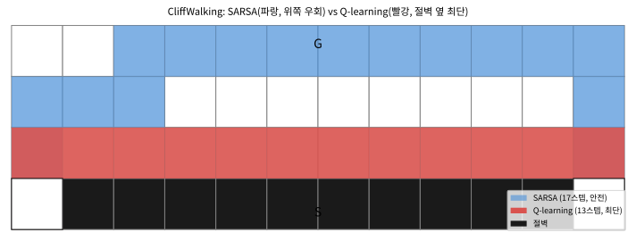

# 6.3 Q-learning과 SARSA·Q-learning 경로 비교

[](https://colab.research.google.com/github/SuminHan/book-ml/blob/main/notebooks/ml2/chapter06_3_q_sarsa_cliffwalk.ipynb)

### 위치: TD(0)는 두 갈래로 갈라진다

6.1절에서 TD(0)는 "한 스텝만 보고, 다음 상태의 **추정치**로 부트스트랩
한다"는 것을 배웠고, 6.2절에서는 그 갱신을 \\(Q(s,a)\\)에 적용한 **SARSA**를
CliffWalking에서 학습시켰다. 그런데 6.2절의 SARSA 갱신식에서 한 가지
의문을 가져야 한다. 다음 행동의 Q값을 **어떤** 행동의 Q값으로 썼는가?

\\[Q(s,a) \leftarrow Q(s,a) + \alpha \left[r + \gamma Q(s',a') -
Q(s,a)\right]\\]

여기서 \\(a'\\)는 **실제로 고른** 다음 행동이었다. 이 "실제로 고른 것"
을 그대로 쓴다는 선택이, 지금 6.3절에서 다루는 갈림길이다. **Q-learning**은
이 한 칸만 다르게 채운다 — 실제로 무엇을 골랐든 상관없이,
**다음 상태에서 최선의 행동**을 가정하고 그 Q값을 목표로 쓴다. 이 한 줄의
차이(\\(Q(s',a')\\) vs \\(\max\_{a'}Q(s',a')\\))가 두 알고리즘을 근본적으로
갈라놓으며, "실제 행동하는 정책의 가치"를 배우느냐("이상적인 최적 정책의
가치"를 배우느냐의 문제)로 이어진다.

### Q-learning: 모델 없이, 최선의 다음 행동을 가정한다

SARSA의 목표값은 실제로 고른 다음 행동 \\(a'\\)의 Q값이었다.
**Q-learning**은 다르게 접근한다 — 실제로 무엇을 골랐든 상관없이,
**항상 다음 상태에서 최선의 행동을 가정**하고 그 Q값을 목표로 쓴다:

\\[Q(s,a) \leftarrow Q(s,a) + \alpha \left[r + \gamma \max\_{a'} Q(s',a') -
Q(s,a)\right]\\]

```python
def q_learning_update(Q, s, a, r, s_next, alpha, gamma):
    max_next_q = max(Q[s_next].values()) if isinstance(Q[s_next], dict) else max(Q[s_next])
    td_error = r + gamma * max_next_q - Q[s][a]
    Q[s][a] += alpha * td_error
    return Q
```

**왜 \\(\max\\)인가 — 두 알고리즘이 같은 경험에서 다른 목표값을 만든다.**
6.2절과 Q-learning의 갱신식은 \\(r + \gamma(\cdots)\\)의 괄호 안 **한
항만** 다르다. 그 차이가 얼마나 근본적인지, **같은 한 스텝**에 대해
두 알고리즘이 각각 어떤 목표값을 계산하는지 숫자로 따라가 보자.

> **손으로 한 스텝**: 상태 \\(s\\)에서 행동 \\(a\\)를 하고 보상
> \\(r=-1\\)을 받아 상태 \\(s'\\)로 이동했다. \\(s'\\)에서는 두 행동
> \\(a\_1, a\_2\\)가 있고 현재 Q값이 \\(Q(s',a\_1)=0\\), \\(Q(s',a\_2)=5\\)
> 이다. 그런데 이 스텝에서 \\(\varepsilon\\)-greedy는 **무작위로
> \\(a\_1\\)**(Q값이 0인 "나쁜" 행동)를 골랐다고 하자.
> \\(\alpha=0.5\\), \\(\gamma=1.0\\), 그리고 갱신 중인
> \\(Q(s,a)=0\\)이라 하자.
>
> - **SARSA**(실제로 고른 \\(a\_1\\)를 쓴다): 목표
>   \\(r + \gamma Q(s',a\_1) = -1 + 1.0 \times 0 = -1\\).
>   갱신: \\(Q(s,a) \leftarrow 0 + 0.5(-1 - 0) = -0.5\\).
> - **Q-learning**(최선 \\(\max=5\\)을 쓴다): 목표
>   \\(r + \gamma \max(0,5) = -1 + 1.0 \times 5 = +4\\).
>   갱신: \\(Q(s,a) \leftarrow 0 + 0.5(4 - 0) = +2.0\\).
>
> **같은 경험**(\\(s, a, r=-1, s'\\), 그리고 \\(s'\\)에서 우연히
> \\(a\_1\\)를 고른 것)에 대해 SARSA는 \\(-0.5\\)로, Q-learning은
> \\(+2.0\\)로 갱신한다. 부호가 **다르다.** 이 차이가 곧 두
> 알고리즘이 "배우는 것"의 차이다 — 6.2절의 CliffWalking에서
> 이 차이가 경로의 모양으로 드러난다.

Q-learning은 행동 정책이 무엇이든(예: \\(\varepsilon\\)-greedy로 무작위
탐험을 섞어도) **목표 정책**(최적 정책)의 가치를 직접 학습한다 —
Chapter 5.3의 언어로 **off-policy**다. \\(Q(s,a)\\)를 알면 최적 정책은
그냥 \\(\pi^\*(s) = \arg\max\_a Q(s,a)\\)로 즉시 얻어진다.

### \\(\max\\) 뒤에 숨은 "낙관적 부트스트래핑"

\\(\max\_{a'}Q(s',a')\\)을 쓰는 것은 단순히 "더 큰 수를 쓰는 것"을
넘어서, **아직 한 번도 고르지 않은 행동의 가치까지 갱신에 끌어들이는
효과**가 있다. 위 손계산에서 \\(a\_2\\)는 이 스텝에서 실제로 고르지
않았는데(\\(a\_1\\)가 고려됨), Q-learning의 목표값에 \\(Q(s',a\_2)=5\\)가
들어갔다. 즉 **다음 상태의 "최선"이라는 가정 하나로, 실제로 겪지 않은
경로의 가치까지 지금 추정치에 반영**하는 것이다.

이 "가정"은 두 날을 가진 칼과 같다:

- **장점 — 탐험을 가속한다.** 아직 시도하지 않은 행동이 "좋은 것
  같으면" 그 가치 \\(Q(s',a')\\)가 높게 부트스트랩되면서,
  \\(\arg\max\_a Q(s,a)\\)가 곧바로 그 행동을 가리키게 되어 탐험이
  자연스레 유도된다. SARSA처럼 "실제로 고른 것"만 갱신하면, 한 번도
  시도하지 않은 행동은 영원히 낮은 Q값에 머물러 탐험이 더디다.
- **단점 — 낙관론(optimism)이 위험을 과소평가할 수 있다.** "다음
  상태에서 최선은 \\(a\_2\\)일 것이다"라는 가정은, 실제로는
  \\(\varepsilon\\)-greedy가 가끔 "나쁜" \\(a\_1\\)를 고를 수 있다는
  현실을 무시한다. 6.3절의 CliffWalking에서 Q-learning이 "절벽 바로
  옆"의 최단 경로를 선호하게 되는 이유가 바로 이 낙관론이다 — "다음
  칸에서는 최선을 고를 테니 위험한 칸 옆을 지나도 된다"는 가정이,
  학습 도중에는 실제로 절벽에 떨어지는 사고로 이어진다.

### on-policy vs off-policy: 같은 데이터, 다른 "배우는 대상"

이 차이를 체계적으로 정리하면, **행동 정책**(behavior policy \\(b\\),
실제로 행동을 고르는 정책)과 **목표 정책**(target policy \\(\pi\\),
가치를 평가/학습하려는 정책)의 관계로 표현된다.

| | 행동 정책 \\(b\\) | 목표 정책 \\(\pi\\) | 갱신에 쓰는 다음 행동 | 이름 |
|---|---|---|---|---|
| **SARSA** | \\(\varepsilon\\)-greedy | **같은** \\(\varepsilon\\)-greedy | 실제로 고른 \\(a'\\) | **on-policy** |
| **Q-learning** | \\(\varepsilon\\)-greedy | **탐욕적**(\\(\varepsilon=0\\)) | \\(\arg\max\_{a'}Q(s',a')\\) | **off-policy** |

핵심: **SARSA는 "내가 지금 이렇게(탐험 포함) 행동할 때"의 가치를
배우고, Q-learning은 "나는 항상 최선만 고를 텐데"라는 이상적 정책의
가치를 배운다.** 행동 정책(\\(b\\))이 목표 정책(\\(\pi\\))과 같은
경우 on-policy, 다른 경우 off-policy다.

**왜 중요도 샘플링이 필요 없는가 — 5.3절과의 연결.** Chapter 5.3에서
off-policy MC는 행동 정책과 목표 정책의 리턴 분포가 다르므로 중요도
가중치 \\(\rho = \prod\_t \pi(a\_t|s\_t)/b(a\_t|s\_t)\\)로 보정해야 한다고
배웠다. 그런데 Q-learning은 off-policy임에도 **중요도 샘플링을 쓰지
않는다.** 이유는, Q-learning이 "목표 정책의 **리턴 분포**를 샘플로
추정"하는 것이 아니라, **벨만 최적방정식의 고정점**을 샘플로
근사하기 때문이다. \\(\max\_{a'}Q(s',a')\\)라는 목표값 자체가
"목표(탐욕적) 정책이었다면 다음에 이렇게 갔을 것"을 **직접**
부트스트랩하므로, 행동 정책이 실제로 어떻게 움직였는지에 대한
보정(가중치)이 구조적으로 불필요해진다. MC는 "리턴을 평균"해야 하므로
보정이 필요했던 반면, TD는 "한 스텝 목표값"을 쓰므로 보정이 필요하지
않는 것이다 — 같은 off-policy 문제를, 분포 보정(중요도 샘플링)과
고정점 근사(부트스트래핑)라는 **두 개의 전혀 다른 도구**로 푸는
것이다. 이것이 Chapter 9(DQN)에서 경험재현 버퍼(과거에 다른 정책이
모은 데이터를 재사용)를 자유롭게 쓸 수 있는 이유이기도 하다.

### 실습: SARSA와 Q-learning이 CliffWalking에서 배우는 경로 비교하기

CliffWalking 환경 — 시작점에서 목표까지 가는 길 바로 옆에 떨어지면
큰 벌점(-100)을 받고 출발점으로 되돌아가는 절벽이 있는 격자 — 에서
SARSA와 Q-learning을 각각 500 에피소드(\\(\alpha=0.5\\),
\\(\gamma=1.0\\), \\(\varepsilon=0.1\\)) 학습시키면(스크래치패드에서
실행 검증):

```
학습 중(탐험 포함) 마지막 100 에피소드 평균 리턴:
  SARSA:       -31.46
  Q-learning:  -53.33

학습 후 탐욕적으로(더 이상 탐험 없이) 실행했을 때의 리턴:
  SARSA가 배운 정책:      -17.0
  Q-learning이 배운 정책:  -13.0
```

학습이 끝난 두 정책을 **탐욕적으로**(더 이상 무작위 탐험 없이
\\(\pi(s)=\arg\max\_a Q(s,a)\\)) 실행했을 때, 각자가 실제로 밟은
경로를 격자에 그어보면(아래 그림, 노트북 `chapter06_3_q_sarsa_cliffwalk`에서 재현):



두 숫자를 각각 다른 방향으로 읽어야 한다:

- **학습 후 탐욕적 실행(-17 vs -13)**: Q-learning이 배운 정책이 절벽
  바로 옆을 스치는 **더 짧은** 경로를 찾았다 — 목표 정책(탐욕적)
  관점에서는 이게 진짜 최적이기 때문이다. 그림에서 Q-learning의
  빨강 경로는 절벽(검정) 바로 위를 13스텝으로 지나지만, SARSA의 파랑
  경로는 절벽에서 한 칸 이상 떨어질 정도로 위쪽으로 올라가 17스텝을
  걸어서 간다. **목표(탐욕적) 정책**으로만 본다면, Q-learning의
  13스텝이 진짜 최단이다.
- **학습 중 평균 리턴(-31 vs -53)**: 그런데 학습 도중에는(여전히
  \\(\varepsilon\\)-greedy로 가끔 무작위 행동이 섞이는 상황에서는)
  오히려 **SARSA가 더 좋은 성적**을 낸다 — Q-learning이 배우려는
  "절벽 바로 옆 최단 경로"는 탐험으로 인한 무작위 행동 한 번이 바로
  절벽 추락(-100)으로 이어지는 위험한 경로이기 때문이다. SARSA는
  **자신이 실제로 행동하는 방식**(탐험 포함)까지 감안해서 가치를
  매기므로, 그 위험을 자연스럽게 피하는 경로를 선호하게 된다.
  같은 \\(\varepsilon=0.1\\)의 탐험이어도, "절벽 옆을 스치는
  경로"를 걷는 동안에는 무작위 행동이 절벽으로 빠질 **확률**이
  "위쪽을 우회하는 경로"를 걷는 동안보다 훨씬 높으므로, 학습
  도중의 평균 리턴은 SARSA가 유리하다.

**Q-learning은 "이상적으로 항상 최선을 다한다면"이라는 가정 아래 최적
경로를 찾고, SARSA는 "실제로 가끔 실수(탐험)할 수 있다"는 현실을 감안한
경로를 찾는다** — 어느 쪽이 "더 낫다"가 아니라, 애초에 답하는 질문이
다르다는 것이 이 실습이 보여주는 핵심이다. 실전에서는 "학습 도중에도
안전이 중요한가"(로봇 제어처럼 실제 사고가 나면 안 되는 경우 SARSA
계열 선호), "학습은 시뮬레이터에서 안전하게 하고 최종 배포만
최적이면 되는가"(Q-learning도 무방)에 따라 선택이 갈린다.

**학습 도중 리턴의 격차(-31 vs -53)가 "학습이 잘 되고 있다"는
지표로 쓰이지 않기를.** 이 격차는 두 알고리즘이 **다른 정책을
평가하고 있기 때문**이지, Q-learning이 더 "나쁘게" 학습하고 있어서
가 아니다. 오히려 최종(탐욕적) 리턴에서는 Q-learning이 앞선다.
off-policy 학습을 모니터링할 때는 "학습 도중의 행동 리턴"이 아니라
**목표 정책으로 평가한 리턴**(\\(\varepsilon=0\\) 롤아웃, 또는
별개의 평가 정책의 리턴)을 보라는 교훈이다 — 이 "평가 정책과
학습 정책을 분리해서 보는" 습관이 Chapter 9(DQN)과 Chapter 11(PPO)
의 학습 곡선 읽기로 이어진다.

### \\(\varepsilon\\)을 줄여가며 학습하기: 탐험에서 착취로

5.2절의 MC 제어에서 \\(\varepsilon\\)를 에피소드가 진행됨에 따라
줄여가며 학습하는(\\(\varepsilon\\)-decay) 것을 보았다. Q-learning에
서도 이 decay가 같은 역할을 한다. \\(\varepsilon\\)를 처음엔 크고
(탐험을 많이) 나중에 0으로(착취, exploitation) 줄이면:

- **학습 초반**(\\(\varepsilon\\) 큼): 거의 모든 행동이 시도되므로
  \\(Q\\)값들이 충분히 방문되어 \\(\max\_{a'}Q(s',a')\\)가 믿을 만한
  값이 된다. 수렴 조건(아래 "왜 수렴하는가")의 "모든 (상태,행동)
  쌍이 무한히 방문"을 실질적으로 만족시킨다.
- **학습 후반**(\\(\varepsilon \to 0\\)): 행동이 거의 탐욕적이므로
  학습 도중의 리턴이 최종 성능을 반영하게 된다. Q-learning은 이
  시점에서 "절벽 옆 최단 경로"를 안정적으로 학습한다.

반면 \\(\varepsilon\\)를 줄이지 않고 0.1로 고정하면, SARSA가
"탐험이 영원히 섞인" 정책의 가치를 계속 갱신하므로 **절벽을 피하는
경로에 머물러** 있고, Q-learning은 "탐험이 조금씩 섞이더라도
최선을 고를 테니"라는 낙관론으로 절벽 옆을 스치는 경로를 학습하는
것이다. decay의 유무는 "배우는 정책"에 따라 **배운 경로의 모양**
까지 바꾼다는 점이 이 환경에서 극명하게 드러난다.

### 자주 하는 실수

- **\\(\max\\)을 `Q[s_next][a_next]`로 써서 "Q-learning"을
  쓴다고 생각한다.** \\(\max\_{a'}Q(s',a')\\)에서 \\(\max\\)은
  **다음 상태 \\(s'\\)의 모든 행동 \\(a'\\)에 대한 최대**이지,
  실제로 고른 \\(a'\\)의 값이 아니다. 실제로 고른 \\(a'\\)의 값을
  쓰면 그것이 SARSA다. 코드로 치면
  `target = r + gamma*max(Q[ns])` (Q-learning) vs
  `target = r + gamma*Q[ns][na]` (SARSA) — **`max()`의 유무**가
  두 알고리즘을 가르는 전부다. `na`를 `max` 안에 잘못 넣거나
  빼먹는 실수가 두 알고리즘을 "혼합"시켜, 둘 다 아닌 이상한
  정책(보통 절벽을 피하지도, 최단 길로도 가지 않는 어중간한 경로)을
  만든다.
- **터미널 상태에서 \\(\max\\)을 계산한다.** 목표(종료) 상태에서는
  다음 상태가 없으므로 \\(\max\_{a'}Q(s',a')\\)는 **0**이어야 한다.
  목표 상태의 Q값이 0이 아닌 채로(예: 초기값 0이 아니라 이전
  에피소드에서 갱신된 값) `max(Q[goal])`를 쓰면, 목표에서 "한 번
  더" 갱신되어 Q값이 0에서 벗어나 **리턴이 실제로는 존재하지 않는
  미래 보상까지 더하는** 오차가 생긴다. 항상
  `max_next_q = max(Q[ns]) if not done else 0.0`처럼
  `done` 플래그로 0을 강제해야 한다. 위 `q_learning_update`가
  `max_next_q`를 0으로 강제해야 하는 조건(`s_next`가 터미널인 경우)을
  코드로 옮겨 적어라.
- **"Q-learning이 항상 더 낫다"고 배운다.** 6.3절의 핵심이
  **두 알고리즘이 다른 질문(목표 정책 vs 행동 정책)에 답한다**는
  것이므로, "Q-learning이 SARSA보다 좋다"는 진술은 애초에
  성립하지 않는다. 학습 도중의 안전이 중요한 환경(로봇 제어)에서는
  SARSA가, 시뮬레이터에서 학습한 뒤 최종 성능만 중요한 환경에서는
  Q-learning이 유리하다. "어느 쪽이 좋다"가 아니라 **"어떤
  질문을 하고 있는가"**를 먼저 물어야 한다.
- **학습 도중 리턴(-31 vs -53)을 "학습 품질"로 해석한다.** 위
  실습의 -31/-53은 **행동 정책(\\(\varepsilon\\)-greedy)의 리턴**이지
  **목표 정책의 리턴**이 아니다. Q-learning이 "더 나쁘게" 학습한
  것이 아니라, "더 위험한(그러나 최종적으로는 더 짧은) 경로"를
  탐험하며 배우는 과정에서 중간 성적이 나빠진 것이다. 학습 품질을
  판단하려면 **탐욕적(\\(\varepsilon=0\\)) 롤아웃**의 리턴을 봐야
  한다 — 그곳에서는 Q-learning(-13)이 SARSA(-17)보다 낫다.

### 확인 문제

1. 6.2절의 SARSA 갱신식
   \\(Q(s,a)\leftarrow Q(s,a)+\alpha[r+\gamma Q(s',a')-Q(s,a)]\\)와
   Q-learning 갱신식
   \\(Q(s,a)\leftarrow Q(s,a)+\alpha[r+\gamma\max\_{a'}Q(s',a')-Q(s,a)]\\)
   중, 다음 중 **SARSA**에 해당하는 코드를 골라라: (a) `Q[s][a] +=
   alpha*(r + gamma*Q[ns][na] - Q[s][a])` (b) `Q[s][a] +=
   alpha*(r + gamma*max(Q[ns]) - Q[s][a])`.
   고른 답에 대해, 이것이 on-policy인지 off-policy인지
   `na`(실제로 고른 다음 행동)가 목표값에 포함되는지를 근거로
   설명하라.

2. 위 "손으로 한 스텝" 예에서, 만약 \\(Q(s',a\_1)=0\\),
   \\(Q(s',a\_2)=5\\) 대신 **\\(Q(s',a\_1)=Q(s',a\_2)=3\\)**(두
   행동의 Q값이 같음)였다면, SARSA와 Q-learning은 같은 목표값을
   계산하는가? 같은 경험을 받았을 때 두 갱신식의 차이가
   \\(Q(s',\cdot)\\)의 값 분포에 따라 어떻게 달라지는지
   설명하라. (힌트: \\(\max\\)가 "실제로 고른 것"과 언제
   일치하고 언제 다른가.)

3. 6.3절의 CliffWalking에서 \\(\varepsilon=0\\)(탐험 없음)로
   고정하고 학습시켰다면, SARSA와 Q-learning이 배운 경로는
   같은가? 이유를, "행동 정책 = 목표 정책"인 경우
   on-policy/off-policy의 차이가 소멸한다는 관점에서 설명하라.
   (힌트: \\(\varepsilon=0\\)이면 "실제로 고른 \\(a'\\)"와
   "\\(\arg\max\_{a'}Q(s',a')\\)"이 언제나 같은 행동이 된다.)

### 역사: 이 이름들이 붙은 경로

**Q-learning**은 1989년 크리스 왓킨스(Chris Watkins)의 박사
논문에서 제안됐다. 왓킨스는 "Q"가 행동가치함수
\\(Q(s,a)\\)(어원: **Q**uality, "상태-행동 쌍의 품질")에서
온 것으로, "Q-함수를 샘플만으로 학습하는" 알고리즘이었다.
**SARSA**(State-Action-Reward-State-Action)는 왓킨스의
Q-learning에 대해 "목표값에 \\(\max\\)을 쓰지 말고 **실제로
고른 다음 행동**의 Q값을 쓰자"는 단순한 수정에서 온 것으로,
이름 자체가 갱신에 필요한 다섯 요소(현재 **S**tate, **A**ction,
**R**eward, 다음 **S**tate, 다음 **A**ction)를 그대로
나열한 것이다 — 6.2절에서 이미 짚었다.

흥미로운 점은 **두 알고리즘의 "이름 붙이기" 자체가 이
차이를 요약**한다는 것이다. Q-learning은 "Q-함수를
(모델 없이) 학습한다"는 **무엇을** 배움에 초점을 두고,
SARSA는 "S-A-R-S-A(행동을 실제로 따름)로 갱신한다"는
**어떻게** 갱신하는가에 초점을 둔다. 같은 TD(0)의 뼈대 위에,
"목표값에 \\(\max\\)을 넣느냐/넣지 않느냐" 한 줄이
**off-policy(이상적) / on-policy(현실)**라는 강화학습을
지배하는 가장 근본적인 축을 만들어낸 것 — 이후 DQN(Chapter
9, off-policy)·정책기반(PPO 등, Chapter 11)·Actor-Critic
(온/오프를 혼용)까지, "행동 정책 vs 목표 정책"이라는 이
분류가 다시 등장한다.

### 자주 묻는 질문

**Q. 학습 후 ε를 0으로 낮추면 SARSA도 결국 짧은 길을 택하게
되나요?** 아니다 — SARSA가 학습한 Q값 자체가 "탐험이 있는 상황"을
전제로 계산된 값이라서, 그 Q값 기준으로 탐욕적으로 행동해도 여전히
안전한(먼) 경로를 선호하는 정책이 나온다. Q값을 다시 학습시키지
않는 한, ε를 실행 시점에만 낮춘다고 해서 저장된 Q값 자체가 바뀌지는
않는다.

**Q. 두 알고리즘 중 하나를 실전에서 골라야 한다면 어떤 기준으로
고르나요?** 학습 자체가 실제 위험한 환경에서 일어나는가(로봇이
실제로 넘어지거나 다칠 수 있는 상황)를 먼저 물어야 한다 — 그렇다면
학습 도중의 안전까지 고려하는 SARSA류가 유리하다. 반대로 시뮬레이터
안에서 안전하게 충분히 학습한 뒤 실제 배포 시에는 최적의 성능만
필요하다면, Q-learning처럼 목표 정책 자체의 최적성을 직접 학습하는
off-policy 방법이 유리하다.

**Q. Q-learning의 \\(\max\\)는 "다음 상태의 모든 행동"에 대한
것인데, 행동이 연속이거나 매우 많으면 어떻게 되나요?** 이 강의의
Table Q-러닝(행동을 이산적으로 열거하는 \\(Q(s,a)\\) 표)에서는
\\(\max\\)이 유한한 표에서 최대를 찾는 단순 연산이다. 행동 공간이
연속적(예: 로봇의 각도·속도)이거나 매우 크면, 표 자체가 불가능해져
**함수 근사**(Chapter 9의 DQN)로 넘어가야 하며, 이때도
\\(\max\_a Q(s',a)\\)는 "함수 \\(Q(s',a)\\)를 행동 \\(a\\)로
관해 최대화"로 일반화된다 — 원리는 같고, "표에서 max"가
"최대화(optimization)"로 바뀐다.

**Q. SARSA와 Q-learning 둘 다 수렴하나요, 하나만 수렴하나요?**
둘 다, **같은** 조건(모든 (상태,행동) 쌍이 무한히 방문되고
\\(\alpha\\)가 Robbins-Monro 조건을 만족)이면 수렴한다. 다만
**수렴하는 값이 다르다.** Q-learning은 \\(Q^\*\\)(최적 행동가치)로
수렴하지만, SARSA는 **\\(\varepsilon\\)-greedy 행동 정책 자체의
\\(Q^{\pi}\\)(그 정책의 행동가치함수)**로 수렴한다. "수렴한다"는
말의 대상(어떤 고정점)이 다르므로, "둘 다 수렴"이라 해도 도달하는
지점이 다르다 — 6.3절의 "다른 질문"이 수렴의 결과값으로도 나타난다.

### 왜 Q-learning이 수렴하는가(직관)

Chapter 4.3에서 확인했듯이 \\(Q^\*(s,a)\\)는 유한한 MDP라면 반드시
존재하고 유일한 숫자다(벨만 최적방정식, 바나흐 고정점 정리). Q-learning은
그 목표를 직접 계산하지 않고, 샘플 기반 업데이트만으로 근사하는데도
정확히 그 값에 도달한다는 것이 증명돼 있다: **충분히 모든 상태-행동
쌍을 무한히 방문하고 학습률 \\(\alpha\\)를 적절히 줄여나가면** 참값
\\(Q^\*(s,a)\\)로 수렴한다(Robbins-Monro 조건). 직관적으로는: TD 오차가
0이 되는 지점이 정확히 벨만 최적방정식을 만족하는 지점이므로, TD 오차를
계속 줄여나가는 이 업데이트는 결국 그 고정점으로 수렴하게 된다.

> **SARSA의 수렴 직감도 똑같이 된다** — 다만 고정점이
> \\(Q^\*\\)가 아니라 **\\(\varepsilon\\)-greedy 정책의
> \\(Q^{\pi}\\)**다. SARSA의 TD 오차가 0이 되는 지점은
> \\(Q(s,a)=r+\gamma\\,E\_{a'\sim b}[Q(s',a')]\\)(행동 정책
> \\(b\\)의 다음 행동에 대한 **기대**, \\(\max\\)이 아님)를
> 만족하는 지점이고, 이는 그 행동 정책의 벨만 **기대**방정식이다.
> "TD 오차 0 = 해당 고정점"이라는 같은 논리가, \\(\max\\)(Q-learning)
> vs **기대**(SARSA)라는 목표값의 차이에 따라 **다른 고정점**(최적
> vs 정책특정)으로 귀결되는 것이다.

**시간차 학습은 몬테카를로의 "모델이 필요 없다"는 장점과, 동적계획법의
"한 스텝만 보고도 갱신한다"는 장점을 하나로 합친 것이다 — 그리고
Q-learning과 SARSA의 차이는, 똑같은 부트스트래핑 아이디어를 "이상적인
목표 정책"에 적용하느냐 "실제 행동 정책"에 적용하느냐라는, 아주 작지만
결과는 크게 갈리는 선택에서 나온다.**

---

## 연습문제

**1. (코딩)** 다음과 같은 함수 `q_learning_train`을 완성하라(핵심 줄은
빈칸으로 남겨져 있다고 가정):

```python
import random

def epsilon_greedy(Q, s, epsilon, n_actions):
    if random.random() < epsilon:
        return random.randrange(n_actions)
    return max(range(n_actions), key=lambda a: Q[s][a])

def q_learning_train(transition, n_states, n_actions, n_episodes, alpha, gamma, epsilon):
    Q = [[0.0] * n_actions for _ in range(n_states)]
    for episode in range(n_episodes):
        s = 0  # 매 에피소드는 state 0에서 시작한다고 가정
        for _ in range(20):  # 에피소드 최대 길이
            # ADD ADDITIONAL CODE HERE!!
            # 1. epsilon_greedy로 행동 a 선택
            # 2. transition(s, a)로 보상 r과 다음 상태 s_next 얻기
            # 3. Q-learning 업데이트 규칙 적용
            # 4. s_next가 터미널 상태(-1로 표시)면 에피소드 종료, 아니면 s = s_next
            if s_next == -1:
                break
            s = s_next
    return Q
```

**2. (개념 서술)** 6.3절의 절벽 걷기 예제에서, 만약 학습이 끝난 뒤
\\(\varepsilon\\)을 0으로 낮춰서(더 이상 탐험하지 않고) SARSA가 배운
정책을 실행한다면, 그래도 여전히 먼 길로 돌아갈지, 아니면 짧은 길을
택하게 될지 예측하고 이유를 설명하라. (힌트: SARSA가 학습한 Q값
자체는 "탐험이 있는 상황"을 가정하고 계산된 값이라는 점을 생각하라.)

**3. (손유도, Tier A — 자유 유도)** Q-learning의 업데이트
\\(Q(s,a) \leftarrow Q(s,a) + \alpha[r + \gamma \max\_{a'} Q(s',a') -
Q(s,a)]\\)가 참값 \\(Q^\*(s,a)\\)로 수렴하기 위해 필요한 조건을 다음
세 가지로 나눠 논증하라: (1) TD 오차가 정확히 0이 되는 \\(Q\\)가 벨만
최적방정식 \\(Q^\*(s,a) = R(s,a) + \gamma \max\_{a'} Q^\*(s',a')\\)의
해와 같다는 것(단순 대수적 정리). (2) \\(\alpha\\)가 너무 크면(예:
항상 \\(\alpha=1\\)) 왜 수렴이 불안정해지는지(Chapter 2의 증분 평균
갱신과 연결지어). (3) 모든 상태-행동 쌍이 **무한히 많이 방문돼야**
수렴이 보장되는 이유(ε-greedy 탐험이 없다면 어떤 상태-행동 쌍은 영원히
시도되지 않을 수 있다는 점과 연결지어).

**정확성 확인**: 위 세 가지 논증이 각각 Q-learning 알고리즘의 어느
부분(TD 오차 계산, `alpha` 파라미터, `epsilon_greedy` 함수)에
대응하는지 짝지어라.
