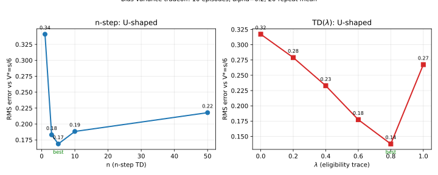
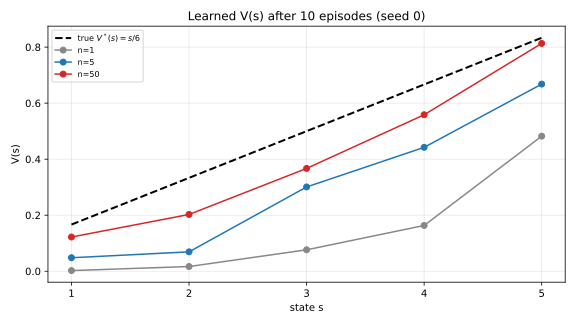

# 7.2 적격흔적과 파라미터 튜닝 실습

[](https://colab.research.google.com/github/SuminHan/book-ml/blob/main/notebooks/ml2/chapter07_2_eligibility_trace_tuning.ipynb)

7.1절에서 n-step TD는 MC와 TD(0) 사이의 "몇 스텝을 실제로 볼 것인가"라는
다이얼이라고 했다. 그런데 실전에서는 그 다이얼의 위치(\\(n\\)을 몇으로
잡을지)를 직감으로 고를 수 없다 — "어느 지점이 좋은가"를 데이터로 확인해야
하는 **하이퍼파라미터**다. 이 절에서는 두 가지를 실제로 해본다.

첫째, random walk 환경에서 \\(n\\)을(7.1의 다이얼) 바꿔가며, 그리고 이번
절의 주인공인 \\(\lambda\\)를(아래 소개할 적격흔적의 다이얼) 바꿔가며,
어느 지점에서 가치 추정이 가장 정확한지 **20회 반복 평균**으로 확인하는
"파라미터 튜닝 실습"이다. 둘 다 결국 U자 모양 곡선으로 수렴할 것이고, 그
U자 꼭짓점이 "이 문제·이 데이터양에서의 좋은 하이퍼파라미터"를 알려준다.

둘째, \\(n\\) 하나를 고정하는 대신 **모든 \\(n\\)을 동시에** 처리하는
**적격흔적**(eligibility trace)[^sarl][^suttonbarto]이라는 기법을 배운다. 적격흔적은
"이 상태가 최근에 얼마나 자주, 얼마나 최근에 방문됐는가"를 기록한 흔적
\\(e(s)\\)를 이용해, TD 오차가 발생할 때마다 그 흔적의 크기에 비례해
**모든 상태를 동시에** 갱신한다. 그러면 굳이 \\(n\\)을 하나로 고를 필요가
없어지고, 대신 "과거 방문을 얼마나 오래 기억할 것인가"를 결정하는
\\(\lambda \in [0,1]\\)라는 새 다이얼 하나만 잡으면 된다. 결국 이 절의
주제는 하나다 — **편향-분산 트레이드오프(Chapter 4.1)를 "구체적인 숫자"
로 만나는 방법**.

### 실습: n을 바꿔가며 random walk에서 최적 지점 찾기

7.1절에서 "\\(n\\)이 커지면 편향은 줄고 분산은 커진다"고 했는데,
실제로 이게 "적당한 \\(n\\)이 극단보다 낫다"는 결과로 이어지는지
확인해보자. 7개의 상태(0~6, 0과 6은 종료 상태)가 일렬로 늘어선 표준
"random walk" 환경[^suttonbarto] — 매 스텝 왼쪽/오른쪽으로 50:50 무작위 이동하고,
오른쪽 끝(6)에 도달하면 보상 +1, 왼쪽 끝(0)에 도달하면 보상 0 —
에서는 참값 \\(V(s) = s/6\\)이 정확히 알려져 있다(예:
\\(V(3)=0.5\\)). 이 참값과, `n_step_td`로 짧게(10 에피소드) 학습한
추정치 사이의 오차(RMS)를 \\(n\\)별로 비교하면(스크래치패드에서 20회
반복 평균으로 검증):

```
n=1:  평균 RMS 오차 = 0.3410
n=3:  평균 RMS 오차 = 0.1830
n=5:  평균 RMS 오차 = 0.1687   <- 최적
n=10: 평균 RMS 오차 = 0.1883
n=50: 평균 RMS 오차 = 0.2178
```

오차가 \\(n\\)에 대해 **U자 모양**으로 나타난다 — 양 극단(\\(n=1\\),
\\(n=50\\))보다 중간 어딘가(\\(n=5\\))가 가장 낮은 오차를 보인다.
\\(n=1\\)(TD(0))은 매 스텝 즉시 갱신하지만 추정치에 크게 의존해서
(편향), 겨우 10 에피소드로는 그 편향을 다 씻어낼 시간이 부족하다.
\\(n=50\\)(사실상 MC에 가깝다, 에피소드 길이가 보통 그보다 짧으므로)은
편향은 없지만 각 갱신에 담긴 무작위성(분산)이 너무 커서, 적은
에피소드로는 오히려 불안정하다. 그 사이 어딘가(\\(n=5\\))가 이번
실험에서는 최적이었다 — 실전에서 \\(n\\)을 몇으로 잡을지는 이렇게
데이터로 확인해야 하는 하이퍼파라미터라는 것을, Chapter 4.1의
편향-분산 트레이드오프가 여기서 U자 곡선이라는 구체적인 숫자로 다시
확인되는 셈이다. 이 표는 아래 그림의 **왼쪽 패널**을 그대로 그린
것이다.

### 적격흔적: 모든 n을 동시에

n-step TD는 매번 \\(n\\)을 하나로 고정해야 한다. **적격흔적**
(eligibility trace)은 다른 접근을 쓴다 — 모든 상태에 "최근에 얼마나
자주, 얼마나 최근에 방문했는가"를 나타내는 흔적 \\(e(s)\\)를 붙여두고,
TD 오차가 발생할 때마다 **그 흔적의 크기에 비례해서 모든 상태를 동시에**
갱신한다:

\\[e(s) \leftarrow \gamma\lambda \\, e(s) + \mathbb{1}[s = s\_t], \qquad
V(s) \leftarrow V(s) + \alpha \\, \delta\_t \\, e(s) \\; \text{(모든 } s \text{에 대해)}\\]

\\(\lambda \in [0,1]\\)이 새로운 다이얼이다 — \\(\lambda=0\\)이면 흔적이
매 스텝 거의 사라져서 TD(0)와 같아지고, \\(\lambda=1\\)이면 흔적이
전혀 안 줄어들어 몬테카를로에 가까워진다. **TD(\\(\lambda\\))**라는
이름은 정확히 이 다이얼에서 왔다 — n-step TD가 "\\(n\\) 하나를 고정해서
전방(forward)으로 내다보는" 방식이라면, 적격흔적은 "과거 방문 이력에
흔적을 남겨서 후방(backward)으로 갱신을 퍼뜨리는" 방식으로 사실상 같은
효과를 낸다는 것이 알려져 있다(전방 관점과 후방 관점의 등가성 — 자세한
증명은 이 학기 범위를 넘는다).

이름이 생소해 보이지만, 기원은 1980년대 초로 거슬러 올라간다. Barto,
Sutton, Anderson가 1983~89년에 발표한 논문에서, ADALINE(최소제곱학습기)
에 "그 시점에 학습에 **자격**(eligibility)이 있는 시냅스가 어디인가"를
기록하는 장치로 eligibility trace를 처음 도입했다 — 강화학습의
TD(\\(\lambda\\))가 아니라, "어떤 시냅스가 지금 보상을 받을 자격이 있는가"
를 묻던 신경망의 부가장치였던 셈이다. 그 아이디어가 "어떤 **상태**가 지금
TD 오차에 기여할 자격이 있는가"로 옮겨온 것이 지금의 적격흔적이다.

### 흔적이 실제로 "어떻게" 모든 상태를 동시에 갱신하는가

수식만 보면 추상적이다. 아주 작은 예로 구체화해보자. 같은 random walk
환경에서, 한 에피소드 안에서 에이전트가 상태 \\(3 \to 2 \to 3 \to 4\\)
순서로 방문했다고 하자(보상은 중간 상태라 전부 0). \\(\gamma=1\\),
\\(\lambda=0.5\\), \\(\alpha=0.1\\), 모든 \\(V\\)와 \\(e\\)가 0에서
시작한다고 한다. 편의상 각 스텝의 TD 오차 \\(\delta\_t\\)가 이미 계산
됐다고 놓고, **오직 흔적 \\(e\\)가 어떻게 변하고, 그 흔적이 \\(V\\)
갱신에 어떻게 쓰이는가**만 따라간다(갱신 순서는 위 수식과 동일: 먼저
\\(\gamma\lambda\\)로 감쇠, 현재 상태에 \\(+1\\), 그리고 모든 \\(s\\)에
\\(V(s) \mathrel{+}= \alpha\\,\delta\_t\\,e(s)\\)).

| 스텝 \\(t\\) | 현재 상태 \\(s\_t\\) | 감쇠 후 +현재 상태에 +1 한 \\(e(1..4)\\) | \\(\delta\_t\\) | 이번 스텝에 \\(V\\)가 갱신된 상태들 |
|---|---|---|---|---|
| 0 | 3 | \\(e(3)=1\\) | +0.4 | \\(V(3)\mathrel{+}=0.1\cdot0.4\cdot1=+0.040\\) |
| 1 | 2 | \\(e(2)=1,\ e(3)=0.5\\) | +0.3 | \\(V(2)\mathrel{+}=0.1\cdot0.3\cdot1=+0.030\\), \\(V(3)\mathrel{+}=0.1\cdot0.3\cdot0.5=+0.015\\) |
| 2 | 3 | \\(e(2)=0.5,\ e(3)=1.25\\) | +0.5 | \\(V(2)\mathrel{+}=0.1\cdot0.5\cdot0.5=+0.025\\), \\(V(3)\mathrel{+}=0.1\cdot0.5\cdot1.25=+0.0625\\) |
| 3 | 4 | \\(e(2)=0.25,\ e(3)=0.625,\ e(4)=1\\) | +0.2 | \\(V(2)\mathrel{+}=+0.005\\), \\(V(3)\mathrel{+}=+0.0125\\), \\(V(4)\mathrel{+}=0.1\cdot0.2\cdot1=+0.020\\) |

마지막 스텝(\\(t=3\\), 상태 4에서)을 주목하라. **하나의** TD 오차
\\(\delta\_3=0.2\\)가 동시에 **세 개**의 상태(2, 3, 4)를 갱신했다 —
현재 상태(4, 흔적 1)가 가장 크게, 직전 상태(3, 흔적 0.625)가 그다음,
한 번 더 지난 상태(2, 흔적 0.25)가 가장 작게. 이것이 "후방으로 크레딧을
퍼뜨린다"는 뜻이다. 또 상태 3은 이 에피소드에서 **두 번** 방문됐기 때문에
그 흔적이 계속 쌓여(\\(t=2\\)에서 1.25까지), 다른 상태보다 전체적으로 더
많은 \\(V\\) 갱신을 받는다 — "얼마나 **자주**, 얼마나 **최근**에" 방문했는
가라는 \\(e(s)\\)의 두 가지 역할이 숫자로 드러나는 순간이다. \\(\lambda=0.5\\)
라 흔적이 대략 1~2 스텝 전까지만 기억되는 편이라, 멀리 뒤(상태 2보다 앞)의
방문은 거의 영향이 없다. \\(\lambda\\)를 0.9로 올리면 이 기억이 훨씬
길어진다.

### \\(\lambda\\)가 \\(n\\)을 어떻게 "대체"하는가

n-step TD의 목표값 \\(G\_t^{(n)}\\)은 "정확히 \\(n\\) 스텝만 보고 나머지는
추정치"라는 **단 하나의** n-step 리턴이다. 적격흔적은 이걸 한 번에
모두 섞는다. 흔적의 감쇠율 \\(\gamma\lambda\\) 덕분에, \\(t\\) 스텝 전에
방문한 상태의 흔적은 대략 \\((\gamma\lambda)^t\\)로 줄어든다. 결과적으로
TD(\\(\lambda\\))가 만들어내는 목표값은, 1-step, 2-step, 3-step, … 리턴을
**모두** 가중평균한 것과 같은 효과를 내며, 여기서 짧은 \\(n\\)(짧게
내다본 갱신)에 붙는 가중치와 긴 \\(n\\)(멀리 내다본 갱신)에 붙는 가중치의
비율이 대략 \\(\lambda^{n-1}\\) 비율의 **기하급수**로 결정된다. 즉

\\[
\text{TD(}\lambda\text{)의 목표} \\;\approx\\; \text{"모든 } n \text{-step 목표의
가중평균, } n\text{에 대한 가중치} \propto \lambda^{\\,n-1}"
\\]

이 한 줄이 "모든 \\(n\\)을 동시에"라는 이름의 실체다. \\(\lambda\\)가
**작으면** 가중치가 빠르게 \\(\lambda^{n-1}\\)로 죽어서 실질적으로 짧은
\\(n\\)(TD(0) 쪽)만 쓰고, \\(\lambda\\)가 **크면** 긴 \\(n\\)에도
충분한 가중치가 가서 실질적으로 MC 쪽으로 옮겨간다. \\(n\\)-step이
"하나의 \\(n\\)을 고르는" 문제였다면, TD(\\(\lambda\\))는 "가중치
분포 \\(\lambda^{n-1}\\)의 형태"를 \\(\lambda\\) 하나로 조절하는 문제로
바뀌는 것이다. 같은 편향-분산 트레이드오프를, 하나를 고르는 문제에서
분포의 형태를 고르는 문제로 승화시킨 것.

### 실습: λ를 바꿔가며 최적 지점 찾기

이제 \\(\lambda\\)도 하이퍼파라미터이므로, \\(n\\)을 쓸 때와 똑같이
데이터로 고른다. 같은 random walk 환경, 같은 10 에피소드, \\(\alpha=0.2\\),
\\(\gamma=1\\)으로, \\(\lambda\\)를 0부터 1까지 바꿔가며 20회 반복
평균한 RMS 오차:

```
λ=0.0:  평균 RMS 오차 = 0.3172   (TD(0)와 동일)
λ=0.2:  평균 RMS 오차 = 0.2790
λ=0.4:  평균 RMS 오차 = 0.2329
λ=0.6:  평균 RMS 오차 = 0.1774
λ=0.8:  평균 RMS 오차 = 0.1377   <- 최적
λ=1.0:  평균 RMS 오차 = 0.2674   (사실상 MC)
```

다시 **U자**다. 좌측 극단 \\(\lambda=0\\)은 정확히 TD(0)라(\\(n=1\\)의
\\(\alpha=0.2\\) 결과와 같은 0.3172) 편향이 커서 10 에피소드로는
씻어내지 못하고, 우측 극단 \\(\lambda=1\\)은 MC에 가까워서 분산이
커진다. 그 사이 \\(\lambda=0.8\\)이 이번 실험에서 최저였다. 핵심은
"\\(\lambda=0.8\\)이 만능 정답"이라는 게 **아니다** — 환경이 바뀌거나
에피소드 수가 늘어나면(예: 1000 에피소드) U자의 바닥은 완전히 다른
위치로 이동한다. 에피소드가 충분히 많으면 편향이 충분히 씻겨져 나와
\\(\lambda\\)를 1에 가깝게(MC에 가깝게) 가져가도 좋은 경우가 많다.
**"데이터로 고르는" 것 자체가 방법**이라는 점, 즉 하이퍼파라미터를
고정값으로 외우는 것이 아니라 검증 데이터·반복 실험으로 매번 재확인
하는 습관이 실전의 본체다.



두 패널이 나란히 있으니 메시지가 선명하다. **\\(n\\)을 고르는 일과
\\(\lambda\\)를 고르는 일은 같은 편향-분산 트레이드오프의 두 모습**이며,
둘 다 U자다. 그래서 "n=5"와 "λ=0.8"는 서로 다른 문제를 푸는 게 아니라,
"같은 U자에서 지금 이 데이터양·이 문제에서 바닥이 어디인지"를 각각의
다이얼 위에서 재확인한 결과일 뿐이다.

### 단 한 번의 실행은 믿지 마라

U자 곡선을 얻기까지 "평균"이 왜 20회 반복이었는지, 구체적인 함정으로
보여주자. 위 실습의 같은 코드(\\(\alpha=0.2\\), 10 에피소드)를 **단 한
번**(시드 0)만 돌려서 마지막 \\(V\\)를 참값 \\(V(s)=s/6\\)과 비교하면:

```
n=1:  V(1..5) = 0.00 0.02 0.08 0.16 0.48   (RMS 0.370)
n=5:  V(1..5) = 0.05 0.07 0.30 0.44 0.67   (RMS 0.201)
n=50: V(1..5) = 0.12 0.20 0.37 0.56 0.81   (RMS 0.099)  <- 이번엔 이게 제일 좋다
참값:        0.17 0.33 0.50 0.67 0.83
```

단일 실행에서는 **\\(n=50\\)이 제일 정확하다**(RMS 0.099). 이 실행만
보고 \\(n\\)을 튜닝했다면 \\(n=50\\)을 골랐을 것이다. 그러나 20회 반복
평균을 보면 \\(n=50\\)은 0.2178로 **양 끝 중 나쁜 쪽**에 있었다.
"이번엔 운이 좋아 n=50이 잘 된" 단일 시드가 전체 평균의 U자를 완전히
역전시킨 것이다. 하이퍼파라미터를 고르면서 단일 실행(단일 시드, 단일
검증집합)에 의존하면, 이 절 전체의 "U자를 찾겠다"는 전제가 무너진다 —
**최적 지점을 찾는 실험은 반드시 여러 시드/반복으로 평균내야 한다**는
것은, 이 절이 실제로 강조하는 튜닝의 전제 조건이다. 아래 그림은 이
단일 실행(시드 0)의 세 곡선을 참값과 함께 그린 것이다.



### 이 절의 하이퍼파라미터 지도

7.1~7.2에서 손에 넣은 것들을 한 표로 정리하면, Block A 후반부가
사실 "부트스트래핑을 얼마나 할 것인가"라는 질문에 서로 다른 다이얼을
적용한 것뿐이라는 게 보인다:

| 방법 | 목표값 | 하이퍼파라미터(다이얼) | 이 절의 결과 |
|---|---|---|---|
| TD(0) | \\(r+\gamma V(s')\\) | —(\\(n=1\\)) | U의 좌측 극단 |
| n-step TD | \\(n\\) 스텝 실제 + 나머지 추정 | **\\(n\\)** | U의 바닥 \\(n\approx 5\\) |
| TD(\\(\lambda\\)) | 모든 \\(n\\)의 가중평균 | **\\(\lambda\\)** | U의 바닥 \\(\lambda\approx 0.8\\) |
| (참고) MC | 실제 리턴 \\(G\_t\\) | —(\\(n=\infty\\), \\(\lambda=1\\)) | U의 우측 극단 |

여기에 **\\(\alpha\\)**(학습률)와 **에피소드 수**가 겹쳐 있다.
\\(\alpha\\)는 U자의 **깊이**를, 에피소드 수는 U자의 **바닥 위치**를
동시에 바꾼다 — 에피소드가 늘면 편향이 씻겨 나와 바닥이 우측(긴
부트스트래핑) 쪽으로 이동한다. 그래서 "n=5, λ=0.8"은 **이 실험
(10 에피소드, α=0.2)에서의** 답이지, 보편 정수가 아니다. 실전에서는
"에피소드/데이터양을 늘릴수록 다이얼을 어떻게 이동시킬지"를 예상하고
검증 데이터로 확인하는 것이 정석이다. 이 주제(적격흔적과 TD(λ))를
더 깊이 다루는 자료: 스탠포드 CS234 강화학습 강좌[^cs234].

### 자주 하는 실수

**첫째, "λ=1이 편향이 없으니까 무조건 낫다"고 믿는 것.** 편향이 없는
것(MC)은 **분산이 최대**인 극단이다. 10 에피소드라는 적은 데이터에서는
분산이 편향보다 더 먼저 손해를 내므로, U자 우측으로 갈수록 오히려
나빠진다. "편향만 보고 고르는" 것은 반쪽짜리 판단이고, 항상
**편향과 분산을 합친 총 오차**(RMS)로 봐야 한다 — 이 절의 모든 표가
RMS로 집계된 이유가 바로 이다.

**둘째, 단일 실행(단일 시드)으로 최적 지점을 정하는 것.** 위 "단 한 번의
실행은 믿지 마라"가 그대로 실수다. 하이퍼파라미터를 고르는 실험은
필연적으로 여러 시드·반복으로 **평균**내야 U자의 바닥이 안정적으로
보인다. 하나의 실행은 운이다.

**셋째, 흔적 갱신 순서를 뒤집는 것.** 위 수식에서 갱신 순서는
"\\(\gamma\lambda\\)로 감쇠 → 현재 상태에 \\(+1\\) → 모든 \\(s\\)에
\\(V\mathrel{+}=\alpha\delta e\\)"다. "현재 상태에 +1"을 갱신 **이후**에
하면, 그 스텝의 TD 오차가 현재 상태 자신에 적용될 때 흔적이 1이 아닌
감쇠된 값이 되어 λ=0이 TD(0)와 정확히 같아지지 않는다. 실제로 이
절의 코드를 검증할 때 \\(\lambda=0\\)이 \\(n=1\\)과 RMS가 **완전히
일치**하는지(예: \\(\alpha=0.2\\) 단일 실행에서 0.3696 = 0.3696)를
확인했는데, 갱신 순서가 바르면 이 일치성이 깨진다. "특수한 경우(\\(\lambda=0\\), \\(\lambda=1\\))가
극단(TD(0), MC)과 일치하는가"는 적격흔적 코드를 쓸 때 반드시 확인해야
하는 **건성 체크**(sanity check)다.

### 확인 문제

1. **왜 U자인가**: n-step과 TD(\\(\lambda\\))의 오차가 왜 **U자**인지,
   "좌측 극단(짧은 부트스트래핑)이 편향의 문제이고 우측 극단(긴
   부트스트래핑)이 분산의 문제"라는 표현으로 각각 설명하라. 그리고
   "에피소드 수를 1000으로 늘리면 U자 바닥이 어느 쪽으로 이동할
   예상인지, 그리고 왜 그런지" 한 문장씩 추가하라.

2. **흔적의 두 역할**: 위 표(\\(t=3\\) 행)에서, 상태 4(현재), 3(직전),
   2(직전 직전)의 갱신 크기가 각각 다른 이유를 **흔적 값
   (1, 0.625, 0.25)**을 들어 설명하고, 상태 3이 상태 2보다 더 큰
   누적 갱신을 받은 **두 번째 이유**(단, 감쇠와 관련없는 이유)를
   짚어라.

3. **코딩**: 7.2의 `td_lambda`를 복제하고, \\(\lambda=0\\)일 때의
   마지막 \\(V\\)가 같은 설정의 `n_step_td(n=1)`와 RMS가
   일치하는지(\\(<10^{-9}\\) 차이) assert로 확인하라. 이 검증이
   "적격흔적 코드가 올바른가"를 어떻게 보장하는지 한 문장으로 설명하라.

### 자주 묻는 질문

**Q. \\(\lambda\\)와 \\(n\\)은 완전히 같은 다이얼인가요?** 같은
편향-분산 트레이드오프 위의 위치를 제어하지만, 기계적으로는 다르다.
\\(n\\)은 **하나의** n-step 목표값을 쓰는데, \\(\lambda\\)는 **모든**
\\(n\\)의 목표값을 \\(\lambda^{n-1}\\) 비율로 가중평균한다. "\\(\lambda\\)를
\\(n\\)으로 환산할 수 있지?"라고 하면 대략 "TD(\\(\lambda\\))의 유효 수명
(effective horizon)은 \\(\sim 1/(1-\lambda)\\) 스텝"이라는 근사 대응이
있어 \\(\lambda=0.8\\)이면 대략 5 스텝 전후 — 이번 실험에서
\\(n=5\\)가 최적이었고 \\(\lambda=0.8\\)가 최적이었던 것과 같은
방향이다. 정확한 1:1 변환은 아니지만, "λ=0.8이 '5 스텝 정도
내다보는' 것과 비슷하다"는 직관을 잡아두면 충분하다.

**Q. 왜 에피소드 수가 많으면 λ=1(MC) 쪽이 좋아지나요?** MC(λ=1)의
단점은 **분산**이지 편향이 아니다. 에피소드가 10개일 때 각 갱신은
"그 에피소드의 운"에 크게 흔들리지만, 에피소드가 1000개가 되면
그 무작위성이 평균에 의해 서로 상쇄되어 MC의 분산이 거의 사라진다.
분산이 사라지면 남는 건 편향뿐이고, MC는 편향이 0이므로 λ=1이
가장 정확해진다. 반대로 에피소드가 적으면(10개) 편향과 분산 중
**어느 쪽이 더 큰 손해를 내는지**에 따라 U자 바닥이 좌/우로
기울어진다 — 이번 실습(10 에피소드)에서는 중간이 최적이었다.

**Q. 적격흔적이 "모든 상태를 동시에 갱신"한다니까, 계산 비용이
터지지는 않나요?** 갱신 대상이 방문한 상태 수(보통 5개) 전체라
"매 스텝 5번 곱셈+덧셈"이 늘어난다 — TD(0)의 "매 스텝 1번" 대비
상당히 가벼운 증가다. 문제는 크지 않지만, 상태가 10만 개가 되는
문제(예: 고차원 격자)에서는 이 "모든 상태 순회"가 병목이 될 수 있다.
실전에서는 흔적이 **0인 상태를 건너뛰는** 희소(sparse) 구현을
쓰거나, Chapter 9의 DQN[^dqn]에서처럼 신경망 + 적격흔적 조합을 쓴다.
중요한 구조적 아이디어(후방 크레딧 배분)는 그대로인데, 계산
표현만 상황에 맞게 최적화하는 것이다.


**적격흔적은 "n 하나를 고르는 것"을 "모든 n의 가중분포를 λ 하나로
조절하는 것"으로 승화시킨 기법이다 — 그 분포의 형태(λ)와 학습률(α),
데이터량(에피소드 수)이 함께 U자 바닥을 결정하니, 이 셋을
**데이터로** 튜닝하는 것이 이 절이 가르키는 실전의 전부다.**

---

## 연습문제

**1. (코딩)** 7.2의 `td_lambda`와 `n_step_td`를 같은 random walk
환경에 1000 에피소드(\\(\alpha=0.1\\), \\(\gamma=1\\))로 학습시켜,
(1) \\(n\\)을 \\(1,3,5,10,50\\)으로, (2) \\(\lambda\\)를
\\(0,0.2,\dots,1\\)으로 바꿔가며 RMS 오차를 20회 반복 평균으로 측정하라.
10 에피소드 때(\\(n=5\\), \\(\lambda=0.8\\)가 최적)와 **비교**해
바닥 위치가 어떻게 이동했는지 그래프로 보여주고, 2문장에서 해석하라.
(힌트: 에피소드가 100배 늘어나면, U자의 바닥이 우측—긴
부트스트래핑 쪽으로 이동할 것이다.)

**2. (개념 서술)** 위 "흔적이 실제로 어떻게 모든 상태를 동시에
갱신하는가"의 표에서, 마지막 스텝(\\(t=3\\), 상태 4)에서 하나의 TD
오차 \\(\delta\_3\\)가 **세 개**의 상태(2, 3, 4)를 갱신했다.
(1) 이 "크레딧이 여러 상태에 퍼지는 것"이, TD(0)(하나의 상태만
갱신)보다 "어떤 의미에서 더 정확한 학습"인지 설명하고, (2) 그런데도
\\(\lambda\\)를 1로 올리면(크레딧이 **훨씬** 더 많이 퍼지면)
반대로 오차가 커지는 이유를 **분산** 관점에서 설명하라. 두 문단을
"분산"이라는 단어를 반드시 포함해 쓰라.

**3. (손유도, Tier B — 힌트 제공)** \\(\gamma=1\\), \\(\lambda=0.5\\)로,
아래 표의 \\(t=2\\) 행처럼, 상태 3이 에피소드 내에서 **두 번**
방문(\\(t=0\\)과 \\(t=2\\))될 때, \\(t=2\\) 시점의 흔적
\\(e(3)=1.25\\)가 어떻게 만들어지는지 **감쇠와 증분을 스텝별로
적어서** 유도하라(첫 방문 \\(t=0\\)에서 \\(e(3)=1\\)로 시작 → \\(t=1\\)
감쇠 → \\(t=2\\) 증분). 그리고 "왜 두 번 방문한 상태 3의 흔적이
1.25가 아니라 1.0이 아니어야 하는가"(= 방문 빈도가 크레딧 배분에
반영되어야 하는 이유)를 한 문장으로 설명하라.

**힌트**: "먼저 감쇠(\\(\\times\\gamma\\lambda\\)), 그리고 현재
상태에 \\(+1\\)" 순서를 스텝별로 적용한다. \\(t=0\\)(현재 3):
\\(e(3)=0\\to0.5\cdot0\\) 감쇠 후 \\(+1\\)로 **\\(e(3)=1\\)**.
\\(t=1\\)(현재 2): \\(e(3)=1\\cdot0.5=0.5\\)로 감쇠(현재는 2이므로
\\(e(2)=1\\)은 별개). \\(t=2\\)(현재 3): \\(e(3)=0.5\\cdot0.5=0.25\\)로
감쇠한 뒤 현재 상태 3에 \\(+1\\)을 더해서 **\\(e(3)=1.25\\)**.
즉 1.25는 "한 번의 방문(1)"이 아니라 "한 번의 방문(1) + 두 스텝 전
방문의 잔해(0.25)"의 합이다.

[^suttonbarto]: Sutton, R. S., Barto, A. G. (2018). "Reinforcement Learning: An Introduction" (2nd ed.). MIT Press. 저자 공식 무료 공개: http://incompleteideas.net/book/the-book-2nd.html — 적격흔적(TD(λ))은 이 표준 교과서 7장 "Temporal-Difference Learning"에서 체계적으로 다뤄지며, 전방/후방 관점의 등가성 등 세부 증명은 부록에서 다룬다.
[^dqn]: Mnih, V. et al. (2015). "Human-level control through deep reinforcement learning." Nature 518, 529–533. (Earlier preprint: Mnih, V. et al. (2013). arXiv:1312.5602.)
[^cs234]: Stanford CS234: Reinforcement Learning. https://web.stanford.edu/class/cs234/
[^sarl]: Sutton, R. S., McAllester, D., Singh, S., Mansour, Y. (1999). "Time-Difference Learning of Policy Gradients." NIPS 1999 — 적격흔적(TD(λ))을 파라미터화된 정책에 결합한 정책 경사 기법(SARL)을 제안한 논문.
