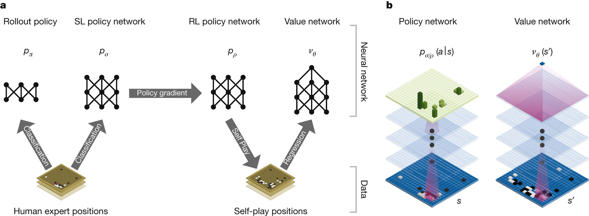
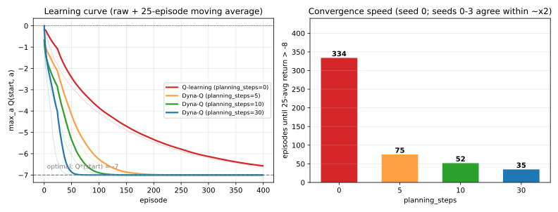
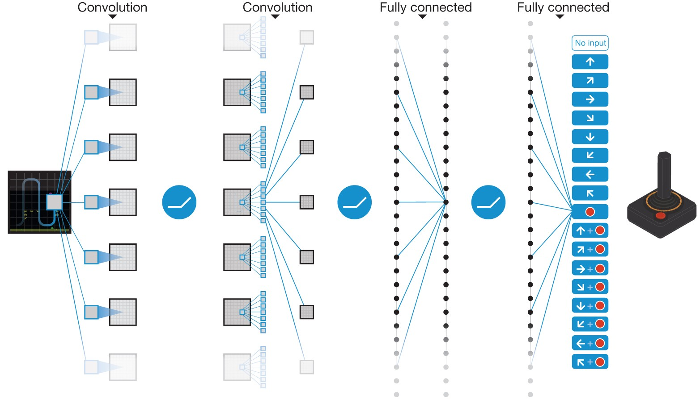

# 7.3 계획과 학습: Dyna-Q

[](https://colab.research.google.com/github/SuminHan/book-ml/blob/main/notebooks/ml2/chapter07_3_dyna_q.ipynb)

### 계획과 학습: Dyna-Q

지금까지의 모델-프리 방법(MC, TD)은 경험을 한 번 쓰고 나면 버렸다.
그런데 그 경험에는 사실 "이 상태에서 이 행동을 하면 대략 이런 보상과
다음 상태가 나오더라"라는, 환경에 대한 정보가 담겨 있다. **Dyna-Q**는
이 정보를 버리지 않고 간단한 **모델**로 저장해뒀다가, 실제 환경과
상호작용하는 사이사이에 그 모델을 이용해 **가상의** 추가 학습(계획,
planning)을 끼워 넣는다:

```python
import random

def dyna_q(env_step, n_states, n_actions, n_episodes, planning_steps, alpha, gamma, epsilon, start_state):
    Q = [[0.0] * n_actions for _ in range(n_states)]
    model = {}  # (s, a) -> (r, s') 실제로 관찰한 것을 그대로 저장(결정론적 환경 가정)
    for _ in range(n_episodes):
        s = start_state
        for _ in range(100):
            a = random.randrange(n_actions) if random.random() < epsilon \
                else max(range(n_actions), key=lambda x: Q[s][x])
            ns, r, done = env_step(s, a)
            Q[s][a] += alpha * (r + gamma * max(Q[ns]) - Q[s][a])  # 1) 실제 경험으로 학습
            model[(s, a)] = (r, ns)                                 # 2) 모델 갱신
            for _ in range(planning_steps):                         # 3) 모델로 가상 학습(계획)
                (ps, pa), (pr, pns) = random.choice(list(model.items()))
                Q[ps][pa] += alpha * (pr + gamma * max(Q[pns]) - Q[ps][pa])
            s = ns
            if done:
                break
    return Q
```

`planning_steps`가 클수록 실제 환경과 상호작용을 한 번 할 때마다 그
경험을 모델을 통해 몇 번이고 "복습"하는 셈이다. 실제로 같은 격자
환경에서, 목표 상태(state 3, 오른쪽으로 가는 행동)의 Q값이 0.5를
넘어서기까지 필요한 에피소드 수를 비교하면 차이가 극적이다:
`planning_steps=0`(순수 Q-learning)은 253 에피소드가 걸리는데,
`planning_steps=10`은 단 9 에피소드만에 도달한다 — 매 실제 스텝마다
모델을 이용해 10번씩 추가로 학습하니, 같은 실제 경험으로 훨씬 더 많은
것을 뽑아내는 것이다.

### 왜 모델을 저장하는가 — 이미 경험 속에 잠겨 있는 정보

"경험을 버린다"는 것은, 사실 우리가 손에 쥐고 있던 정보를 스스로
던져버리는 것과 같다. 한 번의 실제 스텝 \\((s, a) \to (r, s')\\)를
받아들였을 때, 우리는 두 가지를 동시에 손에 넣는다. 첫 번째는 **이
경험 자체가 Q를 갱신할 수 있는 신호**라는 점(1번 줄의 TD(0) 갱신)이고,
두 번째는 **"이 환경에서 (s, a)를 하면 대략 (r, s')가 나온다"는
환경에 대한 지식**이라는 점이다. 모델-프리 방법(MC, TD, Q-learning)은
두 번째를 버린다. 그런데 두 번째 정보는 아무 데나 쓰는 것이 아니다 —
그것은 **아직 실제로 가보지 못한 상태의 가치를 추정하는 데 쓰인다**.

왜 이게 중요한가? 실제 환경과 상호작용하는 비용이 비쌀수록, "간
접적으로" 값을 아는 것이 큰 가치를 가진다. 로봇이 한 칸 움직이는 데
몇 초가 걸리고, 실험실의 화학 반응이 하루를 넘길 수 있다면, 실제
스텝 1회당 Q를 갱신하는 횟수를 10배로 늘려주는 것은 곧 **학습에
소요되는 실세계 시간을 10분의 1로 줄여주는** 것과 같다. Dyna-Q는
이 계산(learning rate를 높이는 대신, *같은 실제 경험*으로 더 많은
갱신을 만들어내는 것)을 아주 단순한 구조 — "본 (s,a)의 마지막
(r,s')를 기억하는 표" — 로 해낸다.

**역사적 맥락**: "Dyna"라는 이름은 1990년 Richard Sutton의 박사논문
에 등장한다. 당시는 "학습(learning)"과 "계획(planning)"을 서로 다른
연구 분야로 보는 경향이 강했는데 — 학습은 샘플로, 계획은 모델로 —
Sutton이 이 둘을 하나의 루프 안에 넣고 "학습이 만든 모델이 계획을
하고, 계획이 학습을 가속한다"는 구조를 보여준 것이 Dyna의 시작이다[^suttonbarto].
이후 모델 기반 강화학습(model-based RL)의 거의 모든 변형은 이
"Dyna의 골격"(실제 경험 ↔ 모델로 계획, 두 루프를 병행) 위에서 변주
되어 왔고, 15장 15.2절에서 다시 만날 AlphaGo/AlphaZero[^alphago][^alphazero]의
"신경망 ↔ MCTS 탐색이 서로를 개선한다"는 루프도, 동전이 하나
뒤집힌(신경망이 모델의 역할을, MCTS가 계획의 역할을 맡은) 같은
구조라고 볼 수 있다.



### 손으로 계획 한 스텝을 따라가 보기 — 값이 모델로 "거꾸로" 퍼지는 과정

코드의 3번 줄이 실제로 무슨 일을 하는지, 작은 3상태 예제로 손으로
한번 따라가 보자. 상태는 \\(S\\)(출발), \\(X\\), \\(T\\)(목표,
종료), 각 상태에서 가능한 행동은 하나씩, 전이는 결정론적이라고
한다:

\\[S \xrightarrow{a} X \\;\\;(\text{보상 } 0), \qquad
X \xrightarrow{a} T \\;\\;(\text{보상 } +1), \qquad \gamma = 0.9, \\; \alpha = 0.5\\]

이 환경의 참값은 벨만방정식을 거꾸로 쓰면 손으로 바로 나온다 —
\\(Q(T)=0\\), \\(Q(X) = 1 + \gamma \cdot 0 = 1\\),
\\(Q(S) = 0 + \gamma \cdot 1 = 0.9\\). 이 "거꾸로" 방향이 핵심인데,
아래에서 그것이 실제로 어떻게 일어나는지 지켜본다.

초기 \\(Q(S)=Q(X)=Q(T)=0\\)에서, 에이전트가 실제로 \\(S \to X\\)
(보상 0)를 한 번 경험했다. TD(0) 갱신:
\\(Q(S) \leftarrow 0 + 0.5(0 + 0.9 \cdot Q(X) - 0) = 0\\) —
\\(Q(X)\\)가 아직 0이므로 \\(Q(S)\\)는 **안 움직인다**. 여기까지가
순수 Q-learning이 할 수 있는 전부다.

그 다음, 에이전트가 실제로 \\(X \to T\\)(보상 +1)를 경험했다:
\\(Q(X) \leftarrow 0 + 0.5(1 + 0.9 \cdot 0 - 0) = 0.5\\). 이제
모델에는 \\((X, a) \to (1, T)\\)가 추가됐다.

여기서 **계획 한 스텝**이 들어온다. 모델에서 무작위 (s,a)를 뽑았는데
\\((S, a)\\)가 뽑혔다고 하자(모델엔 이미 \\((S,a)\to(0,X)\\)가
있다). 모델이 예측한 보상과 다음 상태를 그대로 TD(0) 갱신에 쓴다:

\\[Q(S) \leftarrow 0 + 0.5\big(0 + 0.9 \cdot \underbrace{Q(X)}\_{0.5} - 0\big)
= 0.5 \times 0.45 = 0.225\\]

**에이전트는 S에 다시 발을 디딤 없이, X에서 막 배운 값(0.5)이 모델
을 타고 S로 "거꾸로" 퍼졌다.** 이게 Dyna-Q의 본질이다 — 실제
경험이 한 상태의 Q를 바꾸면, 계획은 그 변화가 *모델로 연결된 다른
상태들*의 Q에까지 퍼지도록 만든다. 계획을 몇 번만 더 하면
\\(Q(S)\\)는 \\(0.9\\)에, \\(Q(X)\\)는 \\(1\\)에 수렴한다(실제로
\\((X,a)\\)가 뽑히면 \\(Q(X)\\) 쪽이 1로, \\((S,a)\\)가 뽑히면
\\(Q(S)\\) 쪽이 0.9로 각각 접근한다).

> **핵심 직관**: TD(0)은 "현재 상태에서 **앞으로** 한 스텝"을 보지만,
> 계획은 "모델이 기억하는 (s,a)에서 **모델을 따라** 한 스텝"을
> 보므로, 실제 이동 없이도 **상태 공간 전체에 걸쳐 값을 퍼뜨리는**
> 것이 가능하다. 실제 경험은 *신뢰할 수 있는* 신호를, 계획은 그
> 신호를 *넓게 퍼뜨리는* 역할을 한다.

### 세 가지 축을 한자리에

이번 장에서 다룬 것들을 한 표로 정리하면, 이번 학기 Block A 전체가
사실 "부트스트래핑을 얼마나 할 것인가"라는 하나의 질문에 대한 서로
다른 답이었다는 게 보인다:

| 방법 | 목표값 | 특징 |
|---|---|---|
| MC (Chapter 5) | 실제 리턴 \\(G\_t\\) | 편향 없음, 분산 큼, 에피소드가 끝나야 함 |
| TD(0) (Chapter 6) | \\(r + \gamma V(s')\\) | 편향 있음, 분산 작음, 매 스텝 학습 |
| n-step TD | \\(n\\) 스텝 실제 + 나머지 추정 | 둘 사이의 절충, \\(n\\)이 다이얼 |
| TD(\\(\lambda\\)) | 모든 \\(n\\)을 흔적으로 가중평균 | \\(n\\)을 고정할 필요 없음, \\(\lambda\\)가 다이얼 |
| Dyna-Q | TD(0) + 학습된 모델로 계획 | 모델-프리와 모델-기반을 결합 |

### 실습: 5×5 격자에서 계획의 가치를 숫자로 재기

"계획이 학습을 빠르게 한다"는 말이 실제로 얼마나 큰 차이를 만드는지,
작은 격자 환경에서 에피소드 수로 재보자. [Colab
노트북](https://colab.research.google.com/github/SuminHan/book-ml/blob/main/notebooks/ml2/chapter07_3_dyna_q.ipynb)
에 완전한 코드가 실려 있다.

**환경**: 5×5 격자. 출발점 \\((4,0)\\)(아래 왼쪽), 목표
\\((0,4)\\)(위 오른쪽), 4방향 이동, 벽에 부딪히면 같은 자리에
남는다. 이동할 때마다 보상 \\(-1\\), 목표에 도착하면 보상 \\(0\\)로
에피소드가 끝난다. \\(\gamma=1\\)(유한하고 반드시 끝나는 과업이라
할인이 불필요 — 5.2절 블랙잭의 \\(\gamma=1\\)과 같은 이유),
\\(\alpha=0.1\\), \\(\varepsilon=0.1\\).

**참값은 손으로 나온다**. 출발점에서 목표까지의 맨해튼(Manhattan)
거리는 \\(|4-0| + |0-4| = 8\\) 스텝 — 8번의 이동 중 7번이 \\(-1\\),
마지막(목표 도착)이 \\(0\\)이므로 **최적 리턴은 정확히
\\(-7\\)**, 즉 \\(V^{\*}(\text{출발}) = -7\\)이다. 출발점에서는
"위"와 "오른쪽"이 모두 최단 경로의 첫 스텝이므로
\\(Q^{\*}(\text{출발}, \text{위}) = Q^{\*}(\text{출발},
\text{오른쪽}) = -7\\)이고, "아래"나 "왼쪽"으로 한 칸 먼저 빠지면
경로가 9스텝으로 늘어서 \\(Q^{\*} = -8\\)이다[^silvercourse]. 참값은
**"위 또는 오른쪽, \\(Q^{\*} = -7\\)"** — 학습 결과가 이 값에
접근하는지 보면 "잘 학습했는가"를 숫자로 바로 판정할 수 있다.

```python
import random

ACTIONS = [(-1, 0), (1, 0), (0, -1), (0, 1)]  # up, down, left, right
START, GOAL = (4, 0), (0, 4)

def step(s, a):
    r, c = s
    nr = min(max(r + ACTIONS[a][0], 0), 4)
    nc = min(max(c + ACTIONS[a][1], 0), 4)
    ns = (nr, nc)
    if ns == GOAL:
        return ns, 0.0, True
    return ns, -1.0, False

def dyna_q_grid(n_episodes, planning_steps, alpha=0.1, gamma=1.0, epsilon=0.1, seed=0):
    rng = random.Random(seed)
    Q, model = {}, {}
    returns = []
    for _ in range(n_episodes):
        s, ret = START, 0.0
        for _ in range(100):
            a = rng.randrange(4) if rng.random() < epsilon \
                else max(range(4), key=lambda x: Q.get((s, x), 0.0))
            ns, r, done = step(s, a)
            Q[(s, a)] = Q.get((s, a), 0.0) + alpha * (
                r + gamma * max(Q.get((ns, x), 0.0) for x in range(4)) - Q.get((s, a), 0.0))
            model[(s, a)] = (r, ns)
            for _ in range(planning_steps):
                (ps, pa), (pr, pns) = rng.choice(list(model.items()))
                Q[(ps, pa)] = Q.get((ps, pa), 0.0) + alpha * (
                    pr + gamma * max(Q.get((pns, x), 0.0) for x in range(4)) - Q.get((ps, pa), 0.0))
            s, ret = ns, ret + r
            if done:
                break
        returns.append(ret)
    return Q, returns
```

400 에피소드 학습(시드 0, 나머지 시드 1~3으로 재현 확인) 결과를
"25에피소드 평균 리턴이 최적치(−7)에서 1.0 이내(> −8)로 처음
들아가는 에피소드"로 정리하면:

| `planning_steps` | 수렴 에피소드 (시드 0) | 시드 1~3 범위 | 400 에피소드 시 max Q(start) | 발견한 (s,a) 수 |
|---|---|---|---|---|
| 0 (순수 Q-learning) | 334 | 334~387 | −6.61 | 96/100 |
| 5 | 75 | 65~75 | −7.00 | 96/100 |
| 10 | 52 | 51~55 | −7.00 | 96/100 |
| 30 | 35 | 35~61 | −7.00 | 95/100 |



세 가지가 보인다. **(1) 가속은 극적** — `planning_steps=30`이
순수 Q-learning 대비 **약 9.5배**(334/35) 빨리 수렴한다. 실제
상호작용 35회로, 계획 없이는 334회나 걸렸던 학습이 끝난 것이다.
**(2) 한계 효과 감소(diminishing returns)** — 0→10으로 늘리면
334→52(약 6배)로 크게 빨라지지만, 10→30으로 더 늘려도 52→35
(약 1.5배)로만 줄어든다. 계획에 쓰는 계산량을 두 배, 세 배로 늘려도
수렴 속도가 그 배수로 빨라지지는 않는다. **(3) 모델은 거의
포화된다** — 400 에피소드 후 100개 (s,a) 중 95~96개가 모델에
들어갔다. 격자가 작아서 거의 모든 (s,a)가 한 번 이상 방문되는 셈인데,
이 "모델 커버리지"가 계획의 품질 상한선을 정한다(아래 실수와 FAQ에서
다시 본다).

Dyna-Q 루프 자체를 그림으로 한 장 더 보면, 실제 경험과 계획이
**같은 Q 테이블을 공유**하면서 어떻게 돌아가는지 명확해진다:

![Dyna-Q 루프 구조도: 실제 환경 step -> (1) 실제 경험으로 TD(0) 갱신, (2) model[(s,a)]=(r,s') 저장. model에서 planning_steps번 무작위 (s,a)를 뽑아 모델 예측으로 TD(0) 갱신(계획). 실제 갱신과 계획 갱신 모두 하나의 Q 테이블로 모이고, 그 Q에서 epsilon-greedy 행동을 뽑아 다시 환경으로 들어가는 순환 구조](../../images/ch07_3_dyna_q_loop.svg)

**왜 `planning_steps`이 "하이퍼파라미터"인지**도 여기서 실감난다 —
7.2절에서 \\(n\\)(n-step TD)을 "편향-분산 사이 어딘가"로 튜닝했듯이,
여기서는 `planning_steps`를 "계산 비용 대 가속 효과" 사이 어딘가로
튜닝한다. 이번 실험에서는 10~30이 좋은 구간이었고, 0(계획 없음)과
"무한히 크게"(아래 실수 참조)는 둘 다 극단이다.

### 자주 하는 실수

**1. 모델에 없는 (s, a)를 직접 조회해서 KeyError.** `model`은
**희소(sparse) 딕셔너리**다 — 아직 한 번도 경험하지 않은 (s, a)는
그냥 딕셔너리에 *없다*. `model[(s, a)]`처럼 직접 인덱싱하면 처음
방문하지 않은 상태에서 바로 `KeyError`가 난다. 계획은 반드시
`model.items()`에서 **이미 있는** (s,a)를 무작위로 뽑아야 한다(코드
3번 줄의 `random.choice(list(model.items()))`). "모델이 아직
불완전하다"는 것은 버그가 아니라 **정상 상태**다 — 초반에는 모델이
거의 비어 있어 계획이 거의 아무것도 안 하고, 경험이 쌓일수록 계획의
품질이 함께 올라간다.

**2. "실제"와 "계획"을 각각 Q 테이블 두 개로 따로 갱신하기.** Dyna-Q
가 작동하는 *전부*의 이유가 **두 갱신이 같은 Q 테이블을 공유**하는
것이다. 만약 계획만 `Q_plan`이라는 별도 테이블에 갱신하고, 실제
행동은 `Q_real`로만 한다면, 계획이 만들어낸 값 향상은 실제 행동에
**한 번도 반영되지 않는다** — 계획을 아무리 많이 돌려도 실제
학습속도가 1도 안 좋아진다. 이 절의 코드에서는 `Q`가 하나이고,
1번 줄(실제)과 3번 줄(계획)이 모두 그 `Q`를 갱신하는 것을 확인하라.

**3. `planning_steps`를 아주 크게 잡는다.** 계획 1회의 비용은 실제
스텝 1회의 비용과 비슷하지만, **모델 오차도 함께 "복리"로
증식**한다. 모델이 부정확한 초반에 계획을 과도하게 반복하면, 그
오차가 Q값에 강하게 반영되어 오히려 학습을 방해할 수 있고(위 FAQ
2번 질문), 단순한 계산량 문제만으로도 `planning_steps=1000`이면
실제 스텝 1회당 계획 1000회를 돌리느라 **수렴은 빨리 안 되면서
만성적으로 느려진다**. 실전에서는 `planning_steps`도
`alpha`, `epsilon`과 같은 하이퍼파라미터로, 검증 성능으로 튜닝한다.

### 확인 문제

1. **공유 테이블**: 위 `dyna_q_grid`에서 계획 갱신(3번 단계)을
   `Q_plan`이라는 별도 딕셔너리로 분리하면, `planning_steps=30`의
   수렴 에피소드가 순수 Q-learning(=334)과 어떻게 달라지는지
   **숫자 없이** 한 문장으로 답하라. (힌트: 계획의 산출물이 어디로
   가는지)

2. **모델 커버리지**: 400 에피소드 후에도 100개 (s,a) 중 4개(4%)가
   모델에 들어가지 않았다. 이 "없는 4개"가 계획에 미치는 영향을
   `random.choice(list(model.items()))`의 관점에서 설명하라.

3. **참값 판정**: 학습을 마친 Q에서 `max(Q[(START,0)],
   Q[(START,1)], Q[(START,2)], Q[(START,3)])`가 −7.00이고,
   `argmax`가 "위"(action 0) 또는 "오른쪽"(action 3)를 가리킨다면,
   이 정책이 **최적**이라고 단정할 근거가 손으로 계산한 참값(위/오른쪽
   = −7, 아래/왼쪽 = −8)에 어떻게 대응하는지 설명하라.

### 자주 묻는 질문

**Q. Dyna-Q의 모델은 항상 정확한가요?** 학습 초반에는 전혀 그렇지
않다 — 아직 몇 번밖에 못 가본 (상태, 행동) 쌍의 모델은 부정확하거나
아예 없을 수 있다. 그런데도 Dyna-Q가 잘 작동하는 이유는, 모델이
부정확해도 "그 부정확한 모델로 계획한 결과"가 최소한 "아무것도
안 하는 것"보다는 대체로 낫고, 실제 경험이 쌓일수록 모델도 함께
정확해져서 계획의 품질도 함께 좋아지기 때문이다.

**Q. planning_steps를 무한히 늘리면 항상 좋아지나요?** 실제
환경과의 상호작용 한 번당 계획에 쓰는 계산량이 커질 뿐, 계획
자체는 이미 모은 경험 이상의 새로운 정보를 만들어내지 못한다 —
모델이 부정확한 상태에서 계획만 과도하게 반복하면, 그 부정확함이
Q값에 더 강하게 반영되어 오히려 해로울 수 있다(모델 오차의
"복리 효과"). 실전에서는 `planning_steps`도 다른 하이퍼파라미터처럼
검증 성능으로 튜닝한다.

**Q. Dyna-Q는 on-policy인가요, off-policy인가요?** Q를 갱신하는
방식이 6.3절 Q-learning의 그것과 **완전히 같다** — 목표값에
\\(\max\_a Q(s', a)\\)(탐욕)를 쓰는 off-policy 갱신이다. 계획이
모델에서 (s,a)를 *무작위*로 뽑는 것은 "행동 정책"이 아니라
"어떤 (s,a)의 Q를 갱신할지"를 고르는 것에 불과하고, 그 갱신
본질적으로는 여전히 \\(\max\\)가 들어간다. 따라서 Dyna-Q는
Q-learning을 계승해서 **off-policy**다.

**Q. DQN[^dqn]의 경험 재사용(experience replay, Chapter 9)과 무엇이
다른가요?** 공통점은 "과거 경험을 재사용해서 실제 스텝당 갱신을
여러 번 만든다"는 것이다. 차이는 **재사용의 원천**이다. 경험
재생은 *실제 경험*인 (s,a,r,s') 튜플을 버퍼에서 다시 뽑아 써서
모델 오차가 없지만, 경험한 전이만 재사용할 뿐 *새로운* 전이를
만들어내지 못한다. Dyna-Q의 계획은 *모델 예측* (r,s')으로
갱신하므로 **모델 오차가 동반되지만**, 모델이 연결한 *아직
경험하지 않은* 상태의 전이까지 만들어낼 수 있다. "안전하지만
새것을 못 만든다"(재생) 대 "새것을 만들 수 있지만 오차가
동반된다"(계획) — 이 트레이드오프가 Chapter 9 이후의 모델 기반
DQN 변형들을 이끄는 줄거리다.



**Q. 언제 Dyna-Q가 특히 효과적인가?** 실제 상호작용이 **비싸고**
(로봇, 물리 실험, 지연이 큰 시스템), 환경이 충분히 **규칙적**해서
간단한 모델로 대략 잡아낼 수 있을 때다. 반대로 상호작용이
아주 싸고(시뮬레이션, 게임), 모델 학습이 어렵거나(강한
난수성, 비마르코프성) 신뢰할 수 없을 때는, 모델 오차가 이득을
무르기 쉬워서 순수 모델-프리 방법을 쓰는 것도 합리적이다. "모델을
만들 수 있는가, 만들고 만든 모델이 신뢰할 만한가"가
Dyna-Q를 쓸지 말지의 첫 번째 판단 기준이다.

> **핵심 정리**: 부트스트래핑의 양 극단(MC, TD) 사이의 다이얼
> (\\(n\\), \\(\lambda\\))을 고르는 것에서 한 걸음 더 나아가,
> **경험을 모델이라는 형태로 저장해 "간접 경험"을 만들어내는**
> 것이 Dyna-Q다[^cs234]. 실제 경험은 신뢰할 신호를, 계획은 그 신호를
> 상태 공간에 퍼뜨리는 역할을 한다 — 그리고 이 두 루프가 *같은
> Q 테이블*을 공유하는 것이 전부다.

**부트스트래핑(추정치로 스스로를 갱신하는 것)을 아예 안 하는 것(MC)과
매 스텝 하는 것(TD)은 두 극단일 뿐이다 — 실전에서는 그 사이 어딘가가,
그리고 경험을 재사용하는 계획까지 더하는 것이 대체로 더 낫다는 것이
이번 장의 결론이다.**

---

## 연습문제

**1. (코딩)** 위 `dyna_q`(핵심 줄은 빈칸으로 남겨져 있다고 가정)를
완성하고, `planning_steps`를 0과 10으로 바꿔가며 같은 상태-행동의
Q값이 0.5를 넘는 데 걸리는 에피소드 수를 비교하라:

```python
import random

def dyna_q(env_step, n_states, n_actions, n_episodes, planning_steps, alpha, gamma, epsilon, start_state):
    Q = [[0.0] * n_actions for _ in range(n_states)]
    model = {}
    # ADD ADDITIONAL CODE HERE!!
    # 1) epsilon-greedy로 행동 선택, 환경과 상호작용, Q-learning 갱신
    # 2) model[(s,a)] = (r, ns)로 모델 저장
    # 3) planning_steps번, model에서 무작위로 (s,a)->(r,ns)를 뽑아 같은 방식으로 Q 갱신

    return Q
```

**2. (개념 서술)** Dyna-Q의 모델은 환경이 결정론적이라고(같은 (s,a)는
항상 같은 (r,s')를 낸다고) 가정하고 있다. 만약 환경이 확률적이라면
(같은 (s,a)에서도 매번 다른 s'가 나올 수 있다면) `model[(s,a)] = (r,
ns)`처럼 마지막 경험 하나만 저장하는 방식에 어떤 문제가 생길지
설명하고, 이를 개선할 방법을 한 가지 제안하라.

**3. (손유도, Tier B — 힌트 제공)** \\(n\\)-step 리턴 \\(G\_t^{(n)} =
\sum\_{k=0}^{n-1} \gamma^k R\_{t+k} + \gamma^n V(s\_{t+n})\\)에서
\\(n=1\\)로 놓으면 정확히 TD(0)의 목표값 \\(R\_t + \gamma V(s\_{t+1})\\)이
됨을 확인하고, \\(n \to \infty\\)이면서 에피소드가 유한한 길이 \\(T\\)에서
끝난다고 할 때(\\(V(s\_T) = 0\\)) \\(G\_t^{(n)}\\)이 몬테카를로의 실제
리턴 \\(G\_t = \sum\_{k=0}^{T-t-1} \gamma^k R\_{t+k}\\)와 같아짐을
보여라.

**정확성 확인**: 이 결과가 왜 "TD(0)와 MC가 n-step TD의 두 특수한
경우"라는 주장을 뒷받침하는지 한 문장으로 설명하라.

**4. (코딩)** 위 5×5 격자 `dyna_q_grid`를 `planning_steps ∈ {0, 5, 10,
30}`로 각각 400 에피소드 학습시키고, "25에피소드 평균 리턴이 −8
위로 처음 오르는 에피소드"를 \\(planning\_steps\\)별로 그려서(막대
그래프) 이 절의 표와 일치하는지 확인하라. 추가로, 학습 후
\\(Q^{\*}\\)와 비교하는 **정확도 지표**를 하나(예: 모든 (s,a)에 대해
\\(|Q(s,a) - Q^{\*}(s,a)|\\)의 평균)를 계산해 `planning_steps`가
수렴 *속도*에만 영향을 주는지, 최종 *정확도*에도 영향을 주는지
판단하라.

[^suttonbarto]: Sutton, R. S., Barto, A. G. (2018). "Reinforcement Learning: An Introduction" (2nd ed.). MIT Press. 저자 공식 무료 공개: http://incompleteideas.net/book/the-book-2nd.html
[^alphago]: Silver, D. et al. (2016). "Mastering the game of Go with deep neural networks and tree search." Nature 529, 484–489.
[^dqn]: Mnih, V. et al. (2015). "Human-level control through deep reinforcement learning." Nature 518, 529–533. (Earlier preprint: Mnih, V. et al. (2013). arXiv:1312.5602.)
[^cs234]: Stanford CS234: Reinforcement Learning. https://web.stanford.edu/class/cs234/
[^alphazero]: Silver, D., Hubert, T., Schrittwieser, J., et al. (2018). "Mastering Chess and Shogi by Self-Play with a General Reinforcement Learning Algorithm." Science 362(6419), 1140–1144. (arXiv:1712.01815)
[^silvercourse]: Silver, D. (2015). "UCL Course on Reinforcement Learning." https://www.davidsilver.uk/teaching/ — 이 절의 실습(5×5 격자, 보상 −1)과 동일한 설정으로 계획/모델 기반 방법을 다루는 표준 강의자료다.
