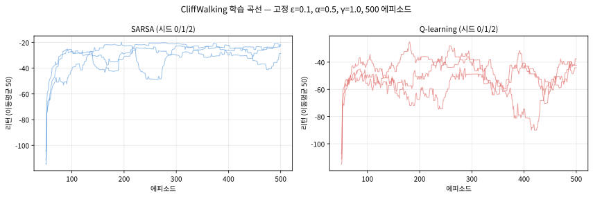
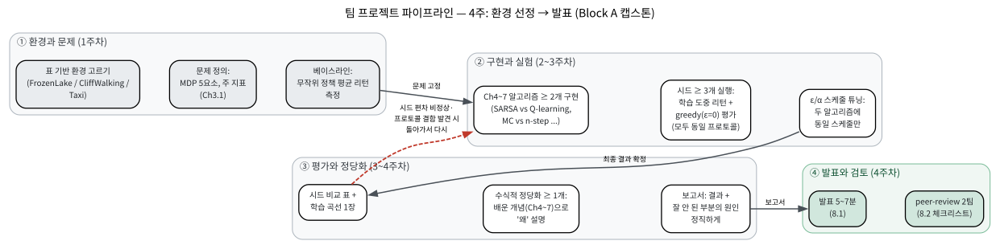
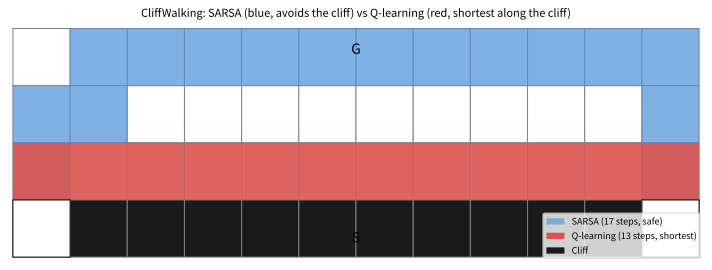

# 8.1 팀 프로젝트: 구조와 발표

[](https://colab.research.google.com/github/SuminHan/book-ml/blob/main/notebooks/ml2/chapter08_1_team_project.ipynb)

### 왜 지금 프로젝트를 하는가

Chapter 2~7에서 밴딧부터 n-step TD·Dyna-Q까지, 표 기반 강화학습의 이론과
알고리즘을 거의 다 손에 쥔 셈이다 — 이 과정은 Sutton과 Barto의 표준
강화학습 교과서가 다루는 내용과 거의 1:1로 겹친다[^suttonbarto]. 그런데
이 학기까지 해본 것은 전부
"교재가 고른 환경, 교재가 고른 파라미터, 교재가 고른 시드"에서 코드가
동작하는지 확인하는 것이었다. 지금 필요한 것은 그 한 단계 위로 올라가는
것 — **환경을 고르고, 알고리즘 두 개를 고르고, 결과가 흔들리면 시드와
프로토콜을 점검해서 다시 고르는 것**까지가 여러분의 몫인 프로젝트다.
"코드가 동작한다"는 증거와 "이 문제를 내가 설계하고 평가할 수 있다"는
증거는 다르다 — 이 프로젝트를 마치면 후자의 증거(보고서 + 발표 +
peer-review)를 손에 넣게 된다.

### 프로젝트 구조

- **환경**: Gymnasium[^gym]의 표 기반(이산 상태·행동) 환경 중 하나를 고른다
  — `FrozenLake-v1`, `CliffWalking-v1`, `Taxi-v3` 등이 좋은 후보다.
- **적용**: Chapter 4~7의 알고리즘 중 **최소 두 가지**(예: Q-learning과
  SARSA, 또는 MC 제어와 n-step TD)를 같은 환경에 적용하고 학습 곡선과
  최종 정책을 비교한다.
- **필수 요구사항 — 수식적 정당화 최소 1개**: 예를 들어 (1) Q-learning과
  SARSA를 비교했다면 Chapter 6.2~6.3의 on-policy/off-policy 차이로 두
  정책이 왜 다르게 학습됐는지 설명, (2) \\(\varepsilon\\)이나 \\(\alpha\\)를
  바꿔가며 실험했다면 Chapter 6.3의 수렴 조건과 연결지어 설명, (3)
  Dyna-Q[^suttonbarto]를 썼다면 Chapter 7.3의 계획 스텝 수와 학습
  속도의 관계를 직접 측정해서 제시.

환경 고르는 실전 가이드: 아래 기준으로 후보에 점수를 매겨보면 팀 회의가
쉬워진다. (1) **상태-행동 공간의 크기** — 상태가 너무 많으면(예:
Taxi는 500개) 표를 채우려면 에피소드 수가 급격히 늘어난다. (2)
**보상 구조가 "학습 중 성과"와 "최종 정책 성과"를 갈라놓는가** —
CliffWalking처럼 학습 중 실수가 비례하지 않게 큰 벌(-100)을 부과하는
환경에서는 on-policy/off-policy 차이가 극적으로 드러나서 6.3절의
개념을 숫자로 보여줄 좋은 무대다. (3) **확률적 전이** — FrozenLake의
미끄러운 얼음(의도한 방향과 다르게 전이할 수 있음)은 "같은 정책이어도
에피소드가 매번 달라진다"는 강화학습 특유의 불확실성을 체감하게 한다.
(4) **코드 재사용성** — Chapter 6.3·7.3의 강의 코드가 거의 그대로
적용되는가. 환경마다 시작 상태가 여러 개인지(Taxi), 에피소드 길이
상한이 있는지를 확인하고 시작하자.

| 환경 | 상태 × 행동 | 보상 구조 | 난이도 | 잘 어울리는 비교 |
|---|---|---|---|---|
| **FrozenLake-v1** | 16 × 4 (미끄럼 있음) | 도착 +1, 그 외 0 (구멍은 에피소드 종료) | 낮 | MC(Ch5.3) vs SARSA(Ch6.3) — 확률 전이에서의 시드 안정성 비교 |
| **CliffWalking-v1** | 48 × 4 | 한 스텝 −1, 절벽 −100, 도착 0 | 중 | SARSA vs Q-learning — 6.3절의 클래식 비교 |
| **Taxi-v4** | 500 × 6 | 성공 +20, 불법 행동 −10, 스텝 −1 | 높 | n-step vs TD(0) (Ch7.2), Dyna-Q (Ch7.3) |

참고: Gymnasium 레지스트리[^gymnasium]의 이름은 버전에 따라 달라질 수 있다 —
최근 버전에서 `Taxi-v3`는 deprecated되어 `Taxi-v4`를 쓰게 된다.
CliffWalking[^suttonbarto]은 Chapter 6.3의 실습에서 봤듯이
`gym.make("CliffWalking-v1")`
으로 바로 사용할 수 있다(4×12 격자, 시작=좌하단, 목표=우하단, 그
사이를 절벽이 가로막는 구조).

### 비교 프로토콜: 시드 여러 번, 그리고 평가는 따로

이 프로젝트의 가장 핵심적인 절차가 따로 있다. 강화학습 실험에서
"한 번의 실행"은 아무것도 말해주지 않는다 — \\(\varepsilon\\)-greedy
탐험의 무작위성, (FrozenLake처럼) 환경 전이 자체의 무작위성, 정책의
초기화가 겹치기 때문에, **같은 코드·같은 파라미터를 그대로 돌리기도
매번 다른 학습 곡선**이 나온다. 그래서 프로젝트의 비교는 아래
프로토콜로만 인정한다:

1. **학습 시드 \\(\geq 3\\)개**(예: 0, 1, 2)로 알고리즘을 전부 다시
   학습시킨다. 시드를 바꾸는 것은 "실험을 다시 하는" 것이 아니라
   "우연에 좌우되는지 재검사하는" 것이다.
2. **학습 도중 성과**와 **학습 후 평가 성과**를 반드시 나눠서 보고한다.
   - 학습 도중: 마지막 100 에피소드 평균 리턴(탐험이 섞인 상태)
   - 학습 후: \\(\varepsilon=0\\)(탐욕적)로 고정된 에피소드 수(예:
     200개)를 돌린 평균 리턴 — **모든 알고리즘·모든 시드에게 동일한
     평가 프로토콜**을 쓴다.
3. 알고리즘 간 비교는 **시드별 숫자 자체**(예: "−13 / −13 / −13")를
   표로 제시하고, 평균±표준편차나 "일관된 경향"으로 결론을 내린다.

실제로 이 프로토콜이 왜 필요한지 실습 노트북의 CliffWalking 실험
(\\(\alpha=0.5\\), \\(\gamma=1.0\\), \\(\varepsilon=0.1\\) 고정, 500
에피소드)이 보여준다:

| 시드 | SARSA 학습중 (마지막 100) | SARSA greedy 평가 | Q-learning 학습중 | Q-learning greedy 평가 |
|---|---|---|---|---|
| 0 | −31.5 | −17 (17 스텝) | −49.6 | −13 (13 스텝) |
| 1 | −25.6 | −17 (17 스텝) | −51.2 | −13 (13 스텝) |
| 2 | −23.6 | −17 (17 스텝) | −48.6 | −13 (13 스텝) |

두 가지를 읽어야 한다. (1) **학습 도중(탐험 포함)** 리턴은 SARSA가
오히려 −24~−32로 Q-learning(약 −50)보다 낫다 — 6.3절의 설명
그대로, Q-learning이 배우는 "절벽 바로 옆 최단 경로"는 학습 도중
\\(\\varepsilon\\)에 의한 무작위 행동 한 번이 −100으로 이어지는
경로다. (2) **학습 후** Q-learning은 13스텝 최단 경로(−13)를,
SARSA는 17스텝 안전 경로(−17)를 **세 시드 모두** 일관되게 찾는다 —
최종 정책의 차이는 우연이 아니라 6.3절의 on/off-policy 설계
차이이며, 시드별 표는 그 차이가 **재현되는** 것임을 보여준다.

그렇다면 왜 시드 \\(\\geq 3\\)을 요구하는가? 이 실험에서 시드 간
편차가 작았던 것은 **우연**일 수 있고, 미리 아는 방법은 없다.
확률적 전이의 환경(FrozenLake, 실습 노트북 §6)에서는 같은
코드·같은 파라미터를 시드만 바꿔도 **같은 알고리즘의** greedy
평가가 0.045 / 0.090 / 0.125로 **2.8배**까지 벌어진다 — 시드
편차의 크기는 환경(확률적 전이 여부, 상태 공간, 학습 예산)에
달려 실행하지 않고서는 알 수 없다. 시드별 표는 형식적 서류가
아니라 **결론의 신뢰도를 확인할 수 있는 유일한 수단**이다.



**\\(\\varepsilon\\) 감쇠(decay) 스케줄도 하이퍼파라미터다.** Chapter
6.3에서 \\(\\varepsilon\\)를 학습 내내 고정하면 "탐험이 줄면서 배움이
뎀프닝된다"는 문제를 봤고, 프로젝트에서는 보통 학습 초반에 높은
\\(\\varepsilon\\)로 상태를 넓게 방문한 뒤 서서히 줄이는 스케줄을 쓴다.
그런데 "이 스케줄이 결과를 바꾸는가"는 실험하지 않으면 답이 없다 —
실습 노트북은 스케줄 하나만 500 에피소드 동안 1.0 → 0.01 선형
감쇠로 바꿔 **같은 파라미터·같은 시드로** 재실행했는데, greedy
평가(SARSA −17 / −17 / −17, Q-learning −13 / −13 / −13)는 한 치도
달라지지 않았다. 이것도 **부정적 결과(negative result)**이고,
그것 자체가 정당한 결과다 — "이 환경·이 학습 예산에서 스케줄
선택이 성능에 민감하지 않다"는 관찰도 보고서에 적어야 한다.
스케줄 사용에 꼭 지킬 규칙은 (a) **두 알고리즘 모두에게 동일한
스케줄**을 적용하는 것 — 한쪽에만 감쇠를 쓰면 "감쇠의 효과"와
"알고리즘의 차이"가 뒤섞여 어느 쪽도 설명할 수 없게 된다.
(b) 만약 다른 환경·학습 예산에서 스케줄이 차이를 만든다면,
그 차이는 수식적 정당화(§"손으로 한 번")의 일부가 되어야 한다.
탐험/활용 트레이드오프와 \\(\\varepsilon\\)-greedy 스케줄 설계의
개념을 강의 형식으로 더 깊이 다루는 자료: David Silver의 UCL
강화학습 강좌 (Lecture 9: Exploration and Exploitation)[^silvercourse].

```python
def make_epsilon_schedule(n_episodes, eps_start=1.0, eps_end=0.01):
    def eps_fn(episode):  # 선형 감쇠
        return max(eps_end, eps_start + (eps_end - eps_start) * episode / n_episodes)
    return eps_fn
```

### 전체 그림: 4주 파이프라인

프로젝트의 진행 순서를 한 장으로 그리면 아래와 같다. 왼쪽에서 오른쪽으로
**환경 → 구현·비교 → 평가·정당화 → 발표**로 흘러가며, 각 박스가
Chapter 2~7의 어느 절에서 배운 원칙을 집행하는지도 함께 적었다.
붉은 점선(평가 → 구현·비교)이 핵심이다 — 시드 간 편차가 비정상적으로
크거나 평가 프로토콜의 결함이 발견되면 **돌아가서 다시** 돌려야
한다는 뜻이다. 프로젝트에서 "한 번 지나가면 돌아올 수 없는" 것은
최종 발표뿐이고, 그 외 모든 단계는 되돌아갈 수 있다.



### 일정과 마일스톤

4주(각 주 = 수업 3회)는 아래처럼 나뉜다. **마일스톤 M1~M4가 제출물**이고,
M1·M2는 팀 전체가 모여 함께 결정하는 것이다.

| 주 | 해야 할 일 | 마일스톤(제출) |
|---|---|---|
| 1 | 환경 후보 2~3개 조사(상태 수·보상 구조·확률 전이 여부), 팀 회의, **문제 정의 문서**: 어떤 MDP인지, 어떤 지표를 쓸지, 베이스라인(무작위 정책) 리턴은 얼마인지 | **M1** 문제 정의 + 환경 선택(1페이지) |
| 2 | Ch6.3/7.3 코드에서 두 알고리즘 구현, **베이스라인(무작위 정책) 리턴 측정**, 시드 3개 중 1개에서 엔드투엔드 동작 확인 | **M2** 중간코드 리뷰(코드 + 베이스라인 숫자 1줄) |
| 3 | 나머지 시드 실행, \\(\varepsilon\\)/\\(\alpha\\) 튜닝(모두 동일한 프로토콜로), **greedy 평가(\\(\varepsilon=0\\))**, 학습 곡선과 시드 비교 표 도출 | **M3** 학습 곡선 1장 + 시드 비교 표 |
| 4 | 수식적 정당화 작성, 보고서·발표 슬라이드 완성, **발표(5~7분)**, **peer-review 2팀** | **M4** 보고서 + 발표 + 리뷰 2건 |

"왜 마일스톤이 이 모양인가"를 생각해보자. M2에서 **베이스라인
숫자 한 줄**(무작위 정책의 평균 리턴)을 제출하게 하는 이유는, 이
숫자를 보고야 비로소 "배운 정책이 실제로 무작위보다 나은가"를
판정할 수 있기 때문이다 — 6.3절의 절벽 예제에서 무작위 정책은
대부분의 에피소드가 목표에 도달하지 못하고 500스텝 상한까지
돌아다니며 절벽을 반복 타격해 평균 리턴이 −5,010(실측 100
에피소드) 수준이다. 이 제로점 덕분에 "greedy 평가 −17"이 의미
있는 숫자인지 바로 확인된다.
M3에서 **시드 비교 표**를 요구하는 이유는, "최종 greedy 리턴 −13"
한 줄만 제출하면 그 숫자가 시드 1개에서 우연히 나온 것인지 시드
3개에서 일관된 것인지 검증할 수 없기 때문이다 — 표가 있으면
§"비교 프로토콜"이 실제로 지켰는지가 제출물에서 바로 드러난다.

### 손으로 한 번: "수식적 정당화"의 좋은 예와 나쁜 예 비교하기

어떤 팀이 CliffWalking에서 "Q-learning이 SARSA보다 최종 평가 점수가
더 높았다(-13 vs -17)"는 결과를 얻었다고 하자.

**나쁜 설명**: "Q-learning이 SARSA보다 점수가 더 높았다. Q-learning이
더 좋은 알고리즘인 것 같다."

**좋은 설명**: "학습 도중(탐험 포함) 평균 리턴은 SARSA가 더 높았다
(-31 vs -53) — Chapter 6.3에서 배운 대로, Q-learning은 목표 정책(항상
최선)의 가치를 학습하는 off-policy 방법이라 절벽 옆 최단 경로를
학습했고, 그 경로는 탐험으로 인한 실수 한 번이 큰 손해(-100)로
이어진다. 반면 SARSA는 실제 행동 방식(탐험 포함)까지 감안하는
on-policy 방법이라 더 안전한 경로를 선호했다. 학습을 마치고 탐험 없이
(ε=0) 정책만 평가하면 Q-learning의 경로가 더 짧아 점수가 더 높지만
(-13 vs -17), 이건 '더 좋은 알고리즘'이 아니라 '두 알고리즘이 애초에
다른 질문에 답하고 있다'는 것을 보여준다."

두 설명은 같은 숫자를 말하지만, 좋은 설명은 그 숫자 뒤에 있는
**알고리즘의 설계 차이**를 짚어낸다 — 이것이 이 학기 프로젝트가
요구하는 "수식적 정당화"의 실제 의미다.

### 보고서 구조 (M4)

보고서(4~6페이지)와 발표 슬라이드는 같은 골격으로 쓴다 — **발표
슬라이드 = 보고서의 각 절 제목**으로, 발표는 보고서의 요약이 된다.

1. **문제 정의** (0.5p): 환경(MDP 5요소, Ch3.1) — 상태·행동·전이·보상·할인율,
   주 지표(greedy 평가 평균 리턴), 베이스라인(무작위 정책 리턴).
2. **알고리즘 선택과 이유** (1p): 후보 \\(\geq 2\\)개, **왜 이
   알고리즘을 이 환경에 골랐는가**(보상 구조·상태 수와 연결),
   하이퍼파라미터(\\(\alpha\\), \\(\gamma\\), \\(\varepsilon\\)
   스케줄)와 선택 근거.
3. **실험 프로토콜** (1p): 시드 목록, 학습 에피소드 수, **평가
   프로토콜(\\(\varepsilon=0\\), 에피소드 수, 모든 알고리즘 동일)
   명시**. 이 절이 없으면 §"비교 프로토콜" 위반이므로 8.2절
   체크리스트에서 바로 감점된다.
4. **결과** (1p): 시드 비교 표, 학습 곡선 1장(여러 시드를 한 그림에
   얇은 선으로), greedy 정책의 경로 시각화.
5. **수식적 정당화** (1p): Chapter 2~7의 개념(\\(\geq 1\\)개)으로
   "왜 이 결과가 나왔는지" — §"손으로 한 번"의 좋은 예 문체로.
6. **잘 안 된 부분과 원인 진단** (0.5p): **필수** 절. 잘 안 된
   부분이 없었으면 "무엇을 시도했다가 안 됐는가"를 쓴다 — "모두
   잘 됐다"는 보고서는 이 절이 비어 있다는 뜻이고, 그 자체가
   8.2절 체크리스트에서 "결과의 정직성" 항목을 의심하게 한다.

### 채점 기준 (rubric)

| 항목 | 비중 | 좋은 답 |
|---|---|---|
| 문제 정의와 환경 | 15% | MDP 5요소·지표·베이스라인이 명확하고, 환경 선택이 Ch4~7의 개념 검증 목적에 근거함 |
| 방법론 적절성 | 20% | 환경 특성에 맞는 알고리즘과 파라미터를 골랐고, 그 근거가 Ch4~7의 개념으로 설명됨 |
| 실험 프로토콜의 정직성 | 25% | 시드 ≥3, 동일 평가 프로토콜, 베이스라인, \\(\varepsilon\\) 스케줄이 보고서에서 추적 가능할 정도로 명시됨 |
| 수식적 정당화 | 20% | 배운 개념 \\(\geq 1\\)개로 "왜"를 설명했고, 그 설명이 실제로 관측한 숫자와 일치함 |
| 결과의 정직성과 반성 | 20% | 불안정했던 시드·구간을 숨기지 않고, 원인을 Ch4~7의 개념으로 진단함 |

"실험 프로토콜의 정직성"과 "결과의 정직성"이 절반을 차지하는
이유는, 이 프로젝트의 목적이 "좋은 정책을 만든 것"이 아니라
**"그 정책의 성능 숫자를 정직하게 얻는 절차"를 실제로 수행한 것을
증명하는 것**이기 때문이다. greedy 평가가 −13이 나와도 프로토콜이
정직하고 정당화가 타당하면 높은 점수를 받고, −13이 나와도 시드가
1개였다면 "실험 프로토콜의 정직성"에서 크게 감점된다 — 8.2절에서
다른 팀을 리뷰할 때도 정확히 이 우선순위로 보게 된다.

### 자주 하는 실수

프로젝트에서 반복해서 보이는 실수 5가지 — 각각이 Chapter 2~7의
어떤 원칙을 깨는지 짚어두면, 8.2절에서 다른 팀을 리뷰할 때
"반박 가능한 질문"으로 바로 바꿀 수 있다.

- **시드 1개 실험으로 결론**: §"비교 프로토콜"의 CliffWalking 실험에서는
  시드 간 편차가 작았지만, 그건 이 환경의 성질이지 보장이 아니다 —
  실습 §6의 FrozenLake(확률적 전이)에서는 같은 코드·같은
  파라미터를 시드만 바꿔도 greedy 평가가 0.045 / 0.090 / 0.125로
  2.8배까지 벌어진다. 시드 1개(예: 0.125)만 봤으면 "MC도 꽤
  잘 배운다"는 정반대 결론을 낼 수 있었다. 리뷰 질문 예: "시드를
  몇 개로 확인했나요? 시드 간 greedy 평가의 표준편차가 알고리즘
  간 차이보다 큰가요?"
- **평가 시에도 \\(\varepsilon\\)를 켜둔 채 비교**: 학습 중
  \\(\varepsilon=0.1\\)이던 것을 평가 때 그대로 쓰면 "배운 정책의
  성능"이 아니라 "탐험 10%가 섞인 행동의 성능"을 재는 것이다.
  SARSA와 Q-learning에 이 함정이 **대칭적으로** 작용하는 것도
  아니다 — 탐험이 섞이면 SARSA가 배운 "안전한 경로"의 우위가
  상대적으로 줄어든다.
- **알고리즘마다 다른 \\(\varepsilon\\) 스케줄 사용**: "Q-learning은
  고정 0.1, SARSA는 감쇠"처럼 쓰면 두 알고리즘의 차이에 스케줄의
  효과가 뒤섞인다 — 한 요인만 바꾸는 것이 비교 실험의 원칙
  (Chapter 5.3의 중요도 샘플링이 다른 정책 간 비교를 위해 왜
  필요했는지도 결국 같은 이야기).
- **베이스라인 없이 "잘 배웠다"고 발표**: 무작위 정책의 평균 리턴을
  재지 않고 "greedy 평가 −17으로 잘 배웠다"는 발표 — 6.3절의 절벽
  환경에서 무작위 정책의 평균 리턴은 −5,000 수준(실측 −5,010)이라
  −17이 크게 나은 것임은 맞지만, 그걸 **측정 없이** 말하는 것과
  "측정해서 아는 것"은 보고서의 수준을 가른다.
- **"학습 곡선이 잘 올라갔으니 성공"으로 원인 진단을 건너뛰기**:
  8.2절에서 다룬 "학습 곡선 한 번만 보고 결론 내리기" 실수의
  프로젝트 버전이다. 곡선이 잘 올라가도 **시드 간 편차**와
  **평가 프로토콜**을 확인해야 "성공"을 말할 수 있다 — 잘 안 된
  부분이 없다면 "무엇을 시도했다가 안 됐는가"를 쓰는 것이 필수
  절의 존재 이유다.

### 발표

팀당 5~7분: 문제 정의(환경 설명, 1분) → 적용한 알고리즘과 이유(2분) →
학습 곡선/최종 정책 비교와 수식적 정당화(2~3분) → 잘 안 됐던 부분과
원인 진단(1분). "최종 greedy 리턴이 −13이었다"보다 "왜 이 알고리즘을
이 환경에 골랐고, 왜 이 결과가 나왔는지"를 설명하는 쪽에 더 높은
점수를 준다.

발표의 마지막 1분("잘 안 됐던 부분")이 **가장 평가받는** 부분이
된다 — §채점 기준의 "결과의 정직성과 반성" 항목이 정확히 여기
을 본다. "모든 것이 잘 됐다"는 발표는 이 항목에서 스스로 감점
을 받는 것이며, 반대로 "CliffWalking에서는 Q-learning의 greedy 평가가 세 시드
모두 −13, SARSA는 −17 — 4스텝의 차이가 시드 3개에서 재현됐고, 6.3절의
on/off-policy 차이(절벽 옆 최단 경로 vs 안전 경로)로 설명된다. 다만 두 번째
실험(FrozenLake)에서는 MC의 greedy 평가가 0.045/0.090/0.125, SARSA도
0.245/0.525/0.730으로 시드마다 크게 벌어져, "MC가 SARSA보다 못하다"는
결론은 내리지 못했다 — 학습 과정 자체의 차이는 평가 에피소드를 늘려도
사라지지 않으므로(§확인 문제 3), 시드 5개로 재확인을 계획한다"는 발표는
실패에 가까운 실험까지 **배운 개념으로 해석한** 증거라서 더 높은 점수를
받는다. Block B의 Chapter 16.1(신경망
강화학습 캡스톤)도 동일한 구조를 쓰므로, 이 습관이 학기 말까지
이어진다. 표 기반 강화학습 전체를 강의 형식으로 더 깊이 다루는
자료: Stanford CS234 (Reinforcement Learning)[^cs234].

그리고 이 습관은 학기 말의 신경망 강화학습 프로젝트로 그대로 이어진다
[^dqn] — 표 기반 환경에서 "시드 여러 번·평가 프로토콜 통일·부정적
결과도 기록"한 팀이, Chapter 9~16의 딥 RL(예: DQN)에서는 그 절차의
중요성을 더 크게 체감한다.


### 실습: 미니 프로젝트를 한 흐름으로 코드로 돌려보기

[실습 노트북](https://colab.research.google.com/github/SuminHan/book-ml/blob/main/notebooks/ml2/chapter08_1_team_project.ipynb)
(제목 바로 위의 Colab 배지)에서 이 절의 전체 흐름을 한 번에 통과시켜
본다:

1. **CliffWalking-v1 환경** — 4×12 격자, 절벽 −100 (6.3절 실습과
   같은 `gym.make("CliffWalking-v1")`을 그대로 사용).
2. **SARSA와 Q-learning 구현** — Chapter 6.3의 두 갱신 규칙을
   그대로.
3. **고정 \\(\varepsilon=0.1\\), 500 에피소드, 시드 0/1/2** — 두
   알고리즘을 학습 시키고, 학습 도중 리턴과 greedy 평가(§"비교
   프로토콜"의 표)를 비교.
4. **greedy 정책의 경로 시각화** — Q-learning의 절벽 옆 최단 경로
   vs SARSA의 안전 경로가 그림에서 눈에 보도록.
5. **\\(\\varepsilon\\) 감쇠 스케줄(1.0 → 0.01)로 재실행** — 같은
   파라미터·시드로 스케줄 하나만 바꿔 greedy 평가가 변하는지
   확인(이 환경에서는 변하지 않는다 — 부정적 결과도 결과).
6. **FrozenLake-v1에서 MC 제어(첫방문, Ch5.3) vs SARSA** — 1000
   에피소드, 시드 3개로 학습 안정성(시드 간 편차)을 관찰 — 확률적
   전이 환경에서는 같은 알고리즘의 greedy 평가도 시드마다 크게
   벌어진다(MC: 0.045/0.090/0.125).



이 6단계가 곧 §"보고서 구조"의 6개 절과, 다시 8.2절의
체크리스트 4항목으로 매핑된다 — **같은 절차를 세 가지 언어(코드,
보고서, 리뷰)로 말할 수 있어야** 이 프로젝트가 끝난 것이다.

### 확인 문제: 프로젝트 절차를 개념으로 묻기

각 문항은 이 절의 절차와 Chapter 2~7의 개념을 동시에 확인한다 —
프로젝트를 진행하며 "이 단계가 왜 이렇게 돼야 하는가"를
스스로 답할 수 있어야, 8.2절에서 다른 팀을 리뷰할 때
반박 가능한 질문을 던질 수 있다.

**1.** 팀이 시드 2 하나만 돌려 Q-learning greedy 평가 −13, SARSA −17을
얻고 "Q-learning이 더 좋다"고 결론내렸다. §"비교 프로토콜"의
CliffWalking 표를 근거로, 이 결론의 문제점을 짚고 8.2절
체크리스트의 "결과의 정직성" 항목에 맞춰 어떻게 재실행·보고해야
하는지 답하자.
> 답: 시드 1개의 greedy 평가는 "무작위성 한 번"의 결과다 — 표에서
> 시드 2는 **우연히** 편차가 작은 시드였을 수 있다 — "차이가
> 재현되는지"는 시드 \\(\\geq 3\\)로만 확인 가능하다. 재실행 결과
> "SARSA −17/−17/−17, Q-learning −13/−13/−13"처럼 **시드별
> 숫자**가 일관된다면, 결론은 "greedy 평가에서 Q-learning이
> 4스텝 꾸준히 앞선다 — 6.3절의 on/off-policy 설계 차이"로
> 격상된다. 다만 시드 편차가 작았던 것(이 환경에서는 그랬다)이
> 환경의 보장은 아니라는 점(FrozenLake, §"비교 프로토콜")을
> 함께 적는 것이 정직한 보고다.
> 또 이 비교는 "탐욕적 실행 시 어느 정책이 나은가"에 대한 답이지
> "더 좋은 알고리즘"에 대한 답이 아님(§"손으로 한 번")을 명시해야
> 한다.

**2.** 보고서에 "ε 스케줄을 학습 종료 시점에 0.1이 되도록
설정해, 최종 정책 평가는 탐험 없이 했다"고 적혀 있다고 하자.
이 프로토콜 문장에 어떤 모순·결함이 있고, 어떤 문장이면 되는지
고쳐 쓰자.
> 답: "종료 시점에 0.1"이면 최종 평가에 탐험 10%가 아직
> 섞여 있는데 "탐험 없이"라 적은 것은 모순이다 — ε=0.1이면
> 매 스텝 10% 확률로 무작위 행동이 들어간다. 정확히는 "(a) 학습
> 스케줄: 1.0 → 0.01 선형 감쇠, (b) 최종 평가: ε=0 (greedy),
> 200 에피소드, 모든 알고리즘·시드에 동일"처럼 **학습 스케줄과
> 평가 프로토콜을 따로** 명시해야 하며, 평가 ε이 0이 아니라면
> 그 ε를 알고리즘마다 동일하게 유지했는지 명시해야 한다.

**3.** "MC 제어의 분산이 크지만 결국 잘 배웠을 것이므로, greedy
평가 에피소드를 10,000개로 늘려 확인하자"는 제안을 받았다고 하자.
학습 에피소드 수를 늘리는 것과 평가 에피소드 수를 늘리는 것이 각각
어떤 불확실성을 줄여주며, 10,000개 평가가 시드 부족을 대체하는가?
> 답: 평가 에피소드는 "**고정된** 정책의 성능을 재는" 측정
> 오차만 줄여준다 — 나쁜 정책이 10,000번을 돌려도 나쁜 정책의
> 정확한 평균일 뿐이다. 시드는 "**어떤 정책이 학습됐는가**"라는
> 학습 과정 자체의 무작위성이다. 실습 §6의 FrozenLake 결과처럼
> 시드마다 greedy 평가가 0.045/0.090/0.125(2.8배)로 흩어지는 것
> 은 측정 오차가 아니라 학습 결과의 차이이므로, 평가 에피소드를 늘려도 사라지지
> 않는다. "어떤 모델이 나왔는가"와 "그 모델을 재는 오차"를
> 구분하는 ML1 8.1의 원칙과 같은 구조다.

**4.** "수식적 정당화"를 "ε-greedy는 확률 ε로 탐험하므로, 학습이
진행되면 탐험 비중이 줄고 성과가 좋아졌다"로 써온 팀의 원고다.
§"손으로 한 번"의 기준으로 좋은 예와 나쁜 예 중 어디에 가깝고,
어떤 요소를 추가하면 좋은 예가 되는지 CliffWalking 숫자를
들어서 고쳐 보자.
> 답: 나쁜 예에 가깝다 — 실험 장치를 기계적으로 서술할 뿐,
> Chapter 6.3에서 배운 개념(on/off-policy, 절벽 보상 구조)과
> **실측 숫자의 일치**가 없다. 게다가 "성과가 좋아졌다"는
> 결론이 데이터로 지지되는지도 확인이 필요한데, 실습 §5는
> ε 스케줄을 1.0→0.01로 감쇠시켜도 greedy 평가가 한 치도
> 안 변하는 **부정적 결과**를 보여준다. 좋은 예는 "고정
> ε=0.1에서 Q-learning의 학습중 리턴(시드 평균 ≈ −50)은
> SARSA(≈ −26)의 약 2배로 나쁘다 — ε=0.1이면 Q-learning이
> 배우는 절벽 옆 13스텝 경로에서 에피소드당 1−0.9¹³ ≈ 0.73의
> 확률로 무작위 행동이 한 번 이상 생기고, 그 무작위 행동이
> '아래'이면 −100 절벽 사고가 되므로 학습중 손실의 대부분이
> 절벽 사고에서 온다는 계산과 방향이 일치한다. 최종 greedy
> 평가(−13 vs −17)는 학습중 리턴과 달리 경로 길이 차이를
> 반영한다. ε 스케줄 실험(§5)에서는 이 환경·예산에서 스케줄이
> 결과에 민감하지 않음(부정적 결과)도 함께 보고했다"처럼,
> 정의(ε-greedy) + 환경 구조(−100) + 실측 숫자의 삼박자가
> 맞아야 한다. (참고: 1−0.9¹³ ≈ 0.73, 1−0.99¹³ ≈ 0.12 —
> ε를 줄이면 절벽 사고 기대 빈도가 이 비율로 줄어든다는
> **예측**은 성립하지만, 실제로 학습중 리턴이 그만큼
> 개선되지는 않을 수 있다 — §"ε 감쇠"의 부정적 결과가
> 그 예다.)

### 자주 묻는 질문

**Q. 두 알고리즘의 성능이 거의 같으면 어떻게 발표하나요?** ML1
Chapter 8.1의 같은 조언이 여기도 적용된다 — 성능이 비슷하다는 것
자체가 흥미로운 관찰이다. 특히 이번 학기에서는 "학습 도중 성능"과
"학습 후 평가 성능"을 나눠서 비교하면(위 CliffWalking 예시처럼),
겉보기엔 비슷해 보여도 실제로는 다른 트레이드오프를 만들고 있다는
것을 발견할 수 있다.

**Q. 환경을 무작위로 여러 번 실행했을 때 결과가 매번 다른데,
어떻게 비교해야 하나요?** 강화학습은 탐험과 환경 자체의 무작위성
때문에 한 번의 실행 결과만으로 비교하면 우연에 좌우될 수 있다 —
Chapter 6.2 실습처럼 여러 시드(seed)로 반복 실행한 평균(과 가능하면
분산)을 비교하는 것이 표준적인 방법이다.

**Q. 시드 몇 개까지 돌리는 것이 정석인가요?** 실행 비용과 결론의
안정성 사이의 절충이다 — 이번 프로젝트의 표 기반 환경은 시드당
학습이 몇 초~분 단위(노트북 CPU, 이 절 실험 전체가 1분 내외)라 **3~5개가 현실적인 하한**이고,
10개면 더 단단하다. 시드 수를 늘려도 알고리즘 간 차이가
표준편차 한 개 안에서 겹친다면, 정직한 결론은 "유의미한 차이
관측 불가"다 — 그것이 결과이고, 8.2절 리뷰에서 "시드 몇 개로
확인했나요?"라는 질문에 "5개, 편차 ±X, 차이 Y"로 답할 수 있는
팀과 "1개"로 답하는 팀은 프로토콜 정직성에서 점수가 갈린다.

**Q. 코드를 처음부터 직접 써야 하나요?** Chapter 4~7의 강의
코드를 재사용하는 것이 아니라면 오히려 이상하다 — 이 강의의
코드는 재사용을 전제로 작성됐다. 다만 보고서에서 **(a) 재사용한
부분**(Ch6.3의 갱신 규칙 등)과 **(b) 팀이 수정·추가한
부분**(환경 인터페이스, 시드 처리, 평가 프로토콜)을 구분해야
한다. (b)가 프로젝트의 실질적 산출물이므로, "무엇을 고쳤고 왜
고쳤는지"를 적는 것 자체가 방법론 적절성 점수의 근거가 된다.

**Q. 시간이 부족해 5개 시드를 3개로 줄였는데, 어떻게 하나요?**
프로젝트의 성공 기준은 "깨끗한 숫자"가 아니라 "정직한 절차"다 —
시드를 줄였다면 "잘 안 된 부분" 절에 "시간 부족으로 3시드로만
확인했으며, SARSA의 시드 간 편차가 커서 5시드 재확인이
권장된다"고 쓰는 것이, "모두 잘 됐다"로 감추는 것보다 항상
낫다. 8.2절 체크리스트의 "결과의 정직성" 항목이 정확히
이런 정직한 한계 서술을 보고 있는 것이다.

[^suttonbarto]: Sutton, R. S., Barto, A. G. (2018). "Reinforcement Learning: An Introduction" (2nd ed.). MIT Press. 저자 공식 무료 공개: http://incompleteideas.net/book/the-book-2nd.html
[^gym]: Brockman, G., Cheung, V., Pettersson, L., Schneider, J., Schulman, J., Tang, J., Zaremba, W. (2016). "OpenAI Gym." arXiv:1606.01540.
[^cs234]: Stanford CS234: Reinforcement Learning. https://web.stanford.edu/class/cs234/
[^silvercourse]: Silver, D. (2015). "UCL Course on Reinforcement Learning," Advanced Topics (COMPM050/COMPGI13) — 10개 강의 슬라이드(PDF) 및 영상 강의가 공개되어 있다. https://www.davidsilver.uk/teaching/ (본 장과 가장 직접적으로 겹치는 Lecture 9: Exploration and Exploitation — 47쪽, ε-greedy·멀티암 밴딧·컨텍스트 밴딧: https://davidstarsilver.wordpress.com/wp-content/uploads/2025/04/lecture-9-exploration-and-exploitation.pdf, CC-BY-NC 4.0).
[^gymnasium]: Towers, M., Kwiatkowski, A., Terry, J., et al. (2024). "Gymnasium: A Standard Interface for Reinforcement Learning Environments." arXiv:2407.17032. (전신 OpenAI Gym: Brockman, G., Cheung, V., et al. (2016). "OpenAI Gym." arXiv:1606.01540.)
[^dqn]: Mnih, V. et al. (2015). "Human-level control through deep reinforcement learning." Nature 518, 529–533. (Earlier preprint: Mnih, V. et al. (2013). arXiv:1312.5602.)
