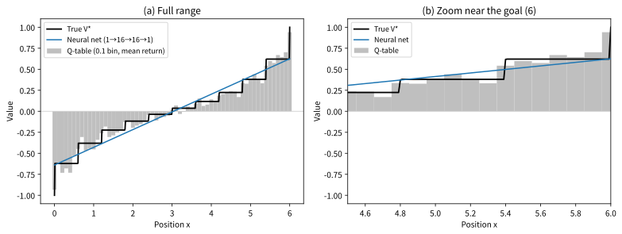

# 9.1 Q-테이블의 한계와 함수근사

[](https://colab.research.google.com/github/SuminHan/book-ml/blob/main/notebooks/ml2/chapter09_1_qnet_generalization.ipynb)

### Q-테이블이 감당 못 하는 규모

Chapter 6의 Q-learning은 `Q[s][a]`라는 **표**(테이블)에 모든 상태-행동
쌍의 값을 저장했다. 이건 상태가 몇백 개 수준일 때는 잘 작동하지만,
Atari 게임의 화면(가로세로 수백 픽셀, 색상 조합)이 만들어낼 수 있는
상태의 가짓수는 사실상 무한에 가깝다 — 테이블에 다 담을 수도 없고,
대부분의 상태는 학습 중에 단 한 번도 안 나타난다. Chapter 4.3에서 짚은
"바둑처럼 상태가 초천문학적으로 많으면 표로 저장하는 것 자체가
불가능하다"는 문제가 바로 여기서 실제로 닥친다.

"초천문학적으로 많다"가 정확히 어느 정도인지를 숫자로 셈해보자.
위 "가로세로 수백 픽셀"은 큰 게임의 경우를 막연히 떠올린
것이고, DQN 논문(Mnih et al., 2015)[^dqn]이 **실제로** 쓴 Atari
화면은 그것보다 훨씬 작은 84×84 픽셀의 **흑백** 이미지(각
픽셀 256가지 밝기)다. 이 **더 작은** 설정만으로 한 화면이
만들 수 있는 상태의 가짓수는

\\[256^{84 \times 84} = 256^{7{,}056} \approx 10^{16{,}993}\\]

이다. Chapter 15에서 언급한 바둑판의 경우의 수(\\(10^{172}\\))와
나란히 놓으면, Atari 상태 공간은 **바둑보다
\\(10^{16{,}800}\\)배 더 크다** — Chapter 4.3에서 "바둑처럼
\\(10^{170}\\) 수준이면 표로 저장하는 것 자체가 불가능하다"고
한 그 한계는, Atari에서는 지수 자체가 170에서 **16,993**으로
커진(\\(10^{170} \to 10^{16{,}993}\\)) 훨씬 심한 문제다.
관측 가능한 우주의 원자 수(\\(10^{80}\\)가량)는 말할 나위도
없다. 즉 Q-테이블의 문제는 "메모리가 조금 부족하다"가 아니라,
**원칙적으로** 불가능하다 — 어떤 기계에도 담을 수 없는 크기다.

더 절망적인 문제는 **규모**가 아니라 **방문**이다. 표가 담을 수
있더라도, 학습은 **만난 상태**만 갱신한다. 100만 에피소드를 아무리
돌려도 Atari에서 실제로 보이는 화면은 극히 일부 — 대다수 표 칸은
영원히 0(또는 초기값)으로 남아 있다. "칸이 비어 있다"는 것은
"그 상태의 Q값을 모름"이라는 뜻이고, 비어 있는 칸이 나온 순간
에이전트는 어림도 없는 숫자를 근거로 행동하게 된다.

참고로 표 기반 환경이라 해도 상태가 연속량이 섞이면 같은 문제가
온다. Chapter 1.3에서 소개한 CartPole의 상태
\\((x, \dot x, \theta, \dot\theta)\\)는 4개의 실수다. 실수를
"각 좌표를 12개 구간으로 잘라" 12등분(quantize)해서 표를 만들면
\\(12^4 = 20{,}736\\)칸 — 아직 견딜 만하다. 그런데 자르는 눈금을
12에서 100으로 올리면 \\(100^4 = 10^8\\)칸, 1000으로 올리면
\\(10^{12}\\)칸이 된다. 상태 공간의 크기가 눈금의 **4제곱**(차원
수만큼 거듭제곱)으로 커진다는 것은, 연속 상태에서는 어떤 눈금도
"표로 충분"하지 못하게 만드는 **차원의 저주**(curse of
dimensionality)다 — Chapter 1.1에서 "상태가 연속이면 →
함수근사(신경망)로 Q를 표현해야 한다"고 했던 바로 그
논의가, 여기에서 "왜"로 확장된 지점이다.

### 핵심 아이디어: 함수근사와 일반화

그렇다면 표의 역할을 하는 것을 **함수**로 바꾸면 어떨까. \\(Q^\*\\)
자신은 상태-행동마다 서로 다른 값을 주는 함수(매핑)인데, 그 매핑을
"표처럼 칸 칸이 아니라 **수식으로**" 표현할 수 있는 함수족
\\(Q(s,a;\theta)\\)(\\(\theta\\)는 가중치)로 근사하자는 것이다.
이를 **함수근사**(function approximation)라 부른다.

여기서 결정적인 이득이 하나 생긴다. 표는 "같은 칸"의 상태에서만
정보를 공유한다. 다른 칸의 상태끼리는 아무리 비슷해도 배운 것을
**아무것도** 전달하지 않는다. 함수는 다르다. 비슷한 입력은 비슷한
출력을 만든다면(함수가 매끄러우면), **한 번 본 상태**에서 배운 것이
**한 번도 본 적 없는 비슷한 상태**까지 자동으로 퍼져나간다. 이
퍼져나감을 **일반화**(generalization)라 부른다 — ML1에서
"학습 데이터에 없었던 새 입력에 대한 예측"으로 이미 본 바로 그
개념이다. "Atari에서 한 번도 본 적 없는 화면"도, 배운 화면들과
비슷한 곳이 있다면 그 근처의 Q값을 추론할 수 있다. **함수근사의
진짜 이유는 메모리가 아니라 바로 이 일반화다.** 표가 불가능한
"크기" 때문에가 아니라, **만나지 못한 상태**에 대한 답도 내야
하기 때문에 함수로 가야 하는 것이다.



이 그림은 이 절의 주장을 그대로 보여준다. 실습 노트북에 등장하는
**1차원 랜덤워크 장난감 환경**에서 \\(x \in [0,6]\\)이고, 각 스텝
±0.6 균일하게 움직이며, 0에 닿으면 −1·6에 닿으면 +1로
에피소드가 끝나고 \\(\gamma=0.9\\)다. **동일한** 300개
에피소드(시드 7)를 두 근사기에 각각 학습시켰다. Q-테이블은 0.1
간격 61칸으로 잘라서 각 칸마다 평균 리턴을 저장했고,
신경망(1→16→16→1 MLP, MSE)은 같은 데이터를 **연속 함수**로
배웠다.

- **본 적 있는 곳**: 두 근사기 모두 참값(\\(V^\*\\))에 꽤 가깝다.
  표는 "본 칸"에서 정확하다 — 이것이 표의 미덕이다.
- **본 적 없는 곳(칸과 칸 사이)**: 표는 그 칸의 값을 그대로
  답한다(보간이 없다 — 인접 칸의 정보를 전혀 쓰지 못한다).
  신경망은 매끄러운 곡선을 그린다 — **이 보간이 일반화다.**
- **본 적 없는 곳(표의 빈 칸)**: 표는 아예 답을 낼 수 없다
  (0으로 채우든, "미확인"이라고 하든). 신경망은 주변을 보고
  추론한다.

이 장난감은 1차원이어서 "칸과 칸 사이"가 극적으로 드러난다.
실제 Atari 상태 공간(수천 차원)에서는 표의 "칸과 칸 사이"가
**전체 공간의 거의 100**%다 — 그래서 일반화가 장난감이 아니라
필요 조건이 된다.

### Q-함수를 신경망으로 근사

DQN의 아이디어는 단순하다: 테이블 대신 **신경망**으로 \\(Q(s,a)\\)를
근사하자(\\(Q(s,a;\theta)\\), \\(\theta\\)는 신경망 가중치). 비슷한
화면(상태)은 신경망을 통해 비슷한 Q값을 내게 되므로, 한 번도 정확히 본
적 없는 상태에도 일반화(generalize)할 수 있다. 손실함수는 Chapter 6의
TD 오차를 제곱한 것이다:

\\[J(\theta) = \mathbb{E}\left[\left(r + \gamma \max\_{a'} Q(s',a';\theta) -
Q(s,a;\theta)\right)^2\right]\\]

이 손실을 최소화하도록 경사하강법(정확히는 역전파)으로 \\(\theta\\)를
갱신한다 — 지도학습과 형태는 같지만, "정답"에 해당하는 목표값
\\(r + \gamma \max\_{a'} Q(s',a';\theta)\\) 자체가 지금 학습 중인
\\(\theta\\)로 계산된다는 점이 다르다.

"같은 \\(\theta\\)가 두 곳에 다 나온다"는 점을 한 번 천천히
따라가자. (1) \\(Q(s,a;\theta)\\)는 **예측**이다. (2)
\\(\max\_{a'} Q(s',a';\theta)\\)는 **목표의 원료**다.
예측과 목표의 원료가 같은 \\(\theta\\)이므로, \\(\theta\\)를
갱신하면 예측이 목표에 가까워지는 **동시에 목표 자체도
움직인다**. 과녁이 쏠 때마다 도망가는 셈이다. 이 불안정성의
완화(타겟 네트워크)는 9.2절의 주제지만, **왜** 필요한지는 지금
이 식에서 이미 결정된다 — 이 절의 식을 "정답이 고정된
지도학습"으로 착각하면 안 되는 이유가 바로 이 둘째 항의
\\(\theta\\)다. (참고: 같은 \\(\theta\\)의 "예측"과 "목표
원료"는 9.2절의 타겟 네트워크가 \\(\theta^-\\)와 \\(\theta\\)
로 분리하는 바로 그 두 자리가 된다.)

```python
import torch
import torch.nn as nn

class QNetwork(nn.Module):
    def __init__(self, state_dim, n_actions):
        super().__init__()
        self.net = nn.Sequential(
            nn.Linear(state_dim, 64), nn.ReLU(),
            nn.Linear(64, 64), nn.ReLU(),
            nn.Linear(64, n_actions),
        )

    def forward(self, x):
        return self.net(x)
```

구조를 눈으로 따라가자. 입력은 상태 \\(s\\)(CartPole이면 4원
벡터, Atari면 84×84×1의 이미지에 CNN을 붙인 특징). 두 은닉층
(각 64 뉴런, ReLU)을 지나 **출력은 \\(|\mathcal A|\\)개** —
**각 행동을 하나의 출력(outlet)으로** 가진다. \\(a=0\\)번 출력이
\\(Q(s,0;\theta)\\), \\(a=1\\)번 출력이 \\(Q(s,1;\theta)\\)
다. **한 번의 순전파로 모든 행동을 동시에 평가**하므로,
\\(\max\_{a'} Q(s',a';\theta)\\)는 출력 벡터의 `.max()`
한 줄이다. (행동마다 다른 출력층을 따로 두고 싶은 유혹이 있지만,
공유된 은닉층이 "비슷한 상태를 비슷한 Q값으로" 만드는
**공통 특징 추출기** 역할을 하므로, "한 네트워크 - 여러 출력"
구조가 일반화의 핵심이다.)

**파라미터 수를 센다** — "함수근사"가 표보다 얼마나 작은
인지 체감하기 위해서. `QNetwork(4, 2)`(CartPole
크기)의 파라미터 수는

\\[\underbrace{(4 \times 64 + 64)}\_{\text{층 1}} +
\underbrace{(64 \times 64 + 64)}\_{\text{층 2}} +
\underbrace{(64 \times 2 + 2)}\_{\text{출력층}} = 4610\\]

다. **4,610개**의 숫자가 CartPole의 4차원 상태 공간 **전체**에서
Q함수를 정의한다. 반면 같은 환경에 12등분 표를 만들면 20,736칸이고
100등분이면 \\(10^8\\)칸이다. "10억 칸의 표"를 "4,610개의
가중치"로 대체한 셈이다 — **파라미터 수가 상태 공간의 크기와
무관하게(입력 차원에만 선형으로) 결정**된다는 것이 함수근사의
본질이다. (입력이 Atari 이미지 84×84 = 7,056원인 **완전연결**
QNetwork라면 \\(7056 \times 64 + 64 + 64 \times 64 + 64 +
64 \times 2 + 2 = 455{,}938\\)개 — "가능한 상태 수
\\(10^{16{,}993}\\)"에 비하면 여전히 미미하다. 단, 실제 DQN은 이
7,056원을 완전연결로 그대로 넣지 않고 **CNN을 앞단에 붙여** 특징
수백 개로 압축한 뒤 Q값을 예측한다 — ML1 Chapter 10의 CNN이
여기서 "화면 → 특징"의 압축기로 다시 등장한다.)

### 손으로 한 스텝: DQN 갱신을 숫자로

9.2절의 "움직이는 과녁" 예가 **목표값이 왜** 움직이는지를
보인다면, 이번에는 **한 스텝의 갱신 자체**가 어떤 숫자를
만들는지 CartPole(`gym.make("CartPole-v1")`[^gym], 시드 0)으로
끝까지 계산한다.

초기 상태(시드 0): \\(s\_0 = [0.0137, -0.0230, -0.0459, -0.0483]\\)
(\\(x, \dot x, \theta, \dot\theta\\)). 동작 \\(a = 1\\)(오른쪽
밀기)을 선택하면, 1스텝 후:

\\[s\_1 = [0.0132, 0.1727, -0.0469, -0.3552], \quad r = 1, \quad
\text{done} = 0\\]

(Chapter 6의 규칙 — 살아남으면 +1, 최대 리턴 500.)
신경망을 새로 초기화하고(`torch.manual_seed(0)`)[^pytorch], **아직 아무것도
배우지 않은** 이 네트워크로:

1. **예측**: \\(Q(s\_0, 1; \theta\_{\text{init}}) = 0.0020\\)
2. **목표 원료**: \\(\max\_{a'} Q(s\_1, a'; \theta\_{\text{init}})
   = 0.1509\\)
3. **목표값**: \\(r + \gamma \max\_{a'} Q(s\_1, a') = 1 + 0.99
   \times 0.1509 = \mathbf{1.1494}\\)
4. **TD 오차**: \\(\delta = 1.1494 - 0.0020 = 1.1474\\)
5. **그래디언트**: \\(\frac{\partial J}{\partial Q(s\_0,1)} = 2(Q -
   \text{target}) = 2(0.0020 - 1.1494) = \mathbf{-2.2948}\\)
6. **Adam 한 스텝**[^adam] (`lr = 10^{-3}`): \\(Q(s\_0, 1) : 0.0020
   \to 0.0260\\), 손실 \\(1.3165 \to 1.2620\\)

여섯 줄이 전부다 — 그리고 **각 줄이 Chapter 6의 표 Q-learning의
해당 줄과 1:1 대응한다**:

| 단계 | 표 Q-learning (Ch.6) | DQN (위 숫자) |
|---|---|---|
| 현재 값 | \\(Q(s,a)\\)(표 칸) = 0.0020 | \\(Q(s,a;\theta)\\) = 0.0020 |
| 목표값 | \\(r + \gamma \max\_{a'} Q(s',a')\\) = 1.1494 | 1.1494 |
| 갱신 | \\(Q \leftarrow Q + \alpha(\text{target} - Q)\\) | 경사하강(역전파) |
| 한 스텝 후 | \\(0.0020 \to 0.1167\\)(\\(\alpha=0.1\\)) | \\(0.0020 \to 0.0260\\) |

마지막 행이 핵심 비교다. **같은 현재 값 0.0020, 같은 목표값
1.1494**에서 출발했다. 표는 \\(\alpha = 0.1\\)을 쓰면 한 스텝에
**목표까지의 10**%를 채운다 — \\(0.0020 + 0.1 \times
1.1474 = 0.1167\\). DQN은 Adam(\\(lr=10^{-3}\\))이므로 한 스텝에
0.024만 움직였다. **둘은 "같은 방향"(목표에 가까워짐)으로
갱신되지만, 학습률이 "칸을 몇 % 접근하는가"가 아니라 "가중치를
얼마나 바꾸는가"를 결정**하므로, 표의 \\(\alpha\\)와 신경망의
\\(lr\\)을 같은 눈금으로 비교하면 안 된다(자주 하는 실수 참고).
표는 \\(0.0020 \to 0.1167 \to 0.2200 \to 0.3129 \to \cdots
\to 1.1494\\)로 지수적으로 접근한다(매 스텝 목표 잔여의 90%만
남는, \\(\alpha\\)-가중치 이동의 표준 모습). DQN도 결국 같은
고정점에 도달하려 하지만, 그 **속도와 방식**(가중치 경사 +
Adam의 적응)이 다르다.

이 "동일한 목표값"이라는 사실은 중요하다. DQN이 표와 **다른
것**은 목표값의 **계산식**이 아니라 **저장·갱신 메커니즘**이다.
9.2·9.3절의 모든 장치(타겟 네트워크, 경험 재현)는 이 메커니즘이
신경망이라는 데서 오는 **불안정성**을 다루는 것이지, Q-learning
알고리즘 자체를 바꾸는 것이 아니다.

### 역사: 함수근사 강화학습은 DQN에서 처음이 아니다

"DQN = Q-테이블을 신경망으로 바꾼 것"이 전부라면, DQN은
2015년 딥마인드의 발명품으로 끝난다. 하지만 **함수근사
강화학습**(function approximation RL)은 그보다 30년 앞서
이미 성숙한 분야였다. 1990년, **Gerald Tesauro**는 TD(λ)(Chapter 7.2)를
**신경망**에 결합한 **TD-GAMMON**[^tesauro]으로 백갬보(backgammon)를
사람 못지않게 잘 두는 시스템을 만들었다 — "표 대신
신경망으로 가치함수를 배운다"는 이 절의 아이디어가
**실제로 동작**한다는 것을 25년 전에 보여준 것이다. 이후
Sutton·Barto(1998)의 저서 *Reinforcement Learning: An
Introduction*[^suttonbarto]는 "값함수를 근사하는 방법"을 RL의 정규
(standard) 장으로 정리했고, 1990년대~2000년대 초반에는
**선형 함수근사**(특징 벡터 \\(\phi(s,a)^\\top w\\))나
**RBF·커널** 같은 다양한 근사기가 체스·로봇에서
쓰였다.

그런데 이 30년 동안 **비선형(신경망) 함수근사 RL은
실전에 거의 쓰이지 못했다**. 이유는 지금 배운 바로 그
불안정성이다 — 목표값이 움직이고(9.2절의 "움직이는
과녁"), 데이터가 상관되고(9.3절의 경험 재현),
부트스트랩이 자기 자신의 오차를 증폭시키기(Chapter 3의
"자기 예측을 목표로 쓰는" 문제) 때문이다. **DQN(Mnih
et al., 2015, Nature)의 진짜 기여는 "신경망을 붙였다"가
아니라, 9.2·9.3절에서 배울 두 개의 공학적
장치(타겟 네트워크 + 경험 재현)를 조합해서 이
불안정성을 사실상 제어**한 것이다 — "이론적으로 가능하지만
실제로는 안 되는" 문제를 "실제로 돌아가게 만든"
공학의 승리였다. (이 승리의 대가 — **26종 Atari 게임에
사람 수준의 점수** — 가 이 절의 "함수근사 + 일반화"가
왜 Atari라는 특수한 무대에서 폭발했는지의 답이다:
**화면이 10^16,993개의 상태 공간이지만, *게임 규칙*이라는
구조 덕분에 실제로 중요한 상태는 "공이 라켓 근처에
있는가, 벽에 부딪히기 직전인가" 같은 몇십 가지
패턴으로 압축**된다. 일반화는 이 "패턴"을 잡아내는
기계다.) [^cs234]

### 확인 문제

1. **표 vs 함수근사 — "본 적 없는 상태"에 대한 답.**
   CartPole 상태 \\(s = [0.5, 0.0, 0.1, 0.0]\\)를 **한 번도**
   학습에서 만나지 않았다고 하자. (a) 12등분 Q-테이블은 이
   \\(s\\)에 대해 무엇을 답하는가? (b) `QNetwork(4, 2)`로
   학습한 DQN은 무엇을 답하는가? 각각 "이 답의 신뢰도는
   어느 정도인가"를 한 문장으로 논평하라. (힌트: (a)는
   "그 칸을 본 적이 있는가"에 따라, (b)는 "주변의
   \\(s'\\)에서 배운 것을 얼마나 믿을 수 있는가"에 따라
   답이 갈린다.)

2. **출력 수 vs 행동 수.** `QNetwork(4, 2)`의
   출력층은 왜 2(= \\(|\mathcal A|\\))개이고, 1개가
   아님을 논증하라. (힌트: \\(\max\_{a'} Q(s',a')\\)를
   계산하려면 모든 \\(a'\\)의 Q값을 **동시에** 봐야
   하는데, 출력 1개로는 가능한가? "출력 1개 + 행동을 입력에
   넣는다"는 대안은 왜 비효율적인가?)

3. **같은 목표, 다른 갱신.** "손으로 한 스텝"의 예에서,
   표 Q-learning(\\(\alpha = 0.1\\))이 10스텝 반복하면
   \\(Q \to 1.1494\\)에 거의 도달한다(\\(0.9^{10}
   \approx 0.35\\) 잔류). DQN(Adam, \\(lr=10^{-3}\\))이
   **같은 10스텝**을 반복하면 어느 정도 도달할까?
   (a) 표보다 빠를까, 느릴까? (b) "DQN이 표보다 느리다"는
   결론을 일반화할 수 있는가 — 어떤 요인이 결론을
   뒤집을 수 있는가? (힌트: Adam은 학습률을 **자동
   조정**한다 — "\\(lr\\)이 작다"는 "느리다"를
   의미하지는 않는다.)

4. **파라미터 수 계산.** `QNetwork(4, 2)`의
   4,610을 **직접** 계층별 곱셈/덧셈으로 유도하라
   (힌트: `nn.Linear(in, out)`의 파라미터 수는
   \\(in \times out + out\\) — 가중치 \\(in \times
   out\\) + 바이어스 \\(out\\)). 그리고 "이 4,610개
   파라미터가 **CartPole의 20,736칸(12등분) 표보다
   효율적인가**"를 **한 문장**으로 답하라. (힌트:
   "효율"의 기준을 **표의 칸 수**가 아니라
   **"보지 못한 상태에 대한 일반화**"로 잡아야
   하는 이유를 떠올려라.)

5. **차원의 저주 숫자.** CartPole 상태를 4개 좌표 각각
   10등분하면 \\(10^4 = 10{,}000\\)칸, 100등분하면
   \\(10^8\\)칸이다. (a) Atari 84×84×1 화면을 **각
   픽셀 256단계**로 표를 만들면 몇 칸인가
   (로그로 답해도 된다)? (b) "Atari 상태 공간은
   \\(10^{50{,}978}\\)지만, **실제 게임에서
   나오는 화면**은 그 중 극히 일부"라는
   주장이 성립하려면, "실제 게임에서 나오는
   화면"의 가짓수가 Atari 상태 공간의
   **비율**로 얼마나 작아야 하는가 — 이 비율을
   "의미 있는 상한"으로 제한할 수 있는가?

### 자주 하는 실수

- **"DQN의 \\(lr\\)와 표 Q-learning의 \\(\alpha\\)를
  같은 스케일로 비교하는 것."** 표의 \\(\alpha = 0.1\\)은
  "목표값에 10% 접근"이라는 **값 단위**의 학습률이고,
  DQN의 `Adam(lr=1e-3)`는 "가중치를 0.001 정도
  이동"이라는 **가중치 단위**의 학습률이다. "DQN의
  \\(lr\\)이 0.001로 너무 작다, 표처럼 0.1로 올려보자"는
  실수는 **단위가 다르므로** 거의 항상 발산이나 폭주로
  이어진다. 비교하려면 "목표값에 접근하는 속도"를
  **측정**해서 맞춘다 — 9.3절의 학습곡선에서 이 차이를
  직접 보게 된다.

- **"출력 1개로 \\(Q(s,a)\\)를 출력하려 하는 것."**
  "입력에 행동을 추가해서 1출력"으로 하면
  \\(\max\_{a'}\\)를 계산할 때 \\(|\mathcal A|\\)번
  순전파를 해야 한다. "출력 \\(|\mathcal A|\\)개" 구조는
  **한 번**의 순전파로 모든 행동을 평가한다. Atari
  (\\(|\mathcal A| = 18\\))이면 18배의 계산 차이 —
  **출력 수 = 행동 수**가 DQN의 표준 구조인 이유다.

- **"비슷해 보이는 두 상태가 반드시 비슷한 Q값을
  가진다고 가정하는 것."** 일반화는 "비슷한 입력 →
  비슷한 출력"이라는 **가정** 위에 서 있다. 그런데
  Atari에서 **한 픽셀**이 바뀌면 점수가 완전히
  달라지는 상태(예: 공이 라켓을 스치느냐 아니냐)가
  존재한다. 이 경우 "1픽셀 차이"는 Q값으로
  수백 차이로 연결된다 — **함수가 매끄럽지 않다**는
  뜻이고, 일반화가 **실패**할 수 있다. DQN이 "대부분
  잘 된다"는 것은 이 실패가 **희박**해서이지,
  "보장"되어서가 아니다. (이런
  "국소적으로 불연속"인 Q함수에서
  \\(\max\_{a'}\\) 연산은 더 큰 Q값의
  오차가 더 크게 증폭되게 만든다 — 9.2·
  9.3절의 안정화 장치가 다루는 문제군과
  같은 뿌리다.)

- **"'초기값이 0이니까 처음엔 아무것도 모름'
  이라고 착각하는 것."** "손으로 한 스텝"에서
  봤듯이, 초기화 직후 네트워크는 0이 아니라
  **이미 "어떤 값"을 가진다** —
  \\(Q(s\_0,0) = 0.1368\\),
  \\(Q(s\_0,1) = 0.0020\\)(무작위 초기화).
  "초기 Q값이 0이면 모든 행동을 동등하게
  대우한다"는 직관은 **틀리다** — 초기값은
  0이 아니라 **무작위**이므로, 같은 상태에서도
  **시드마다** 다른 Q값을 가지게 되고, 이
  초기값의 무작위성이 DQN이 **어떤**
  행동을 먼저 탐험할지를 결정한다(9.3절의
  \\(\varepsilon\\) 탐색과 겹치는 문제).

### 자주 묻는 질문

**Q. 함수근사가 Chapter 14.1(PCA)이나 Chapter 14.2(word2vec)[^word2vec]의
"압축"과 비슷한 개념인가요?** 방향은 비슷하다 — 둘 다 "고차원(또는
셀 수 없이 많은) 원본을 더 다루기 쉬운 형태로 압축한다"는 점에서
같은 정신을 공유한다. 다만 PCA·word2vec은 데이터의 구조를 보존하는
표현을 찾는 게 목표(비지도)였다면, DQN의 신경망은 "Q값을 정확히
예측한다"는 지도학습에 가까운 목표를 위해 상태를 압축한다는 차이가
있다.

**Q. `nn.Linear(state_dim, 64)`처럼 은닉층 크기(64)는 어떻게
정하나요?** Chapter 9(ML1)의 은닉층 뉴런 수와 같은 종류의
하이퍼파라미터다 — 너무 작으면 복잡한 Q함수를 표현할 표현력이
부족하고, 너무 크면 과적합·계산 비용 문제가 커진다. Atari처럼
입력이 이미지라면 완전연결층 대신 ML1 Chapter 10의 CNN을 앞단에
붙여 이미지에서 특징을 뽑은 뒤 그 특징으로 Q값을 예측한다.

**Q. "함수근사"는 Q-함수에만 쓰이는 건가요?** 아니다 —
함수근사는 **어떤 값함수나 정책함수를** 표가 아닌
**매개변수화된 함수족**으로 표현하는 모든 방법이다.
9.1절의 DQN은 Q-함수를 근사하지만, 9.3절의 정책기반
방법(Chapter 10~11의 REINFORCE·PPO[^ppo])은 **정책
\\(\pi(a|s)\\) 자체**를 신경망으로 근사한다. "어떤
함수를" 근사하는가가 바뀌지만, "표 → 매개변수화된
함수"라는 **구조**는 동일하다. (ML1의 모든 회귀/분류
모델은 "입력 → 출력" 함수를 근사하는 함수근사다 —
차이점은 **근사할 대상이 강화학습의 가치/정책이라는
점**뿐이다.)

**Q. 일반화가 "보지 못한 상태에 대한 예측"이라면,
과적합(overfitting)과 대척점에 있는 개념인가요?**
맞다 — ML1에서 "훈련 데이터에만 맞고 새로운
데이터에서는 떨어진다"는 과적합의 **정 반대**가
일반화다. DQN에서도 이 긴장관계가 그대로
존재한다: **너무 작은** 신경망은 Q함수의 복잡도를
포착하지 못해 **부족 적합(underfitting)**,
**너무 큰** 신경망은 배운 상태에 과잉으로
맞아 **보지 못한 상태에서 오히려 더 나빠진다**
(과적합). 9.3절에서 "너무 큰 DQN이 CartPole에서
더 느리다"는 실험을 직접 해볼 수 있다.

**Q. "함수근사"와 "비표 기반(non-table)"이
같은 말인가요?** 사실상 같다 — "표 기반
(table-based)"은 **각 상태-행동 쌍을
별개의 파라미터**(표 칸)로 가지는 것을 말하고,
"비표 기반"은 **파라미터를 공유하는
함수**로 표현하는 것을 말한다. "함수근사"는
**비표 기반의 대표 사례**(신경망)를 가리키는
말이다. (비표 기반이지만 신경망이 아닌 것도
있다 — 선형 회귀, 결정 트리, RBF 등.
DQN은 이 중 **신경망**을 고른 것이다.)

[^dqn]: Mnih, V. et al. (2015). "Human-level control through deep reinforcement learning." Nature 518, 529–533. (Earlier preprint: Mnih, V. et al. (2013). arXiv:1312.5602.)
[^adam]: Kingma, D. P., Ba, J. (2014). "Adam: A Method for Stochastic Optimization." arXiv:1412.6980. (ICML 2015)
[^suttonbarto]: Sutton, R. S., Barto, A. G. (2018). "Reinforcement Learning: An Introduction" (2nd ed.). MIT Press. 저자 공식 무료 공개: http://incompleteideas.net/book/the-book-2nd.html
[^cs234]: 이 절의 주제(함수근사 강화학습, DQN)를 더 깊이 다루는 자료: Stanford CS234: Reinforcement Learning. https://web.stanford.edu/class/cs234/
[^word2vec]: Mikolov, T., Chen, K., Corrado, G., Dean, J. (2013). "Efficient Estimation of Word Representations in Vector Space." arXiv:1301.3781.
[^ppo]: Schulman, J. et al. (2017). "Proximal Policy Optimization Algorithms." arXiv:1707.06347.
[^gym]: Brockman, G., Cheung, V., Pettersson, L., Schneider, J., Schulman, J., Tang, J., Zaremba, W. (2016). "OpenAI Gym." arXiv:1606.01540.
[^pytorch]: Paszke, A. et al. (2019). "PyTorch: An Imperative Style, High-Performance Deep Learning Library." NeurIPS 2019. arXiv:1912.01703.
[^tesauro]: Tesauro, G. (1995). "TD-Gammon, a Self-Teaching Backgammon Program, Achieves Master-Level Play." Communications of the ACM 38(3), 58–68.
