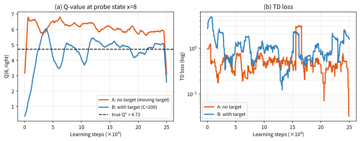
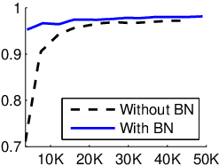

# 9.2 DQN의 안정화 장치와 실습

[](https://colab.research.google.com/github/SuminHan/book-ml/blob/main/notebooks/ml2/chapter09_2_target_network.ipynb)

지난 절(9.1)에서 DQN의 손실함수는 지도학습의 회귀 손실과 **형태가 똑같다**는 것을
보았지만, 핵심 차이는 하나였다 — **"정답"(목표값)이 매 스텝 스스로 바뀌는 것**.
이 절은 그 문제를 본격적으로 해결하는 주전장이다. DQN을 가능하게 한 두 장치
— **문제 1: 움직이는 목표 → 타겟 네트워크(이 절의 주제**)와 **문제 2: 상관된
데이터 → 경험 재현(9.3절)** — 중 첫 번째를 다룬다. 그리고 실습 실험을 통해
"움직이는 목표"가 실제로 학습을 어떻게 변질시키는지를 숫자와 그래프로 확인하고,
그 실험이 건져 올린 **세 번째 문제(과대추정)의 실마리**를 9.3절의
Double DQN으로 이어갈 고리를 남긴다.

### 문제 1: 목표가 계속 움직인다

\\(\theta\\)가 매 스텝 갱신되면, 손실함수의 목표값도 매 스텝 바뀐다 —
지도학습이라면 정답 \\(y\\)는 절대 안 바뀌는데, 여기선 "정답"이
스스로를 쫓아다니는 셈이다. 이는 학습을 불안정하게 만든다(진동, 발산).

**해결책: 타겟 네트워크**(Target Network). \\(Q\\)와 똑같은 구조를
가진 두 번째 신경망 \\(Q(s,a;\theta^-)\\)를 두고, 목표값 계산에는
**이 타겟 네트워크만** 쓴다:

\\[J(\theta) = \mathbb{E}\left[\left(r + \gamma \max\_{a'} Q(s',a';\theta^-) -
Q(s,a;\theta)\right)^2\right]\\]

\\(\theta^-\\)는 매 스텝 갱신되지 않고, 일정 주기마다(예: 1000
스텝마다) \\(\theta\\)의 현재 값으로 통째로 복사된다. 그 사이 구간
동안 목표값은 고정돼 있으므로, 손실함수는(짧은 구간 동안은) 지도학습과
똑같이 "정답이 고정된" 최적화 문제가 된다 — 움직이는 과녁을 고정시킨
셈이다.

```python
def dqn_loss(Q_net, target_net, states, actions, rewards, next_states, dones, gamma):
    q_pred = Q_net(states).gather(1, actions.unsqueeze(1)).squeeze(1)
    with torch.no_grad():
        q_next = target_net(next_states).max(dim=1).values
        target = rewards + gamma * q_next * (1 - dones)
    return ((target - q_pred) ** 2).mean()
```


코드 속 두 줄을 9.1절과 대응시켜 천천히 보자. `q_pred`는 **예측**
\\(Q(s,a;\theta)\\)이고, `q_next`는 **목표의 원료**
\\(\max\_{a'} Q(s',a';\theta^-)\\)다 — 9.1절의 "같은 \\(\theta\\)가
두 자리에 들어가는" 식에서, \\(\theta\\)와 \\(\theta^-\\)로 분리된
바로 그 두 자리다. `torch.no_grad()` 블록이 하는 일은 두 가지다.
(1) 목표값 계산에 계산도구를 짓지 않으므로 메모리·계산이 절약되고,
(2) **이 스텝의 최적화 문제에서 목표값은 상수**가 된다 — 그래디언트가
타겟 네트워크의 가중치로 흘러가지 않으므로, `backward()`가 건드릴
수 있는 것은 \\(\theta\\) 쪽뿐이다. 이 "상수 취급"이 없으면,
손실을 줄이려는 그래디언트가 "예측을 목표로 당기는" 것뿐 아니라
**"목표를 예측 쪽으로 당기는"** 경로도 만들어버려(목표 자체가
미분가능한 입력값이므로), 움직이는 과녁 문제가 미분 구조까지
새어 들어온다.

**한 스텝 갱신을 숫자로** — 이제 손실함수가 정말 "정답 고정"
최적화인지, 미분으로 확인해보자. 목표값을 상수 \\(T\\)로 놓으면
(미니배치 한 행에 대해, 예측은 스칼라로 단순화):

\\[\frac{\partial L}{\partial Q(s,a;\theta)} = 2\big(Q(s,a;\theta) -
\underbrace{T}\_{r + \gamma \max\_{a'} Q(s',a';\theta^-),\ \theta\ \text{에 대해 상수}}\big)\\]

그래디언트가 정확히 **"갭을 줄이는 방향**"을 가리킨다 — 지도학습의
회귀 손실 \\((\hat{y} - y)^2\\)과 동일한 형태다. (표 Q-learning과
"한 스텝 갱신의 크기"가 어떻게 다른지 — 표는 목표 잔여의 \\(\alpha\\)
배를 채우고, 신경망은 가중치를 \\(lr\\)만큼 옮긴다 — 은 9.1절의
"손으로 한 스텝"에서 이미 비교했다. 여기서 추가된 것은 **갱신의
*방향*이 이제 잘 정의된다는 사실**이다.)

### 손으로 한 번: "움직이는 과녁"을 숫자로 확인하기

아주 단순화한 1차원 장난감(\\(Q(s,a;\theta)=\theta\\), \\(r=1\\),
\\(\gamma=0.99\\))으로, 타겟 네트워크가 없을 때 목표값이 실제로
계속 바뀌는 것을 확인해보자. 학습이 진행되며 \\(\theta\\)가
\\(0 \to 0.5 \to 0.9\\)로 변한다고 하면:

\\[\text{타겟 네트워크 없이}: \quad r+\gamma\theta = 1{+}0.99{\times}0
= 1.0, \quad 1{+}0.99{\times}0.5 \approx 1.495, \quad
1{+}0.99{\times}0.9 \approx 1.891\\]

환경이나 보상은 전혀 안 바뀌었는데도, \\(\theta\\)가 갱신될 때마다
목표값 자체가 1.0 → 1.495 → 1.891로 계속 움직인다 — 신경망이
"방금 막 도달한 목표"를 향해 갱신했더니, 그 갱신 때문에 목표
자체가 더 멀리 도망가버리는 셈이다. 같은 상황을 타겟 네트워크로
다시 보면, \\(\theta^-\\)가 \\(\theta\_0=0\\)에 고정돼 있으므로
두 번의 갱신 동안 목표값은 **정확히 1.0으로 그대로**다. 신경망이
그 사이 동안은 "고정된 정답"을 향해 안정적으로 수렴할 수 있는
이유가 바로 이 숫자 하나로 설명된다.

**왜 "가까워질수록 더 멀어지는가"** — 1.0 → 1.495 → 1.891이라는
세 숫자는 자기 가속(self-accelerating) 구조를 가진다. \\(\theta\\)가
목표에 가까워질수록 \\(\theta\\) 자체는 커지고, \\(\theta\\)가 커질수록
목표는 더 멀리 도망간다. 스텝의 크기가 충분히 크면 이 양의
피드백이 **진동** 또는 **발산**으로 커진다 — "DQN을 돌려보면 가끔은
잘 되고, 가끔은 손실이 폭주한다"는 초기 경험의 주된 원인이 바로 이
메커니즘이다. 타겟 네트워크가 있는 경우는 다르다. \\(\theta^-\\)
동기화라는 "벽"이 \\(C\\)스텝마다 한 장씩 쳐지므로, 그 사이에는
목표가 \\(\theta\\)의 현재값과 무관하게 고정돼 있다.

**목표는 얼마나 "낡아도" 되는가.** 하드 업데이트는 \\(C\\)스텝
마다 \\(\theta\\)를 통째로 복사한다(DQN 원논문의 Atari 실험에서는
\\(C = 10{,}000\\)). 두 동기화 사이에서 목표는 동결되지만, 그만큼
\\(\theta\\)가 \\(\theta^-\\)와 최대로 약 \\(C\\)스텝 만큼 벌어질
수 있다 — **목표는 고작 \\(C\\)스텝 "낡은" 값**일 수 있다는 뜻이다.
안정성은 이 "느림"의 대가로 산 것이다. 적절한 \\(C\\)는 환경의
규모에 따라 다르다(9.3절 CartPole에서는 100, Atari급은 10,000) —
\\(\alpha\\), \\(lr\\)와 마찬가지로 **튜닝 대상의 하이퍼파라미터**다.

### 움직이는 목표를 정량화: "오차 수명" \\(1/(1-\gamma)\\)

"목표가 움직인다"가 왜 "조금의 떨림"이 아니라 **구조적 문제**인지,
오차가 어떻게 증식하는지 보고 싶다. 두 관점이 있다.

**(1) 할인율 자체가 오차의 수명을 정한다.** 미래의 오차는
\\(\gamma^k\\)만큼 할인되어 현재로 전해진다. "신뢰할 수 있는
미래"의 길이는 사실상 \\(1/(1-\gamma)\\)스텝이다:

| \\(\gamma\\) | 오차 수명 \\(1/(1-\gamma)\\) | 오차 반감기 \\(\log 0.5 / \log \gamma\\) |
|---|---|---|
| 0.9 | 10 스텝 | 약 7 스텝 |
| 0.99 | 100 스텝 | 약 69 스텝 |
| 0.999 | 1,000 스텝 | 약 693 스텝 |

\\(\gamma = 0.99\\)이면 **100스텝 앞의 상태의 오차가 현재 목표에
거의 그대로 반영**된다. 목표값이 100스텝 앞의 \\(Q\\)추정에서
만들어지는 셈인데, 그 100스텝 앞의 추정이 지금 이 순간에 갱신되고
있다면 — 목표는 "자신이 100스텝 전에 계산했을 때의 자신"을
따르게 된다.

**(2) 피드백 루프가 끊기지 않는다.** 타겟 네트워크가 없으면,
현재 추정치의 오차 \\(\varepsilon\\)가 이번 스텝의 목표에
들어가서, 그 목표가 다시 현재 추정치를 끌어당기고, 갱신된 추정치의
오차가 다음 목표에 또 들어간다. "오차 → 목표 → 추정 → 오차"의
루프가 매 스텝 **닫혀 있고**, 그 감쇠는 작은 숫자
\\((1-\gamma)\\)에 비례한다. \\(\gamma = 0.99\\)면 루프가
한 스텝에 겨우 1%만 감쇠한다는 뜻이다.

타겟 네트워크는 이 루프를 \\(C\\)스텝 구간 동안 **물리적으로
자른다** — 목표는 과거의 스냅샷(\\(\theta^-\\))이므로,
\\(\theta\\)의 현재 오차가 목표에 반영되는 통로가 없다.
"움직이는 과녁" 문제가 "고정된 과녁 + C스텝마다 과녁 교체"
문제로 변하는 순간, 최적화 문제가 지도학습의 형태를 되찾는다.

### DQN 알고리즘 전체: 코드를 조립하다

이제 9.1절의 `QNetwork`와 이 절의 `dqn_loss`, 9.3절에서
상세히 다룰 `ReplayBuffer`를 하나로 조립해보자. 학습 루프 전체는
의외로 단순하다:

```python
import random
import torch

def dqn_train(env, n_episodes, max_steps, batch_size=32, gamma=0.99,
              lr=1e-3, update_freq=100, eps_start=1.0, eps_min=0.05,
              eps_decay=0.995):
    Q_net = QNetwork(env.state_dim, env.n_actions)          # 9.1절의 네트워크
    target_net = QNetwork(env.state_dim, env.n_actions)
    target_net.load_state_dict(Q_net.state_dict())          # 처음엔 둘이 동일
    optimizer = torch.optim.Adam(Q_net.parameters(), lr=lr) # Q_net만! 타겟은 학습 안 함
    buffer = ReplayBuffer(capacity=10000)                   # 9.3절의 재현 버퍼

    step_id = 0
    for ep in range(n_episodes):
        eps = max(eps_min, eps_start * eps_decay ** ep)     # ε-greedy, 에피소드마다 감소
        s, done, total = env.reset(), False, 0.0
        for t in range(max_steps):
            if random.random() < eps:
                a = random.randrange(env.n_actions)         # 탐험
            else:
                with torch.no_grad():
                    a = int(Q_net(torch.tensor([s], dtype=torch.float32))
                            .argmax(dim=1).item())          # 착취
            s2, r, done = env.step(a)
            buffer.push((s, a, r, s2, float(done)))
            if len(buffer) >= batch_size:                   # 버퍼가 어느 정도 차면 학습 시작
                batch = buffer.sample(batch_size)
                states = torch.tensor([b[0] for b in batch], dtype=torch.float32)
                actions = torch.tensor([b[1] for b in batch])
                rewards = torch.tensor([b[2] for b in batch], dtype=torch.float32)
                next_states = torch.tensor([b[3] for b in batch], dtype=torch.float32)
                dones = torch.tensor([b[4] for b in batch], dtype=torch.float32)
                loss = dqn_loss(Q_net, target_net, states, actions,
                                rewards, next_states, dones, gamma)
                optimizer.zero_grad()
                loss.backward()
                optimizer.step()
            if step_id % update_freq == 0:                  # 타겟 네트워크: C스텝마다 하드 업데이트
                target_net.load_state_dict(Q_net.state_dict())
            s, step_id, total = s2, step_id + 1, total + r
            if done:
                break
        print(f"episode {ep + 1}: 리턴 {total:.0f}")
        s = env.reset()
    return Q_net
```

하이퍼파라미터를 하나씩 짚자. **`lr=1e-3` + Adam**[^adam] — DQN의
표준 시작점. (표 Q-learning의 \\(\alpha\\)와 단위 비교 실수는
9.1절 "자주 하는 실수" 참고.) **`update_freq=100`** — 타겟
네트워크의 \\(C\\). 이 절의 주제다. **`eps_decay=0.995`** —
\\(\varepsilon\\)-greedy(Chapter 2)[^silvercourse]를 에피소드마다 0.995배
줄여, "처음엔 탐색, 끝엔 착취"로. **`batch_size=32`** — RL에서는
작은 배치가 일반적이다. 배치가 크면 큰 배치가 "독립·다양한
샘플"이라는 가정을 더 잘 만족할 것 같지만, 오프폴리시 버퍼에서
뽑힌 샘플은 원래 서로 다른 정책 시대의 경험을 섞고 있고,
메모리도 배로 든다. **`capacity=10000`** — 재현 버퍼의 크기.
일반적으로 클수록 좋다(9.3절에서 왜인지를 다룬다).

이 루프의 한 줄 한 줄이 어느 장에서 왔는지 보면, DQN이 "새로운
알고리즘"이 아니라 **Q-learning(Chapter 6) + 함수근사(9.1) + 두
개의 안정화 장치(9.2·9.3**)의 조립체라는 것이 드러난다.

### 역사: "오래된 목표"는 DQN보다 오래된 아이디어

"목표는 갱신 *직전*의 값으로 계산한다"는 규칙은 표 기반 TD
업데이트부터 있었다. Chapter 6의 Q-learning 갱신:

\\[Q(s,a) \leftarrow Q(s,a) + \alpha\big(r + \gamma \max\_{a'}
Q(s',a') - Q(s,a)\big)\\]

우변의 \\(Q(s',a')\\)는 **갱신 전** 값이다 — 코드로 쓰면
`target = r + gamma * Q[s2][a2]`를 *먼저* 계산하고 나서야
`Q[s][a] += ...`를 쓰는, 그 순서 하나다. 표에서는 이 규칙이
**보이지 않는다** — 각 칸이 독립 파라미터라서 "갱신 전 값"과
"갱신 후 값"의 차이는 그 칸 하나에 불과하다. 그런데 신경망에서는
모든 칸(상태)이 **같은 \\(\theta\\)를 공유**하므로, "읽는 시점"과
"갱신 시점"의 차이는 *함수 전체*의 차이다. \\(\theta\\)와
\\(\theta^-\\)의 분리는, 표 방식의 이 한 줄 규칙을 **독립
파라미터로 명시적으로 쓴 것**에 불과한 셈이다.

수학적으로는 1990년 **Tesauro의 TD-GAMMON**(백갬몬)이 먼저
다섯었다 — 신경망 + TD(\\(\lambda\\))를 자기 대결(self-play)로
학습시킨 이 시스템은, 바로 이 "목표가 움직인다"는 불안정성을
실제로 겪었고, 당시 쓰던 완화책이 "목표 계산용 네트워크를
덜 자주 갱신한다"는 것이었다. Sutton & Barto(1998)의 저서는
이것을 "지연된(damped) 목표"로 정리했다[^suttonbarto]. 그리고 2013년
딥마인드의 DQN(Mnih et al., 2015년 Nature에 게재)[^dqn]이 **타겟
네트워크 + 경험 재현**의 조합으로 이 불안정성을 사실상 제어하며
"26개 Atari 게임에서 사람 수준"의 결과를 만들었다 — 9.1절에서
말했듯, DQN의 기여는 "신경망을 붙였다"가 아니라 **이 두 장치를
조립해서 실제로 돌아가게 만든 것**이다.

"하드/소프트 업데이트"의 이름도 각기 뿌리가 다르다. 하드
업데이트("주기적으로 통째로 복사")는 표의 "갱신 전 값" 규칙의
자연스러운 확장이고, 소프트웨어 \\(\theta^- \leftarrow
\tau\theta + (1-\tau)\theta^-\\)는 1960년대 확률근사
(stochastic approximation) 문헌의 **Polyak averaging**에서
온 이름이다. 두 방식은 2018년 **Rainbow** 논문(Hessel et al.)[^rainbow]에서
"극단 \\(\tau\\) vs 극단 주기"라는 하나의 스펙트럼으로 통합
정리되며, 연속제어 계열의 DQN 변형(DDPG 계열)[^ddpg]에서는 소프트
업데이트(\\(\tau = 10^{-3} \sim 10^{-2}\\))가 사실상 표준이
되었다.

### 실습: 움직이는 목표는 학습을 실제로 얼마나 변질시키는가?

"불안정하다"는 말이 *얼마나* 나쁜지, 작은 DQN 실험으로 정량적으로
확인하자. 타겟 네트워크의 효과를 **격리**하기 위해 의도적으로
최소한의 설정을 쓴다: 경험 재현 *없이*(온-폴리시, 1스텝마다 학습
— 재현의 효과는 9.3절의 몫), 시드 1개, 작은 환경. 실험 설계가
"완벽한 DQN"이 아니라 **통제된 대조 실험**이라는 점을 꼭 기억하자.

**환경: 1차원 랜덤워크.** 이 절의 실습 환경은 Gymnasium[^gymnasium]
스타일 격자 MDP(ML2 Chapter 3)에서 빌려온 관습이다. 상태 \\(x \in \\{0, 1, \dots, 12\\}\\).
행동은 왼쪽/오른쪽. 행동대로 한 칸 이동할 확률 0.9, 반대 방향으로
미끄러질 확률 0.1(경계에서는 막힌다). 보상: 매 스텝 \\(-1\\)
(시간 비용), \\(x = 12\\)에 도달하면 \\(+10\\)와 종료(**목표**),
\\(x = 0\\)에 도달하면 \\(-10\\)와 종료(**위험**).
\\(\gamma = 0.99\\). 탐침 상태는 **\\(x = 8\\)** — 목표 근처라
왼쪽/오른쪽의 Q 차이가 크고, 편향 효과가 선명하게 드러난다.

**참값은 값반복(value iteration)으로 구한다.** 이 13상태 MDP의
참값 \\(Q^{\*}\\)는 벨만 방정식의 고정점으로, 5,000회 반복
이면 완전히 수렴한다:

\\[Q^{\*}(8, \text{오른쪽}) = 4.720, \qquad Q^{\*}(8, \text{왼쪽})
= 2.642\\]

\\(x = 8\\)에서는 오른쪽(목표 방향)이 최적이고, 이점(advantage)은
약 2.08이다 — "학습이 끝났을 때 어느 쪽이 맞는지"를 숫자로
판정할 기준이다.

**실험 설정.** 1→16→16→2 신경망, Adam \\(lr = 10^{-2}\\),
\\(\varepsilon = 0.1\\) 고정, 25,000스텝. 두 팔(arm)은
**타겟만** 다르다: **(A) 타겟 네트워크 없음** — 목표값을
현재 \\(\theta\\)로 계산(9.1절 식 그대로), **(B) 타겟
네트워크 있음** — 하드 업데이트 \\(C = 200\\).

결과(시드 0, 탐침 상태 \\(x=8\\)의 Q값):

| | 최종 \\(Q(8, \text{오른쪽})\\) | 참값(4.720) 대비 | TD 손실(마지막 100샘플 평균) |
|---|---|---|---|
| A. 타겟 없음 | 6.012 | **+27% 과대추정** | 0.46 |
| B. 타겟 있음 (C=200) | 4.961 | +5% | 1.32 |
| 참값 \\(Q^{\*}\\) | 4.720 | — | — |



[Colab 노트북](https://colab.research.google.com/github/SuminHan/book-ml/blob/main/notebooks/ml2/chapter09_2_target_network.ipynb)에서 환경을 직접 돌려보고, 참값 계산부터 두 팔의 실험과 그림 생성까지 재현할 수 있다.

그림을 읽는 순서대로 세 가지가 보인다.

**1. 움직이는 목표는 "떨림"이 아니라 "값을 잘못된 곳에 세운다."**
(A)의 학습곡선은 발산하지도, 폭주하지도 않는다 — 손실은 꾸준히
떨어지고, Q값은 **약 6.0이라는 *잘못된* 값**에 안정된다. 참값
4.720보다 27% 높다. 발산보다 더 위험한 양상이다: 훈련 로그는
모두 정상(손실 감소!)인데, 학습된 Q함수가 체계적으로 어긋나
있으므로, **에이전트는 "잘learned된" 거짓 믿음**에 따라
행동하게 된다.

**2. 왜 (A)는 과대추정인가 — \\(\max\\)의 구조적 편향.**
DQN의 목표는 \\(\max\_{a'} Q(s',a')\\) — **추정치들 중에서
최대치를 고르는** 연산이다. 추정치에 무작위 오차가 섞여 있으면,
\\(\max\\)는 오차가 *크게* 튀어 오른 쪽을 골라내는 쪽으로
기울어진다. 작은 산술로 보면, 두 행동의 참 Q가 모두 5.0이고
추정 오차 \\(\varepsilon \\sim \text{Uniform}(-0.5, 0.5)\\)
i.i.d.라면:

\\[\mathbb{E}\left[\max(Q\_A, Q\_B)\right] = 5.0 +
\frac{1}{6} \approx 5.167\\]

(선택 편향 ≈ +0.17 — `max(x,y) = (x+y+|x-y|)/2`로 쓰고
\\(\mathbb{E}|x-y| = 2a/3\\)를 대면 확인된다, 확인 문제 1).
이 편향은 Q-learning 갱신 자체에 **내장**되어 있으며,
부트스트래핑(자기 자신의 오차를 목표로 쓰는 것)이 이 편향을
스텝마다 재반영하면서 증폭된다. 타겟 네트워크는 이 편향을
없애지는 못하지만, "과대추정된 값이 C스텝 동안 목표에 고정
되어 자기 자신을 계속 먹인다"는 **자기 증폭 루프를 차단**한다 —
그래서 (B)는 참값 4.720에 +5%까지만 오차로 접근한다. 편향의
*근원*을 직접 겨냥한 것이 **Double DQN**[^doubledqn]이다(9.3절 예고:
"행동은 온라인 네트워크가 고르고, *평가*는 타겟 네트워크가
한다").

**3. (B)의 TD 손실이 0이 되지 않는다 — 오히려 (A)보다 높다.**
낡은 목표란, "현재 시각의 네트워크" 관점에서는 목표가 항상
약간 어긋나 있다는 뜻이다. 그래서 (B)는 학습이 끝난 뒤에도
TD 오차의 **잔여**가 남는다(마지막 100샘플 평균 1.32). 여기
**경고**가 있다: (A)의 최종 손실(0.46)이 (B)보다 *낮다*.
**낮은 TD 손실 ≠ 올바른 Q** — 손실은 "네트워크가 *자기
목표*와 얼마나 일관적인가"를 재는 것이지, "Q가 참값과
얼마나 가까운가"를 재는 것이 아니다. 손실만으로 두 모델을
비교했다면 *잘못된 쪽*을 골랐을 것이다. "어느 쪽이 잘
learned했는가"의 판정 기준은 항상 **평가 리턴**(탐색 없이
그리디 정책으로 돌려본 실제 성과)이다.

**한계.** 온-폴리시(재현 없음), 시드 1개, 13상태 환경이다.
CartPole(연속 4차원 상태)에서는 경험 재현과 타겟 네트워크의
효가가 함께, 그리고 더 크게 나타난다(9.3절). 여기서 본
**방향성**(움직이는 목표 → 과대추정, 타겟 → 참값에 가까움)은
견고하지만, *크기*(27% vs 5%)는 이 실험의 수치일 뿐
일반 법칙으로 읽지 말 것[^cs234].

### 손으로 한 번: 소프트 업데이트의 "느림"을 숫자로

자주 묻는 질문에서 예고한 소프트 업데이트 \\(\theta^- \leftarrow
\theta^- + \tau(\theta - \theta^-)\\)의 "조금씩"이 정확히 얼마나
느린지 계량하자. 간단히 \\(\theta\\)가 (창구 한 사이처럼)
일시정지돼 있고, 갭 \\(g\_t = \\|\theta - \theta^-\\|\_1\\)이라고
놓으면, 갭은 기하급수로 줄어든다:

\\[g\_{t+1} = (1-\tau)\\, g\_t, \qquad
g\_t = (1-\tau)^t g\_0\\]

즉 **반감기는 \\(\log 0.5 / \log(1-\tau)\\)스텝**, "효과적
지연"은 대략 \\(1/\tau\\)스텝이다:

| \\(\tau\\) | 효과적 지연 \\(1/\tau\\) | 반감기 | 200스텝 후 남은 갭 \\((1-\tau)^{200}\\) |
|---|---|---|---|
| 0.005 | 200 스텝 | 약 138 스텝 | 0.367 |
| 0.01 | 100 스텝 | 약 69 스텝 | 0.135 |

읽는 법: **소프트 \\(\tau = 0.005\\) ≒ 하드 \\(C = 200\\)** —
"효과적 지연"이 거의 같은 것이다. 소프트 업데이트의 이점은
연속성이다. 하드 업데이트는 \\(C\\)스텝마다 목표가 **급격히
점프**한다(목표함수가 한 번에 바뀌므로 손실면이 딱딱히
밀리는 순간이 생기고, 그 순간의 그래디언트는 "낡은 관점 →
새 관점"의 점프를 포함한다). 소프트 업데이트는 목표를 매
스텝 조금씩 *흘려*서 손실면이 매끄럽게 변한다. 비용은 매
스텝마다 목표용 순전파를 하나 더 하는 것(하드 업데이트의
\\(C=1\\)과 같은 계산량인데, 그 비용이 매 스텝에 골고루
퍼져 있다)이다.

### 확인 문제

1. **선택 편향의 산술.** 두 행동의 참 Q값이 모두 5.0이고,
   신경망 추정치가 \\(\hat Q = 5.0 + \varepsilon\\),
   \\(\varepsilon \sim \text{Uniform}(-0.5, 0.5)\\) i.i.d.
   라고 하자. (a)
   \\(\mathbb{E}[\max(\hat Q\_A, \hat Q\_B)] - 5.0 = 1/6\\)임을
   보이시오. (힌트: \\(\max(x,y) = (x + y + |x-y|)/2\\)이고,
   \\(x, y \sim U(-a, a)\\)일 때 \\(\mathbb{E}|x-y| = 2a/3\\).)
   (b) 실습의 (A)에서는 +27% 과대추정이 관측됐다. (a)의
   산술(약 +3.4%)만으로는 이 크기를 설명할 수 있는가 —
   이 편향을 *증폭*할 수 있는 다른 요인(힌트: 부트스트래핑,
   \\(\gamma\\), 탐색)을 하나 이상 지적하라.

2. **하드 업데이트의 윈도우 스케줄.** "손으로 한 번"의 예
   (\\(r=1\\), \\(\gamma=0.99\\))에서, \\(\theta\\)가
   갱신 1, 2, 3, 4번에 \\(0, 0.5, 0.9, 1.2\\)가 되고,
   \\(\theta^-\\)는 0으로 시작하며 \\(C=2\\)(매 2스텝
   동기화, 동기화는 그 스텝의 *갱신 후*)라고 하자. 4번
   갱신 각각의 목표값 \\(1 + 0.99\\,\theta^-\\)를 순서대로
   구하고, "타겟 없음" 경우(목표가 \\(1+0.99\theta\_{\text{현재}}\\))의
   목표값 4개와 비교하라. "\\(C=1\\)"(매 스텝 동기화)이면
   어떻게 되나?

3. **낮은 손실의 함정.** 실습에서 타겟이 없는 (A)의 최종
   TD 손실(0.46)이 타겟이 있는 (B)(1.32)보다 낮았다. (a)
   "낮은 TD 손실"은 정확히 무엇을 측정하는 것인가?
   (b) "두 모델 중 어떤 것이 더 잘 학습됐는가"를 판정하려면
   어떤 지표로 봐야 하는가, 왜인가?

4. **소프트 업데이트의 반감기.** \\(\tau = 0.005\\)이다.
   (a) 276스텝(반감기 2배) 후 남은 갭은 초기 갭의
   \\(1/4\\)임을 확인하라.
   (b) 갭을 정확히 100스텝 만에 1/10로 줄이고 싶다면
   \\(\tau\\)는 얼마여야 하는가? (힌트: \\((1-\tau)^{100} = 0.1\\))

5. **코드 버그 찾기.** 아래 스니펫에는 **타겟 네트워크를
   무력화(또는 깨뜨리는)** 버그가 **2개** 숨어 있다. 찾아서
   각각 "왜 문제인지"를 한 문장으로 설명하라.

   ```python
   Q_net = QNetwork(4, 2)
   target_net = Q_net                                    # (1)
   optimizer = torch.optim.Adam(Q_net.parameters(), lr=1e-3)

   def compute_target(Q_net, next_states, r, done, gamma):
       q_next = Q_net(next_states).max(dim=1).values     # (2)
       return r + gamma * q_next * (1 - done)
   ```

### 자주 하는 실수

- **`target_net = Q_net`로 "복사"하는 것.** 이것은 두
  *이름*이 **같은 객체**를 가리키게 하는 **별칭(alias**)일 뿐,
  값의 복사가 아니다. \\(\theta\\)가 갱신되면 타겟은 *자동으로*
  같이 갱신되므로 — **타겟 네트워크가 없는 것과 동일**하다.
  `load_state_dict`는 값만 *별개의* 파라미터 객체로 복사한다.
  확인법: `target_net is Q_net`가 `False`여야 하고,
  `target_net`의 파라미터 `data_ptr()`가 `Q_net`의 것과
  다르고, \\(\theta\\)를 갱신한 뒤 `target_net`의 출력이
  *바뀌지 않아야* 한다.

- **타겟 네트워크를 옵티마이저 파라미터에 포함시키는 것.**
  `torch.optim.Adam(Q_net.parameters() + target_net.parameters())`
  처럼 쓰면, 타겟 네트워크는 `load_state_dict`로 복사될 뿐
  아니라 **옵티마이저에 의해 조용히 학습**된다 — "목표가
  학습"되면 "목표 고정"이라는 전제가 무너진다. 옵티마이저는
  `Q_net.parameters()`만 받아야 한다.

- **`torch.no_grad()`를 빼먹는 것.** 그래디언트가 타겟
  네트워크로 흘러들어 (a) 계산도가 두 배로 커져 메모리가
  늘고, (b) 위에서 본 대로 "목표도 함께 당겨진다"는 경로가
  생긴다. `no_grad()`는 타겟을 이 스텝의 최적화 문제에서
  **상수**로 만드는 장치다.

- **`update_freq`(C)를 1로, 또는 아예 동기화하지 않는 것.**
  \\(C=1\\)이면 매 스텝이 "동기화 직후"이므로 **움직이는
  목표 그 자체**다 — 문제 1이 그대로 회귀한다. 동기화를
  *한 번도* 하면 목표는 *초기값*(무작위 가중치의 출력)으로
  영원히 고정된다 — 아무것도 모르는 과녁을 쏘는 셈이다.
  \\(C\\)는 "목표가 너무 낡아 지형이 바뀐 곳을 가리키는가"
  vs "목표가 너무 새서 다시 움직이는가" 사이의 하이퍼파라미터다.

- **TD 손실을 학습 진행의 척도로 쓰는 것.** 손실은
  "자기 목표와의 일관성"이지 "참값과의 거리"가 아니다
  (실습의 3번 교훈). 진척도 판단은 **평가 리턴**(탐색
  끄고 그리디로 플레이한 평균 리턴)으로 한다.

### 자주 묻는 질문

**Q. `target_net`을 매번 `θ`로 완전히 덮어쓰지 않고 조금씩만
섞는 방법도 있나요?** 있다 — `θ⁻ ← τθ + (1-τ)θ⁻`처럼 아주 작은
비율(\\(\tau\\), 예: 0.005)만 반영해서 매 스텝 부드럽게 갱신하는
**소프트 업데이트**(soft update, Polyak averaging)[^ppo]도 널리 쓰인다.
이번 장의 "일정 주기마다 통째로 복사"하는 방식은 **하드
업데이트**라 부르며, 소프트 업데이트는 그 극단(주기=1, 복사 비율
100%) 대신 "아주 조금씩 계속" 따라가게 해서 더 부드러운 변화를
만든다 — Chapter 11(PPO)에서 신뢰영역을 다루는 방식과 비슷한
"급격한 변화를 억제한다"는 정신을 공유한다.

**Q. 타겟 네트워크는 학습되지 않는데 왜 필요한가요?** 타겟
네트워크 자체는 그래디언트를 받지 않지만(`torch.no_grad()`로
감싸져 있다), 그 가중치는 여전히 \\(Q\_{\text{net}}\\)의 과거
스냅샷이므로 "완전히 무의미한 것"이 아니라 "몇 스텝 전의, 그래도
어느 정도는 쓸 만한 예측"을 제공한다 — 목표값이 아예 없는 것과
"약간 낡았지만 안정적인 목표값"이 있는 것의 차이가, 학습을 얼마나
안정시키는지의 핵심이다.

**Q. 타겟 네트워크가 Q-learning이 배우려는 것을 바꾸지 않는가 —
off-policy 보장 같은 이론적 성질에 영향을 주나?** 바꾸지
않는다. 벨만 최적 연산자는 *참 환경*((보상, 전이))으로
정의되고, 알고리즘이 수렴해야 할 **고정점(= 참
\\(Q^{\*}\\))은 그대로**다. 타겟 네트워크는 고정점을 바꾸는
것이 아니라, 목표 자리에서 참값 대신 **낡은 추정치**를 쓴
*경로*를 바꾸는 것이다. 표 기반에서도 이미 같은 일이 벌어진다
— TD(0)의 우변은 항상 "갱신 전 값"이고, 그래도 같은 고정점에
수렴한다. 타겟 네트워크는 그 암묵적 규칙을 *명시적이고 느린*
것으로 만들어, 갱신 하나의 영향력(분산)을 줄이는 교환이다.

**Q. `torch.no_grad()`만으로 충분하지 않나요? 왜 따로
네트워크를 하나 더 가져가나요?** `no_grad()`는 **미분만
끊을** 뿐이다 — 현재 \\(\theta\\)로 계산된
\\(\max\_{a'} Q(s',a';\theta)\\)의 *값*은 여전히 매 스텝
**바뀐다**(파라미터가 바뀌면 값이 바뀔 수밖에). "미분을
끊는다" ≠ "값을 동결한다". 값을 동결하려면 **바뀌지 않는
파라미터**가 필요하고, 그것이 \\(\theta^-\\)다.

**Q. 왜 네트워크를 *통째로* 복사하나요, 출력층만 복사하면
안 되나요?** 타겟은 **같은 함수족 안의 유효한 Q함수**여야
한다. 출력층만 복사하고 은닉층은 *현재* 것을 쓰면, "타겟
함수"의 입력→출력 대응이 깨진다 — 은닉 특징이 매 스텝
변하므로, 움직이는 목표 문제가 은닉층에서 *다시* 생긴다.
"통째로"는 **함수 전체의 스냅샷**을 뜻한다.

**Q. 옵티마이저의 모멘텀(Adam)이나 배치정규화의 running
통계량과 정신적으로 비슷하나요?** 그렇다 — 세 가지 모두
**"빠른 변수 + 느린 변수"로 급격한 변화를 부드럽게 하는**
깊은학습의 안정화 관용구다. Adam 모멘텀은 *파라미터
*변화량*의 지수 이동 평균, 타겟 네트워크(소프트 업데이트)는
*파라미터 자체*의 지수 이동 평균, 배치정규화 running
통계량(ML1 Chapter 5)[^batchnorm]은 *데이터 통계량*의 지수 이동 평균이다.
"지금 값을 그대로 믿지 말고, 지연된 평균을 쓰자"는 공통
정신을 공유한다.




---

## 연습문제

**1. (코딩)** 아래 `hard_update`와 `soft_update`를 완성하고
검증하라:

```python
import torch

def hard_update(target, online, step, C):
    # ADD ADDITIONAL CODE HERE!!
    # step % C == 0이면, online의 모든 파라미터를 target에
    # 통째로(인플레이스) 복사한다. 그 외 스텝은 아무것도 안 한다.

def soft_update(target, online, tau):
    # ADD ADDITIONAL CODE HERE!!
    # 각 파라미터 p에 대해  p <- tau * p_online + (1 - tau) * p
    # (in-place로, target의 state_dict을 돌면서)

# 검증: hard_update(target, online, step=200, C=100) 호출 후
#       torch.allclose(target.net[0].weight, online.net[0].weight) == True
#       hard_update(target, online, step=150, C=100) 호출 후
#       soft_update 이전 값과 동일해야 한다.
```

**2. (손계산)** "손으로 한 번"의 장난감(\\(r=1\\),
\\(\gamma=0.99\\))에서, \\(\theta\\)가 갱신 1, 2, 3, 4번에
\\(0, 0.5, 0.9, 1.2\\)가 되고, \\(\theta^-\\)는 0에서
시작하며 \\(C=2\\)라 하자. (a) 하드 업데이트(동기화는 그
스텝 *갱신 후*)의 4번 갱신 각각의 목표값을 구하라.
(b) "타겟 네트워크 없음"의 4번 목표값(\\(1 + 0.99\\,\theta\\),
\\(\theta\\)는 *갱신 전* 값)을 구하고 (a)와 비교하라.
(c) "하드 업데이트가 무엇을 동결하는지"를 한 문장으로
요약하라.

> **핵심 정리**: DQN의 손실함수가 지도학습을 *어울리는* 것은
> 겉보기일 뿐 — **정답을 학습자 자신이 계산하고** 있기
> 때문이다. 타겟 네트워크는 "정답을 C스텝 동결한다"는 한
> 수로, 이 자기지시(self-referential) 최적화를
> "고정 정답 최적화"로 만들어버린다 — 대가는 목표의 C스텝
> 만큼의 낡음이다. 그리고 이 절의 실험은 두 번째 교훈을
> 더했다: **움직이는 목표는 값이 *시스템적으로* 어긋나는
> (과대추정되는) 방향으로 학습을 미는** 것이므로, 9.3절에서
> **경험 재현**이라는 두 번째 장치를 같은 학습 루프에
> 더해 CartPole 학습곡선에서 "정말 더 잘 train되는지"를
> 확인한다.

[^suttonbarto]: Sutton, R. S., Barto, A. G. (2018). "Reinforcement Learning: An Introduction" (2nd ed.). MIT Press. 저자 공식 무료 공개: http://incompleteideas.net/book/the-book-2nd.html
[^dqn]: Mnih, V. et al. (2015). "Human-level control through deep reinforcement learning." Nature 518, 529–533. (Earlier preprint: Mnih, V. et al. (2013). arXiv:1312.5602.)
[^ddpg]: Lillicrap, T. P., Hunt, J. J., Pritzel, A., et al. (2015). "Continuous control with deep reinforcement learning." ICLR 2016. arXiv:1509.02971.
[^batchnorm]: Ioffe, S., Szegedy, C. (2015). "Batch Normalization: Accelerating Deep Network Training by Reducing Internal Covariate Shift." arXiv:1502.03167.
[^doubledqn]: van Hasselt, H., Guez, A., Silver, D. (2015). "Deep Reinforcement Learning with Double Q-learning." NeurIPS 2015. arXiv:1509.06461.
[^rainbow]: Hessel, M., Modayil, J., van Hasselt, H., Schaul, T., Ostrovski, G., Dabney, W., Horgan, D., Piot, B., Azar, M., Silver, D. (2018). "Rainbow: Combining Improvements in Deep Reinforcement Learning." ICML 2018. arXiv:1710.02298.
[^adam]: Kingma, D. P., Ba, J. (2015). "Adam: A Method for Stochastic Optimization." ICLR 2015. arXiv:1412.6980.
[^cs234]: Stanford CS234: Reinforcement Learning. https://web.stanford.edu/class/cs234/
[^ppo]: Schulman, J. et al. (2017). "Proximal Policy Optimization Algorithms." arXiv:1707.06347.
[^silvercourse]: Silver, D. (2015). "UCL Course on Reinforcement Learning," Advanced Topics (COMPM050/COMPGI13) — 10개 강의 슬라이드(PDF) 및 영상 강의가 공개되어 있다. https://www.davidsilver.uk/teaching/ (본 장과 가장 직접적으로 겹치는 Lecture 9: Exploration and Exploitation — 47쪽, ε-greedy·멀티암 밴딧·컨텍스트 밴딧: https://davidstarsilver.wordpress.com/wp-content/uploads/2025/04/lecture-9-exploration-and-exploitation.pdf, CC-BY-NC 4.0).
[^gymnasium]: Towers, M. et al. (2024). "Gymnasium: A Standard Interface for Reinforcement Learning Environments." arXiv:2407.17032. (가장 많이 쓰이는 RL 환경 라이브러리 — CartPole, MountainCar, MountainCarContinuous 등. 공식 문서: https://gymnasium.farama.org)
