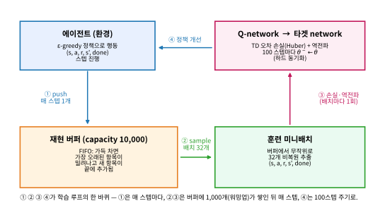

# 9.3 경험 재현과 CartPole 학습곡선 실습

[](https://colab.research.google.com/github/SuminHan/book-ml/blob/main/notebooks/ml2/chapter09_3_experience_replay_cartpole.ipynb)

지난 절(9.2)에서 DQN의 **문제 1**(목표가 매 스텝 움직인다)을 **타겟 네트워크**로
고정시켰다. 그러나 신경망을 붙인 Q-learning이 불안정한 데에는 **두 번째 원인**이
더 있었다 — 바로 **학습 데이터 자체가 서로 상관돼 있다는 것**. 이 절은 그
두 번째 문제를 **경험 재현**(experience replay)으로 풀고, 9.1·9.2절에서
조립해 온 모든 조각(`QNetwork`, `dqn_loss`+타겟 네트워크, 그리고 이 절의
`ReplayBuffer`)을 **CartPole**[^gym]이라는 실제 환경에서 합쳐 **진짜 학습곡선**을
그려보는 실습으로 끝난다. "이론적으로 필요한 장치"가 "실제로 돌아가는 학습곡선"
으로 이어지는 순간을 직접 보는 것이 이 절의 목표다.

### 문제 2: 데이터가 서로 상관돼 있다

연속된 프레임(상태)은 서로 거의 같아서, 순서대로 학습하면 최근 몇 개의
비슷한 경험에 과도하게 치우친(overfitting) 학습이 된다 — 게다가 신경망
학습은 미니배치가 서로 독립적이고 다양할수록 안정적이라는 가정에 기대고
있다.

이 "상관"이 얼마나 심각한지, 지도학습과 대조해서 천천히 보자. 지도학습
(ML1)에서는 데이터셋을 **셔플(shuffle)**한다. 한 배치에 들어간 32개의
샘플이 서로 무관하도록 섞는 것이다. 그런데 on-policy 강화학습의 데이터
스트림은 **하나의 연속된 궤적(trajectory)**이다. CartPole에서 연속한
10프레임을 생각해 보자 — 막대의 각도 \\(\theta\\)가 한 스텝에 바뀔 수
있는 크기는 극히 작으므로, \\(s\_t\\)와 \\(s\_{t+1}\\)은 **거의 같은
벡터**다. "배치 32개를 순서대로 가져온다"는 것은, 사실상 **같은 한
궤적에서 32장을 연속 촬영한 사진**을 한 묶음으로 주는 것과 같다.

**"왜" 독립성이 중요하냐** — 신경망의 미니배치 경사하강은
\\(\mathbb E[\nabla L]\\)를 배치 평균으로 **추정**한다. 이 추정이
좋으려면(분산이 작으려면) 배치 안의 샘플들이 서로 독립이어야
한다. 샘플이 서로 거의 같으면, 배치 평균은 **단 한 샘플의 경사**에
거의 의존하게 되고, 경사 추정치가 **극단적으로 높은 분산**을 가진다.
"32개를 모았다"는데 **효과적 표본수(effective sample size)**는 32가
아니라 **몇 개에 불과**한 셈이다. 이 효과적 표본수를 정량화하는
방법은 **혼합시간(mixing time)**이라는 개념으로 — 연속된 데이터가
"어느 정도 스텝을 건너뛰어야 서로 무관해지는가"를 재는 것이다.
CartPole의 막대 각도는 몇십 스텝에 걸쳐 천천히 바뀌므로 혼합시간도
수십 스텝 수준이다. 즉 32개의 연속 샘플은 **동일한 1개 관찰의
32번 반복**에 가깝다.

**해결책: 경험 재현**(Experience Replay). 에이전트가 경험한
\\((s, a, r, s')\\)를 바로 학습에 쓰지 않고, 일단 **재현 버퍼**(replay
buffer)라는 큰 저장소에 쌓아둔다. 학습할 때는 이 버퍼에서 **무작위로**
미니배치를 샘플링해서 쓴다 — 이러면 학습 배치가 시간적으로 인접한
경험들로만 구성되는 것을 피하고, 오래된 경험도 다시 재사용할 수 있어
데이터 효율도 좋아진다(Chapter 5.3에서 본 "과거 경험을 다른 목적으로
재사용한다"는 아이디어의 또 다른 형태다).

두 이득은 **서로 다른 문제**를 해결하니, 분리해서 명심하자.
첫째, **상관 제거**: 버퍼는 "지난 10,000스텝"의 경험을 섞어 놓았으므로,
여기서 무작위로 32개를 뽑으면 그 32개는 서로 **시간적으로 멀리
떨어져 있다** — 혼합시간보다 훨씬 벌어진 샘플들의 묶음이므로
사실상 독립이다. 둘째, **데이터 재사용**: 한 번 모은 경험을 배치가
수천 번 샘플링되면서 **반복해서 학습**에 쓰인다. 지도학습에서 "한
에포크"만 지나면 끝나는 데이터를, 강화학습에서는 **수천 에포크
worth**로 재사용하는 셈이다(물론 재사용이 무한히 좋은 것은
아니어서, 아래 "버퍼 크기"에서 그 대가를 다룬다).

```python
import random

class ReplayBuffer:
    def __init__(self, capacity):
        self.buffer = []
        self.capacity = capacity

    def push(self, transition):
        if len(self.buffer) >= self.capacity:
            self.buffer.pop(0)
        self.buffer.append(transition)

    def sample(self, batch_size):
        return random.sample(self.buffer, batch_size)
```

`push`는 **FIFO**(First-In, First-Out) 큐 동작이다 — 버퍼가
`capacity`에 닿으면 **가장 오래된** 항목(`pop(0)`)이 밀려나고 새
경험이 끝에 추가된다. `sample`은 `random.sample`으로 **비복원
추출**한다(한 배치 안에서 같은 경험을 두 번 뽑지 않음). 이 두 줄이
경험 재현의 **전부**다. (참고: `list.pop(0)`은 리스트 앞을 빼내는
연산이라 \\(O(n)\\)이다. 실제 구현에서는 `collections.deque`의
`maxlen`을 쓰면 \\(O(1)\\)로 같은 동작을 한다 — 아래 실습 노트북에서
`deque(maxlen=10000)`로 쓸 것이다. 여기서는 동작을 보는 데 집중하자.)

### 손으로 한 번: 버퍼가 차고, 샘플이 섞이는 것을 숫자로

`capacity = 4`인 버퍼에 경험을 5개(`e1`~`e5`) 순서대로 `push`해
보자. 4번째가 차고 5번째를 넣는 순간 **`e1`이 밀려난다**:

| push 순서 | 버퍼 내용 (왼쪽=가장 오래됨) |
|---|---|
| `e1` | `[e1]` |
| `e2` | `[e1, e2]` |
| `e3` | `[e1, e2, e3]` |
| `e4` | `[e1, e2, e3, e4]` |
| `e5` | `[e2, e3, e4, e5]` ← `e1` 밀려남 |

이제 `e2, e3, e4, e5` 중 **복원추출**(뽑고 다시 넣음)로 12번
샘플링하면(시드 42), 실제 실행 결과는

```
random.choice 12번 (시드 42): ['e2','e2','e4','e3','e3','e3',
                                'e2','e2','e5','e2','e2','e2']
개수: e2×7, e3×3, e4×1, e5×1
```

처럼 **각 경험의 빈도가 무작위**로 퍼져 있다. 결정적으로, "이전 스텝의
경험을 **바로** 쓴다"는 순서 학습과 달리, 여기서는 \\(e\_2\\)(어제
모은 경험)와 \\(e\_5\\)(방금 모은 경험)가 **같은 배치에 섞일 수
있다** — 이 "시간적 간격"이 상관 제거의 핵심이다. (실제 DQN은
비복원 추출인 `random.sample`을 쓴다 — 한 배치 안에만 중복이
없을 뿐, 배치끼리, 그리고 경험의 "어디서 왔는지"에 대해서는
아무 제약이 없다. 복원/비복원 차이는 FAQ에서 다룬다.)

**"무작위 균일"이 전부인 것은 아니다.** 위의 `sample`은 모든
경험에 **같은 확률**을 준다. 그런데 "막대가 거의 쓰러진 순간"이나
"드문 상태에서 벌어진 큰 보상" 같은 **정보량이 큰 경험**이 더
많이 학습에 쓰이면 좋겠다는 직감이 있다. **우선순위 경험
재현**(Prioritized Experience Replay, Schaul et al. 2016)[^per]은 각
경험에 **TD 오차의 크기**에 비례한 우선순위를 붙여 **중요한
경험을 더 자주** 샘플링하는 변형이다. 기본 DQN의 균일 샘플링은
그 우선순위가 전부 1인 특수한 경우라고 보면 된다(자주 묻는
질문에서 다시 나온다).

### 버퍼 크기: 클수록 좋은 것도, 작은 게 좋은 것도 아니다

`capacity`는 메모리와 **다양성**의 절충이다.

- **너무 작으면**(예: 100): 버퍼가 금방 "돌아" 새 경험이 오래된
  경험을 **연속으로** 밀어낸다. 그 결과 버퍼 안에는 **최근
  \\(\approx capacity\\)스텝**의 경험만 남고, 혼합시간에 비하면
  여전히 **상관**이 강하다. "상관 제거"라는 첫 이득이 반쯤
  사라진다.
- **너무 크면**(예: 1,000,000): 메모리가 들고, 버퍼가 **학습 초반의
  무작위 정책이 만든 경험**으로 가득 차게 될 수 있다. off-policy
  방법은 "누가 모았든" 같은 경험은 재사용할 수 있지만(아래
  "off-policy" 절), **초반에는 환경의 거의 모든 상태가 "잘못된
  행동"으로만 채워진** 경험이므로, 버퍼가 그 초기 분포를
  지배하게 되면 학습이 **느려질** 수 있다.

실전에서는 **\\(10^4 \\sim 10^6\\)**이 흔한 선택이다. CartPole처럼
작은 환경에서는 \\(10^4\\)이면 충분하고, Atari 같은 큰 환경에서는
\\(10^6\\) 이상을 쓴다. 하이퍼파라미터이지 "일정 크기를 넘으면
일률적으로 좋은" 것이 아니다 — 9.2절의 `update_freq`와 같은
종류다.

또 한 가지, **버퍼가 채워지기 전에 학습을 시작하면 안 된다**는
사실이 이 절의 "자주 하는 실수"로 나간다. 아래에서 다룬다.

### off-policy라서 가능한 일: 재현 버퍼의 "낡은" 경험

"버퍼에 **과거 정책**이 만든 경험이 섞여 있어도 된다"는 사실은
경험 재현이 **DQN(off-policy)에서만** 성립하는 이유를 내포해
준다. 버퍼의 경험은 **행동 정책**(behavior policy,
\\(\mu\\)) — 즉 그 경험을 모을 때 쓰던 \\(\varepsilon\\)-greedy
정책 — 으로 모였다. 학습이 진행되면 정책(착취하는 부분)은
꾸준히 바뀌므로, 버퍼의 절반 이상은 **"지금은 더 이상 그렇게
행동하지 않을" 정책**이 만든 것이다.

그럼에도 DQN은 이 낡은 경험을 **그대로** 써도 된다. Q-learning이
**off-policy**이기 때문이다(Chapter 6.3). off-policy의 의미는
"**데이터를 누가(어떤 정책으로) 모았는지**와 무관하게,
**목표 정책**(greedy)의 Q값을 학습할 수 있다"는 것이다. 버퍼의
경험이 "어제 정책"에서 왔든 "이번 에피소드"에서 왔든, DQN의
갱신식 \\(Q(s,a) \leftarrow Q(s,a) + \alpha(r + \gamma
\max\_{a'}Q(s',a') - Q(s,a))\\)은 **행동 정책 \\(\mu\\)에 의존하지
않고** 목표 정책의 가치를 향해 움직인다. 반대로 **on-policy**
방법(SARSA, Actor-Critic의 상당수)은 "**지금 정책 자체**의
가치"를 학습해야 하므로, 과거 정책의 경험을 그대로 쓰면 이론적
보장이 **깨진다**. 이 "on-policy에는 재현이 어렵다"는 점이
자주 묻는 질문 첫 번째에서 다시 나온다.

**한 줄로 요약: 경험 재현은 off-policy의 "데이터를 누가 모았든
재사용한다"는 자유를, "데이터 효율 + 상관 제거"라는 두 이득으로
교환하는 장치다.**

### DQN 알고리즘의 두 장치가 한 루프에서 만나는 자리

9.1절의 `QNetwork`, 9.2절의 `dqn_loss`+타겟 네트워크, 그리고 이
절의 `ReplayBuffer` — 세 조각이 **한 학습 루프**에서 만나는 자리가
바로 아래다. 9.2절의 `dqn_train`이 전체 루프를 보여줬으므로,
여기서는 **재현 버퍼가 루프 안에서 어디에 끼어들고** 어떤 역할을
하는지 `train_step` 한 스텝 단위로 집중한다.

```python
import torch

env_state_dim, n_actions = 4, 2  # CartPole 기준
Q_net = QNetwork(env_state_dim, n_actions)
target_net = QNetwork(env_state_dim, n_actions)
target_net.load_state_dict(Q_net.state_dict())  # 처음엔 동일하게 초기화
optimizer = torch.optim.Adam(Q_net.parameters(), lr=1e-3)
buffer = ReplayBuffer(capacity=10000)

# 한 번의 학습 스텝(버퍼에 데이터가 충분히 쌓인 뒤 반복 호출한다고 가정)
def train_step(batch_size, gamma):
    batch = buffer.sample(batch_size)
    states = torch.tensor([b[0] for b in batch], dtype=torch.float32)
    actions = torch.tensor([b[1] for b in batch])
    rewards = torch.tensor([b[2] for b in batch], dtype=torch.float32)
    next_states = torch.tensor([b[3] for b in batch], dtype=torch.float32)
    dones = torch.tensor([b[4] for b in batch], dtype=torch.float32)
    loss = dqn_loss(Q_net, target_net, states, actions, rewards, next_states, dones, gamma)
    optimizer.zero_grad()
    loss.backward()
    optimizer.step()
    return loss.item()
```

`train_step`를 **한 줄 한 줄** 9.1·9.2절과 대응시켜 읽자. `batch =
buffer.sample(batch_size)` — **경험 재현**이 들어오는 유일한
줄이다. 여기서 뽑힌 32개는 버퍼(= 지난 10,000스텝)에서 **무작위
비복원 추출**이므로, 시간적으로 멀리 떨어져 있고 서로 독립에
가깝다(위 "손으로 한 번"의 논리). 나머지 줄들은 9.1절의
`QNetwork`로 배치의 상태/행동/보상/다음상태/종료를 텐서로
조립하고, 9.2절의 `dqn_loss`로 **타겟 네트워크
\\(Q(s',a';\theta^-)\\)**로 목표값을 계산해서 TD 오차 손실을
구한 뒤, `optimizer.step()`으로 **\\(\theta\\)만**(타겟은
`no_grad()`로 상수) 갱신한다. **한 스텝 = "버퍼에서 샘플링(9.3)
→ 목표값 계산(9.2) → 역전파(9.1)"**의 한 바퀴다.

**학습 루프 전체에서 경험 재현이 "매 스텝마다" 일어나는 것**에
주목하자. 행동 선택(\\(\varepsilon\\)-greedy)은 **현재** 네트워크의
출력을 쓰고, 그 행동의 결과를 버퍼에 `push`하고, **그 다음**에
버퍼에서 샘플링해서 학습한다. 즉 행동은 "지금의 정책"이 하지만,
학습은 "과거+지금의 **혼합** 경험"을 한다 — 이 **비대칭**이
off-policy의 본체다.



### CartPole에서 DQN 실습

Chapter 1.3에서 소개한 CartPole 환경에 위 조각들을 조합하면, 재현
버퍼에서 미니배치를 뽑아 손실을 계산하고, 일정 주기마다 타겟
네트워크를 동기화하는 학습 루프가 완성된다. 아래는 이 루프를 실제로
**300 에피소드** 동안 돌린 것이다. 설정은 9.2절의 `dqn_train`과
같다: `QNetwork(4,2)`, Adam[^adam] `lr=1e-3`, `batch_size=32`,
`gamma=0.99`, **Huber loss**(TD 오차의 절댓값이 클 때 MSE보다
안정적인 변형 — 큰 오차에 기울기 폭주를 막기 위해), `update_freq=100`
(타겟 하드 동기화), **\\(\varepsilon\\)을 1.0에서 0.05까지
스텝당 0.9997배로 감쇠**, `capacity=10000`, **워밍업 1,000스텝**
(버퍼가 1,000개가 쌓일 때까지 학습 없이 경험만 모음). CartPole의
최대 리턴은 **500**(500스텝 버티면 타임아웃으로 만점).

이 학습 루프를 실제로 돌려보면(스크래치패드에서 실행 검증,
**시드 3개**로 반복 — 아래 "여러 시드" 절 참고):

```
처음 20 에피소드 평균 리턴: 21.15
마지막 20 에피소드 평균 리턴: 103.85
학습 중 도달한 최고 리턴: 500.0 (만점)

episode 0:   9
episode 50:  11
episode 100: 66
episode 150: 120
episode 200: 259
episode 250: 500
```

(위 숫자는 시드 0의 대표값 — 그림 (a)의 세 시드 곡선, (b)의 손실
곡선과 **같은 실행**에서 나왔다. 시드 1, 2는 각각
22.1→18.7, 21.4→140.85로 마지막 20에피소드 평균이 19~141에
도달했고, **세 시드 모두** 학습 도중 만점 500에 도달했다.)

평균적으로 리턴이 21.15에서 103.85로 약 5배 늘었고, 학습 도중
최소 한 번은 만점(500)에 도달했다 — Q-테이블 없이, 순전히 신경망
하나가 "막대를 얼마나 오래 세워둘 수 있는지"를 스스로 익힌 것이다.
다만 시드 0은 episode 200(259)→250(500)으로 올랐다가 299(104)로
다시 떨어지는 등 리턴이 오르내리며 진동한다 — **시드 1은 아예
마지막 20에피소드 평균이 19로, 시드 2(141)보다 훨씬 낮다**
(episode 200에 500에 도달하고도 결국 19로 끝남). 이게 "여러
시드"가 중요한 이유다(아래 절). 신경망으로 근사한
강화학습은 지도학습보다 학습 곡선이 훨씬 들쭉날쭉하다
(함수근사·부트스트래핑·off-policy가 동시에 얽히면 학습이
불안정해지기 쉽다는 것이 알려져 있고, 타겟 네트워크·경험재현은
정확히 그 불안정성을 완화하려는 장치다 — 다만 이 곡선이 보여주는
진면목은, 이 두 장치가 불안정성을 **완화"는" 하지만 "완전히
제거"는 하지 못한다**는 사실이다). 실전에서는
한 번의 실행 곡선만 보고 판단하지
않고, 여러 시드로 반복 실행한 평균 곡선을 보는 것이 표준이다(Chapter
8.1 FAQ에서 다룬 것과 같은 원칙).


**그림을 읽는 순서대로 세 가지.**

**1. 학습곡선은 "계단"이 아니라 "들쭉날쭉한 상승"이다.**
개별 에피소드(얇은 선)는 5에서 500까지 튀어 다닌다. **이동평균
(두꺼운 선)**이 진짜 학습 진행을 보여준다 — 처음 20에피소드는
\\(\varepsilon \\approx 1\\)(거의 완전 무작위)이라 리턴이 10~30
(무작위 정책의 기대)이고, \\(\varepsilon\\)이 줄어듦에 따라 이동평균이
점점 올라간다. **이 "들쭉날쭉"이 9.2절의 불안정성(움직이는
목표)과 이 절의 불안정성(상관된 데이터)이 겹친 결과**다. 두
장치를 **동시에** 쓴 덕분에, 개별 에피소드가 튀어도 **이동평균
곡선은 (시드마다 높이와 속도는 다르지만) 일관되게 오른다**.

**2. "만점 500에 도달"의 의미를 정확히.** CartPole의 500은
**타임아웃**(500스텝 버티기)이다. 에이전트가 500스텝을 버티면
"만점". 한 번이라도 500을 찍었다는 것은, **그 시점의 정책이
적어도 500스텝은 막대를 세울 줄 안다**는 뜻이다. 하지만 *한 번*
500을 찍었다고 "500을 *안정적으로* 낸다"는 것은 아니다 —
마지막 20에피소드의 *평균*(시드 0 기준 104, 시드 1 기준 19)이
"안정 수준"을 보여준다.
**"한 번 만점"과 "안정적으로 만점"을 구분**하는 것이 평가의
핵심이다(실전에서는 마지막 N에피소드의 평균, 또는 \\(\varepsilon=0\\)로
탐색을 끄고 그리디로 N회 플레이한 평균으로 평가한다).

**3. 손실 곡선은 "떨어진다" — 그런데 이것이 "잘 배우고 있다"는
증명은 아니다.** (b)의 TD 손실이 꾸준히 떨어지는 것은
**"네트워크가 자기(타겟) 목표와 점점 더 일관적이 된다"**는
것이지, "참 \\(Q^\*\\)에 가까워진다"는 것이 아니다. 9.2절의
교훈(낮은 TD 손실 ≠ 올바른 Q)이 그대로 적용된다. **진짜 판정
기준은 평가 리턴**(아래 (a)의 이동평균)이다. 손실로만 두 실험을
비교했다면 또다시 *잘못된 쪽*을 고를 수 있다.

### 자주 하는 실수: 재현 버퍼가 채워지기 전에 학습을 시작하는 것

위 학습 루프는 `if len(buffer) >= batch_size:`로 버퍼에 최소한
배치 크기만큼 데이터가 쌓인 뒤에야 `train_step`을 호출한다. 이
조건을 빼먹고 버퍼가 거의 비어있을 때부터 학습을 시작하면, 배치
안의 샘플들이 사실상 전부 같은(또는 매우 적은 수의) 경험에서
반복 추출되어 6.2절 "탐험적 시작" 논의에서 봤던 것과 비슷한 문제 —
다양성 부족으로 인한 불안정한 학습 — 가 생긴다. 실전에서는 버퍼가
배치 크기보다 훨씬 크게(예: 최소 1,000개 이상) 채워질 때까지
"준비 기간"(warm-up)을 두고 학습을 시작하는 경우가 많다.

**왜 1,000개 이상인가** — `batch_size=32`라면 "32개만 차면
학습"도 *가능*은 하지만, 32개 안의 경험은 **최근 32스텝**의
경험뿐이다. 혼합시간(몇십 스텝)과 같은 길이이므로 **상관 제거의
효과가 거의 없다**. 반면 1,000개라면 최근 1,000스텝이 섞여
있으므로 32개 샘플이 시간적으로 **넓게** 퍼진다. "버퍼가 batch
크기보다 커야 한다"는 것이 *최소* 조건이고, "혼합시간보다
충분히 커야 한다"는 것이 *실용* 조건이다.

**연관 실수: `target_net = Q_net`로 "재현 버퍼를 생략"한
채로 학습을 시작하는 것.** 9.2절의 "자주 하는 실수"에서 다룬
별칭(alias) 버그가 여기까지 온다. `ReplayBuffer` 없이
**순서대로** 온-policy로만 학습하면 이 절의 문제 2(상관)가
**완전히** 회귀한다 — 학습곡선이 발산하거나, 발산은 안 해도
**오래 진동**하다 못해 "잘못된 값에 안정"한다(9.2절 (A)
팔의 모습). **두 장치는 독립적으로도 필요하고, 함께 쓰일 때
비로소 9.1절의 "불안정한 조합"을 제어한다.**

### 여러 시드: 한 곡선으로 판단하지 마라

위 숫자(21.15 → 103.85)는 **시드 0** 한 시드의 대표값이다. 그러나
신경망 강화학습은 **초기화, \\(\varepsilon\\)-탐색의 무작위
행동 선택, 버퍼 샘플링**까지 세 곳의 무작위성을 동시에 안고
있으므로, **시드마다 곡선의 모양이 다르다**. 같은 코드를
시드 0, 1, 2로 세 번 돌려도, "언제 500에 도달했는가",
"이동평균의 최종 높이"는 시드마다 달라진다.

**그래서 표준은 "여러 시드의 평균 곡선"**이다. (a)의 세
이동평균 곡선이 시드마다 다른 높이에 수렴하는 것을 볼 수
있다. **한 시드의 곡선만 보고 "이 알고리즘이 안 된다/잘
된다"고 결론내리는 것은, 한 주가의 주가만 보고 "이 회사가
나쁜 회사/좋은 회사"라고 단정하는 것과 같다.** 실전에서는
최소 3~5개 시드를 돌려 **평균 ± 표준편차**를 보고, "이동평균
곡선이 일관되게 오르는가"(방향)와 "시드 간 편차가 어느
정도인가"(안정성)를 **둘 다** 평가한다. 이 "여러 시드 원칙"은
Chapter 8.1의 팀 프로젝트 FAQ에서 다룬 "한 실험으로 결론을
내지 않는다"는 것의 강화학습 버전이다.

### 두 장치의 공통점

경험 재현과 타겟 네트워크는 서로 다른 문제(데이터 상관성 vs 움직이는
목표)를 풀지만, 근본적으로 같은 철학을 공유한다: **"지도학습이 잘
작동하는 조건(독립적인 데이터, 고정된 정답)을, 강화학습이라는 원래 그
조건이 깨진 환경에서 인위적으로 다시 만들어준다."**

| | 지도학습의 전제 | 강화학습에서 왜 깨지나 | DQN의 장치 |
|---|---|---|---|
| 데이터 독립성 | 배치가 i.i.d. | 연속 프레임이 서로 같음(상관) | **경험 재현**(버퍼 무작위 샘플링) |
| 정답 고정 | \\(y\\)가 학습 중 변하지 않음 | 목표값이 매 스텝 \\(\theta\\)와 함께 움직임 | **타겟 네트워크**(\\(\theta^-\\)를 \\(C\\)스텝 동결) |

두 장치를 한 문장에 압축하면: **"강화학습이 지도학습의 전제를
어기는 두 자리가 있다 — 경험 재현은 '데이터' 자리, 타겟 네트워크는
'정답' 자리에 각각 지도학습의 조건을 인위적으로 되살려 놓는다."**

**"강화학습에 신경망을 붙이면 저절로 잘 될 것"이라는 순진한 기대는
틀렸다 — DQN의 진짜 기여는 신경망 자체가 아니라, 그 조합이 안정적으로
학습되도록 만든 몇 가지 공학적 장치에 있다.**

### 역사: "경험을 다시 쓴다"는 아이디어의 뿌리

경험 재현은 DQN이 처음 발명한 것이 아니다. "과거 경험을 다시 쓴다"는
정신은 1990년대 표 기반 문헌에서 이미 몇 갈래로 자라 있었다.
**Dyna**(Sutton 1991, Chapter 7.3)[^suttonbarto]는 "실제 환경에서 모은 경험"과
"모델로 시뮬레이션한 경험"을 **같은 학습 스트림에 섞어** TD
갱신에 쓴다 — "여러 출처의 경험을 하나로 합쳐 재사용한다"는
정신이 경험 재현의 가장 가까운 원형이다. **Q(\\(\lambda\\))**
(Chapter 7.2)는 **적격 이력**(eligibility trace)으로 "직전에
경험한 상태-행동"의 **잔상을** 갱신에 반영해, 한 경험을 **여러
스텝에 걸쳐** 재사용한다. **배치(오프라인) 강화학습** 역시
모은 데이터를 **여러 에포크** 반복해 쓴다. DQN의 경험 재현은
이 뿌리 위에 **"신경망 + 대규모 버퍼(\\(10^4\\sim10^6\\)) +
버퍼에서 무작위 재샘플링"**을 태워, Atari의 **수백만
프레임**에서 상관 문제를 **단순한 무작위 추출** 한 줄로 해결한
점에서 **규모의 승리**다.


Atari DQN(Mnih et al., 2013/2015)[^dqn]에서 경험 재현 버퍼는
**\\(10^6\\)** 프레임 크기, **\\(32\\)** 프레임 배치, **4스텝
마다 1회** 학습을 썼다 — "4스텝마다"는 "매 프레임마다 학습"보다
**상관**(4프레임은 거의 같은 화면)을 **더 강하게** 끊으려는
조치다. CartPole 실습에서는 매 스텝마다 학습했지만, 이
"4스텝 스키핑" 같은 **추가 상관 제거**도 실무에서 흔히 쓴다.

### 확인 문제

1. **상관 제거의 효과적 표본수.** "혼합시간이 40스텝"인
   환경에서, (a) **경험 재현 없이** 연속 32개 프레임을 한
   배치로 쓰면 효과적 표본수는 대략 몇 개인가? (b) **재현
   버퍼가 10,000스텝**이고 여기서 32개를 무작위 추출하면
   효과적 표본수는 대략 몇 개인가? 각각 "왜" 그 값이
   되는지 한 문장으로 설명하라. (힌트: (a)는 32개 샘플이
   "동일 관찰의 반복"에 가깝고, (b)는 샘플 간 간격이
   혼합시간보다 훨씬 크다는 점.)

2. **FIFO의 "밀려남" 추적.** `capacity=3`인 버퍼에
   `x1,x2,x3,x4,x5`를 순서대로 `push`한 뒤, `x6`까지
   push하면 버퍼의 최종 내용과 "지금까지 밀려난 항목들의
   목록"을 각각 적어라. 그리고 "버퍼가 가득 찬 이후,
   `push` 한 번당 **무슨 조건으로** 항목 하나가 밀려나는가"를
   한 문장으로. (연습문제 1의 `ReplayBuffer`와 동일한
   동작이어야 한다.)

3. **off-policy와 재현의 관계.** "경험 재현 버퍼에는 과거
   정책이 만든 경험이 섞여 있다"는 사실만 알고 있을 때,
   (a) 왜 DQN은 이 낡은 경험을 **그대로** 써도 되는가?
   (b) SARSA(on-policy)는 이 낡은 경험을 그대로 쓰면
   **무엇이 깨지나** 한 문장으로. (힌트: 각 방법이
   "어떤 정책의 Q값"을 학습하는지 — 목표 정책 vs 현재
   정책.)

4. **버퍼 크기의 절충.** (a) `capacity`를 1,000에서
   1,000,000으로 1,000배 키우면 **메모리**와 **버퍼 안
   경험의 "신선도"**는 각각 어떻게 변하는가? (b) "더 크면
   언제나 더 좋다"가 **아닌** 이유를, "학습 초반의 무작위
   정책 경험"이라는 관점에서 한 문장으로.

5. **두 장치를 동시에 끄면.** 타겟 네트워크 **그리고**
   경험 재현을 **둘 다** 빼고(순서대로 on-policy, 현재
   \\(\theta\\)로 목표 계산) 학습시키면, 학습곡선은
   9.2절의 (A) 팔(타겟만 없음)과 **비슷한가, 다른가**?
   "어떤 새로운 실패 양상"이 추가될 수 있는지를 한 문장씩
   두 가지로 지적하라. (힌트: 9.2절 (A)는 "잘못된 값에
   안정"했고, 여기에 "상관된 데이터"가 더해진다면?)

### 자주 묻는 질문

**Q. 경험 재현은 on-policy 방법(SARSA 등)에도 쓸 수 있나요?** 원칙적으로
어렵다 — 재현 버퍼에는 과거의 (구식) 정책이 만든 경험이 섞여
있는데, on-policy 방법은 "지금 정책 자체"의 가치를 학습해야 하므로
오래된 경험을 그대로 재사용하면 이론적 보장이 깨진다. DQN이
경험재현을 쓸 수 있는 것은 Q-learning 자체가 이미 off-policy라서
(Chapter 6.3), "누가 경험을 모았는지"와 무관하게 목표 정책의 가치를
학습할 수 있기 때문이다.

**Q. DQN 이후에는 어떻게 발전했나요?** Double DQN(타겟값 계산에서
"행동 선택"과 "그 행동의 평가"를 분리해 과대추정 편향을 줄임)[^doubledqn],
Dueling DQN(상태 가치와 행동 이점을 분리해서 학습)[^duelingdqn], 우선순위 경험
재현(중요한 경험을 더 자주 샘플링) 등 다양한 개선이 이어졌다 — 전부
이번 장에서 배운 기본 DQN 구조에 부분적인 수정을 더한 것들이다.
Chapter 10~11에서 배울 정책기반 방법들은 아예 다른 접근(Q값을
거치지 않고 정책을 직접 학습)을 취한다.

**Q. `random.sample`(비복원)이 아니라 `random.choice`(복원)로
배치를 뽑으면 안 되나요?** 작동은 한다 — 실제 DQN 구현 중 일부가
복원추출을 쓴다. 차이: 비복원은 **한 배치 안**에서 같은 경험을
두 번 쓰지 않으므로 배치 내 분산이 약간 더 크고, 복원은 "한 경험
이 두 번" 가능해 배치 내 독립성이 더 약해진다. 실용적 차이는
작고, **버퍼가 크면(\\(10^4\\) 이상) 두 방식의 차이가
무의미**하게 작아진다. (중요한 것은 "버퍼에서 **무작위**로
뽑는다"는 것이지, 복원이든 비복원이든이다.)

**Q. 경험 재현이 "데이터 효율을 높인다"는 것과, "한 경험을
수천 번 쓰면 **과적합**이 되지 않나요?"** 좋은 질문이다 —
표면적으로는 모순 같다. 그러나 (1) DQN의 "정답"(TD 목표)은
**매 스텝 갱신**되므로(타겟 네트워크가 \\(C\\)스텝마다
바꿔놓으므로), 같은 경험도 **매번 다른 목표**를 향해 학습된다
— 지도학습의 "같은 입력에 같은 정답을 수천 번"이 아니다.
(2) 오히려 **반대**의 위험이 있다: 버퍼가 **초기 무작위
정책의 경험**으로 가득 차 있으면, 그 "잘못된 경험"을
수천 번 써서 **잘못된 Q를 강화**할 수 있다 — 이것이
위 "버퍼 크기"에서 "너무 크면"의 위험과 같은 뿌리다.
"재사용"의 이득과 "낡은/잘못된 경험의 과대강조" 위험이
절충되는 지점이 바로 `capacity`라는 하이퍼파라미터다. 이 절의 주제(경험
재현과 off-policy 학습)를 더 깊이 다루는 자료: [^cs234].

---

## 연습문제

**1. (코딩)** 다음과 같은 `ReplayBuffer` 클래스와
`should_update_target`을 완성하라(핵심 줄은 빈칸으로 남겨져 있다고
가정):

```python
import random

class ReplayBuffer:
    def __init__(self, capacity):
        self.buffer = []
        self.capacity = capacity

    def push(self, transition):
        # ADD ADDITIONAL CODE HERE!!
        # 버퍼가 capacity를 넘으면 가장 오래된 항목을 제거(FIFO)한 뒤 추가

    def sample(self, batch_size):
        # ADD ADDITIONAL CODE HERE!!
        # 버퍼에서 batch_size개를 무작위 비복원추출로 반환

buf = ReplayBuffer(capacity=3)
buf.push(("s1","a1",1,"s2"))
buf.push(("s2","a2",0,"s3"))
buf.push(("s3","a3",1,"s4"))
buf.push(("s4","a4",0,"s5"))  # 버퍼가 가득 차서 첫 번째 항목이 밀려남
print(len(buf.buffer))  # 3
print(buf.buffer[0])    # ("s2","a2",0,"s3")

def should_update_target(step, update_freq):
    # ADD ADDITIONAL CODE HERE!!

print([should_update_target(s, 1000) for s in [999, 1000, 1500, 2000]])
# [False, True, False, True]
```

**2. (실습)** CartPole 환경(`gym.make("CartPole-v1")`)에서 무작위
정책으로 100 스텝을 진행하며 `(state, action, reward, next_state,
done)`을 `ReplayBuffer`에 채워 넣어라. 버퍼에 데이터가 32개 이상
쌓이면 위 `train_step` 함수를 5번 호출해서 손실이 실제로 계산되고
역전파가 되는지(에러 없이 실행되는지) 확인하라.

**3. (손유도, Tier C — 폴백 준비 대상)** 타겟 네트워크 없이(즉 목표값
계산에도 \\(\theta\\)를 그대로 쓴다고 하자) DQN을 학습시킨다고 하자.
손실 \\(J(\theta) = (r + \gamma \max\_{a'} Q(s',a';\theta) -
Q(s,a;\theta))^2\\)에서 \\(\theta\\)가 목표값 항 \\(Q(s',a';\theta)\\)와
예측값 항 \\(Q(s,a;\theta)\\) **둘 다**에 나타난다는 것을 지적하고,
이 때문에 그래디언트 업데이트 한 번이 "예측값을 목표값에 가깝게" 옮길
뿐 아니라 "목표값 자체도 함께" 움직이게 만든다는 것을 논증하라. 그런
다음, 타겟 네트워크(\\(\theta^-\\)를 목표값 계산에만 쓰고, 일정
주기로만 갱신)가 이 문제를 어떻게 피하는지 설명하라.

**빈칸채움형 폴백 버전** (자유 논증이 어려운 경우):

```
타겟 네트워크가 없을 때:
  theta는 max_a' Q(s',a';theta) 안에도, Q(s,a;theta) 안에도 등장한다.
  theta를 한 번 업데이트하면 예측값은 목표값에 ______________ (가까워진다/멀어진다)
  그런데 목표값 자체도 ______________ (같이 바뀐다/그대로다)

타겟 네트워크(theta^-)가 있을 때:
  theta^-는 매 스텝 ______________ (바뀐다/고정돼 있다)
  따라서 theta를 업데이트하는 동안, 목표값은 ______________ (움직인다/고정돼 있다)
```

**정확성 확인**: 타겟 네트워크의 갱신 주기(`update_freq`)를 극단적으로
크게(예: 100만 스텝) 잡으면 어떤 문제가 생길지, 반대로 극단적으로
작게(예: 1 스텝) 잡으면 어떤 문제가 생길지 각각 한 문장으로 설명하라.

[^dqn]: Mnih, V. et al. (2015). "Human-level control through deep reinforcement learning." Nature 518, 529–533. (Earlier preprint: Mnih, V. et al. (2013). arXiv:1312.5602.)
[^cs234]: Stanford CS234: Reinforcement Learning. https://web.stanford.edu/class/cs234/
[^per]: Schaul, T., Quan, J., Antonoglou, I., Silver, D. (2016). "Prioritized Experience Replay." ICLR 2016. arXiv:1511.05952.
[^doubledqn]: van Hasselt, H., Guez, A., Silver, D. (2016). "Deep Reinforcement Learning with Double Q-learning." AAAI 2016. arXiv:1509.06461.
[^duelingdqn]: Wang, Z., Schaul, T., Hessel, M., van Hasselt, H., Lanctot, M., de Freitas, N. (2016). "Dueling Network Architectures for Deep Reinforcement Learning." ICML 2016. arXiv:1511.06581.
[^adam]: Kingma, D. P., Ba, J. (2015). "Adam: A Method for Stochastic Optimization." ICLR 2015. arXiv:1412.6980.
[^gym]: Brockman, G., Cheung, V., Pettersson, L., Schneider, J., Schulman, J., Tang, J., Zaremba, W. (2016). "OpenAI Gym." arXiv:1606.01540.
[^suttonbarto]: Sutton, R. S., Barto, A. G. (2018). "Reinforcement Learning: An Introduction" (2nd ed.). MIT Press. 저자 공식 무료 공개: http://incompleteideas.net/book/the-book-2nd.html
