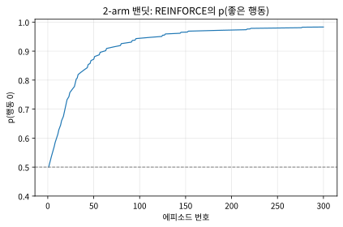
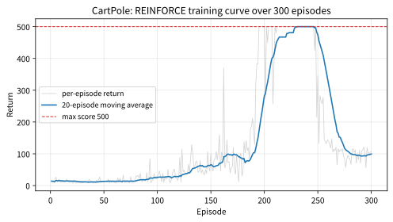

# 10.2 REINFORCE와 실습

[](https://colab.research.google.com/github/SuminHan/book-ml/blob/main/notebooks/ml2/chapter10_2_reinforce.ipynb)

### 위치: 정리에서 알고리즘으로

10.1절에서는 "무작위 결과인데도 미분할 수 있다"는 큰 걸음을 떼서
Policy Gradient Theorem에 도달했다:

\\[\nabla\_\theta J(\theta) = \mathbb{E}\_\tau\left[\sum\_t \nabla\_\theta \log
\pi\_\theta(a\_t|s\_t) \\, G\_t\right]\\]

그런데 "식은 얻었다"와 "실행할 수 있다"는 다른 문제다. 이 식을
**알고리즘**으로 바꾸려면 두 가지 질문을 답해야 한다. **첫째,
\\(\nabla\_\theta \log \pi\_\theta(a\_t|s\_t)\\)은 어떤 모양인가?**
10.1절에서 정책을 softmax 신경망으로 파라미터화했으므로, 이제 그
특정 파급화(softmax)에 대해 실제로 미분해봐야 한다. **둘째,
기댓값 \\(\mathbb{E}\_\tau\\)는 어떤 샘플로 추정하는가?** 가장
단순한 선택은 "현재 정책으로 에피소드를 한 번 굴려서, 실제로
관찰한 \\(G\_t\\)와 실제로 고른 행동의 \\(\log\pi\_\theta\\)를
쓰는 것"이다. 이 절에서 다룰 **REINFORCE**는 바로 이 "가능한
가장 단순한" 선택을 모두 채택한 알고리즘이다 — 그리고 이 단순함
그 자체가 교육적 가치(아래 "역사"에서 다시 볼 것)다.

### REINFORCE 알고리즘

Policy Gradient Theorem을 그대로 경사 상승법(gradient ascent —
최대화이므로 `+=`)으로 구현한 것이 REINFORCE다:

```python
import math

def softmax_policy(theta, state_feature):
    logits = [theta[0]*state_feature, theta[1]*state_feature]
    m = max(logits)
    exps = [math.exp(l - m) for l in logits]
    total = sum(exps)
    return [e / total for e in exps]

def reinforce_update(theta, episode, alpha, gamma):
    # episode: [(state_feature, action, reward), ...]
    T = len(episode)
    G = [0.0] * T
    running = 0.0
    for t in reversed(range(T)):
        running = episode[t][2] + gamma * running
        G[t] = running
    for t, (s, a, r) in enumerate(episode):
        probs = softmax_policy(theta, s)
        if a == 0:
            grad_log_pi = [(1 - probs[0]) * s, -probs[1] * s]
        else:
            grad_log_pi = [-probs[0] * s, (1 - probs[1]) * s]
        theta[0] += alpha * G[t] * grad_log_pi[0]
        theta[1] += alpha * G[t] * grad_log_pi[1]
    return theta
```

여기서 정책은 가능한 가장 단순한 형태로 두었다: 1차원 상태
특징 \\(s\\)에 대한 선형 로짓 \\((\theta\_0 s, \theta\_1 s)\\)에
softmax. 신경망은 등장하지 않는다 — 위 PyTorch 실습의
`PolicyNet`에서 볼 것처럼, 실제에서는 이 선형 부분을
\\(f\_\theta(s)\\) 신경망으로 바꿀 뿐 **갱신 식의 구조는
동일하다**.

### 코드가 실제로 하는 일: 두 개의 루프

`reinforce_update`는 두 개의 루프다. **첫 번째 루프(뒤에서부터)는
각 시점의 리턴 \\(G\_t\\)를 계산한다**: 마지막 스텝에서 시작해
\\(G\_t = r\_t + \gamma G\_{t+1}\\)로 거꾸로 누적하는 것(Chapter 3의
리턴 정의, 그대로). **두 번째 루프(앞에서부터)는 각 스텝마다
갱신을 한다**: 그 시점에서 (a) 현재 정책 \\(\pi\_\theta\\)를 계산해
행동 확률 \\(p\_0, p\_1\\)를 얻고, (b) 실제로 고른 행동
\\(a\_t\\)의 \\(\log\pi\_\theta(a\_t|s\_t)\\)의 그래디언트를 계산하고,
(c) 그걸 그 시점의 리턴 \\(G\_t\\)로 곱해 \\(\theta\\)를 조금
 옮긴다.

softmax 정책의 그래디언트 모양이 처음엔 낯설 수 있는데, 실제로는
매우 단순하다. \\(\pi\_\theta(a|s) = \text{softmax}(\theta\_0 s,
\theta\_1 s)\\)의 각 행동 로그확률을 미분하면:

\\[\frac{\partial \log \pi\_\theta(0|s)}{\partial \theta} =
\big[(1-p\_0)\\,s,\\; -p\_1\\,s\big], \qquad
\frac{\partial \log \pi\_\theta(1|s)}{\partial \theta} =
\big[-p\_0\\,s,\\; (1-p\_1)\\,s\big]\\]

이걸 **one-vs-rest 모양**이라고 부른다: 고른 행동 자신의 파라미터
성분은 \\((1-p\_a)\\), 나머지는 모두 \\(-p\_a\\) (× \\(s\\)). 왜
그러냐면 **모든 행동의 확률합은 항상 1**이기 때문이다 — 한
행동의 확률을 올리려면 다른 행동의 확률이 *반드시* 내려가야
하므로, "고른 행동을 올리는" 갱신은 구조적으로 "고르지 않은
행동들을 내리는" 갱신이 동시에 된다.

> **손으로 한 번 갱신하기.** \\(\theta=[1,0]\\), \\(s=1\\), 정책이
> 행동 0을 골랐고 이 시점의 리턴이 \\(G\_t=3.0\\)이라 하자
> (\\(\alpha=0.1\\)). 그러면 \\(\text{softmax}([1,0]) =
> [0.7311,\\, 0.2689]\\)이고, 행동 0의 그래디언트는
> \\([(1-0.7311),\\, -0.2689] = [0.2689,\\, -0.2689]\\)이므로:
>
> \\[\theta \leftarrow [1,0] + 0.1 \times 3.0 \times [0.2689,\\,
> -0.2689] = [1.0807,\\, -0.0807]\\]
>
> 결과적으로 \\(p\_0\\)가 \\(0.7311 \to 0.7617\\)로 **올랐다** —
> 좋은 결과(큰 양의 리턴)를 낸 행동의 확률이 실제로 증가했다.
> 반대로 만약 행동 1을 고르고 리턴이 \\(-3.0\\)이었다면(나쁜
> 결과), 그래디언트는 \\([-0.7311,\\, 0.7311]\\)이므로 갱신은
> \\(\theta \leftarrow [1+0.1(-3)(-0.7311),\\; 0+0.1(-3)(0.7311)]
> = [1.2193,\\, -0.2193]\\) — \\(p\_1\\)가
> \\(0.2689 \to 0.1918\\)로 **내려가고** \\(p\_0\\)가
> \\(0.8082\\)로 올라간다. 두 경우 모두 "좋은 것 많이,
> 나쁜 것 적게"라는 직관과 방향이 일치한다.

### 밴딧 실험: "좋은 행동을 더 선호한다"를 눈으로 확인

실습 노트북의 첫 부분에서 이 알고리즘이 정말 "배운다"는 것을,
상태가 아예 없는 가장 단순한 환경에서 확인한다. **2-arm
밴딧**: 행동 0을 고르면 보상 \\(+1\\), 행동 1을 고르면 \\(-1\\)
(1스텝 에피소드이므로 \\(G\_t = r\_t\\), \\(\gamma\\)는 무관).
\\(\theta=[0,0]\\)(두 행동 반반)에서 시작해, 매 에피소드에서
행동을 하나 샘플링하고 \\(\alpha=0.05\\)로 갱신, 300 에피소드:

```
p(행동 0): 1회 = 0.5000 → 50회 = 0.8719 → 100회 = 0.9443
           → 200회 = 0.9727 → 300회 = 0.9832
최종 theta = [2.0352, -2.0352]
```



이게 REINFORCE의 "smoke test"다: "정답"이 있는 환경에서 좋은
행동의 확률이 50%에서 100%에 가까워져야 하는데, **그렇게 된다**.
곡선의 *모양*에도 주목: 학습의 대부분(0.5→0.87)은 처음 50
에피소드에 집중되고, 이후 1에 점근하듯 천천히 접근한다. 왜 이렇게
"느리게 수렴"하는가? (힌트: \\(p\_0\\)가 1에 가까워질수록
그래디언트 성분 \\((1-p\_0)\\)이 줄어 "더 올릴 힘"이 약해지고,
"나쁜 행동"을 샘플링해 자신감을 교정해줄 기회도 줄어든다 — 이건
단일 샘플 \\(G\_t\\)로 업데이트하는 모든 REINFORCE 계열 알고리즘의
본질적 특성이고, 10.3절에서 가치함수로 추정하는 것(또는 더
많은 샘플을 쓰는 것)이 이 느림을 공격하는 방법 중 하나다.)

### 왜 이게 model-free인가

Policy Gradient Theorem의 유도에서 핵심 단계는, 궤적의 확률
\\(P(\tau;\theta) = \prod\_t \pi\_\theta(a\_t|s\_t) \cdot
P(s\_{t+1}|s\_t,a\_t)\\)를 로그로 바꾸면, **환경의 전이확률
\\(P(s\_{t+1}|s\_t,a\_t)\\) 항은 \\(\theta\\)와 무관해서 미분하면
사라진다**는 것이다. 즉 최종 그래디언트 식에는 정책 \\(\pi\_\theta\\)만
남고 환경 모델은 전혀 등장하지 않는다 — 환경이 어떻게 작동하는지
몰라도 정책을 학습할 수 있다는, model-free RL의 핵심 성질이 여기서
나온다.

### 실습: PyTorch로 REINFORCE를 CartPole에서 학습시키기

위 손 구현 대신, PyTorch의 자동 미분을 이용하면 훨씬 간결하게 같은
알고리즘을 구현할 수 있다:

```python
import torch, torch.nn as nn

class PolicyNet(nn.Module):
    def __init__(self, state_dim, n_actions):
        super().__init__()
        self.net = nn.Sequential(nn.Linear(state_dim, 64), nn.ReLU(), nn.Linear(64, n_actions))
    def forward(self, x):
        return torch.softmax(self.net(x), dim=-1)

policy = PolicyNet(4, 2)  # CartPole: 상태 4차원, 행동 2개
opt = torch.optim.Adam(policy.parameters(), lr=1e-2)

def run_episode(env, seed):
    s, _ = env.reset(seed=seed)
    log_probs, rewards = [], []
    for _ in range(500):
        probs = policy(torch.tensor(s, dtype=torch.float32))
        dist = torch.distributions.Categorical(probs)
        a = dist.sample()
        log_probs.append(dist.log_prob(a))  # log pi_theta(a|s)
        s, r, term, trunc, _ = env.step(a.item())
        rewards.append(r)
        if term or trunc:
            break
    return log_probs, rewards

def reinforce_update(log_probs, rewards, gamma):
    G, returns = 0.0, []
    for r in reversed(rewards):
        G = r + gamma * G
        returns.insert(0, G)
    returns = torch.tensor(returns, dtype=torch.float32)
    returns = (returns - returns.mean()) / (returns.std() + 1e-8)  # 분산 감소용 정규화
    loss = -sum(lp * g for lp, g in zip(log_probs, returns))  # 경사 "상승"이므로 부호 반전
    opt.zero_grad(); loss.backward(); opt.step()
```

`torch.distributions.Categorical`이 `log_prob()`을 제공해서,
10.1절의 \\(\log\pi\_\theta(a\_t|s\_t)\\)를 손으로 미분식을 유도하지
않고도 그대로 얻을 수 있다 — 손실을 `-log_prob * G`로 정의하고
`.backward()`를 호출하면, PyTorch가 Policy Gradient Theorem의
그래디언트를 자동으로 계산해준다. (위 "코드가 실제로 하는 일"의
one-vs-rest 그래디언트 식이, 정확히 이 `.backward()`가 내부에서
계산하는 값이다.)

CartPole에서 300 에피소드 학습시키면(실제 검증, seed 0 — 실습
노트북 `chapter10_2_reinforce`에서 재현):

```
처음 20 에피소드 평균 리턴: 14.05
마지막 20 에피소드 평균 리턴: 99.45
학습 중 도달한 최고 리턴: 500.0
```

정확한 숫자는 랜덤 시드에 따라 달라진다(다른 seed에서는 마지막
20 에피소드 평균 144~191, 최고 359~500), 하지만 큰 그림은
안정적이다: **"10대에서 100대로 오르지만 500에 도달해
포화되지 못한다."**



Chapter 9.3의 DQN(같은 300 에피소드에서 마지막 20 에피소드 평균
145.35, 최고 500)과 비교하면, REINFORCE는 개선되긴 했지만
(14.05→99.45) DQN보다 훨씬 느리고 불안정하게 학습된다 — 이건
REINFORCE 구현이 잘못된 게 아니라, 10.3절에서 다룰 "REINFORCE는
분산이 크다"는 알려진 한계가 실제 숫자로 드러난 것이다. 다음
장(Actor-Critic, PPO)이 정확히 이 문제를 개선하려는 시도다.

### 자주 하는 실수: 리턴을 정규화하지 않고 그대로 쓰기

위 코드의 `returns = (returns - returns.mean()) / (returns.std() +
1e-8)` 줄을 빼고 원래 리턴 \\(G\_t\\)를 그대로 쓰면 어떻게 될까?
CartPole의 리턴은 항상 양수(매 스텝 +1의 보상)이므로, 모든 행동의
그래디언트가 항상 "그 행동의 확률을 높이는" 방향으로만 움직인다 —
나빴던 행동조차 "덜 좋았을 뿐 여전히 양수"라서 그 확률을 계속
높이려 든다. Chapter 10.3에서 배울 "베이스라인을 빼서 어떤 행동이
평균보다 나았는지/나빴는지를 상대적으로 비교하게 만든다"는 아이디어를
가장 단순하게 구현한 것이 바로 이 정규화다 — 평균을 빼면 평균보다
나빴던 행동은 음수 신호를 받아 확률이 실제로 낮아진다.

**"평균을 빼도" 그래디언트의 기댓값은 왜 바뀌지 않는가?**
상태 \\(s\_t\\)에만 의존하는 값(행동과 무관한) \\(b(s\_t)\\)를
빼도, 그래디언트 기댓값은 그대로다:

\\[\mathbb{E}\_{a\sim\pi}\left[(G\_t - b(s\_t))\\,\nabla\_\theta
\log\pi\_\theta(a|s\_t)\right] = \mathbb{E}\_{a\sim\pi}\left[G\_t
\nabla\_\theta \log\pi\right] - b(s\_t)\\,\underbrace{\mathbb{E}\_{a\sim\pi}
\left[\nabla\_\theta \log\pi\_\theta(a|s\_t)\right]}\_{=\\,\nabla\_\theta
\sum\_a \pi\_\theta(a|s\_t) = \nabla\_\theta 1 = 0}\\]

핵심은 밑줄 친 부분이다: "각 행동의 확률합이 항상 1"이므로,
확률가중평균으로 취한 그래디언트는 0이 된다. **베이스라인은
행동에 의존하면 안 된다** — \\(b\\)가 행동 \\(a\\)에도 의존하면
이 소거가 깨져서(확인 문제 3), 기댓값이 실제로 바뀐다(편향이
생긴다). 위 코드의 정규화 줄은 정확히 이 형태의 가장 단순한
베이스라인 — "에피소드당 평균 리턴을 빼기" — 인 것이다.

**솔직한 비고(실행 검증의 한계).** 이 "평균 빼기"가 실제로 학습을
더 좋게 만드는지는, 에피소드 수가 적을 때는 시드에 따라 갈릴
수 있다. 같은 CartPole에서 정규화 줄을 빼고 재검증한 결과
(마지막 20 에피소드 평균):

| | seed 0 | seed 1 | seed 2 |
|---|---|---|---|
| 정규화 **있음**(베이스라인) | 99.45 | 191.10 | 144.20 |
| 정규화 **없음**(\\(G\_t\\) 그대로) | 383.10 | 139.00 | 76.15 |

즉 seed 0에서는 오히려 "정규화 안 한 쪽"이 더 잘했고, seed
사이의 편차도 넓었다. 이건 "정규화가 무의미하다"는 뜻이 아니라,
**300 에피소드라는 데이터량으로는 베이스라인의 이득(분산 감소)이
노이즈에 묻힐 수 있다**는 뜻이다 — 베이스라인의 주된 효과는
"더 빠르게"가 아니라 "에피소드 노이즈 한 방에 학습 곡선을
주행하지 않게" 하는 것이며, 에피소드 수가 많고 리턴의 편차가
클수록 그 이득이 뚜렷해진다. 베이스라인의 "적은" 형태(에피소드
당 평균이 아니라 *상태별* 가치함수 \\(V(s\_t)\\))가 10.3절의
Actor-Critic이다.

### 확인 문제

1. (코드 읽기) REINFORCE 코드에서 갱신 줄
   `theta[0] += alpha * G[t] * grad_log_pi[0]`의 `+=`을 `-=`로
   바꾸면(부호 반전), 2-arm 밴딧 실험에서 어떤 일이 일어나는가?
   그래디언트 \\(\nabla\_\theta\log\pi\\)의 의미와 리턴 \\(G\_t\\)
   부호의 의미를 근거로, 왜 행동 0의 확률이 0으로 수렴하는지
   설명하라. (힌트: 원래 갱신은 "기대 보상을 **최대화**하는
   방향"인데, 부호를 반전하면 무슨 방향으로 가는가?)

2. (개념) "손으로 한 번 갱신하기" 예에서, 행동 0을 골라
   \\(G\_t=+3\\)인 갱신에서도 **고르지 않은** 행동 1의 확률이
   내려갔다(\\(0.2689 \to 0.2384\\)). 왜 "고르지 않은" 행동의
   확률도 갱신에 영향을 받는가? (힌트: one-vs-rest 그래디언트
   \\([-p\_1 s, (1-p\_1) s]\\)에서 행동 0의 갱신에 **\\(\theta\_1\\)
   성분도** 들어오는 것을 보고, "확률합이 1"이라는 제약과
   연결하라.)

3. (수학) "평균을 빼도 편향 없음" 증명에서
   \\(\mathbb{E}\_{a\sim\pi}[\nabla\_\theta\log\pi\_\theta(a|s)] = 0\\)
   를 썼다. 만약 베이스라인을 에피소드당 평균 리턴 대신, **행동
   \\(a\\)에도 의존하는** \\(b(a,s)\\)로 썼다면 이 항은
   0이 아닌 값을 가질 수 있는가? 2행동 소프트맥스 경우에
   \\(p\_0 b(0,s)\\,\nabla\_\theta\log\pi(0|s) + p\_1
   b(1,s)\\,\nabla\_\theta\log\pi(1|s)\\)를 전개해보며 답하라.

### 역사: 40년 전부터 있는 이름

"좋은 궤적의 행동 확률을 올리고, 나쁜 궤적의 행동 확률을
내린다"는 정책 그래디언트의 아이디어는 생각보다 오래됐다.
Sutton의 1984년 MIT 박사 학위논문에는 이미 "행동의 결과를
보면서 행동 확률을 조정한다"는 같은 계열의 알고리즘이
나왔고, **REINFORCE**(REINforce — reinforcement + force의
줄임)라는 이름의 구체적 알고리즘은 1990년대에 정식 제안됐다.
그 무렵 Williams(1992)는 이 갱신 규칙이 통계학의 고전적 기법인
**스코어함수 추정치**(score function estimator — 로그우도
함수의 미분으로 미분할 수 없는 기댓값의 미분을 샘플로
추정하는 방법)와 정확히 같은 식임을 보여줬다. 그래서 정책
그래디언트 방법은 "고전 통계의 미분 추정 기법을 강화학습에
적용한 것"으로 읽을 수도 있고, 확률적 최적화(stochastic
optimization) 문헌에서는 "likelihood ratio method"라는 이름으로
동일 알고리즘이 나타난다.

중요한 점은, REINFORCE가 지금까지 30년째 바뀌지 않는
**참고 기준**(reference algorithm)이라는 것이다: 갱신 식
\\(\theta \leftarrow \theta + \alpha\\, G\_t \\,
\nabla\log\pi\_\theta(a\_t|s\_t)\\)는, 베이스라인 선택(10.3
Actor-Critic)과 같은 에피소드 경험의 재사용 횟수(Chapter 11
PPO)를 고를 때만 예외로, **오늘날 모든 정책 그래디언트
알고리즘에서 같은 식**이다. 이번 절이 "빨라서" 중요한 게
아니라, 이후 모든 개선이 "REINFORCE의 이 특정 부분을 바꾼
것"이라는 사실의 기준점이 되어서 중요하다.

### 자주 묻는 질문

**Q. REINFORCE는 에피소드가 끝날 때까지 갱신을 안 한다고
했는데, 그럼 이건 Chapter 5의 "몬테카를로" 방식인가요?**
네, 맞습니다 — 기본 REINFORCE는 실제로 관찰된 리턴 \\(G\_t\\)를
사용하는 점에서 Chapter 5의 MC 방법과 같은 구조다. 다만
분류는 "네 가지 속성"으로 하는 게 정확하다: REINFORCE는
**on-policy, model-free, MC 기반, 정책기반**이다. "정책기반"
이 포함된 이유는, 배우는 대상이 가치표가 아니라 정책의
파라미터이고, 갱신 방식이 "평균"(MC의
\\(Q \leftarrow Q + \alpha(G-Q)\\))이 아니라 "경사 상승"
(\\(\theta \leftarrow \theta + \alpha G\nabla\log\pi\\))이기
때문이다. 정책기반을 TD 방식으로 섞으면 10.3절
Actor-Critic이 된다 — "배우는 대상(정책 vs 가치)"과 "갱신
원리(경사 상승 vs 평균/부트스트랩)"은 독립적인 축이다.

**Q. "최고 리턴 500"이 나왔는데, 마지막 20 에피소드 평균이
왜 100 정도로 머물까요?**
"최고"는 단일 행운 에피소드의 기록이다 — REINFORCE 학습은
분산이 커서, 정책이 좋아진 뒤에도 가끔 짧은 에피소드가
나오는 것은 정상이다. 정책의 "진짜" 수준을 판단하려면 마지막
N 에피소드의 **평균**(또는 별도의 평가 롤아웃)을 봐야
하고, "최고"를 봐서는 안 된다 — Chapter 6.3에서 "학습 품질
판단은 학습 도중 리턴이 아니라 탐욕적 평가"라고 배운 것과
같은 교훈이다.

**Q. 에피소드가 끝나야 갱신하는 게, 지평선(horizon)이
긴 태스크에서는 너무 느럽지 않나요?**
그렇다. 에피소드 하나를 끝까지 기다리는 것은 느리고,
\\(G\_t\\)는 "여기부터 끝까지"의 보상 전체를 담고 있어
분산이 크다. 10.3절 Actor-Critic은 이걸 동시에 해결한다:
\\(G\_t\\)를 가치함수 기반의 부트스트랩 추정(\\(G\_t -
V(s\_t)\\), 어드밴티지)으로 바꿔 **매 스텝마다** 갱신하게
하면, 기다림도 줄고 분산도 줄어든다. Chapter 11 PPO는
"같은 에피소드 경험을 여러 그래디언트 스텝에 걸쳐
재사용한다"는 방향으로 이 절의 실습에서 더 자란다.

**REINFORCE는 Policy Gradient Theorem의 가장 단순하고
직접적인 구현 — "결과가 좋았던 궤적에서 고른 행동의 확률을
올리고, 나빴던 행동의 확률은 내린다"는 것을, 관찰된 리턴
\\(G\_t\\)가 좋은/나쁜의 기준으로 삼아 구현한 것이다.** 이
알고리즘이 주는 가치는 속도가 아니라 **명확함**: 이동 부품을
최소화해서 코드 한 줄이 정리 한 항과 직접 대응되므로,
이후 Actor-Critic(10.3)·PPO(Chapter 11)의 모든 개선이
"REINFORCE의 이 특정 부분(리턴 \\(G\_t\\) → 베이스라인
붙인 추정, 에피소드당 1회 사용 → 여러 회 사용 + 클리핑)을
바꾼 것"이라는 사실을 REINFORCE를 먼저 머리에 들어야 볼 수
있다.
