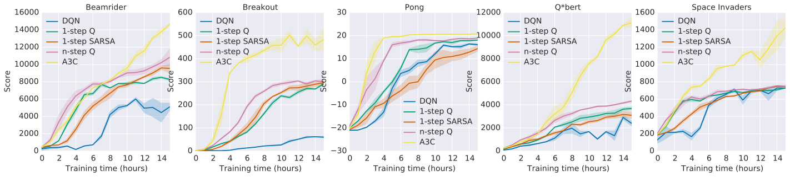
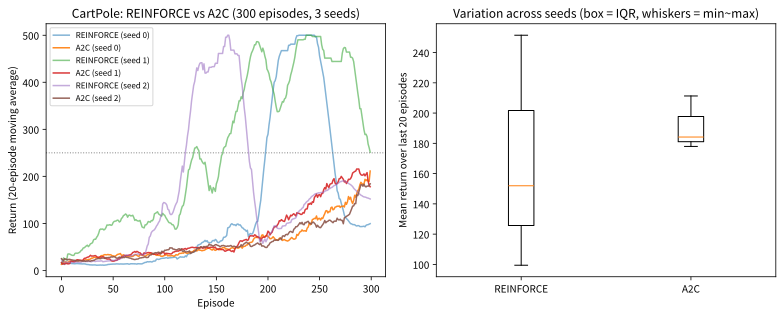
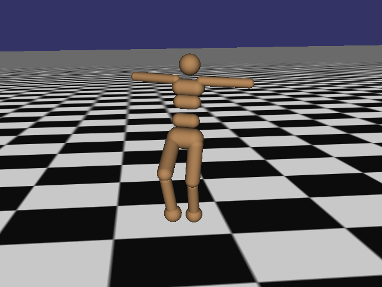

# 10.3 Actor-Critic

[](https://colab.research.google.com/github/SuminHan/book-ml/blob/main/notebooks/ml2/chapter10_3_actor_critic.ipynb)

### Actor-Critic: 분산을 줄이는 개선

REINFORCE[^williams92]는 \\(G\_t\\)(실제로 관찰된 누적 보상)를 그대로 쓰는데, 이건
하나의 에피소드를 샘플링한 결과라 노이즈가 크다(분산이 높다).
**Actor-Critic**[^suttonbarto]은 \\(G\_t\\) 대신, Chapter 4·6에서 배운 가치함수
(Critic)로 추정한 기준값을 빼서 분산을 줄인다(\\(G\_t - V(s\_t)\\), 이
차이를 **어드밴티지**(advantage)라 부른다) — 정책(Actor)과
가치함수(Critic)를 동시에 학습하는 구조다. 자세한 유도는 이 학기
범위를 넘어서지만, "정책 하나만 학습하는 것보다, 가치함수의 도움을
받으면 더 안정적으로 학습된다"는 아이디어는 기억해둘 만하다 — 이
어드밴티지는 Chapter 11의 PPO[^ppo]에서 그대로 재사용된다.


**Q-learning이 "얼마나 좋은지 평가한 뒤 최선을 고른다"는 간접적
전략이라면, 정책기반 방법은 "무엇을 할지" 자체를 직접, 그리고
연속적인 행동 공간에서도 학습한다. Chapter 4에서 증명했듯이 유한한
MDP라면 최적 정책 \\(\pi^\*\\)는 항상 존재한다 — policy gradient는
그 존재가 보장하는 목표를 향해 직접 나아가는 방법이다.**

### 먼저 문제부터: REINFORCE의 업데이트 신호가 "너무 시끄러운" 이유

10.2절의 CartPole[^gym] REINFORCE는 처음 20 에피소드 평균 14.1에서 마지막
20 에피소드 평균 99.5, 최고 500으로 개선됐다 — 배운 것은 배운 것이다.
그런데 시드를 세 번 바꿔가며 실행하면 학습 곡선이 시드마다 **다른
모양**으로 나온다. 어떤 시드는 98에피소드만에 리턴 250을 돌파하지만,
다른 시드는 300에피소드를 다 배워도 150 안팎에 머물기도 한다.
이 "거친" 움직임은 코드의 버그가 아니라 **REINFORCE 자체의 높은
분산**이다.

왜 분산이 큰가. REINFORCE의 업데이트 신호는 \\(G\_t\\) — 시점 \\(t\\)
부터 에피소드가 끝날 때까지 **실제로 쌓인 총 보상**이다. CartPole의
보상은 매 스텝 +1이므로, \\(G\_t\\)는 결국 "폴이 몇 스텝 뒤에
무너졌는가"에 거의 전적으로 달려 있다. 그런데 몇 스텝 뒤로 무너지는가는
"이 스텝의 행동이 좋았는가"와 별개인 요소 — 초기 기울기의 작은 차이,
샘플링의 운 — 에 크게 좌우된다. REINFORCE는 그 운을 업데이트
신호의 크기로 **그대로** 받아들인다: 운 좋게 오래 버틴 에피소드에선
그 날 한 행동 *전부*를 크게 강화하고, 운 없이 일찍 무너진 에피소드에선
전부 크게 낮춘다. **신호에 노이즈가 크게 섞인 채** 경사 상승을
돌리는 셈이다.

이 문제는 Chapter 5의 중요도 샘플링과 같은 뿌리다 — "기댓값을 샘플
하나로 추정하면 흔들린다". 그때의 해법은 "샘플을 더 뽑아 평균"이었다.
RL에서는 그 해법이 그대로 먹지 않는다: 한 에피소드의 샘플은 *현재
정책이 실제로 행동한 결과* 자체라서, "같은 상황에서 더 뽑자"는
말이 쉽게 안 된다(매 에피소드가 새 행동의 대가라는 비용이 있다).
Actor-Critic은 다른 길로 간다 — **샘플 하나하나에 "기준값"을 대고,
절대 보상이 아니라 "평균보다 얼마나 더 좋았는지"라는 상대적 향상으로
신호를 만든다.**

### 베이스라인: "행동에 무관한 값"을 빼도 기댓값은 안 바뀐다

핵심 수학적 사실은 놀라울 정도로 단순하다. \\(b(s\_t)\\)를 **현재
상태 \\(s\_t\\)에만 의존하고, 행동 \\(a\_t\\)에는 전혀 의존하지
않는** 어떤 값이라고 하자(Chapter 4의 가치함수 \\(V(s\_t)\\)가
그런 값의 대표 예). 그러면

\\[\mathbb{E}\_{a\_t \sim \pi(\cdot|s\_t)}\left[\nabla\_\theta \log
\pi\_\theta(a\_t|s\_t)\\, b(s\_t)\right] = b(s\_t)\\,
\mathbb{E}\_{a\_t}\left[\nabla\_\theta \log \pi\_\theta(a\_t|s\_t)\right]
= b(s\_t)\\, \underbrace{\sum\_{a\_t} \nabla\_\theta \pi\_\theta(a\_t|s\_t)}\_{=0}
= 0\\]

세 단계: (1) \\(b(s\_t)\\)는 \\(a\_t\\)와 무관한 상수라 기댓값 밖으로
나온다, (2) \\(\nabla \log \pi = \nabla \pi / \pi\\)이므로
\\(\sum\_a \pi(a) \nabla \log \pi(a) = \sum\_a \nabla \pi(a)\\),
(3) 모든 행동의 확률 합은 \\(1\\)이고, 상수의 미분은 \\(0\\).

이로부터 베이스라인의 성질이 한 줄로 나온다:

\\[\mathbb{E}\left[(G\_t - b(s\_t))\\, \nabla\_\theta \log \pi\_\theta
(a\_t|s\_t)\right] = \mathbb{E}\left[G\_t \nabla\_\theta \log
\pi\_\theta(a\_t|s\_t)\right] - \underbrace{b(s\_t) \\, \mathbb{E}
\left[\nabla\_\theta \log \pi\_\theta(a\_t|s\_t)\right]}\_{=0}\\]

**그래디언트 기댓값(= 진짜 기울기 방향)은 \\(b(s\_t)\\)를 빼도
그대로다.** 그런데 분산은 다르다: 같은 행동을 고르는 상황에서도
\\(G\_t\\)가 크게 흔들리던 신호가, \\(b(s\_t)\\)를 빼고 나면 "기준에서
얼마나 벗어나는가"로 줄어든다. 분산을 최소화하는 최적의
베이스라인은 바로 \\(b^\*(s\_t) = \mathbb{E}[G\_t | s\_t] =
V^\pi(s\_t)\\) — **그냥 가치함수다.** (이 최적성도 전체분산법칙으로
짧게 나오지만, 이번 학기에는 "기댓값을 빼면 흔들림이 줄어든다"는
평균-분산 직관까지만 기억하자.) "왜 베이스라인을 빼야 하는가"의
완전한 답은 이 두 줄 — **기댓값은 불변, 분산은 감소** — 으로
압축된다.

### 숫자로 검증: 2행동 밴딧의 한 스텝

가장 단순한 환경에서 손으로 확인하자. 행동 0은 보상 \\(+1.0\\),
행동 1은 \\(+1.8\\)을 주는 1스텝 밴딧. 상태 특징값 \\(s = 1\\),
소프트맥스 정책 \\(\pi(a|s) = \text{softmax}([0, 0])\\)이므로
\\(p(a=0) = p(a=1) = 0.5\\). (10.2절 연습문제 1의 정책
파라미터화와 정확히 같은 형태다.)

먼저 참값: \\(V(s) = 0.5 \times 1.0 + 0.5 \times 1.8 = 1.4\\).
소프트맥스 정책의 그래디언트(연습문제 1의 공식)에서
\\(\nabla \log \pi(a=0|s) = [0.5, -0.5]\\),
\\(\nabla \log \pi(a=1|s) = [-0.5, 0.5]\\)다. 이제 "이 한 스텝에서
샘플로 나오는 그래디언트"를 두 방식으로 각각 계산한다:

| | a=0이 나왔을 때 | a=1이 나왔을 때 | 기댓값(= 진짜 기울기) |
|---|---|---|---|
| REINFORCE: \\(G\_t \nabla\log\pi\\) | \\(+1.0 \times [0.5, -0.5] = [0.5, -0.5]\\) | \\(+1.8 \times [-0.5, 0.5] = [-0.9, 0.9]\\) | \\(0.5[0.5,-0.5] + 0.5[-0.9,0.9] = [-0.2, 0.2]\\) |
| 베이스라인: \\((G\_t - V)\nabla\log\pi\\) | \\((1.0-1.4)\times[0.5,-0.5] = [-0.2, 0.2]\\) | \\((1.8-1.4)\times[-0.5,0.5] = [-0.2, 0.2]\\) | \\([-0.2, 0.2]\\) |

두 줄을 비교해보자. **기댓값은 \\([-0.2, 0.2]\\)로 완전히 같다** —
둘 다 "행동 1(보상 +1.8)의 확률을 올리는 방향"이다. 하지만
샘플 하나하나의 모양이 다르다: REINFORCE는 a=0이면 \\([0.5, -0.5]\\),
a=1이면 \\([-0.9, 0.9]\\) — 첫 성분이 \\(1.4\\)나 튀어다니는
신호를 매 스텝 무작위로 받는 셈이다. 베이스라인 버전은 **두 샘플이
정확히 같은 벡터** \\([-0.2, 0.2]\\)를 낸다 — 이 작은 예에서는
분산이 정확히 \\(0\\)이 된다. "평균은 그대로, 흔들림은 줄어든다"는
말이 숫자로 보인 것이다.

한 걸음 더: 베이스라인이 *틀린 값*이어도 기댓값은 안 바뀐다.
\\(b = 1.9\\)(참값 1.4와 다른 값)로 빼면 샘플은
\\([-0.45, 0.45]\\) / \\([0.05, -0.05]\\)가 되지만, 기댓값은
여전히 \\([-0.2, 0.2]\\)다. 이 사실이 실전적으로 중요한 이유는
하나 — **Critic은 "완벽할 때까지" 기다릴 필요가 없다.** 처음부터
정확하지 않아도, 대략 근사한 \\(V\\)만 있으면 분산은 크게 줄고
기댓값은 안 훼손된다. Critic이 "쓰이면서 학습하고, 학습하면서
더 정확해진다"는 상호보완 구조가 성립하는 근거가 바로 이
불변성이다.

### 어드밴티지: "평균보다 얼마나 더 좋았는가"

\\(A\_t := G\_t - V(s\_t)\\)를 **어드밴티지**(advantage)라고
부른다. \\(V(s\_t) = \mathbb{E}[G\_t | s\_t]\\)는 "이 상태에서의
*평균적* 수준"이므로, \\(A\_t\\)는 말 그대로 **평균 대비 향상분**이다:

- \\(A\_t > 0\\): "이 상태에서 이 행동을 했더니, 평균 수준보다 더
  좋은 결과를 냈다" → 그 행동의 확률을 **올린다**.
- \\(A\_t < 0\\): "평균보다 나쁜 결과를 냈다" → 확률을 **내린다**.

한 줄의 맥락을 붙이자면: 10.2절 "자주 하는 실수"에서 보았듯,
리턴을 정규화할 때 `returns - returns.mean()`는 **에피소드 내
모든 \\(G\_t\\)의 평균**을 뺀, 가장 느슨한 베이스라인이었다.
Actor-Critic은 그 평균을 "에피소드 내 평균"에서 **상태별 가치함수
\\(V(s\_t)\\)**로 업그레이드한 것이다 — 같은 상태마다 각기 다른,
상태 의존적 기준값을 쓰는 것이다.

### 알고리즘: 두 손실함수와 두 역할

이제 10.2절의 REINFORCE 코드에서 딱 두 가지를 바꾼다. (1)
\\(G\_t\\)를 \\(A\_t = G\_t - V(s\_t)\\)로, (2) \\(V(s\_t)\\)를
내준다는 Critic(값을 예측하는 출력층)을 하나 더 붙인다. PyTorch로[^pytorch]
쓰면:

```python
import torch, torch.nn as nn

class ActorCriticNet(nn.Module):
    def __init__(self, state_dim, n_actions):
        super().__init__()
        self.shared = nn.Sequential(nn.Linear(state_dim, 64), nn.ReLU())
        self.actor_head = nn.Linear(64, n_actions)  # Actor: 각 행동의 확률
        self.critic_head = nn.Linear(64, 1)         # Critic: 상태 가치 V(s)
    def forward(self, x):
        h = self.shared(x)
        return torch.softmax(self.actor_head(h), dim=-1), self.critic_head(h).squeeze(-1)

net = ActorCriticNet(4, 2)  # CartPole: 상태 4차원, 행동 2개
opt = torch.optim.Adam(net.parameters(), lr=1e-3)

def a2c_episode(env, seed, gamma):
    s, _ = env.reset(seed=seed)
    states, log_probs, rewards, nexts = [], [], [], []
    for _ in range(500):
        st = torch.tensor(s, dtype=torch.float32)
        states.append(st)
        probs, _ = net(st)
        dist = torch.distributions.Categorical(probs)
        a = dist.sample()
        log_probs.append(dist.log_prob(a))          # log pi(a_t|s_t)
        s, r, term, trunc, _ = env.step(a.item())
        rewards.append(r)
        nexts.append(torch.tensor(s, dtype=torch.float32))
        if term or trunc:
            break
    # --- 1) Actor 갱신: REINFORCE에서 G_t -> A_t = G_t - V(s_t)만 바꿈 ---
    G, rets = 0.0, []
    for r in reversed(rewards):
        G = r + gamma * G
        rets.insert(0, G)
    rets = torch.tensor(rets)
    vs = torch.stack([net(st)[1] for st in states])  # V(s_t)
    adv = rets - vs.detach()                         # A_t (상수로 취급!)
    actor_loss = -sum(lp * ad for lp, ad in zip(log_probs, adv))
    opt.zero_grad(); actor_loss.backward(); opt.step()
    # --- 2) Critic 갱신: Chapter 6의 TD(0) 값 학습 그대로 ---
    with torch.no_grad():
        vnext = torch.stack([net(ns)[1] for ns in nexts])
    critic_loss = nn.functional.mse_loss(vs, torch.tensor(rewards) + gamma * vnext)
    opt.zero_grad(); critic_loss.backward(); opt.step()
    return sum(rewards)
```

두 손실함수의 역할을 짚으면, 이번 학기 배운 것들의 "재조합"이라는
게 보인다:

- **Actor 손실** \\(-\sum\_t \log \pi(a\_t|s\_t) \\, A\_t\\) — 10.2절
  REINFORCE 손실의 \\(G\_t\\) 자리에 \\(A\_t\\)가 들어간 것이다.
  10.2절에서 `returns`를 정규화한 줄이 "에피소드 평균을 뺀
  초짜 베이스라인"이었다면, 여기서는 `vs`라는 학습된 네트워크의
  출력이 그 역할을 한다.
- **Critic 손실** \\((r\_t + \gamma V(s\_{t+1}) - V(s\_t))^2\\) —
  Chapter 6의 **TD(0) 값 학습**을 그대로 쓴 것이다. 즉 Critic은
  부트스트랩으로 배우는(분산이 작은) 학습자이고, Actor는 에피소드
  리턴(분산이 큰) 신호를 쓰는 학습자 — **Critic이 Actor의 노이즈를
  잡아주는 구조**다.

두 출력(정책, 가치)은 앞부분 `shared` 층을 공유하고 마지막
출력층만 다르다 — FAQ에서 언급한 "특징 추출을 공유하는" 실제
구현의 전형이다. `A2C`라는 이름도 여기서 온다: **A**dvantage
**A**ctor-**C**ritic(DeepMind, 2016)[^a3c] — "A"가 바로 오늘 배운
어드밴티지를 가리킨다. (위 코드는 한 에피소드당 한 번 갱신하는
간소화 버전이고, 원판 A2C/A3C는 매 스텝마다 갱신한다.)




### 실습: CartPole에서 REINFORCE와 A2C의 학습 곡선을 비교

[Colab 노트북](https://colab.research.google.com/github/SuminHan/book-ml/blob/main/notebooks/ml2/chapter10_3_actor_critic.ipynb)
에는 두 알고리즘을 300 에피소드씩, 세 시드(0, 1, 2)로 학습시켜
비교하는 완전한 코드가 있다. 요약하면:

| 알고리즘 (시드) | 처음 20 에피소드 평균 | 마지막 20 에피소드 평균 | 최고 리턴 | 리턴 250 첫 도달 |
|---|---|---|---|---|
| REINFORCE (0) | 14.1 | 99.5 | 500 | 194 |
| REINFORCE (1) | 42.5 | 251.4 | 500 | 150 |
| REINFORCE (2) | 17.5 | 151.9 | 500 | 98 |
| A2C (0) | 20.6 | 211.3 | 500 | 299 |
| A2C (1) | 21.6 | 177.9 | 500 | 277 |
| A2C (2) | 20.4 | 184.2 | 476 | — (미도달) |



세 가지를 읽자. **(1) 시작점은 A2C가 균일하다** — 처음 20 에피소드
평균이 REINFORCE는 14.1~42.5로 흩어진 반면, A2C는 20.4~21.6로
모인다. "시드 불운"의 영향이 기준값을 빼면서 줄었다는 뜻이다.
**(2) 마지막 20 에피소드도 A2C가 좁다** — A2C는 178~211의 좁은
밴드에, REINFORCE는 99.5~251.4로 150 넘게 벌어져 있다. 분산
감소가 시드 간 *일관성*으로 나타난 것이다. **(3) 도달 *속도*는
이야기가 다르다** — 이 실험(300 에피소드, 시드 0~2)에서는
REINFORCE가 오히려 250 돌파가 빠른 시드가 있었다. 이것은
"REINFORCE가 더 좋다"는 뜻이 **아니다**: 분산이 크면 *위쪽*으로도
많이 튀기 때문이다. 분산 감소의 실제 이득 — 안정성을 유지하면서
학습을 *훨씬* 오래, *훨씬* 큰 환경에서 돌릴 수 있게 된 것 — 은
Chapter 11에서 PPO가 어드밴티지를 클리핑된 목적함수에 재사용하면서
비로소 온전히 수확된다.

### 자주 하는 실수

**1. `adv = rets - vs.detach()`에서 `.detach()`를 빼는 것.**
`vs`는 `net`의 Critic 헤드 출력이므로, `actor_loss.backward()`를
돌리면 actor_loss의 그래디언트가 `vs`를 타고 **Critic 헤드
파라미터까지** 흘러가 Actor 갱신 과정에서 Critic도 함께 갱신된다 —
"두 손실이 각자 역할을 할 것"이라는 구조가 무너진다. 어드밴티지는
Actor 손실 안에서는 **상수**(미분 대상이 아닌 곱수)로 취급해야
하므로 `.detach()`가 필요한 것이다. 이 버그는 "Critic이 이상하게
빨리/느리게 학습하는" 형태로만 나타나서 찾기 어렵다.

**2. Critic의 목표값에 \\(G\_t\\)(몬테카를로 리턴)를 쓰는 것.**
Critic 손실을 \\((G\_t - V(s\_t))^2\\)로 쓰면 Critic도 MC
학습자가 된다 — 안 틀리지만 **부트스트랩이 사라져 Critic의 분산이
커진다.** Critic은 "Actor의 노이즈를 잡아줄 사람"인데,
자기 자신이 노이즈가 많으면 기준값 \\(V(s\_t)\\)이 흔들리고,
그 흔들림이 그대로 Actor의 어드밴티지에 전이된다. "Critic은
TD(0)(Chapter 6의 부트스트랩, 분산 작음)으로, Actor는 MC 리턴으로"
— 이 비대칭이 의도된 설계다.

**3. "베이스라인을 넣었더니 학습 속도가 달라졌다"고 하면 버그로
판단하는 것.** 베이스라인은 기댓값(진짜 기울기 방향)은 바꾸지
않지만 **분산은** 바꾼다 — 신호의 크기가 달라지므로 *실효
스텝 크기*가 달라져 학습 속도(수렴 에피소드 수)가 바뀌는 것은
**정상**이다. 속도가 바뀌었다고 해서 기댓값(진짜 기울기 방향)이
깨진 것은 아니다 — 실제로는 변하지 않는다(위 밴딧 예의
\\(b=1.9\\) 행이 그 증거다).

### 역사적 일화: 뇌의 도파민이 바로 TD 오차

"TD 오차"가 단순한 수학적 편의가 아니라는 증거가 1997년에
나왔다. Schultz, Dayan, Montague[^schultz]는 원숭이의 뇌에서 **도파민
신경세포**가 보상을 받을 때마다 "예측보다 좋으면 발화량 증가,
예측보다 나쁘면 감소, 그리고 예측이 정확히 서 있으면 보상이
오기 *전*의 신호(큐) 시점에 발화가 앞당겨진다"는 패턴을
측정했다 — 이것은 \\(\delta\_t = r\_t + \gamma V(s\_{t+1}) -
V(s\_t)\\), 즉 **정확히 TD 오차**다. "예측하지 못했던 좋은 소식"을
보내는 뇌의 신호와, 강화학습이 쓰는 "예측 오차" 신호가
수학적으로 일치한다는 뜻이다. Actor-Critic의 "Critic"은 값
함수를 예측하는 신경망이지만, 뇌에서는 이 역할이 도파민
회로에, "Actor"의 역할은 그 신호를 행동 선택에 쓰는 기저핵
회로에 해당한다는 대응으로까지 이어진다. 강화학습 이론이
생물학 신호를 *설명*에 성공한, 이 분야에서 가장 유명한
일화 중 하나다. (11.3절의 GAE[^gae]도 이 TD 오차 \\(\delta\_t\\)를
여러 개 가중평균한 것 — 같은 뿌리다.)



### 자주 묻는 질문

**Q. Actor와 Critic은 왜 따로 학습하나요? 하나로 합칠 수는
없나요?** 둘은 서로 다른 것을 예측한다 — Actor는 "어떤 행동을 할
것인가"(정책), Critic은 "지금 상태가 얼마나 좋은가"(가치함수)를
예측한다. 실제 구현에서는 두 신경망이 앞부분(특징 추출 층)을 공유하고
마지막 출력층만 다르게 두는 경우도 흔하다 — Chapter 10.2 실습의
`PolicyNet`에 가치를 예측하는 출력 하나만 더 추가하면 간단한
Actor-Critic 구조가 된다.

**Q. \\(G\_t - V(s\_t)\\)(어드밴티지)를 빼도 그래디언트의 기댓값이
그대로라는 게 왜 참인가요?** \\(V(s\_t)\\)는 행동 \\(a\_t\\)와
무관하게 상태 \\(s\_t\\)만으로 결정되는 값이다 — "어떤 행동을
고르든 똑같이 빼지는 상수"를 그래디언트 식에서 빼는 것이므로,
평균적으로(기댓값 관점에서) 어느 방향으로도 편향을 주지 않는다(연습문제
2번). 다만 각 샘플 하나하나를 보면 \\(G\_t\\) 자체의 큰 변동폭이
\\(V(s\_t)\\)만큼 상쇄되어 분산은 확실히 줄어든다 — "평균은 그대로,
흔들림은 줄어든다"는 것이 베이스라인의 핵심 효과다.

**Q. Actor-Critic은 on-policy인가요, off-policy인가요?**
이 절의 구현은 **on-policy**다 — Actor와 Critic이 모두
*현재 정책*이 만든 경험(에피소드)에서만 학습하고, 그 경험을
재사용하지도 않는다(경험 재생 버퍼 없음). REINFORCE가 on-policy
였던 것과 같은 이유다. off-policy Actor-Critic(DQN + 정책
결합, Chapter 9의 경험 재생을 붙인 변형)도 존재하지만, 이번
학기의 표준 흐름 — A2C → Chapter 11 PPO — 은 on-policy
패밀리 안에서 "분산을 줄이는" 방향으로 발전한다.

**Q. CartPole처럼 이산 행동공간인데, 굳이 Actor-Critic을 써야
할까요? DQN이면 됐지.** 맞는 말에 가깝다 — 이산 공간이라면
Chapter 9의 DQN[^dqn]이 더 데이터 효율적일 때가 많다. Actor-Critic이
필수인 순간은 (1) **연속 행동공간**(로봇 관절 힘, Chapter
13~14)에서 \\(\max\_a Q(s,a)\\)를 계산할 수 없을 때, (2)
**탐색 정책** 자체를 확률적으로 학습하고 싶을 때(행동을 샘플링
해서 "다른 선택"도 시도하게 해야 하는 경우)다. 게다가 이번
절의 어드밴티지 \\(A\_t\\)는 PPO의 입력이 되므로, PPO를
사용할 때까지 이 구조를 *실무적으로* 익숙해져 있어야 한다.[^cs234]


> **핵심 정리**: REINFORCE의 신호 \\(G\_t\\)에는 "운"이 섞여
> 있다. **베이스라인** \\(b(s\_t)\\) — 행동에 무관한 값 — 을 빼도
> 그래디언트의 **기댓값은 그대로**이고(행동의 확률 합이 1
> 임에서), **분산만 줄어든다.** 분산을 최소화하는 베이스라인은
> \\(V(s\_t)\\) 자체 — 따라서 **가치함수를 Critic이라 부르고,
> \\(G\_t - V(s\_t)\\)를 어드밴티지라 부르며**, Actor는 이
> 어드밴티지로, Critic은 TD(0)으로, *동시에* 학습한다. "절대
> 보상"이 아니라 "평균 대비 향상"으로 배우는 이 한 가지 아이디어가
> Chapter 11의 PPO로 이어진다.[^silvercourse]

---

## 연습문제

**1. (코딩)** 간단한 이산 행동공간(2개 행동) softmax 정책에 대해, 한
에피소드의 REINFORCE 업데이트를 완성하라(핵심 줄은 빈칸으로 남겨져
있다고 가정):

```python
import math

def softmax_policy(theta, state_feature):
    # ADD ADDITIONAL CODE HERE!!
    # logits = [theta[0]*state_feature, theta[1]*state_feature]
    # softmax 확률 계산 (수치안정성을 위해 max 빼고 exp)
    return probs

def reinforce_update(theta, episode, alpha, gamma):
    # episode: [(state_feature, action, reward), ...]
    # ADD ADDITIONAL CODE HERE!!
    # 리턴(return) G_t를 뒤에서부터 누적 계산 (할인 적용)
    for t, (s, a, r) in enumerate(episode):
        probs = softmax_policy(theta, s)
        # ADD ADDITIONAL CODE HERE!!
        # grad_log_pi: action=0이면 [1-probs[0], -probs[1]]*s, action=1이면 [-probs[0], 1-probs[1]]*s
        # theta 갱신: theta += alpha * G[t] * grad_log_pi
    return theta
```

**2. (개념 서술)** Actor-Critic이 REINFORCE보다 분산이 낮은 이유를,
"베이스라인(baseline)을 빼도 그래디언트의 기댓값은 바뀌지 않는다"는
사실과 연결지어 두세 문장으로 설명하라(직관 수준으로 충분하다).

**3. (손유도, Tier C — 최우선 폴백 대상)** 정책 \\(\pi\_\theta\\) 하에서
기대 리턴 \\(J(\theta) = \mathbb{E}\\_{\tau \sim \pi\_\theta}[R(\tau)]\\)의
그래디언트가

\\[\nabla\_\theta J(\theta) = \mathbb{E}\\_{\tau}\left[\sum\_t \nabla\_\theta \log
\pi\_\theta(a\_t|s\_t) \\, G\_t\right]\\]

가 됨을, 로그미분 트릭을 사용하여 유도하라. (수학 상위권/희망자
대상 심화 — 대부분은 아래 워크시트를 기본값으로 한다.)

**빈칸채움형 워크시트 버전** (기본값):

```
목표: J(theta) = sum_tau P(tau; theta) * R(tau) 를 theta로 미분하고 싶다.
문제: P(tau; theta)를 직접 미분하면 기댓값(적분) 형태가 깨져서 샘플로 추정할 수 없다.

로그미분 트릭: grad(f) = f * grad(log f)

Step 1: grad_theta P(tau;theta) = P(tau;theta) * ______________  [로그미분 트릭 적용]

Step 2: grad_theta J(theta) = sum_tau ______________ * R(tau)
                             = E_tau[ grad_theta log P(tau;theta) * R(tau) ]

Step 3: 궤적 확률 P(tau;theta) = prod_t pi_theta(a_t|s_t) * (환경전이확률, theta와 무관)
        따라서 grad_theta log P(tau;theta) = ______________

결론: grad_theta J(theta) = E_tau[ (sum_t grad_theta log pi_theta(a_t|s_t)) * R(tau) ]
```

**정확성 확인**: Step 3의 "환경전이확률은 theta와 무관하다"는 사실이
왜 중요한지 한 문장으로 설명하라(힌트: 이게 없으면 환경 모델을
몰라도 정책만으로 학습 가능하다는 model-free RL의 핵심 성질이
깨진다).

**4. (개념)** 본문의 `adv = rets - vs.detach()` 줄에서 `.detach()`를
빼면, `actor_loss.backward(); opt.step()`을 실행한 **후**에
`critic_head`의 파라미터 값이 어떻게 달라지는가? (1~2 문장으로 답.
힌트: `vs`는 어떤 네트워크의 출력인가, 그래디언트는 어디까지
흘러가는가.)

**5. (수치)** 본문 밴딧 예(보상 \\(+1.0\\)/\\(+1.8\\), \\(s=1\\))에서
\\(p(a=0) = 0.3\\)(즉 \\(\theta\\)가 (0,0)가 아닌, 행동 1을 약간
선호하는 정책)로 바꿨다고 하자. (a) 새로운 \\(V(s)\\)를 계산하고,
(b) REINFORCE 그래디언트 기댓값
\\(\mathbb{E}[G\_t \nabla \log \pi] = p\_0 \cdot 1.0 \cdot
\nabla\log\pi(a=0) + p\_1 \cdot 1.8 \cdot \nabla\log\pi(a=1)\\)을
두 성분으로 계산하라. (c) 이 벡터의 방향이 어떤 행위의 확률을
올리려 하는지(행동 0/1 중) 한 문장으로 말하라. (힌트: 방향은
"더 좋은 행동" 쪽으로 향해야 한다 — 그래디언트가 그런 방향으로
나오지 않으면 어딘가를 잘못 계산한 것이다.)

[^a3c]: Mnih, V. et al. (2016). "Asynchronous Methods for Deep Reinforcement Learning." arXiv:1602.01783.
[^cs234]: Stanford CS234: Reinforcement Learning. https://web.stanford.edu/class/cs234/
[^ppo]: Schulman, J. et al. (2017). "Proximal Policy Optimization Algorithms." arXiv:1707.06347.
[^gae]: Schulman, J. et al. (2015). "High-Dimensional Continuous Control Using Generalized Advantage Estimation." arXiv:1506.02438.
[^dqn]: Mnih, V. et al. (2015). "Human-level control through deep reinforcement learning." Nature 518, 529–533. (Earlier preprint: Mnih, V. et al. (2013). arXiv:1312.5602.)
[^gym]: Brockman, G., Cheung, V., Pettersson, L., Schneider, J., Schulman, J., Tang, J., Zaremba, W. (2016). "OpenAI Gym." arXiv:1606.01540.
[^pytorch]: Paszke, A., Gross, S., Massa, F., Lerer, A., Bradbury, J., Chanan, G., et al. (2019). "PyTorch: An Imperative Style, High-Performance Deep Learning Library." NeurIPS 2019. arXiv:1912.01703.
[^schultz]: Schultz, W., Dayan, P., Montague, P. R. (1997). "A Neural Substrate of Prediction and Reward." Science 275(5306), 1593–1599. — 원숭이에서 도파민 신경세포가 TD 오차처럼 보상 예측에 반응함을 측정한 원 논문.
[^suttonbarto]: Sutton, R. S., Barto, A. G. (2018). "Reinforcement Learning: An Introduction" (2nd ed.). MIT Press. 저자 공식 무료 공개: http://incompleteideas.net/book/the-book-2nd.html — Actor-Critic(정책 그래디언트 + 가치함수 베이스라인의 결합)은 이 표준 교과서 Chapter 13 "Actor-Critic Methods"의 정석적 주제다.
[^silvercourse]: Silver, D. (2015). "UCL Course on Reinforcement Learning," Advanced Topics (COMPM050/COMPGI13) — 10개 강의 슬라이드(PDF) 및 영상 강의가 공개되어 있다. https://www.davidsilver.uk/teaching/ (본 장과 가장 직접적으로 겹치는 Lecture 9: Exploration and Exploitation — 47쪽, ε-greedy·멀티암 밴딧·컨텍스트 밴딧: https://davidstarsilver.wordpress.com/wp-content/uploads/2025/04/lecture-9-exploration-and-exploitation.pdf, CC-BY-NC 4.0).
[^williams92]: Williams, R. J. (1992). "Simple Statistical Gradient-Following Algorithms for Connectionist Reinforcement Learning." Machine Learning 8(3), 229–262. — 스코어함수 추정치와 정책 그래디언트(REINFORCE 계열)를 동일하게 식별한 원 논문.
