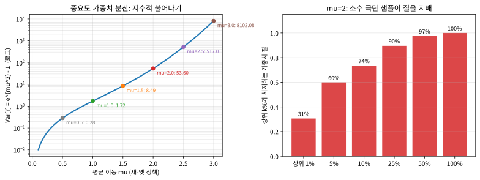

# 11.1 신뢰 영역과 확률비

### 위치: 이번 절이 해결할 문제

Chapter 10에서 REINFORCE와 Actor-Critic을 만들 때, 둘 다 에피소드 한 번
마다 모은 데이터를 **그대로 한 번 쓰고 버렸다**. 이유는 단순했다 — 정책이
바뀌는 순간, "옛 정책이 그 행동을 얼마나 좋아했는가"에 기반한 그래디언트는
더 이상 새 정책의 그래디언트가 아니기 때문이다(온-폴리시, on-policy).
데이터를 아끼고 싶을 만큼 아깝지만, 재사용하는 순간 근사가 틀어진다.

그리고 별개의 두 번째 문제가 있었다. 경사 상승 스텝이 **한 번이라도 너무
크면** 정책이 갑자기 나쁜 방향으로 확 바뀌어서, 이후 몇 번의 업데이트로는
돌려놓을 수 없는 경우가 있다. 로봇처럼 "한 번 무너지면 다시 세우기
어렵다"는 상황에서는 이 두 문제가 동시에 치명적이다.

이번 절은 이 두 문제를 한 번에 다루는 **두 도구**를 소개한다.
**첫째, 신뢰 영역(trust region)** — "한 번의 업데이트에서 정책이
얼마나 움직일 수 있는가"에 대한 상한을 정한다. **둘째, 확률비
(probability ratio)** — 옛 정책을 쓸 때 모은 데이터를 새 정책의 관점에서
재사용할 수 있게 해주는 도구다. 이 두 도구가 11.2절에서 **클리핑**이라는
한 줄짜리 식으로 합쳐지고, 11.3절에서 GAE와 함께 PPO를 완성한다. 이번
절은 그 "재료"를 준비하는 절이다.

### 신뢰 영역이라는 직관

산을 내려갈 때 안개가 껴서 한 치 앞만 보인다고 하자. 경사가 가장 가파른
방향으로 무작정 큰 걸음을 내디디면, 그 방향의 지형이 어떻게 바뀌는지도
모른 채 절벽으로 떨어질 수 있다. 안전한 전략은 "한 걸음의 크기를 믿을
수 있는 범위(신뢰 영역, trust region) 안으로 제한하는 것"이다 —
PPO의 핵심 아이디어가 바로 이것이다. 정책이 한 번의 업데이트로 너무
크게 바뀌지 않도록 제약을 걸어서, 매 스텝이 실제로 개선을 보장하는
좁은 범위 안에서만 이동하게 한다.

"한 걸음의 크기"를 어떻게 재느냐가 관건이다. 정책은 행동의 **확률분포**
이므로, "두 정책이 얼마나 다른가"는 파라미터 \\(\theta\\)의 차
\\(\\|\theta - \theta\_{\text{old}}\\|\\)로 재기보다, **분포 자체의
거리**로 재는 게 자연스럽다. 표준적인 선택은 **KL 발산**(KL
divergence)이다:

\\[D\_{\text{KL}}\big(\pi\_\theta \\,\\|\\, \pi\_{\theta\_{\text{old}}}\big)
= \mathbb{E}\_{s\sim \rho}\Big[\\,
\mathbb{E}\_{a\sim\pi\_\theta(\cdot|s)}
\log \frac{\pi\_\theta(a|s)}{\pi\_{\theta\_{\text{old}}}(a|s)}
\Big]\\]

여기서 \\(\rho\\)는 상태 방문 분포다. KL 발산은 "새 정책이 옛 정책과
얼마나 다른 분포를 만들었는가"를, 옛 정책이 실제로 행동했을 행동을
가중해서 잴 때의 평균 로그비로 정의한다. 0이면 두 정책이 정확히
같고, 클수록 서로 다른 행동을 다르게 선호한다 — "정책 공간에서의
걸음 크기"를 재는 자연스러운 눈금이다.

TRPO(Trust Region Policy Optimization, 2015)는 이 직관을 그대로
수식으로 써서, **"KL 발산이 \\(\delta\\)를 넘지 않는 범위 안에서
J(\\(\theta\\))를 최대화한다"는 제약된 최적화**를 매 스텝마다 풀었다.
보장은 강력하다 — 제약이 충분히 작으면 매 업데이트가 성능을
절대 떨어뜨리지 않는(단조 개선)을 증명할 수 있다. 그러나 이 제약된
최대화를 실제로 풀려면 2차 미분(피셔 정보 행렬)과 conjugate
gradient, line search까지 동원해야 해서 무겁다. PPO는 "이 강력한
보장을 유지하면서 이 기계장치를 어떻게 단순화할 수 있는가"에서
시작한다 — 그리고 그 단순화의 핵심이 바로 아래 확률비다.

### 확률비와 중요도 샘플링

핵심 도구는 **확률비**(probability ratio)다 — 지금 업데이트하려는
정책 \\(\pi\_\theta\\)와, 데이터를 모을 때 썼던 정책
\\(\pi\_{\theta\_{\text{old}}}\\)가 같은 행동에 부여하는 확률의 비다:

\\[r\_t(\theta) := \frac{\pi\_\theta(a\_t|s\_t)}{\pi\_{\theta\_{\text{old}}}(a\_t|s\_t)},
\quad r\_t(\theta\_{\text{old}}) = 1\\]

\\(r\_t\\)가 1보다 크면 그 행동을 전보다 더 선호하게 됐다는 뜻, 1보다
작으면 덜 선호한다는 뜻이다. 이 비율을 쓰면 "옛 정책이 모은 데이터"를
"새 정책 관점에서" 재사용할 수 있다(**중요도 샘플링** — Chapter 5.3에서
MC의 off-policy 학습에 처음 등장했던 바로 그 도구가 여기서 다시
쓰인다):

\\[L^{IS}(\theta) = \mathbb{E}\_t[r\_t(\theta) A\_t]\\]

\\(A\_t\\)는 Chapter 10.3에서 정의한 어드밴티지, \\(A\_t := G\_t -
V(s\_t)\\)다. 문제는 이 목적함수를 그냥 최대화하면 \\(r\_t\\)가
한없이 커지도록(같은 행동만 계속 더 밀어주도록) 학습이 폭주할 수
있다는 것이다 — 데이터는 재사용되지만, "정책이 너무 멀리 움직이지
않는다"는 보장은 어디에도 없다.

**왜 \\(L^{IS}\\)을 최대화하면 원래 목표인 \\(J(\theta)\\)를
최대화하는 것과 같은 방향인가?** 그래디언트를 실제로 계산해보면
명확하다. \\(\pi\_{\text{old}}\\)는 \\(\theta\\)와 무관한 상수
(데이터를 모을 때 고정했던 정책)이므로:

\\[\nabla\_\theta L^{IS}(\theta)
= \mathbb{E}\_t\left[\nabla\_\theta \frac{\pi\_\theta}{\pi\_{\text{old}}}\\,A\_t\right]
= \mathbb{E}\_t\left[\frac{\pi\_\theta}{\pi\_{\text{old}}}\\,
\nabla\_\theta \log\pi\_\theta\\, A\_t\right]
= \mathbb{E}\_t\left[r\_t(\theta)\\, \nabla\_\theta \log\pi\_\theta\\, A\_t\right]\\]

두 번째 등호는 Chapter 10.1의 로그미분 트릭(\\(\nabla \pi =
\pi \nabla \log \pi\\))의 직접 적용이다. 여기서 핵심은, \\(L^{IS}\\)의
그래디언트가 **평범한 policy gradient \\(\nabla \log \pi\_\theta\\, A\_t\\)
에 계수 \\(r\_t\\)가 곱해진 형태**라는 점이다. 데이터를 방금 모은
시점(\\(\theta = \theta\_{\text{old}}\\))에서는 \\(r\_t = 1\\)이므로
\\(L^{IS}\\)의 그래디언트는 10.3절 Actor-Critic의 그래디언트와
**정확히 같다**. 즉 확률비로 목적함수를 다시 쓴 순간, "옛 데이터를
재사용해도 첫 스텝에서는 정직한 policy gradient"라는 성립이 자동으로
따라온다 — 이것이 확률비가 "재사용의 열쇠"인 이유다. (\\(\theta\\)가
\\(\theta\_{\text{old}}\\)에서 멀어지면 계수 \\(r\_t\\)가 1에서 벗어나
이 동등성이 약해진다 — 그 "멀어지는 정도"를 11.2절의 클리핑이
막는다.)

### 손으로 한번: \\(r\_t\\)는 실제로 어떻게 움직이는가

추상적으로만 보면 \\(r\_t\\)가 "1에서 벗어나는 정도"일 뿐인데, 실제로
얼마나, 어떤 방향으로 벗어나는지 2-행동 softmax 정책으로 손으로
계산해보자. 정책을 로짓 \\((\theta\_0, \theta\_1)\\)에 softmax를
적용한 것으로, 시작점 \\(\theta\_{\text{old}}=(0,0)\\)에서는 두
행동을 반반(\\(p\_0=0.5\\))으로 고른다.

"행동 0이 좋다는 걸 배워서" \\(\theta\_0\\)를 계속 올리며
\\(\theta\_1=0\\)을 고정하면:

| \\(\theta\\) | \\(p\_0\\) (새 정책) | \\(r\_0 = p\_0/0.5\\) |
|---|---|---|
| \\((0.0, 0.0)\\) | 0.5000 | **1.000** (처음) |
| \\((1.1, 0.0)\\) | 0.7503 | 1.501 |
| \\((2.2, 0.0)\\) | 0.9002 | 1.800 |
| \\((4.4, 0.0)\\) | 0.9879 | 1.976 |

세 가지가 보인다. **첫째**, \\(r\_0\\)는 항상 1에서 출발한다(데이터를
모은 시점에서는 새·옛 정책이 같으므로). **둘째**, 좋은 행동을 계속
밀면 \\(r\_0\\)가 1보다 커지며 올라간다 — "그 행동을 더 선호하게
됐다"는 것의 정량이다. **셋째**, 2-행동 이산 정책에서는 \\(p\_0\\le 1\\)
이므로 \\(r\_0\\le 2\\)로 **위에서 유한하다**. 이산 정책은 비가
"한없이" 커지지는 않는다 — 다만 **경계(여기서 2)에 빠르게 붙는다**.
클리핑(11.2)이 막는 것은 정확히 이 "경계에 붙는" 구간이다:
\\(r\_0\\)가 \\(1.2\\)를 넘으면 더 이상 목적함수에 기여하지 못하게
해서, \\(p\_0\\)가 0.9 이상으로 확 밀리는 걸 허용하지 않는다.
연속(가우시안) 정책에서는 이 "위에서 유한"한 성질조차 사라진다 —
아래 절에서 그 차이가 얼마나 큰지 본다.

### 문제: 하나의 샘플이 전부 지배할 수 있다

이산 2-행동에서는 \\(r\_t\\)가 유한했지만, "\\(r\_t\\)가 커질수록
어떤 일이 벌어지는가"는 여전히 중요하다. **중요도 샘플링의 분산**이
바로 그 문제다.

연속 정책에서 가장 단순한 사례로, 같은 표준편차 \\(\sigma=1\\)인
가우시안 정책 둘을 둔다: 옛 정책 \\(\pi\_{\text{old}}=\mathcal{N}(0,1)\\),
새 정책 \\(\pi\_{\theta}=\mathcal{N}(\mu,1)\\) — 평균만 \\(\mu\\)만큼
움직인 경우다. 옛 정책이 뽑은 샘플 \\(x \sim \mathcal{N}(0,1)\\)에 대한
확률비는:

\\[r(x) = \frac{\pi\_\theta(x)}{\pi\_{\text{old}}(x)}
= \exp\\!\Big(-\tfrac{x^2}{2} + \tfrac{(x-\mu)^2}{2}\Big)
= \exp\\!\big(\mu x - \tfrac{\mu^2}{2}\big)\\]

이것은 **로그정규분포**다. 기댓값은 항상 1(중요도 샘플링의
본질 — 재가중해도 평균은 보존된다)이지만, **분산**은
\\(\operatorname{Var}[r] = e^{\mu^2} - 1\\)로 **\\(\mu^2\\)에
지수적으로** 불어난다:

| 평균 이동 \\(\mu\\) | \\(\operatorname{Var}[r]=e^{\mu^2}-1\\) | \\(\Pr(r>5)\\) | \\(r\\)의 99퍼센타일 |
|---|---|---|---|
| 0.5 | 0.284 | 0.00026 | 3.6 |
| 1.0 | 1.718 | 0.0175 | 16.9 |
| 1.5 | 8.488 | 0.0342 | 100.9 |
| 2.0 | 53.598 | 0.0356 | 774.8 |
| 2.5 | 517.013 | 0.0291 | 7636.9 |
| 3.0 | 8102.084 | 0.0209 | 96654.7 |

\\(\mu=1\\)이면 분산 1.7(아직 괜찮아 보인다) → \\(\mu=2\\)이면 53.6
→ \\(\mu=3\\)이면 **8102**다. \\(\mu\\)가 1에서 3으로 세 배가 되는
동안 분산은 **사천 배**가 됐다. "새 정책이 옛 정책과 살짝 다를
뿐"이라고 느긋하게 넘길 수 없는 구간이다.

구체적으로 \\(\mu=2\\)로 10,000개 샘플을 뽑아보면: 가중치의 평균은
1에 가깝지만(0.91), **최댓값은 약 143**, 그리고 **상위 1%(100개)
샘플이 전체 가중치 합에서 약 31%를 차지**한다. 즉 업데이트의
방향은 "대부분의 샘플"이 아니라 **소수의 극단 샘플**이 정한다.
이 극단 샘플 하나하나가 노이즈이므로, 업데이트가 노이즈에 지배당해
정책이 흔들리고 — 바로 11.2절 클리핑이 "이 극단 샘플의 기여를
\\(1+\epsilon\\)으로 잘라버리는" 이유다.

**"분산이 큰 것"과 "한 샘플이 지배한다"는 같은 말인가?**
관련되지만 다르고, 여기서는 둘 다 문제가 된다. 분산이 크면 **반복
평균**으로(데이터를 많이 모으면) 줄여줄 수 있다. 그런데 중요한
것은 **한 번의 미니배치 업데이트**에서 소수 극단 샘플이 방향을
지배하는 현상이다 — 데이터량이 충분해도, 그 극단 샘플이 *한 방향*으로
운 좋게 쏠리면 그 한 스텝은 크게 틀어진다. 신뢰 영역(클리핑)은
"분산을 줄이는" 수단이 아니라 "**단일 스텝에서 한 샘플이 영향을
줄 수 있는 최대 크기**를 제한하는" 안전장치다.

### Chapter 5.3의 중요도 샘플링과 무엇이 다른가

Chapter 5.3에서 배운 중요도 샘플링은 "off-policy: target 정책의
데이터를 behavior 정책의 데이터로 근사"하는 도구에 가깝게 나왔다.
여기서는 **그 도구 자체를 최적화 목적함수로 끌어다 쓴다** —
\\(L^{IS}=\mathbb{E}[r\_t A\_t]\\)를 최대화 *대상*으로 삼는다는
점이다. 그래서 중요도 샘플링이 원래 가진 "무게가 크게 부등한
샘플들이 편향 없이 평균은 맞히되, 작은 데이터에서는 한 샘플에
지배당한다"는 성질이 **학습의 불안정성**으로 직접 연결된다.
도구로 쓸 때는 "평균이 맞으면" 된 일이, 목적함수로 쓸 때는
"매 스텝의 그래디언트 방향"이므로 훨씬 민감해지는 것이다.
이 절의 통찰은, "Chapter 5.3의 도구가 여기서는 안전문제가 된다"는
점이다.

### 자주 하는 실수

**"\\(r\_t=1\\)로 고정하면 되지 않나?"** — \\(r\_t=1\\)을 유지하려면
\\(\pi\_\theta=\pi\_{\theta\_{\text{old}}}\\), 즉 정책을 **전혀
움직이지 말아야** 한다. 그러면 학습 자체가 안 된다. 문제는
\\(r\_t=1\\)을 유지하는 것이 아니라, **\\(r\_t\\)가 1에서 조금만
벗어나도록 허용하되(\\(\epsilon\\)만큼), 그 이상은 잘라내는
것**이다. "아예 못 움직이는" 것과 "적당히만 움직이는 것"을 혼동하면
안 된다.

**"확률비를 쓰면 편향(bias)이 사라지는가?"** — 아니다. \\(L^{IS}\\)의
그래디언트가 *첫 스텝*(\\(\theta=\theta\_{\text{old}}\\))에서 policy
gradient와 같다는 것은, 그 이후에는 다르다는 뜻이기도 하다.
\\(r\_t\\)를 여러 에폭에 걸쳐 재사용할수록(\\(\theta\\)가
\\(\theta\_{\text{old}}\\)에서 멀어질수록) 이 근사 오차가 쌓인다 —
그래서 PPO는 데이터를 몇 에폭만 쓰고 버린다(11.2 FAQ). 확률비는
"편향을 없애는" 도구가 아니라, **짧은 시간 안에 거의 bias-free로
데이터를 재사용하게 해주는** 도구다.

**"\\(\epsilon\\)이 클수록 더 빨리 학습되지 않나?"** — 클수록
한 스텝에서 더 크게 움직일 수 있으니 "빠르게" 보일 수 있다. 그러나
\\(r\_t\\)가 클리핑 범위를 크게 벗어나는 일이 잦아지고, 위 가우시안
예에서 본 분산 불어나기/한 샘플 지배가 더 자주 일어나 **학습이
불안정해진다**. \\(\epsilon\\)는 "속도"가 아니라 "안정성"의
노브다 — 너무 작으면(0.05 이하) 학습이 지나치게 느려지고, 너무
크면(0.5 이상) 정책 붕괴 위험이 커진다. 실용적으로는
\\(\epsilon\approx 0.2\\)가 좋은 출발점이다.

### 확인 문제

1. (코드 읽기) 2-행동 softmax에서 \\(\theta\_{\text{old}}=(0,0)\\)이고
   새 정책 \\(\theta=(1.1,0)\\)일 때, 행동 0의 확률비
   \\(r\_0=p\_0/0.5\\)를 \\(p\_0\\)를 직접 softmax로 계산해 구하라
   (0.7503/0.5 = 1.501 확인). 만약 같은 정책에서 **행동 1**의
   확률비 \\(r\_1\\)는 얼마인가? (힌트: \\(p\_1=1-p\_0\\).)

2. (개념) \\(\nabla\_\theta L^{IS}\\)가 \\(\theta=\theta\_{\text{old}}\\)
   에서 policy gradient와 같다는 증명에서, "왜 정확히 *그 한 지점*
   에서만 같은가"? \\(r\_t\\)를 \\(\theta\_{\text{old}}\\) 근방에서
   전개했을 때 1차항만 policy gradient에 대응하고, 그 이상의 항
   (2차 이상)이 근사 오차라는 사실을 근거로 설명하라.

3. (수학, Tier B) 가우시안 예에서 \\(\operatorname{Var}[r] =
   e^{\mu^2}-1\\)임을, \\(r=\exp(\mu x-\mu^2/2)\\),
   \\(x \sim \mathcal{N}(0,1)\\)의 정규모멘트생성함수
   \\(\mathbb{E}[e^{tx}]=e^{t^2/2}\\)를 이용해 유도하라.
   (힌트: \\(\mathbb{E}[r]=e^{\mu^2/2}e^{-\mu^2/2}=1\\),
   \\(\mathbb{E}[r^2]=e^{2\mu^2/2}e^{-\mu^2}\\).)

### 역사: "신뢰 영역"은 50년 된 아이디어

"최대화의 한 걸음 크기를 제한한다"는 아이디어는 PPO의 발명이 아니다.
신뢰 영역 알고리즘(trust region method)은 1960~70년대 **미분없는
최적화**(unconstrained optimization)에서 나온 고전 기법으로,
"목표함수의 2차 근사가 잘 맞는 작은 영역 안에서만 근사함수를
최적화한다"는 원리였다 — Maritz(1971)이 이 분리를 확률적 시뮬레이션
문맥에서 다뤘고, 이후 Moore(1981)가 미분없는 최적화에서 정식화했다.
즉 **"근사된 목적함수를 멀리서 믿지 말고, 가까운 영역에서만
믿는다"**는 태도 자체가 통계·최적화에서 오래된 지혜였다.

RL에서 이 지혜가 되살아난 것이 2015년 **TRPO**다. "KL 발산이
\\(\delta\\) 안이면 policy gradient의 2차 근사가 안전하다"는
보장을 증명하고, 그것을 2차 계획으로 매 스텝 풀었다. 보장은 아름다웠지만
구현이 무거웠다 — 피셔 정보 행렬의 역을 구하는 conjugate gradient,
line search까지. **PPO(2017, Schulman 외)**는 "이 보장을 1차
기법(클리핑)으로 근사해도, 실전에서 거의 같은 안정성을 얻는다"는
관찰 위에 있다. "TRPO는 이론적으로 정답, PPO는 실용적으로 정답"이
아니라 — **같은 신뢰 영역 원리를, 풀이를 쉬운 쪽으로 바꿨을 뿐**
이다. 이번 절의 확률비와, 11.2절의 클리핑은 그 "쉬운 쪽"의 두
요소다.

### 자주 묻는 질문

**Q. \\(r\_t(\theta\_{\text{old}})=1\\)이 항상 성립하는 이유는
무엇인가요?** 방금 데이터를 모은 시점에는 "지금 정책"과 "데이터를
모은 정책"이 완전히 같으므로, 같은 행동에 부여하는 확률도 당연히
같다(비율이 1) — 그 이후 몇 번의 경사 상승 스텝을 거치며 \\(\theta\\)가
\\(\theta\_{\text{old}}\\)에서 조금씩 멀어지면서 \\(r\_t\\)가 1에서
벗어나기 시작한다.

**Q. 중요도 샘플링 하나만으로는 왜 부족한가요?** Chapter 5.3에서
배운 것처럼 중요도 샘플링 자체는 "옛 데이터를 새 정책 관점으로
재가중"할 뿐, 그 재가중이 만드는 그래디언트의 크기에는 아무 제약이
없다 — 극단적으로 \\(r\_t\\)가 매우 커지면 그 한 샘플이 전체
업데이트를 지배해버릴 수 있다. 11.2절에서 배울 클리핑이 바로 이
"크기 제한"을 추가하는 장치다.

**Q. KL 발산은 비대칭인데, 방향(\\(\pi\_\theta\\|\pi\_{\text{old}}\\)
vs. 그 반대)이 왜 중요한가요?** \\(D\_{\text{KL}}(\pi\_\theta\\|\pi\_{\text{old}})\\)
는 "새 정책이 옛 정책이 *거의* 확률 0로 보는 행동에 확률을 붙이는
것"을 무겁게 벌한다(그 행동이 옛 정책에서 거의 안 나왔는데 새 정책에서
자주 나오면 로그비가 크게 음수, 그 *부정*이 커진다). 이 방향을 쓰면
"새 정책이 옛 데이터에서 본 적 없는 영역으로 도망가지 못한다"는
직감이 자연스럽게 붙는다 — 데이터 재사용의 전제가 "옛 정책이 실제로
방문한 상태·행동"이므로, 그 영역 밖으로 나가는 걸 막는 방향이다.
(실전 PPO는 KL 발산 대신 확률비 클리핑으로 이 역할을 근사한다.)

**Q. \\(A\_t\\)가 0인 샘플은 \\(r\_t\\)가 아무리 커도 무관합니까?**
맞다 — \\(L^{IS}=r\_t A\_t\\)이므로 \\(A\_t=0\\)이면 그 샘플의 기여는
항상 0이다. "평균적인 행동"은 확률이 바뀌어도 보상이 평균이므로
업데이트에 힘을 주지 않는다. 그러나 \\(A\_t\\)가 0에 *가까운*
샘플은 \\(r\_t\\)가 크면 \\(r\_t A\_t\\)가 작지 않을 수 있어,
**"약하게 좋았다/나빴다"는 샘플의 신호가 극단 샘플의 노이즈에
묻히는** 것이 불안정성의 또 다른 얼굴이다.

---

**신뢰 영역은 "한 걸음의 크기를 믿을 수 있는 범위로 제한한다"는
직관, 확률비 \\(r\_t=\pi\_\theta/\pi\_{\text{old}}\\)는 "옛 데이터를
새 정책 관점에서 재사용한다"는 도구다. \\(r\_t\\)는 1에서 출발해
정책이 움직이는 만큼 벗어나고, \\(L^{IS}=\mathbb{E}[r\_t A\_t]\\)의
그래디언트는 첫 스텝에서 policy gradient와 정확히 같아 "재사용
해도 정직한 첫 걸음"을 보장한다. 그러나 \\(r\_t\\)가 크면 중요도
샘플링의 분산이 \\(e^{\mu^2}-1\\)로 지수적으로 불어나 소수 극단
샘플이 업데이트를 지배한다 — 이 두 사실(첫 걸음은 정직, 큰 걸음은
위험)이 11.2절의 클리핑이 존재하는 이유이며, PPO 전체의 설계
원리다.**
