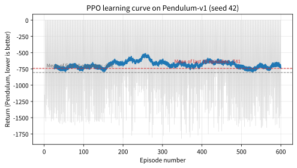

# 11.2 PPO 클리핑과 연속 제어 실습

[](https://colab.research.google.com/github/SuminHan/book-ml/blob/main/notebooks/ml2/chapter11_2_ppo_clip_pendulum.ipynb)

### 위치: 11.1절의 문제를 클리핑 한 줄로 바꾸기

11.1절은 문제를 정확히 짚었다: 정책 그래디언트를 **데이터 재사용** 가능
하게 만든 중요도 샘플링 목적함수 \\(L^{IS}(\theta) =
\mathbb{E}\_t[r\_t(\theta) A\_t]\\)를 그냥 최대화하면, 같은 행동을 계속
더 밀어주도록 \\(r\_t\\)가 한없이 커지도록 학습이 폭주할 수 있다. TRPO
(11.3절에서 다룸)는 이 문제를 "KL 발산이 \\(\Delta\\)를 넘지 않는다"는
명시적 제약을 2차 미분 도구로 풀어내려다 무거워졌다. PPO의 제안은
의외로 간단했다 — 제약을 식에 **직접 박아 넣는 것**이다.
"\\(r\_t\\)가 1 근처를 벗어나면, 벗어난 만큼의 이득은 인정하지 않겠다."
이 절의 나머지 내용은 그 한 줄(클리핑)이 만들어내는 목적함수의 모양을
손으로 확인하고(첫 번째 반), 이를 실제 연속 제어 환경(Pendulum)에서
통째로 동작하는 PPO로 구현해보는 것이다(두 번째 반).

### 클리핑: 너무 멀리 못 가게 막기

PPO의 해법은 단순하다 — \\(r\_t\\)가 \\([1-\epsilon, 1+\epsilon]\\)
(보통 \\(\epsilon = 0.2\\)) 범위를 벗어나면, 그 구간 밖으로 나간
만큼의 이득을 깎아버린다:

\\[L^{CLIP}(\theta) = \mathbb{E}\_t\left[\min\left(r\_t(\theta) A\_t,
\text{clip}(r\_t(\theta), 1-\epsilon, 1+\epsilon) A\_t\right)\right]\\]

min을 쓰는 이유: clip 안 한 값과 clip한 값 중 더 "비관적인"(작은)
쪽을 목적함수로 삼아서, 정책이 한쪽으로 너무 밀려가는 것에 대한
보상을 스스로 제한한다. 직관: 어드밴티지가 양수(좋은 행동)인데
\\(r\_t\\)가 이미 \\(1+\epsilon\\)을 넘었으면, 더 밀어붙여도
그래디언트가 사라진다(이미 충분히 밀었으니 그만) — 반대로 어드밴티지가
음수(나쁜 행동)인데 \\(r\_t\\)가 \\(1-\epsilon\\) 밑으로 떨어졌으면
역시 그래디언트가 사라진다(이미 충분히 눌렀으니 그만). 그 결과 "좋은
행동을 과도하게 밀어주지도, 나쁜 행동을 과도하게 눌러버리지도 않는"
암묵적인 신뢰 영역이 생긴다 — 11.1절에서 말한 "믿을 수 있는 범위"를
명시적으로 제약하는 식을 따로 풀 필요 없이, 클리핑 한 번으로 같은
효과를 낸다.

```python
def ppo_clip_loss(ratio, advantage, epsilon=0.2):
    unclipped = ratio * advantage
    clipped = max(min(ratio, 1 + epsilon), 1 - epsilon) * advantage
    return min(unclipped, clipped)  # 목적함수(최대화 대상)의 한 샘플분
```

### 그림으로 보는 클리핑: min이 만드는 "모서리"

위 `ppo_clip_loss`의 한 샘플 값을, \\(\epsilon=0.2\\)로 \\(r\_t\\)를
0~2.2까지 바꿔가며 그려보면 아래 그림과 같다(실습 노트북 1부에서
재현):


두 패널을 함께 읽으면 min의 역할이 정확히 보인다. **왼쪽(A=+1, 좋은
행동)**: \\(r\_t\\)가 \\([0.8, 1.2]\\) 구간 안에서는 검은 곡선이
파랑 실선과 동일하다 — "범위 안에서는 원래 중요도 목적함수
\\(r\_t A\_t\\) 그대로"이므로, \\(r\_t=1\\) 근처(데이터를 모은 직후)
에서는 REINFORCE 계열 그래디언트와 본질적으로 같은 방향으로
움직인다. 그런데 \\(r\_t>1.2\\)가 되는 순간 검은 곡선이 수평으로
꺾인다 — 그 뒤로는 \\(r\_t\\)가 2.0이든 5.0이든 목적함수 값은 1.2로
고정돼서, **"좋은 행동을 추가로 더 밀어주는 것"에 대한 보상이
0**이 된다. **오른쪽(A=−1, 나쁜 행동)**: 이번에는 이야기가 왼쪽과
*대칭적이지 않다*. \\(r\_t\\)가 1 아래로 내려갈 때(정책이 나쁜 행동을
덜 선호할 때) 목적함수는 \\(-r\_t\\)로 올라간다(−1 → −0.8) — "나쁜
행동을 억제하는 것"이 보상이다. 그런데 \\(r\_t<0.8\\)(=1−ε)이면
min이 clip 쪽 값 \\((1-\epsilon)A = -0.8\\)을 고르기 때문에
목적함수가 −0.8에서 **고정**된다 — "나쁜 행동을 *조금 더* 덜 선호
하게 만드는 것"에 대한 추가 보상은 0이다. 반대로 \\(r\_t>1.2\\)로
오르는 쪽(나쁜 행동을 *더* 선호하게 만드는 쪽)에서는 min이 원래
곡선 \\(r\_t A\_t\\)를 골라서 계속 아래로 내려간다 — "나쁜 것을 더
밀어올리는 것"에 대한 벌에는 상한이 없다. 즉 클리핑의 "상한"은
**개선 방향(좋은 것을 더, 나쁜 것을 덜)으로의 과도한 이동에만**
걸리고, 악화 방향으로의 이동에는 걸리지 않는다 — min이 "비관적
쪽(더 작은 쪽)"을 고르기 때문에 자연스럽게 생기는 비대칭이다.

이 "수평 구간"은 미분으로 보면 더 명확하다. 목적함수가 수평인 구간
(왼쪽의 \\(r\_t>1.2\\), 오른쪽의 \\(r\_t<0.8\\))에서는 목적함수의
\\(r\_t\\)에 대한 기울기가 정확히 0이므로, **그래디언트도 0**이다 —
"추가 이득이 0"은 문자 그대로 "이 방향으로는 그만"이라는 뜻이다.

> **손으로 계산해 보기.** \\(A\_t=+1\\), \\(\epsilon=0.2\\)라 하자.
>
> - \\(r\_t=0.5\\): clip(0.5)=0.5(범위 안)이므로 min(0.5·1, 0.5·1)=**0.5** —
>   원래 값 그대로. 범위를 벗어났을 때만 손실이 생긴다.
> - \\(r\_t=1.5\\): clip(1.5)=1.2이므로 min(1.5·1, 1.2·1)=**1.2** —
>   1.5 대신 1.2로 **잘린다**. 1.2 초과분의 이득(0.3)은 인정하지 않음.
>
> 여기서 한 가지 함정: **어드밴티지 부호가 바뀌면 min이 어느 쪽을
> 고르는지가 바뀐다.** \\(A\_t=-1\\)로 바꿔 같은 두 \\(r\_t\\)를
> 계산해보자.
> - \\(r\_t=1.5\\): min(1.5·(−1), 1.2·(−1)) = min(−1.5, −1.2) = **−1.5** —
>   clip 안 한 쪽(원래 곡선)이 더 작아서 그대로 채택된다. "나쁜 행동을
>   더 선호하게 만드는" 방향에는 클립이 발동하지 않고 벌금이 계속 커진다.
> - \\(r\_t=0.5\\): min(0.5·(−1), 0.8·(−1)) = min(−0.5, −0.8) = **−0.8** —
>   이번에는 clip 쪽이 더 작아서 채택된다. "나쁜 행동을 덜 선호하게
>   만드는" 방향은 −0.8(= (1−ε)A)에서 멈춘다.
>
> 즉 min은 "클립 안 한 값"을 무조건 고르는 게 아니라, **항상 두 값
> 중 더 작은(비관적인) 쪽**을 고르는 기계적 장치다 — \\(A\_t\\)의
> 부호와 \\(r\_t\\)의 크기에 따라 "어디서 멈추는가"가 달라진다.
> 실습 노트북 2부에서 이 네 가지 경우를 표로 확인한다.

**자주 하는 실수: min을 max로 쓰거나, 클립 경계를 "절대 확률
0.8~1.2"로 오해하기.** 두 가지 혼동이 특히 많다. 첫째, 목적함수를
*최대화*하는 것이므로 min(비관적 쪽)을 써야 하는데, max를 쓰면
역할이 뒤집힌다 — 좋은 행동(\\(A\_t>0\\))에서는
\\(r\_t>1+\\epsilon\\)일 때 max가 **클립 안 한 쪽**
\\(r\_t A\_t\\)를 계속 고르기 때문에 좋은 행동을 밀어주는 것에
상한이 사라진다(= 클리핑이 막으려던 폭주가 그대로 남는
방향이다). min은 양쪽 극단에서 "추가 이득 0"으로 움직임을
멈추게 하는 장치인데, max는 그런 정지 장치를 좋은 행동 쪽에
설치하지 않는 셈이다. 둘째, 클립 대상은 **비** \\(r\_t\\)이지
행동이나 확률 자체가 아니다 — "정책이 내는 확률이 0.8~1.2 사이여야
한다"는 뜻이 아니라, "**옛 정책 대비** 이 행동의 상대적 선호가 20%
이내여야 한다"는 뜻이다(옛 정책이 확률 0.01을 준 행동에 대해서는
새 정책이 0.012까지 올릴 수 있고, 0.5를 준 행동에 대해서는 0.6까지
올릴 수 있다 — 같은 "20%"라도 절대값으로 바뀌면 극단적 확률의
행동이 영원히 갱신되지 못한다).

### PPO의 전체 목적함수: 정책 손실 + 가치 손실 − 엔트로피 보너스

실전 PPO는 정책(Actor)과 Critic을 동시에 학습하는 Actor-Critic
구조(Chapter 10.3)이기 때문에, 위에 소개한 \\(L^{CLIP}\\)은 전체
목적함수의 **정책(Actor) 부분**만이다. 실제 미니배치 갱신에서는 세
항이 합쳐진다:

\\[L(\theta) = \underbrace{\mathbb{E}\_t\left[\min\left(r\_t(\theta) A\_t,
\text{clip}(r\_t, 1-\epsilon, 1+\epsilon) A\_t\right)\right]}\_{\text{정책
손실(위 }L^{CLIP}\text{), 최대화}}
- \underbrace{c\_v \\, \mathbb{E}\_t\left[\left(V\_\theta(s\_t) -
\hat{R}\_t\right)^2\right]}\_{\text{Critic 손실(최소화)}}
+ \underbrace{c\_e \\, \mathbb{E}\_t\left[\mathcal{H}(\pi\_\theta(\cdot|s\_t))\right]}\_{\text{엔트로피 보너스(탐험 유지)}}\\]

여기서 \\(V\_\theta\\)는 10.3절의 Critic(가치함수 추정 신경망),
\\(\hat{R}\_t\\)는 Critic을 업데이트할 때 쓰이는 목표값(실습에서는
GAE로 계산한 어드밴티지에 \\(V\\)를 더한 리턴 추정),
\\(\mathcal{H}\\)는 정책 분포의 엔트로피다. 세 번째 항은 Chapter
5.2에서 ε-greedy가 한 일의 "연속 버전"이다 — 엔트로피가 높은
(불확실한) 정책일수록 보너스를 줌으로써, 정책이 너무 빨리
**단정적으로** 하나에 수렴해서(탐험이 끝나버려서) 로컬 최적에
끼는 걸 늦춘다. \\(c\_v\\), \\(c\_e\\)는 손실의 스케일을 맞추는
정규화 상수(실습에서는 각각 0.5, 0.01)다.

"왜 엔트로피 보너스를 넣으면 탐험이 유지되는가?" 엔트로피는
분포가 얼마나 퍼져 있는지의 척도(Chapter 2의 UCB와 같은 "탐험
유인"의 연속)인데, 정규분포 정책에서는 엔트로피가 바로
\\(\log\sigma\\)에 비례하기 때문에, 이 항은 **표준편차를 줄이는
경향을 계속 반대 방향으로 잡아당기는 항**이다 — 정책이 "이 토크가
정답이야"라고 확신을 가지는 속도를 조절하는 브레이크다.

### 역사: PPO-1과 PPO-2 — "더 간단한 버전"이 이긴 드문 경우

PPO 논문(Schulman, Moritz et al., 2017)에는 사실 알고리즘이 **둘**
들어 있다. 먼저 나온 **PPO-1**은 경사 ascent 스텝 자체를 "KL 제약
이해를 확인하며" 잘게 쪼개는 방식(TRPO의 line search를 단순화한
형)이었다. 그런데 논문이 공개되자 연구자들 사이에서 "PPO-2라고
불리는, 클리핑만 한 버전이 더 단순하고 실전에서 거의 차이가
없거나 오히려 낫다"는 말이 빠르게 퍼졌고, 결과적으로 **클리핑 버전
(PPO-2)가 표준이 됐다**. 이는 ML 역사에서 드문 경우의 하나다 —
"더 이론적으로 정교해 보이는" 첫 번째 버전이 아니라, "더 단순한"
두 번째 버전이 커뮤니티에 의해 선택된 것. 11.3절에서 TRPO와
비교할 때 기억해두면 좋은 교훈이다: 신뢰 영역을 "해석적으로
풀지 않고" 목적함수 안에 직접 넣는다는 아이디어 자체가, 최적화
기법보다 알고리즘 구조에 더 가까운 통찰이라는 뜻이기도 하다.

### 실습: 연속 제어 환경(Pendulum)에서 PPO 학습시키기

Chapter 10.1 FAQ에서 언급한 대로, 연속 행동공간에서는 정책이 정규분포의
평균·표준편차를 출력한다. Pendulum-v1(진자를 세워서 유지하는 고전적인
연속 제어 과제, 행동은 -2~+2Nm의 토크 하나)에 PPO를 적용해보자:

```python
class GaussianPolicy(nn.Module):
    def __init__(self, state_dim, act_dim):
        super().__init__()
        self.net = nn.Sequential(nn.Linear(state_dim,64), nn.Tanh(), nn.Linear(64,64), nn.Tanh())
        self.mu = nn.Linear(64, act_dim)
        self.log_std = nn.Parameter(torch.zeros(act_dim) - 0.5)  # 학습 가능한 표준편차
    def forward(self, x):
        h = self.net(x)
        mu = torch.tanh(self.mu(h)) * act_high   # 행동 범위에 맞게 스케일
        std = torch.exp(self.log_std)
        return mu, std

# 행동 샘플링: dist = Normal(mu, std); a = dist.sample(); logp = dist.log_prob(a).sum()
# GAE로 advantage 계산 -> 4 에폭 동안 미니배치 재사용 -> ppo_clip_loss로 정책 갱신
```

연속 행동공간에서 "확률비"가 어떻게 나오는지가 이번 절의 가장
새로운 조각이다. 이산 행동공간(softmax)에서는 행동이 이산 값이라
\\(\pi\_\theta(a|s)\\)가 단일 확률 값이었는데, 여기서는 행동 \\(a\\)가
연속 변수이므로 \\(\pi\_\theta(a|s)\\)는 **정규분포
\\(\mathcal{N}(\mu\_\theta(s),\\, \sigma\_\theta^2)\\)의
가능도(density)**다. 이 분포의 로그가능도를 미분해보면(실습 노트북
3부에서 유도 확인):

\\[\log \pi\_\theta(a|s) = -\frac{1}{2}\left(\frac{a-\mu\_\theta(s)}
{\sigma\_\theta}\right)^2 - \log\sigma\_\theta + \text{const}
\\;\\;\Rightarrow\\;\\;
\nabla\_\theta \log \pi\_\theta(a|s)
= \underbrace{\frac{a-\mu\_\theta(s)}{\sigma\_\theta^2}
\\, \nabla\_\theta \mu\_\theta(s)}\_{\mu\ \text{항}}
+ \underbrace{\frac{(a-\mu\_\theta(s))^2-\sigma\_\theta^2}{\sigma\_\theta^3}
\\, \nabla\_\theta \sigma\_\theta}\_{\sigma\ \text{항}}\\]

(정규분포의 로그가능도에는 \\(-\log\sigma\\) 정규화 항이 있어
\\(\sigma\\) 미분식에 \\(-1/\sigma\\)가 더해진다 — 이 항을 빼먹으면
\\(\sigma\\) 미분식이 틀어진다.)

핵심 구조는 여전히 **Policy Gradient Theorem의 one-vs-rest
일반화**다 — "고른 행동의 평균 쪽으로 \\(\mu\\)를 당긴다
(\\(a>\mu\\)면 \\(\mu\\)를 올리고, \\(a<\mu\\)면 내린다), 그리고
\\(\sigma\\)를 조절하는 항"이라는 형태. 10.2절의 softmax 그래디언트
\\([(1-p\_a)s, -p\_a s]\\)에서 "고른 행동 확률 올리고, 나머지는
내린다"가, 정규분포에서는 "고른 행동 쪽으로 평균을 이동시킨다"로
바뀌었을 뿐이다. \\(\mu\\) 항의 부호는 \\(a-\mu\\)의 부호로
정해지므로, \\(A\_t>0\\)이면 고른 행동 쪽으로 평균이 당겨지고
\\(A\_t<0\\)이면 반대로 밀려난다 — 10.2절 softmax 그래디언트의
"고른 행동을 올린다"가 정확히 이 \\(\mu\\) 항에 해당한다.
\\(\sigma\\) 항은 부호가 \\((a-\mu)^2-\sigma^2\\)로 정해져서
\\(\mu\\) 항보다 까다롭다. 행동이 평균에서 **\\(\sigma\\)보다
멀리** 떨어졌다면(\\(|a-\mu|>\sigma\\), 즉 "의도하지 않은 극단적
행동"이 나왔다면) \\(\sigma\\)를 **줄이는** 방향, **\\(\sigma\\)
이내**로 떨어졌다면(보통의 경우) \\(\sigma\\)를 **늘리는**
방향으로 작용한다. 즉 \\(\sigma\\) 항은 "극단적으로 벗어난
샘플에 대해 탐험을 줄이고, 평범한 샘플에 대해 탐험을 늘리는"
복잡한 신호를 보내므로, 실전에서는 엔트로피 보너스(\\(\sigma\\)를
늘리는 쪽으로 당기는 항)와 함께 \\(\sigma\\)의 학습을 함께 조절
한다 — 이번 절에서 이 세부까지 추적할 필요는 없고, "**\\(\mu\\)가
주된 학습 대상이고, \\(\sigma\\)는 \\(A\_t\\)의 부호와 엔트로피
보너스 사이에 놓인 보조 변수**"라는 큰 그림만 기억하면 충분하다.
(실습 노트북 3부에서 해석적 미분과 수치 미분이 일치하는지 직접
확인한다.)

**전체 알고리즘 루프.** 위에서 `GaussianPolicy`만으로는 PPO가
아니다 — "데이터를 모은 뒤 여러 번 재사용하면서 클리핑으로 업데이트를
제한한다"는 절차가 PPO의 본체다. 전체 흐름은 아래와 같다(실습
노트북에서 이 함수들을 그대로 사용):

```python
for iteration in range(N_ITER):          # 보통 수백 회
    # (1) 현재 정책으로 환경과 상호작용: STEPS 스텝 동안
    #     (s, a, r, s') 수집 + 각 스텝의 logp_old = log pi_old(a|s),
    #     V_old(s) = critic(s) 저장
    # (2) GAE로 각 스텝의 어드밴티지 A_t, 리턴 목표 R_t 계산 (11.3절)
    #     A_t = A_t - mean / std 로 정규화
    for epoch in range(N_EPOCH):         # (3) 같은 데이터를 4~10 에폭 재사용
        for minibatch in shuffle_split(collected, MB_SIZE):
            mu, std, v = actor_critic(s_batch)
            logp_new = Normal(mu, std).log_prob(a_batch).sum()
            ratio = exp(logp_new - logp_old)    # <-- 11.1절의 r_t(θ)
            loss = -min(ratio*A, clip(ratio,1-eps,1+eps)*A).mean() \
                   + 0.5 * ((v - R_batch)**2).mean() \
                   - 0.01 * Normal(mu, std).entropy().sum()
            optimizer.step()
    # (4) 이 iteration에 모은 데이터 버림 -> (1)로
```

세 가지 "왜"를 짚고 가자. **왜 (1)에서 `logp_old`를 저장하는가?**
\\(r\_t = \pi\_\theta/\pi\_{\theta\_{\text{old}}}\\)의 분모는 *데이터를
모았을 때의* 정책이므로, 그 당시의 로그가능도를 저장해두고, (3)에서
분자로 *현재* 정책의 로그가능도를 계산해서 비를 만든다 — 저장하지
않으면 분모를 재계산할 때 이미 \\(\theta\\)가 바뀌어 있어 비가 1이
되는 순간이 "데이터 수집 시점"이 아니라 "갱신 시점"이 된다. **왜
(3)를 여러 에폭 돌리는가?** Chapter 9.4의 재현 버퍼는 데이터를
*영원히* 저장하는 반면, PPO는 *몇 에폭만* 쓰고 버린다(11.2 FAQ에서
다시 다룸) — 클리핑이 "몇 에폭 재사용"이라는 제한 안에서만
안정성을 보장하기 때문이다. **왜 (4)에서 버리는가?** on-policy
가정(데이터를 모은 정책 ≈ 현재 정책)이 에폭을 거듭할수록 깨져서,
\\(r\_t\\)가 클립 범위를 벗어나는 샘플이 많아지기 때문이다.

300번의 반복(반복당 400 스텝씩 환경과 상호작용, 총 약 12만 스텝)
학습시키면(실습 노트북에서 시드 42로 실행 검증, Pendulum 리턴은 항상 음수이며
0에 가까울수록 좋다):

```
처음 10 에피소드 평균 리턴:  -805.3
마지막 10 에피소드 평균 리턴: -742.3
```

약 8% 개선됐지만, 여전히 절댓값이 크고 학습 곡선도 매끄럽지만은
않다(중간 지점에서 오히려 성능이 나빠지는 구간도 있었다) — 이는
구현이 잘못된 게 아니라, Pendulum 같은 연속 제어 문제는 완전히
수렴하려면 이번 실습보다 훨씬 많은 스텝(수십만~수백만)이 필요하다는
것을 보여주는 정직한 결과다. Chapter 9.3의 DQN(CartPole, 300
에피소드 만에 상당히 개선)과 비교하면, 연속 제어가 이산 제어보다
일반적으로 학습이 더 오래 걸린다는 것도 함께 확인할 수 있다 —
Chapter 13~14의 로봇 시뮬레이션에서는 이런 이유로 보통 수백만
스텝 단위의 학습 시간을 계획한다.



곡선의 *모양*에서 두 가지를 더 읽자. **첫째, 개별 에피소드의
변동폭이 크다.** Pendulum의 리턴은 에피소드 초반에 쓰러지면
−1800 근처까지 떨어지고, 반대로 진자를 거의 수직으로 버티면 0에
가까이게까지 올라가(이번 실행의 최소/최대는 −1820.6/0.0 — 0에 가까운
에피소드는 정책이 upright(수직) 평형점 근처에 오래 머문 것을 뜻한다)
넓게 퍼져 있다. 이는 Chapter 10.2 REINFORCE에서
배운 "단일 에피소드 리턴의 분산이 크다"는 문제와 정확히 같은
본질이다 — PPO는 GAE(11.3절)와 어드밴티지 정규화로 이 분산을
*그래디언트* 차원에서 줄이긴 하지만, *에피소드 리턴 자체*의
분산은 줄일 수 없다. **둘째, 이동평균이 완만하게만 올라간다.**
이는 "학습이 안 된다"기보다 "12만 스텝이 이 과제에겐 부족하다"는
뜻이다 — Chapter 13~14의 로봇 시뮬레이션에서는 보통 수백만 스텝을
계획하는 이유가 바로 이 완만함이다. (참고: 이 곡선은 seed 42 기준
이며, 다른 seed에서는 마지막 10에피소드 평균의 숫자가 ±100~200
정도 다를 수 있다 — "큰 그림(완만한 상승)"은 seed마다 안정적이다.)

### 자주 하는 실수: \\(\theta\_{\text{old}}\\)를 갱신 스텝마다 다시
계산하기

(2)~(3) 구간에서 "데이터를 모았을 때의 정책"이 아니라 "지금 이
갱신 스텝의 정책"으로 \\(r\_t\\)의 분모를 계산하면, \\(r\_t\\)가
*항상* 1 근처(= 갱신 전의 현재 정책 대비 갱신 후의 현재 정책)로
압박되어 클리핑이 거의 발동하지 않게 된다 — 결과적으로 PPO가
"클리핑 없는 REINFORCE"로 전락한다. 11.1절의 핵심을 잊지 말자:
\\(r\_t\\)는 **옛 정책**(데이터 수집 시점)과 **새 정책**(갱신 시점)의
비이며, 분모의 "옛"은 *데이터 수집 시점*이지 *갱신 직전*이 아니다.
실습 코드의 `logp_old`를 (1) 구간에서 저장해두는 이유가 바로 이것이다.

### 확인 문제

1. (수학) \\(A\_t=-1\\), \\(\epsilon=0.2\\)에서 \\(r\_t=0.5\\)일 때
   \\(L^{CLIP}\\)의 한 샘플값이 \\(-0.8\\)이 되는 것을 직접
   계산해서 보여라. min이 어떤 쪽을 선택했는지, 그 선택이 "나쁜
   행동을 과도하게 덜 선호하게 하는 것"을 막는 것과 어떻게
   연결되는지 설명하라. (힌트: \\(\text{clip}(0.5, 0.8, 1.2)\\)의
   값과, \\(-0.5\\)와 \\(-0.8\\) 중 min이 어느 쪽을 고르는지
   확인하라.)

2. (개념) 위 "전체 알고리즘 루프"에서 (4)단계의 "데이터 버리기"를
   없애고 데이터를 영원히 쌓아두는(Chapter 9.4 재현 버퍼) 방식으로
   바꿨다면, 학습이 어떻게 달라지는가? "클리핑이 어떤 전제 아래
   안정성을 보장하는가"라는 11.1절의 논지를 근거로 답하라.

3. (코드 읽기) `GaussianPolicy.forward`에서
   `mu = torch.tanh(self.mu(h)) * act_high`의 `tanh`를 빼고
   `self.mu(h) * act_high`로 바꾸면(= tanh 없이 선형 출력에 스케일),
   Pendulum의 행동 범위 [−2, +2]를 벗어난 행동이 샘플링될 수
   있는가? `Normal(mu, std)`의 `mu`가 임의의 실수값을 취할 수
   있는 구조라는 점을 근거로 답하라.

### 자주 묻는 질문

**Q. 표준편차(`log_std`)를 왜 상태와 무관한 파라미터로 뒀나요?**
구현을 단순화하기 위한 흔한 선택이다 — 상태에 따라 탐험의 정도를
다르게 하고 싶다면 `log_std`도 신경망 출력으로 만들 수 있지만,
많은 PPO 구현은 "탐험 정도는 학습이 진행되며 전역적으로 줄어든다"는
가정으로 상태와 무관한 학습 가능 파라미터 하나로 충분히 잘 작동한다.

**Q. 왜 매 반복마다 데이터를 새로 모으나요? 재현 버퍼(Chapter
9.4)처럼 저장해두고 계속 쓰면 안 되나요?** PPO는 on-policy 방법의
연장선이다 — 클리핑이 "\\(r\_t\\)가 1에서 크게 벗어나지 않는다"는
전제로 설계되어 있는데, 데이터가 너무 오래된(정책이 그동안 많이
바뀐) 것이라면 애초에 \\(r\_t\\)가 클리핑 범위를 크게 벗어나 학습에
거의 기여하지 못한다. 그래서 매 반복마다 새로 모은 데이터를 몇
에폭(이번 실습에서는 4번)만 재사용하고 버리는 것이 표준이다 —
Chapter 9의 경험재현(오래된 데이터를 계속 재사용)과 정반대의 전략인
셈이다.

**Q. \\(\epsilon=0.2\\)를 더 작게(0.05)하거나 크게(0.5)하면
어떻게 되나요?** \\(\epsilon\\)이 작으면 클립 구간이 좁아져
"한 번에 이동할 수 있는 거리"가 더 작아진다 — 안정성은 올라가지만
학습 속도가 느려진다(= 더 보수적). \\(\epsilon\\)이 크면 클립이
거의 발동하지 않아서 사실상 REINFORCE로 수렴한다(= 더 공격적).
실제 튜닝에서는 0.1~0.3 사이를 탐색하는 것이 일반적이고, 0.2는
"안정성 vs 속도"의 균형점에서 나온 경험적 기본값이다. (참고:
\\(\epsilon\\)과 GAE의 \\(\lambda\\)는 독립적인 하이퍼파라미터인데
함께 학습 안정성에 영향을 준다 — 11.3절 FAQ에서 다시 다룸.)

**Q. 이번 실습의 Pendulum이 DQN(CartPole)보다 훨씬 느리게
수렴하는 이유를 "연속 vs 이산" 차원에서 한 문장으로 정리하면
무엇인가?** 이산 행동공간(예: CartPole의 2행동)에서는 정책의
"최적점"이 확률 벡터의 꼭짓점(예: [1, 0])이어서 softmax가 그
꼭짓점 *근처*까지만 밀어주면 되지만, 연속 행동공간에서는
Pendulum처럼 상태마다 "맞는 토크"가 연속 값이므로 \\(\mu\_\theta(s)\\)
가 연속 매개변수 곡면 전체를 상태별로 적절하게 맞춰야 하고,
\\(\sigma\_\theta\\)도 함께 학습되어야 해서 탐색해야 할
파라미터 공간이 무한대다. "근처까지"가 아니라 매 상태별로
"적절한 값"에 접근해야 한다는 것이 연속 제어가 근본적으로
어려운 점이다.

**Q. `torch.exp(self.log_std)`로 표준편차를 얻는데, 왜
`log_std`를 파라미터로 두고 `std`를 직접 파라미터로 두지 않는가?**
\\(\sigma>0\\)이라는 제약(표준편차는 양수여야 함)을 *파라미터 공간
자체에서* 강제하기 위해서다. \\(\log\sigma\\)는 \\((-\infty,
+\infty)\\) 전체에서 자유롭게 움직여도 \\(\exp\\) 후에는 항상
양수가 나오므로, "양수라는 제약"을 따로 줄 필요가 없다 — Chapter
5의 softmax(확률합=1)가 logit 공간을 쓰는 것과 동일한
"제약을 파라미터 공간 밖으로 밀어낸다"는 전략이다.

**PPO는 TRPO의 "신뢰 영역" 아이디어를, 2차 미분 최적화 대신
목적함수 안의 min(클리핑) 한 줄로 구현한 것이다. 그 결과
"구현하기 쉽고, 실전에서 잘 작동하는" 알고리즘이 됐고, 지금 가장
널리 쓰이는 정책기반 알고리즘이 됐다. 연속 제어(Pendulum)에서는
이산 제어보다 학습이 느리지만, 그 느림은 구현의 결함이 아니라
"연속 행동공간의 탐색 체적"이라는 본질적 요인이다.**
