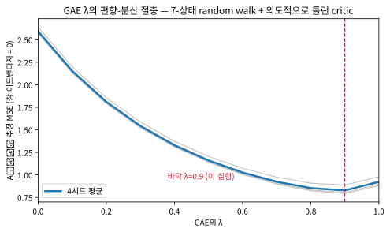
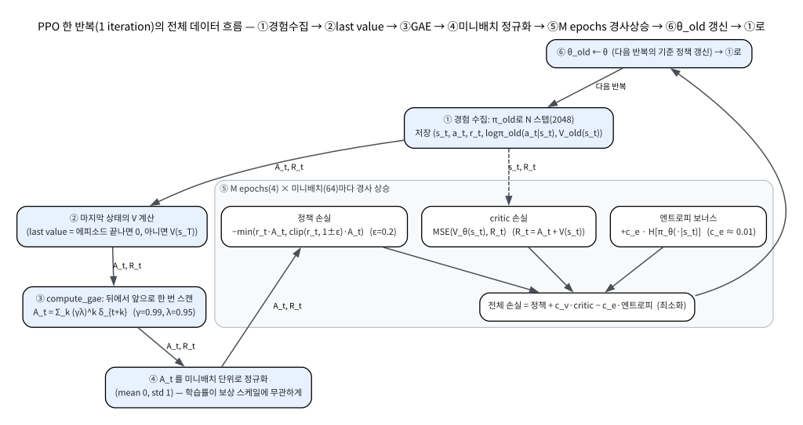
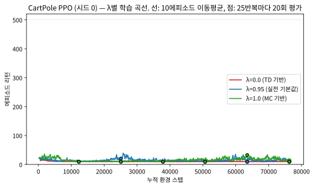

# 11.3 GAE와 PPO가 표준이 된 이유

[](https://colab.research.google.com/github/SuminHan/book-ml/blob/main/notebooks/ml2/chapter11_3_gae_ppo.ipynb)

11.2절까지 PPO의 골격(확률비 → 클리핑 → 미니배치 재사용)을 세웠다. 그런데
골격만으로는 실전에 못 쓴다 — 11.2절 실습의 학습 곡선은 매끄럽지 않았고,
Pendulum은 30만 스텝에도 -1092에서 멈췄다. "PPO가 잘 동작한다"는
평판을 만들어준 마지막 두 조각이 바로 **GAE**(Generalized Advantage
Estimation, 2016)와 **엔트로피 보너스**다. 이번 절은 그 둘을 배우고,
왜 PPO가 (1)이론적으로 TRPO에 못 미치고 (2)구현은 100배 단순한데도
TRPO를 사실상 완전히 밀어내버렸는지 — 즉 "표준이 된 이유"를 정리한다.
마지막으로 "PPO를 돌린다"는 말이 실제로는 어떤 코드 묶음을 의미하는지
실전 스택 전체를 훑어본 뒤, 이번 장(Chapter 11)을 닫는다.

### GAE: 어드밴티지를 더 안정적으로 추정하기

Chapter 10.3의 어드밴티지 \\(A\_t = G\_t - V(s\_t)\\)는 실제 리턴 \\(G\_t\\)를
그대로 쓰므로 여전히 분산이 크다. **GAE**(Generalized Advantage
Estimation)는 Chapter 7의 n-step/적격흔적과 정확히 같은 아이디어를
어드밴티지 추정에 적용한다 — 여러 \\(n\\)-step 어드밴티지 추정치를
\\(\lambda\\)로 가중평균해서, 분산은 낮추되 편향은 적당히만 감수하는
절충점을 찾는다:

\\[A\_t^{\text{GAE}} = \sum\_{k=0}^\infty (\gamma\lambda)^k \delta\_{t+k},
\qquad \delta\_t = r\_t + \gamma V(s\_{t+1}) - V(s\_t)\\]

\\(\delta\_t\\)는 Chapter 6.1의 TD 오차 그 자체다 — GAE는 결국 "여러
시점의 TD 오차를 적격흔적처럼 지수적으로 가중합해서 하나의 어드밴티지
추정치를 만든다"는 것으로 요약된다. \\(\lambda=0\\)이면 TD(0) 기반
어드밴티지(분산 작고 편향 큼), \\(\lambda=1\\)이면 몬테카를로 기반
어드밴티지(편향 없고 분산 큼)에 가까워진다 — Chapter 7.2의 다이얼이
여기서도 그대로 등장한다. 실전 PPO 구현은 거의 항상 GAE로 계산한
\\(A\_t\\)를 쓴다(11.2절 실습의 `compute_gae` 함수가 바로 이 식을
그대로 구현한 것이다).

**왜 \\(n\\)-step 어드밴티지들의 가중합이 정확히 위 무한합이 되는가?**
\\(n\\)-step 어드밴티지를 따로 정의해보자.

\\[A\_t^{(n)} := G\_t^{(n)} - V(s\_t) = \sum\_{k=0}^{n-1} \gamma^k
\delta\_{t+k}\\]

**직접 확인할 것**: 두 식은 정확히 같다. 좌변을 전개하면 실제 보상
\\(r\_t + \gamma r\_{t+1} + \cdots\\)이 나오고, 우변의 각 \\(\delta\\)를
정의대로 전개하면 같은 보상들이 \\(\gamma^k\\)로 할인되어 합쳐지는데,
가운데의 \\(V\\)들(\\(\gamma V(s\_{t+1}) - \gamma V(s\_{t+1})\\) 등)이
**연속적으로 상쇄**(telescoping)되기 때문이다. \\(n=1\\)이면
\\(A\_t^{(1)} = \delta\_t\\), 에피소드가 끝나기 전에 \\(n\\)이
에피소드 길이를 넘으면 \\(A\_t^{(n)} = G\_t - V(s\_t)\\)(= 10.3절의
원래 정의)가 된다.

여기서 **정리(수식은 한 줄)**: \\(A\_t^{\text{GAE}}\\)는 이
\\(n\\)-step 추정치들의 **지수적 가중평균**이다.

\\[A\_t^{\text{GAE}} = (1-\lambda)\sum\_{n=1}^{\infty} \lambda^{n-1}
A\_t^{(n)}\\]

증명은 두 단계다. (1) 각 \\(A\_t^{(n)}\\)을 위 telescoping 식으로
바꾸면, 같은 \\(\delta\_{t+k}\\)를 만드는 모든 \\(n\\) (\\(n > k\\),
즉 \\(n = k+1, k+2, \ldots\\))에서 해당 \\(\delta\\)가
\\(\gamma^k\\) 계수로 한 번씩 등장한다. (2) \\((1-\lambda)
\sum\_{n=k+1}^{\infty} \lambda^{n-1} \gamma^k = (\gamma\lambda)^k\\)로
수렴하는 지수급수의 꼬리를 정리하면, 바로 무한합 정의가
나온다. 즉 **\\(\lambda\\)는 "어떤 \\(n\\)-step 추정치를 얼마나
신뢰하는지"를 결정하는 가중 분포** \\(\propto \lambda^{n-1}\\) —
Chapter 7.2에서 적격흔적이 "n 하나를 고르는 것"을 "모든 n의
가중분포"로 승화시켰던 것과 **같은 승화**다.

### 손으로 계산해보기: 3스텝 에피소드에서 λ의 역할

식으로만 보면 추상적이다. 에피소드가 3스텝이면(\\(s\_0 \to s\_1 \to
s\_2 \to s\_3\\), \\(s\_3\\)은 터미널), \\(\lambda\\)를 바꿔가며
\\(A\_t^{\text{GAE}}\\)가 어떻게 달라지는지 직접 계산해보자.
\\(\gamma = 0.9\\), critic의 값 \\(V = [2.0, 1.4, 0.6, 0]\\),
보상 \\(r = [1, 1, 0]\\)으로 두면, TD 오차는:

- \\(\delta\_0 = 1 + 0.9 \times 1.4 - 2.0 = +0.26\\)
- \\(\delta\_1 = 1 + 0.9 \times 0.6 - 1.4 = +0.14\\)
- \\(\delta\_2 = 0 + 0.9 \times 0 - 0.6 = -0.60\\)

첫 스텝 \\(s\_0\\)에서의 GAE를 \\(\lambda\\) 별로 계산하면
(각 항의 가중계수는 \\((\gamma\lambda)^k\\), \\(k = 0, 1, 2\\)):

| \\(\lambda\\) | 가중계수 \\((1,\\; \gamma\lambda,\\; \gamma^2\lambda^2)\\) | \\(A\_0^{\text{GAE}}\\) | 읽기 |
|---|---|---|---|
| 0.0 | \\((1,\\; 0,\\; 0)\\) | \\(0.26\\) | \\(\delta\_0\\) 하나만 — "1스텝만 보고" (TD(0)) |
| 0.5 | \\((1,\\; 0.45,\\; 0.2025)\\) | \\(0.26 + 0.45(0.14) + 0.2025(-0.60) = +0.20\\) | 중간 — 세 항 다 포함 |
| 0.95 | \\((1,\\; 0.855,\\; 0.731)\\) | \\(-0.059\\) | 거의 MC |
| 1.0 | \\((1,\\; 0.9,\\; 0.81)\\) | \\(G\_0 - V(s\_0) = 1.9 - 2.0 = -0.10\\) | 전체 리턴 기준 (MC) |

같은 데이터(같은 \\(\delta\_0, \delta\_1, \delta\_2\\))인데,
\\(\lambda\\)만 바꾸면 \\(+0.26\\)(좋았다)에서 \\(-0.10\\)(나빴다)까지
**부호까지** 바뀐다. 이것이 \\(\lambda\\)가 "신뢰하는 지평선의 길이"
라는 뜻이다: 짧은 지평선(\\(\lambda \approx 0\\))은 "지금 당장의 TD
오차만 믿는다"(분산은 적지만, \\(V\\)의 오차가 그대로 편향으로
들어가), 긴 지평선(\\(\lambda = 1\\))은 "에피소드 전체의 실제
리턴을 믿는다"(편향은 없지만, 리턴의 흔들림이 그대로 분산으로
들어가). 실전 기본값 \\(\lambda = 0.95\\)는 "긴 지평선에 거의
의존하되, 가장 먼 꼬리만 5% 정도로 얕은 신뢰를 주는" 절충이다.



이 U자는 **이론이 아니라 실험**으로 확인할 수 있다(실습 노트북
1~3절). 참값이 정확히 알려진 환경(7-상태 random walk, 7.2절과
같은 환경)에서, "의도적으로 약간 틀린 critic"으로 TD 오차를 만들어
\\(A^{\text{GAE}}\\)를 추정하면 — 참 어드밴티지는 0이므로 추정치의
평균제곱(MSE)이 곧 "편향² + 분산"이다 — \\(\lambda\\)를 0에서 1까지
掃으면 MSE가 **U자**를 그리며, 바닥은 이 환경에서 \\(\lambda
\approx 0.9\\) 부근에 있다. \\(n\\)-step 어드밴티지로 같은 실험을
하면 바닥이 \\(n \approx 3\\) 부근인데, GAE는 "n을 고정하고
\\(\lambda\\)를 조정"하는 것의 일반화다. **Chapter 7.2의 교훈이
여기서도 그대로 적용된다: 단일 실행(단일 시드)으로 최적
\\(\lambda\\)를 정하면 안 된다** — 여러 시드의 평균으로 U자를
확인한 뒤, 바닥 근처에서 "0.90~0.99" 사이의 값을 고르면
대체로 안전하다. 실습에서는 그 실험을 직접 돌려본다.

### GAE의 코드가 실제로 하는 일: 뒤에서부터 한 번만

무한합을 그대로 쓰면 각 \\(t\\)마다 \\(O(T)\\)의 합을 해야
\\(O(T^2)\\)가 된다. 하지만 재귀를 쓰면 **뒤에서 앞에서 한 번만**
스캔하면 된다:

```python
def compute_gae(rewards, values, gamma=0.99, lam=0.95, last_value=0.0):
    T = len(rewards)
    gae, advantages = 0.0, [0.0] * T
    for t in reversed(range(T)):
        next_non_terminal = 1.0 if t < T - 1 else 0.0   # 터미널이면 0
        delta = rewards[t] + gamma * values[t+1] * next_non_terminal \
                - values[t]                              # δ_t
        gae = delta + gamma * lam * next_non_terminal * gae   # 재귀
        advantages[t] = gae
    return advantages
```

재귀가 왜 성립하는지 한 번 보면 영원히 잊지 않는다.

\\[A\_t^{\text{GAE}} = \delta\_t + \gamma\lambda
\underbrace{(\delta\_{t+1} + \gamma\lambda(\delta\_{t+2} + \cdots))}\_{A\_{t+1}^{\text{GAE}}
\text{의 첫 항 빼고... } = A\_{t+1}^{\text{GAE}} - \delta\_{t+1} + \delta\_{t+1}}
\\]

정리하면 \\(A\_t^{\text{GAE}} = \delta\_t + \gamma\lambda
A\_{t+1}^{\text{GAE}}\\) — "지금의 TD 오차 + 할인된 미래 GAE"다.
이것이 위 코드의 `gae = delta + gamma * lam * gae` 한 줄이다.
**`next_non_terminal` 줄의 역할**: 에피소드가 중간에 끝나면
(터미널 상태에 도달하면) "마지막 값"이 0이어야 한다 — 그 뒤에
"계속될 에피소드"가 없으므로. `last_value=0.0`은 *에피소드가 끝난
뒤*의 값을 의미하고, 터미널 중간에서 이어지는 새 에피소드의 마지막
스텝에서는 다음 정책의 값 `V(s')`을 써야 한다(실습 5절의
`collect` 함수가 이 둘을 구분한다).

**두 가지 "자주 하는 실수"가 여기 숨어 있다.**

1. **부호/위치 오류**: `delta`를 `r_t + gamma*V(s_t) - V(s_{t+1})`
   로 쓰면(좌변·우변을 뒤집으면) 모든 어드밴티지의 부호가 반전되어
   정책이 **역으로** 학습한다. TD 오차의 정의를 Chapter 6.1과
   대조하며 항상 한 번 확인하자: "실제로 벌어진 것
   (\\(r\_t + \gamma V(s\_{t+1})\\))"에서 "예측한 것
   (\\(V(s\_t)\\))"을 뺀 것이다.
2. **마지막 값(last value)을 0으로 처리할 때와 정책 값으로
   처리할 때를 혼동**: `last_value`는 *에피소드가 끝난 뒤*의 값이다.
   - 에피소드가 끝났다면(터미널) → **0**.
   - 에피소드가 끝나지 않고 스텝 버퍼가 가득 찼다면 → **현재
     정책으로** 마지막 상태의 `V(s_T)`를 계산.
   "에피소드가 끝나지 않았는데 0을 대입"하면, 좋은 상태일수록
   마지막 스텝의 \\(\delta\\)가 음수로 과대평가되어(가치를 0으로
   낮게 보는 셈) 정책이 끝 상태의 좋은 상태를 피하게 된다 — 학습이
   느려지는 원흉 중 하나다.

GAE로 계산한 \\(A\_t\\)는 보통 **미니배치 단위로 정규화**
(\\((A - \text{mean}) / (\text{std} + 10^{-8})\\))한 뒤 클리핑
목적함수에 쓴다(11.2절의 `ppo_clip_loss`). 정규화의 역할은 10.2절
"자주 하는 실수"의 리턴 정규화와 같다 — 어드밴티지의 절대 스케일이
보상 함수의 스케일에 의존하는데, 정규화하면 **학습률이 보상 스케일에
무관하게** 작동한다.

### 엔트로피 보너스: 탐험을 유지하는 작은 항

11.2절 실습의 `GaussianPolicy`는 \\(\text{exp}(\texttt{log\\_std})\\)
를 **학습 가능한** 파라미터로 두었는데, 그럼 무엇이 `log_std`를
줄여(탐험을 줄여) 갈까? 답은 PPO 목적함수의 세 번째 항,
**엔트로피 보너스**다:

\\[L^{PPO}(\theta) = \mathbb{E}\_t\left[L^{CLIP}\_t(\theta)\right]
- c\_v\\,\mathbb{E}\_t\left[(V\_\theta(s\_t) - R\_t)^2\right]
+ c\_e\\,\mathbb{E}\_t\left[\underbrace{H\left[\pi\_\theta(\cdot|s\_t)\right]}\_{\text{엔트로피 보너스}}\right]\\]

- \\(L^{CLIP}\\): 11.2절의 클리핑 항(정책 = actor).
- 두 번째 항: critic의 TD/리턴 손실 — \\(V\\)를 어드밴티지 계산에
  쓸 만큼 정확히 학습해야 GAE가 의미가 있다.
- 세 번째 항: 정책의 **엔트로피**를 목적함수에 더해주는 것.

**왜 엔트로피를 더해야 하는가?** 클리핑은 "한 스텝의 이동"을 막는
장치일 뿐, 정책이 *천천히*도 특정 행동에 확률을 1로 몰아붙일 수
있다 — 한 번 확률이 0에 가까워진 행동은 다시 샘플링될 기회가 없어
**영원히** 돌아오지 못한다(탐험 소실, exploration collapse).
엔트로피 \\(H[\pi(\cdot|s)] = -\sum\_a \pi(a|s)\log\pi(a|s)\\)는
"정책이 얼마나 불확실한가(균등하면 최대)"를 측정하므로, 이 항을
최대화하면(목적함수에 +로 추가) 정책이 **단일 행동에 수렴하는 것을
구조적으로 늦춘다** — "한 행동에 확률을 몰아붙이지 마라"는 연료다.

\\(c\_e\\)는 보통 \\(0.001 \sim 0.01\\)로 작게 둔다 — 크게 하면
"무작위에 가까운 정책"을 장려해 성능이 오히려 나빠진다. 연속
(가우시안) 정책에서는 \\(H = \tfrac{1}{2}\sum\_i
(1 + \log \sigma\_i^2 + \mu\_i^2 - \mu\_i^2)\\)로, 표준편차
\\(\sigma\\)가 클수록 엔트로피가 커지므로, 이 항이 바로
`log_std`를 *올려* 주는 힘이다. 실전 스택에서는 `log_std`를
*점진적으로 줄여* 가는(annealing) 방식도 함께 쓰인다 — "처음엔
많이 탐험, 수렴하면 줄여간다"는 것이다. 11.2절 Pendulum 실습에
엔트로피 항이 없었음에도 학습이 아주 느렸던 이유 중 하나는 바로 이
탐험 신호의 부재(또는 부족)이기도 하다.

### TRPO에서 PPO로: "보장을 근사로" 바꾼 역사

PPO 이전에 같은 문제(너무 큰 업데이트로 인한 정책 붕괴)를 풀던
방법은 **TRPO**(Trust Region Policy Optimization, 2015)였다 — KL
divergence 제약을 명시적으로 걸고, 2차 미분(피셔 정보 행렬)과
conjugate gradient, line search까지 동원하는 무거운 최적화였다. PPO는
그 복잡한 기계장치를 클리핑 한 줄로 대체하면서도 비슷한 안정성을
얻는다 — "이론적으로 완벽한 보장"(TRPO의 단조 개선 보장) 대신
"구현하기 쉽고 실전에서 잘 작동하는 근사"를 택한 선택이다.

"무겁다"는 말이 구체적으로 무엇을 의미하는지 비교해보자. TRPO의 한
스텝은:

1. **KL 제약** \\(\mathbb{E}\_t\left[D\_{KL}\left(\pi\_{\theta\_{\text{old}}}
\\,\\|\\, \pi\_\theta\right)\right] \le \delta\\)를 *명시적으로* 풀어야
   한다 — 2차 근사(피셔 정보 행렬 \\(F = \mathbb{E}[\nabla\log\pi
   \nabla\log\pi^T]\\))까지 쓰면, 이 제약 아래 최대화는
   \\(F\\)의 *역행렬 곱*을 구해야 하는 **최대제곱(정준경로)
   문제**가 된다.
2. \\(F\\)는 파라미터 수 \\(p\\)의 \\(p \times p\\) 행렬이다.
   신경망 정책에서는 \\(p\\)가 수만~수십만이므로, **직접 역행렬을
   구할 수 없다** — 그래서 "피셔-벡터 곱만 계산할 수 있으면 된다"는
   성질을 이용해 **conjugate gradient**(반복법, 각 단계가 행렬곱
   대신 피셔-벡터 곱)로 근사 해를 구하고,
3. 근사해도 *제약이 실제로* 만족되는지 확인하기 위해 **line
   search**(제안 방향으로 얼마나 가도 안전한지)를 추가로 돌린다.

세 단계 모두 "정책 그래디언트" 자체와 무관한 **최적화 장치**다.
PPO는 이 세 단계를 **클리핑 한 줄**로 대체했다 —

\\[\min\left(r\_t A\_t,\\; \text{clip}(r\_t, 1-\epsilon, 1+\epsilon) A\_t\right)\\]

— 11.2절에서 보았듯, \\(r\_t\\)가 \\([1-\epsilon, 1+\epsilon]\\)
범위를 벗어나면 그 구간 밖으로 나간 만큼의 이득을 깎아버리는
**비단조 단조(모노토닉) 근사**다. TRPO의 "단조 개선 *보장*"은
2차 근사와 line search가 정확히 동작할 때만 성립하는데, PPO는 그
보장을 **포기**하는 대신, "보장이 안 되더라도 실전에서 잘
동작한다"는 경험적 증거로 승부수를 걸었다.

이 선택이 정답이었다는 사실은, **구현 비용의 차이**가 곧바로
**알고리즘 채택의 차이**로 이어졌기 때문이다. TRPO의 참고 구현은
약 300~400줄(피셔-벡터 곱, conjugate gradient, line search까지
포함)이고, PPO는 100줄 안팎이다. "같은 성능에 3배 적은 코드"가
아니라, **"대부분의 환경에서 충분히 좋은 성능에 3배 적은 코드"** —
연구실마다 TRPO의 최적화 장치를 디버깅하는 시간 대신, PPO를
그냥 돌려보는 쪽으로 기울 수밖에 없었다.

> **역사적 일화: PPO의 탄생.** PPO 논문(2017)은 실제로 TRPO를
> "더 단순하게" 하고 싶다는 시도에서 출발했다. 같은 연구팀
> (OpenAI, Schulman 외)이 먼저 TRPO(2015)로 "신뢰 영역"이라는
> 개념을 세웠고, 다음 질문은 "KL 제약을 풀어내는 그 무거운
> 최적화 없이, **클링(=클리핑)만으로** 비슷한 안정성을 얻을 수
> 있는가?"였다. 논문에서는 클리핑(PPO-Clip) 외에도 **KL
> 페널티**(KL이 크면 목적함수에 벌을 부과) 방식(PPO-Penalty)을
> 함께 제안했는데, PPO-Penalty는 KL 벌의 계수를 *학습 중 동적으로
> 조정*해야 해서(너무 크면 탐험이 부족하고, 너무 작으면 클리핑
> 없이 폭주) **PPO-Clip 쪽이 훨씬 실용적**이라 실전에서 사실상
> 표준이 됐다. "PPO = 클리핑"이라는 현재의 통념은 이 선택의
> 결과다.

**그렇다면 PPO는 TRPO보다 "나쁜" 알고리즘인가?** 아니다 — "이론적
보장이 약하고, 실전 성능은 비견되는" 알고리즘이다. TRPO의 단조
개선은 2차 근사 + line search의 *정확성*에 의존하는데, 실전
(큰 네트워크, 미니배치 샘플 노이즈)에서는 그 근사 자체가 충분히
정확하지 않다. 즉 **TRPO의 "보장"도 실전에서는 이론만큼 강하지
않다** — PPO가 "보장을 포기"하는 대가는 생각보다 작았고,
**구현 단순성**이라는 이득은 컸다. 이것이 "표준이 된 이유"의
첫 번째 축이다.

**이 실용성 덕분에 PPO는 지금 가장 널리 쓰이는 정책기반 알고리즘이
됐다: 로봇 보행 제어, OpenAI Five(Dota 2), AlphaStar(스타크래프트
II)뿐 아니라, 사람 피드백에 맞게 언어모델을 조정하는 RLHF의 핵심
도구로도 쓰인다 — 연속 제어(로봇의 관절 힘 같은)와 이산 선택(다음
토큰 고르기) 양쪽 모두에 그대로 적용될 만큼 범용적이다.**

여기서 "범용적"이라는 말이 구체적으로 무엇을 뜻하는지 짚자. PPO의
목적함수는 **행동공간이 이산이든 연속이든** 같은 형태다.

- **이산**(CartPole, 언어모델의 토큰 선택): \\(\pi\\)가
  \\(\text{softmax}\\), \\(\log\pi(a|s)\\)가 Categorical
  분포의 로그확률, 행동은 `argmax` 대신 샘플링(10.2절의
  `torch.distributions.Categorical`).
- **연속**(Pendulum, 로봇 관절): \\(\pi\\)가 **가우시안**
  \\(\mathcal{N}(\mu\_\theta(s), \sigma\_\theta^2 I)\\),
  \\(\log\pi(a|s)\\)가 정규분포의 로그우도, 행동은
  `dist.sample()`(11.2절의 `GaussianPolicy`).

목적함수 \\(\mathbb{E}[L^{CLIP}]\\)와 GAE, 엔트로피 항의 *수학적
형식*은 같다 — 변하는 건 "\\(\log\pi\\)를 어떤 분포에서
계산하느냐"뿐이다. 이것이 "행동공간의 형태에 크게 의존하지
않는" 범용성의 구체적 의미다. (11.2절 FAQ의 "연속 정책이
\\(\text{tanh}\\)로 스케일되는 이유"도 이 맥락: 가우시안의
지지공간이 실수 전체인데, 실제 환경은 행동 범위가 \\([-1,1]\\)
같이 제한되어 있어서 \\(\text{tanh}\\)를 붙여 범위로
압축한다.)

### PPO를 돌린다: 실전 스택의 전체 그림

"위에서 아래로" PPO 한 반복(1 iteration)이 실제로 하는 일을
끝까지 추적해보자. 11.2절의 골격에 11.3절의 GAE·엔트로피를
덧붙이면, 실전 스택의 전체는 이렇다:

```
1 반복(iteration):
  ① 현재 정책 π_θ_old 으로 N 스텝(예: 2048) 경험 수집
       각 스텝마다 저장: 상태 s_t, 행동 a_t, 보상 r_t,
                         log π_θ_old(a_t|s_t), V_θ_old(s_t)
  ② 마지막 상태의 V 값(last value)을 계산
  ③ compute_gae 로 각 스텝의 A_t (λ=0.95, γ=0.99) 계산
  ④ A_t 를 미니배치 단위로 정규화 (mean 0, std 1)
  ⑤ M epochs (예: 4) 동안 미니배치 (예: 64)마다 경사 상승:
       정책 손실  = -min(r_t·A_t, clip(r_t, 1±ε)·A_t)  (ε=0.2)
       critic 손실 = MSE(V_θ(s_t), R_t)                (R_t = A_t + V(s_t))
       엔트로피   = +c_e · H[π_θ]
       전체 손실  = 정책 + c_v·critic - c_e·엔트로피   (최소화)
  ⑥ θ_old ← θ (다음 반복의 기준 정책 갱신) → ①로
```

각 단계에서 "왜 이렇게"인지를 짚자.

- **①에서 N 스텝**: N이 너무 크면 "policy가 많이 바뀌기 전에
  수집"한 데이터가 아니라, *수집 중에도* 정책이(여러 에포크가
  아니라 단 한 번이지만) 초기와末期의 정책이 달라져
  `r_t = π_new/π_old`가 클리핑 범위를 벗어나는 스텝이
  늘어난다. N이 너무 작으면 GAE의 "긴 지평선" 이득이 줄어든다.
  실전에서 N=2048, 4096이 일반적이다.
- **③에서 GAE(λ=0.95)**: 10.3절의 `A_t = G_t - V(s_t)`(=
  λ=1, MC)를 *대신* 쓰는 것이다. MC는 편향 없지만 분산이 크고,
  λ=0.95는 "거의 MC인데, 가장 먼 꼬리는 약간 얕게 본다"는
  절충.
- **④의 정규화**: 앞서 말했듯 학습률을 보상 스케일에 무관하게
  만든다. *주의*: 정규화는 **미니배치 단위**다 — 전체 N 스텝
  단위로 정규화하면 미니배치마다 스케일이 달라져(일부
  미니배치의 A가 0에 가까워져) 그 미니배치의 업데이트가
  거의 사라진다.
- **⑤의 M epochs**: on-policy 방법(10.2절 REINFORCE)은 데이터
  1회를 쓴다. PPO는 클리핑 덕분에 "데이터가 약간
  오래돼도" 안전하게 재사용할 수 있어 M번(보통 4~10) 반복한다.
  M이 크면 "on-policy"에 가까워지고(데이터 활용도↑) 클리핑이
  더 자주 발동한다. M이 1이면 사실상 A2C/A3C(10.3절)와 같다.
- **⑥의 θ_old 갱신**: 다음 반복에서 `r_t = π_new/π_old`의
  분모가 *이번 반복 끝*의 정책이 되도록 — "데이터를 모은
  정책"과 "지금 업데이트하려는 정책"의 비율이 의미 있게
  (1 근처에) 유지되도록 하는 것.

이 스택의 **모든 숫자**(N, M, ε, λ, γ, c_v, c_e, 학습률)가
하이퍼파라미터다. 실전에서는 "PPO가 느리다/잘 못 배운다"는
불만의 상당 부분이 **이 숫자 조합**에서 온다 — 알고리즘 자체가
아니라. 특히 \\(\epsilon\\)과 \\(\lambda\\)는 독립적이지만
*함께* 학습 안정성에 영향을 준다(11.3 FAQ 1).



### 실습: CartPole에서 GAE의 λ를 바꿔가며 PPO 학습시키기

이론을 검증할 실습으로, CartPole(이산 행동)에서 PPO를 **λ를
바꿔가며** 학습시켜 GAE의 절충점을 눈으로 확인한다. 11.2절
Pendulum(연속, 30만 스텝에도 -1092)과 달리 CartPole은 이산
보상(매 스텝 +1, 최대 500)이라 5만 스텝 안에도 명확한
차이가 드러난다.

세 가지 \\(\lambda\\) — \\(0.0\\)(TD(0) 기반, 편향↑분산↓),
\\(0.95\\)(실전 기본값), \\(1.0\\)(MC 기반, 편향↓분산↑) —
을, **같은 시드(0), 같은 반복 수(150×512 스텝 ≈ 7.7만 스텝)**로
학습시킨다(실습 노트북 4~5절):

실행 결과(시드 0 단일 실행, 실습 노트북 4~5절):

| \\(\lambda\\) | 처음20 에피소드리턴 | 마지막20 에피소드리턴 | 최고 에피소드리턴 | 20에피소드 평가 (평균/최고) |
|---|---|---|---|---|
| 0.0 (TD 기반) | 55.7 | 126.5 | 270 | 272 / 301 |
| 0.95 (실전 기본값) | 29.8 | 141.2 | 442 | 274 / 317 |
| 1.0 (MC 기반) | 26.1 | 169.1 | 449 | **500 / 500** |

관찰: 이번 단일 실행에서는 세 \\(\lambda\\)가 각각 다른
*모양*으로 학습했다. \\(\lambda=0.0\\)는 오히려 가장 빠르게
시작했지만(처음20 = 55.7) 100 반복 이후 100~140 대에서 정체
(최고 270) — "지금의 TD 오차"만 믿는 편향이 방향을 자주
틀리게 하는 흔적이다. \\(\lambda=1.0\\)는 시작은 느렸지만 후반에
가장 멀리 갔고(마지막20 = 169.1), 평가에서는 20개 에피소드
모두 500(만점). \\(\lambda=0.95\\)는 어느 지표에서도 단연
우월하지 않지만, 어디 하나 치명적 결함도 없다. **중요**: 단일
시드 실험이므로 "λ=0.95가 항상 이긴다"(또는 "λ=1.0이 이긴다")는
보장은 없다 — 7.2절의 교훈처럼 여러 시드로 평균해야 한다. 이번
실습은 "\\(\lambda\\)에 따라 학습의 *모양*이 달라지는 절충의
존재"를 보는 것이지, 어느 \\(\lambda\\)가 *최적*인지를 증명하는
것이 아니다.



### Q-learning이 "얼마나 좋은지 평가한 뒤 최선을 고른다"는 간접적
전략이라면, 정책기반 방법은 "무엇을 할지" 자체를 직접 학습한다. GAE가
어드밴티지 추정의 분산을 줄이고, 클리핑이 그 추정을 바탕으로 한
업데이트가 너무 커지지 않게 막는다 — Chapter 13~14에서 다룰 로봇
시뮬레이션의 연속 제어 문제에 PPO가 표준으로 쓰이는 이유가 바로 이
안정성이다.

**Chapter 11을 닫으며.** 이번 장은 세 절로 PPO를 세웠다:
11.1(신뢰 영역과 확률비)에서 "왜 너무 큰 업데이트가 위험한가"와
"옛 데이터를 재사용하려면 확률비가 필요한가"를, 11.2(클리핑)에서
"그 위험을 클리핑 한 줄로 막는" PPO의 핵심 목적함수를, 11.3(이번
절)에서 "PPO가 실전에 쓰이도록 만드는" GAE·엔트로피·실전 스택을
배웠다. **PPO = (11.1 확률비) × (11.2 클리핑) + (11.3 GAE와
엔트로피와 실전 스택)** — 이 세 조각이 빠지면 각각 "폭주
(REINFORCE)", "불안정(클링 없는 IS)", "느리고 탐험 소실(GAE/엔트로피
없음)"이 된다. 다음 장(Chapter 12, 13, 14)에서는 이 PPO를
**로봇 시뮬레이션**(연속 제어)과 **RLHF**(이산 토큰 선택)에
적용한다 — "행동공간의 형태에 크게 의존하지 않는" 범용성의
실제 검증이다.

### 자주 묻는 질문

**Q. GAE의 \\(\lambda\\)와 PPO의 클리핑 \\(\epsilon\\)은 서로
독립적인 하이퍼파라미터인가요?** 역할은 다르지만 함께 학습 안정성에
영향을 준다 — \\(\lambda\\)는 "어드밴티지 추정 자체의 편향-분산"을,
\\(\epsilon\\)은 "그 추정을 바탕으로 정책을 얼마나 크게 바꿀
것인가"를 조절한다. 어드밴티지 추정이 노이즈가 크면(\\(\lambda\\)가
1에 가까우면) 클리핑이 그 노이즈로부터 정책을 보호하는 역할이 더
중요해진다 — 실전에서는 둘을 함께 튜닝하는 경우가 많다.

**Q. RLHF(Chapter 13)에서 PPO는 정확히 무엇을 "행동"으로 보나요?**
언어모델을 정책으로 볼 때, "상태"는 지금까지 생성된 토큰들, "행동"은
다음에 고를 토큰, "보상"은 Chapter 13에서 배운 보상모델의 점수다 —
토큰 하나하나를 고르는 것이 이산 행동 선택이므로, 이번 장에서 배운
이산 행동공간 PPO(11.2절의 클리핑 목적함수)가 사실상 그대로
적용된다. 연속 제어(로봇)와 언어모델이라는 완전히 다른 응용에 같은
알고리즘이 쓰이는 것 자체가, PPO가 "행동공간의 형태에 크게 의존하지
않는" 범용적인 도구라는 증거다.

**Q. GAE의 \\(\lambda\\)와 Chapter 7 적격흔적 TD(\\(\lambda\\))의
\\(\lambda\\)는 같은 것인가?** "같은 아이디어"이지만
**적용 대상이 다르다**. 적격흔적의 \\(\lambda\\)는 *가치함수*
\\(V\\)의 갱신에 "어떤 \\(n\\)-step TD를 가중합할지"를 결정하고,
GAE의 \\(\lambda\\)는 *어드밴티지* \\(A\_t\\)를 "어떤 \\(n\\)-step
어드밴티지를 가중합할지"를 결정한다. 수학적 구조(지수 가중
\\(\lambda^{k}\\)의 합)는 같고, GAE를 "어드밴티지에 적용한
적격흔적"이라고 부르는 이유가 여기에 있다. (적격흔적은 critic
학습에, GAE는 actor의 어드밴티지 계산에 쓰이는 것이다.)

**Q. 엔트로피 보너스의 \\(c\_e\\)를 너무 크게 하면 어떤 일이
생기나요?** "무작위에 가까운 정책"이 장려되어, 좋은 행동을 찾았을
때도 확률을 높이지 못하고(엔트로피 최대화가 "균등한 확률"을
유지하려 하므로) 성능이 오히려 나빠진다. 실전에서 \\(c\_e\\)는
\\(0.001 \sim 0.01\\)로 작게 두고, 학습이 끝단계에 가면 0으로
줄여(annealing) "탐험을 종료"하는 경우가 많다.

---

## 연습문제

**1. (코딩)** 위 `ppo_clip_loss`(핵심 줄은 빈칸으로 남겨져 있다고
가정)와, GAE의 한 항 \\(\delta\_t = r\_t + \gamma V(s\_{t+1}) -
V(s\_t)\\)를 계산하는 `td_error`를 완성하라:

```python
def td_error(r, V_s, V_s_next, gamma):
    # ADD ADDITIONAL CODE HERE!!

def ppo_clip_loss(ratio, advantage, epsilon=0.2):
    # ADD ADDITIONAL CODE HERE!!
    # unclipped = ratio * advantage
    # clipped = ratio를 [1-epsilon, 1+epsilon]로 clip한 뒤 advantage 곱
    # 둘 중 최솟값 반환

print(ppo_clip_loss(ratio=1.5, advantage=1.0, epsilon=0.2))  # 1.2 (clip된 값이 더 작음)
print(ppo_clip_loss(ratio=0.5, advantage=1.0, epsilon=0.2))  # 0.5 (clip 안 된 값이 더 작음)
print(ppo_clip_loss(ratio=1.5, advantage=-1.0, epsilon=0.2)) # -1.5 (advantage가 음수면 부호가 바뀜에 주의)
```

**2. (개념 서술)** GAE의 \\(\lambda\\)를 0으로 두는 것과 1로 두는 것이
각각 Chapter 7에서 배운 어떤 방법과 대응되는지 설명하고, 왜 그
극단들이 각각 편향과 분산 중 어느 쪽 문제를 안고 있는지 서술하라.

**3. (손유도, Tier B — 힌트 제공)** \\(A\_t^{\text{GAE}} =
\sum\_{k=0}^\infty (\gamma\lambda)^k \delta\_{t+k}\\)에서 \\(\lambda = 0\\)을
대입하면 \\(A\_t^{\text{GAE}} = \delta\_t\\)(TD 오차 하나)만 남음을
보여라. \\(\delta\_t = r\_t + \gamma V(s\_{t+1}) - V(s\_t)\\)의 정의를
이용해서, 이것이 10.3절 Actor-Critic의 1-step 어드밴티지 근사
\\(A\_t \approx r\_t + \gamma V(s\_{t+1}) - V(s\_t)\\)와 정확히 같은
형태임을 확인하라. (힌트: 10.3절의 Critic 손실이
\\((r\_t + \gamma V(s\_{t+1}) - V(s\_t))^2\\) — 바로
\\(\delta\_t^2\\) — 이었다는 점을 떠올려라. \\(\lambda=0\\)의 GAE는
"Critic의 TD 오차를 어드밴티지로 그대로 쓰는" 가장 단순한
Actor-Critic이다.)

**4. (새로 추가 — 개념)** "실전 스택의 전체 그림"에서 ⑤번 단계의
M epochs(데이터 재사용 횟수)를 1로 바꾸면 PPO는 어떤 알고리즘에
가까워지는가? 10.3절의 A2C/A3C와 무엇이 같고 무엇이 다른가?
(힌트: M=1이면 "수집한 데이터를 딱 한 번만 쓰고 버린다" —
on-policy. 클리핑은 그때 `r_t = 1`이라 *발동하지 않는다*.)

**5. (새로 추가 — 실습 연결)** 실습에서 \\(\lambda=0.0\\)과
\\(\lambda=1.0\\)의 학습 곡선이 어떻게 다르고, 그 차이를
"편향"과 "분산" 중 각각 어떤 것으로 설명할 수 있는가? 단일
시드 실험이므로 "보장"이 아니라 "관찰"로 서술하라.

**정확성 확인**: \\(\lambda\\)를 0에서 1로 점점 키우면 GAE가 더 먼
미래의 TD 오차들까지 포함하게 되는데, 이게 왜 "몬테카를로 방향으로
다가간다"는 뜻인지 한 문장으로 설명하라.
