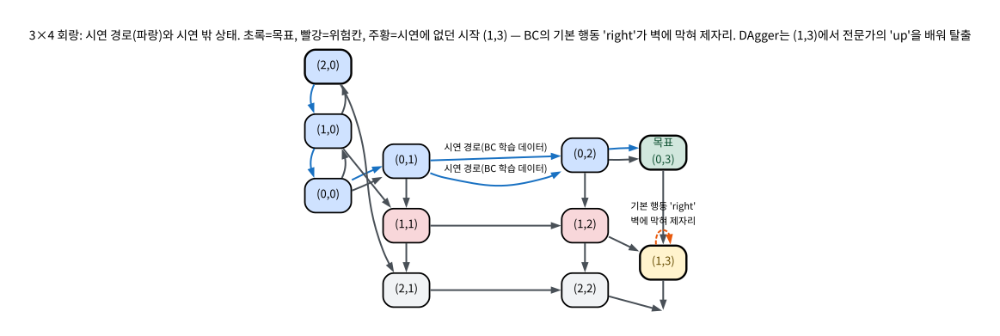
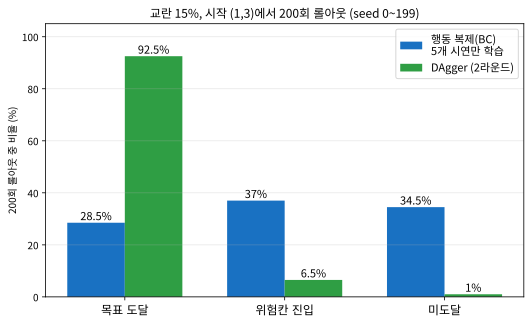

# 12.1 모방학습: 행동 복제와 DAgger

[](https://colab.research.google.com/github/SuminHan/book-ml/blob/main/notebooks/ml2/chapter12_1_behavior_cloning_dagger.ipynb)

### 모방학습: 보상 없이, 시연만으로

**모방학습**(Imitation Learning)의 가장 단순한 형태는 **행동
복제**(Behavior Cloning, BC)다 — 전문가(사람 또는 기존 정책)가 남긴
(상태, 행동) 시연 데이터를 모아서, "이 상태에서는 이 행동"이라는
지도학습 문제로 그대로 바꿔버린다. 보상함수를 설계할 필요도, 환경과
상호작용하며 탐험할 필요도 없다 — 로지스틱회귀나 다중분류와 정확히
같은 방식으로, 상태를 입력받아 행동(이산이면 분류, 연속이면 회귀)을
출력하도록 신경망을 학습시키면 끝이다.

왜 이런 "단순한" 방법이 존재하는가? Chapter 2~11의 모든 강화학습
알고리즘은 **두 가지 자원**을 전제로 했다. (1) *보상함수가 코드로
쓰여 있어야 한다* — "무엇이 좋은지"를 수식으로 정의할 수 있어야 하고,
(2) *에이전트가 환경을 자유롭게 돌아다녀야 한다* — Chapter 2의
탐험-활용 딜레마가 전제하는 대로, 나쁜 행동을 골라보며 그 대가를
겪어야 배운다. 그런데 **두 전제가 동시에 무너지는 문제**가 실제로
존재한다. 로봇 팔이 사람 옆에서 물건을 옮기는 문제는 (1) "자연스러운
운동"을 어떤 스칼라 함수로 쓸지 모르겠고 (2) 무작위 탐험 자체가
사람을 다치게 할 수 있다. 자율주행은 (2)가 극단적이다 — "사고를 내며
배우는" 학습은 허용되지 않는다. 이런 문제에서는 *이미 잘하는 존재*
(사람 운전자, 사람이 조종한 로봇, 오래된 제어기)가 남긴 기록이
가장 가치 있는 자원이고, 그 기록을 그대로 학습 데이터로 쓰는 것이
바로 모방학습이다.

```python
import math

def sigmoid(z):
    return 1 / (1 + math.exp(-max(-20, min(20, z))))

def train_behavior_cloning(demos, epochs, lr):
    # demos: [(state, action), ...] 전문가 시연, action은 0 또는 1(이진 예시)
    w, b = 0.0, 0.0
    for _ in range(epochs):
        for s, a in demos:
            pred = sigmoid(w * s + b)
            grad = pred - a          # 로지스틱회귀와 똑같은 그래디언트 형태
            w -= lr * grad * s
            b -= lr * grad
    return w, b
```

이 코드를 Chapter 2의 로지스틱회귀 코드와 나란히 놓고 보면,
**한 줄도 바뀌지 않았다**는 사실을 확인할 수 있다. `demos`는
`(특징, 라벨)` 쌍, `sigmoid(w*s + b)`는 모델, `grad = pred - a`는
교차엔트로피의 그래디언트, 그 이하의 갱신 규칙은 그대로다. 행동
복제는 "새로운 알고리즘"이 아니라 **기존 지도학습 알고리즘에 데이터
출처(전문가 시연)를 꽂아 넣은 것**이다. 이 절의 전체 스토리는
그러니 한 문장으로 요약된다 — *시연 데이터의 분포가 배포 시의 상태
분포와 어긋나기 시작하면, 지도학습의 그 지름길이 어떻게 무너지는가,
그리고 DAgger가 그 어긋남을 어떻게 다시 맞출 수 있는가.*

> **역사적 배경 — "원격 조종"에서 "시연"으로.**
> 모방학습의 뿌리는 아주 실용적이다. 1980년대 말 스탠퍼드의 AVI
> (Action-Vision-Inference) 프로젝트는 카메라로 도로를 보고
> "이 장면에서 핸들을 이렇게 돌렸다"는 사람 운전자의 기록을
> 모아서 차를 조종하는 법을 학습시켰다 — 현대 모방학습이 쓰는
> "(시각 입력, 조향) 쌍을 모아서 분류를 학습한다"는 구조가 그때
> 이미 서 있었다. 하지만 곧 한계가 드러났다. 사람 운전자가
> 보여준 *그* 장면이 아니라, *자신의 작은 실수로 빗나간* 낯선
> 장면에 부딪히면 차가 멈춰 서거나 위험한 행동을 했다. 이 "시연
> 안의 장면은 잘하고, 시연 밖의 장면은 못하고"라는 실패 패턴이
> 2011년에야 Ross, Gordon & Bagnell[^dagger]에 의해 **복합 오차**(compounding
> error)로 이론화됐고, 같은 논문이 그 해법을 **DAgger**로 제시했다
> — 12.3절의 역사적 배경 박스에서도 다시 만나게 될 이 논문이
> 바로 이 절의 두 번째 주인공이다.

### 손으로 풀 수 있는 장난감 환경: 3×4 회랑

"오차가 복합된다"는 말을 *감*으로 남기지 않기 위해, 이번 절의
핵심 예제를 **손으로 쫓아도 10분 이내**인 작은 격자환경으로
만든다. 3줄(상단·중간·하단) × 4열의 회랑으로, 시작은 (2,0),
목표는 (0,3)이다. 중간 줄의 (1,1), (1,2) 두 칸은 "공사 중"이라
들어오면 즉시 실패(위험칸)한다.

```
행   열0        열1        열2        열3
(0)  (0,0)      (0,1)      (0,2)      [목표]
(1)  (1,0)      [위험]     [위험]     (1,3)
(2)  [시작]     (2,1)      (2,2)      (2,3)
```

각 칸에서는 4방으로 이동할 수 있고, 벽에 부딪히면 제자리에
머문다. 전문가(이 경우 "안전한 최단 경로 알고리즘")의 시연은
하단에서 바로 위로 올라와 상단 회랑을 따라가는 **5스텝 직진
경로**다. (1,1)/(1,2)의 공사 구간은 우회하는 데 비용이 드는
*비직선* 경로가 아니라, "위쪽 회랑을 이용하면 공사 구간을
완전히 피할 수 있다"는 구조적 우회로 설계된 것이다.

```python
R, C = 3, 4
DEAD = {(1, 1), (1, 2)}          # 중간 줄 (1,1), (1,2): "공사 중"
GOAL = (0, 3)

def step(s, a):
    r, c = s
    n = {"up": (r-1, c), "down": (r+1, c), "left": (r, c-1), "right": (r, c+1)}[a]
    return n if 0 <= n[0] < R and 0 <= n[1] < C else s   # 벽 = 제자리

# 전문가 시연: (2,0) -> (1,0) -> (0,0) -> (0,1) -> (0,2) -> (0,3)
demo = [((2, 0), "up"), ((1, 0), "up"), ((0, 0), "right"),
        ((0, 1), "right"), ((0, 2), "right")]

table = dict(demo)                # BC 정책 = 조회 테이블

def bc(s):
    return table.get(s, "right")  # 시연에 없던 상태 -> 시연의 다수결 행동(기본값)
```

시연 데이터 5개:

| 상태 | 전문가의 행동 |
|---|---|
| (2,0) | up |
| (1,0) | up |
| (0,0) | right |
| (0,1) | right |
| (0,2) | right |



### 행동 복제의 배포 실패: "시뮬레이션에선 돌아갔는데"

위 BC 정책으로 배포해보자. 시작 (2,0)이라면,

```
(2,0) up→ (1,0) up→ (0,0) right→ (0,1) right→ (0,2) right→ (0,3)  목표 (5스텝)
```

시연 경로를 그대로 따라가 목표에 도착한다 — *학습 데이터 위에서*
는 완벽하게 작동한다. 이제 시작 상태를 (1,3)으로 바꾼다. (1,3)은
시연에 **한 번도 등장하지 않은** 상태다. `bc((1,3))`는 테이블에
없으므로 기본값 `"right"`를 반환한다. 그런데 (1,3)에서 right는
벽이다 — 벽에 부딪히면 제자리에 머무르므로,

```
(1,3) right→ (1,3) right→ (1,3) right→ …   (15스텝 초과, 타임아웃)
```

**에이전트는 벽과 부딪히며 제자리를 돌다가 타임아웃된다.** (2,2)
같은 다른 시연 밖 상태도 기본값 right로 (2,3)까지 갔다 벽에 막혀
같은 패턴으로 죽는다. 5스텝짜리 시연에서 배운 정책이 *같은 환경*
에서 시작만 2칸 달라졌을 때 이렇다. 이게 "시연 데이터가 적어서"
가 아니라 **시연이 커버하지 못한 상태 분포** 문제라는 것이 핵심이다
— 다음 절에서 이 구분을 수식으로 고정한다.

### 문제의 본질: 분포 시프트를 한 문장으로

BC의 학습 오차와 배포 오차는 **서로 다른 분포 위의** 오차다.
전문가 정책 \\(\pi^E\\)가 만드는 상태 분포 \\(d\_{\pi^E}\\) 위에서
측정한 오차(= 학습 오차)는

\\[\text{학습 오차} = \mathbb{E}\_{s \sim d\_{\pi^E}}\big[L(s)\big] \approx \frac{1}{n} \sum\_{i=1}^{n} L(s\_i)\\]

인 반면, 배포 시 정책을 따를 때 실제로 마주치는 상태 분포
\\(d\_\pi\\) 위의 오차(= 우리가 진짜 원하는 것)는

\\[\text{배포 오차} = \mathbb{E}\_{s \sim d\_\pi}\big[L(s)\big]\\]

다. 지도학습의 전부인 "학습 오차를 최소화하라"는 원칙은
\\(d\_\pi \approx d\_{\pi^E}\\)일 때만 배포 오차의 최소화와
일치한다. **복합 오차란 바로 이 두 분포가 어긋나는 것**이고,
어긋남은 한 스텝의 실수(\\(\pi \\neq \pi^E\\)인 어떤 스텝)가
경로를 시연 밖으로 빼내는 순간 시작된다 — 시연 밖에서는 \\(L(s)\\)
를 단 한 번도 최소화한 적 없으므로, 실수는 *평균적으로* 더 커진다.
이 문제를 기계학습 언어로는 **공분포 시프트**(covariate shift)라
부른다 — 12.3절의 2011년 Ross et al. 논문이 "시연이 있는 문제라도
긴 episode에선 BC만으론 부족하다"는 직감을 바로 이 정식화 위에서
입증한 것이다.

### 왜 행동 복제만으로는 부족한가: 복합 오차

행동 복제는 단순하지만 근본적인 약점이 있다 — 학습은 **전문가가 실제로
방문한 상태**들에서만 이뤄지는데, 배포된 정책은 작은 실수 하나로 전문가가
한 번도 가본 적 없는 상태로 빗나갈 수 있다. 그 낯선 상태에서는 정책이
무엇을 해야 할지 전혀 배운 적이 없으므로 더 큰 실수를 하고, 그 실수가
또 다른 낯선 상태로 이어진다 — 오차가 시간이 지날수록 눈덩이처럼
불어나는 **복합 오차**(compounding error) 문제다.

**DAgger**(Dataset Aggregation)는 이 문제를 반복으로 완화한다: (1)
지금까지 학습된 정책으로 직접 환경을 돌아다녀 보고, (2) 그 경로에서
마주친 상태들에 대해 전문가에게 "여기선 어떻게 해야 하나요?"라고 다시
물어서 정답을 받고, (3) 이 새 데이터를 원래 시연 데이터에 합쳐서 다시
학습한다. 이 과정을 반복하면, 학습 데이터가 점점 "정책이 실제로 방문하는
상태"들을 포함하게 되어 복합 오차가 줄어든다 — Chapter 6의 SARSA가
"실제로 따르는 정책"의 가치를 배우는 것과 비슷한 정신이다: **이론상
이상적인 상황이 아니라, 실제로 마주칠 상황을 기준으로 학습한다.** [^cs234]

### DAgger 알고리즘: "정책이 직접 달리고, 전문가가 답만 한다"

문제를 정식화했으니 해법의 구조가 보인다. 배포 오차
\\(\mathbb{E}\_{s \sim d\_\pi} L(s)\\)를 줄이려면, 학습 데이터가
\\(d\_\pi\\) — *학습 중인 정책 스스로가* 만들어내는 상태 분포 —
위에 놓여야 한다. 그런데 학습 중이면 \\(\pi\\)가 매 라운드 바뀐다.
DAgger의 답은 이 "달리는 말 위에서는" 문제를 **반복으로 안정화**하는
것이다:

```python
D = dict(demo)                        # ① 원래 시연 데이터로 시작
for rnd in range(rounds):
    s = s0
    while not terminated(s):
        a = policy_from(D)(s)         # ② 에이전트는 '자기 자신의' 정책으로 진행
        D[s] = expert(s)              # ③ 전문가가 '방문한 상태'에 라벨만 찍어준다
        s = step(s, a)                #    (환경의 확률적 교란이 있으면 여기서 적용)
    # ④ (실전에서는) D 전체로 정책을 다시 학습
```

네 줄의 각이 이 절의 전부다. ②가 **에이전트의 정책**으로 가는
것이 아니라 전문가의 정책으로 간다면 — 그건 "시연을 더 많이 모으는
것"과 같고, 위에서 본 바와 같이 도움이 안 된다(왜 그런지 '자주 하는
실수'에서 확인). ③이 **방문한 상태의 라벨**을 찍는 것이 아니라
전체 경로가 아니라 *다른* 상태를 골라 라벨을 찍는다면 — 배포 시
마주칠 확률이 0인 상태에 시간을 쓰는 것이다. **에이전트가 운전하고,
전문가는 내비게이션만 해주는** 구조 — 이 역할 분담이 DAgger의
정체다.

### DAgger 손으로 돌려보기: 2라운드 복귀

위 장난감 환경에서 DAgger를 **시작 (1,3)**에서 돌려본다. 시연
테이블 5개에서 시작(아직 (1,3) 라벨 없음), 매 라운드 최대 5스텝.

| 라운드 | 에이전트 경로 (자신의 정책으로) | 전문가의 추가 라벨 | 결과 |
|---|---|---|---|
| 1 | (1,3) → (1,3) → (1,3) → (1,3) → (1,3) → (1,3) — 기본값 'right'가 벽에 막혀 제자리 | (1,3) → **up** | 타임아웃 |
| 2 | (1,3) up→ (0,3) | (1,3) → up (이미 존재) | **목표, 1스텝** |

라운드 1에서 에이전트는 여전히 "잘못" 간다 — 기본값 right로 벽을
5번ชน다. 그런데 **그 5번의 '잘못'이 정확히 데이터를 만든다.**
방문한 상태 (1,3)마다 전문가가 "여기선 up"이라고 답하고, 그것이
테이블에 추가된다. 라운드 2에서 같은 시작 (1,3)은 이제 up으로
바로 목표에 도착한다. 시연 데이터는 5개 → 6개로, **한 칸의 라벨**
만 늘었지만, (1,3)에서의 배포 오차는 완전히 0이 됐다.

이게 "시연을 100개 더 모으자"와는 다른 이유다. 전문가가 (2,1),
(2,2), (2,3)에서 시작해 1000개를 시연해도, 그 경로들은 모두
"(2,?)에서 up, 상단 회랑 right…"의 *변주*일 뿐 — **전문가 자신이
방문하지 않는 (1,3)의 라벨은 절대 생기지 않는다.** 시연의 *수량*
이 아니라 **시연이 어떤 상태 분포 위에 놓여 있는가**가 문제인
것이다.

### 복합 오차를 숫자로: \\(p^T\\) 문제

"작은 실수가 눈덩이친다"는 직감을 계산 가능하게 만들면, 12.3절에서
세 가지 방법(BC / RL / BC+RL)을 붙여 놓는 실험의 *동기*가 된다.
배포 시 정책이 매 스텝마다 "전문가와 같은" 행동을 할 확률을
\\(p < 1\\)이라 하면, \\(T\\) 스텝 episode에서 한 번도 오점을
지나치지 않을 확률은 \\(p^T\\)다. \\(p = 0.99\\) — "매 스텝
99%로 전문가를 따라 한다"는, 좋은 BC로 보일 만한 수준 — 의
경우를 계산해보자:

| episode 길이 \\(T\\) | 50 | 100 | 200 | 300 |
|---|---|---|---|---|
| \\(p = 0.980\\) | 0.364 | 0.133 | 0.018 | 0.002 |
| \\(p = 0.990\\) | 0.605 | 0.366 | 0.134 | 0.049 |
| \\(p = 0.995\\) | 0.778 | 0.606 | 0.367 | 0.222 |

\\(p = 0.99\\)를 써도 300스텝 episode에서 "한 번도 삐끗하지
않는" 확률은 **4.9%**다. "완주 확률이 50%가 되는" episode 길이는
\\(T = \log(0.5)/\log(p)\\)로, \\(p=0.99\\)면 **약 69스텝**,
\\(p=0.995\\)면 **약 138스텝**이다 — 1스텝 성공률을 0.5%p만
올려도 완주 가능한 길이가 *두 배*가 된다. 12.3절에서는 이 표를
5×5 격자 실험과 대조하고, DAgger가 이 지수 감쇠를 실제로 얼마나
완화하는지 확인한다.

### 교란 실험: 세계가 움직이면 BC와 DAgger는 갈라진다

장난감 환경은 *결정적*이어서, BC의 실패가 "시연 밖 상태의
*존재*"만으로 설명됐다. 그런데 실제 배포 환경은 보통 **확률적**이다
— 센서 노이즈, 다른 차량의 움직임, 표면 마찰. 환경이 매 스텝마다
**15% 확률로 명령과 다른 이동**으로 바뀌는 교란을 넣어서,
*시연에 없던* 시작 (1,3)에서 두 정책을 200회 롤아웃해보자.

```python
import random

def step_noise(s, a, rng, p=0.15):
    if rng.random() < p:                       # 15%: 명령이 다른 이동으로 바뀐다
        a = rng.choice([x for x in ("up", "down", "left", "right") if x != a])
    return step(s, a)

def rollout(policy, s0, seed, max_steps=15):
    rng = random.Random(seed)
    s = s0
    for _ in range(max_steps):
        if s == GOAL: return "goal"
        if s in DEAD: return "crash"
        s = step_noise(s, policy(s), rng)
    return "timeout"

# 시작 (1,3)에서 200회: BC vs DAgger(2라운드) 정책  —  실습 노트북 참조
```

실행 결과(seed 0~199 고정, 실습 노트북에서 재현 가능):

| 결과 | BC(시연 5개) | DAgger(2라운드) |
|---|---|---|
| 목표 도달 | 57회 (28.5%) | **185회 (92.5%)** |
| 위험칸 진입 | 74회 (37%) | 13회 (6.5%) |
| 미도달(타임아웃) | 69회 (34.5%) | 2회 (1%) |



숫자가 말하는 것을 천천히 읽자. **BC의 37%가 "위험칸"에** 들어
간다 — *시연에는* 위험칸이 하나도 없는데, 기본값 right로 시연 밖
에서 배회하다 공사 구간(1,1)/(1,2)에 밀려드는 것이다. "시연이
안전했으니 학습된 정책도 안전할 것"이라는 기대는 **시연 분포와
배포 분포가 일치할 때만** 성립한다는 12.3절 표의 "안전성" 행의
*조건*이 여기서 수치로 확인된다. DAgger 정책은 같은 환경에서
위험칸 진입을 74 → 13회로 줄였다. 13회가 0이 *아닌* 이유는
FAQ에서 다룬다.

### DAgger의 보장이 실제로는 무엇인가 (그리고 무엇 아닌가)

DAgger를 "복합 오차를 *해결*한다"고 읽으면 안 된다. 정확히는
**학습 데이터의 분포를 전문가 분포 \\(d\_{\pi^E}\\)에서 *정책
스스로의* 분포 \\(d\_\pi\\) 쪽으로 계속 끌고 간다**는 것이다.
이것이 가져오는 양적 효과는 Ross et al.(2011)의 결과로 정리된다:
BC의 기대 에러는 episode 길이 \\(H\\)에 대해 **최악의 경우
\\(H\\)의 세제곱(\\(H^3\\)급)** 으로 커질 수 있는 반면, DAgger
반복 횟수를 늘리면 **\\(H\\)에 비례(선형)** 으로만 커진다.
"세제곱 → 선형"은 실전에서는 "긴 episode에서 도저히 못 쓴다 →
쓸만해진다"를 뜻한다 — 12.3절의 \\(p^T\\) 감쇠와 같은 현상의
이론적 뒷편이다.

반대로, **DAgger도 못 하는 것**이 있다. (1) 전문가 라벨을 받을
*비용*은 여전히 실존한다 — 전문가가 사람(실물 로봇)이면 매 라운드
비싸지고, 반복 횟수 자체가 하이퍼파라미터가 된다. (2) 정책이
*아직 방문하지 못한* 상태(교란 확률이 극단적으로 낮은 상태,
매우 긴 episode의 후반부)는 여전히 커버되지 않는다 — 실험의
"13회"가 그것이다. (3) **전문가가 최적 정책이 아니면** DAgger도
전문가의 상한을 넘지 못한다 — 12.3절 실험의 "전문가가 10스텝
우회로 간다"는 설정이 정확히 이 케이스고, 그 때 필요한 것은
DAgger가 아니라 12.3절의 BC+RL 하이브리드(또는 12.2절의 선호
기반)다.

### 실전 체크리스트: 전문가 비용, 데이터 가중, GAIL

실전에서 DAgger를 돌릴 때 세 가지 결정을 내린다.

- **전문가 비용**: 시뮬레이션에서는 "전문가"가 사람이 아니라 *이미
  잘 동작하는 기존 컨트롤러*일 수 있다 — 새로운 상태가 나올 때마다
  그 컨트롤러를 호출하면 즉답이므로 DAgger가 **완전히 자동화**된다
  (FAQ 첫 질문). 실물 로봇에서 사람이 매 라운드 조종해야 한다면
  라운드 수를 작게(2~5회) 잡고, 남은 격차는 BC+RL(12.3절)로
  메운다.
- **데이터 가중**: 라운드가 쌓일수록 \\(D\\)는 "초기 시연"과
  "최근 라벨"의 혼합이다. 최신 라벨에 더 큰 가중을 주면(예:
  라운드마다 가중 2배) 정책의 *현재* 분포에 빠르게 맞춰지지만,
  초기 시연의 정보를 빨리 잊는다 — 이 비율은 탐색-활용의 또 다른
  얼굴이다.
- **전문가가 "답"이 아니라 "비교"만 줄 수 있다면**: "이 상태에선
  이 행동"이 아니라 "이 두 시도 중 저쪽이 낫다"로만 라벨을 받을
  수 있는 상황(12.2절의 걸음걸이 비교 등)에서는 DAgger의 ③을
  Bradley-Terry 손실로 대체하는 **GAIL**(Generative Adversarial
  Imitation Learning)[^gail] 계열 방법이 쓰인다 — 12.2절이 그 변주다.

### 자주 하는 실수: "시연이 부족해서"를 "시연 *수량* 부족"으로 읽기

위 (1,3) 예제를 두고 가장 흔한 반응은 "그럼 전문가가 다른 시작
점에서 시연 500개를 더 보여주면 되잖아"다. **안 된다.**
(2,1), (2,2), (2,3)에서 시작하는 시연의 경로들은 전부
"(2,?) → up → (0,?) → right → …"의 변주다. (1,3)은 *아무도*
시연 경로 위에서 *지나가지 않는* 상태다 — 시연 수를 500개,
5000개까지 늘려도 (1,3)의 라벨은 한 개도 생기지 않는다. 판정
기준은 **수량이 아니라 분포**: "배포 시 '시연에 없던 상태'를
방문할 확률이 몇 %인가?" 이 확률이 0에 가깝다면 BC로 충분하고,
그렇지 않다면(긴 episode, 교란이 큰 환경, 전문가가 *최적*이 아닌
경로를 시연한 경우 — 12.3절 실험이 셋을 모두 갖춘 케이스) DAgger
또는 BC+RL이 필요하다. 12.3절의 "자주 하는 실수" 섹션은
같은 구분을 5×5 격자 실험의 함정 진입 횟수(26회)로 다시 확인한다.

### 확인 문제

1. (수학) \\(p = 0.99\\), \\(T = 300\\)일 때 \\(p^T\\)를
   계산하라(12.3절의 표와 일치하는지 확인). 그리고 "완주 확률이
   50%가 되는" episode 길이 \\(T\\)를 \\(T = \log(0.5)/\log(p)\\)
   로 구하라. \\(p = 0.995\\)이면 어떻게 바뀌는지 비교하고,
   "1스텝 성공률 0.5%p"가 긴 episode에서 "거의 불가능"과 "가끔
   된다"를 갈라놓는지 설명하라.

2. (개념) 3×4 회랑에서 "하단 줄의 다른 시작점에서 500개 시연을
   추가"해도 BC의 (1,3) 타임아웃이 해결되지 않는 이유를,
   *학습 상태 분포* \\(d\_{\pi^E}\\)와 *배포 상태 분포*
   \\(d\_\pi\\)의 차이를 들어 설명하라. 어떤 *추가*가 (1,3)의
   문제를 해결하고, 그 추가가 바로 DAgger의 어떤 단계에
   해당하는지 지적하라.

3. (개념) DAgger의 두 설계 선택 — (a) "에이전트가 *자신의*
   정책으로 진행", (b) "전문가가 *방문한 상태*에 라벨" — 을
   각각 한 문장으로 정당화하라. (a)만 있고 (b)가 없으면,
   (b)만 있고 (a)가 없으면 각각 무엇이 되는가?

4. (코딩) 12.3절 격자 실험의 "순수 BC" 그룹을, *시연 데이터에
   (교란으로 밀려난) 상태의 전문가 라벨을 2라운드 합친* 데이터로
   학습한 BC로 바꾼 뒤, 500 episode의 함정 진입 횟수(원래 26회)가
   어떻게 변하는지 실험으로 확인하고, DAgger의 "자신 경로의
   상태에 전문가 즉답" 메커니즘과 연결해 설명하라.

### 자주 묻는 질문

**Q. 행동 복제는 왜 지도학습과 완전히 같은 방식으로 되나요?** 강화학습
전체를 관통하는 "상태를 입력받아 뭔가를 출력하는 함수를 학습한다"는
구조 자체는 지도학습과 다르지 않다 — 차이는 "정답(라벨)을 어디서
얻는가"에 있다. Chapter 6의 Q-learning은 정답을 TD 오차로 스스로
만들어내지만, 행동 복제는 사람이 이미 만들어둔 (상태, 행동) 쌍을
그대로 정답으로 쓴다 — 그래서 Chapter 2의 로지스틱회귀·다중분류
코드가 거의 그대로 재사용된다.

**Q. DAgger는 왜 "전문가에게 계속 다시 물어봐야" 하나요? 그게
현실적으로 가능한가요?** 로봇 시뮬레이션이라면 전문가 정책(사람이
아니라 이미 잘 작동하는 기존 컨트롤러)을 코드로 미리 갖고 있어서,
새로운 상태가 나올 때마다 그 컨트롤러를 호출해 "정답"을 즉시 얻을
수 있다 — 이 경우 DAgger는 완전히 자동화된다. 실제 사람에게 매번
물어봐야 하는 경우(예: 실물 로봇)라면 이 과정이 비싸지므로,
DAgger의 반복 횟수 자체를 하이퍼파라미터로 신중히 정해야 한다.

**Q. 교란 실험에서 DAgger도 위험칸에 13번 들어갔는데, DAgger가
복합 오차를 "해결"한다면 0이 되어야 할 것 아닌가요?** 해결이
아니라 **완화**이기 때문이다. DAgger는 *방문한* 상태의 라벨만
추가하는데, 15% 교란은 DAgger 라운드의 5스텝 샘플링에서도 *지나가지
않은* 상태(예: (1,3)에서 'left'로 (1,2)로 직접 튕겨내는 단일
사건)를 남긴다. 라운드를 늘리면 이 잔여 영역이 줄지만, "전문가가
*모든* 가능한 상태에 라벨을 준다"는 것은 전역 정책 학습 그 자체
(= 더 이상 모방학습이 아님)가 된다. "13회"는 *방문 기반 라벨링의*
본질적 한계 — 그리고 그것이 BC+RL(12.3절)이 남아 있는 이유다.

**Q. DAgger 대신 "시연 1000개를 모으는" 게 더 간단하지 않나요?**
*수집 방식*이 다르면 *분포*가 다르다. 시연 1000개는 **전문가의**
정책으로 달린 경로의 상태들이다. 그런데 배포 시 *학습된 학생 정책*은
전문가와 *다른* 실수를 한다 — 학생의 (1,3)과 같은 "벽에 막히는"
패턴은 전문가가 한 번도 빠지지 않으므로, 전문가 시연 1000개에도
(1,3) 라벨은 없다. DAgger가 "학생이 실제로 방문하는 상태"에 라벨을
붙이는 이유는 바로 이것이다 — *누가* 달리는가(전문가 vs 학생)가
데이터 분포를 결정한다. 비용 면에서도, 시연 1000개(전문가가 1000회
달림)보다 "학생이 방문한 *상태* 수만큼의 라벨"이 보통 훨씬 적다.

**Q. DAgger(12.1), 선호 기반(12.2), BC+RL(12.3) — 셋을 어떻게
정리하죠?** 사람이 주는 *것*이 다르면 알고리즘이 달라진다.
(상태, *정답 행동*)를 주면 → DAgger(지도학습, 상한=전문가).
(두 *시도* 중 *더 나은 쪽*)를 주면 → 선호 기반 보상모델(12.2절,
PPO[^ppo]로 *전문가를 넘을 수 있음*). *아무것도* 주지 않고 *보상함수*만
주면 → 순수 RL(Ch.2~11). 실전 표준은 첫 번째 또는 두 번째로
"그럴듯한 초기 정책"을 만들고, 그 위에서 세 번째(RL)로 한계를
넘게 하는 하이브리드 — 12.3절의 결정 흐름도에서 이 셋이 하나의
그림으로 합쳐진다.


---

**모방학습의 지름길(행동 복제)은 "시연 데이터 위의 오차"와
"배포 시의 오차"가 같은 분포 위에서 측정될 때만 지름길이다 —
작은 실수가 시연 밖 상태를 만들면 오차는 \\(p^T\\)처럼 지수
감쇠(12.3절)하거나 \\(H^3\\)처럼 세제곱 성장(Ross et al. 2011)
하고, 이것이 *시연의 수량*이 아니라 *분포*의 문제인 3×4 회랑
예제(시연 5개로 (2,0)는 5스텝 완주, (1,3)은 기본값 'right'로
타임아웃)에서 그대로 재현된다. DAgger는 "에이전트가 자기의
정책으로 달리고, 전문가가 방문한 상태에 라벨만 답한다"는 반복으로
학습 분포를 \\(d\_{\pi^E}\\)에서 \\(d\_\pi\\) 쪽으로 옮긴다 —
2라운드만에 (1,3) 타임아웃을 1스텝 완주로, 15% 교란 환경의
위험칸 진입을 74 → 13회로 줄인 실험이 그 메커니즘의 *숫자*
다. 그리고 DAgger도 방문하지 못한 상태는 커버하지 못한다 —
그 잔여가 BC+RL(12.3절)과 선호 기반(12.2절)이 존재하는
이유다.**

[^dagger]: Ross, A. W., Gordon, G. J., Bagnell, J. A. (2011). "A Reduction of Imitation Learning to Structured Output Classification." ICML 2011.
[^gail]: Ho, J., Ermon, S. (2016). "Generative Adversarial Imitation Learning." ICML 2016. arXiv:1606.03476.
[^ppo]: Schulman, J. et al. (2017). "Proximal Policy Optimization Algorithms." arXiv:1707.06347.
[^cs234]: Stanford CS234: Reinforcement Learning. https://web.stanford.edu/class/cs234/ — 이 절의 주제(모방학습, 행동 복제, DAgger)를 같은 맥락에서 다루는 강의 자료. 이 주제를 더 깊이 보려면 참고.
