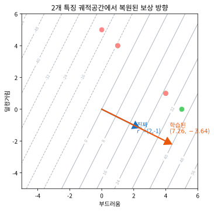
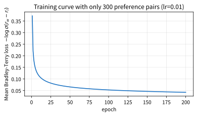

# 12.2 선호 기반 보상모델과 실습

[](https://colab.research.google.com/github/SuminHan/book-ml/blob/main/notebooks/ml2/chapter12_2_prefer_reward.ipynb)

### 선호 기반 보상모델: 로봇 제어에 적용하는 RLHF

시연을 구하기도 어려운 경우(예: "이 로봇 걸음걸이가 더 자연스럽다"처럼
정답 하나를 콕 집어 시연하기는 어렵지만, 두 걸음걸이를 보고 어느 쪽이
나은지 비교하기는 쉬운 경우)에는 다른 전략이 통한다 — Chapter 13에서
소개할 로봇 제어 문제에 이번 절의 아이디어를 바로 적용해볼 수 있다.
사람이 매번 "정답 행동"을 알려주는 대신, 로봇이 만든 **두 개의 시도(궤적)
중 어느 쪽이 더 나은지 고르기만** 하면 된다 — 이 아이디어는 형태만
바뀌었을 뿐, LLM을 사람이 원하는 방향으로 다듬는 RLHF(Reinforcement
Learning from Human Feedback)[^rlhf]와 정확히 같은 구조다.


같은 상황 \\(x\\)에 대해 로봇이 만든 두 궤적 \\(y\_w\\)(사람이 더
선호한 쪽)와 \\(y\_l\\)(덜 선호한 쪽)이 있을 때, 보상모델
\\(r\_\phi(x,y)\\)가 \\(y\_w\\)에 더 높은 점수를 주도록 학습한다.
브래들리-테리 모델(Bradley-Terry model)은 이 선호 확률을 시그모이드로
모델링한다:

\\[P(y\_w \succ y\_l \mid x) = \sigma\big(r\_\phi(x,y\_w) - r\_\phi(x,y\_l)\big)\\]

이 확률을 최대화하는 손실은 다시 한번 **로지스틱회귀와 같은 교차
엔트로피 형태**다:

```python
def reward_model_loss(r_win, r_lose):
    # Bradley-Terry: P(y_w > y_l) = sigmoid(r_win - r_lose)
    return -math.log(sigmoid(r_win - r_lose))
```

이렇게 학습된 보상모델 \\(r\_\phi\\)가 준비되면, 그 점수를 Chapter
9~11에서 배운 강화학습 알고리즘(특히 PPO[^ppo])의 보상으로 그대로 사용해서
정책을 학습시킬 수 있다 — "사람이 직접 보상함수를 수식으로 설계하기
어려운 문제"(자연스러운 걸음걸이가 정확히 무엇인지 수식으로 정의하기는
어렵지만, 두 개를 보고 비교하기는 쉽다)에서 특히 강력한 전략이다.

### 왜 "시연"이 아니라 "비교"인가 — 두 가지 이유

"정답을 시연해서 행동 복제(12.1절)로 배우면 되지 않는가"라고 묻기 쉽다.
시연이 가능한 문제라면 12.1절이 실제로 더 단순하고 안전한 선택이다.
그럼에도 선호 기반 접근이 존재하는 데는 두 가지 구체적인 이유가 있다.

**첫째, 시연 자체가 어려운 문제들이 실제로 있다.** "더 자연스러운
걸음걸이", "더 안전한 주행", "더 정중한 말투" 같은 목표는 *최적*의
한 가지를 정밀하게 만들어내는 게 아니라, *주어진 두 가지 중 어느 쪽이
나은지* 가려내는 데 인간의 직감이 훨씬 잘 맞는 목표다. 인간은 "자연스러움"
이라는 것을 수치화해 시연하기보다, 둘을 나란히 놓고 "나 쪽이 낫다"고
판정하는 데 훨씬 일관성이 있다. 이 "비교는 쉬우나 절대 정의는 어렵다"는
불균형이 선호 기반 학습이 존재하는 근거다 — Chapter 11.3의
시그모이드/소프트맥스처럼, 연속적인 질을 이산적인 판정(둘 중 하나)으로
줄여버리면 사람이 안정적으로 라벨을 댈 수 있게 된다.

**둘째, 그리고 더 근본적인 이유: 시연은 "상한"이 사람이다, 선호 기반
강화학습은 상한을 넘을 수 있다.** 행동 복제(12.1절)는 전문가가 보여주지
않은 전략을 절대 만들어낼 수 없다 — 학습 신호가 전부 전문가의 시연이니까.
반면 선호 기반 보상모델은 "두 시도 중 더 나은 쪽"만 알려주면 되므로,
*사람이 시연한 적 없는* 새로운 시도도 비교 데이터로 점수를 줄 수 있다.
그 보상모델을 PPO로 최적화하면 정책이 사람이 한 번도 보여준 적 없는
새로운 행동 패턴을 *발견*할 수 있다 — 12.3절의 표에서 "성능 상한" 행이
이 둘을 갈라놓는 이유다. 모방학습이 "전문가를 따라잡는" 지름길이라면,
선호 기반 보상모델은 "비교만 받아들이면서도 전문가를 *넘어서게 할 수
있는*" 우회로다.

한 가지 짚고 갈 점: 여기서 "사람이 두 궤적 중 더 나은 쪽을 고르는 것"
그 자체는 여전히 **지도학습**(12.1절의 행동 복제와 같은 교차엔트로피
손실)이다. "비교"를 *보상함수로 변환하는* 것, 그리고 그 보상을
*최적화 대상*으로 PPO에 넘기는 것이야말로 이 절이 새로운 부분이다.
즉 "사람이 뭘 하는가"(비교)와 "알고리즘이 그걸 어떻게 쓰느냐"(보상
최적화)를 분리해서 이해하라.

### RLHF의 두 단계 전체 그림

이상을 합치면, 선호 기반 학습은 사실 **두 단계**로 구성된다. 아래 그림은
그 전체 흐름이다.


**단계 1 — 보상모델 학습(지도학습).** 사람의 선호 쌍
\\((x, y\_w, y\_l)\\)를 모아서 \\(r\_\phi\\)를 학습시킨다. 손실이
로지스틱회귀와 동일하므로, 이 단계는 Chapter 2의 분할/로지스틱회귀와
같은 *정지* 문제다 — 탐색도, 환경과의 상호작용도 없다. 실전(예: LLM
RLHF)에서는 사람의 "어느 쪽 답변이 더 나은가" 응답 수만~수십만 개를
수집해 신경망 보상모델을 훈련한다.

LLM에서 위 두 단계 파이프라인 — "사람의 선호 데이터로 보상모델을 학습하고,
그 보상을 PPO에 넣어 정책을 최적화한다" — 은 실제로 챗봇을 훈련하는
표준적인 방법이다.[^instructgpt]


**단계 2 — 보상 최적화(강화학습).** 학습된 \\(r\_\phi(x,y)\\)를
*보상함수로 그대로* PPO(Chapter 11)의 보상으로 넣고 정책을 최적화한다.
여기서 "보상이 사람"이 아니라 "사람의 선호를 학습한 *대리 모델*"이 된다.
이 단계 2가 바로 Chapter 9~11에서 배운 강화학습 본연의 알고리즘이다 —
선호 기반 학습이 "강화학습을 대체하는 것"이 아니라, **그 강화학습에
넣을 보상을 사람이 설계하는 대신 사람의 비교로부터 학습하는** 방법임을
기억하라.

두 단계가 분리되는 데는 실용적인 이유도 있다. 사람의 비교를 *수집*하는
것(비싸고 느리고, 사람이 필요한 오프라인 작업)과 그 데이터를 *최적화*
하는 것(싸고 빠르고, 자동화된 RL)은 주기가 완전히 다르다. 선호 쌍을
한 번 모으고 저장해두면, 그 데이터를 바탕으로 보상모델을 학습하고 PPO를
돌리는 단계 2는 사람을 붙이지 않고 반복할 수 있다 — 사람이 "매 스텝마다
보상을 부여"하는 것이 아니라, "한 번 비교 데이터를 제공하면 나머지는
알고리즘이 알아서"라는 구조다.

### 보상모델을 PPO의 보상으로 넣으면 — 그리고 그 함정

보상모델이 준비되면, PPO 입장에서는 아무것도 바뀌지 않는다. Chapter
11.2에서 보았듯 PPO는 "스텝마다 환경에서 오는 스칼라 보상"을 전제로
동작하는데, 그 스칼라를 "환경이 주는 값"이 아니라 "보상모델이 점수 매긴
값 \\(r\_\phi(x\_t, y\_t)\\)"으로 교체할 뿐이다. 정책 그래디언트·
어드밴티지·클리핑 등 PPO 내부의 모든 수식이 그대로 재사용된다 —
"보상의 *출처*"만 바뀌었을 뿐이다.

이 "대리 모델 보상으로의 교체"는 강력한 동시에 **위험한** 한 가지
성질을 안고 있다. PPO는 보상모델 \\(r\_\phi\\)를 *완벽한* 것으로
믿고 그 값을 높이는 방향으로 움직이지만, \\(r\_\phi\\)는 결국 *학습된
근사*다. 정책이 "사람의 *진짜* 선호"와 "보상모델이 *추정*한 선호"가
다를 수 있는 영역으로 벗어난다면, 정책은 **보상모델의 약점(잘 못
점수 매긴 지역)을 파고들며 점수는 오르는 데 실제 선호는 안 좋아지는**
행동을 배울 수 있다. 이는 바로 **Goodhart의 법칙**(Goodhart's law) —
"측정 지표가 목적이 되면 더 이상 좋은 지표가 아니다" — 의 강화학습
버전이다 [^rewardhacking]: 보상을 "사람의 *진짜* 선호"가 아니라 "보상모델의 *출력*"으로
대치한 순간, 정책이 최적화하는 대상은 *진짜 선호*가 아니라 *보상모델
출력을 높이는 것*이 돼 버린다. Chapter 13의 로봇
제어에서는 이것이 "로봇이 실제 보상을 회피하는 *다른* 지표(예: 벽에
부딪히는 횟수를 최소화하려 벽에서 멀리만 맴도는)를 극대화하는" 형태로
나오며, LLM RLHF에서는 "보상모델이 좋아하는 형식(과장, 장황함)에 맞춰
실제 내용은 퇴보하는" 형태로 나타난다. 이번 절에서는 이 위험을 *인지*
하는 수준에서 멈추고, Chapter 13에서 실제 로봇에서 어떻게 관찰되는지
다시 본다.

### 실습: 선호 쌍만으로 숨겨진 보상함수 복원하기

로봇 걸음걸이를 "부드러움"과 "덜컹거림"이라는 두 특징으로 요약한
장난감 예제로, 사람이 (겉으로 드러나지 않는) 진짜 보상함수
\\(r^\*(\text{traj}) = 2 \times \text{부드러움} - 1 \times
\text{덜컹거림}\\)을 마음속으로 갖고 선호를 표현한다고 하자 — 학습
알고리즘은 이 진짜 보상함수를 전혀 모른 채, 오직 "이 궤적 쌍 중 어느
쪽이 더 나은가"라는 비교 데이터 300개만 본다:

```python
def r_phi(traj, w1, w2, b):
    return w1*traj[0] + w2*traj[1] + b

w1, w2, b = 0.0, 0.0, 0.0
lr = 0.01
for epoch in range(200):
    for win, lose in pairs:   # (선호된 궤적, 덜 선호된 궤적) 쌍들
        rw, rl = r_phi(win, w1, w2, b), r_phi(lose, w1, w2, b)
        p = sigmoid(rw - rl)          # Bradley-Terry 모델의 예측 선호 확률
        grad = p - 1                  # 정답 라벨은 항상 "win이 이겼다"(=1)
        w1 -= lr * grad * (win[0] - lose[0])
        w2 -= lr * grad * (win[1] - lose[1])
```

200 에폭 학습 후(실습 노트북에서 실행 검증, seed 42 기준):

```
학습된 가중치: w1(부드러움)=7.264, w2(덜컹거림)=-3.643
진짜 가중치:   w1=2, w2=-1
```

절댓값 자체는 다르지만(보상모델은 스케일이 원래 정해져 있지 않다 —
Bradley-Terry 확률은 \\(r\_w - r\_l\\)의 **차이**에만 의존하므로, 모든
가중치를 같은 배수로 늘려도 예측 확률은 똑같다), 비율
\\(w\_1/w\_2 \approx -1.99\\)은 실제 비율(\\(2/{-1}=-2\\))에 매우
가깝다. 실제로 한 번도 보지 못한 새 궤적 쌍 3개로 검증해보면:

```
(부드러움4,덜컹거림1) vs (부드러움1,덜컹거림4): 실제 선호=앞쪽, 모델 예측=앞쪽 ✓
(부드러움3,덜컹거림3) vs (부드러움1,덜컹거림1): 실제 선호=앞쪽, 모델 예측=앞쪽 ✓
(부드러움5,덜컹거림0) vs (부드러움0,덜컹거림5): 실제 선호=앞쪽, 모델 예측=앞쪽 ✓
```

3쌍 모두 정확히 맞혔다 — "부드러움이 좋고 덜컹거림이 나쁘다"는
수식을 단 한 번도 직접 알려주지 않았는데도, 순전히 비교 데이터
300개만으로 그 관계를 정확히 복원해낸 것이다. 이게 바로 RLHF가
"보상함수를 사람이 직접 코드로 쓰지 않고도" 학습시킬 수 있는 이유를
가장 작은 규모로 보여주는 예시다.

**복원된 "방향"을 공간 위에 그려보면 더 명확해진다.** 궤적을
(부드러움, 덜컹거림) 좌표로 그었을 때, 진짜 보상
\\(r^\* = 2 \times \text{부드러움} - 1 \times \text{덜컹거림}\\)은
(2, −1) 방향의 등고면을 갖고, 학습된 보상모델
\\(r\_\phi \approx 7.26 \times \text{부드러움} - 3.64 \times
\text{덜컹거림}\\)은 (7.26, −3.64) 방향의 등고면을 갖는다. 두 방향
벡터는 *크기(스케일)는 달라도* 방향이 거의 일치한다 — Bradley-Terry가
"차이"에만 의존하므로 스케일은 학습되지 않고, *방향(부드러움과
덜컹거림의 상대적 중요도 비율)*만이 학습된다는 것을 그림이 그대로
보여준다.



**학습 곡선**도 함께 보자. 300개 선호 쌍에 200 에폭 동안 Bradley-Terry
손실을 최소화하면 아래처럼 처음에는 급격히 떨어지다가 어느 시점부터
거의 수평이 된다 — 모델이 "부드러움이 더 가치 있다"는 방향을 *빠르게*
잡아버렸다는 뜻이다. (곡선이 0까지 안 내려가는 이유는, 서로 *가까운*
궤적 쌍은 진짜 보상에서도 차이가 작아 \\(\sigma(r\_w-r\_l)\\)가 1에
완전히 도달하지 못하기 때문이다 — 손실의 *절대값*보다 *하향 추세*를
읽으라.)



### 자주 하는 실수: 학습된 보상모델의 절댓값을 그대로 해석하기

위 결과에서 학습된 가중치(7.264, −3.643)가 진짜 가중치(2, −1)와
스케일이 다르다는 것을 "모델이 부정확하다"고 오해하기 쉽다 — 하지만
Bradley-Terry 손실은 오직 **두 궤적 사이의 상대적인 차이**만 학습
신호로 쓰므로, 절대적인 스케일은 원래부터 정해지지 않는다(같은 이유로
ML1 Chapter 17의 LLM 보상모델도 "이 답변의 점수는 정확히 몇 점"이라는
절대적인 해석이 불가능하고, 오직 다른 답변과 비교한 상대적인 순위만
의미가 있다). 실전에서 보상모델의 출력을 그대로 "만족도 점수"처럼
절대적으로 해석하면 안 되고, 항상 "다른 후보와 비교했을 때 상대적으로
얼마나 나은가"로만 읽어야 한다.

한 걸음 더: 이 "스케일 불변성"은 실습 코드에서 *보상* \\(b\\)가
전혀 학습되지 않는 이유이기도 하다. Bradley-Terry 손실은
\\(r\_w - r\_l\\)에만 의존하는데, 공통 보상이 둘에서 서로 *완전히
소거*되므로 \\(b\\)는 어떤 값이든 손실을 바꾸지 않는다 — 즉
*추정 불가능*하다. 그래서 위 코드(와 실습 노트북)는 \\(b\\)를
0으로 고정하고 \\(w\_1, w\_2\\)만 갱신한다. 만약 손실 속에 \\(b\\)가
*차이*로 남아 있었다면(예: \\(r\_\phi(x)\\) 자체를 절대값으로 맞히는
회귀)은 \\(b\\)도 함께 학습됐을 것이다 — "차이만 본다"는 설계가
스케일·상수 불변성을 *구조적으로* 만들어낸다는 점을 기억하라.

### 확인 문제

1. (수학) Bradley-Terry 손실
   \\(-\log\sigma(r\_w - r\_l)\\)에서 \\(r\_w = 3, r\_l = 1\\)일 때의
   손실값을 계산하라. 그리고 모든 보상을 2배로 해서
   \\(r\_w=6, r\_l=2\\)로 바꾸면 손실값이 어떻게 되는지 계산하고,
   왜 두 값이 *같게* 되는지(= 스케일 불변성) \\(\sigma\\)의 성질을
   들어 설명하라.

2. (개념) 이번 절의 실습에서 학습된 가중치 (7.264, −3.643)가 진짜
   (2, −1)와 *비율은 거의 같아도* 스케일이 다르다. 만약 이 보상모델을
   PPO의 보상으로 넣었을 때, 스케일이 3.6배나 크다는 것이 *정책 학습
   자체*에 해가 될 수 있는가? (힌트: PPO의 어드밴티지는 *보상의
   절대값*이 아니라 *같은 배치 안에서의 상대적 크기*를 정규화해 쓴다.)

3. (개념) "보상모델을 PPO 보상으로 쓰는 것"이 보상모델의 약점을 파고드는
   *보상 해킹* 위험을 안고 있다는 이 절의 주장을, Chapter 13의 로봇
   제어(또는 LLM) 맥락에서 *구체적인* 예시 하나를 들어 설명하라.

### 자주 묻는 질문

**Q. 선호 쌍 300개만으로 진짜 보상 비율을 -1.99까지 복원했는데,
이건 "300개"라는 숫자가 특별히 잘 맞은 건가요? 쌍을 30개로 줄이면
어떨까요?** 방향 복원은 *데이터가 충분히 다양한* 한에서 빠르게 수렴한다.
30개만 주면 (부드러움, 덜컹거림) 평면의 *각 방향*이 고르게 커버되지
않아서, 학습된 비율이 -2에서 꽤 벗어날 수 있다 — 실습에서
seed/쌍 수를 바꿔가며 비율이 어떻게 흔들리는지 직접 확인해보는 것은
좋은 연습이다(실습 노트북 마지막 셀). 핵심은 "쌍 수" 자체보다
*쌍이 특징 공간의 서로 다른 방향을 얼마나 대표하느냐*다.

**Q. 사람이 "둘 다 비슷하다"고 판정하는 쌍은 어떻게 처리하나요?**
실제 RLHF에서는 "비슷하다"(tie)는 라벨을 따로 두거나, 차이가 작은
쌍은 학습에서 제외하기도 한다. Bradley-Terry는 "둘 중 *반드시* 하나를
골라야" 하는 2-택-1 라벨을 전제로 하기 때문에, tie를 강제로 win/lose
중 하나에 넣으면 *잡음*이 된다 — 모델은 진짜로 없는 차이를 억지로
학습하려 시도한다. 그래서 실전에서는 tie를 걸러내거나, "차이가
크면 확률도 1에 가깝게, 차이가 작으면 0.5에 가깝게"를 반영하는
*연속* 선호(0~1 실수값)로 확장해 쓰는 경우(= Bradley-Terry의
일반화)가 있다.

**Q. 보상모델이 "부드러움=+7.26, 덜컹거림=−3.64"라고 학습했는데,
왜 "부드러움=+2, 덜컹거림=−1"로 *정규화*해서 쓰면 안 되나요?**
*방향*만 중요하다면 정규화한 것이 *방향*으로는 동일하므로, 비교
(순위) 목적으로는 실제로 문제없다. 정규화의 단점은 "보상 스케일"이
*다른* 보상(예: 충돌 회피 페널티 같은 *별개*의 절대 보상)와 합칠 때
생긴다 — PPO에서 여러 보상을 *덧셈*으로 합치려면 각 보상의 *상대
스케일*이 의미 있게 정해져 있어야 하는데, Bradley-Terry로 학습된
보상만으로는 그 절대 스케일을 결정할 근거가 없다. 그래서 "순서만
중요할 때"는 정규화해도 되고, "다른 절대 보스와 합칠 때"는 스케일을
별도로 잘 맞춰줘야 한다.

**Q. 왜 보상모델을 로지스틱회귀(선형)로 두고, 신경망으로 확장하면
안 되나요?** 실전(특히 LLM)에서는 보상모델이 *신경망*이다. 이번
실습은 "비교 → 방향 복원"이라는 *핵심 메커니즘*을 최소한으로
보여주기 위해 2차원 선형으로 단순화한 것일 뿐이다. 신경망 보상모델로
만들어도 Bradley-Terry 손실(교차엔트로피)과 "차이에만 의존"하는 구조,
그리고 스케일 불변성은 *그대로* 보존된다 — 다만 특징 공간의 *비선형*
패턴까지 학습할 수 있을 뿐이다. 즉 "선형"은 예제의 단순화이지,
RLHF의 필수 조건이 아니다.

**Q. 이번 절의 "사람이 두 궤적을 비교"와 12.1절 DAgger의 "전문가가
새 상태에 대해 정답 행동 알려주기"의 차이는 무엇인가?** 둘 다 "사람이
학습에 개입한다"는 공통점이 있지만, 사람이 *제공하는 것*이
달랐다. DAgger[^dagger]는 (상태, *정답 행동*) 쌍을 주는 *지도학습*이고(=
시연), 이 절은 (두 *시도* 중 *더 나은 쪽*)만 주는 *비교*를
준다. 정답 행동을 주면 그 행동을 *복사*할 뿐이지만(상한=사람), 더
나은 쪽만 주면 정책이 그 방향 *이상을 탐험*할 수 있다(상한 초월
가능). 이 차이가 12.3절 표의 "성능 상한" 행으로 이어진다.

---

**선호 기반 보상모델은 "사람이 정답을 코드로 쓰지 않고도" 보상을
학습하는 방법이다 — Bradley-Terry 손실(로지스틱회귀와 같은 교차
엔트로피)로 사람의 비교로부터 보상모델 \\(r\_\phi\\)를 학습하고, 그
보상을 PPO에 넘겨 정책을 최적화한다. Bradley-Terry가 *차이*에만
의존하므로 보상의 절대 스케일은 정해지지 않고 *방향(특징의 상대적
중요도)만이* 복원된다(실습: 300개 쌍으로 비율 -2를 -1.99까지 복원).
그 "대리 모델 보상으로의 교체"가 강력한 동시에 보상모델의 약점을
파고드는 보상 해킹의 입구이기도 하다 — 이 점은 Chapter 13의 로봇
제어에서 구체적으로 확인한다.**

이 주제를 더 깊이 다루는 자료: [^cs234]

[^rlhf]: Christiano, P. et al. (2017). "Deep reinforcement learning from human preferences." NeurIPS 2017. arXiv:1706.03741.
[^ppo]: Schulman, J. et al. (2017). "Proximal Policy Optimization Algorithms." arXiv:1707.06347.
[^cs234]: Stanford CS234: Reinforcement Learning. https://web.stanford.edu/class/cs234/
[^dagger]: Ross, S., Gordon, G. J., Bagnell, J. A. (2011). "A Reduction of Imitation Learning and Structured Prediction to No-Regret Online Learning." ICML 2011. arXiv:1011.0686.
[^instructgpt]: Ouyang, L. et al. (2022). "Training language models to follow instructions with human feedback." arXiv:2203.02155.
[^rewardhacking]: Skalse, J., Howe, N. H. R., Krasheninnikov, D., Krueger, D. (2022). "Defining and Characterizing Reward Hacking." arXiv:2209.13085.
