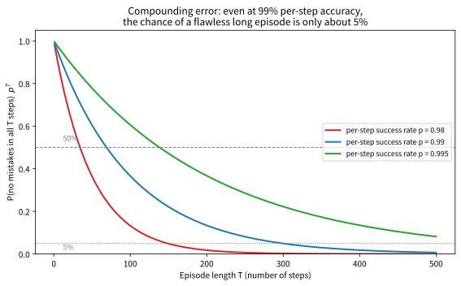

# 12.3 모방학습 vs 강화학습: 언제 무엇을 쓰는가

[](https://colab.research.google.com/github/SuminHan/book-ml/blob/main/notebooks/ml2/chapter12_3_bc_rl_gridworld.ipynb)

12.1절에서는 **시연**으로부터, 12.2절에서는 **비교**로부터 배우는 방법을
배웠다. 이번 절은 "어느 쪽을 쓸 것인가"를 **원칙**으로만 정하지
않고, 이번 장을 배운 뒤라면 정량적으로 따져볼 수 있어야 한다는
목표를 둔다. 표 한 장을 통째로 외우는 것보다, 표의 각 행이
**왜** 그런지 — 그리고 숫자가 어디까지 유효한지 —를 아는 것
이 실전에서 훨씬 유용하다.

### 어떤 "자원"을 가진가 — 표를 읽는 올바른 눈

| | 모방학습(BC/DAgger) | 강화학습(Ch.2~11) |
|---|---|---|
| 필요한 것 | 전문가 시연(또는 비교) | 보상함수, 환경과의 상호작용 |
| 탐험 필요 여부 | 기본적으로 불필요(DAgger는 약간 필요) | 필수(Chapter 2의 탐험-활용 딜레마) |
| 안전성 | 상대적으로 안전(전문가 행동만 따라함) | 학습 중 위험한 행동을 시도할 수 있음 |
| 성능 상한 | 전문가 수준이 상한(그 이상 못 넘어섬) | 이론상 전문가를 뛰어넘을 수 있음(Chapter 4의 최적 정책) |

"어떤 게 낫나요?"라는 질문은 애초에 **잘못된 질문**이다 — 두 접근은
**동일한 자원을 요구하지 않으므로** 비교의 대상 자체가 다르다.
12.1~12.2절을 배운 지금은 표의 첫 번째 행("필요한 것")이 사실상
*결정변수*임을 알 것이다. 시연이 있는 문제(시뮬레이터에 잘 동작하는
기존 컨트롤러가 있는 경우 포함 — DAgger의 "전문가"는 반드시 사람이
아닐 수 있다, 12.1절 FAQ)에는 BC를 쓰는 쪽이 이롭고, 시연이 없고
보상을 직접 정의할 수 있는 문제(게임 점수, 에너지 소모량 같은
측정 가능한 목표)에는 순수 RL 쪽이 자연스럽다. 표의 나머지 세
행 — 탐험, 안전, 상한 —은 이 첫 번째 선택이 *만드는 결과물*이다.

실전에서는 둘을 섞어 쓰는 경우가 많다 — 예를 들어 행동 복제로 "그럴듯한
초기 정책"을 빠르게 만든 뒤, 그 위에서 강화학습(PPO[^ppo] 등)으로
미세조정해 전문가의 한계를 넘어서게 하는 식이다.


**모방학습은 "시행착오를 겪을 필요 없이, 이미 잘하는 존재를 보고 배운다"는
지름길이고, 선호 기반 보상모델은 "보상함수를 직접 설계하기 어려울 때
비교만으로 그 보상함수 자체를 학습한다"는 우회로다 — 둘 다 Chapter
2~11에서 힘들게 배운 강화학습 알고리즘 자체를 대체하는 게 아니라, 그
알고리즘에 넣을 데이터와 보상을 어떻게 더 안전하고 저렴하게 얻을
것인가에 대한 답이다.**

> **역사적 배경 — "시연으로 배운 로봇"이 왜 오래도록 못 넘어섰는가.**
> 모방학습이 "왜 혼자서는 한계에 부딪히는지"를 *이론적으로* 처음
> 보여준 논문은 Ross, Gordon & Bagnell의 2011년 논문[^dagger]
> *"A Reduction of Imitation Learning and Structured Prediction to
> No-Regret Online Learning"*다. 이 논문은 지금의 12.1절 "복합 오차"를
> **공분포 시프트**(covariate shift)로 정식화했다 — BC는 *전문가가
> 방문한* 상태에서 정답만 배우지만, 배포 시 *자기 자신의* 작은
> 실수로 그 상태를 벗어나면, 그 낯선 상태에서의 오차까지
> "학습 데이터의 분포"에 포함되지 않으므로 *고르게* 커진다는
> 것이다. 이 논문이 바로 12.1절의 DAgger 알고리즘의 원 논문이며,
> "시연이 있는 문제라도 긴 episode에선 BC만으론 부족하다"는 이번
> 절의 주장이 *감*이 아니라 이 2011년 결과의 직접적 귀결임을
> 보여준다.

### "전문가를 못 넘는다"는 한계를 숫자로: \\(p^T\\) 문제

"모방학습은 전문가 수준이 상한"이라고 배웠다. 그런데 같은 문장을
**긴 episode**라는 관점에서 다시 쓰면 전혀 다른 이야기가 된다.
BC를 잘 학습시켰다고 해도, 배포 단계에서 정책이 매 스텝마다
"전문가가 하듯" 올바른 행동을 할 확률은 \\(p < 1\\)이다 — 시연에
없던 미세한 상태 차이, 센서 노이즈, 환경의 작은 교란 때문이다.
매 스텝 독립이라면, episode \\(T\\) 스텝 동안 *한 번도* 오점을
지나치지 않을 확률은

\\[P(\text{오점 없는 episode}) = p^T\\]

다. \\(p\\)가 아무리 1에 가깝게 수렴해도 지수함수 \\(p^T\\)가
어떻게 떨어지는지 숫자로 보면, 12.1절의 "복합 오차"가 *느낌*이
아니라 **계산 가능한 문제**임을 알 수 있다.

\\[
\begin{array}{c|cccc}
\text{에피소드 길이 } T & 50 & 100 & 200 & 300 \\
\hline
p = 0.980 & 0.364 & 0.133 & 0.018 & 0.002 \\
p = 0.990 & 0.605 & 0.366 & 0.134 & 0.049 \\
p = 0.995 & 0.778 & 0.606 & 0.367 & 0.222
\end{array}
\\]

\\(p = 0.99\\) — "매 스텝 99%로 전문가를 따라 한다"는, 12.1절의
BC가 도달할 수 있는 *좋은* 수준으로 보일 만한 숫자 — 을 써도
\\(T = 300\\) 스텝의 episode에서 "한 번도 삐끗하지 않는" 확률은
**4.9**%에 불과하다. 반대로 \\(p = 0.995\\)이면 같은 300 스텝에서
22%까지 살아남는다. **1스텝 성공률이 0.5%p 차이**나는 것이
긴 episode에서는 "거의 불가능"과 "가끔은 된다"를 갈라놓는다 —
이 것이 복합 오차의 핵심이며, DAgger가 "시연에 없던 상태로
비틀어진" 경로의 상태까지 학습 데이터에 포함시킴으로써 \\(p\\)
자체를 높이는 이유가 바로 이것이다. 실습 노트북에서
\\(p\\)와 \\(T\\)를 바꿔 \\(p^T\\) 곡선을 직접 그려보자.



이 지수 감쇠가 DAgger 없이 BC만 쓰는 것의 *정량적인* 비용이다 —
그리고 "그 위에서 RL로 미세조정을 하면" 그 상한을 **넘을 수
있을까**를 다음 실험에서 직접 확인한다.

### 실습: 5×5 격자에서 BC, RL, BC+RL 세 개를 붙여 놓고 달리기

이 절의 표가 *말*로만 끝나지 않기 위해, 가장 작은 규모에서
세 가지를 **모두** 실행한다. 설정은 의도적으로 단순하다.

- **환경**: 5×5 격자월드. 시작(4,0) → 목표(0,4). 각 스텝마다 보상
  −1이므로, *보상 합이 가장 큰 경로*가 곧 *가장 짧은 경로*다.
- **전문가(시연 제공자)**: 목표까지 가는 **안전하지만 비최적**인
  우회 10-스텝 경로를 따른다 (보상 −10). 최적 경로는 8 스텝(보상
  −8)이다 — *전문가가 최적을 모르고 가는* 상황.
- **위험**: 격자 한가운데 (2,2)에 "함정"이 있다. 이 칸에 들어오면
  보상 −50, episode 즉시 종료. *시연 경로에는* 함정이 없지만,
  환경의 **5% 확률로** 실제 이동이 명령과 무관한 인접 칸으로
  바뀌는 *교란*이 있다 — BC 에이전트가 시연 경로 밖으로 밀려나
  *시연에 없던 상태*에서 행동해야 하는 상황이 여기서 생긴다.
- **세 그룹**: (A) 순수 BC — 시연에서 (s,a)를 배운 정책만 쓰고,
  시연에 없던 상태에서는 무작위. (B) 순수 RL — Q-learning(Chapter
  6, DQN[^dqn]의 핵심 알고리즘)을 0에서부터 ε-탐험[^silvercourse]으로 학습. (C) **BC+RL** — BC가 학습한
  정책의 가치함수를 초기값으로 주고, 그 위에 Q-learning으로 미세
  조정.
- 500 episode, seed 고정. 실습 노트북에서 직접 재실행할 수 있다.

한 가지 짚을 것: **BC+RL의 "초기값"이 정확히 무엇인가.** BC가
학습한 것은 *정책* \\(\pi\\)이지 가치함수는 아니므로, "BC의 결과를
RL에 넘긴다"는 말을 문자 그대로 구현하려면 *가치함수*를 만들어
주어야 한다. 이 실험에서는 그 초기값을 "시연 경로 위에서 남은
스텝 수만큼"으로 준다 — 시연 경로 위의 상태 \\(s\\)에서 전문가
행동을 따르면 *실제로* 남은 스텝 수 \\(k\\)만큼의 보상을 더
받아 \\(Q(s, \pi(s)) \approx -k\\)이고, 다른 행동은 한 스텝
나빠진 \\(-(k-1)\\)로 두며, 시연에 없는 상태는 0(미학습)으로
둔다. 즉 "시연 경로 근방에서는 시연만큼 정확하고, 그 바깥은
아직 모르는" 가치함수 — 실제 BC+RL에서도 시연 데이터가 줄
수 있는 것은 정확히 이 *근방의* 정보라는 점을 이 실험이
그대로 모방한다.


실행 결과(seed 0 고정):

- **순수 BC**: 마지막 20 episode 평균 보상 **−10.65**. 500
  episode 중 26번 함정 진입. *단 한 번도* 전문가(−10)를 넘는
  episode가 **없었다** — 12.2절의 "시연은 상한이 사람"이라는
  주장이 숫자로 확인된다.
- **순수 RL**: 마지막 20 episode 평균 **−8.70** — *8-스텝 최적
  경로*에 근접, 전문가의 10-스텝을 **뛰어넘음**. 그러나 500
  episode 중 30번의 함정 진입(특히 학습 초기 50 episode에 20번
  — "아직 배우는 중"인 에이전트가 위험한 행동을 가장 많이
  시도한다).
- **BC+RL**: 마지막 20 episode 평균 **−9.15** — 여전히 10-스텝
  전문가보다 나쁨(완전 최적에는 못 미침)이지만, *전문가 추월
  시점이* 순수 RL(273 ep)보다 빠른 **193 episode**였고, 함정은
  **9회**로 세 그룹 중 가장 적었다.

이 실험이 이번 절의 핵심을 한 그림에 압축한다: **순수 BC는
"안전하지만 전문가를 못 넘고", 순수 RL은 "넘을 수 있지만 학습 중
위험한 행동을 많이 하고", BC+RL은 "초기 안전성(9 vs 26/30)과
최종 성능(추월 시점 193 vs 273)을 동시에 얻는다".** "실전에서는
둘을 섞어 쓴다"는 이 절의 첫 문단이, *느낌이 아니라* 이 세
숫자(26, 30, 9 / 273, 193)로 읽히는 이유다.

### 선택 흐름: 무엇을 "가졌는가"를 확인하며

표와 실험을 합치면, 실전에서 "어떤 문제를 어떤 방법으로 풀 것인가"
를 결정하는 흐름이 나온다. 핵심은 **어떤 *자원*을 이미 가지고
있는가**를 순서대로 확인하는 것이다 — (1) 시연이 있는가? (2)
시연이 없어도 *비교*를 받을 수 있는가? (3) 둘 다 없다면 보상함수를
직접 설계할 수 있고, 탐험이 안전·저렴한가?


이 흐름의 마지막 칸 — "시연(또는 비교)으로 초기 정책을 만들고
PPO로 미세조정" — 이 **실전 표준**이다. LLM의 RLHF(12.2절)[^rlhf]는
정식적으로는 이 구조다: 사전훈련 언어모델(= "시연에서 만든
초기 정책")을 놓고, 사람의 비교로 학습한 보상모델로 PPO를 돌려
*사람이 직접 시연한 적 없는* 새 표현을 만들어낸다 — "초기
정책이 이미 그럴듯해서 PPO가 그 근방만 탐색하면 된다"는 것이
"사람의 비교 300개로도 방향을 복원할 수 있었다"(12.2절 실습)
는 결과가 *가능했던* 이유이기도 하다. 반면 Chapter 13의 로봇
제어에서는 BC로 초기 안정화한(서 있는 자세를 잡은) 정책을 만든 뒤,
보상모델로 미세조정하는 형태를 직접 본다.


### 자주 하는 실수: "시연이 있으니"를 "시연이 충분하다"로 읽기

12.1절의 복합 오차와 이번 실험의 (b) 그림을 연결하면, 가장
흔한 실무 오류가 보인다 — **"시연 데이터가 있으니 BC로 끝난다"고
판단하는 것.** 시연이 *있는* 것과 시연이 *충분한* 것은
전혀 다른 문제다. "충분하다"의 기준은 **배포 단계에서 정책이
실제로 방문하는 상태가 시연에 포함되는가**에 있다 — 위 격자
실험에서 순수 BC가 500 episode 중 26번 함정에 들어간 것은,
시연에 없던 (교란으로 밀려난) 상태에서 *무작위*로 행동했기
때문이다. 이 "시연 밖 상태"의 비중이 클수록(긴 episode, 교란
이 큰 환경, 전문가가 *최적*이 아닌 경로를 시연한 경우 — 위
실험이 정확히 이 케이스다) BC 단독의 한계도 커진다. 판정
기준은 간단하다: **배포 시 "시연에 없던 상태"를 방문할
확률이 몇 %인가?** 그 확률이 0에 가깝다면 BC로 충분하고,
그렇지 않다면 DAgger(12.1절) 또는 BC+RL(이 실험의 그룹 C)이
필요하다.

### 확인 문제

1. (수학) \\(p = 0.99\\), \\(T = 300\\)일 때 \\(p^T\\)를
   계산하라(위 표와 일치하는지 확인). 그리고 "오점 없이 완주할
   확률이 50%가 되는" episode 길이 \\(T\\)를
   \\(p^T = 0.5\\)에서 \\(T = \log(0.5) / \log(p)\\)로
   구하라. \\(p = 0.995\\)이면 같은 계산이 어떻게 바뀌는지
   비교하고, "1스텝 성공률 0.5%p"가 왜 긴 episode에서
   "거의 불가능"과 "가끔 된다"를 갈라놓는지 설명하라.

2. (개념) 위 격자 실험에서 순수 BC의 "최종 평균 보상 −10.65"가
   *전문가의* 10-스텝 경로(−10)보다 *나쁨*인 이유를
   시연 밖 상태(교란으로 밀려난 상태)에서의 행동(무작위)을
   들어 설명하라. DAgger를 추가하면 이 수치가 어떻게 변할
   것이라 예상하는지, 12.1절의 메커니즘(자신의 경로 상태에
   대한 전문가 즉답)을 들어 근거를 제시하라.

3. (개념) "선호 기반 보상모델(12.2절)은 시연(BC)과 달리
   전문가 수준을 *넘을 수 있다*"는 주장이 이번 절의 표
   "성능 상한" 행에 어떻게 반영되는지, 그리고 그 "넘을 수
   있는" 메커니즘(사람이 *정답*이 아닌 *비교*만 주어
   보상모델이 정답 밖 시도에도 점수를 줄 수 있다)을 1~2문장으로
   설명하라.

4. (코딩) 위 격자 실험의 세 그룹 중 하나(예: 순수 RL)의
   Q-learning 코드를 가져와, (a) 교란 확률 5%를 0으로
   바꾸면 세 그룹의 최종 보상이 어떻게 바뀌는가, (b)
   ε-탐험의 하한(ε_min)을 0.05 → 0.01로 낮추면 "전문가
   추월 episode"가 언제로 변하는지를 실험으로 확인하고
   설명하라. (힌트: 교란 0%이면 BC도 시연 경로 밖으로
   밀려나지 않으므로 시연 밖 상태 문제가 사라진다.)

### 자주 묻는 질문

**Q. 표에서 "성능 상한"이 모방학습은 전문가 수준이라고 했는데,
DAgger도 마찬가지인가요?** 그렇다 — DAgger는 복합 오차를 줄여서
"전문가 수준에 더 안정적으로 도달"하게 해줄 뿐, 여전히 정답은
전문가가 알려주는 것이라 전문가보다 잘할 방법이 없다. 반면 선호
기반 보상모델(12.2절)은 사람이 "정답 행동"을 알려주는 게 아니라
"비교"만 하므로, 그 보상모델을 강화학습(PPO 등)으로 최적화하는
과정에서 정책이 사람이 직접 보여준 적 없는 새로운 전략을 발견할
수 있다 — 이 점에서 선호 기반 방법은 순수 모방학습보다 강화학습에
더 가까운 성격을 갖는다.

**Q. 이번 학기(ML1)에서 배운 RLHF와 이번 장의 선호 기반 보상모델은
완전히 같은 것인가요?** 수학적 구조(브래들리-테리 모델, 보상모델
학습, 그 보상으로 정책을 강화학습)는 동일하다 — 차이는 "정책이
무엇을 생성하는가"뿐이다. ML1 Chapter 13에서는 정책(언어모델)이
토큰을, 이번 장에서는 정책(로봇 컨트롤러)이 관절 토크 같은 연속
행동을 생성한다. 같은 수학이 완전히 다른 두 응용(텍스트 생성 vs
로봇 제어)에 그대로 적용된다는 것이 이 프레임의 범용성을 보여준다.

**Q. 이번 실험에서 순수 BC가 함정에 26번 들어갔는데, 이건
"BC가 위험하다"는 뜻인가요?** 아니다 — 이 26번은 *교란(5%)*이
BC 에이전트를 시연 경로 밖으로 밀려내고, 그 *시연에 없던
상태*에서 BC가 *무작위*로 행동한 결과다. 즉 "BC 정책
**자체**"가 위험한 행동을 고른 것이 아니라, **시연이 커버하지
못한 영역**에서 아무런 정책이 없었기 때문이다. 이 구분이
중요하다: "시연이 충분하면 BC는 가장 안전하다"(표의 "안전성"
행)는 주장은 *시연이 배포 상태 분포를 실제로 커버할 때*만
성립한다. 교란이 큰 환경, 긴 episode, 전문가가 *최적*이 아닌
경로를 시연한 경우 — 이번 실험이 정확히 이 셋을 모두 갖춘
케이스다 — 시연 커버리지가 부족해 BC 단독의 안전성이
무너진다.

**Q. "BC+RL이 BC와 RL을 합친 것"이라면, 왜 "순수 BC에
RL을 조금만 추가"하는 게 아니라 "RL을 *본격적으로*
돌려야" 하는가?** 위 실험에서 BC+RL 그룹이 최종 −9.15에
머문 이유(완전 최적 −8에는 못 미침)를 생각해보면 답이 나온다.
BC가 준 초기 가치함수는 *시연 경로 근방*에만 정확하고,
*시연 밖 상태*의 Q값은 여전히 0(미학습)이다. RL이 이
"미학습 영역"을 채우려면 *그 영역을 실제로 방문해서*
보상을 관찰해야 한다 — 이것이 순수 RL과 동일한 *탐험*을
요구한다는 뜻이다. "초기값을 BC에서 받았으니" RL의 필요
탐험량이 줄어 *추월 시점이* 빠르고(193 vs 273 episode)
*초기* 함정 횟수가 적고(9 vs 30), 하지만 *최종* 성능은
RL이 *시연 밖 상태*를 충분히 탐색했을 때에만 10-스텝
우회를 벗어나 8-스텝 최적에 수렴한다. 이 절의 주제를 더 깊이
보려면: [^cs234]

**결국 "모방학습 vs 강화학습"은 "어떤 자원을 이미 가지고 있는가"의
문제다.** 시연이 있으면 BC(12.1절)로 가장 안전하고 빠르게 시작하되,
*긴 episode*이거나 *배포 시 시연에 없던 상태로 비틀어질* 가능성이
있으면 \\(p^T\\) 지수 감쇠가 BC의 실질 한계임을 기억하고 DAgger로
시연을 *자기 경로에 맞게* 보강하거나 RL로 미세조정한다. 시연이 없고
"비교"만 받을 수 있으면(12.2절) 선호 기반 보상모델로 *사람이 직접
보상을 쓰지 않고도* 전문가를 넘을 수 있는 보상을 만든 뒤 PPO로
최적화한다. 둘 다 없으면 Chapter 2~11의 순수 RL로 돌아간다 — 그리고
실전 표준은 이 셋의 *첫 번째(시연 또는 비교)로 초기 정책을 만든 뒤
두 번째(RL)로 한계를 넘게 하는* 하이브리드다. 5×5 격자 실험은 이
"초기 안전성(9 vs 26/30)과 최종 성능(추월 193 vs 273 episode)을
동시에 얻는다"는 주장을 *느낌이 아니라 숫자*로 보여준다.

---

## 연습문제

**1. (코딩)** 위 `train_behavior_cloning`과 `reward_model_loss`(핵심
줄은 빈칸으로 남겨져 있다고 가정)를 완성하라:

```python
import math, random

def sigmoid(z):
    return 1 / (1 + math.exp(-max(-20, min(20, z))))

def train_behavior_cloning(demos, epochs, lr):
    # ADD ADDITIONAL CODE HERE!!
    # w, b를 0으로 초기화, epochs번 반복하며 demos의 각 (s,a)에 대해
    # 로지스틱회귀와 같은 방식으로 grad = pred - a 계산 후 w, b 갱신

    return w, b

def expert_policy(state):
    return 1 if state < 0 else 0  # 전문가: 항상 0(원점) 방향으로 이동

random.seed(0)
demos = [expert_policy(random.uniform(-5, 5)) for _ in range(200)]  # placeholder
demos = [(s, expert_policy(s)) for s in [random.uniform(-5, 5) for _ in range(200)]]
w, b = train_behavior_cloning(demos, epochs=30, lr=0.05)
print(sigmoid(w * (-2) + b) > 0.5)  # True여야 함 (state=-2에서 action=1 예측)

def reward_model_loss(r_win, r_lose):
    # ADD ADDITIONAL CODE HERE!!
    # -log(sigmoid(r_win - r_lose))

print(round(reward_model_loss(2.0, -1.0), 3))  # 0.049
```

**2. (개념 서술)** 12.2절의 복합 오차 문제가 왜 "에피소드가 길수록"
더 심각해지는지 설명하고, DAgger가 이 문제를 완화하는 메커니즘을
1~2문장으로 요약하라.

**3. (개념 서술)** 자율주행 자동차의 조향을 학습시키는 문제를 예로 들어,
(a) 순수 행동 복제만 썼을 때 발생할 수 있는 구체적인 실패 시나리오
하나, (b) 순수 강화학습(무작위 탐험 포함)만 썼을 때 발생할 수 있는
안전 문제 하나를 각각 서술하고, 왜 실전에서는 두 접근을 섞어 쓰는
경우가 많은지 논하라.

[^ppo]: Schulman, J. et al. (2017). "Proximal Policy Optimization Algorithms." arXiv:1707.06347.
[^dagger]: Ross, S., Gordon, G. J., Bagnell, J. A. (2011). "A Reduction of Imitation Learning and Structured Prediction to No-Regret Online Learning." AISTATS 2011. arXiv:1011.0686.
[^dqn]: Mnih, V. et al. (2015). "Human-level control through deep reinforcement learning." Nature 518, 529–533. (Earlier preprint: Mnih, V. et al. (2013). arXiv:1312.5602.)
[^rlhf]: Christiano, P. et al. (2017). "Deep reinforcement learning from human preferences." NeurIPS 2017. arXiv:1706.03741.
[^cs234]: 이 주제를 더 깊이 보려면 — Stanford CS234: Reinforcement Learning. https://web.stanford.edu/class/cs234/ — 모방학습 vs 강화학습 비교와 BC+RL 하이브리드 전략은 CS234의 imitation learning 강의 주제와 직접 겹친다.
[^silvercourse]: Silver, D. (2015). "UCL Course on Reinforcement Learning," Advanced Topics (COMPM050/COMPGI13) — 10개 강의 슬라이드(PDF) 및 영상 강의가 공개되어 있다. https://www.davidsilver.uk/teaching/ (본 장과 가장 직접적으로 겹치는 Lecture 9: Exploration and Exploitation — 47쪽, ε-greedy·멀티암 밴딧·컨텍스트 밴딧: https://davidstarsilver.wordpress.com/wp-content/uploads/2025/04/lecture-9-exploration-and-exploitation.pdf, CC-BY-NC 4.0).
