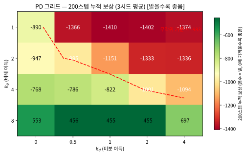

# 13.2 로봇 환경 탐색 실습

[](https://colab.research.google.com/github/SuminHan/book-ml/blob/main/notebooks/ml2/chapter13_2_robot_envs.ipynb)

이번 학기 실습은 Gymnasium이 제공하는 로봇류 환경으로 진행한다 — 이미
Chapter 1과 9에서 쓴 CartPole·Pendulum도 사실 아주 단순화된 "로봇
제어" 문제다(막대의 균형을 잡는 것, 진자를 세우는 것 모두 관절 제어의
가장 작은 형태다). 좀 더 로봇에 가까운 연속 제어 문제로 넘어가 보자:

```python
import gymnasium as gym
import numpy as np

env = gym.make("Pendulum-v1")  # 연속 행동공간을 가진 가장 단순한 "관절 제어" 문제
obs, info = env.reset(seed=0)
print("상태(cos theta, sin theta, 각속도):", obs)
print("행동공간:", env.action_space)  # Box(-2.0, 2.0, (1,)) -- 연속값 토크

# 손으로 설계한 간단한 PD(비례-미분) 제어기: 각도가 클수록, 각속도가 클수록 반대로 힘을 준다
total_reward = 0.0
for _ in range(50):
    cos_th, sin_th, thdot = obs
    theta = np.arctan2(sin_th, cos_th)
    action = np.clip(-2.0 * theta - 0.5 * thdot, -2.0, 2.0)
    obs, reward, terminated, truncated, info = env.step([action])
    total_reward += reward
print("PD 제어기의 50스텝 누적 보상:", round(total_reward, 2))
env.close()
```

이 PD(Proportional-Derivative) 제어기는 강화학습이 전혀 아니다 — 사람이
직접 설계한 규칙일 뿐이다. 그런데도 무작위 행동보다 나은 성능을
낸다. 그러나 "나은가"를 판정하려면 **평가 프로토콜**이 먼저다. 같은 코드로
시드 0~3를 돌려보자: 50스텝 누적 보상에서 무작위 정책은
\\(-234 \sim -403\\), 이 PD 규칙(\\(k\_p = 2, k\_d = 0.5\\))은
\\(-157 \sim -382\\) — **50스텝 창에서는 두 정책의 구분이 애매하다**.
평가 창을 200스텝(실시간 10초)으로 늘리면 둘이 갈라진다:
\\(k\_p = 8, k\_d = 2\\)의 PD는 \\(\approx -455\\)(3시드 평균)까지
개선되는 반면, 같은 프로토콜(200스텝 × 3시드)의 무작위는 평균
\\(\approx -983\\)다 — 창을 *같이* 늘렸을 때 PD가 무작위 대비 누적
벌을 **약 2.2배** 줄이는 것이다.
이 비교가 보여주는 것: **강화학습의 목표는 이런 손으로 설계한
제어기보다 더 나은, 또는 사람이 규칙으로 설계하기 어려운
상황에서도 작동하는 정책을 데이터로부터 직접 찾아내는 것**이다.

### 평가 프로토콜: 창(horizon)과 시드

왜 50스텝으로는 판단이 안 되는가? 두 가지 이유다. 첫째, **시작
자세가 랜덤**이다 — `Pendulum-v1`의 `reset`이 초기 각도를 균분포에서
뽑기 때문에(연속 `reset`마다 시작 각도가 다르다), 매 에피소드가
*다른 문제*다(90도까지 휘어 있는 상태에서의 회귀와 10도에서의
회귀는 난이도가 다르다). 문제 하나만 내고 점수를 보면, 점수의
대부분이 "어떤 문제가 나왔는가"라는 운에 지배된다. 둘째, 진자의
목표는 "흐름"이 아니라 "**상태**"다 — "위로 세운 채 유지한다"는
장기적 성취이므로, 50스텝(2.5초, \\(dt = 0.05\\) s) 창은 10초
에피소드의 첫 순간 이동만 측정한다. 초기 이동(첫 휘청임)이 짧은
창을 지배하고, 장기 성능은 드러나지 않는다.

그러니 이 절(과 13.3절)의 실습 규칙: **정책을 평가할 때 (1) 창을
고정**(여기선 200스텝), **(2) 시드 여러 개(여기선 3개)의 평균을
본다**, 그리고 **(3) 결과를 보고 나서 창을 바꾸지 않는다**. 세
번째가 함정이다 — "50스텝 숫자가 보기 싫어서 200스텝으로 해보자"
는 것은 평가가 아니라 **평가 프로토콜의 하이퍼파라미터 튜닝**이다.
전형적인 실수는 다른 창(horizon)의 숫자를 한 비교에 섞는
것이다 — "무작위 200스텝(\\(\approx -983\\))"과 "PD
50스텝(\\(\approx -263\\))"을 대면 PD가 "4배 좋다"고
보이지만, 그것은 정책의 차이가 아니라 **창의 차이**다: 200스텝
창에는 50스텝 창이 못 보는 "오래 흔들리는 벌"이 포함되어
있으니까. **평가 프로토콜도 실험의 일부다** — 두 정책을
비교하기 전에 창·시드 수·초기 분포가 같은지부터 확인하라.

### PD 그리드: "손으로 만든 정책"의 한계

사람이 직접 만든 정책의 한계를 체계적으로 보자. PD 제어기는
노브가 딱 두 개(\\(k\_p, k\_d\\)) — \\(k\_p \\in \\{1, 2, 4, 8\\}\\),
\\(k\_d \\in \\{0, 0.5, 1, 2, 4\\}\\)로 20개 정책을 만들고, 각각
200스텝 × 3시드 평균으로 누적 보상을 재면:

| | \\(k\_d = 0\\) | \\(k\_d = 0.5\\) | \\(k\_d = 1\\) | \\(k\_d = 2\\) | \\(k\_d = 4\\) |
|---|---|---|---|---|---|
| \\(k\_p = 1\\) | \\(-889.7\\) | \\(-1365.8\\) | \\(-1410.1\\) | \\(-1401.8\\) | \\(-1374.2\\) |
| \\(k\_p = 2\\) | \\(-947.3\\) | \\(-995.4\\) | \\(-1150.8\\) | \\(-1333.1\\) | \\(-1336.2\\) |
| \\(k\_p = 4\\) | \\(-767.9\\) | \\(-785.8\\) | \\(-821.7\\) | \\(-1001.3\\) | \\(-1094.0\\) |
| \\(k\_p = 8\\) | \\(-553.3\\) | \\(-455.7\\) | \\(-455.0\\) | \\(-454.9\\) | \\(-697.0\\) |

참고: 무작위 정책 같은 프로토콜(200스텝 × 3시드)에서의 평균은
\\(\approx -983\\)이다.



표를 행과 열로 읽자. **행(\\(k\_p\\)): 클수록 낫다** — 13.1절
선형화가 준 물리 그대로다: 중력 항 \\(15\theta\\)가 위에서
밀어내는 "역줄"이라, 이기려면 \\(k\_p > 5\\)가 필요했고, 실제로
\\(k\_p = 8\\) 행(\\(-455 \sim -553\\))이 \\(k\_p = 4\\) 행
(\\(-768 \sim -1094\\))를 압도한다. **열(\\(k\_d\\)): 클수록 좋은
게 아니다** — 미분 항은 진동을 잡지만, \\(k\_d = 4\\) 열
(\\(-1374, -1336, -1094, -697\\))은 \\(k\_d = 1 \sim 2\\) 열보다
시종 나쁘다: 댐퍼가 너무 세면 목표에 다가가는 움직임 자체가
말려 붙어서 "느리게 실패"한다. **최선은 \\((k\_p, k\_d) =
(8, 2)\\)의 \\(\approx -455\\)** — 무작위 \\(\approx -983\\)
대비 누적 벌이 약 절반 이하(2.2배)로 줄어든 것이다.

잠깐, 여기서 "왜?"를 한 번 더. 이 그리드 탐색은 **정책 탐색의
본질**이다 — 20개 정책은 2차원 파라미터 공간의 20개 점이고,
사람(혹은 스크립트)이 그 점들을 하나하나 훑었다. 그런데 Ant에
이 같은 방식을 적용할 수는 없다: Ant의 행동은 독립 8차원이고,
"좋은 정책"을 \\(k\_p, k\_d\\) 같은 두 숫자로 못 박는
"이득 × 오차" 형태가 존재하지 않는다 — 정책은 105차원 상태에서
8차원 행동으로 가는 **함수**이며, 그 함수를 표현하는 파라미터
공간은 1만 개가 넘는 가중치의 공간이다(13.3절의 64-64 은층
신경망 구조를 그대로 105차원 입력에 쓰면
\\(105 \times 64 + 64 \times 64 + 64 \times 8 \\approx 11500\\)개).
**그리드 방식은 고차원에서 죽는다** — 이것이 "정책을 데이터로부터
배운다"는 강화학습의 직접적인 동기가 되는 순간이다.

### "좋은 점수" ≠ "과제 달성": 궤적을 보라

점수 표는 마지막 질문에는 답을 못 한다: 그리드의 최선 \\((8, 2)\\)
PD가 진자를 *정말로* "세워 유지"하는가, 아니면 "잘 흔들고만"
있는가? 상태 \\((\theta, \dot\theta)\\)를 시간 축으로 그리면
(왼쪽은 각도, 오른쪽은 각속도) 답이 선명해진다:


\\(k\_p = 8, k\_d = 2\\)(초록, 그리드 최선)은 약 5초에
\\(\theta \approx 0, \dot\theta \approx 0\\) — 위쪽 수직의 균형점 —
에 수렴해 그 뒤 *그 자리에 있다*: "세운 채 유지"라는 과제를
달성한 것이다.
\\(k\_p = 4, k\_d = 1\\)(주황)은 다르다: 위쪽(0) 근처에
\\(\lvert\theta\rvert < 0.3\\)으로 *한 번도* 머무르지 못하고,
아래(\\(\pm\pi\\))를 중심으로 \\(\lvert \dot\theta \rvert
\approx 5\\) rad/s까지 휘청이며 10초 내내 "그냥 흔드는" 상태다.
13.1절이 수학으로 미리 말한 바로 그 사실
(\\(k\_p < 5\\)이면 제어기의 "줄"이 중력 "역줄"을 이기지 못해
위쪽 균형이 불안정)을, 여기선 *실험으로* 확인한 셈이다.

이 "궤적을 보는" 단계가 왜 필요한가? **누적 보상은 진짜
과제의 프록시(proxy)이기** 때문이다. "누적 벌을 최소화한다"
와 "위쪽을 세운 채 유지한다"는 대부분 같은 방향을 가리키지만
항상 같은 것은 아니며, 프록시를 최적화한 뒤 *진짜 목표*를 한
번 확인하는 습관이 없으면 "점수는 좋은데 과제를 못 한" 정책을
배포하게 된다 — Chapter 12에서 "리워드 해킹" 이야기의 핵심
방어선이 되는 습관이, 여기 2관절도 아닌 1관절 진자에서부터
시작된다.

### 로봇팔·사족보행 환경 탐색하기

Pendulum이 관절 하나짜리 가장 단순한 문제였다면, 이제 관절이 여러
개인 진짜 "로봇" 환경을 살펴보자. Gymnasium은 MuJoCo 물리엔진
(다음 장에서 자세히 다룬다) 기반의 로봇 환경을 여러 개
제공한다 — `Reacher-v5`(2관절 로봇팔이 목표 지점에 끝을 맞추는
과제)와 `Ant-v5`(다리 4개짜리 사족보행 로봇이 앞으로 걷는
과제)를 살펴보자:

```python
import gymnasium as gym

for name in ["Reacher-v5", "Ant-v5"]:
    env = gym.make(name)
    print(name, "상태공간:", env.observation_space.shape,
          "행동공간:", env.action_space.shape, env.action_space.low[:2], env.action_space.high[:2])
    obs, info = env.reset(seed=0)
    total_reward = 0.0
    for _ in range(100):
        a = env.action_space.sample()  # 아직 학습 전이므로 무작위 행동
        obs, r, term, trunc, info = env.step(a)
        total_reward += r
        if term or trunc:
            break
    print(f"  무작위 정책 100스텝 누적 보상: {total_reward:.2f}")
    env.close()
```

실행 결과(단일 시드, `env.action_space.sample()`의 전역 무작위):

```
Reacher-v5 상태공간: (10,) 행동공간: (2,) [-1. -1.] [1. 1.]
  무작위 정책 100스텝 누적 보상: -41.60

Ant-v5 상태공간: (105,) 행동공간: (8,) [-1. -1.] [1. 1.]
  무작위 정책 100스텝 누적 보상: -4.07
```

"로봇 환경의 분위기"를 잡는 데는 이 정도면 충분하다. 그런데 단일
시드의 숫자는 **재현이 안 된다** — `env.action_space.sample()`가
전역 numpy RNG에서 뽑기 때문에, *이전까지 몇 번 샘플링했는지*에
따라 같은 코드도 숫자가 달라진다(이것 자체가 이 절의 교훈이다:
비교할 숫자는 *재현 가능한* 프로토콜로 재야 한다). 그래서
노트북에서는 **에피소드마다 시드된 RNG**(`default_rng(1000+seed)`)로
무작위 행동을 뽑아 시드 0~2를 확장 실행한다 — 언제 다시 돌려도
아래 숫자와 똑같다:

```
Reacher-v5 (각 50스텝에서 시간 제한으로 truncated):
  seed0: -42.98   seed1: -40.02   seed2: -39.75
Ant-v5 (에피소드가 100스텝 전에 조기 종료됨):
  seed0: -6.88  (63스텝 만에 terminated)
  seed1: -19.47 (24스텝 만에 terminated)
  seed2: -9.94  (11스텝 만에 terminated)
```

Reacher는 상태 10차원(관절 각도·각속도 + 목표 위치)에 행동 2차원
(두 관절의 토크), Ant는 상태 105차원(몸통·다리 8개 관절의 자세
정보)에 행동 8차원(다리 8개 관절의 토크)이다 — Chapter 9~11에서
다룬 CartPole(상태 4차원, 행동 2개 중 선택)이나 Pendulum(상태
3차원, 행동 1차원)과 비교하면 상태·행동공간이 훨씬 크고 복잡하다
는 것을 숫자로 바로 체감할 수 있다. 이런 고차원 연속 제어 문제
에서, "Q값의 최댓값을 찾는다"는 Chapter 9의 DQN 접근이 왜
어려워지는지(행동 8차원의 연속공간 전체에서 최댓값을 찾아야
한다)와, Chapter 10~11의 정책기반 방법이 왜 이런 문제의 표준이
되는지가 자연스럽게 이어진다.

### Ant의 점수가 양수인 에피소드: 보상은 "장부"다

위 숫자(시드 0~2)는 모두 음수지만, 무작위 Ant 에피소드 중에는 **리턴이
양수**인 것이 있다(시드 4: **\\(+3.60\\)**, 16스텝에서
`terminated`) — "무작위 행동을 하는 로봇이 *양수* 점수를 받았
다니?" Ant의 보상을 열어보자. 단일 항이 아니라 **4항의 장부**
다(MuJoCo Ant의 보상 구조):

\\[r = \underbrace{1.0 \times \mathbb{1}[\text{healthy}]}
\_\text{생존} \\;+\\; \underbrace{1.0 \times \dot{x}}
\_\text{전진} \\;-\\; \underbrace{0.5 \\, \lVert a \rVert^{2}}
\_\text{제어비용} \\;-\\; \underbrace{5 \times 10^{-4} \times
\sum F\_\text{contact}^{2}}\_\text{접촉비용}\\]

여기서 \\(\dot{x}\\)는 몸통의 x 방향 속도(스텝당 \\(0.05\\) s,
`frame_skip = 5`), healthy는 몸통 높이가 \\([0.2, 1.0]\\) m
범위 안에 있을 때다. 노트북 7번 셀에서 seed4 에피소드(16스텝)의
장부를 스텝마다 따로 모으면: 생존 \\(+15\\)(마지막 16번째
스텝은 이미 넘어진 상태라 survive 점 없음) + 전진
\\(\approx +10.5\\) (16스텝에 \\(\approx +0.16\\) m 전진) −
제어비용 \\(\approx -21.9\\) (무작위 풀-토크로 다리를 두들긴
벌) − 접촉비용 \\(\approx -0.01\\) \\(\approx +3.6\\).
**"양수 점수"가 "잘 걷는다"는 뜻이 아니다** — 15스텝의 생존점
+ 짧은 전진이 제어 비용을 *비로소* 상회한 것이며, 직감적으로도
"16스텝 만에 넘어졌다"는 에피소드다.

그리고 **에피소드 길이 자체**가 신호라는 점에 주목하라: seed4는
100스텝이 아니라 16스텝에서 끝났다 — `terminated`(진짜 "사망":
몸통 높이가 \\(z < 0.2\\) m)이지, Reacher의 50스텝 `truncated`(시간
제한)가 아니다. Chapter 3의 5-튜플 API에서 이 둘을 굳이 나눈
이유가 여기 있다: "16스텝에 +3.60"(seed4)과 "63스텝에 -6.88"
(seed0)을 리턴 평균 하나로만 비교하면, *먼저 넘어진* 에피소드가
오히려 "좋은" 것으로 읽힐 수 있다. 로봇 환경의 정책 평가에서는
리턴과 함께 **에피소드 길이·종료 비율**을 항상 함께 보고라.

### 105차원은 무엇을 읽는가: 13 + 14 + 78

Ant의 상태 105차원을 분해하면 \\(13 + 14 + 78\\)다 — 13개의
위치 좌표(원점 x, y는 빼고: 몸통 높이·자세 각 4 + 다리 관절 8)
+ 14개의 속도 좌표 + **78개의 접촉력 측정치**. 마지막 항이
성인이다. Ant의 상태에는 발이 *땅을 짚는 감각*이 들어 있다 —
13개 접촉점의 외부 접촉력(`cfrc_ext`)이 상태의 3분의 2를
차지한다. 이 덕분에 보행이 "학습 가능"해진다: 정책이 발자국
마다의 *피드백*을 직접 **볼** 수 있기 때문이다. Reacher는 착지
할 필요가 없으니 접촉력이 0차원이고, 상태는 10차원에 불과하다.

**상태 차원 = 로봇이 "읽는" 양, 행동 차원 = 로봇이 "쓰는"
양** — Ant의 105 : 8은 "많이 읽고 적게 쓰는" 구조다. 균형을
유지하기 위해 읽어야 하는 정보(몸통 자세 13 + 속도 14 +
접촉 78)가 돌릴 수 있는 노브(8개 토크)보다 훨씬 많다는 뜻이며,
이는 "8개 토크를 *어떤 상태에 주목해서* 정할 것인가"라는
**주의(attention) 문제**를 포함한다. 13.3절의 PPO Actor가
Reacher(10차원)에서 64-64 트렁크를 쓰는 구조는 이 문제의
직접적 결과다 — "읽는 양"이 105로 커져도(환경만 바뀌면
입력 차원만 바뀌는, 13.3절 FAQ의 "같은 코드 다른 환경")
트렁크가 그 105차원을 64차원 특징으로 압축해야 8개 출력
헤드가 다루기 쉬운 크기가 된다.

### "큰 로봇"의 물리적 대가: 스텝당 시간

모델이 크면 스텝당 계산도 무거워진다 — 재보자(노트북 8번 셀,
`env.step()` 루프 2000회, 로컬 측정):

| 환경 | 상태 차원 | 행동 차원 | 스텝당 소요(측정) |
|---|---|---|---|
| Pendulum-v1 | 3 | 1 | \\(\approx 23\\) µs |
| Reacher-v5 | 10 | 2 | \\(\approx 37\\) µs |
| Ant-v5 | 105 | 8 | \\(\approx 180\\) µs |

(세 환경 모두 `env.step()` 한 번에 든 시간 — Pendulum도 numpy
동역학 + Gymnasium 래퍼를 거치므로 0이 아니다.)

Ant가 Reacher의 약 5배지만, 둘 다 노트북 CPU에서 "학습할
수 있을 만큼" 빠르다 — 물리 엔진이 빨라서 "학습"이 병목으로
되지 않는 것이 바로 MuJoCo가 연구 표준이 된 이유(13.1절
역사적 일화와 연결)다. 다만 실무 프로젝트에서는 스텝당 시간
보단 **필요 스텝 수**가 병목인 경우가 거의 항상이다: 13.3절의
PPO는 Reacher에서 100만 스텝을 써야 1줄 제어기와 어깨를
나란히 했다. 스텝당 시간 차(5배)는 학습 시간을 5배 늘리는
*선형* 문제지만, 필요 스텝 수 차는 알고리즘 난이도의 *본질*
문제다(스텝당 시간 자체를 GPU 병렬로 줄이는 기술은
Chapter 14.2가 담당한다).

### 자주 하는 실수

**1. 비교할 때 평가 창(horizon)을 맞추지 않는 것.**
"200스텝 무작위(\\(\approx -983\\))"와 "50스텝 PD
(\\(\approx -263\\))"를 대면 PD가 "4배 좋다"고
보이지만, 그것은 정책의 차이가 아니라 **창의 차이**다: 같은
창·같은 시드로 재면 이 차이는 2.2배로 줄어든다. 두 정책을
비교할 때 창, 시드 수, 초기 자세 분포가 *같아야* 차이는
"정책의 차이"가 된다. 창이 다르면 차이는 "프로토콜의 차이"다.

**2. 점수만 보고 궤적을 확인하지 않는 것.** 그리드에서
\\((4, 1)\\)은 \\(-821.7\\)로 "그저 그렇다" 보이지만, 궤적
그림을 보면 *위쪽을 한 번도 세워보지 못했다*는 것이 드러난다.
반대로 "점수 1위"가 반드시 과제 달성을 뜻하지도 않는다 —
누적 보상은 *프록시*이고, 배포 전 진짜 목표(세워 유지,
일정 거리 전진)를 궤적으로 확인하는 단계는 생략할 수 없다.

**3. 조기 종료되는 환경에서 리턴 평균만 보고 길이·종료 비율을
버리는 것.** Ant seed4의 "+3.60"은 16스텝 만에 쓰러진
에피소드다. 리턴 평균과 에피소드 평균 길이, terminated 비율
**세 가지를 한 줄로 함께** 보고하는 것이 로봇 환경 평가의
최소 문법이다.

**4. Pendulum에서 작동한 1줄 제어기를 Ant로 "확장"할 수
있다고 생각하는 것.** 진자의 PD는 2개의 숫자(\\(k\_p, k\_d\\))
였지만, Ant의 정책은 105차원 상태 → 8차원 행동의 함수이며,
"왼쪽 앞다리를 뻗는 동안 몸통 높이를 유지하고 오른쪽 뒤다리
로 지지한다" 같은 *조율*을 표현할 "이득 × 오차"의 형태가
존재하지 않는다. 손으로 만든 정책이 고차원에서 *형식적으로*
죽는다는 것 — 이것이 13.3절에서 PPO를 쓰는 직접적 이유다.

### 자주 묻는 질문

**Q. PyBullet과 MuJoCo 중 뭘 써야 하나요?** 둘 다 물리 시뮬레이션
엔진이고 Gymnasium이 양쪽 다 지원한다 — MuJoCo는 계산 정확도(특히
접촉·마찰)가 높아 최근 연구에서 더 널리 쓰이고, `pip install
gymnasium[mujoco]`만으로 별도 컴파일 없이 설치되는 것도 장점이다.
PyBullet은 오픈소스로 시작해 접근성이 좋았지만, 최근에는 MuJoCo가
무료로 공개되면서 연구·실습 표준이 MuJoCo 쪽으로 많이 옮겨갔다 —
이번 학기 로봇 실습은 MuJoCo를 기본으로 진행한다(Chapter 14에서
물리엔진 자체를 더 자세히 비교한다).

**Q. Reacher와 Ant의 상태·행동공간 크기가 왜 이렇게 다른가요?**
자유도(degree of freedom)의 차이다 — Reacher는 팔 관절이 2개뿐이라
"팔 끝을 목표에 맞춘다"는 비교적 단순한 문제지만, Ant는 다리 4개
(각 다리에 관절 2개씩, 총 8개)를 조율해서 균형을 잡으며 걸어야
하므로 상태·행동공간 모두 훨씬 크다 — 몸에 붙은 관절이 많을수록
"동시에 조율해야 하는 변수"가 늘어난다는 점이, 로봇 제어가 왜 어려운
문제인지를 가장 직접적으로 보여준다.

**Q. Ant의 무작위 정책 리턴이 양수(+3.60, seed4)인 것은 무작위
정책이 "거의 걸을 줄 안다"는 뜻인가요?**
아니다 — 그 에피소드는 16스텝 만에 terminated(넘어짐)으로 끝난
에피소드다. 4항 장부(생존 + 전진 − 제어 − 접촉)에서 15스텝의
생존점(\\(+15\\))과 짧은 전진(\\(\approx +10.5\\))이 무작위
풀-토크의 제어비용(\\(\approx -21.9\\))을 *비로소* 상회한
것이다. "걸을 줄 안다"의 기준은 리턴이 아니라 **에피소드 전체
(100스텝)를 유지하면서 전진 속도 \\(\dot{x}\\)가 지속
양수**인 것이다 — 13.3절 이후에서 학습된 정책을 평가할 때
이 기준을 직접 적용해 보자.

**Q. Reacher는 에피소드가 항상 50스텝(시간 제한)인데, Ant는
16스텝에 끝나기도 한다 — 평가 코드에 영향이 있나요?**
있지만 아주 작다 — `step`의 5-튜플에서 `terminated or truncated`
로 `break`하는 한 줄만 있으면 둘 다 같은 루프로 처리된다(이
절의 평가 코드가 그 구조). 알고리즘(GAE 등) 레벨의 영향은 13.3절 FAQ에서
다룬다. 중요한 것은 **평가 지표가 "고정 100스텝"을 가정하지
않아야** 한다는 점: 에피소드가 16스텝에서 끝나면 그 뒤의
"가상의 84스텝 리턴 0"을 덧붙이는 식의 처리를 하면 안 된다.

> **핵심 정리**: 로봇 환경 실습의 첫 단계는 알고리즘이 아니라
> **평가 프로토콜**이다 — 창 고정, 다중 시드 평균, 조기 종료
> 환경에서는 리턴 평균과 함께 에피소드 길이·종료 비율까지 보고한다.
> 손으로 만든 정책(PD)은 2차원 파라미터 공간에서는 그리드로
> 탐색 가능(최선 \\(k\_p = 8, k\_d = 2\\), \\(\approx -455\\) vs
> 무작위 \\(\approx -983\\))하지만, "105차원 상태 → 8차원
> 행동"의 고차원에서는 형식적으로 죽는다. 그리고 누적 보상은
> 진짜 과제의 *프록시*이므로 좋은 점수를 보면 반드시 궤적까지
> 확인한다. 보행 로봇의 보상은 4항 장부(생존 + 전진 − 제어 −
> 접촉)이며, "양수 리턴"이 "16스텝 만에 넘어진" 에피소드일
> 수 있다.

---

## 연습문제

**1. (실험)** 노트북의 PD 그리드에 "100스텝 창" 평가를 추가해서
200스텝 창과 정책 *순위*를 비교하라. 순위가 가장 크게 바뀐
정책 하나를 찾아 "초기 이동(첫 2.5초)이 짧은 창을 지배한다"
는 논지로 설명하라(힌트: \\(k\_p = 8\\) 계열과 \\(k\_p = 1\\)
계열의 10초 후 거동을 떠올려라).

**2. (코딩)** Ant 정책 평가 함수를 완성하라(핵심 줄은 빈칸):

```python
import numpy as np
import gymnasium as gym

def evaluate_ant(policy_fn, n_ep=10, seed0=0, n_steps=100):
    env = gym.make("Ant-v5")
    rets, lens = [], []
    for ep in range(n_ep):
        s, _ = env.reset(seed=seed0 + ep)
        tot, t_end = 0.0, n_steps
        for t in range(n_steps):
            s, r, term, trunc, info = env.step(policy_fn(s))
            tot += r
            if term or trunc:
                t_end = t + 1
                break
        rets.append(tot)
        lens.append(t_end)
        # ADD ADDITIONAL CODE HERE!!
        # terminated(진짜 종료) 비율도 세 번째 반환값으로 추가할 것
        # -- term/trunc을 각각 카운트해서 n_ep로 나누면 된다
    env.close()
    return float(np.mean(rets)), float(np.mean(lens))

print(evaluate_ant(lambda s: np.zeros(8)))  # 무력 정책: 리턴, 평균 길이
```

**3. (개념 서술)** DQN의 "행동 전체에서 Q값의 최댓값을 찾는다"는
스텝이 Ant(8차원 연속 행동)에서는 왜 불가능한가, 그리고
Chapter 10~11의 정책기반 방법은 같은 위치에서 무엇을 *대신*
하는가 — 힌트를 쓰고 두 문장으로 답하라(힌트: "최댓값을
찾는다"는 행동공간을 *검색*하는 행위인데, 정책기반 방법은
행동을 검색하는 대신 어디에서 *샘플링*하는가?).

**4. (개념 서술)** Ant의 상태 105차원이 13(위치) + 14(속도) +
78(접촉력)으로 구성되는 이유를, "보행 정책이 8개 관절을 조율
하기 위해 무엇이 보여야 하는가"의 관점에서 한 문장으로 말하고,
이 구조가 "상태를 많이 읽되 행동은 적게 쓴다"는 13.3절
PPO의 Actor 구조를 Ant에 이식했을 때의 형태(105→64-64→8)와
어떻게 연결되는지 두 문장으로 설명하라.
