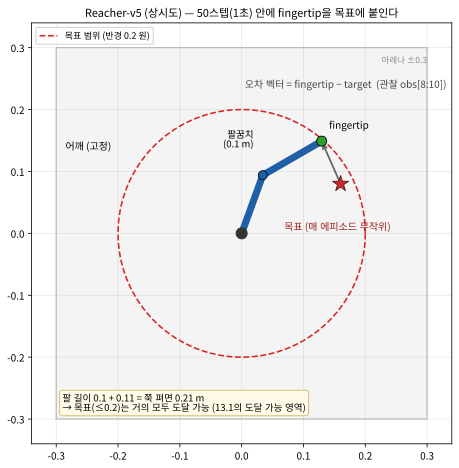

# 13.3 연속제어환경에 PPO 적용하기

[](https://colab.research.google.com/github/SuminHan/book-ml/blob/main/notebooks/ml2/chapter13_3_ppo_reacher.ipynb)

Chapter 11의 PPO[^ppo]는 이산 행동(softmax 정책)뿐 아니라 연속 행동에도
자연스럽게 확장된다 — 신경망이 각 행동 차원마다 정규분포의 평균과
표준편차를 출력하도록 하면 된다:

\\[\pi\_\theta(a|s) = \mathcal{N}(a; \mu\_\theta(s), \sigma\_\theta(s)^2)\\]

로그 확률 \\(\log \pi\_\theta(a|s)\\)은 정규분포의 확률밀도함수에서
바로 계산되며, Chapter 10.1의 로그미분 트릭과 Chapter 11.2의 클리핑
목적함수는 이산/연속 여부와 무관하게 형태가 그대로 유지된다 — "행동을
어떻게 파라미터화하는가"만 바뀔 뿐, 그 뒤의 최적화 기계는 동일하다는
것이 정책기반 방법의 큰 장점이다.

```python
import math

def gaussian_log_prob(action, mu, sigma):
    # 연속 행동에 대한 로그 확률 -- softmax 대신 정규분포를 쓴다는 점만 다르다
    return -0.5 * math.log(2 * math.pi * sigma**2) - (action - mu)**2 / (2 * sigma**2)
```

### Actor의 구조: 평균 헤드 + 전역 표준편차

실습에서 쓸 Actor(정책) 네트워크의 구조를 먼저 짚어두자:

![연속 행동공간 PPO의 Actor(정책) 구조 — 10차원 상태(관절각 cos/sin, 목표, 각속도, fingertip−target 오차벡터)가 64-64 트렁크를 거쳐 μ 헤드(tanh ×1.0, 행동 범위 [-1,1]로 평균을 맞춤)와 전역 log_std 파라미터가 합쳐져 2차원 가우시안 정책 π_θ(a|s)를 만들고, 샘플한 토크를 클립해서 Reacher-v5(MuJoCo, dt=0.02s)로 전달. ValueNet(Critic)은 같은 상태에서 V(s)를 추정해 GAE의 어드밴티지·리턴 목표를 계산](../../images/ch13_3_gaussian_policy_structure.svg)

세 부분으로 나뉜다. (1) **트렁크**(64-64 은층)가 10차원 상태를
처리한다 — Chapter 11.2의 Pendulum Actor와 같은 뼈대로, 입력 차원만
바뀌었다. (2) **μ 헤드**가 64차원 특징을 2차원 평균으로 바꾼다 —
출력을 `tanh`해서 1.0을 곱한 것에 주목하라: 평균을 행동 범위
\\([-1, 1]\\) 안에 가둬두면, 정책의 "중심"이 로봇이 낼 수 있는
범위를 벗어날 일이 없다. (3) **log_std 파라미터**가 표준편차를
담는다 — 여기서 \\(\sigma\_\theta\\)에 \\(s\\)가 붙지 않는 것이
가장 의외일 것이다: 표준편차는 상태별 함수가 아니라 **모든 상태에
공유되는 2차원 벡터** 하나다.

"왜 \\(\sigma\\)도 상태 함수(두 번째 헤드에서 \\(\log \sigma(s)\\)
출력)로 하지 않는가?" — 그렇게 할 수는 있지만, 표준 PPO
구현(11.2절 포함)은 전역 버전이 두 가지 이유에서 일반적이다.
첫째, **파라미터 경제성**: 상태별 \\(\sigma\\)는 64→2 출력 헤드가
하나 더 늘어나지만, 이득은 제한적이다 — "얼마나 대담하게 탐색할지"는
대부분의 제어 과업에서 *상태의* 성질보다 *과업 전체*의 성질이기
때문이다. 둘째, **안정성**: \\(\log \sigma\\)는 엔트로피 보상에
직접 들어가는 값이라(11.2절의 `-0.01 * d.entropy()`), 상태마다
\\(\sigma\\)가 들썩이면 엔트로피 항도 상태마다 들썩여 그래디언트를
불안정하게 만든다. "간단한 것부터, 안 되면서 복잡하게"라는 11.1절
클리핑 하이퍼파라미터 선택의 교훈이 또 한 번 등장하는 셈이다.

### 로그 확률의 함정: *밀도*의 로그이므로 양수일 수 있다

이산 행동(10.2절 softmax)에서는 정책이 유한 집합 위의 확률분포이므로
\\(\pi(a|s) \in [0, 1]\\)이고 \\(\log \pi(a|s) \le 0\\)이 항상
성립했다. 연속 행동에서는 이 직관이 **깨진다**:
\\(\pi\_\theta(a|s)\\)는 *확률*이 아니라 **확률밀도**인데, 밀도는
\\([0, 1]\\)로 묶이지 않고 얼마든지 1보다 커질 수 있다.
\\(\sigma\\)가 작으면 평균에서의 밀도가

\\[\frac{1}{\sigma\sqrt{2\pi}}\\]

로, \\(\sigma = 0.25\\)일 때 1.596, \\(\sigma = 0.1\\)일 때는
3.99까지 커진다. 즉 **로그 확률이 양수일 수 있다** — 실습 코드의
`Normal.log_prob`가 드물게 양수를 돌려주면 버그가 아니라 이 현상이다.


이 사실이 PPO에서 왜 중요한가? 클리핑 목적함수(11.2절)는 두 밀도의
**비**

\\[r\_t = \exp\big( \log \pi\_\text{new}(a|s) - \log
\pi\_\text{old}(a|s) \big)\\]

만 보므로, 로그 밀도의 *차이*를 취하는 순간 상수 항
\\(-\tfrac{1}{2}\log(2\pi\sigma^2)\\)가 서로 소거된다 — 로그 밀도가
양수이든 음수이든 무관하다. "목적함수의 구조가 행동 파라미터화에
무관하다"는 이 절 첫 문단의 주장이 식 수준에서 확인되는 순간이다.

그림 (b)와 함께, 표준편차 자체가 **학습 대상**이라는 점도 짚자.
단, \\(\sigma\\)를 *직접* 배우지 않고 **\\(\log \sigma\\)**(코드에서
의 `log_std`)를 배운다 — \\(\sigma = \exp(\log \sigma)\\) 한 줄이
\\(\sigma > 0\\)을 자동으로 보장해서, "0은 안 돼"를 후처리
(`relu`/`softplus`)로 강제할 필요가 없기 때문이다. 그림의
\\(\log \sigma \le 0\\) (즉 \\(\sigma \le 1\\)) 클램프는 왜 두는가 —
그 이유는 뒤의 "자주 하는 실수" 3번에서 열린다.

### Reacher-v5: "상태 10차원, 행동 2차원"의 내면

13.2절에서 Reacher의 공간 크기(상태 10, 행동 2)만 봤다면, 이번에는
각 차원이 *무엇*인지 열어보자. `Reacher-v5`[^gymnasium]는 링크 길이가
**0.1 m +
0.11 m**인 2관절 평면 로봇팔이다(팔 끝 fingertip는 팔꿈치 기준
0.11 m 더 이어져, 완전히 쭉 펴면 **0.21 m**까지 닿는다). 과제는
**50스텝(실시간 1초, dt = 0.02 s)** 안에 fingertip을 무작위로
생성된 목표 지점에 붙이는 것이다:



10차원 상태는 이렇게 놓여 있다(Gymnasium[^gymnasium] 소스 `reacher_v5.py`의
`_get_obs`):

| 인덱스 | 내용 | 의미 |
|---|---|---|
| obs[0:2] | \\(\cos\theta\_1, \cos\theta\_2\\) | 두 관절각의 코사인 |
| obs[2:4] | \\(\sin\theta\_1, \sin\theta\_2\\) | 두 관절각의 사인 |
| obs[4:6] | \\((x\_t, y\_t)\\) | 목표 지점 좌표 (m) |
| obs[6:8] | \\(\dot\theta\_1, \dot\theta\_2\\) | 두 관절의 각속도 (rad/s) |
| obs[8:10] | fingertip − target | fingertip에서 목표까지의 **오차 벡터** (m) |

이 표에서 세 가지를 읽자. (1) **각도를 그대로 주지 않고 (cos, sin)
쌍으로 준다** — \\(\theta\\)와 \\(\theta + 2\pi\\)는 물리적으로
같은 자세인데, 원래 각도 \\(\theta\\)는 \\(\pm\pi\\) 경계에서
숫자가 급격히 점프하는 *불연속* 특징이다. cos/sin은 매끄러운 주기함수라
신경망이 "같은 자세"를 같은 입력으로 본다. Pendulum이
(cos θ, sin θ, \\(\dot\theta\\))인 이유(Chapter 1, 11.2절)와 정확히
같은 설계 원칙 — **신경망이 다루기 쉬운 특징을 주자**. (2)
**환경이 "오차"를 obs[8:10]으로 직접 준다** — 아래 베이스라인의
1줄 규칙 `action = -k × obs[8:10]`이 바로 이 벡터를 쓰는 것이다.
(3) **목표 지점은 반경 0.2 m 원판 안에서 버림표본법(rejection
sampling)으로 놓인다**:

```python
# Reacher-v5 reset_model의 핵심 (Gymnasium 소스)
while True:
    self.goal = self.np_random.uniform(low=-0.2, high=0.2, size=2)
    if np.linalg.norm(self.goal) < 0.2:   # 반경 0.2 원판 안에 들어오면 채택
        break
```

왜 정확히 0.2인가? 팔이 쭉 펴도 0.21 m까지밖에 닿지 않으므로 —
13.1절의 "도달 가능 영역"(reachable workspace)에서 보았듯, 목표가
팔의 도달 범위를 넘으면 과업 자체가 *불가능*해진다. 0.2 < 0.21의
설계는 "거의 항상 닿을 수 있다"를 보장하면서, 간간히 닿기 어려운
목표가 나와 문제가 지나치게 쉬워지지는 않게 한다. (참고: 반경
\\(R\\)인 원판의 균등 지점이 *중심*으로부터 갖는 평균 거리는
\\(2R/3 \approx 0.133\\) m — 즉 목표는 평균적으로 원점 부근에
놓인다는 뜻이지, fingertip(원점에서 약 0.21 m)과의 평균 거리를
주지는 않는다.)

스텝당 보상은 두 항의 합이며, `info`에서 두 항을 따로 볼 수 있다:

\\[r = \underbrace{-1.0 \times \lVert p\_\text{tip} - p\_\text{target}
\rVert}\_\text{거리 항} \\;-\\; \underbrace{1.0 \times \lVert a \rVert^2}
\_\text{제어 비용}\\]

제어 비용의 가중치가 **1.0**이라는 점에 주의하라(문서 문자열
docstring에는 0.1이라고 적혀 있으나, 소스의 기본값은
`reward_control_weight=1`이다 — **문서와 코드가 다르면 코드가
맞다**, 이 분야에서는 자주 일어나는 일이다). 왜 "행동이 크면 벌을
주는" 항을 넣는가? 실물 로봇에서 큰 토크는 모터의 부담·발열·기계
마모이기 때문이다. **보상 함수는 공학적 제약이 수학으로 번역되는
장소**다 — 이 항을 무시한 정책은 시뮬레이션에서는 "자주 흔들어서
근접"하는 전략을 배울 수 있지만, 실물에서는 액추에이터를 고치는
정책이다.

### 베이스라인: 배우기 전에 네 가지 정책의 점수를 재라

PPO를 돌리기 전에, **학습을 전혀 쓰지 않는 정책**들의 리턴을
측정한다 — 13.1절의 PD vs RL 비교, 13.2절의 PD 그리드와 같은
"베이스라인을 먼저 재라"의 습관이다:

```python
import numpy as np
import gymnasium as gym

def evaluate(policy_fn, n_ep=10, seed0=100):
    env = gym.make("Reacher-v5"); rets = []
    for ep in range(n_ep):
        s, _ = env.reset(seed=seed0 + ep)
        tot = 0.0
        for _ in range(50):
            s, r, term, trunc, _ = env.step(policy_fn(s))
            tot += r
            if term or trunc:
                break
        rets.append(tot)
    env.close()
    return float(np.mean(rets))

env0 = gym.make("Reacher-v5")
print(f"무력(토크 0) 정책:       {evaluate(lambda s: np.zeros(2)):.2f}")
print(f"무작위 정책:             {evaluate(lambda s: env0.action_space.sample()):.2f}")
print(f"비례제어기 k=0.5:        {evaluate(lambda s: np.clip(-0.5 * s[8:10], -1, 1)):.2f}")
print(f"비례제어기 k=2.0:        {evaluate(lambda s: np.clip(-2.0 * s[8:10], -1, 1)):.2f}")
```

실행 결과(시드 42, 각 행당 10 에피소드 평균):

```
무력(토크 0) 정책:            -13.06
무작위 정책:              -44.34
비례제어기 k=0.5:          -9.32
비례제어기 k=2.0:         -14.57
```

이 네 수를 읽는 연습이 값지다. **무작위 ≈ −44.3**: 팔이 토크로
흔들리므로 거리 항이 "무력" 경우보다 나빠지고, 제어 비용까지
\\(50 \times E[\lVert a \rVert^2] \approx 50 \times \tfrac{2}{3}
\approx 33.3\\)이 쌓인다(\\([-1, 1]^2\\)의 균등행동에서
\\(\lVert a \rVert^2\\)의 평균은 차원당 \\(\tfrac{1}{3}\\)씩, 두
차원 합계 \\(\tfrac{2}{3}\\)) — 합계로 −40 부근과 일치한다.
**무력 −13.1**: 제어 비용이 0이라 초기 자세의 fingertip(원점에서
약 0.21 m)와 목표(반경 0.2 원판 안)의 거리만 남는 것으로,
스텝당 약 0.25 m × 50 ≈ −13과 맞는다. 그리고
**비례제어기 k=0.5(−9.3)가 k=2.0(−14.6)보다 낫다** — 이득이
*크면* 오히려 나빠진다. 왜? 미분 항이 없는 비례제어는 감쇠가
없어, \\(k\\)가 크면 목표점을 **과충격**(overshoot)해서 주위를
진동하게 되고, 진동할 때마다 \\(\lVert a \rVert^2\\) 벌(여기선
가중치 1.0이라 작지 않다)을 반복해서 낸다. 13.1절에서 진자
동역학으로 유도한 "PD 이득은 클수록 좋은 게 아니다"(\\(k\_p\\)
조건)가 2관절 팔에서도, *수식 없이 실험으로만* 같은 교훈을 주는
장면이다. **손으로 만든 1줄 규칙의 바(基準)는 −9.3** — RL이
"사람이 쓴 규칙을 이긴다"는 것을 보여주려면 이 선을 넘어야 한다.

### 실습: Reacher 로봇팔에서 PPO 학습시키기

Chapter 11.2의 Pendulum PPO 실습과 **완전히 같은 코드**
(`GaussianPolicy`, `ValueNet`, GAE[^gae], 클리핑 손실)를 이번 절에서
다룬 `Reacher-v5`(2관절 로봇팔이 목표에 끝을 맞추는 과제)에
그대로 적용해보자 — 환경 이름과 입출력 차원(10→2)만 바뀌고 알고리즘
코드는 한 줄도 안 바뀐다는 것이 정책기반 방법의 범용성을 다시 한번
보여준다. PPO가 Reacher 한 스텝에서 어떤 순서로 돌아가는지 아래
그림에 담았다:

[^ddpg][^trpo][^sac]


먼저 짧은 실행부터 — 100번의 반복(반복당 200 스텝, 총 2만 스텝,
시드 42, 스크래치패드에서 실행 검증):

```
무작위 정책:                         -44.34
손으로 만든 비례제어기 (k=0.5):        -9.32
PPO 2만 스텝 후 — 결정론적(μ만 출력): -11.92 (학습 전) → -12.14 (후)
PPO 2만 스텝 후 — 확률적(샘플링 포함): -42.60 (학습 전) → -52.51 (후)
```

2만 스텝에서는 PPO가 아직 "출발선"이다 — **배포 가능한** 정책인
결정론적(μ만 출력) 곡선은 거의 움직이지 않았고, 샘플링 노이즈가
탄 확률적 곡선은 오히려 나빠졌다. "PPO가 실패했나?"라고 생각하기
이른바: 연속 제어 과업은 11.2절에서 보았듯(Pendulum도 12만 스텝에
수렴하지 못했다) 짧은 예산으로는 "아직"이다. 다만 여기서 Pendulum
실습과 다른 점은, **두 곡선을 따로따로 봐서** 현상을 더 선명하게
읽을 수 있다는 것이다. 그래서 같은 코드를 100만 스텝
(1000 반복 × 1024 스텝, 시드 42, 로컬 실행 약 5분, 검증 완료)까지
늘렸다:

```
결정론적(μ만) 곡선:   -11.92 (학습 전) → -11.37 (마지막) — 중간에 -9 ~ -17 사이 변동
확률적(샘플링 포함) 곡선: -42.60 (학습 전) → -61.98 (마지막) — 계속 악화
최종 σ: [1.0, 1.0]  (클램프 상한에 고정됨)
```


그림에서 세 가지를 읽자. **(1) 결정론적 곡선이 손으로 만든
제어기(−9.3)와 같은 선상**이다 — 작은 네트워크(64-64)와 100만
스텝의 예산으로, PPO는 "1줄 규칙과 어깨를 나란히 하는" 팔을
배웠다. (2) **확률적 곡선은 계속 나빠진다** — 11.2절의 엔트로피
보상(`-0.01 * d.entropy()`)이 "큰 \\(\sigma\\)"을 계속 보상해서
\\(\sigma\\)를 1.0 클램프 상한까지 밀어올렸고, 그러면 *샘플링한*
에피소드는 노이즈로 가득 차 리턴이 악화된다. (3) **두 곡선은 같은
정책의 *다른 측면***이다 — 배포 대상인 평균 \\(\mu(s)\\)는
나아진 반면, 학습을 위한 *수단*인 노이즈 있는 샘플은 나빠진
것뿐이다.

### 배포하는 것은 무엇인가: 평균 μ(s), 샘플이 아니다

두 곡선 현상은 이번 절의 가장 중요한 교훈이라, 여기서 멈춰
볼 만하다. **탐색(exploration)과 활용(exploitation)은 다른
제품이다.** 학습 중에는 정책이 *다양한* 행동 집합을 샘플링해서
정보 있는 데이터를 모아야 하므로, 엔트로피 보상이 의도적으로
\\(\sigma\\)를 부풀리는 *것*이 맞다. 그러나 실물 로봇에 배포되는
산출물은 **결정론적 신호** \\(\mu(s)\\)다 — 로봇이 "σ=1인
정규분포에서 토크를 뽑아 클립한다"는 식으로 움직이는 일은
없다. Chapter 2의 \\(\varepsilon\\)-greedy와 같은 구조를 다시
보는 셈이다[^silvercourse]: 학습 중엔 \\(\varepsilon > 0\\)로 탐색, 평가할 땐
\\(\varepsilon = 0\\)(순수 greedy). 연속 정책에서 "greedy"가
되는 것이 곧 **평균만 출력**하는 것이다.

여기서 **학습된 정책을 평가하는 규칙**이 정해진다:

1. **별개의 환경 인스턴스**에서 돌리기(학습 루프의 상태를
   오염시키지 않게),
2. **\\(\mu\\)만** 출력하기(샘플링 안 함),
3. **고정된 시드 여러 개**(예: 10 에피소드)의 평균을 보고,
4. 확률적 곡선은 "탐색이 아직 얼마나 큰가"의 *진단 지표*로만
   참고하기.

실전 워크플로우는 "큰 \\(\sigma\\)로 학습 → 학습 말미에
\\(\sigma\\)를 줄인다(시감쇠, annealing)"거나, 배포 단계에서
샘플링을 그냥 끄고 \\(\mu\\)만 읽는 것이다. 13.1절의 sim-to-real
파이프라인에서 배포 산출물이 정확히 이 "물리 시뮬레이션 없는
순수 함수 \\(s \mapsto \mu(s)\\)"라는 점을 떠올려라 — 신경망
*자체*가 제어기가 되므로, 학습 중에만 존재하던 MuJoCo[^mujoco]를 실물
로봇에서는 빼버려도 된다.

### 역사적 일화: "같은 코드, 다른 환경"이 표준 레시피가 되기까지

이번 절의 "환경 이름만 바꿔도 된다"는 경험은 교육적 편의가 아니라,
심층 강화학습의 *산업 표준*이다. PPO 논문(Schulman et al., 2017)이
나올 때 실험 섹션은 **같은 PPO 코드로 MuJoCo 로봇 30여 종**(Walker2D,
Hopper, Ant, HalfCheetah, …)을 훈련시켜 그 표를 내는데, 이것이
연속제어 시대의 벤치마크 표가 됐다. "물리엔진 + PPO" 조합은 심층 RL
의 제어 능력을 처음 *검증 가능한* 형태로 만들었다 — 그전까지
"RL로 로봇을 제어한다"는 주장은 대부분 손으로 만든 예외였다.
그리고 "데이터를 병렬로 모은다"의 방향은 더 이르다 — 비동기적 방법 A3C[^a3c]가 "수많은 워커 프로세스가 트래젝터리를 병렬로 수집해 공유 정책망을 갱신한다"를 심층 강화학습의 표준 레시피로 만든 것이다.
바로 이 "알고리즘은 환경에서 분리된다"는 구조가, 2020~2021년
GPU 대량병렬 실험(OpenAI의 A1 사족보행 로봇 시연[^massivelyparallelrl], "하나의 GPU로
수천 개 환경"을 돌린 Isaac Gym[^isaacgym] 시대)을 가능하게 했다 — 알고리즘이
환경과 이렇게 깔끔하게 분리되지 않았다면, 그런 시스템을 *쓸 수
없이* 만드는 데도 그만큼의 시간이 걸렸을 것이다. 이 책의
14~16장도 같은 구조를 반복한다: **알고리즘은 고정, 환경만
바꾸는 것**.

### 자주 하는 실수

**1. 학습 중의 노이즈 있는 에피소드 리턴을 정책의 성능으로
판단하는 것.** 이번 절의 두 곡선 현상(확률적 곡선은 악화,
결정론적 곡선은 개선)은 오진(誤診)의 전형적인 원천이다:
"노이즈 에피소드"만 보면 "학습할수록 정책이 나빠졌다"고 결론 내리고
*구 weights*로 돌아가는 실수를 한다 — 그런데 *배포 가능한* 산출물
\\(\mu(s)\\)가 바로 좋아지고 있는 쪽이다. 규칙: **탐색을 위한
학습 곡선 ≠ 배포 품질 곡선**.

**2. PPO가 손으로 만든 제어기와 비슷해지면 "구현에 버그가 있다"고
의심하는 것.** 이번 실험에서 PPO(100만 스텝)는 −11.4 부근으로
끝나, 1줄 비례제어기(−9.3)와 대략 동급이다. "구현이 틀렸다"고
결론짓기 전에 이 순서로 점검하라: (1) **예산** — 로봇 과업에서
100만 스텝은 장난감이고, 논문들은 수백만~수천만 스텝을 쓴다,
(2) **구조적 우위** — 1줄 제어기는 "오차 벡터" obs[8:10]을 환경이
*공짜로* 줘서 쓰는데, PPO는 같은 매핑을 시행착오로 *배워야* 한다
— 작은 예산에서는 공짜 신호를 이기기 어렵다, (3) **σ 클램프** —
\\(\sigma\\)가 상한에 붙어 있으면 탐색 데이터의 질도 상한이
걸린다. 실전 프로젝트의 표준은 손으로 만든 제어기를 *베이스라인*으로
두고 RL이 그 위에 *추가*로 이득을 주는지 재는 것(13.1절의 구조)이다
— "동급"은 작은 예산에서의 *예상치*, 버그가 아니다.

**3. \\(\sigma\\) 상한을 두지 않고 내버려 두는 것.** Reacher의
행동 범위는 \\([-1, 1]\\)인데 클램프가 없으면 엔트로피 보상이
\\(\sigma\\)를 2, 3으로 밀어올리고, 그러면 **샘플의 상당 부분이
범위 밖으로 나가 `np.clip`에게 잘린다**. 이 순간 실제로 실행되는
행동의 분포는 정책 그래디언트(10.1절 로그미분 트릭)가 가정한
가우시안이 아니라 *잘려서 변형된* 분포가 된다 — 트릭의 전제("행동이
정책 분포에서 뽑혔다")가 깨지는 것이다. 클립은 "거의 발생하지
않아야" 정상 신호고, 클립 빈도가 높으면 \\(\sigma\\)(또는 μ 헤드의
스케일링)를 *줄여야* 하는 징후다.

### 자주 묻는 질문

**Q. 왜 같은 PPO 코드를 Pendulum과 Reacher에 그대로 쓸 수
있나요?**
PPO의 신경망 구조(`GaussianPolicy`, `ValueNet`)는 입력 차원(상태
차원)과 출력 차원(행동 차원)만 환경에 맞게 바뀌면 되고, 나머지
로직(GAE 계산, 클리핑 손실)은 상태·행동이 무엇을 의미하는지 전혀
몰라도 작동한다 — Chapter 9.1에서 배운 "함수근사"의 일반성이 여기서도
그대로 발휘된다. 이것이 심층강화학습이 다양한 로봇 문제에 재사용 가능한
이유다.

**Q. 학습 스텝을 늘리면 얼마나 더 좋아질까요?** 일반적으로 계속
개선되지만 수익 체감(diminishing returns)이 있다 — 처음 몇만 스텝은
"완전히 무작위" 상태에서 "그럴듯한" 상태로 빠르게 개선되지만, 그
이후 "그럴듯함"에서 "정교함"으로 가는 데는 훨씬 더 많은 스텝이
필요한 경우가 많다. 실전에서는 검증 곡선이 평평해지는 지점을 보고
학습을 멈추거나(Chapter 6(ML1)의 조기 종료와 같은 원리), 계산 예산
안에서 가능한 만큼 학습시킨다. 이번 절의 2만 → 100만 스텝 비교가
바로 그 "평평해지는 지점"을 확인하는 가장 작은 예다.

**Q. 학습 가능한 \\(\sigma\\) 대신 고정값(예: 0.1)을 써도
되나요?**
동작은 하지만 적응 장치를 하나 잃는다. 학습 가능한 \\(\sigma\\) +
엔트로피 보상의 역할은 "학습이 진행될수록 탐색을 *자동으로* 줄인다"
는 것 — 고정 \\(\sigma\\)는 "훈련 전체 기간에 맞는 값"을 사람이
미리 골라야 하는데, 그 값은 학습 전반부든 후반부에든 보통 틀린
값이다. 초기값은 행동 범위의 크기에 맞는 스케일(여기선
\\([-1, 1]\\) 범위에 \\(e^{-0.5} \approx 0.61\\))로 두는 것이
관행이다.

**Q. 왜 보상 속에 \\(-\lVert a \rVert^2\\) 항이 있나요?**
"큰 행동에 대한 벌" 그 이상의 역할이다 — 액추에이터의 에너지·발열·
마모라는 *공학적 제약*이 목적함수로 번역된 것이다. 이 항이 없으면
정책은 "고빈도·큰 진폭의 토크 진동"(fingertip을 더 빨리 이동시키는
방법)에 인센티브를 받아 그 전략을 *배우게* 되고, 시뮬레이션에서는
숫자일 뿐이지만
실물 로봇에서는 모터 과열·기계적 손상이 된다. 직접 로봇 과업을
만들 때는 **실물에서 "절대 일어나면 안 되는 것"부터 페널티 항으로
써라**.

**Q. Reacher는 종료(terminated)가 없어요 — GAE 계산에 영향이
있나요?**
없다. Reacher엔 "성공/실패 이벤트"가 없고, 에피소드는 시간 제한
(truncation, 50스텝)으로만 끝난다. GAE 코드(11.2절)의 `dones` 신호
가 에피소드 경계(last 처리)를 담당하므로, terminated/truncated의
구분(Chapter 3의 5-튜플 API)이 알고리즘을 바꾸지 않는다. 다만
CartPole처럼 *진짜* 종료(막대가 쓰러짐)가 있는 환경에서는 터미널
이후의 상태값이 0인 반면, Reacher의 "시간 제한 이후"는 여전히
정상 상태가 존재한다는 *미묘한* 차이가 있다 — 5-튜플 API가 이
차이를 표현하기 위해 존재하는 이유를 여기서 한 번 더 체감할 수
있다.

> **핵심 정리**: 연속 정책은 각 행동 차원마다 가우시안의
> (μ, σ)를 출력하는 것, 로그 확률은 *밀도*의 로그(양수 가능)다.
> 그 뒤의 모든 기계 — 로그미분 트릭, 클리핑, GAE — 는 그대로다.
> **배포 산출물은 결정론적 μ(s)**)이고, 노이즈 있는 샘플은 학습의
> *수단*이지 제품이 아니다 — 정책 평가는 μ로 한다. 로봇 과업에서
> PPO는 "환경 이름만 바뀐 같은 코드"이며, 손으로 만든 제어기는
> 경쟁자가 아니라 *베이스라인*이다.

**로봇 시뮬레이션은 지금까지 배운 알고리즘(DQN[^dqn], PPO)을 "실제 물리
법칙이 지배하는 연속 행동공간"이라는 더 현실적인 무대로 옮기는 시험대다
— 다음 장에서는 이 시뮬레이션을 더 정교한 물리엔진으로, 그리고 대규모
GPU 가속 환경으로 확장한다.**

이 주제를 더 깊이 다루는 자료: [^cs234]

---

## 연습문제

**1. (실습)** 위 베이스라인 코드를 그대로 실행한 뒤, 비례 이득
\\(k\\)를 두 배로 키워(k=1.0) 보고, 절반으로 줄여(k=0.25) 보고,
50스텝 누적 보상이 어떻게 달라지는지 비교하라. 이득이 너무 크거나
너무 작을 때 각각 어떤 문제가 생기는지(진동하는지, 반응이 느린지)
관찰한 바를, 보상의 두 항(거리, \\(\lVert a \rVert^2\\))으로
설명하라.

**2. (코딩)** 위 `gaussian_log_prob`(핵심 줄은 빈칸으로 남겨져 있다고
가정)을 완성하라:

```python
import math

def gaussian_log_prob(action, mu, sigma):
    # ADD ADDITIONAL CODE HERE!!
    # 정규분포 확률밀도함수의 로그: -0.5*log(2*pi*sigma^2) - (action-mu)^2/(2*sigma^2)

print(round(gaussian_log_prob(0.0, 0.0, 1.0), 4))   # 표준정규분포 x=0에서의 로그밀도, 약 -0.9189
print(round(gaussian_log_prob(2.0, 0.0, 1.0), 4))   # 평균에서 멀수록 로그확률이 더 작아짐(더 음수)
```

**3. (개념 서술)** 도메인 무작위화(domain randomization)[^domainrandomization]가 왜 ML1
Chapter 6의 정규화(regularization)와 비슷한 역할을 한다고 볼 수
있는지, "모델이 특정 조건 하나에 과적합하는 것을 막는다"는 관점에서
두세 문장으로 설명하라.

**4. (개념 서술)** 이번 절의 두 곡선 현상에서, *확률적* 학습 곡선이
나빠지는 동안 *결정론적* 곡선이 개선되는 이유를 한 문장으로 말하고,
"로봇에 배포될 정책의 품질"을 평가하는 올바른 척도가 결정론적 곡선
인 이유를 두세 문장으로 설명하라(힌트: 로봇이 실제로 받는 것은
샘플이 아니라 무엇인가? 탐색 노이즈의 *목적*은 무엇이었나?).

[^ppo]: Schulman, J. et al. (2017). "Proximal Policy Optimization Algorithms." arXiv:1707.06347.
[^gae]: Schulman, J. et al. (2015). "High-Dimensional Continuous Control Using Generalized Advantage Estimation." arXiv:1506.02438.
[^isaacgym]: Makoviychuk, V. et al. (2021). "Isaac Gym: High Performance GPU-Based Physics Simulation For Robot Learning." arXiv:2108.10470.
[^gymnasium]: Towers, M. et al. (2024). "Gymnasium: A Standard Interface for Reinforcement Learning Environments." arXiv:2407.17032.
[^cs234]: Stanford CS234: Reinforcement Learning. https://web.stanford.edu/class/cs234/
[^dqn]: Mnih, V. et al. (2015). "Human-level control through deep reinforcement learning." Nature 518, 529–533. (Earlier preprint: Mnih, V. et al. (2013). arXiv:1312.5602.)
[^domainrandomization]: Tobin, J. et al. (2017). "Domain Randomization for Transferring Deep Neural Networks from Simulation to the Real World." arXiv:1703.06907.
[^mujoco]: Todorov, E., Erez, T., Tassa, Y. (2012). "MuJoCo: A Physics Engine for Model-Based Control." 2012 IEEE/RSJ International Conference on Intelligent Robots and Systems (IROS).
[^ddpg]: Lillicrap, T. P., Hunt, J. J., Pritzel, A., Heess, N., Erez, T., Tassa, Y., Silver, D., Wierstra, D. (2015). "Continuous Control with Deep Reinforcement Learning." arXiv:1509.02971.
[^sac]: Haarnoja, T., Zhou, A., Abbeel, P., Levine, S. (2018). "Soft Actor-Critic: Off-Policy Maximum Entropy Deep Reinforcement Learning with a Stochastic Actor." arXiv:1801.01290.
[^trpo]: Schulman, J. et al. (2015). "Trust Region Policy Optimization." ICML 2015. arXiv:1502.05477.
[^silvercourse]: Silver, D. (2015). "UCL Course on Reinforcement Learning," Advanced Topics (COMPM050/COMPGI13) — 10개 강의 슬라이드(PDF) 및 영상 강의가 공개되어 있다. https://www.davidsilver.uk/teaching/ (본 장과 가장 직접적으로 겹치는 Lecture 9: Exploration and Exploitation — 47쪽, ε-greedy·멀티암 밴딧·컨텍스트 밴딧: https://davidstarsilver.wordpress.com/wp-content/uploads/2025/04/lecture-9-exploration-and-exploitation.pdf, CC-BY-NC 4.0).
[^a3c]: Mnih, V. et al. (2016). "Asynchronous Methods for Deep Reinforcement Learning." arXiv:1602.01783.
[^massivelyparallelrl]: Rudin, N., Hoeller, D., Reist, P., Hutter, M. (2021). "Learning to Walk in Minutes Using Massively Parallel Deep Reinforcement Learning." CoRL 2021. arXiv:2109.11978.
