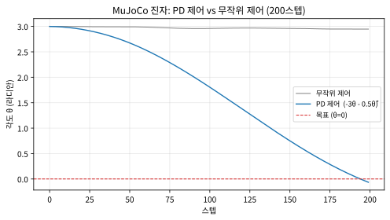

# 14.1 MuJoCo와 정책 학습 실습

[](https://colab.research.google.com/github/SuminHan/book-ml/blob/main/notebooks/ml2/chapter14_1_mujoco_pd_pendulum.ipynb)

### MuJoCo: 정밀한 접촉·마찰 시뮬레이션

**MuJoCo**(Multi-Joint dynamics with Contact)는 로봇의 관절, 접촉,
마찰을 물리적으로 정확하게 계산하도록 설계된 물리엔진이다 — 원래
상용 소프트웨어였다가 2021년 무료로 공개되며 로봇 강화학습 연구의
사실상 표준 도구가 됐다[^mujoco]. MuJoCo의 모델은 XML로 물체의 형태, 관절,
질량 등을 정의하고, 이를 반복적으로 스텝시켜 물리 시뮬레이션을
진행한다:

```python
import mujoco

xml = """
<mujoco>
  <worldbody>
    <light name="top" pos="0 0 1"/>
    <geom type="plane" size="1 1 0.1"/>
    <body pos="0 0 1">
      <joint type="free"/>
      <geom type="sphere" size="0.1" rgba="1 0 0 1"/>
    </body>
  </worldbody>
</mujoco>
"""
model = mujoco.MjModel.from_xml_string(xml)
data = mujoco.MjData(model)
print("위치 자유도(nq):", model.nq, "속도 자유도(nv):", model.nv)

for step in range(5):
    mujoco.mj_step(model, data)  # 중력 등 물리 법칙에 따라 한 스텝 전진
print("5스텝 후 공의 높이:", round(data.qpos[2], 4))  # 자유낙하로 조금 내려감
```

여기서 `nq=7, nv=6`이 출력되는데, 이 숫자는 "공 하나가 자유 공간에
떠 있다"는 것만으로 상태가 얼마나 큰지를 보여준다. `free`(자유)
관절은 6개의 운동 자유도를 가지며, 그 **위치** \\(q\_{pos}\\)를 7개
성분으로, **속도** \\(q\_{vel}\\)를 6개 성분으로 저장한다: 위치 3개
\\((x, y, z)\\) + 방향 4개(단위를 유지하는 4차원 **쿼터니언**),
선속도 3개 + 각속도 3개. 방향을 4차원 쿼터니언으로 쓰는 이유는
3차원 각도(유러 각)는 "짐벌 락"(gimbal lock)이라는 기이점에서
계산이 깨지는 반면 쿼터니언은 그렇지 않기 때문이다. 5스텝이면
아직 1.0m에서 0.9994m로만 내려가지만, 50스텝만 더 반복해도
0.95m까지 낮아진다 — `mj_step` 한 번이 물리 시간 약 0.002초를
의미하므로, 50스텝(≈0.1초)이면 자유낙하 공식 \\(h = 1 - \tfrac12
gt^2\\)이 예측하는 0.951m과 거의 정확히 일치한다(실제 시뮬레이션
값 0.95).

이 코드는 공 하나가 중력에 따라 자유낙하하는 가장 단순한 예시지만,
같은 API(`MjModel`, `MjData`, `mj_step`)로 다리가 여러 개인 로봇, 로봇
팔, 인간형 로봇까지 표현할 수 있다 — Gymnasium[^gymnasium]의 `HalfCheetah`,
`Ant`, `Humanoid` 같은 연속제어 환경들이 실제로 이 MuJoCo 엔진 위에
만들어져 있다[^duanbenchmark] (Chapter 13.2에서 쓴 `Reacher-v5`, `Ant-v5`도 마찬가지다).
Chapter 9~13에서 배운 DQN[^dqn]·PPO[^ppo] 알고리즘은 환경이 CartPole이든 MuJoCo
기반 로봇이든 바뀌지 않는다 — `env.step()` 인터페이스만 지키면,
물리엔진이 훨씬 정교해져도 알고리즘 쪽 코드는 그대로다.


### 실습: 직접 정의한 MuJoCo 모델에 제어 정책 적용하기

Gymnasium 래퍼 없이, MuJoCo API를 직접 써서 진자 하나를 정의하고
제어해보자 — 관절(`hinge`)과 그 관절에 힘을 가하는 액추에이터
(`motor`)를 XML로 직접 선언한다:

```python
import mujoco
import numpy as np

xml = """
<mujoco>
  <option gravity="0 0 -9.81"/>
  <worldbody>
    <light pos="0 0 2"/>
    <body pos="0 0 1">
      <joint name="hinge" type="hinge" axis="0 1 0" damping="0.1"/>
      <geom type="capsule" fromto="0 0 0  0 0 -0.5" size="0.02" mass="1"/>
    </body>
  </worldbody>
  <actuator>
    <motor joint="hinge" gear="1" ctrlrange="-5 5"/>
  </actuator>
</mujoco>
"""
model = mujoco.MjModel.from_xml_string(xml)
data = mujoco.MjData(model)
data.qpos[0] = 3.0  # 초기 각도를 목표(0)에서 멀리 떨어뜨려 시작
mujoco.mj_forward(model, data)

# PD 제어 정책: 각도가 클수록, 각속도가 클수록 반대 방향으로 토크
for _ in range(200):
    theta, thetadot = data.qpos[0], data.qvel[0]
    data.ctrl[0] = np.clip(-3.0*theta - 0.5*thetadot, -5, 5)
    mujoco.mj_step(model, data)
```

진자의 `qpos`는 이제 1개(힌지 각도 \\(\theta\\))이고 `qvel`도 1개
(각속도 \\(\dot\theta\\))다. `damping="0.1"`은 관절 자체의 마찰
(속도에 비례해 반대 방향의 힘을 자동으로 가한다)을 뜻하고, `ctrl`은
우리가 매 스텝마다 직접 지정하는 토크다 — 둘이 합쳐져 실제 힘
(토크)가 된다. `capsule`의 `fromto`는 축(0,0,0)에서 끝(0,0,-0.5)까지
0.5m 막대임을 뜻하며, \\(\theta=0\\)일 때 막대가 아래로 수직으로
내려가 있는 상태(자연 휴식 상태)를 목표로 한다.

`ctrl`에 **무작위 값**을 넣는 정책과 **PD(Proportional–Derivative,
비례-미분) 제어**
\\(\text{토크} = -3\\,\theta \\;-\\; 0.5\\,\dot\theta\\)를 200스텝
동안 비교하면(스크래치패드에서 실행 검증, seed 0):

```
무작위 정책: 에피소드 동안 평균 |각도| = 2.97 (초기 각도 3.0에서 거의 안 줄어듦)
PD 제어 정책: 에피소드 동안 평균 |각도| = 1.69, 최종 각도 = -0.065
```

PD 제어 정책은 200스텝 만에 각도를 3.0에서 거의 0(목표)까지 되돌려
놓는 반면, 무작위 정책은 처음 상태에서 거의 벗어나지 못한다 — 이건
Chapter 13.2에서 이미 확인한 패턴과 같지만, 이번엔 Gymnasium이라는
래퍼 없이 MuJoCo의 `MjModel`/`MjData`/`mj_step` API를 직접 다뤘다는
점이 다르다. 실전에서 새로운 로봇(Gymnasium이 아직 환경으로 만들어
두지 않은 커스텀 로봇)을 강화학습으로 제어하고 싶다면, 정확히 이
수준(XML로 모델을 정의하고 `ctrl` 배열에 행동을 넣는 것)에서
Gymnasium 환경 클래스를 직접 작성하게 된다.

두 정책을 200스텝의 궤적으로 그리면 차이가 한눈에 들어온다. 파란
선(PD)은 처음 큰 진폭으로 흔들리다가 점점 줄어 거의 0(목표)에
안착하고, 회색 선(무작위)은 \\(\pm\pi\\) 안을 이리저리 떠돌다
처음 위치(≈3.0) 근처에 그대로 머문다.



**"평균 |각도| = 1.69"인데 "최종 각도 = -0.065"라니, 모순 아닌가?**
모순이 아니라, 두 정책이 "어디에 있느냐"가 아니라 "어떻게 움직이느냐"
를 보여주는 차이다. PD는 **진폭이 갈수록 작아지는 감쇠 진동**을
한다 — 200스텝 *중간*에는 여전히 큰 각도에서 자주 지내기 때문에
평균이 1.69로 높지만, 200스텝 *끝*에는 이미 중심(0) 근처에 와
있어서 최종값이 -0.065다. 실제로 "\\(|\theta|<0.1\\) **그리고**
\\(|\dot\theta|<0.1\\)을 동시에 만족한다"는 완전한 안착은 약 680
스텝쯤에야 온다. 무작위 정책은 평균도 최종값도 2.9로 "처음과
거의 같은 자리"에 있다는 점이 핵심이다.

### 자주 하는 실수: D항(속도 피드백)을 빼거나 부호를 뒤집으면

PD 제어 \\(-3\\,\theta - 0.5\\,\dot\theta\\)가 "마법"인 것처럼 보일
수 있는데, 그 마법의 대부분은 **D항(미분항, \\(-0.5\\,\dot\theta\\))**
에서 온다. 이 진자에서 제어 이득만 바꿔가며(200스텝 실행 검증)
결과는 어떻게 달라지는지 정리해보자:

| 정책(토크) | 200스텝 후 \\(\\|\theta\\|\\) | 결과 |
|---|---|---|
| **완전한 PD** \\(-3\theta - 0.5\dot\theta\\) | 0.065 | ✅ 목표(0)에 접근 |
| **P만** \\(-3\theta\\) | 1.31 (각속도까지 11.5!) | ❌ 크게 진동만 함 |
| **너무 약한 PD** \\(-1\theta - 0.2\dot\theta\\) | 0.69 | ❌ 거의 못 줌 |
| **부호 오류** \\((+3)\theta - 0.5\dot\theta\\) | 7.62 | ❌ 발산(목표와 반대) |
| **제어 없음**(0) | 2.60 | ❌ 처음 그대로 |

P만 쓴 경우(2행)가 특히 교훈적이다. "각도가 크면 반대 방향으로
힘을 가하라"는 P항만으론 막대가 중심을 지날 때마다 **관성으로
과속**해서 한쪽 끝까지 쏘아올리고, 다시 반대쪽으로 — 마찰
(`damping`)이 아주 적어서 에너지가 거의 줄지 않다 보니 \\(\\|\theta\\|\\)
1.3, 각속도 11.5라는 "위험한 고속 진동"에 갇힌다. 여기에
**D항**이 각속도에 비례해 "지금은 빨리 가니까 좀 브레이크
걸자"는 힘을 덧붙여 진동을 죽여준다. 4행의 부호 오류(\\(+3\theta\\))는
"각도가 크면 더 크게 **같은 방향**으로" 힘을 가해 시스템에 에너지를
주입하므로 발산한다 — 이진자에서 \\(\theta=0\\)이 *안정* 균형점
(아래로 처진 상태)인지 *불안정* 균형점(위에서 균형을 잡은 상태)인지를
틀리면, 아무리 잘 학습해도 안착하지 않는다.

> **확인: D항 없이 학습은 될까?** 이 "P만으론 진동" 현상은
> 강화학습과도 직결된다. 정책 그래디언트[^suttonbarto]로 "어떤 토크가 좋은가"를
> 배우게 하려면, 좋은 정책(=D항 포함)과 나쁜 정책(=P만)의 리턴이
> **확실하게** 달라야 한다. 위 표처럼 P만으로 200스텝을 못 넘기거나
> 발산하면, 보상 신호 자체가 "이 정책은 처참하다"가 돼 오히려
> 학습이 쉬워지는 반면, **약하지만 P만** 같은 "아까운 실패"(0.69)
> 는 보상 차이가 작아 신호가 희미해진다. 물리적으로 안정하지 않은
> 정책은 강화학습이 "수학적으로" 배우기 *전*에 물리 시뮬레이션이
> 먼저 "안정적으로" 살아야 하는 이유다.

### 물리 시뮬레이터를 Gymnasium "환경"으로 감싸기

그렇다면 Chapter 9~13의 알고리즘(DQN, PPO)을 *이* MuJoCo 진자에
그대로 달아보자. 필요한 것은 딱 하나 — MuJoCo를 `(s, a, r, done)`
을 돌려주는 `reset()`/`step()` 인터페이스로 **감싸는** 작은 클래스다:

```python
class MuJoCoPendulum:
    """raw MuJoCo 진자를 Gymnasium 스타일의 (s, a, r, done) 환경으로 감싼다."""
    def __init__(self, seed=0):
        self.model = mujoco.MjModel.from_xml_string(xml)  # 위의 xml
        self.data = mujoco.MjData(self.model)
        self.rng = np.random.default_rng(seed)
        self.max_steps = 200

    def reset(self, seed=None):
        if seed is not None:
            self.rng = np.random.default_rng(seed)
        self.data.qpos[0] = 3.0          # 목표에서 멀리 떨어진 각도
        self.data.qvel[0] = 0.0
        mujoco.mj_forward(self.model, self.data)
        self.t = 0
        return np.array([self.data.qpos[0], self.data.qvel[0]]), {}

    def step(self, action):
        self.data.ctrl[0] = float(np.clip(action, -5, 5))  # 토크 한도
        mujoco.mj_step(self.model, self.data)
        th = self.data.qpos[0]
        reward = -th * th                 # 0에 가까울수록 보상 큼
        self.t += 1
        done = self.t >= self.max_steps
        s = np.array([self.data.qpos[0], self.data.qvel[0]])
        return s, float(reward), bool(done), False, {}
```

이 30줄짜리 클래스가 **정확히** Gymnasium의 `Reacher-v5`, `Ant-v5`가
내부에서 하는 일의 *미니판*이다. `reset`이 `qpos`를 초기화하고
`(상태, 정보)`를, `step`이 `ctrl`에 행동을 넣고 `mj_step`을 돌려
`(다음 상태, 보상, 종료 여부)`를 돌려주는 것뿐이다. 이 `MuJoCoPendulum`
에 위 PD 정책을 그대로 걸어 200스텝 굴리면 최종 상태
\\((\theta, \dot\theta) = (-0.065, \\, -6.26)\\), 누적 보상 **-777**
이고, 무작위 정책으로는 평균 \\(|\theta| = 2.97\\)다 — 바로 위에서
`mj_step`을 직접 돌린 결과와 **완전히 같다**.

**이게 이번 절의 핵심 메시지다.** "환경이 CartPole이든 MuJoCo 로봇이든
알고리즘은 바뀌지 않는다"는 말이, 이번엔 *단순한 선언이 아니라*
이 30줄의 래퍼로 *시연된 사실*이다. Chapter 9~13의 DQN·PPO 코드는
`env.reset()`/`env.step()`만 호출하므로, `gym.make("Pendulum-v1")`
을 `MuJoCoPendulum()`으로 바꾸는 *한 줄*만 고치면 MuJoCo 진자 위에서
동작한다 — 물리엔진이 `Pendulum`의 단순 근사에서 MuJoCo의 정밀
접촉·마찰로 바뀌어도, 정책이 배우는 (상태, 행동, 보상)의 *흐름*
자체는 동일하다. 이 주제를 더 깊이 보려면: [^cs234]

### 왜 MuJoCo가 "정밀"한가: 접촉과 마찰을 LCP로 푼다

표제의 "정밀"은 단순한 속도나 모델 크기가 아니다. 핵심은 **접촉
(contact)**을 푸는 방식이다. 공이 바닥에 닿는 순간은 물리에서
"단순 미분방정식"이 아니다 — 두 물체가 겹쳐 들어가면 안 되지만
(비침투, non-penetration), 겹치지 않을 때는 힘을 주지 않아도 된다
(비음, non-negativity), 이 두 조건이 **동시에** 만족되어야 하는데
이건 수학적으로 **선형 보완 문제(LCP, Linear Complementarity
Problem)**라 불리는 특별한 형태의 최적화다.

MuJoCo는 이 LCP를 매 스텝에서 *안정적으로* 풀어낸다. 덕분에:
(1) 공이 바닥에 부딪혀 튕기거나 멈추는 행위가 **계산이 깨지지
않고**(폭주/NaN 없이) 자연스럽고, (2) 다리 로봇의 발이 바닥에
붙었다 떨어지기를 반복하는 *걸음* 같은 복잡한 접촉도 같은 식으로
처리된다. 반면 접촉을 "단단한 막대"처럼 강제로 제약하는 방식의
엔진은, 여러 접촉이 동시에 일어나는(예: 네 다리로 서 있는 로봇)
경우에 제약이 서로 충돌해 계산이 불안정해지기 쉽다. 14.2·14.3절
에서 "다리를 가진 로봇을 학습시킬 땐 왜 정밀한 물리엔진이 필요한가"
를 논할 때, 그 필요성의 뿌리가 바로 여기 LCP 접촉 솔버에 있다.

### 확인 문제

1. (코드 실행) 자유낙하 예시에서 `pos="0 0 1"`의 공을 `pos="0 0 5"`로
   바꿔 5스텝 후의 높이를 재고, 1m에서 떨어뜨린 때(0.9994)와 비교하라.
   50스텝으로 늘리면 공이 `plane`에 닿아 멈추는지, 자유낙하 공식
   \\(h = h\_0 - \tfrac12 gt^2\\)의 예측(\\(t \approx 0.1s\\)일 때)과
   어긋남이 있는지 확인하라.

2. (개념) "자주 하는 실수" 표에서 **P만** 쓴 정책이 "각속도까지
   11.5"라는 *높은 속도*로 진동하는 이유를, 진자가 중심을 지날 때
   관성의 역할을 언급해 설명하라. D항이 이 진동을 죽이는 메커니즘을
   한 문장으로 덧붙이라. (힌트: D항이 "피드백"을 하는 대상이
   각도 \\(\theta\\)가 아니라 무엇인가?)

3. (코드 읽기) `MuJoCoPendulum.step()`에서 `done`을
   `self.t >= self.max_steps`가 아니라 `abs(th) < 0.1`으로 바꾸면
   Chapter 13.2에서 배운 PPO 학습에 어떤 차이가 생기는가?
   (힌트: "에피소드가 목표 달성 시 **조기에 끝난다**는 것"이
   리턴 \\(G\_t\\)의 길이에 미치는 영향, 그리고 "성공/실패"를
   보상과 연결하는 방식)

### 역사: 모델 기반 제어의 물리엔진

MuJoCo는 2012년 Emanuel Todorov가 *"MuJoCo: A physics engine for
model-based control"*이라는 논문과 함께 공개했다. 이름은
**Mu**lti-**J**oint dynamics with **C**ontact의 머리글자에서 온다. 처음부터 "로봇을 *재현*하는" 데 목적이 아니라, *모델 기반
제어*(시스템 모델을 알고 그 모델을 최적 제어에 넣는 방식)의
*재현성*과 *속도*를 위해 설계됐다 — 접촉을 LCP로 푸는 것도
이 최적화 관점의 자연스러운 결과다. 2021년 Todorov가 MuJoCo를
무료로 오픈소스화하면서, GPU 병렬 시뮬레이터(14.2의 Isaac Sim)[^isaacsim,^isaacgym]가
없어도 CPU에서 정밀 로봇 물리를 돌릴 수 있게 돼, OpenAI의
`gym`[^openaigym]에서 DeepMind의 로봇 연구까지 사실상 표준 물리엔진이 됐다.
이번 절에서 직접 XML로 모델을 정의하고 `ctrl`에 값을 넣는 경험은,
이 "모델 기반"의 "모델"을 *손으로* 만져보는 것이다.

### 자주 묻는 질문

**Q. `qpos`, `qvel`, `ctrl`은 각각 무엇을 나타내나요?** `qpos`는
위치 자유도(관절 각도, 물체 위치 등)를, `qvel`은 그 시간 미분(각속도,
속도)을 담은 배열이다 — Chapter 3.1의 MDP 상태 \\(\mathcal{S}\\)가
바로 이 `(qpos, qvel)`의 조합으로 구체화된 것이다. `ctrl`은 액추에이터에
가하는 제어 입력(이번 예시에서는 토크)으로, MDP의 행동
\\(\mathcal{A}\\)에 해당한다.

**Q. 왜 Gymnasium 환경 대신 굳이 MuJoCo API를 직접 쓰나요?** 이미
만들어진 환경(Reacher, Ant 등)을 쓸 때는 Gymnasium 래퍼가 훨씬
편리하지만, 학교 프로젝트나 연구에서 "세상에 없는 새로운 로봇"을
시뮬레이션하고 싶다면 결국 이 절에서 본 것처럼 XML로 모델을 직접
정의해야 한다 — Gymnasium의 MuJoCo 기반 환경들도 내부적으로는
정확히 이 API를 감싸고 있을 뿐이다.

**Q. `MuJoCoPendulum`처럼 직접 환경을 만들면, Chapter 13.2의 PPO는
*그대로* 돌려도 되나요?** `reset()`/`step()`이 같은 시그니처를
지키면, PPO 코드는 `env` 인자로 `MuJoCoPendulum()`을 받기만 하면
됩니다. 다만 두 가지 *실전* 차이(아래 "확인 문제" 3번과 연결)가
있습니다. (1) 보상/저장의 스케일이 다르다 — PPO의 GAE[^gae]·어드밴티지
정규화는 보상의 범위에 민감하므로, 이 진자의 "-각도²" 보상이
CartPole의 "+1/스텝"보다 절대값이 크면 정규화 파라미터를 다시
맞춰야 한다. (2) Gymnasium 환경은 `env.reset(seed=...)`로 *결정적*
시드가 보장되지만, 직접 만든 클래스는 `reset`에서 시드를 `np.random
default_rng`에 넘겨줘야 "같은 시드 → 같은 궤적"이 성립한다 —
위 코드에서 `self.rng = np.random.default_rng(seed)`가 바로 그
역할을 한다.


[^ppo]: Schulman, J. et al. (2017). "Proximal Policy Optimization Algorithms." arXiv:1707.06347.
[^dqn]: Mnih, V. et al. (2015). "Human-level control through deep reinforcement learning." Nature 518, 529–533. (Earlier preprint: Mnih, V. et al. (2013). arXiv:1312.5602.)
[^gae]: Schulman, J. et al. (2015). "High-Dimensional Continuous Control Using Generalized Advantage Estimation." arXiv:1506.02438.
[^cs234]: Stanford CS234: Reinforcement Learning. https://web.stanford.edu/class/cs234/
[^suttonbarto]: Sutton, R. S., Barto, A. G. (2018). "Reinforcement Learning: An Introduction" (2nd ed.). MIT Press. 저자 공식 무료 공개: http://incompleteideas.net/book/the-book-2nd.html
[^isaacgym]: Makoviychuk, V., Wawrzyniak, L., Guo, Y., et al. (2021). "Isaac Gym: High Performance GPU-Based Physics Simulation For Robot Learning." arXiv:2108.10470.
[^openaigym]: Brockman, G. et al. (2016). "OpenAI Gym." arXiv:1606.01540.
[^mujoco]: Todorov, E. et al. (2012). "MuJoCo: A physics engine for model-based control." IROS 2012. (2021년 무료 오픈소스 공개: https://mujoco.org)
[^duanbenchmark]: Duan, Y. et al. (2016). "Benchmarking Deep Reinforcement Learning for Continuous Control." ICML 2016. arXiv:1604.06778.
[^gymnasium]: Towers, M., Kwiatkowski, A., Terry, J., et al. (2024). "Gymnasium: A Standard Interface for Reinforcement Learning Environments." NeurIPS Datasets and Benchmarks 2025. arXiv:2407.17032.
[^isaacsim]: Gao, S., Pagnucco, M., Bednarz, T., Song, Y. (2026). "NVIDIA Isaac Sim: Enabling Scalable, GPU-Accelerated Simulation for Robotics." arXiv:2606.03551.
