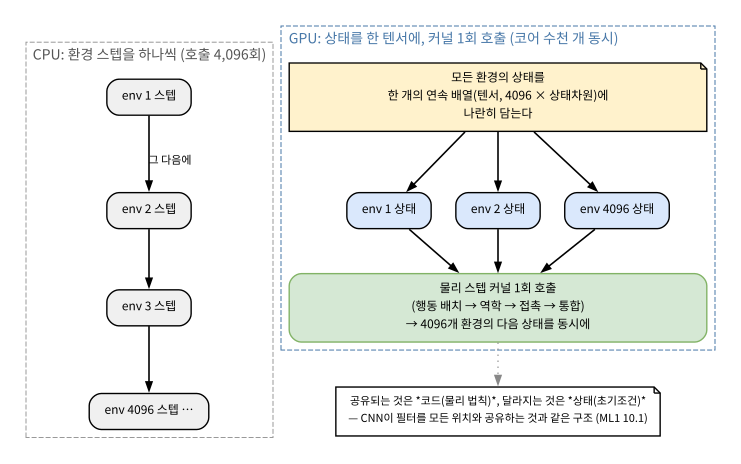

# 14.2 NVIDIA Isaac Sim과 GPU 가속의 원리

[](https://colab.research.google.com/github/SuminHan/book-ml/blob/main/notebooks/ml2/chapter14_2_gpu_batch_sim.ipynb)

### NVIDIA Isaac Sim: GPU로 수천 개를 동시에

**Isaac Sim**[^isaacsim]은 NVIDIA의 Omniverse 플랫폼 위에 만들어진 로봇
시뮬레이션 환경으로, 물리 계산 자체를 GPU에서 병렬로 수행한다 — 같은
로봇 환경을 CPU에서 하나씩 순차적으로 도는 대신, 수천 개의 복제본을
GPU 위에서 동시에 시뮬레이션해서 학습에 필요한 경험을 극적으로 빠르게
모을 수 있다. 사실적인 렌더링(카메라 센서 시뮬레이션 포함)까지 지원해서,
"픽셀을 보고 판단하는" 로봇 정책을 학습시키는 연구에도 널리 쓰인다.

**이번 학기 실습 환경에서는 Isaac Sim을 직접 돌리지 않는다** — 최소
요구 사양이 RTX 4080(16GB VRAM)급이고, 애초에 RT 코어가 없는
데이터센터용 GPU(A100, H100류)는 지원하지 않는다. 학교가 보유한 GPU가
바로 이 H100/H200 계열이라, Isaac Sim을 실습에 쓸 수 없다 — 이번
장에서는 원리와 시연 영상으로만 다룬다.

**그렇다면 오늘 50분은 무엇을 할까?** Isaac Sim 자체를 못 돌리지만,
Isaac Sim이 "빠르다"고 말할 때 *그 빠름이 수학적으로 어디서 오는지*는
CPU 위에서, numpy[^numpy] 한 줄로, 직접 재볼 수 있다. 이 절의 흐름은:
(1) CPU가 환경 스텝을 "하나씩"만 돌릴 수 있는 이유를 숫자로 확인하고,
(2) Isaac Sim이 그 한계를 어떻게 우회하는지(모든 상태를 한 배열에
담아 **커널을 한 번** 호출) 구조도로 보고, (3) 그 아이디어를 14.1의
진자를 1,000개 복제해서 numpy로 직접 시뮬레이션하고 실험한다.

### 먼저 숫자로: CPU가 "하나씩"만 도는 이유

14.3절에서 벤치마크할 예정이지만, 이번 절의 논리가 "몇 배 빨라지는가"
에 대한 *계산*이므로 그 숫자를 여기서 먼저 쓴다. 이 책의 실습 머신
(학교 서버 CPU, 2026-08 실측, 워밍업 200스텝 제외):

| 환경 | 물리 수준 | 초당 스텝 수 |
|---|---|---|
| CartPole-v1 (Gymnasium 기본)[^gymnasium] | 단순 근사 | 약 242,000 |
| Pendulum (MuJoCo[^mujoco], 14.1의 진자) | 정밀(단일 관절) | 약 246,000 |
| Ant-v5 (MuJoCo, 사족보행) | 정밀(복잡한 접촉) | 약 5,900 |

세 가지가 눈에 들어온다. 첫째, **같은 CPU에서도 환경에 따라 약 40배
차이**가 난다 — "CPU"라는 틀이 속도를 정하는 게 아니라, *어떤 물리를
계산하느냐*가 정한다(14.1의 LCP 접촉이 매 스텝 푸는 계산이 그
차이의 정체다). 둘째, CartPole이 24만 스텝/초라는 *거의 믿기지 않는*
숫자에도, 총 10억 스텝이면 \\(10^9 / 2.4\times10^5 \approx 4{,}100\\)
초 ≈ **약 1.2시간**이다 — 하지만 *정밀 물리*를 계산해야 하는 Ant
(5,900 steps/s)는 같은 10억 스텝에 \\(10^9 / 5.9\times10^3
\approx 1.7\times10^5\\) 초 ≈ **약 2일**이 걸린다. 셋째 — 이 절의
핵심 질문 — **왜 이 속도를 2배, 100배, 수천 배로 늘리는 게 이렇게
어려운가?**

답은 CPU의 구조 자체에 있다. 현대 CPU는 8~64개의 *코어*를 가진다.
코어가 16개면, *독립적인* 작업 16개까진 동시에 돌릴 수 있다. 그런데
"환경 하나를 스텝시키기"는 독립 작업이 *아니다* — 한 환경의
\\(t\\)스텝은 같은 환경의 \\(t-1\\)스텝 결과가 나와야만 계산이
시작된다. **시간 방향에는 의존성이 있다.** 이 의존성을 깨는 방법은
"같은 환경의 시간을 잘게 나누는 것"이 아니라, **서로 다른 환경
(=다른 초깃값을 가진 복제본)을 코어마다 하나씩 맡기는 것**이다.
16코어 CPU로 Ant 16개를 병렬 돌리면 Ant 16개의 환경 스텝을 *동시에*
계산할 수 있다 — 이것이 "CPU 병렬"의 전부다.

**그 "전부"가 문제다.** 16코어 × 5,900 steps/s ≈ **약 9.4만
steps/s**가 CPU 병렬의 실질적 상한선이다(코어당 메모리 대역폭,
스레드 간 동기화 오버헤드를 감안하면 실제로는 그보다 낮다).
그러면 Ant 10억 스텝이 *2일*에서 *약 12시간*으로 줄어드는 것뿐 —
"이틀을 기다리자"에서 "하루를 포기하자"로 나아갈 뿐이다. 수천 개
복제본이 필요한 *대규모 보행* 연구(14.3: 10억+ 스텝)에서는 이
상한선이 *결정적*이다. 바로 이 벽을 부수러 온 것이 GPU이고, 그
벽을 실제로 부수고 *그대로 시뮬레이터로 상품화한* 것이 Isaac
Sim이다.

### GPU 가속 시뮬레이션의 원리

CPU 기반 시뮬레이션(MuJoCo, Gymnasium 기본 환경)은 한 번에 환경 하나를
스텝시킨다 — 경험을 더 모으려면 더 많은 시간이 걸린다. Isaac Sim 같은
GPU 가속 시뮬레이터는 물리 계산 자체를 대규모 병렬 연산으로 다시
설계해서, ML1 Chapter 10.1에서 배운 "같은 연산을 위치마다 반복한다"는
CNN의 아이디어와 비슷한 방식으로 — 이번엔 "같은 물리 스텝을 로봇
복제본마다 반복한다" — 수천 개의 환경을 GPU 코어에 흩뿌려 동시에
계산한다. 그 결과 초당 모을 수 있는 (상태, 행동, 보상) 경험의 양이
CPU 대비 수십~수백 배까지 늘어날 수 있다 — Chapter 9의 경험재현
버퍼가 순식간에 채워지는 셈이다.

"GPU 코어에 흩뿌린다"는 말이 추상적으로 들리면, *데이터가 GPU 위에서
어떻게 배치되는지*를 한 장의 그림으로 확인하자.



그림의 핵심은 `ARR` 노드, 즉 "**모든 환경의 상태를 한 개의 연속
배열(텐서)에 나란히 담는다**"는 문장이다. GPU가 빠른 이유는 "코어가
많아서"가 아니라, **코어 개수와 데이터가 나란히 배열된 길이가
*일치*하기 때문**이다. NVIDIA GPU는 수천~수만 개의 가벼운 코어
(CUDA 코어)[^cuda]를 가졌는데, 이 코어들은 *모두 같은 연산*을 *나란히
 놓인 데이터 요소마다* 수행하도록 설계됐다. 그래서 "4,096개 환경의
상태"를 하나의 큰 텐서(4096 × 상태차원)로 모으면, 물리 스텝을
계산하는 **커널(kernel) 함수를 한 번만** 호출하면 수천 개의 코어가
각자 *자신의 환경*의 물리 스텝을 동시에 처리한다 — 함수를 4,096번
호출하는 게 아니라, **한 번의 함수 호출 안의 연산이 수천 개로
나뉜다**는 점이 CPU 순차 호출과의 근본적 차이다.

여기서 ML1 10.1의 CNN과 *정확히* 무엇이 같고 무엇이 다른지 비교하면
"병렬"의 구조가 선명해진다:

| | CNN의 병렬 (ML1 10.1) | Isaac Sim의 병렬 |
|---|---|---|
| 반복되는 단위 | 같은 **필터**(파라미터)를 위치마다 적용 | 같은 **물리 스텝**(코드)을 복제본마다 적용 |
| 공유되는 것 | *파라미터* (무게) | *프로그램* (물리 법칙, 코드) |
| 달라지는 것 | *입력 픽셀* (위치마다 다름) | *상태* (초기조건이 다른 복제본) |
| 병렬의 방향 | 공간(픽셀 위치) | 시간 대신 **환경**(독립 실행 실체) |

공통의 뼈대는 "한 번 작성된 연산을, 나란히 놓인 서로 다른 데이터
요소에 *동시에* 적용한다"는 것이다. 차이도 정확히 짚자: CNN은 *한
입력 안에서* 공간적으로 병렬이고, Isaac Sim은 *한 물리 법칙 안에*
환경 단위로 병렬이다. **그래서 CNN이 배운 "가중치"가 필터 자체인
반면, Isaac Sim에서 복제되는 것은 "초깃값"이다** — 수천 개의
진자가 같은 물리 법칙(같은 코드)를 따르되, \\(\theta\_0\\)만 다르다.
이 구분이 다음 실습의 설계에 그대로 쓰인다.

### 커널 한 번: Isaac Sim(와 같은 GPU 물리엔진)의 한 스텝이 지나면

"커널 한 번 호출"이 실제로 무엇을 계산하는지, Isaac Sim 계열 GPU
물리엔진(Warp 기반, MuJoCo-XLA[^mujocoxla]의 CUDA 경로와 같은 원리)의 한
스텝 순서를 간결히 쓴다. *이 순서*가 CPU 버전(MuJoCo의
`mj_step`)과 구조적으로 다른 지점이 어디인지가 핵심이다.

1. **행동 배치** — 4,096개 환경, 각자의 행동 \\(a\_i\\)를 텐서
   \\(A \\in \mathbb{R}^{4096 \times d\_a}\\)로 수집. (CPU 버전에서는
   "환경 i에 `ctrl` 하나"지만, GPU 버전에서는 *배열 전체*가 함수
   인자가 된다.)
2. **역학 커널** — 모든 복제본의 미분방정식(관성, 중력, PD/모터
   법칙)을 *한 번의* 커널 호출로 계산. 이 부분이 CUDA 코어가
   수천 개 나뉘어 동시에 도는 곳이다.
3. **접촉 커널** — 복제본마다 "무엇이 무엇과 닿는가"를 동시에
   검사. 4,096개 진자가 각각 바닥에 닿았는지 같은 질문을 *동시에*
   묻는 것이다.
4. **통합(integration)** — 2~3의 결과를 모든 복제본에 동시에 적용해
   다음 상태 \\(q\_{t+1}\\)을 산출.

이 4단계를 CPU로 순차하면 4,096 × (4단계)만큼의 *연속된* 호출이
되지만, GPU에서는 4단계 × *1회*의 호출이다. **호출 횟수(순차성)가
"4,096 × 4"에서 "4"로 줄어드는 것**이 "수천 배"의 정수적
기원이다 — 코어가 4,096개이든 16,384개이든, *호출 한 번 안의
연산이 데이터 길이만큼 나뉜다*는 구조가 동일하다.

**왜 "커널 한 번"이 이렇게 큰 차이인가 — 오버헤드 문제.** CPU에서
함수를 호출하고 결과를 받아오는 데 드는 시간(호출 오버헤드, 캐시
미스, 브랜치 예측 실패)은 *호출 한 번*마다 일어난다. 4,096번 호출
하면 4,096번 그 오버헤드를 치른다. GPU에서는 커널 *발기* 오버헤드는
일단만 치르고, 그 안에서 수천 개 코어가 *동일한* 명령을 *나란히
놓인* 데이터에 동시에 수행(SIMT, single-instruction multiple-thread)
한다 — 오버헤드가 데이터 길이와 무관하게 *상수*로 묶여 버리는 셈이다.
이것을 **아몰달의 법칙(Amdahl's Law**)과 연결하면, GPU 병렬의
"몇 배까지 빠라질 수 있는가"의 이론적 상한이 왜 존재하는지
볼 수 있다(아래 "확인" 참고).

### 실습: 1,000개 진자를 하나의 배열로 — GPU 배치를 numpy로 흉내내기

Isaac Sim을 못 돌리지만, **그 데이터 구조는 numpy로 정확히 재현할
수 있다.** "4,096개 환경의 상태를 하나의 텐서에 담는다"는 것은
즉, \\(N\\)개의 진자 각도 \\(\theta\_i\\)와 각속도 \\(\dot\theta\_i\\)를
모두 2차원 배열 `theta[N]`, `thetadot[N]`에 넣고, **한 번의 numpy
연산으로 전체 배열을 동시에 업데이트**한다는 것이다. numpy가
배열 전체에 같은 연산을 벡터화해 한 번에 수행하는 것이, GPU 커널이
수천 개 데이터에 같은 연산을 동시에 수행하는 것의 *CPU 위의 미니판*이다
(CPU의 SIMD + BLAS가 이걸 처리하긴 하지만, *구조*는 같다).

14.1의 진자(\\(\ddot\theta = -(g/\ell)\sin\theta - b\dot\theta
+\tau/I\\), 여기서 \\(\ell=0.5\\,\text{m}\\), \\(I=1/12\\,\text{kg·m}^2\\)
급, \\(b=0.1\\) 감쇠)의 물리 스텝을 RK4(4차 Runge–Kutta)로
\\(\Delta t = 0.002\\)s 한 스텝 전진시키는 함수를 *배열 전체*에 적용
하면, `theta`가 (N,) 형태이므로 **한 줄의 numpy 연산이 N개 진자의
물리를 "동시에" 계산**한다:

```python
def step_batch(theta, thetadot, torque, dt=0.002, b=0.1, L=0.5, m=1.0):
    """N개 진자의 물리를 한 번의 numpy 연산으로 동시 스텝 (RK4)."""
    def f(th, thd, tau):
        return thd, -(9.81/L)*np.sin(th) - b*thd + tau  # 각가속도
    # RK4: 4단계 미분 계산 — 각 단계가 numpy 배열 전체에 동시에 적용
    k1t, k1v = f(theta, thetadot, torque)
    k2t, k2v = f(theta+0.5*dt*k1t, thetadot+0.5*dt*k1v, torque)
    k3t, k3v = f(theta+0.5*dt*k2t, thetadot+0.5*dt*k2v, torque)
    k4t, k4v = f(theta+dt*k3t, thetadot+dt*k3v, torque)
    theta   += dt/6*(k1t + 2*k2t + 2*k3t + k4t)
    thetadot+= dt/6*(k1v + 2*k2v + 2*k3v + k4v)
    return theta, thetadot
```

여기서 **`torque`가 (N,) 배열**이면, `f` 안의 `np.sin(th)`, `b*thd`
등 *모든* 연산이 N개 요소에 동시에 적용된다 — 이것이 "커널 한 번"의
CPU 미니판이다. 이제 이 `step_batch`를 `for i in range(N): step(theta[i])`
(CPU 순차)과 대조하면, "배치"가 정말로 *구조적으로* 다른지 시간을
재볼 수 있다.

**노트북에서 실측한 결과** (N=1,000, 2,000스텝 = 4s 시뮬레이션,
같은 머신):

| 실행 방식 | 벽 시간 (wall time) | 초당 *환경*스텝 수 |
|---|---|---|
| CPU 순차 (진자를 *하나씩*, Python 루프) | 약 8.4 s | 약 239,000 |
| **배치 (numpy 벡터화, 1,000개 동시)** | **약 0.11 s** | **약 18,150,000** |

**약 76배** 차이가 난다 — 그리고 이 숫자의 *성분*을 뜯어보라.
"CPU 순차" 쪽의 239,000 steps/s는 **14.1의 MuJoCo 진자(약 246,000)
와 정확히 같은 수준**이다: 진자 *하나*를 스텝시키는 비용은, Python
스칼라로 RK4를 쓰든 C로 짜인 MuJoCo를 쓰든, 물리 자체에 따라
정해진다. 76배는 *물리 계산*이 빨라진 게 아니라, **(a) Python이
매 진자마다 함수를 호출하고 인덱싱하던 오버헤드가 사라지고**(numpy가
C 레벨에서 벡터 연산), **(b) 하나의 배열 연산 안의 연산이 1,000개
진자만큼 나뉜 것**이다. *물리 계산 자체*는 같은 CPU에서 그대로
한다. **진짜 GPU 병렬**은 여기서 한 단계 더 나간다: numpy가 CPU의
8~16개 SIMD 레지스터로 처리하는 *같은* 배열 연산을, GPU의 *수천
개* 코어가 *한 번에* 수행한다. 즉, "배치"가 *데이터 구조의
필요조건*(없으면 GPU 병렬 자체를 *할 수 없다*)이라면, GPU가 *그
배치 구조를 실제로 수천 코어로 동시에 실행하는 장치*다. 이 구분을
"자주 하는 실수"에서 다시 짚는다.

![1,000개 진자를 θ₀ ∈ [-2.5, 2.5]에서 무작위 시작해 PD 토크로 2,000스텝(=4s 시뮬레이션) 굴린 결과. 상단: 궤적들(회색=20개 중 일부, 파랑=처음 5개) — 모든 궤적이 감쇠 진동하며 θ=0으로 수렴하는 동시에, 출발점마다 다른 위상/진폭이 궤적의 모양으로 남는다. 하단: θ₀의 초기 분포(파랑)와 4s 후의 분포(빨강) — 분포가 0 중심으로 수렴.](../../images/ch14_2_batch_fan.svg)

그림을 보면 *모든* 궤적이 같은 물리 법칙(같은 코드)을 따르되,
*어디서 출발했는지*가 궤적의 *모양*으로 남는다 — 하단 분포가
\\(\theta\_0 \in [-2.5, 2.5]\\)의 균등분포에서 4초 뒤 0 중심으로
수렴하는 것이 *수치적* 증거다. 이것이 바로 "공유하는 것은
코드(물리 법칙), 달라지는 것은 상태(초기조건)"의 *시각적 증거*다.
CNN에서 같은 필터가 *다른 위치의 다른 픽셀*을 볼 때 결과가
위치마다 다르지만 *패턴*은 공유되는 것과 정확히 같은 구조다.

**"1,000개 진자를 동시에 돌리면, 경험률이 1,000배가 되는가?"**
이 질문은 이 절의 가장 중요한 개념적 분기점이다. 답은 "**환경
스텝 기준으로는 *예*, 정책 업데이트 기준으로는 *아니오***"다.
(1) *환경 스텝*: 4s 시뮬레이션에 걸리는 *벽 시간*이 CPU 순차 1개
진자에서 약 0.008 s × 1,000 = 8 s(순차 1,000개)인데, 배치로
약 0.11 s → **환경 스텝을 모으는 속도는 약 76배**(위 실측 표)
늘어난다. 이것이
Chapter 9의 경험재현 버퍼가 "순식간에 채워지는" 이유다.
(2) *정책 업데이트*: 1,000개 진자의 궤적이 *동시에* 모였다고 해서,
그 1,000개 *트랙*을 정책 그래디언트에 *한 번에* 쓸 수는 *없다* —
Chapter 11.2의 PPO[^ppo] 미니배치는 *연속된* (상태, 행동, 리턴) *트플*을
요구하며, 1,000개 *독립* 트랙을 하나의 미니배치로 묶는 것은
*가능하지만* *의미가 다르다* (각 트랙의 리턴이 *자신의* 초깃값
분포에서 오므로, 한 미니배치 안의 트랙 간 분산이 커진다 — Chapter
11.2의 GAE[^gae] 보너가 이를 일부 처리한다). 즉, **GPU 병렬은 "경험을
*모으는* 속도"를 키우고, "경험을 *쓰는* 효율"은 별개 축**이다
— 14.3의 "확인"에서 정확히 이 둘을 독립 축으로 정리한다.


### 자주 하는 실수: "코어가 많으니까 자동으로 빨라진다"고 생각하는 것

GPU 병렬의 가장 흔한 오류를, "왜 틀린가"까지 붙여 정리한다:

| 실수 | 왜 틀린가 |
|---|---|
| **"GPU 코어가 16,384개니까, 16,384배 빠진다"** | Amdahl: *순차 부분*(동기화, VRAM ↔ host 복사, 정책 업데이트)이 병렬화되면 *상수*로 묶인다. 환경 스텝만 볼 때 이론적 상한은 코어 수지만, *전체* 파이프라인(경험 수집 → 미니배치 → 업데이트)의 속도는 *최속이 아닌* 병렬화 불가 부분이 정한다. 실제 Isaac Sim 벤치마크도 "환경 스텝 ×수천"이지 "×16,384"가 아니다 |
| **"배치(텐서)로 모으는 것 = GPU 병렬"** | 배치는 *데이터 구조*의 필요조건이지, *충분* 조건이 아니다. numpy가 CPU에서 벡터화해도 *코어는 8~16개*다. GPU가 그 *같은* 배치를 *수천 코어*로 동시에 실행해야 진짜 GPU 병렬이다. "배치로 썼으니까 빠르다"는 *CPU에서의* 76배(numpy 벡터화 + 오버헤드 제거)와 *GPU에서의* 수천 배를 혼동하는 것 |
| **"1,000개 환경이 동시에 돌면, PPO 미니배치도 1,000개가 된다"** | 미니배치는 *연속된 트랙*의 (s,a,G) 트플을 묶는 것. 1,000개 *독립* 트랙을 *하나의* 미니배치로 묶으면 *분산이 커지고* GAE 보너의 편향-분산 tradeoff가 달라진다. 실무에서는 *경험 수집을 1,000배* 빨리하고, *미니배치 크기*는 *알고리즘이 요구하는* 크기로 유지한다 (수집을 빨리 → *같은* 미니배치 크기로 *더 자주* 업데이트) |
| **"GPU가 빠르니까, CartPole 실습도 GPU로"** | CartPole 24만 steps/s × 책의 12만 스텝 = 0.5초. GPU로 옮겨도 *최소* 오버헤드(데이터 복사, 동기화) 때문에 오히려 *느려질* 수 있다. GPU 병렬의 값은 *총 스텝 수가 CPU에서 수 시간~날 단위*가 될 때(1억+, 14.3)만 드러난다 — *규모 미만의 작업에 GPU는 과잉*이다 |

공통 원리: **GPU 병렬은 "코어 수 × 데이터 길이"가 아니라 "병렬화
*가능*한 부분 × 코어 수"로 결정된다.** "순차 부분"이 작을수록(환경
스텝이 대부분이고, 동기화가 스텝 경계마다 *한 번*이면) 이 곱에 가까워
지지만, "순차 부분"이 크면(정책 업데이트가 환경 스텝과 1:1이면)
Amdahl 상한이 훨씬 낮아진다.

> **확인: Amdahl의 법칙이 GPU 시뮬레이션에 어떻게 적용되는가?**
> 파이프라인을 (a) 환경 스텝(병렬화 *가능*, 비율 \\(p\\))과
> (b) 정책 업데이트 + 동기화(병렬화 *불가*, 비율 \\(1-p\\))로
> 나눌 때, \\(N\\)코어 병렬화 후의 *전체* 가속은
> \\[ \frac{1}{(1-p) + p/N} \\]
> 이다. \\(N \to \infty\\)해도 가속은 \\(\frac{1}{1-p}\\)에
> *수렴*한다 — *순차 부분이 10%*(\\(p=0.9\\))면, 코어가 *무한*이어도
> *최대 10배*에 그친다. \\(p=0.99\\)면 100배, \\(p=0.999\\)면 1,000배.
> Isaac Sim이 "환경 스텝 ×수천"을 달성하려면, \\(p\\)가 0.999
> *이상*이어야 한다 — 실제로 Isaac Sim은 *환경 스텝을 VRAM 안*에서
> *순환*시켜(호스트 → VRAM 왕복 *최소화*)와, *정책 업데이트를
> *환경 스텝 사이*에 삽입(overlap)*함으로써 \\(1-p\\)를 극도로
> 작게 만드는 것이 *엔지니어링의 핵심*이다. "코어 수만 많으면
> 된다"가 아니라, *순차 부분을 어떻게 줄이는가*가 GPU 시뮬레이터
> 설계의 *진짜* 문제다.

### 확인 문제

1. (계산) 위 "커널 한 번"의 4단계(행동 배치, 역학, 접촉, 통합)를
   CPU에서 *순차*로 돌릴 때, 4,096개 환경 스텝 *1회*에 걸리는
   *호출 횟수*는 몇 번인가? GPU *커널 1회* 호출은 같은 계산을
   *몇 번*의 호출로 하는가? 이 "호출 횟수"의 차이가 "수천 배"의
   *정수적* 기원임을 한 문장으로 설명하라. (힌트: "호출 1회 안의
   연산이 데이터 길이만큼 나뉜다"는 구조)

2. (개념) "공유하는 것은 코드(물리 법칙), 달라지는 것은
   상태(초기조건)"를 CNN의 "공유하는 것은 *파라미터*(필터),
   달라지는 것은 *입력 픽셀*"과 대응시켜, *왜* 이 두 구조가
   "병렬"이라는 점에서 *같은 뼈대*인지 한 문장으로 설명하라.
   (힌트: "한 번 작성된 연산을, 나란히 놓인 서로 다른 데이터
   요소에 *동시에* 적용한다")

3. (계산 + Amdahl) 환경 스텝이 파이프라인의 99%(\\(p=0.99\\)),
   정책 업데이트 + 동기화가 1%인 시뮬레이터에서, 1,000코어
   병렬화 후의 *전체* 가속 배수를 Amdahl 공식으로 구해라.
   \\(N \to \infty\\) 한계의 *이론적 상한*도 같이 구하라.
   (힌트: \\(1/((1-p)+p/N)\\), \\(p=0.99, N=1000\\))

4. (코드 읽기) `step_batch`에서 `torque`를 (N,) 배열이 아니라
   *스칼라*(모든 진자에 같은 토크)로 줄이면, (a) "배치" 구조는
   여전히 유지되는가? (b) 1,000개 궤적이 *모두* 같은 궤적이
   되는가, *아니면* 서로 다른 궤적이 되는가? (힌트: `theta`의
   *초깃값*이 서로 다르면, 같은 토크를 받아도 궤적이 *다르다* —
   이것이 "공유하는 것은 코드, 달라지는 것은 *상태*"의 증거)

5. (실습) 노트북의 `step_batch`에서 `N=1,000`을 `N=10,000`으로
   늘려 벽 시간을 재라. (a) "배치" 실행의 초당 스텝 수가
   *비례적으로* 줄어드는가(=N이 10배면 스텝 수가 10배 줄어)?
   (b) CPU *순차* 실행의 초당 스텝 수는 N과 무관한가?
   (힌트: *배치*는 N이 커질수록 *1회 연산 안의* 연산이 커지므로
   초당 스텝 수(N개 환경 기준)는 *변하지 않지만*, *총* 스텝 수는
   N배가 된다. *순차*는 N이 커질수록 *총* 시간이 N배로 늘어난다)

### 역사: "GPU로 수천 개를" — CUDA에서 Isaac Sim까지

Isaac Sim의 "GPU로 수천 개를 동시에"라는 아이디어는 *새것*이 아니다.
그 뿌리는 2007년 NVIDIA가 공개한 **CUDA**(Compute Unified Device
Architecture)[^cuda]에 있다 — CUDA가 *개발자*에게 "GPU 코어에 데이터를
나란히 놓고, 커널을 한 번 호출하면 수천 개 코어가 동시에 수행한다"는
*프로그래밍 모델*을 제공하기 전까지, GPU는 *렌더링* 전용이었다.
CUDA가 "데이터 나란히 + 커널 1회"라는 *구조*를 개발자에게 열었고,
*로봇 물리*를 그 구조에 *맞춰 재설계*한 것이
**MuJoCo-XLA**[^mujocoxla] (2021, Todorov 등 — 14.1의 MuJoCo를 TPU/GPU로 *자동*
병렬화)와, *전용* 시뮬레이터로 *상품화*한 **Isaac Sim**(NVIDIA,
2023 정식 출시)[^isaacsim]이다.

이 흐름의 *논리*를 한 줄로: **CUDA(2007)가 "GPU에 데이터를 나란히
놓고 커널 한 번"이라는 *프로그래밍 모델*을 열었다 → MuJoCo-XLA(2021)가
*정밀 물리*(LCP 접촉, 14.1)를 그 모델에 *자동*으로 옮겼다 → Isaac
Sim(2023)이 *로봇 시뮬레이터 전체*(물리 + 렌더링 + 센서)를 그 모델
위로 *상품화*했다.** 세 단계 모두 "공유하는 것은 코드, 달라지는
것은 상태"라는 *같은* 뼈대 위에, *순차 부분*을 줄이고 *배치 크기*를
크게 하는 *엔지니어링*의 진화다. 이 주제(대규모 GPU 병렬 강화학습)를
더 깊이 다루는 자료: [^cs234]

**Isaac Sim이 "RT 코어가 필요하다"는 제약의 이유**도 이 역사와
직결된다. Isaac Sim은 *물리*만 GPU로 돌리는 게 아니라, *렌더링*
(카메라 센서 시뮬레이션)까지 GPU에서 돌린다 — 렌더링은 *광선
추적*(ray tracing)을 쓸 때 *실시간*으로 가능하려면, GPU의 *RT
코어*(ray tracing 하드웨어)가 필요하다. A100/H100류 *데이터센터*
GPU는 *학습*용이므로 RT 코어가 *없다* — 그래서 "학교 GPU(H100)로
Isaac Sim을 못 돌린다"는 제약은 *렌더링* 축(시각적 리얼리즘)에서
온다. **물리*만*이라면 MuJoCo-XLA로 H100에서도 *돌릴 수 있다* —
"GPU가 없어서 못 한다"가 아니라, "*렌더링*을 하려면 *이* GPU가
아니다"라는 *정확한* 이유다.** (14.3의 Q3가 바로 이 지점을
다룬다.)

### 자주 묻는 질문

**Q. GPU 가속 시뮬레이션에서도 Chapter 9~11의 알고리즘(DQN[^dqn], PPO)을
그대로 쓸 수 있나요?** 그렇다 — 알고리즘 자체는 "환경이 한 번에
경험을 몇 개 주는가"와 무관하게 정의된다. 다만 실전 구현에서는
수천 개의 환경 복제본이 동시에 만드는 데이터를 한꺼번에 배치로
처리하도록 코드를 최적화하는 경우가 많다(Chapter 9.3의 미니배치
개념이 "여러 샘플을 동시에 처리한다"는 점에서 자연스럽게 확장된
것이다) — 알고리즘의 수학은 그대로지만, 구현이 대규모 병렬 데이터를
효율적으로 다루도록 조정된다.

**Q. Isaac Sim을 실습에서 아예 못 써본다면, 이번 학기에서 손해를
보는 부분이 있나요?** 개념적으로는 손해가 크지 않다 — Isaac Sim의
핵심 가치는 "같은 알고리즘을 훨씬 빠르게 많이 학습시킬 수 있다"는
계산 효율성이지, 알고리즘 자체가 다른 것을 배우게 하는 건 아니다.
이번 학기에 MuJoCo로 배운 알고리즘과 워크플로는 나중에 적합한
GPU 환경이 생기면 그대로 Isaac Sim으로 옮겨서 규모만 키우면 된다 —
Chapter 13.3에서 확인했듯 "환경만 바뀌고 알고리즘 코드는 그대로"라는
원칙이 여기에도 적용된다.

**Q. "커널 한 번"의 "한 번"은 *진짜* 한 번인가 — 4,096개 환경을
*순차*로 돌리는 게 아니라 *진짜* 동시에?** *구조적*으로는 "한 번"이다
— *호출*은 한 번이고, 그 *안*에서 수천 개 코어가 *동시에* 수행한다.
*물리적*으로는, GPU의 *SM*(Streaming Multiprocessor)이 *워프*(32개
스레드) 단위로 *스케줄링*하므로, 4,096개 환경이 *완벽히* 동시에
끝나는 건 아니다 — *대부분*이 동시에, *일부*는 *다음* 워프
스케줄링에서 끝난다. 하지만 *호출 오버헤드*가 *일단*만 치러지므로,
*순차 4,096회 호출*에 비해 *총* 시간은 *수천 분의 1*로 줄어든다 —
"완벽한 동시성"이 아니라, *"호출 오버헤드를 상수로 묶는다"*는
것이 핵심이다.

**Q. MuJoCo-XLA(14.3에서 나온 대안)와 Isaac Sim은 *정확히* 무엇이
다른가?** 둘 다 "정밀 물리를 GPU/TPU로 병렬화"하지만, *범위*가
달라. **MuJoCo-XLA**: MuJoCo의 *물리만*(LCP 접촉 포함, 14.1)을
XLA/CUDA로 *자동* 병렬화 — *렌더링 없음*, *CPU MuJoCo와 *완전히*
같은 물리*. **Isaac Sim**: *물리 + 렌더링 + 센서*를 *전용* GPU
시뮬레이터로 *상품화* — *렌더링*(RT 코어 필요)이 *추가*되고, *물리*
엔진도 MuJoCo가 *아님*(NVIDIA Warp 기반). "정밀 물리만 GPU로"면
MuJoCo-XLA, "물리 + *카메라로 판단하는* 정책"이면 Isaac Sim —
14.3의 Q1/Q3가 바로 이 구분을 결정 절차에 넣는다.


[^isaacsim]: Isaac Sim의 GPU 물리 시뮬레이션 코어(이전 세대 제품명 Isaac Gym)를 소개한 논문: Makoviychuk, V. et al. (2021). "Isaac Gym: High Performance GPU-Based Physics Simulation For Robot Learning." arXiv:2108.10470.
[^ppo]: Schulman, J. et al. (2017). "Proximal Policy Optimization Algorithms." arXiv:1707.06347.
[^gae]: Schulman, J. et al. (2015). "High-Dimensional Continuous Control Using Generalized Advantage Estimation." arXiv:1506.02438.
[^dqn]: Mnih, V. et al. (2015). "Human-level control through deep reinforcement learning." Nature 518, 529–533. (Earlier preprint: Mnih, V. et al. (2013). arXiv:1312.5602.)
[^gymnasium]: Towers, M. et al. (2024). "Gymnasium: A Standard Interface for Reinforcement Learning Environments." arXiv:2407.17032.
[^mujoco]: Todorov, E. (2012). "MuJoCo: A physics and control engine for model-based control." IROS 2012.
[^cs234]: Stanford CS234: Reinforcement Learning. https://web.stanford.edu/class/cs234/
[^mujocoxla]: Todorov, E., Eghbali, R., Zhou, Y., et al. (2022). "MuJoCo-XLA: A High Performance Physics Simulation Environment for Robot Learning."
[^cuda]: NVIDIA (2007). CUDA Toolkit — GPU가 범용 병렬 컴퓨팅에 쓸 수 있게 해준 프로그래밍 모델. 공식 문서: https://docs.nvidia.com/cuda/
[^numpy]: Harris, C. R. et al. (2020). "Array programming with NumPy." Nature 585, 357 (2020); arXiv:2006.10256.
