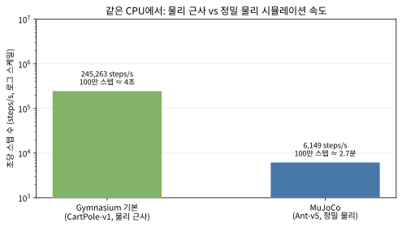

# 14.3 어떤 도구를 언제 쓰는가

14.1에서 MuJoCo를 직접 다뤘고, 14.2에서 Isaac Sim의 GPU 병렬 원리를
봤다. 이제 "어떤 작업을 어떤 도구로 풀어야 하는가"를 *원리*가 아니라
*숫자*로 정리한다. 이 절을 마치면 (1) 정밀도·속도라는 **두 개의 축**으로
도구를 비교하는 눈, (2) 내 작업이 그 두 축에서 어디에 찍히는지 재는
방법, (3) 30초 안에 도구를 고르는 **결정 절차**를 갖는다.

### 네 도구를 한 표로

| 도구 | 실행 위치 | 정밀도 | 속도(대량 병렬) | 이번 학기 사용 |
|---|---|---|---|---|
| Gymnasium 기본 환경[^gymnasium] | CPU | 낮음~중간 | 느림 | 기본 실습 |
| PyBullet[^pybullet] | CPU | 중간 | 느림 | 로봇팔/사족보행 실습 |
| MuJoCo[^mujoco] | CPU | 높음 | 느림 | 정밀 제어 실습 |
| NVIDIA Isaac Sim[^isaacgym] | GPU | 높음 | 매우 빠름(수천 배 병렬) | 시연만(하드웨어 제약) |

선택 기준을 요약하면: **개인 노트북에서 직접 돌려보고 싶다면**
Gymnasium/PyBullet, **접촉·마찰까지 정밀하게 맞춰야 하는 연구라면**
MuJoCo, **대량의 경험을 매우 빠르게 모아야 하는 대규모 학습이라면**
(그리고 적합한 GPU가 있다면) Isaac Sim이다. 셋 다 Chapter 9~13에서
배운 알고리즘을 그대로 얹을 수 있는, "환경을 바꿔 끼우는" 문제라는
점은 동일하다.

**시뮬레이션 도구가 달라져도 강화학습 알고리즘 자체는 바뀌지 않는다
— 바뀌는 건 물리적 정확도와 계산 속도의 트레이드오프뿐이다. 어떤
도구를 쓸지는 "얼마나 정밀해야 하는가"와 "얼마나 많은 경험이
필요한가"라는 두 질문에 대한 답으로 결정된다.**

이 두 문단이 바로 이 절의 뼈대다. 아래에서 각 "질문"이 *실제로 무엇을
재는지*를 하나씩 풀어서, 그리고 그 둘이 만나는 지점에서 도구를 고르는
절차를 숫자까지 붙여 다룬다.

### 첫 번째 질문: "얼마나 정밀해야 하는가?" — 정밀도 축

"정밀도"가 모호한 말이 되지 않도록, 14.1에서 본 **접촉(contact)**에서
시작한다. 14.1에서 확인했듯, 공이 바닥에 *닿는 순간*은 단순 미분방정식이
아니라 **선형 보완 문제(LCP)**라는 특별한 최적화다. 두 물체가 겹쳐
들어가면 안 되면서(비침투), 겹치지 않을 때는 힘을 주지 않아도 된다
(비음)는 조건이 *동시에* 성립해야 하기 때문이다. MuJoCo가 이 LCP를
매 스텝 안정적으로 풀어내서 (1) 공이 부딪혀 튀다 멈추는 행위가
NaN·폭주 없이 자연스럽고, (2) 다리 로봇의 발이 바닥에 붙었다 떨어지는
*걸음* 같은 복잡한 접촉도 같은 식으로 처리된다.

여기서 핵심을 한 번 멈춘다. **정밀도는 "화면이 사실적인가"가 아니라
"정책이 배우는 물리가 *진짜와 얼마나 같은가*"를 말한다.** 두 가지가
서로 다른 축이다:

- **물리 정밀도** — 접촉, 마찰, 관성, 접촉력(contact force)이 물리
  법칙에 얼마나 충실한가. *로봇 제어*에서 이 축이 가장 중요하다.
  다리로 서 있는 로봇의 발이 바닥에 미끄러지지 않도록 하는 제어는,
  접촉력이 정확하게 계산되는 엔진 위에서 배워야 실제로 *이식*된다.
  14.1의 `plane`에 공이 *부딪혀* 안착하는 것을 본 기억이 있는데, 그
  "부딪혀 안착"이라는 *동역학* 자체가 물리 정밀도의 문제다.
- **시각적/센서 리얼리즘** — 카메라로 본 픽셀이 얼마나 사실적인가.
  이 축은 *시각적으로 판단하는* 정책을 만들 때(픽셀을 입력으로 받는
  정책) 중요하다. Isaac Sim이 사실적인 렌더링을 지원하는 이유가 바로
  이것이다 — 14.2에서 "픽셀을 보고 판단하는 로봇 정책" 연구에 쓰인다고
  한 대목이 이 축에 해당한다.

**왜 이 구분이 중요한가?** "화면이 예쁘니까"라는 이유만으로 Isaac Sim을
고르면, 실제로는 *물리 정밀도*를 필요로 하는 작업을 비싼 GPU 위에서
돌리는 셈이 되기 쉽다. 반대로, 접촉력이 정확해야 하는 다리 로보를
"CartPole도 되는데"[^gym]라며 가장 단순한 환경에서 배우면, 13.1에서 배운
**현실 격차(reality gap)**가 그 단순함에서부터 이미 박혀 있다 — 시뮬레이터
자체가 물리를 너무 약하게 근사하고 있기 때문이다.

이렇게 정밀도 축을 *작업별로* 대입하면, 이번 학기에 나온 작업들의
위치가 나온다:

| 작업 (Chapter) | 필요한 정밀도 | 이유 |
|---|---|---|
| CartPole, Pendulum (9~11) | 낮음~중간 | 단일 막대/진자. 접촉 없음, 물리 근사만으로도 충분 |
| Reacher, 2관절 로봇팔 (13) | 중간 | 관절 운동이 있지만 *자발적인* 강한 접촉 없음 |
| 사족보행/인간형 보행 (13.2) | **높음** | 발이 바닥에 *붙었다 떨어지는* 반복 접촉. 접촉력 정확도 핵심 |
| 카메라로 판단하는 정책 | 높음(센서) + 물리 | 렌더링 리얼리즘과 물리 정밀도 둘 다 필요 |

**정밀도 축의 결론: "접촉이 얼마나 중요한가"로 결정된다.** 접촉이
거의 없으면(Pendulum) Gymnasium 기본 환경, 관절이 있지만 강한 접촉이
안 있으면(Reacher) PyBullet/MuJoCo 어느 쪽이든 충분, 발이 바닥을
차는 보행이라면 MuJoCo급 정밀 LCP 접촉이 *필수*다.

### 두 번째 질문: "얼마나 많은 경험이 필요한가?" — 속도 축

정밀도 다음으로 중요한 축은 속도다 — 하지만 여기서 "속도"는 모호한
"빠르다"가 아니라, **초당 몇 번의 (상태, 행동, 보상) 경험을 모을
수 있는가**를 뜻한다(위 FAQ에서 정의한 바로 그 기준). 이 정의가
중요한 이유는, Chapter 9~13의 *모든* 알고리즘이 결국 이 경험 데이터를
*먹고* 작동하기 때문이다:

- **경험재현 버퍼**[^dqn] (Chapter 9.3)는 버퍼가 차야 미니배치 샘플링을
  시작할 수 있다.
- **GAE**[^gae] (Chapter 11.2)는 에피소드 *분할*을 모아야 보너(bootstrapping)
  값을 추정한다.

- **PPO**의 정책 그래디언트는 충분한 수의 (상태, 행동, 리턴) 트플[^ppo]
  위에서 그래디언트를 내린다.

즉, *알고리즘이 필요로 하는 총 경험 수*가 정해지면, **초당 스텝 수가
그 학습의 실시간 길이를 결정한다.** 이걸 숫자로 붙여보자.

먼저, *책에서 실제로 돌린* 실행들의 총 스텝 수를 다시 본다:

| 실행 | 총 스텝 수 | 계산 |
|---|---|---|
| 11.2 Pendulum PPO | 120,000 | 300 iter × 400 스텝 |
| 13.3 Reacher PPO | 76,800 | 150 iter × 512 스텝 |

즉, 이 책의 PPO 실습들은 **약 8만~12만 스텝**이면 "배우는 것"이
끝난다. 이제 이 스텝 수를 *각 엔진의 초당 스텝 수*로 나눌 수
있는데, 여기서 **이 절의 실습**이 실측한 숫자를 쓴다.

**실측(학교 서버 CPU, 2026-08): 초당 스텝 수**

| 엔진 (환경) | 초당 스텝 수 | 120,000 스텝에 걸리는 시간 |
|---|---|---|
| Gymnasium 기본 (CartPole-v1) | 약 247,000 | 약 0.5 초 |
| MuJoCo (Ant-v5) | 약 6,200 | 약 20 초 |

(노트북에서 재현: `gym.make(...)` 후 `step()`을 반복하며
`time.perf_counter()`로 측정. 워밍업 200스텝 제외. 이 숫자는
*이 책의 실습 수준*에서 CPU의 절대 상한선을 재는 것이다.)

이 표를 읽는 법을 강조한다. **같은 CPU에서, 가장 단순한 환경
(CartPole, 물리 근사)이 가장 정밀한 로봇 시뮬레이션(Ant, MuJoCo)보다
약 40배 빠르다.** 즉, "CPU니까 느리다"가 아니라, **정밀한 물리를
계산하는 *비용*이 CPU를 40배 느리게 만든다** — 14.1에서 LCP 접촉을
매 스텝 푸는 데 드는 계산이 바로 이 차이의 정체를 만든다.

**그림 읽기: "느림"의 크기를 실감하라.** CartPole은 100만 스텝을
*약 4초* 만에, Ant는 같은 100만 스텝에 *약 2.7분*이 걸린다. 이 둘
다 "CPU"인데, *어떤 물리를 계산하느냐*에 따라 40배로 갈린다.

이제 *규모*를 단계별로 넣어보자. "초당 스텝 수"를 안다면, *총 스텝
수*를 나누는 것뿐이다. **단일 CPU의 Ant(6,200 steps/s) 기준, 환경
스텝만**의 실 시간(오른쪽은 14.2의 "수천 개 복제본 동시 스텝"을
*경험률 2,000배*로 단순화한 GPU 병렬):

| 총 스텝 수 | 단일 CPU (Ant) | GPU 병렬 ×2,000 |
|---|---|---|
| 책의 PPO (약 12만) | 약 20 초 | (CPU면 충분) |
| 사족보행 (1,000만) | 약 27 분 | 약 0.8 초 |
| 대규모 보행 (1억) | 약 4.5 시간 | 약 8 초 |
| 초대규모 (10억) | 약 2 일 | 약 1.3 분 |

(이 표의 "GPU ×2,000"은 *환경 스텝*의 병렬화일 뿐이다 — 정책
네트워크의 순전파·그래디언트 계산은 별도다. 그 구분을 바로 아래
"확인"에서 다룬다.)

**이 표가 이 절의 핵심이다.** 책의 12만 스텝은 CPU 한 대면 *20초* —
**개인 노트북 + CPU로 이번 학기 실습을 *전부* 할 수 있다.** 이것이
"이번 학기 실습은 MuJoCo를 기본으로 골랐다"는 FAQ의 *계산적* 근거다.
그런데 같은 Ant가 **10억 스텝**이면 단일 CPU는 *약 2일*인데,
GPU 병렬은 *80초 조금 넘다(약 1.3분)*다. **GPU 병렬의 "수천 배"
라는 값은 10만 스텝이 아니라 1억~10억 스텝에서야 비로소 "2일짜리
작업"과 "몇 분짜리 작업"의 차이가 된다.**

**속도 축의 결론: "총 스텝 수 ÷ 초당 스텝 수 = 실 시간"이고, 이
실 시간이 *내가 기다릴 수 있는* 범위(분~수 시간)를 넘어서는 규모
(여기선 1억 스텝 이상, 환경 스텝만 수 시간)에서만 GPU 병렬이
*필수*가 된다.** 그 이하 규모에서는 CPU 정밀(MuJoCo)이 *더
느리지만* 기다릴 만한 시간이므로, "정밀도 우선"이 그대로 합리적
선택이다.[^cs234]

> **확인: "초당 스텝 수"와 "학습 효율"은 같은 것인가?**
> 아니다. 초당 스텝 수는 *경험을 모으는 속*도일 뿐, 그 경험이
> *얼마나 잘 쓰이는가*(정책 그래디언트의 품질, 버퍼 재사용률 등)는
> 별개의 문제다. GPU가 경험을 1,000배 빨리 모아도, 알고리즘이 그
> 경험을 0.1배의 효율로만 쓴다면 *순* 학습 시간은 100배가 된다.
> 9장에서 "경험재현"이 경험을 *재사용*해 효율을 높이는 기법인
> 이유가 바로 이것 — GPU가 "빠르게 모으는" 축을, 경험재현이
> "효과적으로 쓰는" 축을 담당한다. 이 두 축이 *독립*해서 곱해져
> 총 학습 시간을 만든다.

### 30초 결정 절차: 두 축이 만나는 지점

두 축을 *순서대로* 묻는 절차로 묶으면, 실무에서 "어떤 도구?"에
30초 안에 답할 수 있다. 아래 흐름도는 이 절차를 그대로 그린 것이다.

![시뮬레이션 도구 결정 흐름도(Graphviz). "내 작업은?" → Q1 "강한 접촉(발이 바닥을 차는 보행, 부딪힘)이 핵심인가?" [아니오 → "정밀 LCP 접촉이 필요 없다" → "Gymnasium 기본 환경(CPU)으로 충분"] / [예 → Q2 "단일 CPU로 수 시간~날 단위까지 기다릴 수 없는 대규모 학습(1억+ 스텝)인가?" [아니오 → "CPU에서 초~분(수 시간) 단위면 충분" → "MuJoCo(CPU, 정밀)"] / [예 → "적합한 GPU가 있는가?" [예 → "Isaac Sim(GPU 병렬, 정밀+고속)"] / [아니오 → "GPU 대기 or MuJoCo-XLA 자동 병렬 or 규모 축소"]].](../../images/ch14_3_tool_decision.svg)

같은 절차를 *텍스트*로 한 번 더(흐름도를 읽지 않고도 따를 수 있게):

1. **Q1. 강한 접촉이 핵심인가?** 발이 바닥을 차는 보행, 물체가
   부딪혀 튕기는 조작이 *핵심*인가?
   - *아니오* → 정밀 LCP 접촉이 필요 없다 → **Gymnasium 기본
     환경**이 충분 (CartPole, Pendulum).
   - *예* → 다음으로.
2. **Q2. 단일 CPU로 수 시간~날 단위까지 기다릴 수 없는
   대규모(1억+ 스텝)인가?**
   - *아니오* (초~분~수 시간 단위면 OK — 책의 12만 스텝이 여기,
     1000만도 CPU에서 27분(환경 스텝만)이므로 여기) →
     **MuJoCo (CPU, 정밀)**.
   - *예* → 다음으로.
3. **Q3. 적합한 GPU가 있는가?** (Isaac Sim은 RTX 4080/16GB급 이상,
   RT 코어 필요 — 14.2 참고)
   - *예* → **Isaac Sim (GPU 병렬)**.
   - *아니오* → GPU를 기다리거나, **MuJoCo-XLA**(정밀 물리를
     TPU/GPU로 자동 병렬화)[^mujocoxla]로, 또는 MuJoCo(CPU)로 *규모를 줄여*
     실행.

**이 절차가 "왜" 이렇게 순서였는가?** 정밀도(Q1)가 *필수 조건*이기
때문이다 — 정밀도가 부족하면 그 이상 속도가 빨라도 *잘못된 물리*를
빠르게 배우는 것이다(13.1의 현실 격차가 그 출발점). 정밀도가
충족된 *이후*에야 속도(Q2, Q3)가 "어느 CPU/GPU"의 선택이 된다.
즉, **정밀도 = 필요충분 조건, 속도 = 그 안에서 비용 절감**이다.

### 자주 하는 실수: CartPole 벤치마크로 "CPU면 충분"이라 결론내는 것

이 절의 가장 흔한 오류를, "왜 틀린가"까지 붙여 정리한다:

| 실수 | 왜 틀린가 |
|---|---|
| **CartPole로 247,000 steps/s를 보고 "CPU는 25만 스텝/초니까 빠르다"고 결론** | 그 숫자는 *물리 근사* 환경의 속도다. 정밀 로봇(Ant)은 같은 CPU에서 40배 느린 6,200 steps/s. *어떤 물리를 계산하느냐*가 속도를 정한다 |
| **"화면이 사실적이니까" Isaac Sim을 정밀 제어 작업에 사용** | 시각적 리얼리즘(렌더링) ≠ 물리 정밀도. 접촉력이 정확한 작업은 *물리 정밀도*가 필요, 렌더링은 *센서* 축 |
| **GPU가 1,000배 빠르다며 책의 8만 스텝 실습도 GPU로** | 8만 스텝은 CPU에서 초 단위~분 단위로 끝남(위 표). GPU 병렬의 값(수천 배)은 1억+ 스텝에서야 "2일 ↔ 1분"으로 드러남. *규모 미만의 작업에 GPU는 과잉* |
| **"정밀한 엔진이 항상 더 좋다"고 MuJoCo를 CartPole에도** | MuJoCo로 CartPole을 돌리면 40배 느리고, 정밀 LCP 접촉이 *불필요*한 작업에 계산 비용만 지름 |

공통 원리 하나: **속도와 정밀도는 *작업*에 대해 상대적이다.**
"이 작업에 *필요한* 정밀도"와 "이 작업에 *필요한* 경험 수"를 먼저
재고, 그 뒤에 "이 환경의 steps/s"를 대입해야 한다. 역순(환경이
빠르니까/정밀하니까 쓰자)으로 시작하면 위 표의 실수를 한다.

### 확인 문제

1. (계산) 13.2의 사족보행 학습이 **1,000만 스텝**을 필요로 한다고
   하자. (a) 단일 CPU MuJoCo(Ant, 약 6,200 steps/s) 기준,
   *환경 스텝만*의 실 시간을 분 단위로 구해라. (b) 정책 계산·
   업데이트를 환경 스텝의 *2배* 시간으로 가정하면 총 실 시간은
   얼마나 되는가. (c) Isaac Sim이 경험률을 2,000배 높인다고
   하면, (b)의 총 실 시간은 몇 분으로 줄어드는가.
2. (개념) 14.1에서 `plane`에 공이 *부딪혀* 안착하는 것을 봤다. 이
   "부딪혀 안착"이 **물리 정밀도**의 문제이고, "카메라로 그
   부딪힘을 *보며* 판단하는 정책"이 **센서 리얼리즘**의 문제임을,
   두 축이 독립적이라는 관점에서 두세 문장으로 설명하라. (힌트:
   한 축만 만족해도 *어떤* 정책이 안 만들어지는가?)
3. (코드 읽기) 실습의 벤치마크 코드에서 워밍업 200스텝을 *제거*
   하면 측정값이 어떻게 왜곡되는지, 그리고 그 왜곡이 "CartPole이
   Ant보다 40배 빠르다"는 결론에 영향을 주는지 말하라. (힌트:
   `gym.make` 직후 첫 스텝에 무슨 일이 생기는가?)

### 역사: 도구를 고른 사람들

이 "정밀도 vs 속도"의 선택지는 새 것이 아니다. 14.1에서 봤듯
**MuJoCo**[^mujoco]는 2012년 Emanuel Todorov가 *"MuJoCo: A physics
engine for model-based control"* 논문과 함께 공개한 것인데, 처음부터
"로봇을 재현"하는 것이 아니라 **모델 기반 제어의 재현성과 속도**를
위해 설계됐다 — 접촉을 LCP로 푸는 것이 이 *최적화* 관점의
자연스러운 결과다. 2021년 Todorov가 MuJoCo를 무료로 오픈소스화
하면서 "CPU에서 정밀 로봇 물리"가 대중화됐다.

그리고 *속도* 축을 극단으로 밀어붙인 것이 14.2의 **Isaac Sim**
(NVIDIA, 2023 정식 출시)[^isaacgym]이다 — "같은 물리 스텝을 GPU 위에서
수천 개 복제본에 흩뿌려" CPU의 *순차* 한계를 *병렬*로 부수었다.
한편 CPU 쪽도 멈추지 않았다: **MuJoCo-XLA**(2021~)는 MuJoCo의
물리 계산을 TPU/GPU로 자동 병렬화해, Isaac Sim 같은 *전용*
시뮬레이터가 없어도 정밀 물리를 GPU/TPU에서 대량으로 돌릴 수
있게 했다. 이 흐름을 보면 "도구 선택"의 역사 자체가 **정밀도
축을 지키면서 속도 축을 계속 늘려온 역사**다 — 14.1의 MuJoCo
(정밀, CPU) → MuJoCo-XLA(정밀, GPU/TPU 자동 병렬) → Isaac Sim
(정밀+센서, GPU 전용 병렬).

**이 절의 교훈을 한 문장으로:** 도구를 고르는 건 "어떤 알고리즘을
쓸 것인가"가 아니라 **"이 작업이 정밀도·속도 두 축에서 어디에
찍히느냐"**를 재는 일이다 — 그리고 그 두 축은 *독립*이라, 한 축이
빠르면/정밀하면 다른 축을 소홀히 해도 된다는 *허용*을 준다.
반대로 두 축을 혼동하면(빨라서=좋다, 정밀해서=좋다) "잘못된
물리를 빠르게" 또는 "필요 없는 정밀에 비싸게"라는 두 실수 중
하나를 한다.

### 자주 묻는 질문

**Q. Chapter 13.2 실습은 표에 나온 PyBullet 대신 왜 MuJoCo로
로봇팔·사족보행 환경을 탐색했나요?** 둘 다 로봇팔/사족보행 실습에
쓸 수 있는 CPU 물리엔진이지만, PyBullet은 설치 시 별도의 C++
컴파일 과정을 거쳐야 하는 환경이 있는 반면, MuJoCo는
`pip install gymnasium[mujoco]`만으로 컴파일 없이 바로 설치된다는
실전적인 이유로 이번 학기 실습은 MuJoCo를 기본으로 골랐다 — 표에서
PyBullet을 여전히 별도 옵션으로 남겨둔 이유는, 이미 PyBullet
환경이 갖춰진 프로젝트나 개인 환경에서는 그대로 유효한 선택지이기
때문이다. 어떤 CPU 물리엔진을 쓰든 이번 학기에서 배운 알고리즘
코드(DQN[^dqn], PPO 등)는 그대로 재사용된다는 점이 더 중요하다.

**Q. 표의 "속도" 기준은 정확히 무엇을 재는 건가요?** "초당 몇
번의 (상태, 행동, 보상) 경험을 모을 수 있는가"를 뜻한다 — Chapter
9.3의 재현 버퍼나 Chapter 11.2의 GAE 계산 모두, 결국 이 경험 데이터가
얼마나 빨리 쌓이는지에 학습 속도가 크게 좌우된다. CPU 엔진은 한
번에 환경 하나씩만 순차적으로 스텝시키지만, GPU 가속 엔진은 수천
개를 동시에 스텝시켜 같은 시간에 훨씬 많은 경험을 모은다.

**Q. "GPU가 있어야 Isaac Sim"인데, 우리 학교 GPU는 H100이라
Isaac Sim을 못 돌린다고 14.2에서 했다. 그럼 GPU가 *전혀* 없다면
대규모(1000만 스텝) 학습은 못 하는 것인가?** 아니다 — 1000만
스텝을 *CPU MuJoCo*로 돌리면 위 계산대로 환경 스텝만 약 27분
이다. *느리지만* 가능하다는 뜻이다. GPU가 필요한 이유는 "못 한다"
가 아니라 "대규모를 *반복*해 실험해야 하는" 연구에서 *시간*을
줄여주는 것이다. GPU가 없으면 (a) 규모를 줄여(예: 100만 스텝)
CPU로, 또는 (b) MuJoCo-XLA로 TPU/GPU 자동 병렬을, 또는 (c) GPU
클러스터에 *제출*하는 방식으로 대응한다 — 도구를 못 "쓰는" 것이
아니라 *어떤* GPU를 쓰느냐의 문제다.

**Q. 이 절의 벤치마크 숫자(247,000 / 6,200 steps/s)는 내
노트북에서도 같은가?** *같은 값*은 아니다 — CPU 주파수, 코어
수, 메모리, OS에 따라 달라진다. 그러나 *비율*(정밀 물리가 CPU를
약 수십 배 느리게 한다는 *사실*)은 대부분의 CPU에서 유지된다.
그러므로 이 절의 *결론*(정밀도·속도 두 축, 30초 결정 절차)은
변하지 않고, *절대 숫자*만 재측정하면 된다. 실습 노트북의 벤치마크
코드를 그대로 자신의 머신에서 돌려 *자기 숫자*로 대체하는 것이
정석이다.

---

## 연습문제

**1. (실습)** 위 MuJoCo 코드를 그대로 실행한 뒤, `xml`의 공 초기
높이(`pos="0 0 1"`)를 `pos="0 0 5"`로 바꿔서 다시 실행하고, 5스텝
후의 높이가 어떻게 달라지는지 비교하라. 스텝 수를 50으로 늘리면 공이
바닥(`plane`)에 닿아 멈추는지도 확인하라.

**2. (개념 서술)** GPU 가속 시뮬레이션이 "같은 계산을 여러 복제본에
반복한다"는 점에서 ML1의 CNN[^alexnet]이 "같은 필터를 여러 위치에 반복
적용한다"는 것과 어떻게 비슷한지, 그리고 무엇이 다른지(공유하는
것이 "파라미터"인지 "환경 복제본"인지) 두세 문장으로 비교하라.

**3. (개념 서술)** 학교에 Isaac Sim을 실습에 쓸 만한 GPU(RTX
4080/16GB급 이상)가 새로 갖춰진다면, 이번 학기 커리큘럼 중 어떤
실습(Chapter 9~13 중)을 Isaac Sim으로 옮겨서 실행하는 것이 가장
이득이 클지 하나 고르고 이유를 설명하라(힌트: 경험을 얼마나 많이
모아야 하는 알고리즘인지 생각해보라).

**4. (코드 읽기)** 실습 노트북의 벤치마크 `bench()` 함수를
`gym.make(env_id)` 직후 바로 `t0 = time.perf_counter()`부터
측정하도록(워밍업 200스텝 제거) 고쳐서, CartPole-v1과 Ant-v5의
초당 스텝 수를 다시 재라. (a) 두 환경 각각에서 *제거 전/후*
측정값의 차이가 얼마나 나는지, (b) 그 차이가 40배라는 *비율*
결론을 뒤집을 만큼 큰지 확인하라.

**5. (설계)** "발이 바닥을 *한 번만* 차는" 로봇(보행이 아닌
*킥* 동작)을 학습시킨다고 하자. 이 작업이 (i) 정밀도 축에서
Q1(강한 접촉 핵심인가)의 *어느* 쪽에, (ii) 속도 축에서 Q2
(1억+ 스텝 필요한가)의 *어느* 쪽에 위치하는지 판단하고,
그 판단에 따라 30초 결정 절차가 *어떤* 도구를 추천하는지
단계별로 따라가라. (힌트: "한 번만"이 속도 축에 어떤 영향을
주는지, 그리고 그 "한 번의 접촉"이 정밀도 축에 어떤 영향을
주는지 *서로* 대조해보라.)

[^gae]: Schulman, J. et al. (2015). "High-Dimensional Continuous Control Using Generalized Advantage Estimation." arXiv:1506.02438.
[^ppo]: Schulman, J. et al. (2017). "Proximal Policy Optimization Algorithms." arXiv:1707.06347.
[^cs234]: Stanford CS234: Reinforcement Learning. https://web.stanford.edu/class/cs234/
[^dqn]: Mnih, V. et al. (2015). "Human-level control through deep reinforcement learning." Nature 518, 529–533. (Earlier preprint: Mnih, V. et al. (2013). arXiv:1312.5602.)
[^gymnasium]: Towers, M. et al. (2024). "Gymnasium: A Standard Interface for Reinforcement Learning Environments." arXiv:2407.17032.
[^mujoco]: Todorov, E. (2012). "MuJoCo: A physics and control engine for model-based control." IROS 2012.
[^isaacgym]: Makoviychuk, V., Wawrzyniak, L., Guo, Y., et al. (2021). "Isaac Gym: High Performance GPU-Based Physics Simulation For Robot Learning." arXiv:2108.10470.
[^mujocoxla]: Todorov, E., Eghbali, R., Zhou, Y., et al. (2022). "MuJoCo-XLA: A High Performance Physics Simulation Environment for Robot Learning."
[^pybullet]: Coumans, E., Bai, Y. (2018). "PyBullet, a GPU accelerated physics engine for robot learning." IEEE/RAS IROS 2018.
[^gym]: Brockman, G., Cheung, V., Pettersson, L., Schneider, J., Schulman, J., Tang, J., Zaremba, W. (2016). "OpenAI Gym." arXiv:1606.01540.
[^alexnet]: Krizhevsky, A., Sutskever, I., Hinton, G. E. (2012). "ImageNet Classification with Deep Convolutional Neural Networks." NeurIPS 2012.
