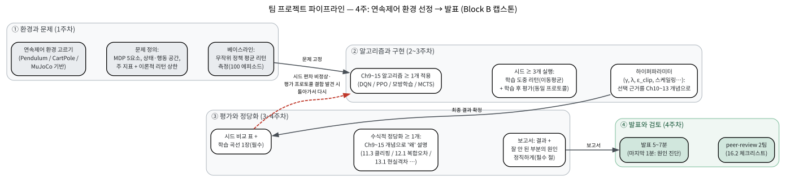

# 16.1 팀 프로젝트: 발표

[](https://colab.research.google.com/github/SuminHan/book-ml/blob/main/notebooks/ml2/chapter16_1_capstone_protocol.ipynb)

### 왜 지금 프로젝트를 하는가

Chapter 8의 Block A 캡스톤(8.1절)이 "코드가 동작한다"와 "내가 문제를 설계하고
평가할 수 있다"의 차이에 대한 첫 답을 냈다면 — 팀이 환경을 고르고, 알고리즘을
구현하고, 시드 여러 번을 돌리고, 결과를 정직하게 보고하는 경험을 쌓았다는 뜻
이다. Chapter 9~15가 이제 두 번째 절반의 도구를 전부 손에 쥐어준 상태다: 표 대신
신경망(DQN[^dqn]), 정책을 직접 학습(REINFORCE, PPO[^ppo]), 시연·선호로부터 배우기
(모방학습), 물리 시뮬레이션(MuJoCo[^mujoco], Isaac Sim[^isaacsim]), 트리 탐색(MCTS[^mcts]).
16.1은 **Chapter 8과 쌍(pair)인 절**이다 — Block A와 정확히 같은 절차
(환경 고르기 → 구현 → 시드 프로토콜 → 수식적 정당화 → 정직한 발표)를
완전히 다른 무대(연속제어 + 신경망)에서 다시 집행하는 것이다.


8.1절과의 차이를 한 장으로 정리하면:

| | Block A (8.1) | Block B (이 절) |
|---|---|---|
| 환경 | 표 기반(이산 상태·행동) | 연속제어(연속 상태·행동) |
| 알고리즘 | 2개 이상(Q-learning vs SARSA 등) | 1개 이상(DQN / PPO / 모방학습 / MCTS) |
| 평가 프로토콜 | \\(\varepsilon=0\\)(greedy) 에피소드 | 결정적 실행 \\(a=\mu\\) 에피소드 |
| 1시드 계산 예산 | 초~분 단위 | 약 20~30초(Pendulum, 12만 스텝) ~ 시간 단위(MuJoCo) |
| 시드 \\(\geq 3\\) 프로토콜 | 동일 | 동일 |
| 베이스라인(무작위 정책) | 동일 | 동일 |

왜 알고리즘 수는 "2개 이상"에서 "1개 이상"으로 줄어드는가? Block A에서는
두 번째 알고리즘이 갱신 규칙 한 줄의 차이(6.3절)였는데, Block B에서는
각 알고리즘이 별개의 신경망 학습 파이프라인이다 — DQN은 리플레이 버퍼와
타깃 네트워크가, PPO는 GAE[^gae]와 클리핑이, 모방학습은 시연 데이터셋이 따라온다.
팀 단위 현실적 예산은 "한 파이프라인을 제대로 돌리고, 여유가 있으면 비교"다.
**변하지 않는 것이 핵심이다** — 시드, 베이스라인, 평가 분리는 알고리즘과
무관한 "강화학습 실험의 골격"이라 Block A와 동일하다.

> **역사: 왜 진자인가.** Pendulum은 OpenAI 생태계의 오픈소스
> 라이브러리(baselines → stable-baselines)[^gym] 시대부터 연속 제어의 "hello
> world"였다 — 라이브러리의 PPO 튜토리얼 표준 예제가 Pendulum이었고,
> 11.2절의 PPO 논문(Schulman et al., 2017)[^ppo]은 같은 계열의 클래식
> MuJoCo 연속 제어 과제(Swimmer, Hopper 등)에서 알고리즘을 검증했다.
> Pendulum은 그 과제들 중 "가장 작은" 구성원이다 — 3차원 상태, 1차원
> 행동, 에피소드 종료도 목표 상태도 없는 "매 스텝 균형해야 하는"
> 보상이 연속 제어의 본질적 어려움을 최소 분량에 담는다. 첫 연속제어
> 과제로 Pendulum을 고르는 것은 "쉬워서"가 아니라 **그 보상 구조가
> 학습 곡선 위에서 '정책이 지금 무엇을 하고 있는지'를 가장 선명하게
> 보여주기 때문**이다.


### 프로젝트 구조

- **환경**: PyBullet[^pybullet] 또는 Gymnasium[^gymnasium]의 연속제어 환경(Pendulum,
  MuJoCo 기반 로봇 환경 등) 중 하나를 고른다.
- **적용**: Chapter 9~15 중 최소 하나의 방법(DQN, PPO, 모방학습, 또는
  MCTS)으로 정책을 학습시킨다.
- **필수 요구사항 — 수식적 정당화 최소 1개**: 예를 들어 (1) PPO를
  썼다면 Chapter 11.3의 클리핑이 학습 안정성에 미친 영향을 클리핑
  있음/없음 비교로 제시, (2) 모방학습을 썼다면 Chapter 12.1의 복합
  오차가 실제로 관찰됐는지(전문가 데이터 분포 밖 상태에서 성능이
  떨어지는지) 확인, (3) 도메인 무작위화[^domainrandomization]를 적용했다면 Chapter 13.1의
  현실 격차 논의와 연결지어 효과를 설명.
- Chapter 8과 마찬가지로, 학습 곡선(에피소드에 따른 누적 보상 변화)을
  반드시 제시한다 — 지도학습의 손실 곡선에 해당하는, 강화학습에서
  "학습이 실제로 되고 있는가"를 보여주는 기본 증거다.

**환경 고르는 실전 가이드.** 8.1절처럼 후보에 기준을 매겨 점수를 매기면
팀 회의가 쉬워진다. Block B에서 기준으로 쓰이는 것은: (1) **상태·행동
공간의 차원** — 차원이 높으면(예: HumanoidStandup은 348×17) 학습
예산이 급격히 커진다. (2) **보상 구조** — "항상 음수(0이 목표)"형
(Pendulum)과 "희소(목표 도달 시에만)"형(Chapter 13.1의 Reacher)은
"좋은 정책의 모습" 자체가 달라서 평가 지표의 의미를 달리한다. (3)
**시뮬레이션 격차가 보일 만큼 물리적으로 풍부한가** — 13.1의
도메인 무작위화를 제시하려면 Pendulum처럼 단순한 환경은 격차가
나오지 않는다(MuJoCo 로봇이 적합). (4) **코드 재사용성** — Chapter
11.2의 PPO 코드가 거의 그대로 적용되는가.

| 환경 | 상태 × 행동 | 보상 구조 | 에피소드 | 잘 어울리는 비교/개념 |
|---|---|---|---|---|
| **Pendulum-v1** | 3 × 1 (연속) | \\(r=-\theta^2-0.1\dot\theta^2-0.001a^2\\) (항상 음수, 0=완벽) | 200 스텝 | PPO(Ch11)의 클래식 페어링 — 클리핑 효과(11.3) |
| **CartPole-v1** | 4 × 2 (이산) | 생존 시 스텝당 −1, 쓰러지면 종료 | 500 스텝 | DQN(Ch9) vs PPO — 이산 행동·연속 상태 |
| **MountainCar-v0** | 2 × 3 (이산) | 스텝당 −1 (희소) | 200 스텝 | 희소 보상 + 긴 지평 — GAE의 \\(\lambda\\) 트레이드오프(11.3)가 드러나는 곳 |
| **HumanoidStandup-v5** | 348 × 17 (연속) | 포텐셜 기반 shaping(Ch14) | 1000 스텝 | 시뮬레이션/도메인 무작위화(13.1), MuJoCo 경험(Ch14) |

"잘 어울리는" 열의 논리가 중요하다 — **환경과 알고리즘은 "검증하고
싶은 개념이 돋보이는 무대"가 무엇인가를 기준으로 짝을 이루어서
골라야 한다.** 11.3의 클리핑(있음/없음)을 발표하고 싶으면 연속
행동 공간에서 클리핑이 실제로 발동하는 Pendulum이 맞고, 13.1의
도메인 무작위화를 발표하고 싶으면 격차가 생길 만큼 물리적으로
풍부한 MuJoCo 환경이 맞고, 12.1의 복합 오차를 발표하고 싶으면
전문가 시연 데이터셋이 있는 모방학습 과제여야 한다. "PPO를 쓰고
싶으니까 환경을 뭐로 하지?"는 순서가 틀린 질문이고, "개념 X를
테스트하고 싶은데 무대는?"이 올바른 질문이다.

### 베이스라인: 무작위 정책의 리턴을 먼저 재자

M1 제출물의 핵심 숫자다. 8.1절 M2에서 요구했던 것과 같은 이유 —
"배운 정책이 실제로 무작위보다 나은가"를 판정할 **제로점**이 없으면
"개선됐다"고 말할 수 없다. Pendulum-v1에서 매 스텝 무작위 토크를
내는 정책(100 에피소드, 실습 노트북)의 평균 리턴은 **−1274.1
(sd 300.0)**, 대략 [−1800, −760] 구간에 분포한다.

두 가지를 읽어야 한다. **첫째, "0"과 "좋음"의 거리가 표 기반 환경보다
훨씬 크다.** 8.1절의 CliffWalking에서는 무작위가 −5000, 학습 후
−13으로 400배 격차였지만, Pendulum에서는 "좋음"이 0이고 무작위가
이미 −1274다 — "0에 다가가는가"가 유일한 목표가 되고, **0까지의
거리 자체가 지표**가 된다. **둘째, 아무것도 하지 않는 정책이 생각보다
나쁘지 않다.** 토크를 항상 0으로 고정(zero-torque)하면 평균 리턴이
약 −1230으로, 무작위와 같은 등급이다. 즉 "학습 곡선이 −1200 부근에서
시작한다"는 사실은 학습의 증거가 전혀 안 되고, 이 두 숫자(무작위
−1274, 무작위 토크 0 −1230)를 먼저 재야 "PPO가 −673"이라는 숫자에 대한
판단(무작위의 절반)이 성립한다.

### 비교 프로토콜: 연속제어 버전

8.1절 §"비교 프로토콜"의 세 항목(시드 ≥3, 학습 중/학습 후 분리, 시드별
표)을 연속제어로 번역한다. 첫 번째와 세 번째는 그대로이며, 두 번째가
번역된다 — 실습 노트북은 이 프로토콜을 한 흐름으로 실행한다.

**1. 학습 시드 \\(\geq 3\\)개.** 8.1절과 동일한 이유로: 시드를 바꾸는
것은 "실험을 다시 하는" 것이 아니라 "우연인지 재검사하는" 것이다.
PPO는 초기화·샘플링·데이터 분할에 무작위성이 겹쳐, 같은 코드를
시드만 바꿔도 학습 곡선의 모양이 달라진다(11.2절: "큰 그림(완만한
상승)은 시드마다 안정적"이긴 해도 마지막 10에피소드 평균은
±100~200 흔들린다는 주의).

**2. 학습 도중 성과 vs 학습 후 평가 — "\\(\varepsilon=0\\)"의 번역
문제.** 표 기반의 \\(\varepsilon\\)-greedy에는 깔끔한 핸들이 있었다:
평가 때 \\(\varepsilon=0\\)으로 하면 정책이 "순수 탐욕적"이 된다.
연속 정책은 정규분포 \\(a\sim\mathcal{N}(\mu\_\theta(s),\\,\sigma\_\theta^2)\\)로
\\(\varepsilon\\)이라는 핸들이 없다. 대응 원리는:

- **학습 도중(샘플) 평가**: 학습 중과 같은 \\(a=\mu+\sigma z\\)로
  실행 — 탐험 노이즈가 섞인 성과.
- **학습 후(결정적) 평가**: \\(a=\mu\_\theta(s)\\)만 내보내고
  샘플링을 하지 않는 실행 — **이것이 연속제어의 "greedy 평가"
  대응물**이다.

왜 "a=μ"가 "\\(\varepsilon=0\\)"의 대응인가? \\(\varepsilon\\)-greedy에서
\\(\varepsilon\\)의 역할은 "확률 \\(\varepsilon\\)로 아무 행동이나
한다"는 것이었고, 정규분포 정책에서 "아무 행동"에 해당하는 것은
샘플링 노이즈 \\(z\\)다. 그것을 빼면 "정책의 최선 추측" \\(\mu\\)만
남는다. (\\(\sigma\\) 자체는 학습되는 파라미터이고, 11.2절의 엔트로피
보너스가 그것을 0으로 쪼그라들게 하지 않으려 브레이크 역할을 하므로,
평가 때 \\(\sigma\\)를 0으로 바꿔 학습하는 것이 아니라 **파라미터를
그대로 두고 샘플링만 하지 않는 것**이 정직한 "탐험 제거"다.)

**3. 알고리즘/시드별 숫자를 표로 제시.**

실습 노트북(Ch11.2의 PPO를 그대로, \\(\gamma=0.99\\),
\\(\lambda=0.95\\), \\(\epsilon\_{\text{clip}}=0.2\\), lr=3e-4,
시드당 300반복 × 400스텝 = 12만 스텝, 시드 0/1/2, 평가 50 에피소드)의
결과는:

| 시드 | 학습 도중 마지막10 | 학습 후 결정적 \\(a=\mu\\) | 학습 후 샘플 \\(a\sim\mathcal{N}\\) |
|---|---|---|---|
| 0 | −673.5 | −1357.9 | −1287.6 |
| 1 | −732.3 | −1454.2 | −1399.4 |
| 2 | −668.3 | −1398.2 | −1367.0 |
| (베이스라인) | — | — | 무작위 −1274.1 (100 에피소드) |

이 표는 **세 번** 읽어야 하고, 세 번째가 이 절의 핵심이다.

**읽기 1 — 학습 도중 곡선은 정말 올랐다.** 시드별 마지막 10에피소드
(−673/−732/−668)가 첫 10(−777/−866/−914) 대비 15~27% 개선됐고,
무작위 베이스라인 −1274보다 대략 2배 낫다. 이 숫자만 보면
"학습 성공"이다.

**읽기 2 — 시드 간 편차가 있지만 방향은 일관된다.** 마지막 10의 시드
간 격차는 약 65(−668~−732)로 "같은 모양" 범위이며, 11.2절의
주의(큰 그림은 시드마다 안정적)대로 경향이 재현된다.

**읽기 3 — 학습 후 결정적 평가가 베이스라인 아래다.** 세 시드의
\\(a=\mu\\) 평가 평균은 약 **−1403**으로, 무작위 정책(−1274)
**아래**다. 즉 연속제어에서는 "학습 곡선이 올랐다"와 "배운 정책이
무작위보다 낫다"가 **서로 다른 두 문장**이다. 왜인가? 학습 도중
리턴은 "탐험 노이즈 \\(\sigma\\)가 섞인 채" 측정한 것이어서, PPO의
\\(\sigma\\) 샘플링이 가끔 운 좋게 진자를 높이 스윙하게 만든
에피소드가 평균에 들어간다(11.2절 FAQ의 "에피소드 리턴 *자체*의
분산은 줄일 수 없다"가 정확히 이것). 노이즈를 빼면 12만 스텝으로는
\\(\mu\\)가 상태별로 아직 정확하지 않아, 결정적 정책은 "대충 그럴듯한
범위로 스윙하는" 수준(아무것도 하지 않는 정책 ≈ −1230과 같은 등급)에
머문다. 이것은 버그가 아니라 **12만 스텝이라는 학습 예산의 한계를
정직하게 측정한 것**이며, Chapter 13~14가 로봇 시뮬레이션에
수백만 스텝 예산을 계획하는 이유가 바로 이 격차다.

이것이 실습 그림의 우측 패널이 "같은 정책 세 개, 측정 방식 네 가지"를
한 장에 그리는 이유다 — 좌측 패널의 "학습 곡선 상승"은 우측 패널을
읽기 전까지는 **결론이 아니다**.


**하이퍼파라미터 선택의 주의.** "학습 곡선이 예뻐질 때까지
\\(\gamma\\)/\\(\lambda\\)/\\(\epsilon\_{\text{clip}}\\)를 조한다"는 것은
지도학습에서 "val 곡선이 예뻐질 때까지 조정한다"는 것과 같은 역할
(ML1 Chapter 6.2)이다 — 그 자체로 정당한 모델 선택이지만, (a) 어떤
곡선(학습 도중 리턴의 이동평균)을 보고 고르기로 정한 것을 보고서에
**기록**하고, (b) 최종 결정적 평가는 선택된 파라미터로 **한 번만**
돌려야 한다. "결정적 평가가 예뻐질 때까지" 조정하는 것은 평가에 대한
과적합(ML1 6.2의 "test는 한 번만" 원칙)이다.

### 전체 그림: 4주 파이프라인

프로젝트의 진행 순서를 한 장으로 그리면 8.1절의 파이프라인과
대칭이다. 왼쪽에서 오른쪽으로 **환경 → 알고리즘·구현 → 평가·정당화
→ 발표**로 흘러가며, 각 박스가 Block B의 어느 절에서 배운 원칙을
집행하는지 함께 적었다. 붉은 점선(평가 → 구현·실험)이 핵심이다 —
시드 간 편차가 비정상적으로 크거나 평가 프로토콜의 결함이 발견되면
**돌아가서 다시** 돌려야 한다는 뜻이다. Block A와 마찬가지로,
"한 번 지나가면 돌아올 수 없는" 것은 최종 발표뿐이고 그 외 모든
단계는 되돌아갈 수 있다.



### 일정과 마일스톤

4주(각 주 = 수업 3회)는 8.1절의 마일스톤과 같은 골격으로 나뉜다.
**마일스톤 M1~M4가 제출물**이다.

| 주 | 해야 할 일 | 마일스톤(제출) |
|---|---|---|
| 1 | 환경 후보 2~3개 조사(상태·행동 차원, 보상 구조, 학습 예산), 팀 회의, **문제 정의 문서**: MDP 5요소(Ch3.1), 주 지표와 리턴의 이론적 범위, **베이스라인(무작위 정책) 리턴 측정** | **M1** 문제 정의 + 환경 선택 + 베이스라인 숫자(1페이지) |
| 2 | Ch9~15 강의 코드 재사용으로 알고리즘 ≥1개 구현, **시드 1개에서 엔드투엔드 동작 확인**(Pendulum 12만 스텝 ≈ 20~30초), **학습 예산 추정**(100만 스텝에 몇 분, 시드 3개에 몇 분) | **M2** 중간코드 리뷰(코드 + 베이스라인 + e2e 숫자) |
| 3 | 나머지 시드 실행, 하이퍼파라미터 조정(모두 동일한 프로토콜로), **학습 후 평가(결정적 \\(a=\mu\\), 시드마다 동일한 에피소드 수)**, 학습 곡선과 시드 비교 표 도출 | **M3** 학습 곡선 1장 + 시드 비교 표 |
| 4 | 수식적 정당화 작성, 보고서·발표 슬라이드 완성, **발표(5~7분)**, **peer-review 2팀** | **M4** 보고서 + 발표 + 리뷰 2건 |

8.1절과 달리 **M2에 "학습 예산 추정"이 들어가는 이유**를 생각해보자.
Block A(표 기반)에서는 1에피소드가 1초라 예산이 문제되지 않았지만,
Block B에서는 Pendulum 12만 스텝이 CPU에서 22초인 반면 MuJoCo
대형과제의 100만 스텝은 수 시간이다 — **계산을 시작하기 전에
"이 실험이 얼마나 걸리는가"를 계획하는 것 자체가 방법론의 정직성
에 포함된다.** M2의 엔드투엔드가 기대보다 늦게(예: Pendulum이
10분 이상)라면, 그냥 기다리는 것보다 버그를 먼저 확인하는 것(스텝
당 텐서 변환의 반복, CPU 스레드 수)이 정직한 대응이다 — 11.2절
코드 자체가 22초 안에 끝난다는 것은 "22초가 정상"이라는 기준선이
있다는 뜻이다.


### 손으로 한 번: "수식적 정당화"의 좋은 예와 나쁜 예 비교하기

어떤 팀이 Pendulum 환경에 PPO를 적용해 "학습이 잘 됐다"고 발표한다고
하자. Chapter 11.2에서 스크래치패드로 실행 검증한 실제 결과는 다음과
같았다:

```
처음 10 에피소드 평균 리턴:  -1551.7
마지막 10 에피소드 평균 리턴: -1092.2
```

**나쁜 설명**: "학습 곡선이 올라갔다. PPO가 잘 작동했다."

**좋은 설명**: "12만 스텝(300 iteration) 동안 평균 리턴이 -1551.7에서
-1092.2로 약 30% 개선됐다 — 다만 완전히 수렴한 수준(Pendulum의 이론적
최적 리턴에 가까운 값)은 아니고, 여전히 개선 여지가 있다. 이 개선은
보상을 1/8로 스케일링하고 \\(\gamma=0.95\\), \\(\lambda=0.9\\)로
조정한 뒤에야 나타났다 — Chapter 11.3에서 배운 GAE의 \\(\lambda\\)가
편향-분산 트레이드오프를 조절한다는 사실이, '왜 하이퍼파라미터를
그렇게 골랐는지'에 대한 답이 된다. 처음 시도(보상 스케일링 없음,
\\(\gamma=0.99\\))에서는 오히려 성능이 나빠졌는데, 이는 Chapter
11.1에서 배운 대로 어드밴티지 추정의 분산이 너무 커서 클리핑이
그 노이즈를 충분히 걸러내지 못했기 때문으로 추정된다."

두 설명은 같은 방향(개선됨)을 말하지만, 좋은 설명은 (1) 정확한 수치,
(2) 완전히 수렴하지 않았다는 사실을 숨기지 않는 정직함, (3) 왜 그
하이퍼파라미터를 선택했는지에 대한 이론적 근거까지 담고 있다 — 이것이
이 학기 프로젝트가 요구하는 "수식적 정당화"의 실제 의미다.

(참고: §"비교 프로토콜"의 실습 노트북 숫자(시드 0에서 처음 10
−777.2 → 마지막 10 −673.5)는 이 예시와 **다른 실행**이다 —
여기서는 11.2절의 기본 파라미터(보상 스케일링 없음)를 그대로 쓰고,
이 예시의 팀은 그 뒤에 스케일링과 \\(\gamma\\)·\\(\lambda\\) 조정을
추가한 실행이다. 두 실행 모두 "개선됐지만 완전히 수렴한 것은
아니다"라는 같은 모양을 보이며, 이것이 12만 스텝 예산의 Pendulum
결과의 **일반적** 모습이다.)

### 보고서 구조 (M4)

8.1절의 보고서 골격을 연속제어로 번역한다 — 발표 슬라이드 = 보고서의
각 절 제목.

1. **문제 정의** (0.5p): 환경(MDP 5요소, Ch3.1) — 상태·행동 공간의
   차원과 범위, 전이, 보상(이론적 리턴 범위 포함), 할인율, 주
   지표(학습 후 결정적 평가의 평균 리턴), 베이스라인(무작위 정책
   리턴).
2. **알고리즘 선택과 이유** (1p): 적용한 알고리즘과 **왜 이 환경을
   이 알고리즘에 골랐는가**(§"환경 고르는 실전 가이드"의 "무대"
   논리), 하이퍼파라미터(\\(\gamma\\), \\(\lambda\\),
   \\(\epsilon\_{\text{clip}}\\), 보상 스케일링 등)와 선택
   근거(Ch10~13 개념)[^suttonbarto].
3. **실험 프로토콜** (1p): 시드 목록, 학습 예산(반복 수 × 스텝 수),
   **평가 프로토콜(결정적 \\(a=\mu\\), 에피소드 수, 모든 시드에
   동일) 명시**, 하이퍼파라미터 선택 절차(어떤 곡선으로, 어떤
   기준으로)를 쓴다. 이 절이 없으면 §"비교 프로토콜" 위반이므로
   16.2절 체크리스트에서 바로 감점된다.
4. **결과** (1p): 시드 비교 표, 학습 곡선 1장(여러 시드를 한 그림에
   얇은 선으로), **"같은 정책 여러 측정" 패널**(실습 그림 우측
   형태 — 학습 도중/결정적/베이스라인).
5. **수식적 정당화** (1p): Chapter 9~15의 개념(\\(\geq 1\\)개)으로
   "왜 이 결과가 나왔는지" — §"손으로 한 번"의 좋은 예 문체로.
6. **잘 안 된 부분과 원인 진단** (0.5p): **필수** 절. 잘 안 된
   부분이 없었으면 "무엇을 시도했다가 안 됐는가"를 쓴다 — 8.1절과
   같은 규칙. "모두 잘 됐다"는 보고서는 이 절이 비어 있다는 뜻이다.

### 채점 기준 (rubric)

8.1절의 rubric과 같은 우선순위를 유지한다.

| 항목 | 비중 | 좋은 답 |
|---|---|---|
| 문제 정의와 환경 | 15% | MDP 5요소·상태/행동 차원·지표·베이스라인·리턴 이론 범위가 명확하고, 환경 선택이 "개념 X가 돋보이는 무대" 논리로 근거됨 |
| 방법론 적절성 | 20% | Ch9~15의 알고리즘이 환경 특성(연속/이산, 보상 희소성)에 맞았고, 하이퍼파라미터 근거가 배운 개념으로 설명됨 |
| 실험 프로토콜의 정직성 | 25% | 시드 ≥3, 동일 평가 프로토콜(결정적, 동일 에피소드 수), 베이스라인, 예산과 선택 절차가 보고서에서 추적 가능 |
| 수식적 정당화 | 20% | 배운 개념 ≥1개로 "왜"를 설명했고, 그 설명이 실제로 관측한 숫자와 일치 |
| 결과의 정직성과 반성 | 20% | 불안정했던 시드·구간, 베이스라인 이하의 평가치를 숨기지 않고 Ch9~15 개념으로 진단 |

"실험 프로토콜의 정직성"과 "결과의 정직성과 반성"이 절반을 차지하는
이유는 8.1절과 동일하다 — 이 프로젝트의 목적이 "좋은 정책을 만든
것"이 아니라 **그 성능 숫자를 정직하게 얻는 절차를 실제로 수행한
것**을 증명하는 것이다. 결정적 평가가 베이스라인을 넘지 못해도
프로토콜이 정직하고 정당화가 타당하면 높은 점수를 받고, 반대로
숫자가 예뻐도 시드 1개였다면 "실험 프로토콜의 정직성"에서 크게
감점된다 — 16.2절에서 다른 팀을 리뷰할 때도 정확히 이 우선순위로
본다.

### 자주 하는 실수

Block B 프로젝트에서 반복해서 보이는 실수 5가지 — 각각이 Chapter
9~15의 어떤 원칙을 깨는지 짚어두면, 16.2절에서 다른 팀을 리뷰할
때 "반박 가능한 질문"으로 바로 바꿀 수 있다.

- **시드 1개 실험으로 결론**: 11.2절의 주의대로 같은 PPO 코드를
  시드만 바꿔도 마지막 10에피소드 평균이 ±100~200 흔들린다 — 이
  절의 실습표(마지막 10이 −668~−732)는 그 범위의 실제 예다.
  알고리즘/방법 간 차이가 시드 간 표준편차보다 작으면 결론은
  "유의미한 차이 관측 불가"다. 리뷰 질문 예: "시드를 몇 개로
  확인했어요? 시드 간 sd가 방법 간 차이보다 커요?"
- **학습 도중 리턴을 "최종 정책 성과"로 보고하기**: 이 절 실습표의
  핵심 함정 — 학습 도중 마지막 10(−673~−732)은 베이스라인보다 2배
  낫지만, 그것은 \\(\sigma\\) 샘플링 노이즈가 섞인 "탐험 포함
  성과"다(11.2절 FAQ). "학습 곡선이 올라갔다"를 "정책이 잘
  학습됐다"로 번역하는 순간, §"비교 프로토콜" 읽기 3의 격차
  (결정적 −1403 vs 베이스라인 −1274)가 사라진다.
- **결정적 평가가 예뻐질 때까지 하이퍼파라미터 조정**: 학습 곡선
  (학습 도중 리턴)으로 조정하는 것은 val로 모델 선택하는 것과
  같은 정당한 행위인데, **최종 평가치**를 보며 조정하면 평가에
  과적합(ML1 6.2 "test는 한 번만")이 된다. 선택 기준을 보고서
  §"실험 프로토콜"에 사전 기록하는 것이 구분선이다.
- **베이스라인 없이 "잘 배웠다"고 발표**: 무작위 정책의 평균 리턴
  (−1274)을 재지 않고 "결정적 평가 −1400, 꽤 좋은 숫자"라는 발표
  — 그 숫자가 무작위보다 *나쁜* 것인지조차 모르는 것이다.
  zero-torque(≈−1230)까지 함께 재면 "이 정책이 아직 아무것도
  하지 않는 정책보다 나은가"라는 질문의 기준선 두 개가 생기는
  데, 이 기준선이 없으면 "개선"의 방향 자체를 말할 수 없다.
- **"결정적 평가가 샘플 평가보다 낮은 건 버그"로 오해**: 결정적
  \\(a=\mu\\)가 샘플 \\(a\sim\mathcal{N}\\)보다 낮은 것은
  **정상**이다 — 전자는 "탐험 운을 빼고 본 정책의 본래 실력",
  후자는 "탐험이 가끔 운 좋게 잘 해준 성과"다. 두 격차의 크기는
  "정책이 탐험 운에 얼마나 의존하는가"의 측정값이며(11.2절의
  엔트로피/탐험 논의와 연결), 격차가 작아질수록 정책이 자기
  \\(\mu\\)만으로 서 있다는 증거다.

### 발표

팀당 5~7분: 문제 정의(환경 설명, 1분) → 적용한 알고리즘과 이유(2분) →
학습 곡선과 수식적 정당화(2~3분) → 잘 안 됐던 부분과 원인 진단(1분).
8.1절과 동일하게, "최종 결정적 리턴이 얼마였다"보다 "왜 이 알고리즘을
이 환경에 골랐고, 왜 이 결과가 나왔는지"를 설명하는 쪽에 더 높은
점수를 준다.

발표의 마지막 1분("잘 안 됐던 부분")이 **가장 평가받는** 부분이다 —
§채점 기준의 "결과의 정직성과 반성" 항목이 정확히 여기를 본다.
이 절의 실습 숫자를 그대로 발표한 예를 들면:

> "PPO를 시드 3개로 12만 스텝 학습했다. 학습 도중 마지막 10에피소드는
> −673/−732/−668로 무작위 베이스라인(−1274)보다 2배 정도 낫다.
> **다만** 학습 후 결정적(\\(a=\mu\\)) 평가는 −1358/−1454/−1398로
> 베이스라인 *아래*였다 — 11.2절 FAQ의 '에피소드 리턴 자체의 분산은
> 줄일 수 없다'대로, 학습 도중 숫자에는 \\(\sigma\\) 샘플링의 운이
> 섞여 있었고, 노이즈를 빼면 12만 스텝으로는 \\(\mu\\)가 상태별로
> 아직 정확하지 않다는 진단이다. 13~14절의 수백만 스텝 원리를
> 근거로, 예산 10배 실행을 계획하고 있다."

"실패에 가까운 실험"까지 **배운 개념으로 해석한** 발표가 더 높은
점수를 받는다는 원칙은 8.1절에서 그대로 이어진다 — "모든 것이 잘
됐다"는 발표는 이 항목에서 스스로 감점을 받는 것이다.

### 실습: 캡스톤 프로토콜을 한 흐름으로 코드로 돌려보기

[실습 노트북](https://colab.research.google.com/github/SuminHan/book-ml/blob/main/notebooks/ml2/chapter16_1_capstone_protocol.ipynb)
(제목 바로 위의 Colab 배지)에서 이 절의 전체 절차를 Pendulum-v1
하나에 압축해서 통과시켜본다:

1. **(M1) 문제 정의** — Pendulum-v1의 MDP: 관찰 3차원
   `[cosθ, sinθ, θ̇]`, 행동 1차원 토크 [−2, +2] Nm, 200스텝,
   보상 \\(r=-\theta^2-0.1\dot\theta^2-0.001a^2\\)의 이론적
   범위(상한 0).
2. **베이스라인** — 무작위 정책 100에피소드(−1274.1, sd 300).
3. **(M2) 구현** — Chapter 11.2의 `ActorCritic` + GAE 코드를
   재사용(8.1절 FAQ "코드를 처음부터 써야 하나요?"의 답과 같은
   이유).
4. **(M3) 시드 0/1/2** — 같은 파라미터(\\(\gamma=0.99\\),
   \\(\lambda=0.95\\), \\(\epsilon\_{\text{clip}}=0.2\\))로 12만
   스텝씩 학습(시드당 약 20~30초), 학습 도중 리턴 비교.
5. **학습 후 평가** — 세 정책을 (a) 결정적 \\(a=\mu\\), (b) 샘플
   \\(a\sim\mathcal{N}(\mu,\sigma)\\)로 각각 50에피소드 평가하고
   베이스라인과 비교.
6. **발표 자료용 한 장** — 좌: 시드별 학습 곡선, 우: "같은 정책,
   측정 방식 네 가지" 막대(§"비교 프로토콜" 표의 그림 버전).

이 6단계가 곧 §"보고서 구조"의 6개 절과, 다시 16.2절의
체크리스트로 매핑된다 — 8.1절의 문장을 그대로 쓰면, **같은
절차를 세 가지 언어(코드, 보고서, 리뷰)로 말할 수 있어야** 이
프로젝트가 끝난 것이다.

### 확인 문제: 프로젝트 절차를 개념으로 묻기

각 문항은 이 절의 절차와 Chapter 9~15의 개념을 동시에 확인한다.

**1.** 실습에서 시드 0의 학습 도중 마지막 10에피소드는 −673.5
(베이스라인 −1274보다 2배 낫지만), 결정적 평가는 −1357.9
(베이스라인 *아래*)다. 11.2절 FAQ의 "에피소드 리턴 자체의
분산은 줄일 수 없다"와 8.1절 확인 문제 3의 "학습 과정의 무작위성
vs 측정 오차" 구분을 근거로, 어느 쪽이 "배운 정책의 진짜
성능"이고 어느 쪽이 "탐험 운이 섞인 성과"인가? 보고서의 **주
지표**로 무엇을 써야 하는가, 왜인가?
> 답: 결정적(\\(a=\mu\\)) 평가가 "탐험을 뺀 정책의 본래 실력" —
> 8.1절의 \\(\varepsilon=0\\) greedy 평가에 해당한다. 학습 도중
> 리턴은 \\(\sigma\\) 샘플링이 섞여 운 좋게 높은 에피소드가
> 평균에 포함되므로 "탐험 포함 성과"다. 주 지표는 결정적 평가가
> 되어야 한다 — 평가의 목표가 "정책의 안정적인 성능"이지
> "학습 과정이 얼마나 잘 봤는가"가 아니기 때문이다. 다만 학습
> 곡선은 **학습이 실제로 되고 있었는가**의 증거(16.2절 "탐험-활용
> 균형" 항목이 보는 것)이고, "주 지표 + 학습 곡선"을 **역할을
> 구분해 함께** 보고하는 것이 §"보고서 구조" 결과 절의 4패널
> 요구의 이유다.

**2.** "8.1절에서는 ε을 0으로 해서 평가하잖아. 연속 정책에는 ε이
없으니, 평가할 때 \\(\sigma\\) 파라미터를 0으로 설정해서 돌리면
되지 않겠어?" — 왜 이 제안이 오답이고, 정답은 무엇인가?
> 답: 정책의 \\(\sigma\\)는 **학습된 파라미터**다. \\(\sigma=0\\)로
> 바꾸고 돌리는 것은 "원래 정책에서 탐험을 제거한 실행"이 아니라
> "파라미터를 바꾼 *다른* 정책의 실행"이 된다(11.2절에서
> \\(\sigma\\)는 엔트로피 보너스와 함께 학습 대상이었으므로).
> 정답은 파라미터를 그대로 두고 **행동을 \\(a=\mu\_\theta(s)\\)
> (평균)으로 내보내는 것** — "같은 정책을 샘플링 없이 실행"하는
> 것이 \\(\varepsilon=0\\)과 동일한 역할을 한다.

**3.** 어떤 팀이 "PPO의 결정적 평가가 −900으로 베이스라인(−1274)
보다 30% 개선됐다"고 발표했다. 16.2절의 체크리스트를 근거로
던져야 할 질문 2가지를 만들고, 각각이 체크리스트의 어떤 항목에
해당하는지 짚어라.
> 답: (a) "시드를 몇 개로 확인했나요? 시드별 숫자는요?" — *실험
> 프로토콜의 정직성* 항목: 11.2절의 주의(±100~200)와 이 절
> 실습표(시드 간 65)가 보여주듯, 1시드의 −900은 우연일 수 있다.
> (b) "결정적 평가는 몇 에피소드로 잤나요? 베이스라인은 몇
> 에피소드로?" — *결과의 정직성* 항목: 이 절 실습에서 50에피소드
> 결정적 평가의 시드당 sd가 186~239로 매우 커서, 평가 에피소드 수
>가 적으면 그 크기 안의 차이가 측정 오차와 구별할 수 없다 —
> 8.1절 확인 문제 3의 "고정된 정책의 성능을 재는 측정 오차"와
> 같은 구조다. (추가로 "학습 예산(스텝 수)은
> 같았나요?" — 12만 스텝과 100만 스텝을 비교하는 것은 알고리즘
> 비교가 아니라 예산 비교다.)

**4.** 실습에서 12만 스텝 학습이 1시드당 약 22초 걸렸다. 100만
스텝(약 8.3배) 학습을 시드 3개로 돌리려면 대략 몇 분인가? 이
계산은 §"일정과 마일스톤"에서 M2에서 하는 것이지 M3에서 하는
것이 아니어야 하는 이유는?
> 답: 22초 × 8.3 ≈ 3분(1시드) → 시드 3개 + 평가 ≈ 10분 내외.
> 계산이 M2인 이유는 M3의 "남은 시드 실행"이 **예산 계획 없이는
> 시작할 수 없기** 때문이다 — 10분이면 괜찮지만, 같은 계산을
> Humanoid(수백배 예산)에 적용하면 수 시간이 되고, 그제서야
> "새벽에 돌리자/시드를 줄이자/반복을 줄이자"의 결정을 내리게
> 된다. "얼마나 걸리는가"는 실험 설계의 일부이지 행정 절차가
> 아니다.

### 자주 묻는 질문

**Q. 학습이 전혀 수렴하지 않았는데 발표해도 되나요?** 된다 — 위
예시처럼 "완전히 수렴하지 않았다"는 사실 자체를 정직하게 보고하고
원인을 진단하는 것이 부풀린 성공 스토리보다 훨씬 좋은 발표다.
Chapter 11.2의 실제 실습에서도 처음 시도는 오히려 성능이 나빠졌었다
— 무엇을 바꿔서 개선했는지의 과정 자체가 배운 것을 보여준다.

**Q. 두 알고리즘의 성능이 거의 같으면 어떻게 발표하나요?** ML1
Chapter 8.1과 ML2 Chapter 8.1의 같은 조언이 여기도 적용된다 — 성능이
비슷하다는 것 자체가 흥미로운 관찰이다. 학습 도중 성능과 학습 후
평가 성능을 나눠서 비교하면, 겉보기엔 비슷해 보여도 다른
트레이드오프를 만들고 있다는 것을 발견할 수 있다.

**Q. 연속제어에서는 시드 몇 개까지 돌리는 것이 정석인가요?** 8.1절
FAQ의 답(비용 vs 안정성의 절충)이 그대로 적용되되, "비용"의 크기가
달라진다 — Pendulum 12만 스텝은 1시드당 20~30초라 **3~5개가
현실적 하한**이고, MuJoCo 대형과제는 1시드당 수 시간이라 3개
하한 + GPU 배정을 고려한다. 숫자보다 중요한 것은 8.1절의 문장
그대로다: 시드 간 표준편차와 방법 간 차이를 **비교**해서 결론을
내는 것.

**Q. PPO가 12만 스텝으로는 베이스라인도 못 넘기면 어떻게
하나요?** 이 절의 실습 결과가 정확히 그것이다(결정적 평가 ≈ −1403
vs 베이스라인 −1274) — **이것이 예외가 아니라 일반**이다.
Pendulum은 "완전 수렴에 100만 스텝 이상"이 필요한 과제
(13~14절). 프로젝트의 성공 기준은 "좋은 정책"이 아니라 "정직한
절차 + 정당화"이며, "결정적 평가가 베이스라인 아래였지만, 11.2절
FAQ와 13~14절의 예산 원리로 진단했고 재확인 계획을 세웠다"는
보고서가 "잘 학습됐다"는 평가 프로토콜 없는 주장보다 항상
높은 점수를 받는다.

**Q. 강의의 torch 코드가 아니라 라이브러리(stable-baselines3 등)를
써도 되나요?** 된다 — 8.1절 FAQ "코드를 처음부터 직접 써야
하나요?"의 논리가 그대로: 강의 코드 재사용이 기본이고, 라이브러리
재용도 허용된다. 단, 보고서에서 (a) **그대로 쓴 부분**(라이브러리
기본값)과 (b) **팀이 바꾼 부분**(환경 인터페이스, 학습 예산,
\\(\gamma\\)/\\(\lambda\\), 평가 프로토콜)을 구분해야 한다 —
(b)가 실질적 산출물이며, "라이브러리 기본값을 그대로 썼습니다"만
으로는 방법론 적절성 점수의 근거가 되지 않는다.

이 주제를 더 깊이 다루는 자료: [^cs234]

[^dqn]: Mnih, V. et al. (2015). "Human-level control through deep reinforcement learning." Nature 518, 529–533. (Earlier preprint: Mnih, V. et al. (2013). arXiv:1312.5602.)
[^ppo]: Schulman, J. et al. (2017). "Proximal Policy Optimization Algorithms." arXiv:1707.06347.
[^gae]: Schulman, J. et al. (2015). "High-Dimensional Continuous Control Using Generalized Advantage Estimation." arXiv:1506.02438.
[^suttonbarto]: Sutton, R. S., Barto, A. G. (2018). "Reinforcement Learning: An Introduction" (2nd ed.). MIT Press. 저자 공식 무료 공개: http://incompleteideas.net/book/the-book-2nd.html
[^cs234]: Stanford CS234: Reinforcement Learning. https://web.stanford.edu/class/cs234/
[^gym]: Brockman, G., Cheung, V., Pettersson, L., Schneider, J., Schulman, J., Tang, J., Zaremba, W. (2016). "OpenAI Gym." arXiv:1606.01540.
[^mujoco]: Todorov, E., Erez, T., Tassa, Y. (2012). "MuJoCo: A physics engine for model-based control." IEEE/RSJ International Conference on Intelligent Robots and Systems (IROS 2012). DOI: 10.1109/IROS.2012.6386109.
[^mcts]: Browne, C. B., Cowling, P. I., White, M., et al. (2012). "A Survey of Monte Carlo Tree Search Methods." IEEE Transactions on Computational Intelligence and AI in Games 4(1), 1–43. MCTS 방법론을 체계적으로 정리한 대표적 서베이 — "Monte-Carlo Tree Search"라는 이름과 선택·확장·평가·역전파의 표준 4단계 체계가 이 무렵 확립되었다.
[^gymnasium]: Towers, M., Kwiatkowski, A., Terry, J., Balis, J. U., et al. (2024). "Gymnasium: A Standard Interface for Reinforcement Learning Environments." arXiv:2407.17032 (NeurIPS Datasets and Benchmarks 2025). 소프트웨어 공식 문서: https://gymnasium.farama.org/
[^domainrandomization]: Tobin, J. et al. (2017). "Domain Randomization for Transferring Deep Neural Networks from Simulation to the Real World." IROS 2017. arXiv:1703.06907.
[^pybullet]: Coumans, E., Bai, Y. (2018). "PyBullet, a GPU accelerated physics engine for robot learning." IEEE/RAS IROS 2018.
[^isaacsim]: Isaac Sim의 GPU 물리 시뮬레이션 코어(이전 세대 제품명 Isaac Gym)를 소개한 논문: Makoviychuk, V. et al. (2021). "Isaac Gym: High Performance GPU-Based Physics Simulation For Robot Learning." arXiv:2108.10470.
