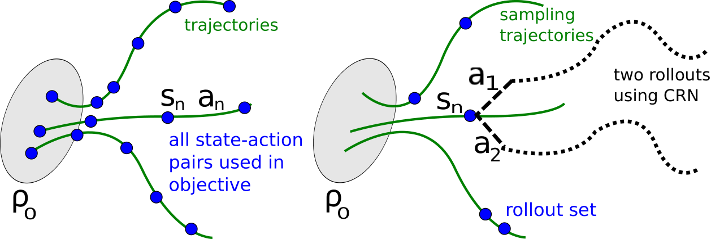

# 16.3 ML2 총정리와 학기를 넘어서

[](https://colab.research.google.com/github/SuminHan/book-ml/blob/main/notebooks/ml2/chapter16_3_one_mdp_four_paths.ipynb)

이 절은 Chapter 8.3과 같이 **새로운 개념이 하나도 없는 절**이다. 하는
일은 네 가지다 — (1) Block B 프로젝트(16.1 발표, 16.2 Peer-Review)가
수렴해 온 **채점 기준**을 확정한다, (2) **같은 작은 MDP를 네 가지
경로로 풀어** "모두가 같은 방정식을 푸는 구조"를 숫자로 확인한다,
(3) 준비도를 스스로 재는 **자가진단**을 준다, (4) 학기 이후로 이어지는
지도(§"학기를 넘어서")를 그린다. 이 절의 모든 문장은 이번 학기 13개
장의 요약이다 — 한 문장이라도 막히면 그 장·절 번호로 돌아가는 것이
복습이 아니라 *정확한* 복습이다.

### 프로젝트 채점 기준 (rubric): Block B 3주가 수렴하는 곳

16.1은 발표의 요구사항을, 16.2는 리뷰의 체크리스트를 주었다. 둘이
결국 수렴하는 채점 기준은 다음과 같다 — 8.1의 rubric이 그대로 이어져
오면서 "Ch4~7의 개념"이 "Ch9~15의 개념"으로 교체된 것이 전부다:

| 항목 | 비중 | 좋은 답이란 |
|---|---|---|
| 문제 정의와 환경 | 15% | 상태·행동·보상이 명확히 정의되고(물리적 단위까지, Ch13), 환경 선택이 Ch9~15의 개념 검증 목적에 근거함 |
| 알고리즘 적절성 | 20% | 환경 특성(이산/연속 행동, 보상 희소성, 모델 유무)에 알고리즘이 맞고, 그 근거가 Ch9~15의 개념으로 설명됨 |
| 실험 프로토콜의 정직성 | 25% | 시드 ≥3, 학습 곡선과 최종 평가(탐험 끔) 분리, 베이스라인(무작위 정책, 또는 사람이 설계한 PD 제어 같은 정책), \\(\varepsilon\\)·\\(\gamma\\)·\\(\lambda\\)·클립 \\(\epsilon\\) 감수성 실험이 보고서에서 추적 가능 |
| 수식적 정당화 | 20% | 배운 개념 \\(\geq 1\\)개로 "왜"를 설명(11.3의 클리핑, 12.1의 복합 오차, 13.1의 도메인 무작위화, ...)했고, 그 설명이 실제로 관측한 숫자와 일치함 |
| 결과의 정직성과 반성 | 20% | 불안정했던 시드·구간을 숨기지 않고, 원인을 Ch9~15의 개념으로 진단함(16.1의 좋은/나쁜 예시 기준) |

"정직성" 항목이 **합계 45**%를 차지하는 이유는 Block A와 같다 —
프로젝트의 목적이 "좋은 정책을 만든 것"이 아니라, **"그 정책의 성능
숫자를 정직하게 얻는 절차"를 실제로 수행했음을 증명하는 것**이기
때문이다. greedy 평가가 −1100이 나와도 프로토콜이 정직하고 정당화가
타당하면 높은 점수를 받고, "수렴했다"고 주장해도 시드가 1개였다면
"실험 프로토콜의 정직성"에서 크게 감점된다 — 8.1에서 "한 번의 실행은
아무것도 말해주지 않는다"로 배운 것과 정확히 같은 문장이, 이번에는
연속 제어·신경망 환경에서 다시 쓰인 것이다. 16.2에서 다른 팀을
리뷰할 때 보던 5개 항목이 이 표의 열 *그대로*인 이유도 여기에 있다:
리뷰어와 채점자는 같은 눈으로 본 것이다.

### 손으로 한 번: Peer-Review rubric을 직접 써보기

이번 학기 두 번(8.2, 16.2) 심사위원 역할을 해보았다. 여기서는 관점을
한 단계 더 뒤집어, **너가 채점자라면 무엇을 봐야 하는지 rubric을
직접 쓰는 연습**을 한다.

위의 5개 항목을 그대로 두고, 각 항목에 대해 두 칸을 채워본다 —
(1) **나쁠 때는 어떤 모습인가**(구체적 나쁜 패턴), (2) **그걸 시험하는
질문은 무엇인가**(16.2 의미의 반박 가능한 질문). 예로
"결과의 정직성과 반성" 행만 채워 보여준다:

| 항목 | 나쁠 때 (구체적 패턴) | 시험하는 질문 (반박 가능) |
|---|---|---|
| 결과의 정직성과 반성 | 보고서에 최고 점수 시드 하나만 실려 있음. 학습 곡선이 매끄럽고 불안정 구간 설명이 없는데, 학습 로그(코드 출력)를 보면 300 iteration 중 150~200 구간에서 리턴이 갑자기 내려간 기록이 있음 | "로그의 150~200 iteration 구간 리턴 추락을 보고서의 학습 곡선에서 왜 볼 수 없나요? 그 구간을 자르면 곡선이 매끄러워지나요?" — 실제로 다시 돌려봐야 답할 수 있는 질문 |

나머지 4행은 팀 회의에서 채워보는 과제로 남긴다(발표 직전 30분
분량). 이 연습 자체의 채점 기준은 16.2의 "구체적인가" 3단계
그대로다 — "나쁨 = 불성실"이라고 쓰는 것은 1점(감상평)이고,
그날 발표실에서 *실제로 낚일 수 있는 패턴*을 쓴 것은 3점이다.
"나쁠 때의 모습"을 쓸 수 있으려면 "좋은 답이란"을 이미 정확히
이해하고 있어야 하므로, 이 30분 연습은 학기 전체를 가장 빨리
재검증하는 방법이기도 하다.

### 하나의 MDP를 네 경로로: 숫자로 보는 학기 중간고사

이 절 후반에 "두 과목을 관통하는 구조(모델 정의 → 수치화 → 개선)
3단계"를 다시 쓰겠다. 그 구조는 이번 학기 13번, 13가지 모양으로
들었을 것이다. 다시 읽기 전에 *숫자*로 한 번만 보자 — **같은 작은
MDP를 Chapter 4~6의 네 가지 경로로 풀어**, 네 경로가 "같은 답, 또는
설명 가능한 다른 답"에 도달하는 것을 확인하는 것이다. 실습 노트북이
이 네 경로의 학습 곡선을 코드로 재현한다.

MDP는 8.3절 템플릿 ②에서 썼던 "달리거나 쉬거나" 예(3-state,
\\(\gamma = 0.9\\))를 쓴다: 상태 **S**(시작), **G**(골),
터미널 **T**.

- **S**에서: *run* — 0.7 확률로 G로, 0.3 확률로 S로 미끄러짐,
  보상 0. *rest* — S에 남음, 보상 −1(한 스텝 낭비 비용).
- **G**에서: *collect* — T로 전이, 보상 +3.
- **T**: 터미널.

**경로 ① (모델 기반, Ch4): 벨만방정식을 손으로 푼다.** +3을 받는
유일한 길은 G에서 collect이므로 \\(V^\*(G) = 3\\). S에서는 run이
최선이라는 가정 하에(후보 추측):

\\[V^\*(S) = 0.9\big(0.7 \times 3 + 0.3\\,V^\*(S)\big)
= 1.89 + 0.27\\,V^\*(S)
\\;\\;\Longrightarrow\\;\\;
V^\*(S) = \frac{1.89}{0.73} \approx 2.589\\]

검증(후보+검증의 Step 3):

\\[Q^\*(S,\text{run}) = 2.589 \\;>\\; Q^\*(S,\text{rest})
= -1 + 0.9 \times 2.589 = 1.330 \\;\\;\checkmark\\]

후보가 성립하므로 참값은 \\(V^\*(S) = 2.589, \\; V^\*(G) = 3.0\\).

**경로 ② (모델 프리, Ch5): 몬테카를로로 추정한다.** greedy 정책
(run@S, collect@G)으로 에피소드를 끝까지 roll-out하고, 실제 리턴
\\(G\_t\\)를 그대로 목표값으로 쓴다(첫방문 MC). 4000 에피소드로
\\(V(S) \approx 2.594\\) — 참값과 0.2% 차이. MC는 **편향이 없다**
(실제 실현된 리턴의 기댓값이 정확히 \\(V^\pi\\)이기 때문에) —
"충분히 많이 돌리면"이라는 약속은, 이 예에서는 정말로 지켜진다.

**경로 ③ (모델 프리, Ch6 on-policy): SARSA[^suttonbarto].** TD 오차로 갱신하되,
다음 행동 \\(a'\\)도 *실제 행동 정책(ε-greedy)*이 고른 것을 쓴다.
여기서 이번 학기의 핵심 드라마가 시작된다: **SARSA는 최적값이
아니라 "탐험하는 행동 정책의 값"을 배운다.** \\(\varepsilon = 0.3\\)를
*고정*하면, 학습된 값은 \\(V^\*\\)가 아니라 ε-greedy 행동정책
\\(\pi\\)의 값 \\(V^\pi\\)에 수렴한다 — 상태값 \\(V^\pi(S)\\)는
\\(\approx 2.29\\)로 수렴하고, 이 ε=0.3 greedy 정책의
\\(V^\pi(S)\\)를 해석적으로 풀면 정확히 \\(2.292\\)다.
**2.589가 아니라 2.29.** (참고로 이 시점의 \\(Q(S,\text{run})\\)
자체는 \\(\approx 2.53\\)이다 — 2.29가 아니라 2.53인 이유는,
\\(\pi\\)가 15%의 확률로 rest를 실제로 고르기 때문에
\\(V^\pi(S) = 0.85\\,Q^\pi(S,\text{run}) + 0.15\\,Q^\pi(S,\text{rest})\\)
가 run 행동 하나뿐 아니라 *실제 선택 분포*까지 반영해 더 낮아지기
때문이다.) 이 0.297의 간극은 버그가 아니라 *기능*이다 —
"ε-greedy가 30%의 시간을 미끄러지며 낭비한다"는 사실이 가치에
반영된 것(6.3절의 CliffWalking에서 "학습 도중 리턴이 오히려 나쁜"
SARSA의 근원이 정확히 여기다). \\(\varepsilon\\)을 감쇠시키면
(매 에피소드 0.995배 같은 스케줄) \\(V^\pi\\)는 \\(V^\*\\)에
가까워진다 — \\(\varepsilon \to 0\\)이면 행동정책이 greedy로
수렴하므로, 실습에서 ε 감쇠 SARSA는 2.589로 끝난다.

**경로 ④ (모델 프리, Ch6 off-policy): Q-learning.** 갱신식에
\\(\\max\\)을 써서, 행동 정책이 *실제로 무엇을 했든* "다음에서는
최선을 고른다면"을 목표값으로 삼는다. 그래서 행동 정책과 무관하게
*최적* Q에 직접 수렴한다 — 시뮬레이션(2000 에피소드, ε을 0.05까지
감쇠) 결과 \\(Q(S,\text{run}) \approx 2.64, \\; Q(S,\text{rest})
\approx 1.34, \\; Q(G,\text{collect}) = 3.0\\) — 참값
(2.589, 1.330, 3.0)에 근접.

| 경로 | 장 | 무엇을 쓰는지 | \\(V(S)\\) 추정/수렴값 | 수렴 대상 |
|---|---|---|---|---|
| ① 동적계획법 (손계산) | Ch4 | 전이 모델 \\(P\\) | 2.589 | 최적값 \\(V^\*\\) (정확) |
| ② 몬테카를로 | Ch5 | 에피소드 전체 리턴 | 2.594 (4000 에피소드) | greedy 정책의 값 (편향 없음, 분산 큼) |
| ③ SARSA | Ch6 | 1스텝 TD 오차 (on-policy) | 2.29 (ε=0.3 고정) | *행동 정책* \\(\pi\\)의 값 \\(V^\pi\\) |
| ④ Q-learning | Ch6 | 1스텝 TD 오차 (off-policy) | 2.64 (2000 에피소드, Q(S,run)) | 최적값 \\(Q^\*\\) (근사) |

③과 ④의 갱신식은 *한 줄 차이*다 — 6.3절에서 "SARSA vs
Q-learning의 차이는 \\(\\max\\) 한 줄"이라 했지만, 그 한 줄이
**수렴하는 대상 자체를 바꾼다**:

```python
# SARSA (on-policy): 다음 행동 a_next는 ε-greedy가 실제로 고른 것
Q[s, a] += alpha * (r + gamma * Q[ns, a_next] - Q[s, a])
# Q-learning (off-policy): 실제로 무엇을 했든 "최선"을 목표로
Q[s, a] += alpha * (r + gamma * np.max(Q[ns])   - Q[s, a])
```

**왜 1개 MDP를 네 번 푸는가가 가치 있는가?** 단일 장에서는 보이지
않는 세 가지가 숫자로 드러난다. **(1) 목표가 다르면 답이
다르다** — ③과 ④는 갱신식이 한 줄(\\(Q[ns, a']\\) vs
\\(\max Q[ns]\\)) 다른 "1스텝 TD 오차" 구조를 쓰는데, 상태값
\\(V(S)\\)이 2.29와 2.589에 각각 수렴한다 — 간극이 정확히
\\(V^\* - V^\pi = 0.297\\), 앞 소절에서 해석적으로 계산한
"탐험의 가격" 그 자체다. on/off-policy는 취향이 아니라 *무엇을
물으느냐*의 차이(확인 문제 3의 "왜 PPO는 데이터를 재사용할 수
없는가"의 표 버전이다). **(2) 네 경로 모두 같은 방정식을 쓴다** — ①은
벨만방정식을 직접 풀고, ②는 우변의 미래 항을 *실제 실현*으로,
③④는 *한 스텝 예측 + 자기 추정*으로 대체한 것뿐이다. "미래의
불확실한 보상을 어떻게 수치화하느냐"라는 Block A의 질문이, 표와
신경망이라는 *형태*의 차이를 넘어 동일하게 성립함을 이 숫자들이
보여준다. **(3) 탐험의 비용이 측정된다** — ③의 0.297 간극은
"ε=0.3의 탐험이 리턴 기준으로 이만큼 값어치를 한다"는 숫자다.
Ch2에서 직관으로 시작한 탐험-활용 딜레마가, 여기에서
*측정 대상*이 되었다.

### ML2 개념 지도

| 장 | 배운 것 | 핵심 질문 |
|---|---|---|
| Ch02 | 멀티암 밴딧 | 상태 없이도 탐험-활용 딜레마를 어떻게 다루는가 |
| Ch03 | MDP | 강화학습 문제를 어떻게 수학적으로 정식화하는가 |
| Ch04 | 동적계획법 | 모델을 알 때 최적 정책을 어떻게 계산하는가 |
| Ch05 | 몬테카를로 | 모델 없이, 에피소드 결과만으로 어떻게 배우는가 |
| Ch06 | 시간차 학습 | 에피소드가 끝나길 기다리지 않고 어떻게 배우는가 |
| Ch07 | n-step/적격흔적/Dyna | MC와 TD 사이, 그리고 경험 재사용은 어떻게 하는가 |
| Ch09 | DQN[^dqn] | 표 대신 신경망으로 어떻게 Q-함수를 근사하는가 |
| Ch10 | 정책기반 RL | Q를 거치지 않고 정책을 직접, 연속공간에서 어떻게 학습하는가 |
| Ch11 | PPO[^ppo] | 정책이 한 번에 너무 멀리 움직이지 않게 어떻게 제한하는가 |
| Ch12 | 모방학습/RLHF[^rlhf] | 시행착오 대신 시연이나 선호로부터 어떻게 배우는가 |
| Ch13 | 로봇 시뮬레이션 | 물리 법칙이 지배하는 연속 제어 문제를 어떻게 다루는가 |
| Ch14 | MuJoCo[^mujoco]/Isaac Sim[^isaacsim] | 시뮬레이션의 정밀도와 속도를 어떻게 절충하는가 |
| Ch15 | MCTS[^mcts] | 완벽한 모델이 있을 때 미리 수를 어떻게 읽어보는가 |

두 과목을 관통하는 구조를 마지막으로 정리한다 — ML1을 들었다면
익숙한 결론일 것이고, ML2만 들었어도 이번 학기 13개 장에서 이미 충분히
확인했을 패턴이다:

1. **모델을 정의한다**: 상태를 행동(또는 그 확률분포)으로 매핑하는
   함수의 형태를 정한다(Q-테이블, 신경망 Q-함수, 정책 신경망, 게임
   트리, ...).
2. **틀린 정도(또는 목표와의 격차)를 수치화한다**: TD 오차, 정책
   그래디언트의 목적함수, PPO의 클리핑된 목적함수, MCTS의 승률
   통계, ... — 형태는 매번 다르지만 "지금이 얼마나 좋은가/나쁜가를
   수치 하나로 요약한다"는 역할은 항상 같다.
3. **그 수치를 개선하는 방향으로 파라미터(또는 탐색 방향)를
   조정한다**: 경사하강법, 또는 트리 탐색의 반복 — 이 학기 배운
   모든 알고리즘의 마지막 단계는 결국 이것이다.

앞의 "네 경로" 예는 이 3단계가 *같은 방정식* 위에서 어떻게 변주되는지
의 축소판이고, 이 지도는 그 변주들이 어떤 축을 따라 정렬되는지를
그려준다:

![Block B(Ch09~15) 개념 지도 — 중앙의 큰 질문: '정답 없이, 내가 만든 경험만으로, 로봇 스케일까지 배우는가?'. 위: 왜 신경망인가(Ch09~10) — 표가 폭발하는 연속/고차 상태공간 → 가치 기반(DQN: 리플레이 버퍼+타겟 네트워크, off-policy)과 정책 기반(REINFORCE → Actor-Critic, 연속 행동)의 갈림. 가운데: 어떻게 안정하게(Ch11~12) — PPO(클리핑·GAE)와, 시행착오 대신 배우는 모방학습(복합 오차/DAgger)·RLHF(선호→보상 모델→PPO). 아래: 어디에서 배우는가(Ch13~15) — 물리 시뮬레이션(sim-to-real·도메인 무작위화) → 엔진 절충(MuJoCo 정밀도 vs Isaac GPU 병렬) → 완전한 모델이 있을 때의 MCTS. 가로지르는 축: 편향-분산(λ, ε), 탐험(ε-greedy → UCT), on/off-policy(데이터를 누가 만들었는가), 모델 유무. 오른쪽: 학기 끝(16.1~16.3) — 하나의 환경에서 정직한 숫자로 증명](../../images/ch16_3_rl_concept_map.svg) [^gae]


이 지도의 읽기는 8.3의 Block A 지도와 같은 두 기법으로 한다.
**(1) 질문은 박스가 아니라 박스와 축의 *교차점*** — "DQN의 리플레이
버퍼가 왜 PPO에는 없는가"는 DQN 박스와 on/off-policy 축이 만나는
엣지를 묻는 질문이고, "GAE의 λ를 0.95로 올리면 어떻게 되나"는 PPO
박스와 편향-분산 축의 엣지다. **(2) 엣지가 곧 "왜"** — 박스 자체를
묻는 질문은 드물다. 발표·면접에서 반복적으로 나오는 것은
"신경망으로 바꾼 *이유*(Ch9, 표가 불가능해진 상태공간)",
"클립을 하는 *이유*(Ch11, 한 번의 업데이트가 정책을 망가뜨리는
방어)", "모방학습이 나빠지는 *이유*(Ch12, 분포 이동의 복합
오차)", "시뮬레이션 이후에 sim-to-real이 필요한 *이유*(Ch13,
현실 격차가 편이이기 때문)" — 같은 4개의 엣지다. 이 4개 엣지를
각각 한 문장으로 말할 수 있으면, 지도는 끝난 것이다.


### 확인 문제: 장을 넘나드는 복습 문제 4개

**1.** Chapter 2.2의 UCB[^ucb1]와 Chapter 15.2의 UCT[^uct]는 수식이 거의 똑같다.
무엇이 같고, 무엇이 다른가?
> 답: 둘 다 "지금까지의 평균 성과 + 덜 시도해본 정도에 대한 불확실성
> 보너스"라는 같은 형태(\\(\bar{X} + c\sqrt{\ln N / n}\\))를 쓴다.
> 다른 점은 적용 대상이다 — UCB는 밴딧의 팔(상태가 없는 단일 선택)
> 하나하나에 적용되지만, UCT는 게임 트리의 매 노드마다 독립적으로
> 적용되어 "각 국면에서 다음 수를 고르는" 문제를 반복해서 푼다.

**2.** Chapter 6.1의 TD 오차와 Chapter 10.3의 Actor-Critic은 어떤
관계인가?
> 답: Actor-Critic의 critic이 학습하는 신호가 바로 TD 오차다 —
> REINFORCE(Chapter 10.2)가 에피소드 전체의 리턴으로 그래디언트의
> 분산이 컸다면, Actor-Critic은 그 리턴을 TD 오차(한 스텝만 보고
> 계산한 어드밴티지 추정치)로 대체해 분산을 줄인다. Chapter 11.3의
> GAE는 이 TD 오차를 여러 스텝에 걸쳐 지수가중평균한 일반화다.

**3.** Chapter 9의 DQN(off-policy)이 리플레이 버퍼에 저장된 오래된
경험을 재사용할 수 있는 반면, Chapter 10~11의 REINFORCE·PPO는 왜
그럴 수 없는가(PPO는 부분적으로만)?
> 답: DQN은 Q-함수(정답이 정해진 값)를 배우는 것이라 "누가 그 경험을
> 만들었는지"와 무관하게 벨만 방정식이 성립한다 — off-policy다.
> REINFORCE는 정책 그래디언트 자체가 "지금 정책이 그 행동을 선택할
> 확률"에 의존하는데, 정책이 바뀌면 그 확률도 바뀌어 옛 데이터의
> 그래디언트가 더 이상 정확하지 않다 — on-policy다. PPO는 확률비
> \\(r\_t(\theta)\\)로 이 차이를 보정하고 클리핑으로 오차를 억제해서
> 데이터를 몇 에폭 정도는 재사용할 수 있게 만들지만, DQN처럼 완전히
> 오래된 경험까지 재사용하지는 못한다.

**4.** Chapter 12.1의 모방학습(행동 복제/DAgger[^dagger])과 Chapter 15.2의
MCTS는 둘 다 "에이전트가 직접 시행착오를 겪는 것의 대안"이다. 각각
무엇을 대신 활용하는가?
> 답: 모방학습은 **사람의 시연**(전문가가 실제로 어떻게 행동했는지)을
> 정답 삼아 지도학습으로 정책을 배운다. MCTS는 **완벽한 모델(규칙)로
> 만든 가상의 시뮬레이션**을 반복해서, 실제로 행동하기 전에 결과를
> 미리 들여다본다. 둘 다 "환경과 직접 부딪히며 배우는" 표준적인
> 강화학습보다 안전하거나 효율적이지만, 전자는 사람의 시연 데이터가,
> 후자는 정확한 모델(규칙)이 있어야 한다는 전제가 필요하다.

### 복습 자가진단: 20문항

발표(16.1)를 앞두고, 그리고 졸업 후 면접 자리에서 "이 학기
배운 것을 한 문장으로"를 요구받기 전에 10분 만에 돌릴 수 있는
자가진단이다 — 8.3의 20문항과 같은 형식으로, 각 문항에 대해
**10초 안에 한 문장으로 답을 말할 수 있으면 O, 막히면**✗를 표한다.
18개 이상이면 준비 완료, 15~17이면 ✗가 모인 장 위주로 그 장의
"자주 하는 실수"와 확인 문제를 다시, 12~14이면 §"네 경로"의
수식(TD 오차, 클리핑된 목적함수)을 손으로 다시 유도하고, 12개
미만이면 §"자주 하는 실수(총정리판)"를 건너뛰지 않는다.

| # | 한 문장 질문 | 장 |
|---|---|---|
| 1 | DQN의 타겟 네트워크는 왜 매 스텝 갱신하면 안 되는가 | Ch09 |
| 2 | 리플레이 버퍼가 해결하는 문제와, DQN에서만 가능한 이유를 한 문장으로 | Ch09/06 |
| 3 | TD 오차를 Q로 표기하시오 | Ch06/09 |
| 4 | REINFORCE와 TD 갱신의 차이를 한 문장으로 | Ch10 |
| 5 | baseline 차분이 왜 편향을 만들지 않는가 | Ch10 |
| 6 | PPO의 클리핑이 막는 "나쁜 일"은 무엇인가 | Ch11 |
| 7 | 정책 그래디언트가 왜 on-policy여야 하는가(한 문장) | Ch10/11 |
| 8 | GAE의 \\(\lambda\\)가 0이면/1에 가까우면 각각 무엇이 되는가 | Ch11 |
| 9 | 행동복제가 "복합 오차"로 나빠지는 메커니즘을 한 문장으로 | Ch12 |
| 10 | DAgger가 복합 오차를 피하는 방식은? | Ch12 |
| 11 | RLHF에서 "정답"이 아니라 무엇으로 레이블을 얻는가 | Ch12 |
| 12 | 로봇 정책을 실물이 아니라 시뮬레이션에서 학습하는 이유 두 가지 | Ch13 |
| 13 | 현실 격차가 "잡음"이 아니라 "편이"라는 말이 뜻하는 것 | Ch13 |
| 14 | 도메인 무작위화 범위가 넓은 것이 항상 좋은 것이 아닌 이유 | Ch13 |
| 15 | MuJoCo와 Isaac Sim의 트레이드오프를 한 문장으로 | Ch14 |
| 16 | AlphaZero[^alphazero]가 정책 네트워크와 가치 네트워크를 *둘 다* 쓴 이유 | Ch15 |
| 17 | UCT의 탐색 항이 "시도 횟수"로 무엇을 쓰는지 | Ch15/02 |
| 18 | MCTS가 동적계획법과 다른 점 — "모델"을 어떻게 쓰는지 | Ch15/04 |
| 19 | 이번 학기 모든 알고리즘의 공통 3단계를 쓰시오 | 전체 |
| 20 | ML1(지도학습)과 ML2(RL)의 가장 큰 차이를 한 문장으로 | 전체 |

**답 (한 줄)**:

1. 목표와 추정치가 서로를 따라다니며 발산하기 때문 — 보스팅 불안정(9.2절)의 방치 버전.
2. 경험 재사용 + 연속 전이의 상관 깨기. 목표가 벨만방정식이므로 "누가 만들었는지"와 무관(off-policy, 확인 문제 3).
3. \\(\delta = r + \gamma Q(s',a') - Q(s,a)\\) — 최적을 추구하면 \\(a'\\) 자리에 \\(\max\\).
4. TD는 *Q 표(가치)를* 오차만큼 갱신하고, REINFORCE는 *행동 선택 확률(정책) 자체*를 \\(\nabla \log \pi \times\\) 리턴 방향으로 조정.
5. baseline \\(b(s)\\)이 행동 \\(a\\)에 무관하므로 \\(\mathbb{E}\_a[\nabla \log \pi(a|s)\\,b(s)] = b(s)\nabla \sum\_a \pi(a|s) = 0\\) — 분산만 줄고 편향은 0.
6. \\(r\_t(\theta)\\)가 1에서 크게 벗어나 한 업데이트에 정책이 "멀리 점프"해 좋은 정책을 망가뜨리는 것 — 클리핑은 점프 반경을 제한.
7. 그래디언트가 "현재 정책이 그 행동을 선택한 확률"에 의존 — 정책이 바뀌면 옛 데이터의 확률이 무효(확인 문제 3).
8. \\(\lambda = 0\\)이면 TD(0)(편향 있음, 분산 작음), \\(\lambda \to 1\\)이면 (유한 에피소드에서) MC 리턴(편향 없음, 분산 큼) — 7.2의 U자 같은 스펙트럼.
9. 에이전트가 전문가 데이터 분포 밖 상태에 들면 그 행동이 신뢰 불가 → 다음 상태가 더 벗어난 분포로 → 오차가 스텝마다 곱해짐(covariate shift).
10. *현재 정책*이 도달한 상태마다 전문가(oracle)가 정답 행동을 다시 물어 학습 — 학습 분포가 항상 "에이전트 자신의 분포"로 유지.
11. 사람의 *선호*(두 응답 중 어느 것이 나은지) — 선호 데이터로 보상 모델을 먼저 학습하고, 그 보상으로 PPO.
12. 실물에서의 시행착오가 (a) 비싸고 느리고 (b) 위험할 수 있음 — 시뮬레이션은 사실상 무한 데이터를 저비용으로.
13. systematic한 차이이므로 시뮬레이션 데이터를 늘려도 사라지지 않음 — ML1 Ch04의 bias-variance에서 "편이는 데이터로 안 줄고"의 강화학습 버전.
14. 실물에서 불가능한 극단 조건까지 포함하면 그 극단에 과적합되어 실물(범위 *내*의 한 점)에서 오히려 나빠짐 — 과적합의 거울상(13.1의 \\(\mu = 100\\) 예).
15. MuJoCo는 접촉·마찰 *정밀도*, Isaac은 GPU *병렬화*(수천 환경 동시) — 정밀도 대 규모.
16. 정책 네트워크는 "약속할 만한 수"로 탐색을 좁혀주어(선행 확률) 트리를 빠르게 성장시키고, 가치 네트워크는 각 국면을 "얼마나 좋은가"로 평가(절단 시 승률 추정) — 둘 중 하나만 있으면 탐색이 너무 느리거나 너무 무식함.
17. 그 수(에지)로 내려간 횟수 \\(n\\) — UCB의 \\(\sqrt{\ln N / n}\\)과 같은 형태(확인 문제 1).
18. DP는 *완전한 전이 모델*을 방정식 대입으로 "해"를 구하지만, MCTS는 모델을 *rollout(가상의 실제 경기)로 샘플링*해 승률 통계로 추정 — 모델의 "사용법"이 방정식 풀이 vs 시뮬레이션 반복.
19. ① 모델 정의(상태→행동/확률분포) ② 틀린 정도·목표 격차를 수치화(TD 오차, 목적함수, 승률 통계) ③ 그 수치를 개선하는 방향으로 파라미터·탐색 방향 조정.
20. ML1은 *다른이(데이터 수집자)가 만든 데이터와 정답*을 줘 맞히게 하고, ML2는 *에이전트가 행동해서 데이터를 스스로 만들고 정답 없이 보상만으로* 배운다 — "무엇을 데이터로 갖고, 무엇을 최적화하는가"의 답이 바뀌는 것.

### 자주 하는 실수 (총정리판)

- **"곡선이 올라갔다"로 "왜 올라갔는지"를 대체하기**: 16.1의
  나쁜/좋은 예시의 학기 전체 버전이다. "PPO로 학습했는데 리턴이
  좋아졌다"는 문장은 Ch11의 어떤 개념도 *사용*하지 않은 문장이다 —
  "보상 스케일링을 1/8로 해서 어드밴티지의 분산이 줄었고(11.1),
  λ=0.9로 편향-분산 트레이드오프를 조정한(11.3) 결과"까지가
  한 문장이면, 그 팀은 이 학기를 *통과*한 것이다.
- **"시뮬레이션에서 검증했다"로 "완료" 선언하기**: 13.1에서
  확인했듯 시뮬레이션 점수는 시뮬레이션 환경의 점수일 뿐이며,
  시뮬레이션 상위권 정책이 실물에서 꼴찌로 뒤집힐 수 있다.
  프로젝트 환경에 물리 파라미터(감쇠, 마찰)를 넣었다면, 그
  파라미터를 바꿔서 "순위 유지"가 성립하는지 확인한 팀/안 한 팀의
  점수는 rubric의 "방법론 적절성"에서 갈린다.
- **"PPO가 더 좋았다"를 조건 없이 쓰기**: 알고리즘 비교 결론에
  환경(연속/이산, 보상 구조), 시드 수, 하이퍼파라미터가
  붙지 않으면 그 문장은 *무효*다 — 8.2에서 "구체적으로 반박
  가능한 질문"의 반대편이, 발표 쪽에서는 "조건을 명시한
  결론"이다. "PPO가 더 좋았다"의 유효한 버전은 "Pendulum,
  시드 3개, 같은 총 스텝 수에서, PPO(λ=0.9)가 REINFORCE 대비
  에피소드당 리턴이 평균 12% 높고 시드 간 표준편차는 40% 작았다"
  수준이다.
- **"수렴했다"와 "좋다"를 혼동하기**: 8.3의 실수가 Block B
 에서도 그대로 유효하다 — 탐험이 부족한 상태의 Q값은 *틀린
  값으로 정확히* 수렴할 수 있고, 학습 곡선의 "평탄화"는
  수렴일 수도 있고 고착(stuck)일 수도 있다. 16.1의 Pendulum
  예(-1092, 이론적 최적으로는 멀다)는 "개선됐지만 수렴한 것은
  아니다"의 정직한 보고 예시다 — 평탄한 곡선을 보고 "수렴"과
  "고착"을 구별할 질문(시드 재실행, 탐험 증가, 더 긴 학습)을
  스스로에게 던질 수 있어야 한다.
- **자기 프로젝트의 실패를 복습 자료로 안 쓰기**: "이 실험의
  이상한 결과를 원인으로 진단하라"형 질문(발표 질의응답, 면접)에
  답할 자료는 정확히 16.1의 "잘 안 됐던 부분과 원인 진단"
  절이다. 자기 실험의 실패 한 건을 *개념으로 해석*한 능력은
  어떤 참고서로도 대체되지 않는다 — 20문항 자가진단의 ✗를
  채울 때, ✗ 문항과 "내 프로젝트에서 그 개념이 실제로
  부딪혔던 순간"을 한 줄씩 짝으로 적어두면, 그것이 이
  절의 산출물이다.

### 마지막 체크리스트: 학기 이후에 가져갈 세 가지

이 과목의 공식 목록은 13개 장이지만, 졸업하고 몇 년 뒤에 실제로
남는 것은 세 가지다 —

1. **"무엇을 데이터(경험)로 갖고, 무엇을 최적화하고 싶은가"라는
   질문의 습관.** 새로운 문제(운영 전략, A/B 테스트, 물리 설계,
   LLM 후학습)를 마주했을 때 "이것은 어떤 에이전트·어떤 보상·
   어떤 경험인가"로 *번역하는* 연습을 13번 한 것이 이 학기다.
   알고리즘 이름은 잊어져도 이 번역은 남는다 — ML1의
   "행의 단위, 정답의 유무" 질문과 쌍을 이루는, 문제
   정식화 기술의 절반이 완성된 것이다.
2. **정직한 숫자에 대한 기준.** 시드 ≥3, 학습/평가 분리,
   베이스라인, "완전히 수렴하지 않았다"는 문장 — 8.1에서 시작해
   16.1에서 반복된 프로토콜의 정직성이, 강화학습만이 아니라
   *모든* 실험 과학(ML1의 val/test 정직성과 같은 뿌리)의
   기본 문법이다.
3. **"같은 방정식, 다른 형태"의 지도.** §"네 경로"에서 확인했듯,
   이 학기의 알고리즘 13개는 3단계 구조의 13가지 변주에
   불과하다 — 그래서 새로운 알고리즘 논문을 만나도 "이것은
   ②번(수치화)을 바꾼 변주구나"에서부터 읽을 수 있다.
   개념 지도의 *엣지*를 말할 수 있는 한, 지도는 확장 가능한
   자산이고, 박스만 외운 한으로는 재고에 불과하다.

### 마지막으로 소개하는 RL·로봇공학 최신 동향

이번 학기에서 다루기엔 이르지만, 지금 활발히 연구되는 방향들을 짧게
짚어본다 — 자세한 내용보다는, "지금 배운 것이 이런 곳으로 이어질 수
있다"는 지도를 그리는 것이 목적이다.

- **오프라인 강화학습**(Offline RL)[^offlinerl]: 환경과 직접 상호작용하지 않고,
  이미 모아둔 방대한 로그 데이터만으로 정책을 학습하는 연구. 실물
  로봇으로 탐험하는 것 자체가 위험하거나 비싼 상황(자율주행, 의료)에서
  특히 중요하다 — Chapter 12의 모방학습과 문제의식이 비슷하지만, 시연이
  아니라 (좋은 것과 나쁜 것이 섞인) 임의의 로그 데이터로부터 배운다는
  점이 다르다.
- **범용 로봇 정책**(Generalist Robot Policies): 하나의 작업에만
  특화된 정책 대신, 다양한 로봇·작업에 걸쳐 일반화되는 하나의 큰
  정책을 학습하려는 시도(RT-2[^rt2], OpenVLA[^openvla] 등) — ML1에서 배운 LLM의
  사전학습 아이디어를 로봇 제어에 적용한 것에 가깝다: 방대한 로봇
  시연·상호작용 데이터로 먼저 폭넓게 학습시킨 뒤, 특정 작업에 맞게
  다듬는다.
- **Sim-to-Real의 발전**: Chapter 13.1에서 본 도메인 무작위화[^domainrandomization]를 넘어,
  시뮬레이션과 실제 환경의 차이 자체를 학습으로 메우려는 연구가
  계속되고 있다 — Chapter 14에서 본 GPU 가속 시뮬레이션(Isaac Sim
  등)이 "훨씬 많은 다양한 시뮬레이션 조건을 빠르게 경험시킨다"는
  방향으로 이 문제에 기여하고 있다.

이 과목을 마친 뒤 더 깊이 파고들고 싶다면, 각 장에서 "이 학기 범위를
넘어선다"고 언급됐던 부분들(TRPO[^trpo]의 상세 수학, DAgger의 수렴 증명[^dagger],
멀티에이전트 RL의 내쉬 균형, AlphaZero의 자기대국 학습 세부사항[^alphagozero] 등)이
자연스러운 다음 목표가 된다 — 이 학기가 그 개념들을 처음 마주쳤을 때
무섭지 않게 만드는 것이 목표였다면, 그다음은 각자의 관심에 따라 깊이를
더해가는 몫이다.



### 자주 묻는 질문

**Q. 16.3의 산출물은 무엇이고, 어떻게 채점되나요?**
두 개다. (1) §"손으로 한 번"의 rubric 표 4행("나쁠 때의 모습" +
"시험하는 질문"), (2) §"복습 자가진단" 20문항에서 본인이 ✗를
표한 것 중 3개를 골라, 각각 "말했어야 할 한 줄"을 *자기 언어로*
쓰는 것(8.3의 연습문제 5와 같은 형식). 자가진단의 ✗ 개수 자체는
점수가 되지 않는다 — ✗를 *자기 언어로 메운 문장*이 점수화
된다. 발표(16.1)가 "프로젝트를 정직하게 수행했는가"를,
Peer-Review(16.2)가 "남의 프로젝트를 구체적으로 심사를
했는가"를, 16.3이 "학기 전체를 자기 것으로 만들었는가"를
묻는 블록이다.

**Q. Block A(Ch8) 프로젝트와 Block B(본 장) 프로젝트의 차이 —
복습할 때 어디에 시간을 쓰면 되나요?**
요구사항의 형태가 바뀌었다: Block A는 표 기반 환경에서 "알고리즘
최소 2개 비교" + 개념 연결이면 충분했지만, Block B는 연속 제어·
물리 시뮬레이션 환경에서 "알고리즘 1개 + **수식적 정당화 1개**"다.
Ch9~15의 알고리즘은 전부 신경망 + 하이퍼파라미터가 핵심인
관계로, "어떤 알고리즘을 썼는가"보다 "**왜** 그
하이퍼파라미터(보상 스케일, \\(\gamma\\), \\(\lambda\\),
클립 \\(\epsilon\\))를 그렇게 골랐는가"가 점수의 대부분을
결정한다 — 복습의 무게중심도 따라서 "개념 나열"에서
"개념 → 내 실험의 숫자"를 잇는 연습으로 옮겨야 한다.
§"네 경로"의 표가 그 연결의 최소 단위의 예다.

**Q. 졸업 후 이어서 파고들면, 어떤 방향이 "자연스러운 다음"인가요?**
§"최신 동향"의 세 방향이 현재 산업/학계의 주류다 — 오프라인
RL(로그 데이터만 있는 실서비스가 기본 전제인 곳), 범용 로봇
정책(ML1의 대규모 사전학습 아이디어가 로봇으로 건너간 지점),
Sim-to-Real(13~14장이 다룬 문제의 정면 돌파). 학문적으로는 각 장
FAQ의 "이 학기 범위를 넘는다" 목록(TRPO의 수학, DAgger의
증명, 멀티에이전트 RL)이다. 공통 지름줄은 하나다 — 이 학기의
3단계 구조(모델 정의 → 수치화 → 개선)로 그 연구를 *자신만의
언어로 다시 정식화할 수 있는가*.

**ML1이 "정답이 있는 데이터로부터 배운다"는 세계였다면, ML2는 "스스로
행동해서 얻은 경험만으로 배운다"는 완전히 다른 세계였다 — 밴딧의
탐험-활용 딜레마에서 시작해 MDP, 동적계획법, 몬테카를로, 시간차
학습으로 이론을 다졌고, 신경망과 결합해 그 이론을 로봇 시뮬레이션이라는
현실적인 무대까지 끌고 왔다. 이제 이 두 세계 모두에서, "무엇을
데이터(또는 경험)로 갖고 있고, 무엇을 최적화하고 싶은가"라는 같은
질문을 던질 수 있을 것이다.[^cs234]**

[^dqn]: Mnih, V. et al. (2015). "Human-level control through deep reinforcement learning." Nature 518, 529–533. (Earlier preprint: Mnih, V. et al. (2013). arXiv:1312.5602.)
[^ppo]: Schulman, J. et al. (2017). "Proximal Policy Optimization Algorithms." arXiv:1707.06347.
[^gae]: Schulman, J. et al. (2015). "High-Dimensional Continuous Control Using Generalized Advantage Estimation." arXiv:1506.02438.
[^trpo]: Schulman, J. et al. (2015). "Trust Region Policy Optimization." ICML 2015. arXiv:1502.05477.
[^alphazero]: Silver, D., et al. (2017). "Mastering Chess and Shogi by Self-Play with a General Reinforcement Learning Algorithm." arXiv:1712.01815.
[^cs234]: Stanford CS234: Reinforcement Learning. https://web.stanford.edu/class/cs234/
[^dagger]: Ross, S., Gordon, G. J., Bagnell, J. A. (2011). "A Reduction of Imitation Learning and Structured Prediction to No-Regret Online Learning." ICML 2011. arXiv:1011.0686.
[^rt2]: Brohan, A., Brown, N., Carbajal, J., et al. (2023). "RT-2: Vision-Language-Action Models Transfer Web Knowledge to Robotic Control." arXiv:2307.15818.
[^rlhf]: Christiano, P. et al. (2017). "Deep reinforcement learning from human preferences." NeurIPS 2017. arXiv:1706.03741.
[^suttonbarto]: Sutton, R. S., Barto, A. G. (2018). "Reinforcement Learning: An Introduction" (2nd ed.). MIT Press. 저자 공식 무료 공개: http://incompleteideas.net/book/the-book-2nd.html
[^mujoco]: Todorov, E. (2012). "MuJoCo: A physics and control engine for model-based control." IROS 2012.
[^isaacsim]: Isaac Sim의 GPU 물리 시뮬레이션 코어(이전 세대 제품명 Isaac Gym)를 소개한 논문: Makoviychuk, V. et al. (2021). "Isaac Gym: High Performance GPU-Based Physics Simulation For Robot Learning." arXiv:2108.10470.
[^uct]: Kocsis, L., Szepesvári, C. (2006). "Bandit Based Monte-Carlo Planning." ECML 2006, pp. 282–293. (15.2절의 UCT 선택 규칙을 제안한 원 논문.)
[^openvla]: Kim, M. J. et al. (2024). "OpenVLA: An Open-Source Vision-Language-Action Model." arXiv:2406.09246.
[^domainrandomization]: Tobin, J. et al. (2017). "Domain Randomization for Transferring Deep Neural Networks from Simulation to the Real World." IROS 2017. arXiv:1703.06907.
[^offlinerl]: Levine, S., Kumar, A., Tucker, G., Fu, J. (2020). "Offline Reinforcement Learning: Tutorial, Review, and Perspectives on Open Problems." arXiv:2005.01643.
[^ucb1]: Auer, P., Cesa-Bianchi, N., Fischer, P. (2002). "Finite Time Analysis of the Multi-armed Bandit Problem." *Machine Learning* 47(2), 235–252. UCB1 전략을 제안한 원논문 — 2.2·8.3·15.1절의 동일한 인용을 재사용함. arXiv/Semantic Scholar 색인 시대 이전 결과라 API 확인 없이 추가.
[^mcts]: Browne, C. B., Cowling, P. I., White, M., et al. (2012). "A Survey of Monte Carlo Tree Search Methods." IEEE Transactions on Computational Intelligence and AI in Games 4(1), 1–43. MCTS 방법론을 체계적으로 정리한 대표적 서베이 — 15.1절의 동일한 인용을 재사용함. API 색인 확인 없이 추가.
[^alphagozero]: Silver, D. et al. (2017). "Mastering the game of Go without human knowledge." Nature 550(7676), 354–359. 순수 자기대국(self-play) AlphaZero의 원 논문(Ch15의 AlphaZero 논의가 다루는 Go 버전) — 15장 개요(chapter15.md)의 동일 인용을 재사용함.
